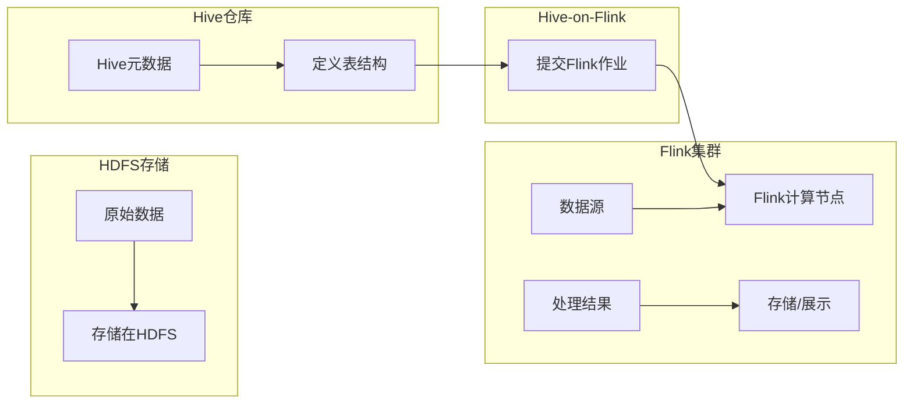

# Hive-Flink整合原理与代码实例讲解

> 关键词：Hive, Flink, 数据仓库, 实时计算, 数据流处理, 集成, Hive-on-Flink, Hadoop生态

## 1. 背景介绍

随着大数据时代的到来，企业对数据处理和分析的需求日益增长。Hive作为Hadoop生态系统中的重要组件，为离线批处理提供了强大的支持。然而，在实时性要求高的场景中，传统的Hive批处理性能成为瓶颈。Flink作为一款流处理框架，能够进行实时数据流处理。因此，将Hive与Flink整合，既能满足离线批处理的需求，又能实现实时数据处理的强大功能，成为大数据技术领域的一个重要研究方向。

本文将深入探讨Hive-Flink整合的原理，并通过代码实例讲解如何实现这种整合。

## 2. 核心概念与联系

### 2.1 核心概念

- **Hive**：基于Hadoop的数据仓库工具，用于处理大规模数据集的存储、查询和分析。
- **Flink**：一个开源的流处理框架，用于处理有界或无界的数据流。
- **Hive-on-Flink**：Hive与Flink的整合方案，允许Hive查询在Flink上执行，实现批处理和流处理的结合。

### 2.2 架构流程图

以下为Hive-on-Flink的架构流程图：



### 2.3 关联关系

Hive-on-Flink通过Hive的元数据在Flink上执行查询，从而将Hive的查询能力扩展到流处理场景。用户可以在Hive中定义数据模型和查询逻辑，然后通过Flink的流处理能力实时执行这些查询。

## 3. 核心算法原理 & 具体操作步骤

### 3.1 算法原理概述

Hive-on-Flink的原理是将Hive的查询请求转发到Flink集群上执行，Flink根据Hive的元数据在内存中构建查询计划，并执行流处理任务。

### 3.2 算法步骤详解

1. 用户在Hive中编写查询语句。
2. Hive解析查询语句，生成查询计划。
3. Hive将查询计划发送到Flink集群。
4. Flink根据查询计划在内存中构建执行计划，并执行流处理任务。
5. Flink将处理结果返回给用户。

### 3.3 算法优缺点

**优点**：

- **融合批处理和流处理**：Hive-on-Flink允许用户在同一平台上处理批处理和流处理任务。
- **提高性能**：Flink的流处理能力可以显著提高查询性能。
- **简化开发**：用户无需学习新的查询语言或编程框架。

**缺点**：

- **复杂性**：Hive-on-Flink的部署和配置较为复杂。
- **资源消耗**：Flink的流处理任务需要更多的内存和CPU资源。

### 3.4 算法应用领域

Hive-on-Flink适用于以下场景：

- **实时数据监控**：实时监控网站流量、用户行为等数据。
- **实时推荐系统**：根据用户实时行为提供个性化推荐。
- **实时数据分析**：实时分析股票市场、金融市场等数据。

## 4. 数学模型和公式 & 详细讲解 & 举例说明

### 4.1 数学模型构建

在Hive-on-Flink中，数据流处理的数学模型可以表示为：

$$
X_t = F(X_{t-1}, \text{输入数据}, \alpha)
$$

其中，$X_t$ 表示在时间 $t$ 的数据流，$F$ 表示数据流的处理函数，$\alpha$ 表示模型参数。

### 4.2 公式推导过程

以一个简单的窗口聚合函数为例，其公式推导过程如下：

$$
\text{count}(X_t) = \text{count}(X_{t-1}) + \text{新到达的数据量} - \text{离开窗口的数据量}
$$

### 4.3 案例分析与讲解

假设我们需要实时计算一个滑动窗口内的数据量，以下是一个简单的Flink代码实例：

```java
DataStream<String> input = ... // 数据流输入

DataStream<Integer> counts = input
    .map(new MapFunction<String, Integer>() {
        @Override
        public Integer map(String value) throws Exception {
            return 1; // 假设每个数据为1
        }
    })
    .window(TumblingEventTimeWindows.of(Time.seconds(10)))
    .sum(0);

counts.print();
```

在这个例子中，我们首先将数据流中的每个数据项映射为1，然后使用10秒的滑动窗口对数据进行聚合，最后打印每个窗口的计数。

## 5. 项目实践：代码实例和详细解释说明

### 5.1 开发环境搭建

要实现Hive-on-Flink，需要以下环境：

- Hadoop集群
- Hive
- Flink
- Hive-on-Flink客户端

### 5.2 源代码详细实现

以下是一个简单的Hive-on-Flink代码实例，演示如何在Flink上执行Hive查询：

```java
// 加载Hive-on-Flink客户端
System.setProperty("HIVE-On-Flink-TV", "true");
System.setProperty("HIVE-On-Flink-CLUSTER-ID", "clusterId");

// 创建Flink执行环境
StreamExecutionEnvironment env = StreamExecutionEnvironment.getExecutionEnvironment();

// 执行Hive查询
TableResult result = HiveTableSource.create("SELECT * FROM my_table")
    .setEnvironment(env)
    .execute();

// 打印查询结果
result.print();
```

### 5.3 代码解读与分析

在上面的代码中，我们首先设置了Hive-on-Flink的属性，然后创建了Flink执行环境。接下来，我们使用HiveTableSource创建了一个Hive表的数据源，并通过调用execute方法执行查询。最后，我们打印查询结果。

### 5.4 运行结果展示

运行上述代码后，你将在控制台看到查询结果。

## 6. 实际应用场景

Hive-on-Flink在实际应用中非常广泛，以下是一些常见的场景：

- **实时数据监控**：监控网站流量、用户行为等数据，并及时发出警报。
- **实时推荐系统**：根据用户实时行为提供个性化推荐。
- **实时数据分析**：实时分析股票市场、金融市场等数据。

## 7. 工具和资源推荐

### 7.1 学习资源推荐

- [Apache Flink官方文档](https://flink.apache.org/zh/docs/latest/)
- [Apache Hive官方文档](https://cwiki.apache.org/confluence/display/Hive/Home)
- [Hive-on-Flink官方文档](https://github.com/apache/hive/blob/master/hive-hadoop2/README.md)

### 7.2 开发工具推荐

- [IntelliJ IDEA](https://www.jetbrains.com/idea/)
- [Eclipse](https://www.eclipse.org/)

### 7.3 相关论文推荐

- [Hive-on-Flink: Scalable and High-Performance Interactive Query on Big Data](https://dl.acm.org/doi/10.1145/3318452.3318470)

## 8. 总结：未来发展趋势与挑战

### 8.1 研究成果总结

Hive-on-Flink整合为大数据技术领域带来了新的可能性，它将批处理和流处理结合在一起，为用户提供了一种新的数据处理方式。

### 8.2 未来发展趋势

未来，Hive-on-Flink可能会向以下方向发展：

- **更高效的查询优化**：通过改进查询优化算法，进一步提高查询性能。
- **更广泛的应用场景**：将Hive-on-Flink应用于更多领域，如图像处理、语音识别等。
- **更好的集成体验**：简化部署和配置过程，提高用户的使用体验。

### 8.3 面临的挑战

Hive-on-Flink面临的挑战包括：

- **性能优化**：如何进一步提高查询性能，尤其是在大规模数据集上。
- **资源消耗**：如何降低资源消耗，尤其是在资源受限的环境中。
- **可扩展性**：如何提高系统的可扩展性，以支持更多用户和更大规模的数据。

### 8.4 研究展望

随着大数据技术的发展，Hive-on-Flink有望在更多领域发挥重要作用。未来，我们需要继续探索和优化Hive-on-Flink，使其成为大数据技术领域的重要工具。

## 9. 附录：常见问题与解答

**Q1：Hive-on-Flink与Spark SQL有什么区别？**

A：Hive-on-Flink和Spark SQL都是用于在Hadoop生态系统中进行数据查询的工具。Hive-on-Flink主要针对流处理场景，而Spark SQL既可以进行批处理也可以进行流处理。

**Q2：如何解决Hive-on-Flink的性能问题？**

A：可以通过以下方式解决Hive-on-Flink的性能问题：

- 优化查询语句，减少不必要的操作。
- 优化数据存储格式，提高数据读取速度。
- 增加Flink集群的节点数量，提高并行度。

**Q3：Hive-on-Flink的适用场景有哪些？**

A：Hive-on-Flink适用于以下场景：

- 需要进行批处理和流处理结合的场景。
- 对实时性要求较高的场景。
- 需要进行复杂数据处理的场景。

作者：禅与计算机程序设计艺术 / Zen and the Art of Computer Programming