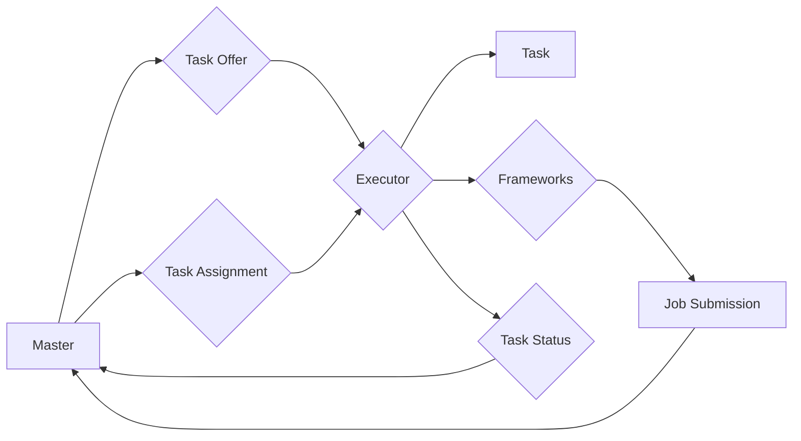

# Mesos原理与代码实例讲解

> 关键词：Mesos，容器化，资源管理，分布式系统，大数据，微服务，云计算，多租户

## 1. 背景介绍

随着云计算和大数据技术的快速发展，分布式系统变得越来越复杂。如何高效地管理和调度这些分布式系统中的资源，成为了业界关注的焦点。Mesos是一个分布式资源管理和调度平台，它允许你以集中式的方式跨多个数据中心、云环境或单机集群管理计算资源。本文将深入探讨Mesos的原理，并通过代码实例讲解其应用。

### 1.1 问题的由来

在传统的分布式系统中，每个应用都直接与其所使用的资源进行交互，这种模式导致了资源隔离和利用率低下的问题。例如，某些应用可能仅使用了少量资源，而其他应用则可能处于空闲状态，导致资源浪费。为了解决这些问题，我们需要一个能够统一管理所有资源的平台，这就是Mesos的诞生背景。

### 1.2 研究现状

Mesos自2011年由Twitter开源以来，已经成为了分布式资源管理和调度的佼佼者。它支持多种资源类型，包括CPU、内存、磁盘和端口，并且可以与各种框架如Marathon、Chronos等进行集成，以支持不同的工作负载。

### 1.3 研究意义

Mesos的研究和实现对于以下方面具有重要意义：

- 提高资源利用率
- 简化资源管理和调度
- 支持多云和混合云环境
- 促进微服务架构的发展

### 1.4 本文结构

本文将按照以下结构进行讲解：

- 第2章介绍Mesos的核心概念与联系。
- 第3章阐述Mesos的核心算法原理和具体操作步骤。
- 第4章通过数学模型和公式讲解Mesos的资源调度算法。
- 第5章通过代码实例讲解如何使用Mesos进行资源管理和调度。
- 第6章分析Mesos的实际应用场景。
- 第7章展望Mesos的未来发展趋势和挑战。
- 第8章总结全文，并对相关资源进行推荐。

## 2. 核心概念与联系

### 2.1 核心概念

- **资源（Resource）**：指可分配给任务的计算资源，如CPU、内存、磁盘和端口等。
- **框架（Framework）**：指运行在Mesos之上的应用程序，如Marathon、Chronos等。
- **执行器（Executor）**：指由框架分配给Mesos的任务执行环境。
- **作业（Job）**：指框架提交给Mesos的任务集合。

### 2.2 架构流程图



### 2.3 核心联系

Mesos通过以下方式将这些核心概念联系起来：

- Master节点负责维护集群状态，接收框架的作业提交，并将资源分配给框架。
- 框架通过提交作业来请求资源，作业由多个任务组成。
- Executor在Mesos分配的资源上运行任务。
- Master不断收集Executor的运行状态，并更新集群状态。

## 3. 核心算法原理 & 具体操作步骤

### 3.1 算法原理概述

Mesos使用一种称为“资源预留（Resource Reserving）”的算法来管理和调度资源。当框架请求资源时，Mesos会检查是否有足够的资源可用，如果有，它将为任务分配资源，并更新资源表。

### 3.2 算法步骤详解

1. 框架向Master提交作业，请求资源。
2. Master检查资源表，确定是否有足够的资源可以分配。
3. 如果有可用资源，Master将为任务分配资源，并创建一个新的Executor。
4. Executor运行任务，并向Master报告任务状态。
5. Master更新资源表，反映资源的分配和释放。

### 3.3 算法优缺点

#### 优点：

- **高效性**：资源预留算法能够快速分配资源，提高资源利用率。
- **灵活性**：框架可以根据需要请求不同类型的资源。

#### 缺点：

- **复杂性**：资源预留算法的实现相对复杂。
- **资源碎片化**：可能存在资源碎片化问题，导致资源无法有效利用。

### 3.4 算法应用领域

Mesos适用于以下场景：

- 大数据平台：如Apache Hadoop和Spark。
- 容器化应用：如Docker。
- 云计算平台：如Amazon EC2和Google Compute Engine。

## 4. 数学模型和公式 & 详细讲解 & 举例说明

### 4.1 数学模型构建

Mesos的资源管理可以通过以下数学模型进行描述：

```
资源 = 资源请求 - 资源预留 - 资源使用
```

其中，资源请求是框架请求的资源量，资源预留是Master预留的资源量，资源使用是Executor使用的资源量。

### 4.2 公式推导过程

Mesos的资源调度算法可以通过以下步骤进行推导：

1. 框架请求资源。
2. Master检查资源表，确定是否有足够的资源可以分配。
3. 如果有可用资源，Master将为任务分配资源。
4. Executor运行任务，并报告资源使用情况。
5. Master更新资源表，反映资源的分配和释放。

### 4.3 案例分析与讲解

假设有一个框架请求了10个CPU核心和20GB内存，Master检查资源表发现当前集群有30个CPU核心和40GB内存可用。因此，Master可以分配10个CPU核心和20GB内存给这个框架。

## 5. 项目实践：代码实例和详细解释说明

### 5.1 开发环境搭建

要使用Mesos，你需要搭建以下环境：

- Java环境
- Zookeeper集群
- Mesos集群

### 5.2 源代码详细实现

以下是一个简单的Marathon应用定义文件的例子，用于在Mesos上部署一个简单的Web服务：

```yaml
{
  "id": "web-service",
  "cmd": "java -jar /app/web-service.jar",
  "cpus": 0.5,
  "mem": 256,
  "instances": 1,
  "container": {
    "type": "Docker",
    "docker": {
      "image": "nginx:latest"
    }
  }
}
```

### 5.3 代码解读与分析

这个Marathon应用定义文件定义了一个名为`web-service`的应用，它使用Docker容器来部署Nginx服务。它请求0.5个CPU核心和256MB内存，并指定了容器镜像。

### 5.4 运行结果展示

要部署这个应用，你需要使用Marathon CLI：

```bash
$ marathon app-add web-service.json
```

这将启动一个Nginx服务，并返回服务的ID。

## 6. 实际应用场景

Mesos在实际应用中有着广泛的应用，以下是一些常见的场景：

- **大数据平台**：Apache Hadoop和Spark等大数据平台可以利用Mesos来高效地调度计算任务。
- **容器化应用**：Docker等容器化应用可以利用Mesos来跨多个主机进行资源调度。
- **云计算平台**：Amazon EC2和Google Compute Engine等云计算平台可以利用Mesos来提高资源利用率。

## 7. 工具和资源推荐

### 7.1 学习资源推荐

- Mesos官方文档：https://mesos.apache.org/docs/latest/
- Mesos用户指南：https://mesos.apache.org/docs/latest/running/
- Mesos API文档：https://mesos.apache.org/docs/latest/api/latest/

### 7.2 开发工具推荐

- Marathon：https://mesos.github.io/marathon/
- Mesos UI：https://mesos.github.io/mesos/latest/latest.html#mesos-webui

### 7.3 相关论文推荐

- Mesos: A Platform for Fine-Grained Resource Sharing in the Data Center
- Mesos: Large-scale clustered computing

## 8. 总结：未来发展趋势与挑战

### 8.1 研究成果总结

Mesos作为一款强大的分布式资源管理和调度平台，已经在多个领域得到了广泛的应用。它通过资源预留算法和框架集成，实现了高效、灵活的资源管理。

### 8.2 未来发展趋势

- Mesos将继续与云计算、大数据和容器化技术相结合，支持更广泛的应用场景。
- Mesos将更加注重可伸缩性和性能优化。
- Mesos将与其他资源管理和调度平台进行集成，如Kubernetes。

### 8.3 面临的挑战

- Mesos需要解决跨数据中心和多云环境的资源管理问题。
- Mesos需要提高资源利用率，减少资源碎片化。
- Mesos需要提高可伸缩性和性能优化。

### 8.4 研究展望

Mesos将继续作为分布式资源管理和调度领域的领导者，推动技术的发展和应用。

## 9. 附录：常见问题与解答

**Q1：什么是Mesos？**

A: Mesos是一个分布式资源管理和调度平台，它允许你以集中式的方式跨多个数据中心、云环境或单机集群管理计算资源。

**Q2：Mesos与Kubernetes有什么区别？**

A: Mesos是一个更通用的资源管理和调度平台，它可以与多种框架集成，而Kubernetes是一个专为容器化应用设计的平台。

**Q3：Mesos如何提高资源利用率？**

A: Mesos通过资源预留算法和框架集成，实现了高效、灵活的资源管理，从而提高了资源利用率。

**Q4：Mesos适用于哪些场景？**

A: Mesos适用于大数据平台、容器化应用、云计算平台等场景。

作者：禅与计算机程序设计艺术 / Zen and the Art of Computer Programming