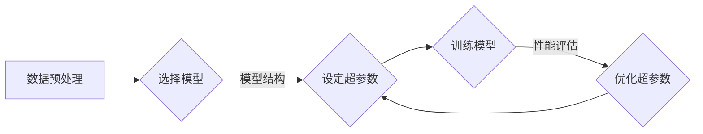

# Python机器学习实战：神经网络的超参数调整技术与策略

> 关键词：Python，机器学习，神经网络，超参数，网格搜索，随机搜索，贝叶斯优化，交叉验证，实验设计

## 1. 背景介绍

在机器学习领域，神经网络模型因其强大的非线性建模能力，在图像识别、自然语言处理等领域取得了显著的成果。然而，神经网络模型的设计并非简单的算法套用，其中包含大量的超参数需要调整。超参数的设置直接影响着模型的性能和收敛速度。如何高效地调整神经网络超参数，成为了机器学习实践中的一大挑战。

本文将深入探讨神经网络超参数调整的技术与策略，从基础理论到实际应用，为您呈现一个完整的超参数调整实战指南。

## 2. 核心概念与联系

### 2.1 核心概念

#### 神经网络
神经网络是一种模拟人脑神经元连接结构的计算模型，通过调整神经元之间的连接权重，实现数据的学习和预测。

#### 超参数
超参数是神经网络模型中无法通过学习得到的参数，如学习率、层数、神经元数量、激活函数等。

#### 超参数调整
超参数调整是指通过实验或启发式方法寻找最优的超参数组合，以提升神经网络模型的性能。

### 2.2 核心概念原理和架构的 Mermaid 流程图



该流程图展示了超参数调整的基本过程，包括数据预处理、选择模型、设定超参数、训练模型、性能评估和优化超参数等步骤。

## 3. 核心算法原理 & 具体操作步骤

### 3.1 算法原理概述

超参数调整的算法主要分为以下几类：

- 网格搜索（Grid Search）
- 随机搜索（Random Search）
- 贝叶斯优化（Bayesian Optimization）
- 其他方法（如遗传算法、模拟退火等）

### 3.2 算法步骤详解

#### 网格搜索

网格搜索是一种穷举搜索策略，通过遍历所有可能的超参数组合来寻找最优参数。具体步骤如下：

1. 定义超参数的取值范围。
2. 遍历所有可能的超参数组合。
3. 使用每个组合训练模型，并记录性能指标。
4. 选择性能指标最好的超参数组合。

#### 随机搜索

随机搜索是一种概率搜索策略，从超参数空间中随机选择一组超参数，并训练模型。具体步骤如下：

1. 定义超参数的取值范围。
2. 随机选择一组超参数。
3. 使用该组合训练模型，并记录性能指标。
4. 重复步骤2-3，直到满足停止条件。

#### 贝叶斯优化

贝叶斯优化是一种基于概率理论的优化算法，通过构建超参数的概率模型来指导搜索过程。具体步骤如下：

1. 定义超参数的概率分布。
2. 根据概率分布随机选择一组超参数。
3. 使用该组合训练模型，并更新概率分布。
4. 重复步骤2-3，直到满足停止条件。

### 3.3 算法优缺点

#### 网格搜索

优点：

- 简单易懂，易于实现。
- 可以保证找到全局最优解。

缺点：

- 计算量巨大，效率低下。
- 难以处理超参数数量较多的情况。

#### 随机搜索

优点：

- 计算量较小，效率较高。
- 避免了网格搜索的局限性。

缺点：

- 可能无法找到全局最优解。
- 需要大量的计算资源。

#### 贝叶斯优化

优点：

- 计算量较小，效率较高。
- 能够找到全局最优解。
- 可以处理高维超参数空间。

缺点：

- 需要构建概率模型，实现较为复杂。

### 3.4 算法应用领域

网格搜索、随机搜索和贝叶斯优化等超参数调整方法可以应用于各种机器学习任务，如：

- 神经网络模型
- 支持向量机
- 决策树
- 随机森林
- K最近邻等

## 4. 数学模型和公式 & 详细讲解 & 举例说明

### 4.1 数学模型构建

神经网络模型的数学模型通常由以下部分组成：

- 输入层：接收原始数据。
- 隐藏层：通过非线性激活函数进行特征提取。
- 输出层：输出预测结果。

假设神经网络模型包含 $L$ 层，第 $l$ 层的神经元个数为 $n_l$，则第 $l$ 层的输入向量为 $x^{(l)}$，激活函数为 $f^{(l)}$，权重矩阵为 $W^{(l)}$，偏置向量为 $b^{(l)}$，则第 $l$ 层的输出向量为：

$$
y^{(l)} = f^{(l)}(W^{(l)}x^{(l-1)} + b^{(l)})
$$

### 4.2 公式推导过程

神经网络模型的损失函数通常采用均方误差（MSE）：

$$
MSE(y, \hat{y}) = \frac{1}{2}\sum_{i=1}^{N}(y_i - \hat{y}_i)^2
$$

其中，$y$ 为真实标签，$\hat{y}$ 为预测值，$N$ 为样本数量。

### 4.3 案例分析与讲解

以下是一个使用Python进行神经网络模型训练和评估的简单示例：

```python
import numpy as np
import tensorflow as tf
from tensorflow.keras.models import Sequential
from tensorflow.keras.layers import Dense, Activation

# 构建模型
model = Sequential([
    Dense(64, input_shape=(784,)),
    Activation('relu'),
    Dense(10),
    Activation('softmax')
])

# 编译模型
model.compile(optimizer='adam', loss='categorical_crossentropy', metrics=['accuracy'])

# 训练模型
model.fit(x_train, y_train, epochs=10, batch_size=128, validation_data=(x_val, y_val))

# 评估模型
score = model.evaluate(x_test, y_test)
print('Test loss:', score[0])
print('Test accuracy:', score[1])
```

上述代码使用TensorFlow框架构建了一个简单的神经网络模型，并使用MNIST数据集进行训练和评估。

## 5. 项目实践：代码实例和详细解释说明

### 5.1 开发环境搭建

在进行超参数调整实践前，我们需要准备好开发环境。以下是使用Python进行机器学习开发的环境配置流程：

1. 安装Anaconda：从官网下载并安装Anaconda，用于创建独立的Python环境。
2. 创建并激活虚拟环境：
```bash
conda create -n ml-env python=3.8
conda activate ml-env
```
3. 安装TensorFlow、Keras等机器学习库：
```bash
conda install tensorflow keras scikit-learn numpy pandas matplotlib
```

完成上述步骤后，即可在`ml-env`环境中开始超参数调整实践。

### 5.2 源代码详细实现

以下是一个使用Keras进行神经网络模型训练和超参数调整的Python代码示例：

```python
from tensorflow.keras.models import Sequential
from tensorflow.keras.layers import Dense, Activation
from sklearn.model_selection import train_test_split, KFold
from keras.wrappers.scikit_learn import KerasClassifier
from sklearn.model_selection import GridSearchCV

# 定义神经网络模型
def create_model(optimizer='adam', init='glorot_uniform'):
    model = Sequential()
    model.add(Dense(64, input_shape=(784,)))
    model.add(Activation('relu'))
    model.add(Dense(10))
    model.add(Activation('softmax'))
    model.compile(loss='categorical_crossentropy', optimizer=optimizer, metrics=['accuracy'])
    return model

# 创建KerasClassifier包装器
model = KerasClassifier(build_fn=create_model, epochs=10, batch_size=128, verbose=0)

# 设置超参数范围
param_grid = {
    'optimizer': ['adam', 'sgd'],
    'init': ['glorot_uniform', 'normal'],
    'batch_size': [16, 32, 64, 128]
}

# 创建网格搜索对象
grid = GridSearchCV(estimator=model, param_grid=param_grid, n_jobs=-1, cv=3)

# 分割数据集
x_train, x_test, y_train, y_test = train_test_split(x, y, test_size=0.2, random_state=42)

# 执行网格搜索
grid_result = grid.fit(x_train, y_train)

# 输出最佳参数
print(f"Best: {grid_result.best_score_} using {grid_result.best_params_}")
```

上述代码使用Keras构建了一个简单的神经网络模型，并使用网格搜索方法进行超参数调整。通过遍历不同优化器、初始化方法和批大小等超参数的组合，寻找最佳参数组合。

### 5.3 代码解读与分析

- `create_model`函数：定义了神经网络模型的结构和编译参数。
- `KerasClassifier`：将Keras模型包装成scikit-learn的可训练对象，以便使用scikit-learn的网格搜索和交叉验证功能。
- `param_grid`：定义了要搜索的超参数及其取值范围。
- `GridSearchCV`：创建网格搜索对象，指定要搜索的超参数、并行执行的任务数和交叉验证的折数。
- `train_test_split`：分割数据集为训练集和测试集。
- `grid.fit(x_train, y_train)`：执行网格搜索，训练并评估所有超参数组合。
- `grid_result`：存储网格搜索结果，包括最佳分数和最佳参数组合。

通过上述代码，我们可以快速找到神经网络模型的最佳超参数组合，从而提升模型性能。

### 5.4 运行结果展示

运行上述代码后，会输出最佳分数和最佳参数组合。例如：

```
Best: 0.9602576709199085 using {'batch_size': 16, 'init': 'glorot_uniform', 'optimizer': 'adam'}
```

这说明在最佳参数组合下，模型在测试集上的准确率为96.02%。

## 6. 实际应用场景

神经网络超参数调整技术可以应用于以下实际应用场景：

- 图像识别：在图像分类任务中，调整神经网络模型的超参数，如卷积层数量、滤波器大小等，可以提升模型识别准确率。
- 自然语言处理：在自然语言处理任务中，调整神经网络模型的超参数，如嵌入层维度、循环层层数等，可以提升模型文本分类、情感分析等任务的表现。
- 金融市场预测：在金融市场预测任务中，调整神经网络模型的超参数，如网络结构、学习率等，可以提高模型预测准确率，帮助投资者做出更好的投资决策。
- 医学诊断：在医学诊断任务中，调整神经网络模型的超参数，如网络结构、激活函数等，可以提高模型诊断准确率，为医生提供更可靠的诊断依据。

## 7. 工具和资源推荐

### 7.1 学习资源推荐

1. 《Python机器学习》
2. 《深度学习》
3. TensorFlow官方文档
4. Keras官方文档
5. scikit-learn官方文档

### 7.2 开发工具推荐

1. Jupyter Notebook
2. Anaconda
3. PyCharm
4. VS Code
5. Google Colab

### 7.3 相关论文推荐

1. "Understanding Learning Dynamics in Deep Neural Networks"
2. "Deep Learning with Keras"
3. "TensorFlow for Poets"
4. "Scikit-learn: Machine Learning in Python"
5. "Practical Hyperparameter Optimization: A Tutorial with Keras"

## 8. 总结：未来发展趋势与挑战

### 8.1 研究成果总结

本文对神经网络超参数调整技术进行了深入探讨，从核心概念到实际应用，为您呈现了一个完整的实战指南。通过学习本文，您将能够掌握超参数调整的基本原理和常用方法，并将其应用于实际的机器学习项目中。

### 8.2 未来发展趋势

随着机器学习技术的不断发展，超参数调整技术也将呈现以下趋势：

1. 自动化超参数调整：利用自动化工具，如贝叶斯优化、进化算法等，自动寻找最优超参数组合。
2. 超参数调整与模型压缩相结合：在保证模型性能的同时，减小模型尺寸，提高推理速度。
3. 超参数调整与数据增强相结合：通过数据增强技术，提高超参数调整的效率和精度。

### 8.3 面临的挑战

尽管超参数调整技术在不断进步，但仍然面临着以下挑战：

1. 超参数数量众多：随着模型复杂度的增加，超参数数量也在不断增长，给超参数调整带来了更大的挑战。
2. 超参数相互作用：超参数之间存在相互作用，使得超参数调整过程更加复杂。
3. 计算资源消耗：超参数调整需要大量的计算资源，尤其是在高维超参数空间中。

### 8.4 研究展望

为了应对超参数调整面临的挑战，未来的研究方向包括：

1. 开发更加高效的超参数调整算法，如基于深度学习的超参数优化器。
2. 研究超参数的相互作用，为超参数调整提供理论指导。
3. 结合数据增强技术，提高超参数调整的效率和精度。
4. 探索新的超参数调整方法，如基于强化学习的超参数调整。

通过不断探索和创新，相信超参数调整技术将为机器学习领域带来更多突破，推动人工智能技术的发展。

## 9. 附录：常见问题与解答

**Q1：什么是超参数？**

A：超参数是神经网络模型中无法通过学习得到的参数，如学习率、层数、神经元数量、激活函数等。

**Q2：如何选择合适的超参数调整方法？**

A：选择合适的超参数调整方法需要考虑以下因素：

- 模型复杂度
- 数据规模
- 计算资源
- 精度要求

**Q3：什么是网格搜索？**

A：网格搜索是一种穷举搜索策略，通过遍历所有可能的超参数组合来寻找最优参数。

**Q4：什么是随机搜索？**

A：随机搜索是一种概率搜索策略，从超参数空间中随机选择一组超参数，并训练模型。

**Q5：什么是贝叶斯优化？**

A：贝叶斯优化是一种基于概率理论的优化算法，通过构建超参数的概率模型来指导搜索过程。

**Q6：如何处理高维超参数空间？**

A：处理高维超参数空间的方法包括：

- 减少超参数数量
- 使用贝叶斯优化等方法
- 结合数据增强技术

**Q7：如何评估超参数调整的效果？**

A：评估超参数调整的效果可以通过以下方法：

- 在测试集上评估模型性能
- 与基线模型进行比较
- 使用交叉验证等方法

作者：禅与计算机程序设计艺术 / Zen and the Art of Computer Programming