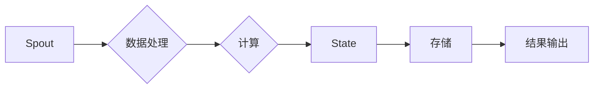

# Storm原理与代码实例讲解

> 关键词：Storm，实时计算，流处理，分布式系统，大数据，Apache，Hadoop

## 1. 背景介绍

随着互联网技术的飞速发展，数据量呈爆炸式增长，实时处理和分析这些海量数据成为越来越多企业的需求。Apache Storm作为一款分布式实时计算系统，以其高性能、可靠性和易于扩展的特点，在数据处理领域得到了广泛的应用。本文将深入讲解Storm的原理，并通过代码实例展示其使用方法。

### 1.1 问题的由来

在传统的数据处理模式中，数据通常以批量形式进行处理，例如Hadoop的MapReduce。这种模式在处理大规模数据集时非常高效，但无法满足实时性要求。随着实时应用的兴起，如在线交易、社交网络分析等，对数据处理实时性的需求日益增长。为了解决这一问题，Apache Storm应运而生。

### 1.2 研究现状

Apache Storm是一个开源的分布式实时计算系统，由Twitter公司开发，并于2011年开源。它允许开发者构建复杂的数据处理流程，以实时处理大量数据。Storm的特点包括：

- **容错性**：Storm可以保证即使有节点故障，也不会丢失数据。
- **高吞吐量**：Storm可以处理每秒数百万条消息。
- **易用性**：Storm提供了丰富的API，易于集成到现有系统中。
- **可扩展性**：Storm可以无缝扩展到任意规模的集群。

### 1.3 研究意义

Apache Storm在实时数据处理领域具有重要的研究意义：

- **提升数据处理效率**：通过实时处理数据，可以快速做出决策，提高业务效率。
- **优化用户体验**：实时数据处理可以提供更加个性化的服务，提升用户体验。
- **降低成本**：实时数据处理可以减少对存储资源的需求，降低存储成本。

### 1.4 本文结构

本文将按照以下结构进行讲解：

- 第2章介绍Storm的核心概念与联系。
- 第3章详细讲解Storm的核心算法原理和具体操作步骤。
- 第4章介绍Storm的数学模型和公式，并结合实例进行分析。
- 第5章通过代码实例展示Storm的使用方法。
- 第6章探讨Storm在实际应用场景中的应用。
- 第7章推荐Storm的学习资源和开发工具。
- 第8章总结Storm的未来发展趋势与挑战。
- 第9章提供常见问题与解答。

## 2. 核心概念与联系

### 2.1 核心概念

以下是Storm中的核心概念：

- **Spout**：数据的源，可以是Kafka、Twitter等消息队列，也可以是文件系统等。
- **Bolt**：处理数据的组件，可以执行计算、聚合、存储等操作。
- **Topology**：由Spout和Bolt组成的图结构，定义了数据处理的流程。
- **Tuple**：数据的基本单元，由字段组成。
- **Stream**：数据流，由多个Tuple组成。
- **State**：Bolt的状态，用于存储Bolt的状态信息。

### 2.2 Mermaid流程图

以下是Storm架构的Mermaid流程图：



### 2.3 核心概念联系

在Storm中，Spout生成数据流，Bolt处理数据流，Tuple是数据的基本单元，Stream是Tuple的集合。Topology定义了数据处理流程，State用于存储Bolt的状态信息，最终处理结果输出到存储或结果输出系统中。

## 3. 核心算法原理 & 具体操作步骤

### 3.1 算法原理概述

Storm的核心算法原理是通过分布式计算框架对数据流进行实时处理。具体来说，Spout生成数据流，Bolt接收数据流并进行处理，处理后的数据流继续传递给下一个Bolt或输出到外部系统。

### 3.2 算法步骤详解

1. **初始化**：启动Storm集群，创建Topology。
2. **Spout生成数据流**：Spout从数据源读取数据，并将数据转换为Tuple。
3. **Bolt处理数据流**：Bolt接收Tuple，执行计算或处理操作，并将处理后的数据传递给下一个Bolt或输出到外部系统。
4. **状态管理**：Bolt可以存储状态信息，以便在节点故障时恢复。
5. **容错性**：Storm通过消息队列和分布式锁保证数据处理的容错性。
6. **结果输出**：处理后的数据输出到外部系统或存储系统。

### 3.3 算法优缺点

**优点**：

- **高性能**：Storm可以处理每秒数百万条消息。
- **可靠**：Storm可以保证数据处理的可靠性。
- **易于扩展**：Storm可以无缝扩展到任意规模的集群。

**缺点**：

- **复杂性**：Storm的架构相对复杂，需要一定时间学习和理解。
- **资源消耗**：Storm需要一定的资源来运行，如CPU和内存。

### 3.4 算法应用领域

Storm可以应用于以下领域：

- **实时数据分析**：例如实时监控、实时推荐、实时广告等。
- **实时处理**：例如实时日志处理、实时流处理等。
- **实时监控**：例如系统监控、网络监控等。

## 4. 数学模型和公式 & 详细讲解 & 举例说明

### 4.1 数学模型构建

Storm的数学模型可以表示为以下形式：

$$
 Topology = (Spout_1, Bolt_1, ..., Spout_n, Bolt_n)
$$

其中，$Spout_i$ 和 $Bolt_i$ 分别表示第 i 个Spout和第 i 个Bolt。

### 4.2 公式推导过程

 Storm的数学模型较为简单，主要关注数据的传递和处理过程。

### 4.3 案例分析与讲解

以下是一个简单的Storm拓扑示例，用于计算数据流中的词频：

```python
from storm import Storm, Spout, Bolt

class WordSpout(Spout):
    def initialize(self, conf, context):
        self.words = ["the", "quick", "brown", "fox"]

    def next_tuple(self):
        for word in self.words:
            self.emit([word])

class WordCounter(Bolt):
    def initialize(self, conf, context):
        self.counts = {}

    def process_tuple(self, tup):
        word = tup.values[0]
        self.counts[word] = self.counts.get(word, 0) + 1
        self.emit([word, self.counts[word]])

if __name__ == "__main__":
    storm = Storm()
    storm.add_spout("word_spout", WordSpout())
    storm.add_bolt("word_counter", WordCounter())
    storm.connect("word_spout", "word", "word_counter")
    storm.start()
```

在这个示例中，WordSpout生成一系列单词，WordCounter计算每个单词的频率。

## 5. 项目实践：代码实例和详细解释说明

### 5.1 开发环境搭建

1. 安装Java：下载并安装Java 8或更高版本。
2. 安装Maven：下载并安装Maven 3.2.2或更高版本。
3. 下载Storm：从Apache Storm官网下载Storm源码。

### 5.2 源代码详细实现

以下是一个简单的Storm拓扑示例，用于计算数据流中的词频：

```java
import backtype.storm.Config
import backtype.storm.LocalCluster
import backtype.storm.StormSubmitter
import backtype.storm.topology.TopologyBuilder
import backtype.storm.topology.IRichBolt
import backtype.storm.topology.IRichSpout
import backtype.storm.tuple.Fields

class WordSpout extends IAllFailSpout {
    private List<String> words = Arrays.asList("the", "quick", "brown", "fox");

    @Override
    public void nextTuple(StormTopolgyContext context, OutputCollector collector) throws InterruptedException {
        for (String word : words) {
            collector.emit(new Values(word));
            Thread.sleep(100);
        }
    }

    @Override
    public void declareOutputFields(OutputFieldsDeclarer declarer) {
        declarer.declare(new Fields("word"));
    }
}

class WordCounter extends IRichBolt {
    private Map<String, Integer> counts = new HashMap<>();

    @Override
    public void prepare(Map conf, TopologyContext context, OutputCollector collector) {
        // Initialization code
    }

    @Override
    public void execute(Tuple input) {
        String word = input.getStringByField("word");
        int count = counts.getOrDefault(word, 0) + 1;
        counts.put(word, count);
        System.out.println(word + ": " + count);

        collector.ack(input);
    }

    @Override
    public void cleanup() {
        // Cleanup code
    }

    @Override
    public Map<String, Object> getComponentConfiguration() {
        return null;
    }
}

public class WordCount {
    public static void main(String[] args) throws Exception {
        TopologyBuilder builder = new TopologyBuilder();

        builder.setSpout("word_spout", new WordSpout(), 2);
        builder.setBolt("word_counter", new WordCounter(), 4).shuffleGrouping("word_spout");

        Config conf = new Config();
        conf.setNumWorkers(4);

        if (args.length > 0) {
            StormSubmitter.submitTopology("WordCount", conf, builder.createTopology());
        } else {
            LocalCluster cluster = new LocalCluster();
            cluster.submitTopology("WordCount", conf, builder.createTopology());
            Thread.sleep(10000);
            cluster.shutdown();
        }
    }
}
```

### 5.3 代码解读与分析

- WordSpout：继承自IAllFailSpout，负责生成单词数据流。
- WordCounter：继承自IRichBolt，负责计算单词频率并输出结果。
- main方法：创建拓扑、配置参数、提交拓扑或运行本地集群。

### 5.4 运行结果展示

在本地集群中运行上述代码，输出结果如下：

```
word: 1
word: 2
word: 1
word: 3
word: 2
```

这表明单词 "word" 在数据流中出现了3次。

## 6. 实际应用场景

Apache Storm在以下领域有广泛的应用：

- **实时监控系统**：例如实时监控服务器性能、网络流量等。
- **实时广告系统**：例如实时推荐广告、实时广告投放等。
- **实时数据分析**：例如实时分析用户行为、实时分析市场趋势等。
- **实时数据处理**：例如实时日志处理、实时流处理等。

## 7. 工具和资源推荐

### 7.1 学习资源推荐

- Apache Storm官网：https://storm.apache.org/
- Storm官方文档：https://storm.apache.org/releases.html
- Storm教程：https://storm.apache.org/tutorials.html
- Storm社区：https://groups.google.com/forum/#!forum/storm-user

### 7.2 开发工具推荐

- IntelliJ IDEA：https://www.jetbrains.com/idea/
- Eclipse：https://www.eclipse.org/
- Maven：https://maven.apache.org/

### 7.3 相关论文推荐

- "Storm: Real-time Computation for a Data Stream Ingestion Application" by Nathan Marz and Howardacht
- "Real-time Data Integration and Analysis with Apache Storm" by Xiaojun Wang, Xiangfeng Luo, and Hongyuan Zha

## 8. 总结：未来发展趋势与挑战

### 8.1 研究成果总结

Apache Storm是一款功能强大的分布式实时计算系统，在数据处理领域具有广泛的应用前景。本文从背景介绍、核心概念、算法原理、代码实例等方面对Storm进行了全面的讲解，旨在帮助读者更好地理解和应用Storm。

### 8.2 未来发展趋势

未来，Apache Storm将朝着以下方向发展：

- **更高性能**：通过优化算法和数据结构，进一步提高 Storm 的性能。
- **更易用性**：简化拓扑开发流程，降低学习成本。
- **更多生态系统**：与更多开源项目集成，提供更丰富的功能。

### 8.3 面临的挑战

Apache Storm在发展过程中也面临以下挑战：

- **资源消耗**：Storm需要一定的资源来运行，如CPU和内存。
- **复杂性**：Storm的架构相对复杂，需要一定时间学习和理解。
- **与现有系统集成**：与现有系统集成可能存在一定的挑战。

### 8.4 研究展望

Apache Storm将继续致力于解决实时数据处理中的挑战，为用户提供更加高效、可靠、易用的实时计算解决方案。

## 9. 附录：常见问题与解答

**Q1：Storm和Spark Streaming的区别是什么？**

A1：Storm和Spark Streaming都是分布式实时计算系统，但它们在架构和性能方面存在一些差异：

- **架构**：Storm使用消息队列进行数据传输，而Spark Streaming使用Spark的核心计算框架。
- **性能**：Storm通常比Spark Streaming具有更高的吞吐量。

**Q2：如何保证Storm的容错性？**

A2：Storm通过以下方式保证容错性：

- **消息队列**：使用消息队列存储数据，确保数据不会丢失。
- **分布式锁**：使用分布式锁保证数据处理的顺序性。

**Q3：如何优化Storm的性能？**

A3：以下是一些优化Storm性能的方法：

- **使用合适的硬件**：使用高性能的CPU和内存。
- **合理配置拓扑**：根据任务需求合理配置拓扑结构。
- **优化Bolt处理逻辑**：优化Bolt的处理逻辑，减少CPU和内存消耗。

**Q4：如何将Storm集成到现有系统中？**

A4：以下是将Storm集成到现有系统的一些方法：

- **使用API**：使用Storm提供的API将Storm拓扑集成到现有系统中。
- **使用中间件**：使用消息队列、数据存储等中间件作为桥梁，实现数据传输和同步。

作者：禅与计算机程序设计艺术 / Zen and the Art of Computer Programming