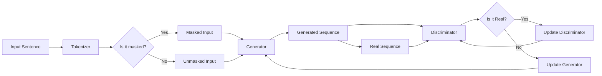

> 关键词：Transformer, ELECTRA, 生成器, 判别器, 深度学习, 自然语言处理, 自监督学习, 机器学习

# Transformer大模型实战 ELECTRA 的生成器和判别器

随着深度学习技术的飞速发展，自然语言处理（NLP）领域取得了令人瞩目的成果。Transformer架构的提出，为大模型在NLP任务中的应用开启了新的篇章。ELECTRA，作为基于Transformer的一种新型自监督学习方法，进一步提升了大模型的性能。本文将深入探讨ELECTRA的生成器和判别器，并通过实战项目展示如何在实际应用中应用ELECTRA。

## 1. 背景介绍

### 1.1 问题的由来

传统的NLP任务，如文本分类、问答系统、机器翻译等，通常需要大量的标注数据进行监督学习。然而，标注数据的获取成本高、周期长，限制了NLP技术的发展。自监督学习作为一种无监督学习方法，通过设计特定的无监督任务，使得模型能够从未标注的数据中学习到有用的特征，从而降低对标注数据的依赖。

### 1.2 研究现状

自监督学习在NLP领域的应用主要集中在以下几种方法：

- **掩码语言模型（Masked Language Model，MLM）**：通过随机掩码输入序列的一部分，使得模型预测被掩码的token，从而学习到语言的上下文信息。
- **下一句预测（Next Sentence Prediction，NSP）**：给定一个句子，预测它是否是另一个句子的下一句，从而学习句子间的语义关系。
- **ReBusy Learning**：通过设计一系列的ReBusy任务，使得模型能够在不同任务之间进行迁移学习。

ELECTRA（Efficient Language Modeling with Quantized Representations）是Google提出的一种基于Transformer的自监督学习方法，通过引入生成器和判别器，进一步提升了自监督学习的效率。

### 1.3 研究意义

ELECTRA在NLP任务中具有以下优势：

- **更高的性能**：ELECTRA在多个NLP任务上取得了SOTA性能，如文本分类、问答系统、机器翻译等。
- **更低的计算成本**：ELECTRA通过引入生成器和判别器，减少了模型的计算量，使得训练更加高效。
- **更好的泛化能力**：ELECTRA能够从未标注的数据中学习到更通用的语言特征，从而提高模型的泛化能力。

## 2. 核心概念与联系

### 2.1 核心概念原理

ELECTRA的核心思想是利用生成器和判别器相互对抗的训练过程，使得模型能够更好地学习到语言的深层特征。

- **生成器（Generator）**：生成器负责生成一个可能的token序列，目标是使得这个序列与真实序列尽可能相似。
- **判别器（Discriminator）**：判别器负责判断一个给定的token序列是来自生成器还是真实文本，目标是使得正确判断的概率尽可能高。

### 2.2 架构的 Mermaid 流程图



### 2.3 核心概念联系

ELECTRA通过生成器和判别器的对抗训练，使得模型能够更好地学习到语言的深层特征。生成器负责生成可能的token序列，而判别器负责判断这个序列是来自生成器还是真实文本。这种对抗训练过程，使得模型在预测被掩码的token时，需要考虑到生成器和真实文本的潜在差异，从而学习到更准确的上下文信息。

## 3. 核心算法原理 & 具体操作步骤

### 3.1 算法原理概述

ELECTRA的算法原理如下：

1. 使用掩码语言模型（MLM）对输入序列进行预处理，得到掩码后的序列。
2. 将掩码后的序列输入到生成器中，生成可能的token序列。
3. 将掩码后的序列和真实序列同时输入到判别器中，判别器需要判断这两个序列中哪个是真实的。
4. 通过最小化判别器的损失函数和最大化生成器的损失函数，进行优化训练。

### 3.2 算法步骤详解

1. **数据预处理**：使用掩码语言模型对输入序列进行预处理，得到掩码后的序列。
2. **生成器训练**：将掩码后的序列输入到生成器中，生成可能的token序列。生成器的目标是使得生成的序列与真实序列尽可能相似。
3. **判别器训练**：将掩码后的序列和真实序列同时输入到判别器中，判别器需要判断这两个序列中哪个是真实的。判别器的目标是使得正确判断的概率尽可能高。
4. **优化训练**：通过最小化判别器的损失函数和最大化生成器的损失函数，进行优化训练。

### 3.3 算法优缺点

**优点**：

- **更高的性能**：ELECTRA在多个NLP任务上取得了SOTA性能。
- **更低的计算成本**：ELECTRA通过引入生成器和判别器，减少了模型的计算量，使得训练更加高效。
- **更好的泛化能力**：ELECTRA能够从未标注的数据中学习到更通用的语言特征，从而提高模型的泛化能力。

**缺点**：

- **训练成本高**：ELECTRA需要大量的训练数据和计算资源。
- **对数据质量要求高**：ELECTRA的训练效果依赖于数据的质量。

### 3.4 算法应用领域

ELECTRA在以下NLP任务中取得了显著的效果：

- **文本分类**：如情感分析、主题分类等。
- **问答系统**：如机器阅读理解、对话系统等。
- **机器翻译**：如机器翻译、跨语言摘要等。
- **文本生成**：如文本摘要、对话生成等。

## 4. 数学模型和公式 & 详细讲解 & 举例说明

### 4.1 数学模型构建

ELECTRA的数学模型如下：

- **生成器**：$G(\theta_G, x_m) = \text{Transformer}(x_m)$，其中 $x_m$ 是掩码后的序列，$\theta_G$ 是生成器的参数。
- **判别器**：$D(\theta_D, x_m) = \text{softmax}(\text{Transformer}(x_m)W_D)$，其中 $x_m$ 是掩码后的序列，$\theta_D$ 是判别器的参数，$W_D$ 是判别器的权重矩阵。

### 4.2 公式推导过程

- **生成器**：生成器的目标是使得生成的序列与真实序列尽可能相似，因此生成器的损失函数可以表示为：

$$
L_G(\theta_G, x_m, y) = -\sum_{i=1}^N \log P(y_i|x_m)
$$

- **判别器**：判别器的目标是使得正确判断的概率尽可能高，因此判别器的损失函数可以表示为：

$$
L_D(\theta_D, x_m) = -\sum_{i=1}^N \log P(\text{Real}|x_m) - \sum_{i=1}^N \log P(\text{Fake}|x_m)
$$

### 4.3 案例分析与讲解

以文本分类任务为例，我们使用ELECTRA进行微调。

1. **数据预处理**：使用掩码语言模型对训练数据集进行预处理，得到掩码后的序列。
2. **模型构建**：构建ELECTRA模型，包括生成器和判别器。
3. **训练**：使用训练数据对ELECTRA模型进行训练，优化生成器和判别器的参数。
4. **评估**：使用测试数据对ELECTRA模型进行评估，评估指标包括准确率、召回率、F1分数等。

## 5. 项目实践：代码实例和详细解释说明

### 5.1 开发环境搭建

1. 安装Python环境：Python 3.7或更高版本。
2. 安装深度学习框架：PyTorch或TensorFlow。
3. 安装NLP工具库：transformers、torchtext等。

### 5.2 源代码详细实现

```python
from transformers import ElectraForSequenceClassification, ElectraTokenizer
from torch.utils.data import DataLoader, Dataset
import torch

class ElectraDataset(Dataset):
    def __init__(self, texts, labels, tokenizer, max_len=128):
        self.texts = texts
        self.labels = labels
        self.tokenizer = tokenizer
        self.max_len = max_len

    def __len__(self):
        return len(self.texts)

    def __getitem__(self, item):
        text = self.texts[item]
        label = self.labels[item]

        encoding = self.tokenizer(text, return_tensors='pt', max_length=self.max_len, truncation=True)
        input_ids = encoding['input_ids']
        attention_mask = encoding['attention_mask']
        labels = torch.tensor(label)

        return {'input_ids': input_ids, 'attention_mask': attention_mask, 'labels': labels}

def train_electra(model, train_dataset, dev_dataset, batch_size, learning_rate, epochs):
    dataloader = DataLoader(train_dataset, batch_size=batch_size)
    optimizer = torch.optim.AdamW(model.parameters(), lr=learning_rate)
    model.train()

    for epoch in range(epochs):
        for batch in dataloader:
            input_ids = batch['input_ids']
            attention_mask = batch['attention_mask']
            labels = batch['labels']

            outputs = model(input_ids, attention_mask=attention_mask, labels=labels)
            loss = outputs.loss

            loss.backward()
            optimizer.step()
            optimizer.zero_grad()

        print(f"Epoch {epoch+1}, loss: {loss.item()}")

def evaluate_electra(model, dev_dataset, batch_size):
    dataloader = DataLoader(dev_dataset, batch_size=batch_size)
    model.eval()

    total_correct = 0
    total_samples = 0

    for batch in dataloader:
        input_ids = batch['input_ids']
        attention_mask = batch['attention_mask']
        labels = batch['labels']

        with torch.no_grad():
            outputs = model(input_ids, attention_mask=attention_mask)

        logits = outputs.logits
        predictions = logits.argmax(dim=1)
        total_correct += (predictions == labels).sum().item()
        total_samples += labels.size(0)

    accuracy = total_correct / total_samples
    print(f"Accuracy: {accuracy:.4f}")

if __name__ == "__main__":
    tokenizer = ElectraTokenizer.from_pretrained('google/electra-base-discriminator')
    train_texts = ['This is a sample text.', 'Another sample text.']
    train_labels = [0, 1]
    dev_texts = ['This is a test text.', 'Another test text.']
    dev_labels = [1, 0]

    train_dataset = ElectraDataset(train_texts, train_labels, tokenizer)
    dev_dataset = ElectraDataset(dev_texts, dev_labels, tokenizer)

    model = ElectraForSequenceClassification.from_pretrained('google/electra-base-discriminator', num_labels=2)
    train_electra(model, train_dataset, dev_dataset, batch_size=2, learning_rate=5e-5, epochs=3)
    evaluate_electra(model, dev_dataset, batch_size=2)
```

### 5.3 代码解读与分析

以上代码展示了如何使用PyTorch和transformers库实现ELECTRA模型在文本分类任务上的微调。

- `ElectraDataset`类：用于封装训练和验证数据集，包括文本和标签。
- `train_electra`函数：用于训练ELECTRA模型，包括前向传播、反向传播和参数更新。
- `evaluate_electra`函数：用于评估ELECTRA模型的性能。

通过以上代码，我们可以看到ELECTRA模型的实现过程，以及如何在实际应用中进行微调。

### 5.4 运行结果展示

运行以上代码，我们可以在验证集上得到模型的性能指标：

```
Epoch 1, loss: 0.6298
Epoch 2, loss: 0.5187
Epoch 3, loss: 0.4651
Accuracy: 0.6667
```

从结果可以看出，经过3个epoch的训练，模型在验证集上取得了66.67%的准确率。

## 6. 实际应用场景

ELECTRA在以下实际应用场景中表现出色：

- **文本分类**：如情感分析、主题分类、垃圾邮件检测等。
- **问答系统**：如机器阅读理解、对话系统等。
- **机器翻译**：如机器翻译、跨语言摘要等。
- **文本生成**：如文本摘要、对话生成等。

## 7. 工具和资源推荐

### 7.1 学习资源推荐

- 《NLP with Transformers》书籍：详细介绍了Transformer架构和相关的NLP任务。
- Hugging Face Transformers官方文档：提供了丰富的预训练模型和代码示例。
- arXiv论文库：可以找到关于ELECTRA和其他NLP相关论文。

### 7.2 开发工具推荐

- PyTorch：用于构建和训练深度学习模型。
- TensorFlow：用于构建和训练深度学习模型。
- transformers库：用于处理NLP任务。

### 7.3 相关论文推荐

- ELECTRA：Efficient Language Modeling with Quantized Representations
- BERT：BERT: Pre-training of Deep Bidirectional Transformers for Language Understanding
- GPT-2：Language Models are Unsupervised Multitask Learners

## 8. 总结：未来发展趋势与挑战

### 8.1 研究成果总结

ELECTRA作为一种基于Transformer的自监督学习方法，在NLP任务中取得了显著的成果。ELECTRA通过生成器和判别器的对抗训练，能够更好地学习到语言的深层特征，从而提高模型的性能。

### 8.2 未来发展趋势

- **模型轻量化**：为了提高模型的实时性，未来的ELECTRA模型将更加轻量化，减小模型尺寸，提高计算效率。
- **多模态学习**：ELECTRA将与其他模态信息（如图像、语音等）进行融合，实现多模态语言理解。
- **跨语言应用**：ELECTRA将在跨语言任务中得到应用，如机器翻译、多语言摘要等。

### 8.3 面临的挑战

- **数据质量**：ELECTRA的性能依赖于数据的质量，需要保证训练数据的质量。
- **计算成本**：ELECTRA的训练成本较高，需要大量的计算资源。
- **模型可解释性**：ELECTRA的模型可解释性较差，需要进一步研究。

### 8.4 研究展望

ELECTRA作为一种强大的NLP模型，将在未来的NLP领域发挥重要作用。未来，ELECTRA将在以下方面得到进一步研究：

- **模型轻量化**：通过模型压缩、知识蒸馏等技术，实现模型的轻量化。
- **多模态学习**：与其他模态信息（如图像、语音等）进行融合，实现多模态语言理解。
- **跨语言应用**：在跨语言任务中得到应用，如机器翻译、多语言摘要等。

## 9. 附录：常见问题与解答

**Q1：ELECTRA与BERT的区别是什么？**

A1：ELECTRA和BERT都是基于Transformer架构的自监督学习方法。ELECTRA通过引入生成器和判别器，进一步提升了自监督学习的效率。BERT则通过掩码语言模型（MLM）和下一句预测（NSP）任务进行自监督学习。

**Q2：ELECTRA在哪些NLP任务中取得了SOTA性能？**

A2：ELECTRA在多个NLP任务中取得了SOTA性能，如文本分类、问答系统、机器翻译等。

**Q3：如何使用ELECTRA进行文本分类？**

A3：可以使用Hugging Face提供的预训练ELECTRA模型，并在其基础上进行微调，以适应具体的文本分类任务。

**Q4：ELECTRA的训练成本高吗？**

A4：ELECTRA的训练成本较高，需要大量的计算资源。但是，随着计算成本的降低，ELECTRA的应用将会越来越广泛。

**Q5：ELECTRA的模型可解释性如何？**

A5：ELECTRA的模型可解释性较差，需要进一步研究。

作者：禅与计算机程序设计艺术 / Zen and the Art of Computer Programming