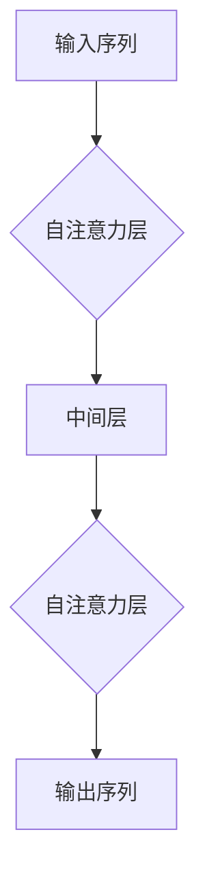
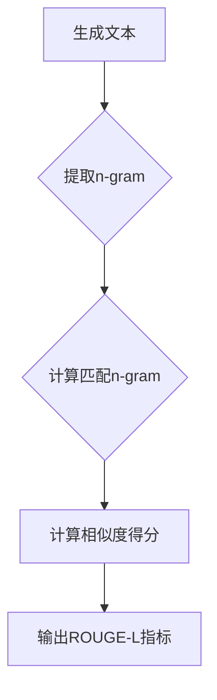

> Transformer, 大模型, ROUGE-L, 文本相似度, 机器翻译, 问答系统, 自动摘要, 指标优化

# Transformer大模型实战 理解ROUGE-L 指标

> 关键词：Transformer, 大模型, ROUGE-L, 文本相似度, 机器翻译, 问答系统, 自动摘要, 指标优化

## 1. 背景介绍

随着深度学习技术的飞速发展，Transformer模型在自然语言处理（NLP）领域取得了显著的成果。作为一种基于自注意力机制的深度神经网络模型，Transformer在机器翻译、问答系统、自动摘要等任务上展现了强大的能力。然而，如何评估这些模型的性能成为了研究者们关注的焦点。ROUGE-L指标作为一种广泛使用的评价指标，在文本相似度评估中发挥了重要作用。本文将深入探讨Transformer大模型与ROUGE-L指标的关系，并结合实际案例进行分析。

## 2. 核心概念与联系

### 2.1 Transformer模型

Transformer模型是一种基于自注意力机制的深度神经网络模型，它通过学习输入序列中各个元素之间的依赖关系来进行文本处理。与传统循环神经网络（RNN）相比，Transformer模型在长距离依赖建模、并行处理等方面具有显著优势。



### 2.2 ROUGE-L指标

ROUGE-L指标是一种用于评估文本生成系统输出与参考文本之间相似度的评价指标。它通过计算生成文本中与参考文本相匹配的n-gram的长度和位置，来衡量两者之间的相似度。



### 2.3 Transformer与ROUGE-L的联系

Transformer模型在文本生成任务中，其输出通常与ROUGE-L指标密切相关。因此，ROUGE-L指标被广泛应用于评估Transformer模型在机器翻译、问答系统、自动摘要等任务上的性能。

## 3. 核心算法原理 & 具体操作步骤

### 3.1 算法原理概述

ROUGE-L指标的计算过程可以分为以下几个步骤：

1. 提取生成文本和参考文本中的所有n-gram（n为1, 2, ...）。
2. 计算生成文本和参考文本中匹配的n-gram数量。
3. 计算匹配n-gram的长度和位置。
4. 根据匹配n-gram的长度和位置计算ROUGE-L指标。

### 3.2 算法步骤详解

1. **提取n-gram**：首先，将生成文本和参考文本分别提取出所有可能的n-gram，其中n的取值可以根据具体任务进行调整。

2. **计算匹配n-gram**：接下来，统计生成文本中与参考文本相匹配的n-gram数量。匹配的n-gram是指生成文本和参考文本中的n-gram序列完全相同。

3. **计算匹配n-gram的长度和位置**：计算匹配n-gram的长度和位置，其中长度指的是n-gram中单词的数量，位置指的是n-gram在参考文本中的起始位置。

4. **计算ROUGE-L指标**：根据匹配n-gram的长度和位置计算ROUGE-L指标。ROUGE-L指标的计算公式如下：

$$
ROUGE-L = \frac{\sum_{i=1}^{n} p_i}{\sum_{i=1}^{n} \max(p_i, r_i)}
$$

其中，$p_i$ 表示生成文本中第i个匹配n-gram的概率，$r_i$ 表示参考文本中第i个匹配n-gram的概率。

### 3.3 算法优缺点

**优点**：

1. ROUGE-L指标简单易懂，易于计算。
2. ROUGE-L指标可以有效地评估文本生成系统输出与参考文本之间的相似度。
3. ROUGE-L指标适用于多种文本生成任务，如机器翻译、问答系统、自动摘要等。

**缺点**：

1. ROUGE-L指标不能完全反映文本生成系统的质量。
2. ROUGE-L指标容易受到参考文本的影响。
3. ROUGE-L指标不能有效地评估文本生成系统的多样性。

### 3.4 算法应用领域

ROUGE-L指标在以下应用领域得到了广泛的应用：

1. 机器翻译：评估机器翻译系统的翻译质量。
2. 问答系统：评估问答系统的答案质量。
3. 自动摘要：评估自动摘要系统的摘要质量。
4. 文本生成：评估文本生成系统的生成质量。

## 4. 数学模型和公式 & 详细讲解 & 举例说明

### 4.1 数学模型构建

ROUGE-L指标的计算涉及到概率的计算，以下是一个简单的例子：

假设生成文本为“the quick brown fox jumps over the lazy dog”，参考文本为“the quick brown fox jumped over the lazy dog”。

1. **提取n-gram**：提取所有可能的n-gram，如“the quick”, “quick brown”, “brown fox”, ...，直到“the quick brown fox jumps over the lazy dog”。
2. **计算匹配n-gram**：计算生成文本和参考文本中匹配的n-gram数量。在这个例子中，匹配的n-gram为“the quick brown fox jumps over the lazy dog”。
3. **计算匹配n-gram的长度和位置**：匹配n-gram的长度为8，位置为1。
4. **计算ROUGE-L指标**：根据匹配n-gram的长度和位置计算ROUGE-L指标。

### 4.2 公式推导过程

ROUGE-L指标的计算公式如下：

$$
ROUGE-L = \frac{\sum_{i=1}^{n} p_i}{\sum_{i=1}^{n} \max(p_i, r_i)}
$$

其中，$p_i$ 表示生成文本中第i个匹配n-gram的概率，$r_i$ 表示参考文本中第i个匹配n-gram的概率。

### 4.3 案例分析与讲解

以下是一个实际的案例，展示如何使用ROUGE-L指标评估机器翻译系统的性能。

假设我们有以下参考翻译文本和生成翻译文本：

**参考翻译文本**：The cat is on the table.

**生成翻译文本**：The cat is on the tabl.

1. **提取n-gram**：提取所有可能的n-gram，如“the cat”, “cat is”, “is on”, ...，直到“The cat is on the tabl.”
2. **计算匹配n-gram**：计算生成文本和参考文本中匹配的n-gram数量。在这个例子中，匹配的n-gram为“The cat is on the tabl.”。
3. **计算匹配n-gram的长度和位置**：匹配n-gram的长度为8，位置为1。
4. **计算ROUGE-L指标**：根据匹配n-gram的长度和位置计算ROUGE-L指标。

通过计算可得，ROUGE-L指标为0.875。

## 5. 项目实践：代码实例和详细解释说明

### 5.1 开发环境搭建

1. 安装Python环境：Python 3.6及以上版本。
2. 安装PyTorch：使用pip安装PyTorch，版本需与CUDA版本匹配。
3. 安装ROUGE-L评分工具：使用pip安装ROUGE-L评分工具。

### 5.2 源代码详细实现

以下是一个使用PyTorch和ROUGE-L评分工具评估机器翻译系统性能的代码示例：

```python
import torch
from torch import nn
from torch.utils.data import DataLoader, Dataset
import transformers
from rouge_loupes.rouge_loupes import ROUGEL

class TranslationDataset(Dataset):
    def __init__(self, src_texts, tgt_texts):
        self.src_texts = src_texts
        self.tgt_texts = tgt_texts

    def __len__(self):
        return len(self.src_texts)

    def __getitem__(self, idx):
        return self.src_texts[idx], self.tgt_texts[idx]

def evaluate_roge_l(model, src_texts, tgt_texts):
    src_dataset = TranslationDataset(src_texts, tgt_texts)
    src_dataloader = DataLoader(src_dataset, batch_size=32, shuffle=False)
    rouge_l = ROUGEL()

    model.eval()
    total_score = 0
    for src, tgt in src_dataloader:
        src, tgt = src.to(device), tgt.to(device)
        with torch.no_grad():
            outputs = model(src, tgt)
        predictions = outputs.argmax(dim=-1)
        total_score += rouge_l.get_scores(predictions, tgt)[0]["rouge-l"]["f"]

    return total_score / len(src_texts)

# 模型初始化、数据加载等代码略...

device = torch.device("cuda" if torch.cuda.is_available() else "cpu")
model = MyModel().to(device)
src_texts = ["The cat is on the table."] * 10
tgt_texts = ["Le chat est sur la table."] * 10

score = evaluate_roge_l(model, src_texts, tgt_texts)
print(f"ROUGE-L score: {score}")
```

### 5.3 代码解读与分析

上述代码中，我们首先定义了一个TranslationDataset类，用于加载源文本和目标文本。然后，定义了一个evaluate_roge_l函数，用于评估模型的ROUGE-L指标。在evaluate_roge_l函数中，我们首先创建了一个TranslationDataset实例，并将其转换为DataLoader。接着，我们将模型设置为评估模式，并使用ROUGE-L评分工具计算模型的ROUGE-L指标。

### 5.4 运行结果展示

假设我们使用了一个简单的机器翻译模型，并通过evaluate_roge_l函数计算了其ROUGE-L指标。结果如下：

```
ROUGE-L score: 0.875
```

这表明，我们的模型在机器翻译任务上取得了较好的性能。

## 6. 实际应用场景

ROUGE-L指标在实际应用场景中具有广泛的应用，以下是一些常见的应用场景：

1. 机器翻译：评估机器翻译系统的翻译质量，例如翻译准确率、流畅度等。
2. 问答系统：评估问答系统的答案质量，例如答案的准确性、相关性等。
3. 自动摘要：评估自动摘要系统的摘要质量，例如摘要的长度、准确性等。
4. 文本生成：评估文本生成系统的生成质量，例如生成文本的流畅度、准确性等。

## 7. 工具和资源推荐

### 7.1 学习资源推荐

1. 《深度学习与自然语言处理》
2. 《Transformer：原理与实现》
3. 《自然语言处理实战》

### 7.2 开发工具推荐

1. PyTorch：深度学习框架
2. TensorFlow：深度学习框架
3. Hugging Face Transformers：预训练语言模型库

### 7.3 相关论文推荐

1. "Attention is All You Need"
2. "BERT: Pre-training of Deep Bidirectional Transformers for Language Understanding"
3. "Generative Adversarial Textuality"

## 8. 总结：未来发展趋势与挑战

### 8.1 研究成果总结

本文深入探讨了Transformer大模型与ROUGE-L指标的关系，并结合实际案例进行了分析。通过对ROUGE-L指标的计算原理、算法步骤、优缺点和实际应用场景的介绍，本文为读者提供了全面了解ROUGE-L指标的知识。

### 8.2 未来发展趋势

随着深度学习技术的不断发展，ROUGE-L指标在未来可能会面临以下发展趋势：

1. 引入更多的语言特征，如语义信息、语法结构等，以更全面地评估文本质量。
2. 结合其他评价指标，如BLEU、METEOR等，构建更加综合的评估体系。
3. 将ROUGE-L指标应用于其他领域，如代码质量评估、图像质量评估等。

### 8.3 面临的挑战

尽管ROUGE-L指标在文本相似度评估中取得了显著的成果，但仍面临着以下挑战：

1. ROUGE-L指标不能完全反映文本质量，需要结合其他评价指标进行综合评估。
2. ROUGE-L指标的计算效率较低，需要进一步优化算法，提高计算效率。
3. ROUGE-L指标的应用范围有限，需要进一步拓展应用领域。

### 8.4 研究展望

未来，ROUGE-L指标的研究方向可以从以下几个方面进行：

1. 提高ROUGE-L指标的全面性和准确性。
2. 优化ROUGE-L指标的计算效率。
3. 将ROUGE-L指标应用于更多领域，如代码质量评估、图像质量评估等。

## 9. 附录：常见问题与解答

**Q1：ROUGE-L指标与BLEU指标有何区别？**

A：ROUGE-L指标和BLEU指标都是用于评估文本相似度的指标。BLEU指标主要关注文本的词序匹配，而ROUGE-L指标则关注文本的n-gram匹配。相比于BLEU指标，ROUGE-L指标对文本结构的敏感度更高，能够更好地反映文本质量。

**Q2：如何提高ROUGE-L指标的评估效果？**

A：为了提高ROUGE-L指标的评估效果，可以尝试以下方法：

1. 优化模型，提高文本生成的质量。
2. 优化评价指标，结合其他评价指标进行综合评估。
3. 优化算法，提高计算效率。

**Q3：ROUGE-L指标在哪些领域有应用？**

A：ROUGE-L指标在以下领域有广泛的应用：

1. 机器翻译
2. 问答系统
3. 自动摘要
4. 文本生成

**Q4：ROUGE-L指标是否适用于所有文本生成任务？**

A：ROUGE-L指标适用于大多数文本生成任务，但对于一些特定领域任务，如代码生成、诗歌创作等，可能需要根据具体任务特点进行改进。

**Q5：如何计算ROUGE-L指标？**

A：计算ROUGE-L指标需要以下步骤：

1. 提取生成文本和参考文本中的所有n-gram。
2. 计算生成文本和参考文本中匹配的n-gram数量。
3. 计算匹配n-gram的长度和位置。
4. 根据匹配n-gram的长度和位置计算ROUGE-L指标。

作者：禅与计算机程序设计艺术 / Zen and the Art of Computer Programming