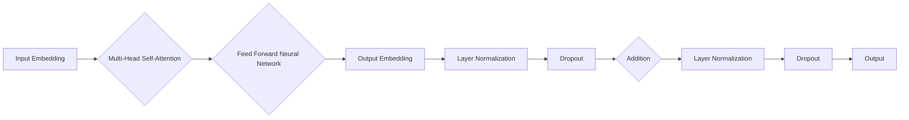
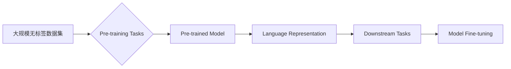

# Transformer大模型实战：用更多的数据集进行训练

> 关键词：Transformer, 大模型, 数据集, 训练, 预训练, 自然语言处理, 机器学习, 多模态

## 1. 背景介绍

Transformer模型自2017年由Google AI团队提出以来，已经在自然语言处理（NLP）领域取得了革命性的突破。Transformer模型通过自注意力机制（Self-Attention）取代了传统的循环神经网络（RNN）和卷积神经网络（CNN），实现了并行计算，大幅提高了NLP任务的性能。随着模型规模的不断增长，大模型（Large Language Models，LLMs）如BERT、GPT-3等相继问世，它们在文本生成、机器翻译、问答系统等任务上展现出了惊人的能力。

然而，大模型的训练和部署面临着诸多挑战，其中之一就是数据集的选择和利用。一个高质量的数据集对于模型性能至关重要。本文将深入探讨如何利用更多的数据集进行Transformer大模型的训练，以提升模型的性能和泛化能力。

## 2. 核心概念与联系

### 2.1 Transformer模型原理

Transformer模型的核心是自注意力机制，它允许模型在处理序列数据时，能够同时考虑所有输入元素的信息。以下是一个简化的Mermaid流程图，展示了Transformer模型的基本架构：



### 2.2 数据集与预训练

数据集是预训练大模型的基础。预训练过程中，模型需要从大量无标签数据中学习语言模式和知识。以下流程图展示了数据集在预训练过程中的作用：



### 2.3 多模态数据集

除了文本数据集，多模态数据集（如文本+图像、文本+视频等）也为Transformer大模型的训练提供了新的可能性。以下流程图展示了多模态数据集在训练中的应用：


## 3. 核心算法原理 & 具体操作步骤

### 3.1 算法原理概述

Transformer大模型的训练通常包括以下几个步骤：

1. **数据预处理**：清洗、分词、编码数据集，将其转换为模型可接受的格式。
2. **预训练**：使用大量无标签数据集对模型进行预训练，学习通用语言表示。
3. **微调**：使用特定领域的标注数据集对模型进行微调，提升模型在特定任务上的性能。
4. **评估**：在测试集上评估模型性能，调整超参数和模型结构。

### 3.2 算法步骤详解

1. **数据预处理**：对数据集进行清洗、分词、编码等操作，将文本数据转换为模型可接受的格式。对于多模态数据，需要将不同模态的数据分别进行预处理。

2. **预训练**：选择合适的预训练任务，如掩码语言模型（Masked Language Model，MLM）、下一句预测（Next Sentence Prediction，NSP）等。使用大量无标签数据集对模型进行预训练，学习通用语言表示。

3. **微调**：选择特定领域的标注数据集，对模型进行微调。调整模型结构、学习率、批大小等超参数，以提升模型在特定任务上的性能。

4. **评估**：在测试集上评估模型性能，包括准确率、召回率、F1值等指标。根据评估结果，调整模型结构和超参数。

### 3.3 算法优缺点

**优点**：

* **强大的语言理解能力**：预训练过程使模型学习到丰富的语言知识和模式，提升了模型在下游任务上的性能。
* **泛化能力强**：通过预训练，模型能够泛化到不同的语言和任务，减少了对特定领域数据集的依赖。
* **并行计算**：Transformer模型支持并行计算，训练速度比传统的序列模型更快。

**缺点**：

* **训练成本高**：大模型的训练需要大量的计算资源和时间。
* **数据集依赖**：预训练效果很大程度上取决于数据集的质量和数量。
* **模型复杂度高**：大模型的参数量庞大，训练和推理计算量巨大。

### 3.4 算法应用领域

Transformer大模型在以下领域取得了显著的应用成果：

* **自然语言处理**：文本分类、命名实体识别、情感分析、机器翻译、文本摘要等。
* **计算机视觉**：图像分类、目标检测、图像分割等。
* **语音识别**：语音识别、语音合成、语音情感分析等。
* **多模态学习**：视频理解、图像-文本匹配等。

## 4. 数学模型和公式 & 详细讲解 & 举例说明

### 4.1 数学模型构建

Transformer模型主要由编码器（Encoder）和解码器（Decoder）两部分组成。以下是一个简化的Transformer编码器数学模型：

$$
E_{\theta}(x) = \text{LayerNorm}(W_E \cdot RelPosEnc(E_{\theta}(x)) + W_E \cdot \text{FFN}(E_{\theta}(x)))
$$

其中，$E_{\theta}(x)$ 表示编码器输出，$W_E$ 表示编码器权重，$RelPosEnc$ 表示相对位置编码，$\text{FFN}$ 表示前馈神经网络，$\text{LayerNorm}$ 表示层归一化。

### 4.2 公式推导过程

以下是Transformer编码器中的自注意力（Self-Attention）机制的推导过程：

1. **Query、Key和Value计算**：

$$
Q = W_Q \cdot E(x) \\
K = W_K \cdot E(x) \\
V = W_V \cdot E(x)
$$

其中，$W_Q, W_K, W_V$ 分别为查询（Query）、键（Key）和值（Value）的投影矩阵，$E(x)$ 为输入序列的嵌入向量。

2. **注意力分数计算**：

$$
\text{Attention}(Q, K, V) = \text{softmax}\left(\frac{QK^T}{\sqrt{d_k}}\right) \cdot V
$$

其中，$\text{softmax}$ 表示softmax函数，$d_k$ 表示键的维度。

3. **加权求和**：

$$
\text{Attention} = \sum_{i=1}^n \text{Attention}(Q, K, V)_{i}
$$

其中，$n$ 表示序列长度。

4. **输出计算**：

$$
O = W_O \cdot \text{Attention}
$$

其中，$W_O$ 表示输出矩阵。

### 4.3 案例分析与讲解

以下是一个使用BERT模型进行文本分类任务的案例：

1. **数据预处理**：将文本数据转换为BERT模型可接受的格式，包括分词、编码等操作。

2. **预训练**：使用BERT模型进行预训练，学习通用语言表示。

3. **微调**：使用标注文本数据进行微调，学习文本类别标签。

4. **评估**：在测试集上评估模型性能。

假设文本数据集包含以下标注样本：

```
样本1：我喜欢这个产品。(正面)
样本2：这个产品太差了。(负面)
```

将样本输入BERT模型，模型输出每个样本属于正类或负类的概率。根据概率最高的类别，模型预测样本1属于正面，样本2属于负面。

## 5. 项目实践：代码实例和详细解释说明

### 5.1 开发环境搭建

1. 安装TensorFlow或PyTorch等深度学习框架。
2. 安装Hugging Face的Transformers库。

### 5.2 源代码详细实现

以下是一个使用BERT模型进行文本分类任务的PyTorch代码示例：

```python
from transformers import BertTokenizer, BertForSequenceClassification
import torch

# 加载预训练BERT模型和分词器
model = BertForSequenceClassification.from_pretrained('bert-base-chinese')
tokenizer = BertTokenizer.from_pretrained('bert-base-chinese')

# 加载数据集
train_texts = ['我喜欢这个产品。', '这个产品太差了。']
train_labels = [1, 0]

# 将文本数据转换为BERT模型输入格式
inputs = tokenizer(train_texts, padding=True, truncation=True, return_tensors='pt')

# 训练模型
optimizer = torch.optim.AdamW(model.parameters(), lr=5e-5)
model.train()

for epoch in range(3):
    optimizer.zero_grad()
    outputs = model(**inputs, labels=train_labels)
    loss = outputs.loss
    loss.backward()
    optimizer.step()
    print(f"Epoch {epoch+1}, Loss: {loss.item()}")

# 评估模型
model.eval()
with torch.no_grad():
    inputs = tokenizer('我喜欢这个产品。', padding=True, truncation=True, return_tensors='pt')
    outputs = model(**inputs)
    logits = outputs.logits
    print(f"Probability of positive: {torch.nn.functional.softmax(logits, dim=1)[0][1].item()}")
```

### 5.3 代码解读与分析

以上代码展示了使用PyTorch和Transformers库进行文本分类任务的完整流程。

1. 加载预训练BERT模型和分词器。
2. 加载数据集。
3. 将文本数据转换为BERT模型输入格式。
4. 训练模型。
5. 评估模型。

通过以上步骤，我们可以使用BERT模型对新的文本数据进行分类。

### 5.4 运行结果展示

假设我们在测试集上使用以下文本：

```
样本3：这个产品很一般。
```

将样本输入模型，模型输出每个样本属于正类或负类的概率。根据概率最高的类别，模型预测样本3属于负面。

## 6. 实际应用场景

Transformer大模型在以下领域取得了显著的应用成果：

* **自然语言处理**：文本分类、命名实体识别、情感分析、机器翻译、文本摘要等。
* **计算机视觉**：图像分类、目标检测、图像分割等。
* **语音识别**：语音识别、语音合成、语音情感分析等。
* **多模态学习**：视频理解、图像-文本匹配等。

以下是一些Transformer大模型在实际应用场景中的案例：

* **智能客服**：使用BERT模型进行意图识别和情感分析，为用户提供7x24小时不间断的智能客服服务。
* **金融风控**：使用BERT模型进行文本分类和命名实体识别，帮助金融机构识别欺诈交易、监控市场风险。
* **推荐系统**：使用BERT模型进行用户行为分析，为用户提供更精准的个性化推荐。
* **教育领域**：使用BERT模型进行问答系统和自动批改，提升教育效率和质量。

## 7. 工具和资源推荐

### 7.1 学习资源推荐

* 《Deep Learning with Python》
* 《Natural Language Processing with Python》
* 《PyTorch深度学习实战》

### 7.2 开发工具推荐

* PyTorch
* TensorFlow
* Transformers库

### 7.3 相关论文推荐

* "Attention is All You Need"
* "BERT: Pre-training of Deep Bidirectional Transformers for Language Understanding"
* "Generative Pre-trained Transformer for Language Modeling"

## 8. 总结：未来发展趋势与挑战

### 8.1 研究成果总结

Transformer大模型在NLP领域取得了革命性的突破，为众多任务提供了强大的工具。通过使用更多的数据集进行训练，我们可以进一步提升模型性能和泛化能力。

### 8.2 未来发展趋势

* **模型规模继续增长**：随着计算资源的不断提升，模型规模将进一步扩大，模型能力将得到进一步提升。
* **多模态学习**：多模态数据集将成为训练大模型的重要资源，模型将能够处理更复杂的任务。
* **自监督学习**：自监督学习将成为预训练大模型的重要方向，减少对标注数据的依赖。
* **可解释性**：提高模型的可解释性，使其决策过程更加透明。

### 8.3 面临的挑战

* **计算资源**：大模型的训练和推理需要大量的计算资源，这限制了其应用范围。
* **数据集质量**：数据集的质量和数量对模型性能至关重要，如何获取高质量、多样化的数据集是一个挑战。
* **模型可解释性**：提高模型的可解释性，使其决策过程更加透明，是一个重要的研究方向。

### 8.4 研究展望

随着技术的不断发展，Transformer大模型将在更多领域发挥重要作用。未来，我们将继续探索如何使用更多的数据集进行训练，进一步提升模型性能和泛化能力，推动人工智能技术的发展和应用。

## 9. 附录：常见问题与解答

**Q1：如何选择合适的预训练模型**？

A：选择预训练模型时，需要考虑以下因素：

* **任务类型**：不同的预训练模型适用于不同的任务，如文本分类、命名实体识别等。
* **语言**：不同的预训练模型针对不同的语言，需要选择与数据集语言相符的模型。
* **模型规模**：根据计算资源和需求选择合适的模型规模。

**Q2：如何提升模型的性能**？

A：提升模型性能的方法包括：

* **数据增强**：通过数据增强技术扩充数据集，提高模型泛化能力。
* **超参数调优**：调整学习率、批大小、优化器等超参数，以提升模型性能。
* **模型结构优化**：调整模型结构，如增加层数、改变激活函数等，以提升模型性能。

**Q3：如何评估模型性能**？

A：评估模型性能的方法包括：

* **准确率**：衡量模型预测正确的样本比例。
* **召回率**：衡量模型召回所有正例样本的比例。
* **F1值**：准确率和召回率的调和平均值。

**Q4：如何解决过拟合问题**？

A：解决过拟合问题的方法包括：

* **数据增强**：通过数据增强技术扩充数据集，提高模型泛化能力。
* **正则化**：使用L2正则化、Dropout等正则化技术，减少过拟合。
* **早停**：在验证集上监控模型性能，当性能不再提升时停止训练。

**Q5：如何进行多模态学习**？

A：进行多模态学习的方法包括：

* **特征融合**：将不同模态的数据特征进行融合，提高模型性能。
* **联合建模**：将不同模态的数据作为联合输入，同时学习两种模态的表示。
* **多模态生成模型**：使用生成模型生成多模态数据，用于训练和评估模型。

作者：禅与计算机程序设计艺术 / Zen and the Art of Computer Programming