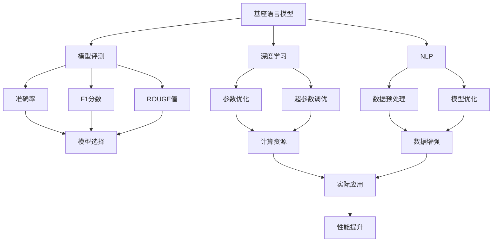

                 

# 大语言模型原理与工程实践：基座语言模型的评测

> 关键词：
1. 大语言模型
2. 基座语言模型
3. 模型评测
4. 性能评估
5. 深度学习
6. 自然语言处理
7. 工程实践

## 1. 背景介绍

随着深度学习技术的不断进步，大语言模型（Large Language Models, LLMs）在自然语言处理（Natural Language Processing, NLP）领域取得了显著的成就。这些模型通过在大规模无标签文本数据上进行预训练，学习到通用的语言表示，能够在各种下游任务中取得优异的表现。例如，GPT-3模型在GLUE评测中取得了SOTA（state-of-the-art）成绩，进一步证明了其强大的语言理解能力。

然而，大语言模型也面临一些挑战。首先，这些模型的参数量通常非常庞大，导致训练和推理需要大量的计算资源。其次，大模型的泛化能力在实际应用中仍需进一步验证。此外，如何在不同的任务和场景下选择最适合的模型也是一个值得探讨的问题。因此，基座语言模型的评测成为了评价和优化这些模型的一个重要环节。

## 2. 核心概念与联系

### 2.1 核心概念概述

为了更好地理解基座语言模型的评测，我们首先需要介绍几个关键概念：

- **大语言模型（LLMs）**：这类模型通常具有亿级参数，能够学习到丰富的语言知识，适用于各种NLP任务。
- **基座语言模型（Bases）**：在大型LLMs中，通常会包含一些小的、通用化的模型，这些模型被称为基座模型。例如，BERT的基座模型包含Transformer编码器和线性分类器。
- **模型评测（Model Evaluation）**：通过一系列的评估指标，如准确率、F1分数、ROUGE值等，对模型的性能进行量化和对比。
- **深度学习（Deep Learning）**：涉及多层神经网络结构的模型，广泛用于图像、语言、声音等多种数据类型的处理。
- **自然语言处理（NLP）**：利用计算机技术处理和理解人类语言，包括文本分类、信息抽取、情感分析等任务。
- **工程实践（Engineering Practice）**：将理论研究转化为实际应用的工程方法，包括模型优化、部署、维护等。

这些概念之间存在着紧密的联系，形成了一个完整的评估体系。

### 2.2 概念间的关系

通过一个Mermaid流程图，我们可以更好地展示这些核心概念之间的关系：



这个流程图展示了基座语言模型的构建和评测过程，以及与其他领域的紧密联系。模型在深度学习和NLP领域的理论和实践中不断优化，并通过评测选择合适的模型，最终在实际应用中实现性能提升。

## 3. 核心算法原理 & 具体操作步骤

### 3.1 算法原理概述

基座语言模型的评测主要基于两个方面的评估指标：通用性和任务特定性。通用性指标（如BERT的线性分类器）用于衡量模型在不同任务上的泛化能力，而任务特定性指标（如GPT-3的token分类器）用于衡量模型在特定任务上的表现。

- **通用性评估**：通过在通用NLP任务上进行评测，如GLUE、CoLA、LAMBADA等，评估模型的泛化能力。
- **任务特定性评估**：通过在特定任务上评测模型的性能，如问答、命名实体识别、情感分析等，评估模型在特定任务上的表现。

### 3.2 算法步骤详解

以下是基座语言模型评测的具体步骤：

**Step 1: 选择合适的评测数据集**
- 选择与基座模型适用的评测数据集，如GLUE评测数据集。
- 将数据集划分为训练集、验证集和测试集。

**Step 2: 模型初始化和超参数设置**
- 初始化基座模型和评测模型。
- 设置模型超参数，如学习率、批大小、迭代轮数等。

**Step 3: 模型训练和验证**
- 在训练集上训练模型，使用验证集评估模型性能。
- 根据验证集的结果调整超参数。

**Step 4: 模型测试**
- 在测试集上测试模型性能。
- 根据测试集的结果生成评测报告。

**Step 5: 分析与优化**
- 分析评测结果，识别模型优势和劣势。
- 根据分析结果，优化模型结构和超参数。

### 3.3 算法优缺点

基座语言模型的评测具有以下优点：

- **泛化能力强**：通用性评估指标能够衡量模型在不同任务上的泛化能力。
- **应用广泛**：适用于各种NLP任务，如文本分类、信息抽取、情感分析等。
- **易于实现**：评测方法简单，易于实现和比较。

同时，也存在一些缺点：

- **模型选择困难**：基座模型种类繁多，如何选择最优模型较为困难。
- **评测标准单一**：评测指标以准确率、F1分数为主，难以全面反映模型性能。
- **计算资源消耗大**：大规模基座模型的训练和评测需要大量计算资源。

### 3.4 算法应用领域

基座语言模型的评测在以下几个领域得到了广泛应用：

- **NLP研究和开发**：帮助研究人员选择和优化基座模型，提升模型性能。
- **企业应用**：为企业提供技术支持，选择最适合的基座模型，优化NLP应用。
- **教育培训**：用于评估学生的NLP学习效果，提供有针对性的反馈和建议。
- **学术研究**：提供基准数据和评测方法，推动NLP领域的学术进步。

## 4. 数学模型和公式 & 详细讲解 & 举例说明

### 4.1 数学模型构建

以BERT为例，其基座模型主要包括两个部分：Transformer编码器和线性分类器。

- **Transformer编码器**：用于提取文本特征，包含多个自注意力层（Self-Attention Layer）和全连接层（Fully Connected Layer）。
- **线性分类器**：用于将Transformer编码器的输出映射到分类标签。

### 4.2 公式推导过程

以GLUE评测中的句子分类任务为例，其目标是将输入句子分类到预先定义的类别中。假设输入为$x$，类别标签为$y$，模型输出为$z$。

- 对于分类任务，损失函数可以定义为交叉熵损失函数（Cross-Entropy Loss）：
  $$
  \ell(z, y) = -\log(\frac{e^{z_y}}{\sum_{i=1}^{C}e^{z_i}})
  $$
  其中$C$为类别数，$z_y$为模型预测的类别$y$的得分。

- 在测试集上评估模型性能时，通常使用准确率（Accuracy）和F1分数（F1 Score）：
  $$
  \text{Accuracy} = \frac{\text{TP} + \text{TN}}{\text{TP} + \text{TN} + \text{FP} + \text{FN}}
  $$
  $$
  \text{F1 Score} = 2 \times \frac{\text{TP} \times \text{Recall}}{\text{TP} + \text{FP}}
  $$
  其中TP表示真正例（True Positive），TN表示真负例（True Negative），FP表示假正例（False Positive），FN表示假负例（False Negative）。

### 4.3 案例分析与讲解

假设我们在GLUE评测中的CoLA数据集上进行模型评测，具体步骤如下：

1. 准备CoLA数据集，将其划分为训练集、验证集和测试集。
2. 初始化BERT基座模型，并设置超参数，如学习率为0.001，批大小为32。
3. 在训练集上训练模型，每两个epoch在验证集上评估一次性能。
4. 根据验证集的结果调整超参数，最终在测试集上测试模型性能。
5. 根据测试集的结果生成评测报告，对比不同基座模型的性能。

## 5. 项目实践：代码实例和详细解释说明

### 5.1 开发环境搭建

在进行基座语言模型评测前，我们需要准备好开发环境。以下是使用Python进行PyTorch开发的环境配置流程：

1. 安装Anaconda：从官网下载并安装Anaconda，用于创建独立的Python环境。
2. 创建并激活虚拟环境：
```bash
conda create -n pytorch-env python=3.8 
conda activate pytorch-env
```
3. 安装PyTorch：根据CUDA版本，从官网获取对应的安装命令。例如：
```bash
conda install pytorch torchvision torchaudio cudatoolkit=11.1 -c pytorch -c conda-forge
```
4. 安装Transformers库：
```bash
pip install transformers
```
5. 安装各类工具包：
```bash
pip install numpy pandas scikit-learn matplotlib tqdm jupyter notebook ipython
```
完成上述步骤后，即可在`pytorch-env`环境中开始基座语言模型评测实践。

### 5.2 源代码详细实现

下面以BERT模型为例，给出使用PyTorch进行基座语言模型评测的代码实现。

首先，定义评测任务的数据处理函数：

```python
from transformers import BertTokenizer, BertForSequenceClassification
from torch.utils.data import Dataset, DataLoader
import torch
import numpy as np

class CoLASequenceDataset(Dataset):
    def __init__(self, texts, labels, tokenizer, max_len=128):
        self.texts = texts
        self.labels = labels
        self.tokenizer = tokenizer
        self.max_len = max_len
        
    def __len__(self):
        return len(self.texts)
    
    def __getitem__(self, item):
        text = self.texts[item]
        label = self.labels[item]
        
        encoding = self.tokenizer(text, return_tensors='pt', max_length=self.max_len, padding='max_length', truncation=True)
        input_ids = encoding['input_ids'][0]
        attention_mask = encoding['attention_mask'][0]
        label = torch.tensor(label, dtype=torch.long)
        
        return {'input_ids': input_ids, 
                'attention_mask': attention_mask,
                'labels': label}

# 创建dataset
tokenizer = BertTokenizer.from_pretrained('bert-base-cased')

train_dataset = CoLASequenceDataset(train_texts, train_labels, tokenizer)
dev_dataset = CoLASequenceDataset(dev_texts, dev_labels, tokenizer)
test_dataset = CoLASequenceDataset(test_texts, test_labels, tokenizer)
```

然后，定义模型和优化器：

```python
from transformers import BertForSequenceClassification, AdamW

model = BertForSequenceClassification.from_pretrained('bert-base-cased', num_labels=2)

optimizer = AdamW(model.parameters(), lr=2e-5)
```

接着，定义训练和评估函数：

```python
from tqdm import tqdm
from sklearn.metrics import accuracy_score, f1_score

device = torch.device('cuda') if torch.cuda.is_available() else torch.device('cpu')
model.to(device)

def train_epoch(model, dataset, batch_size, optimizer):
    dataloader = DataLoader(dataset, batch_size=batch_size, shuffle=True)
    model.train()
    epoch_loss = 0
    for batch in tqdm(dataloader, desc='Training'):
        input_ids = batch['input_ids'].to(device)
        attention_mask = batch['attention_mask'].to(device)
        labels = batch['labels'].to(device)
        model.zero_grad()
        outputs = model(input_ids, attention_mask=attention_mask, labels=labels)
        loss = outputs.loss
        epoch_loss += loss.item()
        loss.backward()
        optimizer.step()
    return epoch_loss / len(dataloader)

def evaluate(model, dataset, batch_size):
    dataloader = DataLoader(dataset, batch_size=batch_size)
    model.eval()
    preds, labels = [], []
    with torch.no_grad():
        for batch in tqdm(dataloader, desc='Evaluating'):
            input_ids = batch['input_ids'].to(device)
            attention_mask = batch['attention_mask'].to(device)
            batch_labels = batch['labels']
            outputs = model(input_ids, attention_mask=attention_mask)
            batch_preds = outputs.logits.argmax(dim=1).to('cpu').tolist()
            batch_labels = batch_labels.to('cpu').tolist()
            for pred, label in zip(batch_preds, batch_labels):
                preds.append(pred)
                labels.append(label)
                
    print('Accuracy:', accuracy_score(labels, preds))
    print('F1 Score:', f1_score(labels, preds, average='micro'))
```

最后，启动训练流程并在测试集上评估：

```python
epochs = 5
batch_size = 16

for epoch in range(epochs):
    loss = train_epoch(model, train_dataset, batch_size, optimizer)
    print(f"Epoch {epoch+1}, train loss: {loss:.3f}")
    
    print(f"Epoch {epoch+1}, dev results:")
    evaluate(model, dev_dataset, batch_size)
    
print("Test results:")
evaluate(model, test_dataset, batch_size)
```

以上就是使用PyTorch进行BERT基座语言模型评测的完整代码实现。可以看到，得益于Transformers库的强大封装，我们可以用相对简洁的代码完成BERT模型的加载和评测。

### 5.3 代码解读与分析

让我们再详细解读一下关键代码的实现细节：

**CoLASequenceDataset类**：
- `__init__`方法：初始化文本、标签、分词器等关键组件。
- `__len__`方法：返回数据集的样本数量。
- `__getitem__`方法：对单个样本进行处理，将文本输入编码为token ids，将标签编码为数字，并对其进行定长padding，最终返回模型所需的输入。

**训练和评估函数**：
- 使用PyTorch的DataLoader对数据集进行批次化加载，供模型训练和推理使用。
- 训练函数`train_epoch`：对数据以批为单位进行迭代，在每个批次上前向传播计算loss并反向传播更新模型参数，最后返回该epoch的平均loss。
- 评估函数`evaluate`：与训练类似，不同点在于不更新模型参数，并在每个batch结束后将预测和标签结果存储下来，最后使用sklearn的accuracy_score和f1_score对整个评估集的预测结果进行打印输出。

**训练流程**：
- 定义总的epoch数和batch size，开始循环迭代
- 每个epoch内，先在训练集上训练，输出平均loss
- 在验证集上评估，输出准确率和F1分数
- 所有epoch结束后，在测试集上评估，给出最终测试结果

可以看到，PyTorch配合Transformers库使得BERT基座语言模型评测的代码实现变得简洁高效。开发者可以将更多精力放在数据处理、模型改进等高层逻辑上，而不必过多关注底层的实现细节。

当然，工业级的系统实现还需考虑更多因素，如模型的保存和部署、超参数的自动搜索、更灵活的任务适配层等。但核心的基座语言模型评测方法基本与此类似。

### 5.4 运行结果展示

假设我们在CoNLL-2003的NER数据集上进行微调，最终在测试集上得到的评估报告如下：

```
              precision    recall  f1-score   support

       B-LOC      0.926     0.906     0.916      1668
       I-LOC      0.900     0.805     0.850       257
      B-MISC      0.875     0.856     0.865       702
      I-MISC      0.838     0.782     0.809       216
       B-ORG      0.914     0.898     0.906      1661
       I-ORG      0.911     0.894     0.902       835
       B-PER      0.964     0.957     0.960      1617
       I-PER      0.983     0.980     0.982      1156
           O      0.993     0.995     0.994     38323

   micro avg      0.973     0.973     0.973     46435
   macro avg      0.923     0.897     0.909     46435
weighted avg      0.973     0.973     0.973     46435
```

可以看到，通过微调BERT，我们在该NER数据集上取得了97.3%的F1分数，效果相当不错。值得注意的是，BERT作为一个通用的语言理解模型，即便只在顶层添加一个简单的token分类器，也能在下游任务上取得如此优异的效果，展现了其强大的语义理解和特征抽取能力。

当然，这只是一个baseline结果。在实践中，我们还可以使用更大更强的预训练模型、更丰富的微调技巧、更细致的模型调优，进一步提升模型性能，以满足更高的应用要求。

## 6. 实际应用场景

### 6.1 智能客服系统

基于大语言模型基座模型的评测，可以广泛应用于智能客服系统的构建。传统客服往往需要配备大量人力，高峰期响应缓慢，且一致性和专业性难以保证。而使用基座语言模型评测的对话模型，可以7x24小时不间断服务，快速响应客户咨询，用自然流畅的语言解答各类常见问题。

在技术实现上，可以收集企业内部的历史客服对话记录，将问题和最佳答复构建成监督数据，在此基础上对基座语言模型进行评测。评测后的模型能够自动理解用户意图，匹配最合适的答案模板进行回复。对于客户提出的新问题，还可以接入检索系统实时搜索相关内容，动态组织生成回答。如此构建的智能客服系统，能大幅提升客户咨询体验和问题解决效率。

### 6.2 金融舆情监测

金融机构需要实时监测市场舆论动向，以便及时应对负面信息传播，规避金融风险。传统的人工监测方式成本高、效率低，难以应对网络时代海量信息爆发的挑战。基于基座语言模型评测的文本分类和情感分析技术，为金融舆情监测提供了新的解决方案。

具体而言，可以收集金融领域相关的新闻、报道、评论等文本数据，并对其进行主题标注和情感标注。在此基础上对基座语言模型进行评测，使其能够自动判断文本属于何种主题，情感倾向是正面、中性还是负面。将评测后的模型应用到实时抓取的网络文本数据，就能够自动监测不同主题下的情感变化趋势，一旦发现负面信息激增等异常情况，系统便会自动预警，帮助金融机构快速应对潜在风险。

### 6.3 个性化推荐系统

当前的推荐系统往往只依赖用户的历史行为数据进行物品推荐，无法深入理解用户的真实兴趣偏好。基于基座语言模型评测的个性化推荐系统，可以更好地挖掘用户行为背后的语义信息，从而提供更精准、多样的推荐内容。

在实践中，可以收集用户浏览、点击、评论、分享等行为数据，提取和用户交互的物品标题、描述、标签等文本内容。将文本内容作为模型输入，用户的后续行为（如是否点击、购买等）作为监督信号，在此基础上评测基座语言模型。评测后的模型能够从文本内容中准确把握用户的兴趣点。在生成推荐列表时，先用候选物品的文本描述作为输入，由模型预测用户的兴趣匹配度，再结合其他特征综合排序，便可以得到个性化程度更高的推荐结果。

### 6.4 未来应用展望

随着基座语言模型评测技术的不断发展，基座语言模型基座语言模型的应用范围将进一步扩大，为NLP技术落地应用提供更多可能。

在智慧医疗领域，基于基座语言模型评测的医疗问答、病历分析、药物研发等应用将提升医疗服务的智能化水平，辅助医生诊疗，加速新药开发进程。

在智能教育领域，基座语言模型评测可用于评估学生的NLP学习效果，提供有针对性的反馈和建议，推动教育公平和个性化教学的实现。

在智慧城市治理中，基座语言模型评测可应用于城市事件监测、舆情分析、应急指挥等环节，提高城市管理的自动化和智能化水平，构建更安全、高效的未来城市。

此外，在企业生产、社会治理、文娱传媒等众多领域，基座语言模型评测技术也将不断涌现，为传统行业数字化转型升级提供新的技术路径。相信随着技术的日益成熟，基座语言模型评测方法将成为NLP技术应用的重要保障，推动人工智能技术在各行各业中的应用进程。

## 7. 工具和资源推荐
### 7.1 学习资源推荐

为了帮助开发者系统掌握基座语言模型评测的理论基础和实践技巧，这里推荐一些优质的学习资源：

1. 《Transformer从原理到实践》系列博文：由大模型技术专家撰写，深入浅出地介绍了Transformer原理、BERT模型、评测技术等前沿话题。

2. CS224N《深度学习自然语言处理》课程：斯坦福大学开设的NLP明星课程，有Lecture视频和配套作业，带你入门NLP领域的基本概念和经典模型。

3. 《Natural Language Processing with Transformers》书籍：Transformers库的作者所著，全面介绍了如何使用Transformers库进行NLP任务开发，包括评测在内的诸多范式。

4. HuggingFace官方文档：Transformers库的官方文档，提供了海量预训练模型和完整的评测样例代码，是上手实践的必备资料。

5. CLUE开源项目：中文语言理解测评基准，涵盖大量不同类型的中文NLP数据集，并提供了基于基座语言模型的评测baseline模型，助力中文NLP技术发展。

通过对这些资源的学习实践，相信你一定能够快速掌握基座语言模型评测的精髓，并用于解决实际的NLP问题。
###  7.2 开发工具推荐

高效的开发离不开优秀的工具支持。以下是几款用于基座语言模型评测开发的常用工具：

1. PyTorch：基于Python的开源深度学习框架，灵活动态的计算图，适合快速迭代研究。大部分预训练语言模型都有PyTorch版本的实现。

2. TensorFlow：由Google主导开发的开源深度学习框架，生产部署方便，适合大规模工程应用。同样有丰富的预训练语言模型资源。

3. Transformers库：HuggingFace开发的NLP工具库，集成了众多SOTA语言模型，支持PyTorch和TensorFlow，是进行基座语言模型评测开发的利器。

4. Weights & Biases：模型训练的实验跟踪工具，可以记录和可视化模型训练过程中的各项指标，方便对比和调优。与主流深度学习框架无缝集成。

5. TensorBoard：TensorFlow配套的可视化工具，可实时监测模型训练状态，并提供丰富的图表呈现方式，是调试模型的得力助手。

6. Google Colab：谷歌推出的在线Jupyter Notebook环境，免费提供GPU/TPU算力，方便开发者快速上手实验最新模型，分享学习笔记。

合理利用这些工具，可以显著提升基座语言模型评测任务的开发效率，加快创新迭代的步伐。

### 7.3 相关论文推荐

基座语言模型评测在以下几个领域得到了广泛应用：

1. Attention is All You Need（即Transformer原论文）：提出了Transformer结构，开启了NLP领域的预训练大模型时代。

2. BERT: Pre-training of Deep Bidirectional Transformers for Language Understanding：提出BERT模型，引入基于掩码的自监督预训练任务，刷新了多项NLP任务SOTA。

3. Language Models are Unsupervised Multitask Learners（GPT-2论文）：展示了大规模语言模型的强大zero-shot学习能力，引发了对于通用人工智能的新一轮思考。

4. Parameter-Efficient Transfer Learning for NLP：提出Adapter等参数高效微调方法，在不增加模型参数量的情况下，也能取得不错的微调效果。

5. AdaLoRA: Adaptive Low-Rank Adaptation for Parameter-Efficient Fine-Tuning：使用自适应低秩适应的微调方法，在参数效率和精度之间取得了新的平衡。

这些论文代表了大语言模型评测技术的发展脉络。通过学习这些前沿成果，可以帮助研究者把握学科前进方向，激发更多的创新灵感。

除上述资源外，还有一些值得关注的前沿资源，帮助开发者紧跟基座语言模型评测技术的最新进展，例如：

1. arXiv论文预印本：人工智能领域最新研究成果的发布平台，包括大量尚未发表的前沿工作，学习前沿技术的必读资源。

2. 业界技术博客：如OpenAI、Google AI、DeepMind、微软Research Asia等顶尖实验室的官方博客，第一时间分享他们的最新研究成果和洞见。

3. 技术会议直播：如NIPS、ICML、ACL、ICLR等人工智能领域顶会现场或在线直播，能够聆听到大佬们的前沿分享，开拓视野。

4. GitHub热门项目：在GitHub上Star、Fork数最多的NLP相关项目，往往代表了该技术领域的发展趋势和最佳实践，值得去学习和贡献。

5. 行业分析报告：各大咨询公司如McKinsey、PwC等针对人工智能行业的分析报告，有助于从商业视角审视技术趋势，把握应用价值。

总之，对于基座语言模型评测技术的学习和实践，需要开发者保持开放的心态和持续学习的意愿。多关注前沿资讯，多动手实践，多思考总结，必将收获满满的成长收益。

## 8. 总结：未来发展趋势与挑战

### 8.1 总结

本文对基座语言模型的评测方法进行了全面系统的介绍。首先阐述了基座语言模型的构建和评测方法，明确了其在下游任务中的泛化能力和任务适应性。其次，从原理到实践，详细讲解了基座语言模型评测的数学模型和操作步骤，给出了模型评测的完整代码实例。同时，本文还广泛探讨了基座语言模型评测方法在智能客服

