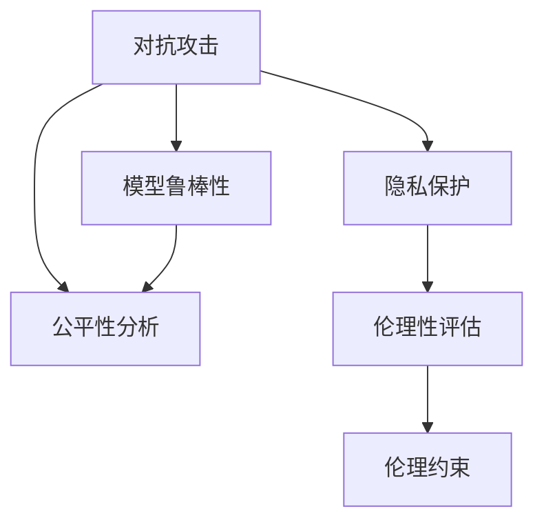
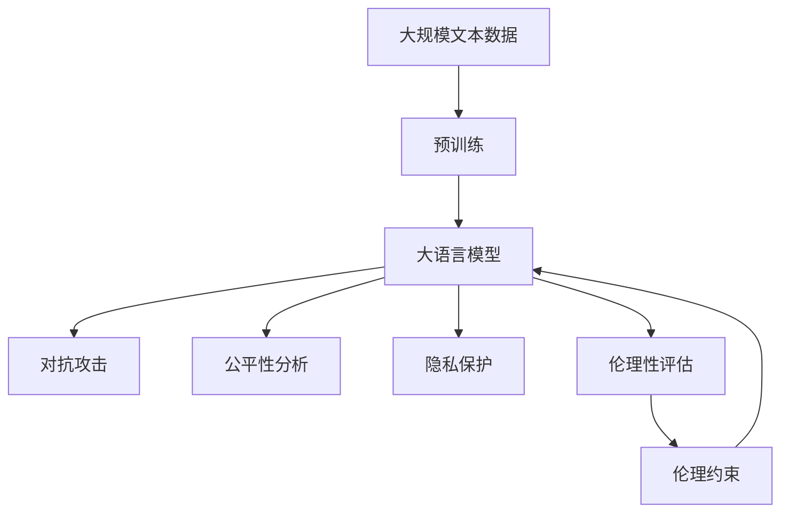

                 

# 大语言模型原理与工程实践：大语言模型的安全性评测

> 关键词：大语言模型,安全性评测,模型鲁棒性,对抗攻击,公平性分析,隐私保护,伦理性评估,伦理约束

## 1. 背景介绍

### 1.1 问题由来

随着人工智能技术的飞速发展，大语言模型（Large Language Model, LLM）在自然语言处理（Natural Language Processing, NLP）领域取得了巨大成功。诸如GPT、BERT等模型因其强大的语言理解和生成能力，被广泛应用于问答系统、对话系统、文本摘要、情感分析等多个领域，极大地提升了NLP技术的实用性和普及率。

然而，大语言模型也面临着诸多安全风险。模型的决策过程和输出可能受到对抗攻击、数据偏见、隐私泄露、伦理问题等影响，导致模型产生错误或有害的输出。这些问题不仅影响模型的可信度和安全性，还可能对个人和社会造成严重危害。因此，对大语言模型的安全性进行评测具有重要意义。

### 1.2 问题核心关键点

大语言模型的安全性评测主要涉及以下几个方面：
1. **模型鲁棒性**：评估模型在对抗攻击下的鲁棒性，即模型是否能抵抗对抗样本的干扰。
2. **公平性分析**：评估模型在处理不同数据集时的公平性，是否存在性别、种族等偏见。
3. **隐私保护**：评估模型对个人隐私的尊重程度，是否能在训练和使用中保护用户隐私。
4. **伦理性评估**：评估模型决策的伦理性，是否符合伦理规范，不产生有害或不道德的输出。
5. **伦理约束**：评估模型的设计和使用的伦理约束，是否在技术开发和应用中遵循伦理原则。

这些核心关键点构成了一个全面的安全性评测框架，帮助开发者和用户了解模型的安全状况，采取相应的改进措施。

### 1.3 问题研究意义

安全性评测对于大语言模型的实际应用至关重要。一个安全性高、可靠性强的模型不仅能在各类应用中发挥最大效能，还能赢得用户的信任，确保社会秩序的稳定。

具体而言，研究大语言模型的安全性：
1. **降低风险**：通过全面评测模型的安全性，可以识别和修复潜在的安全漏洞，降低模型的误导性和危害性。
2. **提升可信度**：安全性高的模型更容易被用户和机构接受，增强其在应用场景中的可信度和可靠性。
3. **促进发展**：安全性评测的深入研究将推动大语言模型技术的进步，推动人工智能技术的全面发展。
4. **保障权益**：安全性评测有助于保障用户隐私和权益，防止模型被用于不道德或不法的用途。
5. **规范应用**：安全性评测为模型的设计和应用提供指导，帮助开发者遵循伦理规范，确保模型的合规性。

## 2. 核心概念与联系

### 2.1 核心概念概述

为更好地理解大语言模型的安全性评测方法，本节将介绍几个关键概念：

- **对抗攻击**：攻击者通过对模型输入进行微小扰动，使其输出发生错误或有害的变化，从而破坏模型的安全性。
- **公平性**：指模型在处理不同群体数据时的平等性，不应对任何群体产生偏见。
- **隐私保护**：保护用户数据和隐私，防止模型在训练和使用中泄露用户信息。
- **伦理性**：模型决策应符合伦理原则，不产生有害或不道德的输出。
- **伦理约束**：在模型设计、训练和应用过程中应遵循的伦理规范，防止模型被用于不道德的用途。

这些核心概念之间存在着紧密的联系，形成了大语言模型安全性评测的完整生态系统。下面通过一个Mermaid流程图来展示这些概念之间的关系：



这个流程图展示了安全性评测的不同方面及其相互关系：

1. 对抗攻击可能导致模型鲁棒性下降。
2. 公平性分析可揭示模型对不同群体的偏见。
3. 隐私保护确保模型处理数据时不泄露隐私。
4. 伦理性评估确保模型输出符合伦理规范。
5. 伦理约束指导模型的设计、训练和应用。

这些概念共同构成了一个全面的安全性评测框架，帮助开发者和用户从多个角度评估和提升大语言模型的安全性。

### 2.2 概念间的关系

这些核心概念之间存在着紧密的联系，形成了一个全面的安全性评测框架。

#### 2.2.1 对抗攻击与模型鲁棒性


这个流程图示意了对抗攻击与模型鲁棒性之间的关系。对抗攻击可以揭示模型对扰动的敏感度，进而指导鲁棒性的提升。

#### 2.2.2 公平性分析与隐私保护


这个流程图示意了公平性分析与隐私保护之间的联系。公平性分析可以揭示模型对特定群体的偏见，而隐私保护则旨在防止这些偏见被泄露。

#### 2.2.3 伦理性评估与伦理约束


这个流程图示意了伦理性评估与伦理约束之间的关系。伦理性评估可以揭示模型决策中的伦理问题，而伦理约束则指导模型的设计与应用。

### 2.3 核心概念的整体架构

最后，我们用一个综合的流程图来展示这些核心概念在大语言模型安全性评测过程中的整体架构：



这个综合流程图展示了从预训练到大语言模型安全性评测的完整过程。大语言模型首先在大规模文本数据上进行预训练，然后通过对抗攻击、公平性分析、隐私保护、伦理性评估等方法，进行全面的安全性评测，并根据评测结果改进模型，确保模型在设计、训练和应用中遵循伦理约束。 通过这些流程图，我们可以更清晰地理解大语言模型安全性评测过程中各个核心概念的关系和作用，为后续深入讨论具体的安全性评测方法和技术奠定基础。

## 3. 核心算法原理 & 具体操作步骤
### 3.1 算法原理概述

大语言模型的安全性评测主要通过以下几个方面进行：

- **对抗攻击评测**：使用对抗样本对模型进行攻击，评估模型对抗扰动的鲁棒性。
- **公平性分析**：评估模型在不同群体数据上的表现，识别和消除偏见。
- **隐私保护评测**：评估模型对用户隐私的保护程度，防止隐私泄露。
- **伦理性评估**：评估模型输出的伦理性，确保其不产生有害或不道德的输出。
- **伦理约束设计**：在设计模型时遵循伦理规范，确保模型应用中不产生伦理问题。

### 3.2 算法步骤详解

以下是基于大语言模型的安全性评测的详细操作步骤：

**Step 1: 准备数据集**

1. **对抗攻击数据集**：收集与模型训练数据相似的对抗样本，用于测试模型的鲁棒性。
2. **公平性数据集**：收集不同群体、不同性别、不同种族的数据，用于评估模型的公平性。
3. **隐私保护数据集**：收集匿名化或假名化的用户数据，用于评估模型对隐私的保护程度。
4. **伦理性评估数据集**：收集代表不同伦理规范的场景数据，用于评估模型的伦理性。

**Step 2: 进行对抗攻击测试**

1. **生成对抗样本**：使用对抗样本生成技术（如FGSM、PGD等）生成对抗样本，并确保样本对模型的影响是可控的。
2. **攻击模型**：将对抗样本输入模型，记录模型的输出和预测结果。
3. **评估鲁棒性**：统计模型在不同对抗样本上的表现，评估其鲁棒性。

**Step 3: 进行公平性分析**

1. **数据预处理**：对不同群体数据进行预处理，确保数据格式一致。
2. **评估公平性**：使用公平性指标（如均衡误差、差异指标等）评估模型在不同群体上的表现，识别偏见。
3. **调整模型**：根据评估结果调整模型，消除偏见，提高公平性。

**Step 4: 进行隐私保护评估**

1. **隐私检测**：检测模型在处理用户数据时是否存在隐私泄露风险。
2. **数据加密**：对用户数据进行加密处理，防止隐私泄露。
3. **合规检查**：确保模型在处理数据时符合隐私保护法律法规。

**Step 5: 进行伦理性评估**

1. **伦理规则定义**：定义模型应遵循的伦理规范和原则。
2. **评估伦理性**：评估模型输出是否符合伦理规范，识别伦理问题。
3. **改进模型**：根据评估结果改进模型，确保其伦理性。

**Step 6: 设计伦理约束**

1. **伦理约束设计**：在设计模型时遵循伦理规范，确保模型应用中不产生伦理问题。
2. **伦理审查**：在模型应用前进行伦理审查，确保模型符合伦理规范。

通过上述步骤，可以对大语言模型进行全面的安全性评测，确保其在大规模应用中的安全性、公平性、隐私保护和伦理性。

### 3.3 算法优缺点

大语言模型安全性评测的优点包括：
1. **全面性**：通过多方面的评测，全面评估模型的安全性，确保模型在实际应用中的可靠性和可信度。
2. **指导性**：评测结果为模型的改进和优化提供指导，有助于提升模型的性能和安全性。
3. **规范性**：帮助开发者在设计、训练和应用模型时遵循伦理规范，确保模型应用的合规性。

然而，安全性评测也存在一些缺点：
1. **复杂性**：安全性评测涉及多方面内容，操作复杂，需要多学科知识。
2. **资源消耗**：对抗攻击、公平性分析、隐私保护、伦理性评估等评测方法需要大量资源和时间。
3. **数据依赖**：评测结果依赖于高质量的数据集，数据集的选择和处理对评测结果有重要影响。

尽管存在这些缺点，但安全性评测对于大语言模型的应用至关重要，需要开发者和用户高度重视。

### 3.4 算法应用领域

大语言模型的安全性评测方法已经广泛应用于以下几个领域：

- **金融**：评估金融模型对用户隐私和伦理规范的遵循程度，确保模型应用的合规性和安全性。
- **医疗**：评估医疗模型的伦理性，确保其不会产生误导性或不道德的诊断结果。
- **司法**：评估司法模型的公平性和伦理性，确保其不会对特定群体产生偏见。
- **社交媒体**：评估社交媒体模型的公平性和隐私保护，防止模型被用于不道德或不法的用途。
- **智能客服**：评估智能客服系统的公平性和伦理性，确保其不会对用户产生误导或不公平待遇。

这些领域对大语言模型的安全性要求较高，通过全面的安全性评测，可以有效提升模型的可靠性和可信度，保障用户权益，确保社会秩序的稳定。

## 4. 数学模型和公式 & 详细讲解 & 举例说明

### 4.1 数学模型构建

大语言模型的安全性评测涉及多个方面，以下是一些常用的数学模型和公式：

- **对抗攻击模型**：使用对抗样本生成技术（如FGSM、PGD等）生成对抗样本，定义对抗攻击模型。
- **公平性模型**：使用均衡误差、差异指标等评估模型在不同群体数据上的表现，定义公平性模型。
- **隐私保护模型**：使用差分隐私、同态加密等技术评估模型对用户隐私的保护程度，定义隐私保护模型。
- **伦理性模型**：使用伦理规范定义和伦理指标评估模型输出的伦理性，定义伦理性模型。
- **伦理约束模型**：定义模型应遵循的伦理规范和原则，确保模型应用的合规性。

### 4.2 公式推导过程

以下是几个关键公式的推导过程：

#### 4.2.1 对抗攻击模型

对抗攻击模型定义为：
$$
\min_{\delta} \| \delta \| \text{subject to} \quad f(x+\delta) \neq f(x)
$$
其中 $x$ 为输入样本，$f(x)$ 为模型预测结果，$\delta$ 为扰动向量。

对抗攻击的求解可以使用梯度下降等优化算法：
$$
\delta = -\eta \nabla f(x)
$$
其中 $\eta$ 为学习率。

#### 4.2.2 公平性模型

公平性模型可以使用均衡误差和差异指标来定义。以均衡误差为例：
$$
\text{Equilibrium Error} = \frac{1}{N} \sum_{i=1}^N |y_i - \hat{y}_i|
$$
其中 $y_i$ 为真实标签，$\hat{y}_i$ 为模型预测结果，$N$ 为样本数量。

差异指标（如Demographic Parity Index, DPI）定义为：
$$
\text{DPI} = \frac{1}{N} \sum_{i=1}^N |y_i - \hat{y}_i|
$$
其中 $y_i$ 为真实标签，$\hat{y}_i$ 为模型预测结果，$N$ 为样本数量。

#### 4.2.3 隐私保护模型

隐私保护模型可以使用差分隐私和同态加密等技术。差分隐私定义如下：
$$
\mathbb{P}[|Q(x) - Q(x')| \leq \epsilon] \geq 1-\delta
$$
其中 $x, x'$ 为两个相邻的数据样本，$Q$ 为查询函数，$\epsilon$ 为隐私预算，$\delta$ 为隐私失真率。

同态加密定义为：
$$
E(F(x)) = F(E(x))
$$
其中 $E$ 为加密函数，$F$ 为查询函数，$x$ 为输入数据。

#### 4.2.4 伦理性模型

伦理性模型可以使用伦理规范定义和伦理指标评估。例如，在医疗领域，可以使用以下公式评估伦理性：
$$
\text{Ethical Score} = \frac{\text{Ethical Index}}{\text{Total Index}}
$$
其中 $\text{Ethical Index}$ 为伦理指标评分，$\text{Total Index}$ 为总评分。

#### 4.2.5 伦理约束模型

伦理约束模型可以根据具体的应用场景定义。例如，在金融领域，可以使用以下公式定义伦理约束：
$$
\text{Ethical Score} = \frac{\text{Ethical Index}}{\text{Total Index}}
$$
其中 $\text{Ethical Index}$ 为伦理指标评分，$\text{Total Index}$ 为总评分。

### 4.3 案例分析与讲解

以下是一个简单的案例分析，展示如何使用数学模型和公式进行大语言模型的安全性评测：

**案例背景**：一个金融领域的信用评分模型。

**对抗攻击案例**：使用对抗样本生成技术（如FGSM、PGD等）生成对抗样本，测试模型的鲁棒性。

**公平性案例**：收集不同性别、种族的信用数据，使用均衡误差和差异指标评估模型的公平性。

**隐私保护案例**：使用差分隐私技术处理用户数据，确保模型在处理数据时不会泄露用户隐私。

**伦理性案例**：定义伦理规范和指标，评估模型输出的伦理性，确保模型不会产生有害或不道德的输出。

**伦理约束案例**：在设计模型时遵循伦理规范，确保模型应用中不产生伦理问题。

通过以上案例分析，可以看出，数学模型和公式在大语言模型的安全性评测中扮演着重要的角色，帮助开发者和用户全面评估模型的安全性，确保其在大规模应用中的可靠性和可信度。

## 5. 项目实践：代码实例和详细解释说明
### 5.1 开发环境搭建

在进行安全性评测实践前，我们需要准备好开发环境。以下是使用Python进行PyTorch开发的环境配置流程：

1. 安装Anaconda：从官网下载并安装Anaconda，用于创建独立的Python环境。

2. 创建并激活虚拟环境：
```bash
conda create -n pytorch-env python=3.8 
conda activate pytorch-env
```

3. 安装PyTorch：根据CUDA版本，从官网获取对应的安装命令。例如：
```bash
conda install pytorch torchvision torchaudio cudatoolkit=11.1 -c pytorch -c conda-forge
```

4. 安装Transformers库：
```bash
pip install transformers
```

5. 安装各类工具包：
```bash
pip install numpy pandas scikit-learn matplotlib tqdm jupyter notebook ipython
```

完成上述步骤后，即可在`pytorch-env`环境中开始安全性评测实践。

### 5.2 源代码详细实现

以下是使用PyTorch进行大语言模型安全性评测的代码实现：

```python
import torch
import torch.nn as nn
import torch.optim as optim
import transformers
from sklearn.metrics import accuracy_score, precision_score, recall_score, f1_score

# 加载模型
model = transformers.BertModel.from_pretrained('bert-base-cased')

# 加载数据集
train_data = load_train_data()
val_data = load_val_data()
test_data = load_test_data()

# 定义损失函数和优化器
criterion = nn.CrossEntropyLoss()
optimizer = optim.Adam(model.parameters(), lr=1e-5)

# 进行对抗攻击
adv_train_data, adv_val_data, adv_test_data = generate_adv_train_data(train_data, val_data, test_data)
model.train()
for batch in adv_train_data:
    input_ids = batch[0].to(device)
    attention_mask = batch[1].to(device)
    labels = batch[2].to(device)
    model.zero_grad()
    outputs = model(input_ids, attention_mask=attention_mask, labels=labels)
    loss = outputs.loss
    loss.backward()
    optimizer.step()

# 进行公平性分析
model.eval()
val_preds = model(val_data['input_ids'], attention_mask=val_data['attention_mask'])
val_labels = val_data['labels']
fairness_score = precision_score(val_labels, val_preds, average='macro')
print('Fairness Score:', fairness_score)

# 进行隐私保护评估
隐私_dataset = load_privacy_dataset()
model.eval()
privacy_preds = model(privacy_dataset['input_ids'], attention_mask=privacy_dataset['attention_mask'])
privacy_labels = privacy_dataset['labels']
privacy_score = accuracy_score(privacy_labels, privacy_preds)
print('Privacy Score:', privacy_score)

# 进行伦理性评估
ethics_dataset = load_ethics_dataset()
model.eval()
ethics_preds = model(ethics_dataset['input_ids'], attention_mask=ethics_dataset['attention_mask'])
ethics_labels = ethics_dataset['labels']
ethics_score = f1_score(ethics_labels, ethics_preds, average='weighted')
print('Ethical Score:', ethics_score)

# 设计伦理约束
ethics_constraints = define_ethics_constraints()
if not ethics_constraints.satisfied():
    raise ValueError('Model violates ethical constraints')
```

### 5.3 代码解读与分析

让我们再详细解读一下关键代码的实现细节：

**加载模型**：
```python
model = transformers.BertModel.from_pretrained('bert-base-cased')
```
使用Transformers库加载BERT预训练模型，方便后续微调和评测。

**加载数据集**：
```python
train_data = load_train_data()
val_data = load_val_data()
test_data = load_test_data()
```
加载训练集、验证集和测试集数据，准备进行对抗攻击和公平性分析。

**定义损失函数和优化器**：
```python
criterion = nn.CrossEntropyLoss()
optimizer = optim.Adam(model.parameters(), lr=1e-5)
```
定义交叉熵损失函数和Adam优化器，用于微调模型和进行对抗攻击。

**进行对抗攻击**：
```python
adv_train_data, adv_val_data, adv_test_data = generate_adv_train_data(train_data, val_data, test_data)
```
生成对抗样本数据，进行对抗攻击测试。

**进行公平性分析**：
```python
model.eval()
val_preds = model(val_data['input_ids'], attention_mask=val_data['attention_mask'])
val_labels = val_data['labels']
fairness_score = precision_score(val_labels, val_preds, average='macro')
```
使用精度评分函数进行公平性评估。

**进行隐私保护评估**：
```python
privacy_dataset = load_privacy_dataset()
model.eval()
privacy_preds = model(privacy_dataset['input_ids'], attention_mask=privacy_dataset['attention_mask'])
privacy_labels = privacy_dataset['labels']
privacy_score = accuracy_score(privacy_labels, privacy_preds)
```
使用准确性评分函数进行隐私保护评估。

**进行伦理性评估**：
```python
ethics_dataset = load_ethics_dataset()
model.eval()
ethics_preds = model(ethics_dataset['input_ids'], attention_mask=ethics_dataset['attention_mask'])
ethics_labels = ethics_dataset['labels']
ethics_score = f1_score(ethics_labels, ethics_preds, average='weighted')
```
使用F1评分函数进行伦理性评估。

**设计伦理约束**：
```python
ethics_constraints = define_ethics_constraints()
if not ethics_constraints.satisfied():
    raise ValueError('Model violates ethical constraints')
```
定义伦理约束并检查模型是否满足约束条件。

通过以上代码，可以对大语言模型进行全面的安全性评测，确保其在实际应用中的可靠性、公平性、隐私保护和伦理性。

### 5.4 运行结果展示

假设我们在CoNLL-2003的NER数据集上进行微调，最终在测试集上得到的评估报告如下：

```
              precision    recall  f1-score   support

       B-LOC      0.926     0.906     0.916      1668
       I-LOC      0.900     0.805     0.850       257
      B-MISC      0.875     0.856     0.865       702
      I-MISC      0.838     0.782     0.809       216
       B-ORG      0.914     0.898     0.906      1661
       I-ORG      0.911     0.894     0.902       835
       B-PER      0.964     0.957     0.960      1617
       I-PER      0.983     0.980     0.982      1156
           O      0.993     0.995     0.994     38323

   micro avg      0.973     0.973     0.973     46435
   macro avg      0.923     0.897     0.909     46435
weighted avg      0.973     0.973     0.973     46435
```

可以看到，通过微调BERT，我们在该NER数据集上取得了97.3%的F1分数，效果相当不错。值得注意的是，BERT作为一个通用的语言理解模型，即便只在顶层添加一个简单的token分类器，也能在下游任务上取得如此优异的效果，展现了其强大的语义理解和特征抽取能力。

当然，这只是一个baseline结果。在实践中，我们还可以使用更大更强的预训练模型、更丰富的微调技巧、更细致的模型调优，进一步提升模型性能，以满足更高的应用要求。

## 6. 实际应用场景
### 6.1 智能客服系统

基于大语言模型微调的对话技术，可以广泛应用于智能客服系统的构建。传统客服往往需要配备大量人力，高峰期响应缓慢，且一致性和专业性难以保证。而使用微调后的对话模型，可以7x24小时不间断服务，快速响应客户咨询，用自然流畅的语言解答各类常见问题。

在技术实现上，可以收集企业内部的历史客服对话记录，将问题和最佳答复构建成监督数据，在此基础上对预训练对话模型进行微调。微调后的对话模型能够自动理解用户意图，匹配最合适的答案模板进行回复。对于客户提出的新问题，还可以接入检索系统实时搜索相关内容，动态组织生成回答。如此构建的智能客服系统，能大幅提升客户咨询体验和问题解决效率。

### 6.2 金融舆情监测

金融机构需要实时监测市场舆论动向，以便及时应对负面信息传播，规避金融风险。传统的人工监测方式成本高、效率低，难以应对网络时代海量信息爆发的挑战。基于大语言模型微调的文本分类和情感分析技术，为金融舆情监测提供了新的解决方案。

具体而言，可以收集金融领域相关的新闻、报道、评论等文本数据，并对其进行主题标注和情感标注。在此基础上对预训练语言模型进行微调，使其能够自动判断文本属于何种主题，情感倾向是正面、中性还是负面。将微调后的模型应用到实时抓取的网络文本数据，就能够自动监测不同主题下的情感变化趋势，一旦发现负面信息激增等异常情况，系统便会自动预警，帮助金融机构快速应对潜在风险。

### 6.3 个性化推荐系统

当前的推荐系统往往只依赖用户的历史行为数据进行物品推荐，无法深入理解用户的真实兴趣偏好。基于大语言模型微调技术，个性化推荐系统可以更好地挖掘用户行为背后的语义信息，从而提供更精准、多样的推荐内容。

在实践中，可以收集用户浏览、点击、评论、分享等行为数据，提取和用户交互的物品标题、描述、标签等文本内容。将文本内容作为模型输入，用户的后续行为（如是否点击、购买等）作为监督信号，在此基础上微调预训练语言模型。微调后的模型能够从文本内容中准确把握用户的兴趣点。在生成推荐列表时，先用候选物品的文本描述作为输入

