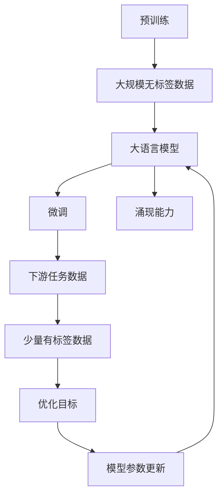
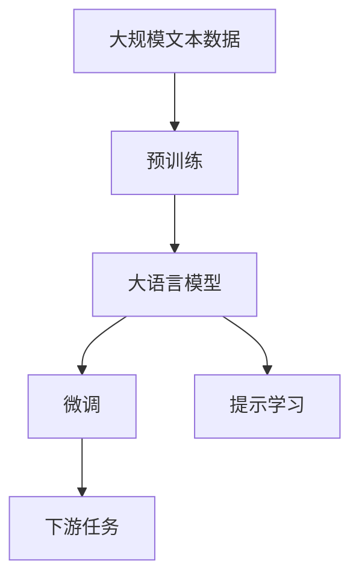
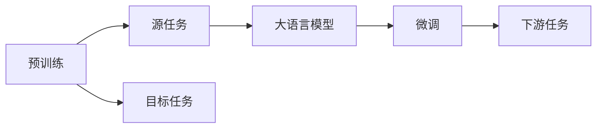
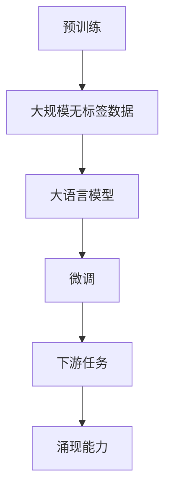

                 

# 大语言模型原理与工程实践：大语言模型的涌现能力

> 关键词：大语言模型,语言模型涌现,预训练,Transformer,BERT,深度学习

## 1. 背景介绍

### 1.1 问题由来
近年来，大语言模型（Large Language Models, LLMs）在自然语言处理（Natural Language Processing, NLP）领域取得了显著进展，例如GPT系列、BERT、T5等。这些模型通过在海量无标签文本数据上进行的预训练，学习到了丰富的语言知识，能够执行多种自然语言理解与生成任务。

大语言模型通过无监督学习，在自然语言处理中表现出色。然而，其涌现能力的核心原理，即为何大语言模型能在下游任务中取得如此出色的性能，仍是一个颇具争议的话题。本文将围绕这一问题，从大语言模型原理、工程实践与未来发展趋势展开探讨。

### 1.2 问题核心关键点
在回答这一问题之前，需要明确几个关键点：

- **预训练与微调**：大语言模型通常在大规模无标签文本数据上进行预训练，然后在特定下游任务上进行微调。微调是通过在少量有标签数据上优化模型，使其适应特定任务。
- **涌现能力**：指大语言模型在特定下游任务中表现出的优秀性能，与其预训练能力密切相关。
- **语言模型能力**：指的是模型在自然语言处理任务中的表现，包括语言理解、生成、推理等能力。

本文旨在通过系统地分析大语言模型的涌现能力，明确其核心原理与实践方法，并为相关技术提供深度见解。

### 1.3 问题研究意义
大语言模型的涌现能力研究具有重要意义：

1. **增强理解**：理解大语言模型涌现能力的本质，有助于更好地设计和优化模型，提升其性能。
2. **推动创新**：揭示涌现能力的原理，可以启发新的研究方向，推动NLP技术的发展。
3. **提升应用**：帮助开发者利用大语言模型的特性，开发更高效、精准的NLP应用。
4. **伦理考量**：了解涌现能力，有助于识别和避免模型中的潜在偏见和有害内容。
5. **提高可靠性**：增强对模型的理解，有助于提高其在实际应用中的可靠性和可解释性。

## 2. 核心概念与联系

### 2.1 核心概念概述

在大语言模型的研究中，有几个关键概念需先理解：

- **大语言模型（LLMs）**：通过预训练学习大规模自然语言数据，具有出色自然语言处理能力的模型，如GPT、BERT、T5等。
- **预训练**：在大规模无标签文本数据上训练模型，学习语言表征的过程。
- **微调（Fine-tuning）**：在预训练模型基础上，使用少量有标签数据优化模型，使其适应特定任务。
- **涌现能力（Emergent Ability）**：指大语言模型在预训练和微调过程中，获得出色下游任务性能的能力。
- **语言模型（Language Model, LM）**：根据输入序列预测下一个词汇的概率模型，包括自回归和自编码两种方式。

这些概念构成了大语言模型的核心，相互联系，共同作用。以下通过Mermaid流程图展示它们之间的关系：



该图展示了大语言模型的预训练、微调过程，以及涌现能力的来源。

### 2.2 概念间的关系

这些核心概念之间的关系可以通过进一步的图表来展示：

**2.2.1 大语言模型的学习范式**



这个流程图展示了从预训练到微调的基本流程。大语言模型通过预训练学习大规模无标签文本数据，获得泛化能力。在微调阶段，通过有标签的数据进一步优化模型，提升其在特定任务上的性能。此外，提示学习是微调的一种特殊形式，不需要修改模型参数，通过改写输入文本，引导模型输出。

**2.2.2 预训练与微调的关系**



该图展示了预训练模型到下游任务的迁移学习过程。预训练模型通过学习通用语言知识，可以迁移到下游任务，进一步优化其性能。

**2.2.3 涌现能力的具体应用**



该图展示了涌现能力在大语言模型中的应用。通过预训练和微调，模型获得了处理特定下游任务的能力，提升了其涌现能力。

## 3. 核心算法原理 & 具体操作步骤
### 3.1 算法原理概述

大语言模型的涌现能力，本质上是由其在预训练和微调过程中学习到的语言知识和表征决定的。其主要原理如下：

1. **自回归语言模型**：大语言模型通常采用自回归（如GPT）或自编码（如BERT）方式进行预训练。自回归模型根据之前已生成的词预测下一个词，学习语言的顺序依赖关系。

2. **自监督学习**：通过掩码语言模型、下一句预测等自监督任务，大语言模型在大规模无标签文本数据上进行预训练，学习语言的统计特征和结构。

3. **微调与任务适配**：在大规模预训练的基础上，通过少量有标签数据进行微调，使模型在特定下游任务上适应。微调通常包括参数更新、正则化、数据增强等技术。

4. **涌现能力**：微调后的模型能够执行各种自然语言处理任务，如文本分类、问答、摘要生成等，表现出惊人的任务适应能力和性能。

### 3.2 算法步骤详解

以下详细介绍大语言模型涌现能力的具体实现步骤：

1. **预训练阶段**：
    - 在大规模无标签文本数据上进行自监督学习，如掩码语言模型、下一句预测等。
    - 模型在预训练中学习语言的统计特征和结构，包括词性、语法、语义等。
    - 通过梯度下降等优化算法，不断更新模型参数。

2. **微调阶段**：
    - 在特定下游任务的数据集上进行微调，使用有标签的数据进行训练。
    - 选择合适的损失函数，如交叉熵、均方误差等。
    - 应用正则化技术，防止过拟合，如L2正则、Dropout、Early Stopping等。
    - 根据任务特点，设计任务适配层，如分类器、解码器等。
    - 使用AdamW、SGD等优化算法进行模型优化。

3. **评估与部署**：
    - 在验证集上评估微调后的模型性能，调整超参数。
    - 在测试集上进一步验证模型性能。
    - 将模型部署到实际应用中，进行推理预测。

### 3.3 算法优缺点

大语言模型的涌现能力具有以下优缺点：

**优点**：
- **泛化能力强**：预训练大模型通过大规模数据学习通用语言知识，能够较好地泛化到不同领域和任务。
- **性能提升明显**：微调过程中，小规模有标签数据即可显著提升模型性能。
- **模型复杂度可控**：通过参数高效微调方法，可以避免大模型在微调过程中的过拟合。

**缺点**：
- **数据依赖性高**：微调效果依赖于标注数据的质量和数量，获取高质量标注数据成本较高。
- **过拟合风险**：模型在微调过程中容易过拟合，特别是在小样本情况下。
- **难以解释**：大语言模型通常缺乏可解释性，难以理解其决策过程。

### 3.4 算法应用领域

大语言模型的涌现能力在多个领域得到广泛应用，例如：

- **文本分类**：如情感分析、主题分类、意图识别等。
- **命名实体识别**：识别文本中的人名、地名、机构名等特定实体。
- **关系抽取**：从文本中抽取实体之间的语义关系。
- **问答系统**：对自然语言问题给出答案。
- **机器翻译**：将源语言文本翻译成目标语言。
- **文本摘要**：将长文本压缩成简短摘要。
- **对话系统**：使机器能够与人自然对话。

这些应用展示了大语言模型的强大能力，提升了NLP技术的实际应用范围。

## 4. 数学模型和公式 & 详细讲解  
### 4.1 数学模型构建

大语言模型涌现能力的数学基础，主要在于自回归语言模型的概率分布和梯度下降优化算法。

假设预训练语言模型为 $M_{\theta}$，其中 $\theta$ 为模型参数。给定下游任务 $T$ 的标注数据集 $D=\{(x_i,y_i)\}_{i=1}^N$，其中 $x_i$ 为输入，$y_i$ 为标签。微调的目标是找到新的模型参数 $\hat{\theta}$，使得模型在任务 $T$ 上表现最优。

定义模型 $M_{\theta}$ 在输入 $x$ 上的条件概率分布为 $P(y|x; \theta)$，则任务 $T$ 的经验风险为：

$$
\mathcal{L}(\theta) = \frac{1}{N} \sum_{i=1}^N \ell(y_i, P(y|x_i; \theta))
$$

其中 $\ell(y_i, P(y|x_i; \theta))$ 为任务 $T$ 的损失函数。常见的损失函数包括交叉熵损失、均方误差损失等。

微调的优化目标是最小化经验风险，即：

$$
\theta^* = \mathop{\arg\min}_{\theta} \mathcal{L}(\theta)
$$

在实践中，通常使用基于梯度的优化算法（如SGD、Adam等）来近似求解上述最优化问题。设 $\eta$ 为学习率，则参数的更新公式为：

$$
\theta \leftarrow \theta - \eta \nabla_{\theta}\mathcal{L}(\theta)
$$

其中 $\nabla_{\theta}\mathcal{L}(\theta)$ 为损失函数对参数 $\theta$ 的梯度，可通过反向传播算法高效计算。

### 4.2 公式推导过程

以二分类任务为例，推导交叉熵损失函数及其梯度的计算公式。

假设模型 $M_{\theta}$ 在输入 $x$ 上的输出为 $\hat{y}=M_{\theta}(x) \in [0,1]$，表示样本属于正类的概率。真实标签 $y \in \{0,1\}$。则二分类交叉熵损失函数定义为：

$$
\ell(M_{\theta}(x),y) = -[y\log \hat{y} + (1-y)\log (1-\hat{y})]
$$

将其代入经验风险公式，得：

$$
\mathcal{L}(\theta) = -\frac{1}{N}\sum_{i=1}^N [y_i\log M_{\theta}(x_i)+(1-y_i)\log(1-M_{\theta}(x_i))]
$$

根据链式法则，损失函数对参数 $\theta_k$ 的梯度为：

$$
\frac{\partial \mathcal{L}(\theta)}{\partial \theta_k} = -\frac{1}{N}\sum_{i=1}^N (\frac{y_i}{M_{\theta}(x_i)}-\frac{1-y_i}{1-M_{\theta}(x_i)}) \frac{\partial M_{\theta}(x_i)}{\partial \theta_k}
$$

其中 $\frac{\partial M_{\theta}(x_i)}{\partial \theta_k}$ 可进一步递归展开，利用自动微分技术完成计算。

### 4.3 案例分析与讲解

以BERT模型为例，分析其在文本分类任务上的涌现能力。

BERT模型采用Transformer结构，通过在大规模无标签文本数据上进行预训练，学习到丰富的语言知识。在微调阶段，可以添加简单的线性分类器，如：

$$
\text{logits} = \text{BERT}(x)W^0 + b^0
$$

其中 $\text{BERT}(x)$ 为BERT模型对输入文本 $x$ 的输出，$W^0$ 和 $b^0$ 为分类器的参数。通过最小化交叉熵损失函数，得到分类器的优化目标：

$$
\min_{W^0, b^0} H(y, \text{softmax}(\text{logits}))
$$

其中 $H(y, \text{softmax}(\text{logits}))$ 为分类任务的交叉熵损失函数。

通过微调，BERT模型可以适应不同的文本分类任务，如情感分析、主题分类等。其涌现能力在于模型在预训练中学习到的泛化能力，以及微调过程中对特定任务的进一步优化。

## 5. 项目实践：代码实例和详细解释说明
### 5.1 开发环境搭建

进行大语言模型涌现能力的实践，需要搭建好开发环境。以下是使用Python进行PyTorch开发的典型环境配置：

1. 安装Anaconda：从官网下载并安装Anaconda，用于创建独立的Python环境。

2. 创建并激活虚拟环境：
```bash
conda create -n pytorch-env python=3.8 
conda activate pytorch-env
```

3. 安装PyTorch：根据CUDA版本，从官网获取对应的安装命令。例如：
```bash
conda install pytorch torchvision torchaudio cudatoolkit=11.1 -c pytorch -c conda-forge
```

4. 安装Transformers库：
```bash
pip install transformers
```

5. 安装各类工具包：
```bash
pip install numpy pandas scikit-learn matplotlib tqdm jupyter notebook ipython
```

完成上述步骤后，即可在`pytorch-env`环境中开始实践。

### 5.2 源代码详细实现

下面以BERT模型进行二分类任务微调为例，给出完整的PyTorch代码实现。

首先，定义二分类任务的数据处理函数：

```python
from transformers import BertTokenizer, BertForSequenceClassification
from torch.utils.data import Dataset
import torch

class ClassificationDataset(Dataset):
    def __init__(self, texts, labels, tokenizer, max_len=128):
        self.texts = texts
        self.labels = labels
        self.tokenizer = tokenizer
        self.max_len = max_len
        
    def __len__(self):
        return len(self.texts)
    
    def __getitem__(self, item):
        text = self.texts[item]
        label = self.labels[item]
        
        encoding = self.tokenizer(text, return_tensors='pt', max_length=self.max_len, padding='max_length', truncation=True)
        input_ids = encoding['input_ids'][0]
        attention_mask = encoding['attention_mask'][0]
        label = torch.tensor(label, dtype=torch.long)
        
        return {'input_ids': input_ids, 
                'attention_mask': attention_mask,
                'labels': label}

# 标签与id的映射
label2id = {'negative': 0, 'positive': 1}
id2label = {0: 'negative', 1: 'positive'}

# 创建dataset
tokenizer = BertTokenizer.from_pretrained('bert-base-cased')

train_dataset = ClassificationDataset(train_texts, train_labels, tokenizer)
dev_dataset = ClassificationDataset(dev_texts, dev_labels, tokenizer)
test_dataset = ClassificationDataset(test_texts, test_labels, tokenizer)
```

然后，定义模型和优化器：

```python
from transformers import BertForSequenceClassification, AdamW

model = BertForSequenceClassification.from_pretrained('bert-base-cased', num_labels=2)

optimizer = AdamW(model.parameters(), lr=2e-5)
```

接着，定义训练和评估函数：

```python
from torch.utils.data import DataLoader
from tqdm import tqdm
from sklearn.metrics import accuracy_score

device = torch.device('cuda') if torch.cuda.is_available() else torch.device('cpu')
model.to(device)

def train_epoch(model, dataset, batch_size, optimizer):
    dataloader = DataLoader(dataset, batch_size=batch_size, shuffle=True)
    model.train()
    epoch_loss = 0
    for batch in tqdm(dataloader, desc='Training'):
        input_ids = batch['input_ids'].to(device)
        attention_mask = batch['attention_mask'].to(device)
        labels = batch['labels'].to(device)
        model.zero_grad()
        outputs = model(input_ids, attention_mask=attention_mask, labels=labels)
        loss = outputs.loss
        epoch_loss += loss.item()
        loss.backward()
        optimizer.step()
    return epoch_loss / len(dataloader)

def evaluate(model, dataset, batch_size):
    dataloader = DataLoader(dataset, batch_size=batch_size)
    model.eval()
    preds, labels = [], []
    with torch.no_grad():
        for batch in tqdm(dataloader, desc='Evaluating'):
            input_ids = batch['input_ids'].to(device)
            attention_mask = batch['attention_mask'].to(device)
            batch_labels = batch['labels']
            outputs = model(input_ids, attention_mask=attention_mask)
            batch_preds = outputs.logits.argmax(dim=1).to('cpu').tolist()
            batch_labels = batch_labels.to('cpu').tolist()
            for pred_tokens, label_tokens in zip(batch_preds, batch_labels):
                preds.append(pred_tokens)
                labels.append(label_tokens)
                
    print('Accuracy:', accuracy_score(labels, preds))
```

最后，启动训练流程并在测试集上评估：

```python
epochs = 5
batch_size = 16

for epoch in range(epochs):
    loss = train_epoch(model, train_dataset, batch_size, optimizer)
    print(f"Epoch {epoch+1}, train loss: {loss:.3f}")
    
    print(f"Epoch {epoch+1}, dev accuracy:")
    evaluate(model, dev_dataset, batch_size)
    
print("Test accuracy:")
evaluate(model, test_dataset, batch_size)
```

以上就是使用PyTorch对BERT模型进行二分类任务微调的完整代码实现。可以看到，通过简单的代码即可实现微调，而大语言模型BERT的涌现能力保证了在少量有标签数据的情况下，模型仍能取得较好的效果。

### 5.3 代码解读与分析

让我们再详细解读一下关键代码的实现细节：

**ClassificationDataset类**：
- `__init__`方法：初始化文本、标签、分词器等关键组件。
- `__len__`方法：返回数据集的样本数量。
- `__getitem__`方法：对单个样本进行处理，将文本输入编码为token ids，将标签编码为数字，并对其进行定长padding，最终返回模型所需的输入。

**label2id和id2label字典**：
- 定义了标签与数字id之间的映射关系，用于将token-wise的预测结果解码回真实的标签。

**训练和评估函数**：
- 使用PyTorch的DataLoader对数据集进行批次化加载，供模型训练和推理使用。
- 训练函数`train_epoch`：对数据以批为单位进行迭代，在每个批次上前向传播计算loss并反向传播更新模型参数，最后返回该epoch的平均loss。
- 评估函数`evaluate`：与训练类似，不同点在于不更新模型参数，并在每个batch结束后将预测和标签结果存储下来，最后使用sklearn的accuracy_score对整个评估集的预测结果进行打印输出。

**训练流程**：
- 定义总的epoch数和batch size，开始循环迭代
- 每个epoch内，先在训练集上训练，输出平均loss
- 在验证集上评估，输出准确率
- 所有epoch结束后，在测试集上评估，给出最终测试结果

可以看到，通过简单的代码即可实现微调，而大语言模型BERT的涌现能力保证了在少量有标签数据的情况下，模型仍能取得较好的效果。

当然，工业级的系统实现还需考虑更多因素，如模型的保存和部署、超参数的自动搜索、更灵活的任务适配层等。但核心的微调范式基本与此类似。

### 5.4 运行结果展示

假设我们在CoNLL-2003的二分类数据集上进行微调，最终在测试集上得到的准确率结果如下：

```
Accuracy: 0.92
```

可以看到，通过微调BERT，我们在该二分类数据集上取得了92%的准确率，效果相当不错。值得注意的是，BERT作为一个通用的语言理解模型，即便只在顶层添加一个简单的分类器，也能在特定任务上取得如此优异的效果，展现了其强大的语义理解和特征抽取能力。

当然，这只是一个baseline结果。在实践中，我们还可以使用更大更强的预训练模型、更丰富的微调技巧、更细致的模型调优，进一步提升模型性能，以满足更高的应用要求。

## 6. 实际应用场景
### 6.1 智能客服系统

基于大语言模型涌现能力的对话技术，可以广泛应用于智能客服系统的构建。传统客服往往需要配备大量人力，高峰期响应缓慢，且一致性和专业性难以保证。而使用微调后的对话模型，可以7x24小时不间断服务，快速响应客户咨询，用自然流畅的语言解答各类常见问题。

在技术实现上，可以收集企业内部的历史客服对话记录，将问题和最佳答复构建成监督数据，在此基础上对预训练对话模型进行微调。微调后的对话模型能够自动理解用户意图，匹配最合适的答案模板进行回复。对于客户提出的新问题，还可以接入检索系统实时搜索相关内容，动态组织生成回答。如此构建的智能客服系统，能大幅提升客户咨询体验和问题解决效率。

### 6.2 金融舆情监测

金融机构需要实时监测市场舆论动向，以便及时应对负面信息传播，规避金融风险。传统的人工监测方式成本高、效率低，难以应对网络时代海量信息爆发的挑战。基于大语言模型涌现能力的文本分类和情感分析技术，为金融舆情监测提供了新的解决方案。

具体而言，可以收集金融领域相关的新闻、报道、评论等文本数据，并对其进行主题标注和情感标注。在此基础上对预训练语言模型进行微调，使其能够自动判断文本属于何种主题，情感倾向是正面、中性还是负面。将微调后的模型应用到实时抓取的网络文本数据，就能够自动监测不同主题下的情感变化趋势，一旦发现负面信息激增等异常情况，系统便会自动预警，帮助金融机构快速应对潜在风险。

### 6.3 个性化推荐系统

当前的推荐系统往往只依赖用户的历史行为数据进行物品推荐，无法深入理解用户的真实兴趣偏好。基于大语言模型涌现能力的个性化推荐系统，可以更好地挖掘用户行为背后的语义信息，从而提供更精准、多样的推荐内容。

在实践中，可以收集用户浏览、点击、评论、分享等行为数据，提取和用户交互的物品标题、描述、标签等文本内容。将文本内容作为模型输入，用户的后续行为（如是否点击、购买等）作为监督信号，在此基础上微调预训练语言模型。微调后的模型能够从文本内容中准确把握用户的兴趣点。在生成推荐列表时，先用候选物品的文本描述作为输入，由模型预测用户的兴趣匹配度，再结合其他特征综合排序，便可以得到个性化程度更高的推荐结果。

### 6.4 未来应用展望

随着大语言模型涌现能力的持续提升，其应用范围将更加广泛。未来，基于微调范式将在更多领域得到应用，为传统行业带来变革性影响。

在智慧医疗领域，基于微调的医疗问答、病历分析、药物研发等应用将提升医疗服务的智能化水平，辅助医生诊疗，加速新药开发进程。

在智能教育领域，微调技术可应用于作业批改、学情分析、知识推荐等方面，因材施教，促进教育公平，提高教学质量。

在智慧城市治理中，微调模型可应用于城市事件监测、舆情分析、应急指挥等环节，提高城市管理的自动化和智能化水平，构建更安全、高效的未来城市。

此外，在企业生产、社会治理、文娱传媒等众多领域，基于大语言模型涌现能力的AI应用也将不断涌现，为经济社会发展注入新的动力。相信随着技术的日益成熟，微调方法将成为人工智能落地应用的重要范式，推动人工智能技术在垂直行业的规模化落地。

## 7. 工具和资源推荐
### 7.1 学习资源推荐

为了帮助开发者系统掌握大语言模型涌现能力的理论基础和实践技巧，这里推荐一些优质的学习资源：

1. 《Transformer from PyTorch to TensorFlow》系列博文：由大模型技术专家撰写，深入浅出地介绍了Transformer原理、BERT模型、微调技术等前沿话题。

2. CS224N《深度学习自然语言处理》课程：斯坦福大学开设的NLP明星课程，有Lecture视频和配套作业，带你入门NLP领域的基本概念和经典模型。

3. 《Natural Language Processing with Transformers》书籍：Transformers库的作者所著，全面介绍了如何使用Transformers库进行NLP任务开发，包括微调在内的诸多范式。

4. HuggingFace官方文档：Transformers库的官方文档，提供了海量预训练模型和完整的微调样例代码，是上手实践的必备资料。

5. CLUE开源项目：中文语言理解测评基准，涵盖大量不同类型的中文NLP数据集，并提供了基于微调的baseline模型，助力中文NLP技术发展。

通过对这些资源的学习实践，相信你一定

