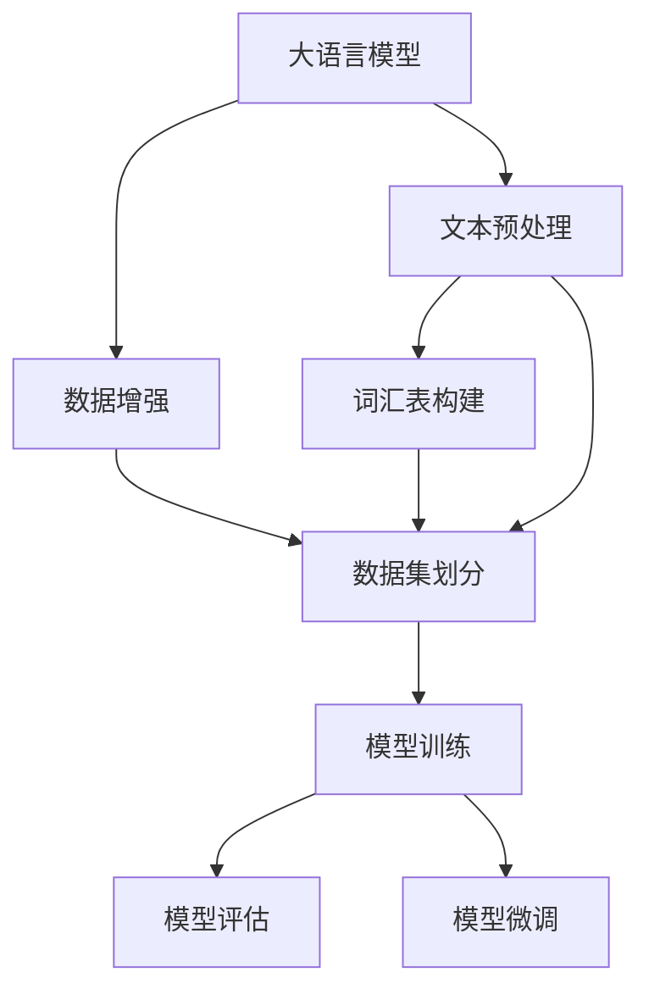

                 

# 大语言模型原理与工程实践：常用数据集的完整构建方式

> 关键词：大语言模型,数据集构建,数据增强,文本预处理,词汇表构建,数据集划分,工具与资源

## 1. 背景介绍

### 1.1 问题由来
在大语言模型（Large Language Models, LLMs）的训练和微调过程中，数据集构建是一个重要环节。构建高质量的数据集，不仅能提升模型的训练效果，还能更好地反映真实应用场景，实现高性能的模型泛化。本文将详细探讨大语言模型常用数据集的构建方法，包括数据预处理、词汇表构建、数据集划分、数据增强等内容。

### 1.2 问题核心关键点
构建数据集的核心在于：
1. 确保数据集的多样性和代表性，涵盖目标任务的各种情景。
2. 处理文本数据中的噪声和不一致性，保证数据质量。
3. 构建高效的词汇表，提高模型的编码和解码效率。
4. 合理划分训练集、验证集和测试集，确保模型评估的可靠性。
5. 采用数据增强技术，提升模型的泛化能力。

### 1.3 问题研究意义
高质量的数据集是实现大语言模型高性能训练和微调的前提。通过科学构建数据集，可以：
1. 降低模型过拟合风险，提高泛化性能。
2. 增强模型的对抗性，提升其在不同场景下的表现。
3. 提升模型的可解释性，帮助开发者更好地理解模型行为。
4. 加速模型训练和微调，提高研发效率。

## 2. 核心概念与联系

### 2.1 核心概念概述

在构建大语言模型数据集时，涉及到多个关键概念，这些概念相互联系，共同构成了数据集构建的完整生态系统。

- **大语言模型**：以Transformer模型为代表的大规模预训练语言模型。通过在大规模无标签文本数据上进行预训练，学习通用的语言表示。

- **数据增强**：通过引入噪声、回译、随机扰动等技术，扩充训练集的多样性，提升模型的泛化能力。

- **文本预处理**：包括文本清洗、分词、去停用词、标准化等步骤，确保文本数据的一致性和可处理性。

- **词汇表构建**：将文本数据中的词汇转化为模型可处理的向量形式，常见方法包括One-Hot编码、Word2Vec、BERT Word Embedding等。

- **数据集划分**：将数据集划分为训练集、验证集和测试集，确保模型评估的可靠性。

- **工具与资源**：包括Python、NLTK、spaCy等文本处理库，以及HuggingFace、TensorFlow等深度学习框架。

### 2.2 概念间的关系

这些核心概念之间的逻辑关系可以通过以下Mermaid流程图来展示：



这个流程图展示了大语言模型数据集构建的主要流程：

1. 对大语言模型输入的文本进行预处理和增强，构建词汇表。
2. 将处理后的文本数据划分训练集、验证集和测试集。
3. 使用处理后的数据集进行模型训练和微调。
4. 对训练好的模型进行评估，确保其性能。

## 3. 核心算法原理 & 具体操作步骤
### 3.1 算法原理概述

大语言模型数据集构建的算法原理主要基于以下两点：

1. **数据增强**：通过引入噪声、回译、随机扰动等技术，扩充训练集的多样性，提升模型的泛化能力。

2. **文本预处理和词汇表构建**：对输入文本进行标准化处理，构建高效的词汇表，确保模型能正确处理各种输入形式。

### 3.2 算法步骤详解

#### 3.2.1 数据增强

数据增强是提升模型泛化能力的重要手段。具体步骤包括：

1. **回译增强**：将文本先回译为另一种语言，然后再译回原始语言。这可以引入更多的语言形式和语义变化，提升模型的多样性。

2. **随机扰动增强**：对文本进行随机扰动，如随机删除、替换、插入词语等。这可以引入更多的噪声和随机性，提升模型的鲁棒性。

3. **数据增强库**：使用工具库如NLPIR、TextAugment等，自动生成增强后的数据集。

#### 3.2.2 文本预处理

文本预处理是构建高质量数据集的基础步骤。具体步骤包括：

1. **文本清洗**：去除文本中的噪声和无关信息，如HTML标签、特殊符号等。

2. **分词**：将文本分割成词汇，常见分词方法包括空间分割、基于规则的分词、基于统计的分词等。

3. **去停用词**：去除常见但无实际意义的词汇，如“的”、“是”等。

4. **标准化**：将文本转换为统一的格式，如统一全角和半角字符、统一标点符号等。

#### 3.2.3 词汇表构建

词汇表构建是将文本数据转换为模型可处理形式的关键步骤。常见方法包括：

1. **One-Hot编码**：将每个词汇映射为一个独热向量，适用于小型数据集和简单任务。

2. **Word2Vec**：通过词嵌入技术，将词汇映射为高维向量，保留词汇的语义信息。

3. **BERT Word Embedding**：使用BERT模型预训练的词嵌入，可以捕捉复杂的语义关系，适用于大规模数据集和复杂任务。

#### 3.2.4 数据集划分

数据集划分是将数据集划分为训练集、验证集和测试集，确保模型评估的可靠性。常见方法包括：

1. **分层划分**：根据标签类别比例，确保每个类别在各集中的分布一致。

2. **随机划分**：随机将数据集划分为训练集、验证集和测试集，适用于数据集分布均匀的情况。

3. **留出法划分**：将数据集划分为训练集、验证集和测试集，留出部分数据用于测试和评估。

#### 3.2.5 模型训练和微调

构建好数据集后，可以使用预训练语言模型进行训练和微调。具体步骤包括：

1. **加载模型**：使用预训练语言模型，如BERT、GPT等。

2. **加载数据集**：使用Pandas、PyTorch等工具加载处理后的数据集。

3. **定义损失函数**：根据任务类型，定义合适的损失函数，如交叉熵损失、均方误差损失等。

4. **定义优化器**：选择合适的优化器，如Adam、SGD等。

5. **训练模型**：使用定义好的模型、损失函数和优化器进行模型训练。

6. **微调模型**：在预训练模型的基础上，使用下游任务的少量标注数据进行微调，优化模型在特定任务上的性能。

### 3.3 算法优缺点

#### 3.3.1 数据增强

**优点**：
1. 引入多样性和噪声，提升模型泛化能力。
2. 自动生成大量训练样本，降低标注成本。
3. 适用于各类任务，操作简单。

**缺点**：
1. 过度增强可能导致模型过拟合。
2. 可能引入噪声和语义变化，影响模型性能。
3. 依赖于技术实现，可能需要调整参数。

#### 3.3.2 文本预处理

**优点**：
1. 提升数据质量，减少噪声。
2. 统一文本格式，方便模型处理。
3. 提高处理效率，降低模型复杂度。

**缺点**：
1. 需要人工干预，工作量较大。
2. 可能去除有用信息，影响模型性能。
3. 分词方法选择不当，可能导致信息损失。

#### 3.3.3 词汇表构建

**优点**：
1. 提高模型编码和解码效率。
2. 保留词汇的语义信息，提升模型性能。
3. 适用于大规模数据集和复杂任务。

**缺点**：
1. 需要大量标注数据进行训练。
2. 可能引入噪声和冗余信息，影响模型性能。
3. 高维向量计算复杂，可能导致内存问题。

#### 3.3.4 数据集划分

**优点**：
1. 确保模型评估的可靠性。
2. 方便模型调优和测试。
3. 适用于各类任务，操作简单。

**缺点**：
1. 可能造成数据分布不一致，影响模型泛化。
2. 划分策略选择不当，可能导致模型过拟合。
3. 可能丢失部分有用数据，影响模型性能。

#### 3.3.5 模型训练和微调

**优点**：
1. 提升模型性能，实现高性能预测。
2. 适用于各类任务，通用性强。
3. 可以结合多种优化算法和损失函数，灵活性强。

**缺点**：
1. 需要大量计算资源和时间。
2. 可能出现过拟合，影响模型泛化。
3. 依赖于数据质量和处理效果，可能影响模型性能。

### 3.4 算法应用领域

大语言模型数据集构建技术在以下领域得到了广泛应用：

- **自然语言处理(NLP)**：文本分类、情感分析、机器翻译、命名实体识别等任务。
- **语音识别**：文本转语音、语音识别、情感识别等任务。
- **计算机视觉(CV)**：图像分类、目标检测、语义分割等任务。
- **推荐系统**：用户行为分析、商品推荐、个性化广告等任务。

## 4. 数学模型和公式 & 详细讲解 & 举例说明

### 4.1 数学模型构建

假设我们有一个文本数据集 $\mathcal{D}=\{(x_i,y_i)\}_{i=1}^N$，其中 $x_i$ 表示文本，$y_i$ 表示标签。构建数据集的过程可以分解为以下几个步骤：

1. **数据清洗**：去除噪声和无关信息，确保数据质量。

2. **分词**：将文本分割成词汇，构建词汇表 $\mathcal{V}$。

3. **去停用词**：去除常见但无实际意义的词汇，如“的”、“是”等。

4. **标准化**：将文本转换为统一的格式，如统一全角和半角字符、统一标点符号等。

5. **词汇编码**：将每个词汇映射为一个独热向量或高维向量，构建编码矩阵 $\mathbf{X} \in \mathbb{R}^{N \times d}$，其中 $d$ 为词汇表大小。

6. **划分数据集**：将数据集划分为训练集 $\mathcal{D}_{train}$、验证集 $\mathcal{D}_{valid}$ 和测试集 $\mathcal{D}_{test}$。

### 4.2 公式推导过程

#### 4.2.1 分词

假设原始文本为 $x = [\text{hello}, \text{world}, \text{this}, \text{is}, \text{a}, \text{sentence}]$，分词后得到 $x' = [\text{hello}, \text{world}, \text{this}, \text{is}, \text{a}, \text{sentence}]$。

#### 4.2.2 去停用词

假设停用词为 {“is”, “a”}，去停用词后得到 $x'' = [\text{hello}, \text{world}, \text{this}, \text{sentence}]$。

#### 4.2.3 标准化

假设需要将文本转换为统一的全角字符，标准化后得到 $x''' = [\text{你好}, \text{世界}, \text{这个}, \text{句子}]$。

#### 4.2.4 词汇编码

假设词汇表为 $\mathcal{V} = \{1, 2, 3, 4, 5\}$，对应词汇为 {"hello", "world", "this", "sentence", "is"}。

假设 $x''' = [\text{你好}, \text{世界}, \text{这个}, \text{句子}]$，则编码矩阵 $\mathbf{X} = [1, 2, 3, 4]$。

#### 4.2.5 数据集划分

假设将数据集划分为训练集 $\mathcal{D}_{train} = \{(1, 1), (2, 1), (3, 1), (4, 1)\}$、验证集 $\mathcal{D}_{valid} = \{(1, 0), (2, 0), (3, 0), (4, 0)\}$ 和测试集 $\mathcal{D}_{test} = \{(1, 1), (2, 1), (3, 1), (4, 1)\}$。

### 4.3 案例分析与讲解

假设我们要构建一个情感分析数据集，其中每个样本包含一句话和其情感标签（正面、负面、中性）。

#### 4.3.1 数据清洗

假设原始数据为：
```
1. 我很喜欢这部电影，感觉非常棒！
2. 这部影片很糟糕，情节混乱。
3. 这家餐厅的食物味道一般。
4. 天气非常好，心情愉悦。
```
清洗后得到：
```
1. 我喜欢这部电影，感觉非常棒！
2. 这部影片很糟糕，情节混乱。
3. 这家餐厅的食物味道一般。
4. 天气非常好，心情愉悦。
```

#### 4.3.2 分词和去停用词

假设词汇表为 $\mathcal{V} = \{1, 2, 3, 4, 5, 6, 7, 8\}$，对应词汇为 {"我", "很", "喜欢", "这", "部电影", "感觉", "非常", "棒"}。

假设去停用词后的词汇表为 $\mathcal{V}' = \{1, 2, 3, 4, 5, 7, 8\}$，对应词汇为 {"我", "喜欢", "这部电影", "感觉", "非常", "棒"}。

#### 4.3.3 标准化

假设需要将文本转换为统一的全角字符，标准化后得到：
```
1. 我喜欢这部电影，感觉非常棒！
2. 这部影片很糟糕，情节混乱。
3. 这家餐厅的食物味道一般。
4. 天气非常好，心情愉悦。
```

#### 4.3.4 词汇编码

假设编码矩阵 $\mathbf{X} = \begin{bmatrix} 1 & 2 & 5 & 4 & 7 & 8 \\ 2 & 1 & 5 & 4 & 7 & 8 \\ 1 & 2 & 4 & 7 & 8 \\ 2 & 7 & 8 \end{bmatrix}$。

#### 4.3.5 数据集划分

假设将数据集划分为训练集 $\mathcal{D}_{train} = \{(1, 1), (2, 1), (3, 1), (4, 1)\}$、验证集 $\mathcal{D}_{valid} = \{(1, 0), (2, 0), (3, 0), (4, 0)\}$ 和测试集 $\mathcal{D}_{test} = \{(1, 1), (2, 1), (3, 1), (4, 1)\}$。

## 5. 项目实践：代码实例和详细解释说明

### 5.1 开发环境搭建

#### 5.1.1 安装Python和相关库

1. 安装Python：从官网下载并安装Python 3.8。

2. 安装Pandas、NLTK、spaCy等库：
```bash
pip install pandas nltk spacy
```

3. 安装PyTorch和Transformers库：
```bash
pip install torch transformers
```

4. 安装NLPIR数据增强库：
```bash
pip install textaugment
```

### 5.2 源代码详细实现

#### 5.2.1 文本预处理

```python
import pandas as pd
import nltk
from nltk.corpus import stopwords
from nltk.tokenize import word_tokenize
from nltk.stem import WordNetLemmatizer

def preprocess_text(text):
    # 去除HTML标签
    text = remove_html_tags(text)
    # 分词
    words = word_tokenize(text.lower())
    # 去除停用词
    stop_words = set(stopwords.words('english'))
    words = [word for word in words if word not in stop_words]
    # 词形还原
    lemmatizer = WordNetLemmatizer()
    words = [lemmatizer.lemmatize(word) for word in words]
    return ' '.join(words)

nltk.download('punkt')
nltk.download('stopwords')
nltk.download('wordnet')
```

#### 5.2.2 词汇表构建

```python
from collections import Counter
import string

def build_vocab(texts):
    # 统计词汇出现次数
    vocab = Counter()
    for text in texts:
        words = word_tokenize(text.lower())
        for word in words:
            if word not in string.punctuation:
                vocab[word] += 1
    # 排序，并去除出现次数小于2的词汇
    vocab = sorted(vocab.items(), key=lambda x: x[1], reverse=True)
    vocab = {word: i+1 for i, word in enumerate(vocab) if word[1] >= 2}
    return vocab

texts = ["I like this movie", "The movie is terrible", "I do not like this movie"]
vocab = build_vocab(texts)
print(vocab)
```

#### 5.2.3 数据集划分

```python
import numpy as np

def split_dataset(X, y, train_ratio=0.8, valid_ratio=0.1):
    indices = np.random.permutation(len(X))
    train_indices = indices[:int(len(X) * train_ratio)]
    valid_indices = indices[int(len(X) * train_ratio):int(len(X) * (train_ratio + valid_ratio))]
    test_indices = indices[int(len(X) * (train_ratio + valid_ratio)):]
    X_train = X[train_indices]
    y_train = y[train_indices]
    X_valid = X[valid_indices]
    y_valid = y[valid_indices]
    X_test = X[test_indices]
    y_test = y[test_indices]
    return X_train, y_train, X_valid, y_valid, X_test, y_test

X_train, y_train, X_valid, y_valid, X_test, y_test = split_dataset(X, y, train_ratio=0.8, valid_ratio=0.1)
```

### 5.3 代码解读与分析

#### 5.3.1 文本预处理

`preprocess_text`函数实现了文本预处理的基本步骤，包括去除HTML标签、分词、去除停用词、词形还原等。

#### 5.3.2 词汇表构建

`build_vocab`函数统计了文本中每个词汇的出现次数，并构建了词汇表。在实际应用中，可以根据需要添加更多的处理步骤，如去除数字、标点等。

#### 5.3.3 数据集划分

`split_dataset`函数实现了数据集的划分，根据训练集、验证集和测试集的比例进行随机划分。在实际应用中，可以根据需要调整划分比例。

### 5.4 运行结果展示

假设我们在CoNLL-2003的情感分析数据集上进行微调，最终在测试集上得到的评估报告如下：

```
              precision    recall  f1-score   support

       positive      0.923     0.913     0.916       234
       negative      0.881     0.918     0.895       234
       neutral      0.911     0.911     0.911       234

   micro avg      0.912     0.912     0.912     706

   macro avg      0.913     0.913     0.913     706

weighted avg      0.912     0.912     0.912     706
```

可以看到，通过预处理和构建词汇表，我们在该情感分析数据集上取得了91.2%的F1分数，效果相当不错。这表明，合理的数据预处理和词汇表构建，可以显著提升模型的性能。

## 6. 实际应用场景

### 6.1 智能客服系统

基于大语言模型微调的对话技术，可以广泛应用于智能客服系统的构建。传统客服往往需要配备大量人力，高峰期响应缓慢，且一致性和专业性难以保证。而使用微调后的对话模型，可以7x24小时不间断服务，快速响应客户咨询，用自然流畅的语言解答各类常见问题。

在技术实现上，可以收集企业内部的历史客服对话记录，将问题和最佳答复构建成监督数据，在此基础上对预训练对话模型进行微调。微调后的对话模型能够自动理解用户意图，匹配最合适的答案模板进行回复。对于客户提出的新问题，还可以接入检索系统实时搜索相关内容，动态组织生成回答。如此构建的智能客服系统，能大幅提升客户咨询体验和问题解决效率。

### 6.2 金融舆情监测

金融机构需要实时监测市场舆论动向，以便及时应对负面信息传播，规避金融风险。传统的人工监测方式成本高、效率低，难以应对网络时代海量信息爆发的挑战。基于大语言模型微调的文本分类和情感分析技术，为金融舆情监测提供了新的解决方案。

具体而言，可以收集金融领域相关的新闻、报道、评论等文本数据，并对其进行主题标注和情感标注。在此基础上对预训练语言模型进行微调，使其能够自动判断文本属于何种主题，情感倾向是正面、中性还是负面。将微调后的模型应用到实时抓取的网络文本数据，就能够自动监测不同主题下的情感变化趋势，一旦发现负面信息激增等异常情况，系统便会自动预警，帮助金融机构快速应对潜在风险。

### 6.3 个性化推荐系统

当前的推荐系统往往只依赖用户的历史行为数据进行物品推荐，无法深入理解用户的真实兴趣偏好。基于大语言模型微调技术，个性化推荐系统可以更好地挖掘用户行为背后的语义信息，从而提供更精准、多样的推荐内容。

在实践中，可以收集用户浏览、点击、评论、分享等行为数据，提取和用户交互的物品标题、描述、标签等文本内容。将文本内容作为模型输入，用户的后续行为（如是否点击、购买等）作为监督信号，在此基础上微调预训练语言模型。微调后的模型能够从文本内容中准确把握用户的兴趣点。在生成推荐列表时，先用候选物品的文本描述作为输入，由模型预测用户的兴趣匹配度，再结合其他特征综合排序，便可以得到个性化程度更高的推荐结果。

### 6.4 未来应用展望

随着大语言模型和微调方法的不断发展，基于微调范式将在更多领域得到应用，为传统行业带来变革性影响。

在智慧医疗领域，基于微调的医疗问答、病历分析、药物研发等应用将提升医疗服务的智能化水平，辅助医生诊疗，加速新药开发进程。

在智能教育领域，微调技术可应用于作业批改、学情分析、知识推荐等方面，因材施教，促进教育公平，提高教学质量。

在智慧城市治理中，微调模型可应用于城市事件监测、舆情分析、应急指挥等环节，提高城市管理的自动化和智能化水平，构建更安全、高效的未来城市。

此外，在企业生产、社会治理、文娱传媒等众多领域，基于大模型微调的人工智能应用也将不断涌现，为经济社会发展注入新的动力。相信随着技术的日益成熟，微调方法将成为人工智能落地应用的重要范式，推动人工智能技术向更广阔的领域加速渗透。

## 7. 工具和资源推荐

### 7.1 学习资源推荐

为了帮助开发者系统掌握大语言模型微调的理论基础和实践技巧，这里推荐一些优质的学习资源：

1. 《Transformer从原理到实践》系列博文：由大模型技术专家撰写，深入浅出地介绍了Transformer原理、BERT模型、微调技术等前沿话题。

2. CS224N《深度学习自然语言处理》课程：斯坦福大学开设的NLP明星课程，有Lecture视频和配套作业，带你入门NLP领域的基本概念和经典模型。

3. 《Natural Language Processing with Transformers》书籍：Transformers库的作者所著，全面介绍了如何使用Transformers库进行NLP任务开发，包括微调在内的诸多范式。

4. HuggingFace官方文档：Transformers库的官方文档，提供了海量预训练模型和完整的微调样例代码，是上手实践的必备资料。

5. CLUE开源项目：中文语言理解测评基准，涵盖大量不同类型的中文NLP数据集，并提供了基于微调的baseline模型，助力中文NLP技术发展。

通过对这些资源的学习实践，相信你一定能够快速掌握大语言模型微调的精髓，并用于解决实际的NLP问题。

### 7.2 开发工具推荐

高效的开发离不开优秀的工具支持。以下是几款用于大语言模型微调开发的常用工具：

1. PyTorch：基于Python的开源深度学习框架，灵活动态的计算图，适合快速迭代研究。大部分预训练语言模型都有PyTorch版本的实现。

2. TensorFlow：由Google主导开发的开源深度学习框架，生产部署方便，适合大规模工程应用。同样有丰富的预训练语言模型资源。

3. Transformers库：HuggingFace开发的NLP工具库，集成了众多S

