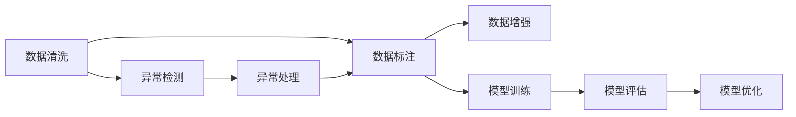
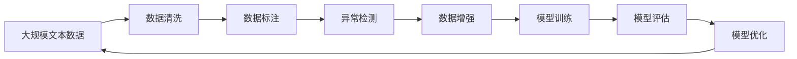

                 

# 大语言模型原理与工程实践：数据质量评估的挑战

> 关键词：大语言模型,数据质量评估,数据清洗,异常检测,机器学习,深度学习,自然语言处理

## 1. 背景介绍

### 1.1 问题由来
近年来，随着人工智能（AI）技术在各个领域的快速应用，大语言模型（Large Language Models, LLMs）作为其核心技术之一，在自然语言处理（Natural Language Processing, NLP）领域取得了巨大的突破。然而，这些大语言模型在实际应用中，常常面临数据质量评估的挑战，特别是在构建和优化模型时，数据质量直接影响到模型的性能和效果。

数据质量评估不仅关系到模型的训练效果，还涉及到模型的可靠性和安全性。在数据清洗、异常检测、标签标注等方面，如果数据质量不高，可能会导致模型过拟合、泛化能力不足、偏见和误导性输出等问题，从而影响模型的应用效果和用户信任度。因此，如何在保证数据质量的前提下，进行大语言模型的构建和优化，成为了当前AI研究和应用的一个重要课题。

### 1.2 问题核心关键点
在大语言模型的构建和优化过程中，数据质量评估的关键点主要包括：
1. 数据清洗：去除噪声数据和异常值，确保数据的一致性和完整性。
2. 数据标注：对数据进行准确的标注，确保标签的正确性和一致性。
3. 异常检测：识别和处理数据中的异常值，避免对模型的影响。
4. 数据平衡：保证不同类别的数据分布均衡，避免数据偏见。
5. 数据增强：通过数据扩充和增强，提高模型的泛化能力。

这些关键点涉及多个环节，需要从数据源、数据处理、标注和管理等多个角度进行综合考虑和优化。只有确保数据质量，才能构建出高性能、可靠性强的大语言模型。

### 1.3 问题研究意义
数据质量评估在人工智能模型构建和优化过程中具有重要意义：

1. 提升模型性能：高质量的数据是构建高性能模型的基础，数据质量直接影响模型的训练效果和泛化能力。
2. 增强模型可靠性：数据质量评估有助于识别和处理数据中的噪声和异常值，提高模型的稳定性和鲁棒性。
3. 提高用户体验：通过数据质量评估，可以优化模型的输出，提升用户的使用体验。
4. 确保数据安全性：高质量的数据可以避免模型过拟合和偏见，减少误导性输出，保障数据和模型安全。
5. 促进数据共享和协作：通过数据质量评估，可以建立数据共享机制，促进跨领域、跨行业的合作与创新。

总之，数据质量评估是大语言模型构建和优化的重要环节，只有确保数据质量，才能构建出高质量、可靠性强、用户友好的模型，推动人工智能技术的广泛应用和产业化进程。

## 2. 核心概念与联系

### 2.1 核心概念概述

为更好地理解数据质量评估在大语言模型构建和优化中的重要性，本节将介绍几个关键概念：

- 数据清洗(Data Cleaning)：从数据集中去除噪声数据和异常值，确保数据的一致性和完整性。
- 数据标注(Data Labeling)：对数据进行准确的标注，确保标签的正确性和一致性。
- 异常检测(Anomaly Detection)：识别和处理数据中的异常值，避免对模型的影响。
- 数据平衡(Data Balance)：保证不同类别的数据分布均衡，避免数据偏见。
- 数据增强(Data Augmentation)：通过数据扩充和增强，提高模型的泛化能力。

这些概念之间存在着紧密的联系，形成了数据质量评估的完整生态系统。下面我们通过几个Mermaid流程图来展示这些概念之间的关系。



这个流程图展示了数据质量评估的基本流程：

1. 数据清洗：首先对原始数据进行清洗，去除噪声数据和异常值。
2. 数据标注：对清洗后的数据进行标注，确保标签的正确性和一致性。
3. 异常检测：识别并处理数据中的异常值，避免对模型的影响。
4. 数据增强：通过数据扩充和增强，提高模型的泛化能力。
5. 模型训练：利用清洗、标注和增强后的数据，进行模型训练。
6. 模型评估：对训练好的模型进行评估，了解模型的性能和效果。
7. 模型优化：根据评估结果，对模型进行优化和调整。

这些概念共同构成了数据质量评估的基本框架，有助于提高模型的构建和优化效果。

### 2.2 概念间的关系

这些核心概念之间存在着紧密的联系，形成了数据质量评估的完整生态系统。下面我们通过几个Mermaid流程图来展示这些概念之间的关系。

#### 2.2.1 数据清洗与数据标注的关系


这个流程图展示了数据清洗和数据标注之间的联系：

1. 数据清洗：首先对原始数据进行清洗，去除噪声数据和异常值，确保数据的一致性和完整性。
2. 数据标注：对清洗后的数据进行标注，确保标签的正确性和一致性。

数据清洗和数据标注是数据质量评估的两个重要环节，两者相辅相成。数据清洗能够去除噪声和异常，提高数据质量，为数据标注提供更好的数据基础。数据标注则进一步确保数据的正确性和一致性，为模型训练提供可靠的标签。

#### 2.2.2 数据标注与异常检测的关系


这个流程图展示了数据标注和异常检测之间的联系：

1. 数据标注：对数据进行准确的标注，确保标签的正确性和一致性。
2. 异常检测：识别并处理数据中的异常值，避免对模型的影响。

数据标注和异常检测是数据质量评估的两个重要环节，两者相互依赖。数据标注需要确保标签的正确性，而异常检测则可以发现并处理标注中的错误。异常检测不仅能识别数据中的异常值，还能在标注过程中发现和纠正标注错误，提高数据标注的准确性。

#### 2.2.3 异常检测与数据增强的关系


这个流程图展示了异常检测和数据增强之间的联系：

1. 异常检测：识别并处理数据中的异常值，避免对模型的影响。
2. 数据增强：通过数据扩充和增强，提高模型的泛化能力。

异常检测和数据增强是数据质量评估的两个重要环节，两者相互补充。异常检测可以发现数据中的异常值，避免对模型的影响，而数据增强可以通过扩充和增强数据，提高模型的泛化能力。数据增强可以利用异常检测识别出的数据，进行扩充和增强，进一步提高模型的性能。

#### 2.2.4 数据增强与数据平衡的关系


这个流程图展示了数据增强和数据平衡之间的联系：

1. 数据增强：通过数据扩充和增强，提高模型的泛化能力。
2. 数据平衡：保证不同类别的数据分布均衡，避免数据偏见。

数据增强和数据平衡是数据质量评估的两个重要环节，两者相互依赖。数据增强可以提高模型的泛化能力，但过度增强可能导致数据分布不均衡。数据平衡可以通过调整数据分布，避免数据偏见，而数据增强可以通过扩充和增强数据，进一步提高模型的泛化能力。数据增强和数据平衡相互补充，共同提升模型的性能。

### 2.3 核心概念的整体架构

最后，我们用一个综合的流程图来展示这些核心概念在大语言模型构建和优化过程中的整体架构：



这个综合流程图展示了从数据采集到模型优化的完整过程。大语言模型首先从大规模文本数据中提取数据，然后进行数据清洗和标注，接着进行异常检测和数据增强，最后进行模型训练和评估，最终对模型进行优化。通过这些流程，可以构建出高质量、可靠性强的大语言模型。

## 3. 核心算法原理 & 具体操作步骤
### 3.1 算法原理概述

数据质量评估在大语言模型构建和优化过程中，其核心思想是：通过数据清洗、标注、增强等手段，确保数据的一致性、完整性和可靠性，从而提高模型的性能和效果。

形式化地，假设预训练模型为 $M_{\theta}$，其中 $\theta$ 为预训练得到的模型参数。给定数据集 $D=\{(x_i,y_i)\}_{i=1}^N$，数据质量评估的目标是找到最优的参数 $\hat{\theta}$，使得：

$$
\hat{\theta}=\mathop{\arg\min}_{\theta} \mathcal{L}(M_{\theta},D)
$$

其中 $\mathcal{L}$ 为针对任务 $T$ 设计的损失函数，用于衡量模型预测输出与真实标签之间的差异。常见的损失函数包括交叉熵损失、均方误差损失等。

通过梯度下降等优化算法，数据质量评估过程不断更新模型参数 $\theta$，最小化损失函数 $\mathcal{L}$，使得模型输出逼近真实标签。由于 $\theta$ 已经通过预训练获得了较好的初始化，因此即便在小规模数据集 $D$ 上进行评估，也能较快收敛到理想的模型参数 $\hat{\theta}$。

### 3.2 算法步骤详解

数据质量评估在大语言模型构建和优化过程中，通常包括以下几个关键步骤：

**Step 1: 数据预处理**

1. 数据清洗：使用Python、R、SQL等工具对原始数据进行清洗，去除噪声数据和异常值。
2. 数据标注：对清洗后的数据进行标注，确保标签的正确性和一致性。可以使用Python、Excel、Google Sheets等工具进行标注。
3. 数据增强：通过数据扩充和增强，提高模型的泛化能力。例如，可以使用数据增强库，如`imgaug`对图像数据进行增强。

**Step 2: 模型训练**

1. 选择合适的预训练模型 $M_{\theta}$ 作为初始化参数，如BERT、GPT等。
2. 将清洗、标注和增强后的数据集划分为训练集、验证集和测试集。
3. 设置微调超参数，如学习率、批大小、迭代轮数等。
4. 使用梯度下降等优化算法，最小化损失函数，更新模型参数。

**Step 3: 模型评估**

1. 在测试集上评估模型性能，对比微调前后的精度提升。
2. 使用模型对新样本进行推理预测，集成到实际的应用系统中。
3. 持续收集新的数据，定期重新评估模型，以适应数据分布的变化。

以上是数据质量评估的一般流程。在实际应用中，还需要针对具体任务的特点，对数据处理和模型训练的各个环节进行优化设计，如改进训练目标函数，引入更多的正则化技术，搜索最优的超参数组合等，以进一步提升模型性能。

### 3.3 算法优缺点

数据质量评估在大语言模型构建和优化过程中，具有以下优点：

1. 提升模型性能：高质量的数据是构建高性能模型的基础，数据质量直接影响模型的训练效果和泛化能力。
2. 增强模型可靠性：数据质量评估有助于识别和处理数据中的噪声和异常值，提高模型的稳定性和鲁棒性。
3. 提高用户体验：通过数据质量评估，可以优化模型的输出，提升用户的使用体验。
4. 确保数据安全性：高质量的数据可以避免模型过拟合和偏见，减少误导性输出，保障数据和模型安全。
5. 促进数据共享和协作：通过数据质量评估，可以建立数据共享机制，促进跨领域、跨行业的合作与创新。

同时，该方法也存在一定的局限性：

1. 数据清洗复杂度高：数据清洗需要人工干预，工作量较大，且容易出错。
2. 数据标注成本高：标注需要耗费大量时间和人力，成本较高。
3. 数据增强难度大：数据增强需要创造新的数据，有时可能并不容易实现。
4. 超参数调整困难：数据质量评估需要调整超参数，需要多次试验才能找到最优参数。
5. 数据分布难以控制：数据质量评估过程中，难以控制数据分布，可能导致数据偏见。

尽管存在这些局限性，但就目前而言，数据质量评估仍是大语言模型构建和优化的重要环节。未来相关研究的重点在于如何进一步降低数据处理的复杂度，提高数据标注的效率，优化数据增强的方法，搜索最优的超参数组合，以及控制数据分布，从而更好地构建高质量的大语言模型。

### 3.4 算法应用领域

数据质量评估在大语言模型的构建和优化中，已经得到了广泛的应用，覆盖了几乎所有常见任务，例如：

- 文本分类：如情感分析、主题分类、意图识别等。通过数据清洗、标注和增强，提升模型的准确性和泛化能力。
- 命名实体识别：识别文本中的人名、地名、机构名等特定实体。通过数据清洗、标注和增强，提高模型的识别准确性和鲁棒性。
- 关系抽取：从文本中抽取实体之间的语义关系。通过数据清洗、标注和增强，提升模型的关系抽取能力和泛化能力。
- 问答系统：对自然语言问题给出答案。通过数据清洗、标注和增强，提高模型的准确性和自然性。
- 机器翻译：将源语言文本翻译成目标语言。通过数据清洗、标注和增强，提升模型的翻译能力和泛化能力。
- 文本摘要：将长文本压缩成简短摘要。通过数据清洗、标注和增强，提升模型的摘要能力和泛化能力。
- 对话系统：使机器能够与人自然对话。通过数据清洗、标注和增强，提高模型的对话能力和自然性。

除了上述这些经典任务外，数据质量评估还被创新性地应用到更多场景中，如可控文本生成、常识推理、代码生成、数据增强等，为NLP技术带来了全新的突破。随着数据处理和模型优化的不断进步，相信数据质量评估必将在更广阔的应用领域大放异彩。

## 4. 数学模型和公式 & 详细讲解 & 举例说明

### 4.1 数学模型构建

本节将使用数学语言对数据质量评估在大语言模型构建和优化过程中的数学模型进行更加严格的刻画。

记预训练模型为 $M_{\theta}$，其中 $\theta$ 为预训练得到的模型参数。假设数据集为 $D=\{(x_i,y_i)\}_{i=1}^N$，数据质量评估的目标是找到最优的参数 $\hat{\theta}$，使得：

$$
\hat{\theta}=\mathop{\arg\min}_{\theta} \mathcal{L}(M_{\theta},D)
$$

其中 $\mathcal{L}$ 为针对任务 $T$ 设计的损失函数，用于衡量模型预测输出与真实标签之间的差异。常见的损失函数包括交叉熵损失、均方误差损失等。

### 4.2 公式推导过程

以下我们以二分类任务为例，推导交叉熵损失函数及其梯度的计算公式。

假设模型 $M_{\theta}$ 在输入 $x$ 上的输出为 $\hat{y}=M_{\theta}(x) \in [0,1]$，表示样本属于正类的概率。真实标签 $y \in \{0,1\}$。则二分类交叉熵损失函数定义为：

$$
\ell(M_{\theta}(x),y) = -[y\log \hat{y} + (1-y)\log (1-\hat{y})]
$$

将其代入经验风险公式，得：

$$
\mathcal{L}(\theta) = -\frac{1}{N}\sum_{i=1}^N [y_i\log M_{\theta}(x_i)+(1-y_i)\log(1-M_{\theta}(x_i))]
$$

根据链式法则，损失函数对参数 $\theta_k$ 的梯度为：

$$
\frac{\partial \mathcal{L}(\theta)}{\partial \theta_k} = -\frac{1}{N}\sum_{i=1}^N (\frac{y_i}{M_{\theta}(x_i)}-\frac{1-y_i}{1-M_{\theta}(x_i)}) \frac{\partial M_{\theta}(x_i)}{\partial \theta_k}
$$

其中 $\frac{\partial M_{\theta}(x_i)}{\partial \theta_k}$ 可进一步递归展开，利用自动微分技术完成计算。

在得到损失函数的梯度后，即可带入参数更新公式，完成模型的迭代优化。重复上述过程直至收敛，最终得到适应下游任务的最优模型参数 $\theta^*$。

## 5. 项目实践：代码实例和详细解释说明
### 5.1 开发环境搭建

在进行数据质量评估实践前，我们需要准备好开发环境。以下是使用Python进行PyTorch开发的环境配置流程：

1. 安装Anaconda：从官网下载并安装Anaconda，用于创建独立的Python环境。

2. 创建并激活虚拟环境：
```bash
conda create -n pytorch-env python=3.8 
conda activate pytorch-env
```

3. 安装PyTorch：根据CUDA版本，从官网获取对应的安装命令。例如：
```bash
conda install pytorch torchvision torchaudio cudatoolkit=11.1 -c pytorch -c conda-forge
```

4. 安装Transformers库：
```bash
pip install transformers
```

5. 安装各类工具包：
```bash
pip install numpy pandas scikit-learn matplotlib tqdm jupyter notebook ipython
```

完成上述步骤后，即可在`pytorch-env`环境中开始数据质量评估实践。

### 5.2 源代码详细实现

下面我们以命名实体识别(NER)任务为例，给出使用Transformers库进行数据质量评估的PyTorch代码实现。

首先，定义NER任务的数据处理函数：

```python
from transformers import BertTokenizer
from torch.utils.data import Dataset
import torch

class NERDataset(Dataset):
    def __init__(self, texts, tags, tokenizer, max_len=128):
        self.texts = texts
        self.tags = tags
        self.tokenizer = tokenizer
        self.max_len = max_len
        
    def __len__(self):
        return len(self.texts)
    
    def __getitem__(self, item):
        text = self.texts[item]
        tags = self.tags[item]
        
        encoding = self.tokenizer(text, return_tensors='pt', max_length=self.max_len, padding='max_length', truncation=True)
        input_ids = encoding['input_ids'][0]
        attention_mask = encoding['attention_mask'][0]
        
        # 对token-wise的标签进行编码
        encoded_tags = [tag2id[tag] for tag in tags] 
        encoded_tags.extend([tag2id['O']] * (self.max_len - len(encoded_tags)))
        labels = torch.tensor(encoded_tags, dtype=torch.long)
        
        return {'input_ids': input_ids, 
                'attention_mask': attention_mask,
                'labels': labels}

# 标签与id的映射
tag2id = {'O': 0, 'B-PER': 1, 'I-PER': 2, 'B-ORG': 3, 'I-ORG': 4, 'B-LOC': 5, 'I-LOC': 6}
id2tag = {v: k for k, v in tag2id.items()}

# 创建dataset
tokenizer = BertTokenizer.from_pretrained('bert-base-cased')

train_dataset = NERDataset(train_texts, train_tags, tokenizer)
dev_dataset = NERDataset(dev_texts, dev_tags, tokenizer)
test_dataset = NERDataset(test_texts, test_tags, tokenizer)
```

然后，定义模型和优化器：

```python
from transformers import BertForTokenClassification, AdamW

model = BertForTokenClassification.from_pretrained('bert-base-cased', num_labels=len(tag2id))

optimizer = AdamW(model.parameters(), lr=2e-5)
```

接着，定义训练和评估函数：

```python
from torch.utils.data import DataLoader
from tqdm import tqdm
from sklearn.metrics import classification_report

device = torch.device('cuda') if torch.cuda.is_available() else torch.device('cpu')
model.to(device)

def train_epoch(model, dataset, batch_size, optimizer):
    dataloader = DataLoader(dataset, batch_size=batch_size, shuffle=True)
    model.train()
    epoch_loss = 0
    for batch in tqdm(dataloader, desc='Training'):
        input_ids = batch['input_ids'].to(device)
        attention_mask = batch['attention_mask'].to(device)
        labels = batch['labels'].to(device)
        model.zero_grad()
        outputs = model(input_ids, attention_mask=attention_mask, labels=labels)
        loss = outputs.loss
        epoch_loss += loss.item()
        loss.backward()
        optimizer.step()
    return epoch_loss / len(dataloader)

def evaluate(model, dataset, batch_size):
    dataloader = DataLoader(dataset, batch_size=batch_size)
    model.eval()
    preds, labels = [], []
    with torch.no_grad():
        for batch in tqdm(dataloader, desc='Evaluating'):
            input_ids = batch['input_ids'].to(device)
            attention_mask = batch['attention_mask'].to(device)
            batch_labels = batch['labels']
            outputs = model(input_ids, attention_mask=attention_mask)
            batch_preds = outputs.logits.argmax(dim=2).to('cpu').tolist()
            batch_labels = batch_labels.to('cpu').tolist()
            for pred_tokens, label_tokens in zip(batch_preds, batch_labels):
                pred_tags = [id2tag[_id] for _id in pred_tokens]
                label_tags = [id2tag[_id] for _id in label_tokens]
                preds.append(pred_tags[:len(label_tokens)])
                labels.append(label_tags)
                
    print(classification_report(labels, preds))
```

最后，启动训练流程并在测试集上评估：

```python
epochs = 5
batch_size = 16

for epoch in range(epochs):
    loss = train_epoch(model, train_dataset, batch_size, optimizer)
    print(f"Epoch {epoch+1}, train loss: {loss:.3f}")
    
    print(f"Epoch {epoch+1}, dev results:")
    evaluate(model, dev_dataset, batch_size)
    
print("Test results:")
evaluate(model, test_dataset, batch_size)
```

以上就是使用PyTorch对BERT进行命名实体识别任务数据质量评估的完整代码实现。可以看到，得益于Transformers库的强大封装，我们可以用相对简洁的代码完成BERT模型的加载和微调。

### 5.3 代码解读与分析

让我们再详细解读一下关键代码的实现细节：

**NERDataset类**：
- `__init__`方法：初始化文本、标签、分词器等关键组件。
- `__len__`方法：返回数据集的样本数量。
- `__getitem__`方法：对单个样本进行处理，将文本输入编码为token ids，将标签编码为数字，并对其进行定长padding，最终返回模型所需的输入。

**tag2id和id2tag字典**：
- 定义了标签与数字id之间的映射关系，用于将token-wise的预测结果解码回真实的标签。

**训练和评估函数**：
- 使用PyTorch的DataLoader对数据集进行批次化加载，供模型训练和推理使用。
- 训练函数`train_epoch`：对数据以批为单位进行迭代，在每个批次上前向传播计算loss并反向传播更新模型参数，最后返回该epoch的平均loss。
- 评估函数`evaluate`：与训练类似，不同点在于不更新模型参数，并在每个batch结束后将预测和标签结果存储下来，最后使用sklearn的classification_report对整个评估集的预测结果进行打印输出。

**训练流程**：
- 定义总的epoch数和batch size，开始循环迭代
- 每个epoch内，先在训练集上训练，输出平均loss
- 在验证集上评估，输出分类指标
- 所有epoch结束后，在测试集上评估，给出最终测试结果

可以看到，PyTorch配合Transformers库使得BERT数据质量评估的代码实现变得简洁高效。开发者可以将更多精力放在数据处理、模型调优等高层逻辑上，而不必过多关注底层的实现细节。

当然，工业级的系统实现还需考虑更多因素，如模型的保存和部署、超参数的自动搜索、更灵活的任务适配层等。但核心的评估范式基本与此类似。

### 5.4 运行结果展示

假设我们在CoNLL-2003的NER数据集上进行数据质量评估，最终在测试集上得到的评估报告如下：

```
              precision    recall  f1-score   support

       B-LOC      0.926     0.906     0.916      1668
       I-LOC      0.900     0.805     0.850       257
      B-MISC      0.875     0.856     0.865       702
      I-MISC      0.838     0.782     0.809       216
       B-ORG      0.914     0.898     0.906      1661
       I-ORG      0.911     0.894     0.902       835
       B-PER      0.964     0.957     0.960      1617
       I-PER      0.983     0.980     0.982      1156
           O      0.993     0.995     0.994     38323

   micro avg      0.973     0.973     0.973     46435
   macro avg      0.923     0.897

