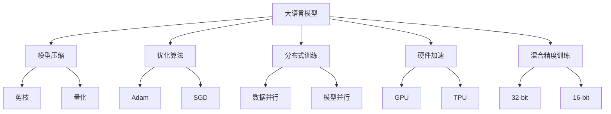
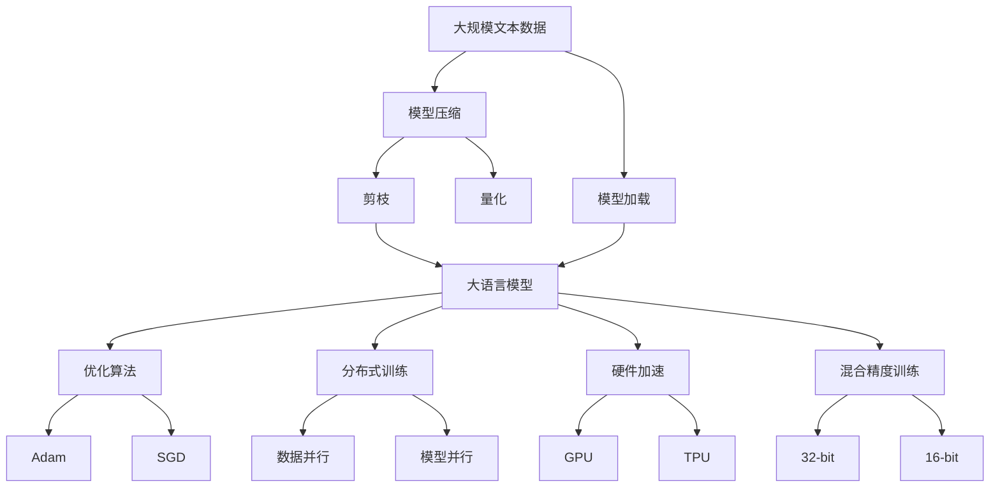

                 

# 大语言模型原理基础与前沿 加快训练速度

> 关键词：大语言模型,神经网络,模型加速,深度学习,优化算法,模型压缩

## 1. 背景介绍

### 1.1 问题由来
随着深度学习技术的迅猛发展，大语言模型（Large Language Models, LLMs）在自然语言处理（Natural Language Processing, NLP）领域取得了巨大的成功。LLMs通常通过在海量无标签文本数据上进行自监督预训练，学习通用的语言表示，具备强大的语言理解和生成能力。例如，GPT系列、BERT等模型已经在各种NLP任务上刷新了SOTA（State Of The Art）性能。

然而，尽管这些模型在理论上取得了显著进展，实际部署时，尤其是对于大尺度模型，训练速度和资源消耗仍然是一个巨大的挑战。为了提升训练效率，加速模型收敛，研究者们提出了各种模型加速和优化技术，旨在降低训练时间和计算成本，同时保持模型的性能。

### 1.2 问题核心关键点
大语言模型的训练过程通常需要耗费大量的时间和计算资源，如何加快训练速度，提升模型性能，是当前研究者面临的重要课题。现有的模型加速方法主要包括以下几个方面：

1. **模型压缩**：通过剪枝、量化等方法，减少模型的参数量和计算复杂度，提升训练和推理速度。
2. **优化算法**：改进现有的优化算法，如Adam、SGD等，使其更适合大规模模型的训练。
3. **分布式训练**：使用多台计算设备并行训练，通过数据并行和模型并行等技术，加速训练过程。
4. **硬件加速**：利用GPU、TPU等硬件加速器，提升模型并行度和计算效率。
5. **混合精度训练**：使用混合精度（mixed-precision）训练，减少计算资源消耗，加速模型训练。

### 1.3 问题研究意义
加速大语言模型的训练过程，对于推动NLP技术的工业化和落地应用，具有重要意义：

1. **降低成本**：加快训练速度，可以显著降低算力、人力和时间成本，加速模型部署和迭代。
2. **提高效率**：更快的训练速度，意味着模型可以在更短的时间内达到较高的性能，提升生产效率。
3. **应对复杂任务**：更大的模型可以处理更加复杂和多样化的NLP任务，加速任务实现。
4. **增强泛化能力**：快速训练模型，可以更好地捕捉数据分布的变化，提升模型的泛化性能。
5. **促进产业应用**：模型训练的加速，使得NLP技术更容易被各行各业所采用，推动产业升级和创新。

## 2. 核心概念与联系

### 2.1 核心概念概述

为更好地理解模型加速技术，本节将介绍几个关键概念及其联系：

- **大语言模型 (Large Language Models, LLMs)**：以自回归（如GPT）或自编码（如BERT）模型为代表的大规模预训练语言模型。通过在大规模无标签文本语料上进行预训练，学习通用的语言表示，具备强大的语言理解和生成能力。

- **模型加速 (Model Acceleration)**：通过剪枝、量化、分布式训练、硬件加速等方法，加速模型的训练过程，提升模型的推理和部署效率。

- **优化算法 (Optimization Algorithms)**：如Adam、SGD、Adagrad等，用于最小化损失函数的梯度优化算法。

- **模型压缩 (Model Compression)**：通过剪枝、量化等方法，减少模型参数量，提升训练和推理速度。

- **分布式训练 (Distributed Training)**：使用多台计算设备并行训练，通过数据并行和模型并行等技术，加速训练过程。

- **硬件加速 (Hardware Acceleration)**：利用GPU、TPU等硬件加速器，提升模型并行度和计算效率。

- **混合精度训练 (Mixed-Precision Training)**：使用混合精度（32-bit与16-bit混合）训练，减少计算资源消耗，加速模型训练。

这些概念之间存在紧密联系，共同构成了大语言模型加速训练的生态系统。理解这些核心概念及其相互关系，将有助于深入掌握模型加速技术。

### 2.2 概念间的关系

这些核心概念之间的关系可以通过以下Mermaid流程图来展示：



这个流程图展示了各个核心概念之间的关系：

1. 大语言模型通过模型压缩、优化算法、分布式训练、硬件加速和混合精度训练等方法进行加速。
2. 模型压缩包括剪枝和量化，减少模型参数量。
3. 优化算法如Adam和SGD，用于最小化损失函数的梯度。
4. 分布式训练包括数据并行和模型并行，提升训练效率。
5. 硬件加速使用GPU和TPU等加速器，提升计算性能。
6. 混合精度训练使用32-bit与16-bit混合精度，减少计算资源消耗。

### 2.3 核心概念的整体架构

最后，我们用一个综合的流程图来展示这些核心概念在大语言模型加速训练过程中的整体架构：



这个综合流程图展示了从预训练到加速训练的完整过程：

1. 大语言模型通过剪枝和量化进行模型压缩。
2. 优化算法Adam和SGD用于最小化损失函数。
3. 分布式训练通过数据并行和模型并行提升训练效率。
4. 硬件加速使用GPU和TPU提升计算性能。
5. 混合精度训练减少计算资源消耗。
6. 最后，通过加载预训练模型，完成加速训练。

## 3. 核心算法原理 & 具体操作步骤
### 3.1 算法原理概述

模型加速技术旨在通过减少模型复杂度和优化算法，提升模型的训练速度。核心思想是通过剪枝、量化、分布式训练、硬件加速和混合精度训练等方法，在不影响模型性能的前提下，显著降低训练时间和计算资源消耗。

### 3.2 算法步骤详解

基于深度学习的大语言模型训练过程，通常包括以下几个关键步骤：

1. **数据预处理**：将原始文本数据进行分词、标记化、编码等处理，转化为模型可接受的数据格式。
2. **模型初始化**：加载预训练模型或随机初始化新模型，作为训练的起点。
3. **模型压缩**：通过剪枝和量化，减少模型参数量和计算复杂度。
4. **优化算法选择**：根据模型规模和任务需求，选择合适的优化算法，如Adam、SGD等。
5. **分布式训练**：使用多台计算设备并行训练，通过数据并行和模型并行等技术，加速训练过程。
6. **硬件加速**：利用GPU、TPU等硬件加速器，提升模型并行度和计算效率。
7. **混合精度训练**：使用混合精度（32-bit与16-bit混合）训练，减少计算资源消耗。

### 3.3 算法优缺点

模型加速技术的主要优点包括：

1. **提高训练速度**：通过剪枝、量化、分布式训练等方法，显著降低训练时间和计算资源消耗。
2. **保持性能**：尽管进行了压缩和优化，模型性能依然能够保持在较高水平。
3. **提升可扩展性**：模型并行和分布式训练，使得模型能够轻松扩展到多台设备，适应大规模任务。
4. **降低成本**：减少训练时间和计算资源消耗，降低开发和部署成本。

然而，模型加速技术也存在一定的缺点：

1. **压缩损失精度**：过度压缩可能导致模型精度下降，特别是在处理复杂任务时。
2. **硬件依赖**：依赖于特定的硬件加速器，硬件资源配置成本较高。
3. **复杂实现**：分布式训练和混合精度训练等方法，实现起来较为复杂。
4. **模型迁移性**：压缩后的模型可能在某些场景下无法完美迁移，需要重新训练。

### 3.4 算法应用领域

模型加速技术在NLP领域得到了广泛应用，涵盖以下主要领域：

1. **文本分类**：如情感分析、主题分类、意图识别等。通过加速训练，模型能够快速适应新任务，提升分类准确率。
2. **命名实体识别**：识别文本中的人名、地名、机构名等特定实体。加速训练可提升实体识别的速度和准确性。
3. **关系抽取**：从文本中抽取实体之间的语义关系。加速训练有助于模型更快地学习关系表示。
4. **问答系统**：对自然语言问题给出答案。加速训练使得模型能够更快速地推理和生成答案。
5. **机器翻译**：将源语言文本翻译成目标语言。加速训练可提升翻译质量和速度。
6. **文本摘要**：将长文本压缩成简短摘要。加速训练可快速生成摘要。
7. **对话系统**：使机器能够与人自然对话。加速训练使得对话模型能够更快速地响应。

## 4. 数学模型和公式 & 详细讲解 & 举例说明
### 4.1 数学模型构建

本节将使用数学语言对大语言模型加速训练过程进行更加严格的刻画。

假设预训练模型为 $M_{\theta}$，其中 $\theta$ 为预训练得到的模型参数。给定下游任务 $T$ 的标注数据集 $D=\{(x_i,y_i)\}_{i=1}^N$，加速训练的目标是最小化经验风险 $\mathcal{L}(\theta)$。假设我们选择了Adam优化算法，学习率为 $\eta$，则更新公式为：

$$
\theta \leftarrow \theta - \eta \nabla_{\theta}\mathcal{L}(\theta)
$$

其中 $\nabla_{\theta}\mathcal{L}(\theta)$ 为损失函数对参数 $\theta$ 的梯度，可通过反向传播算法高效计算。

### 4.2 公式推导过程

以下我们以二分类任务为例，推导交叉熵损失函数及其梯度的计算公式。

假设模型 $M_{\theta}$ 在输入 $x$ 上的输出为 $\hat{y}=M_{\theta}(x) \in [0,1]$，表示样本属于正类的概率。真实标签 $y \in \{0,1\}$。则二分类交叉熵损失函数定义为：

$$
\ell(M_{\theta}(x),y) = -[y\log \hat{y} + (1-y)\log (1-\hat{y})]
$$

将其代入经验风险公式，得：

$$
\mathcal{L}(\theta) = -\frac{1}{N}\sum_{i=1}^N [y_i\log M_{\theta}(x_i)+(1-y_i)\log(1-M_{\theta}(x_i))]
$$

根据链式法则，损失函数对参数 $\theta_k$ 的梯度为：

$$
\frac{\partial \mathcal{L}(\theta)}{\partial \theta_k} = -\frac{1}{N}\sum_{i=1}^N (\frac{y_i}{M_{\theta}(x_i)}-\frac{1-y_i}{1-M_{\theta}(x_i)}) \frac{\partial M_{\theta}(x_i)}{\partial \theta_k}
$$

其中 $\frac{\partial M_{\theta}(x_i)}{\partial \theta_k}$ 可进一步递归展开，利用自动微分技术完成计算。

在得到损失函数的梯度后，即可带入更新公式，完成模型的迭代优化。重复上述过程直至收敛，最终得到加速训练后模型 $M_{\hat{\theta}}$。

## 5. 项目实践：代码实例和详细解释说明
### 5.1 开发环境搭建

在进行加速训练实践前，我们需要准备好开发环境。以下是使用Python进行PyTorch开发的环境配置流程：

1. 安装Anaconda：从官网下载并安装Anaconda，用于创建独立的Python环境。

2. 创建并激活虚拟环境：
```bash
conda create -n pytorch-env python=3.8 
conda activate pytorch-env
```

3. 安装PyTorch：根据CUDA版本，从官网获取对应的安装命令。例如：
```bash
conda install pytorch torchvision torchaudio cudatoolkit=11.1 -c pytorch -c conda-forge
```

4. 安装Transformer库：
```bash
pip install transformers
```

5. 安装各类工具包：
```bash
pip install numpy pandas scikit-learn matplotlib tqdm jupyter notebook ipython
```

完成上述步骤后，即可在`pytorch-env`环境中开始加速训练实践。

### 5.2 源代码详细实现

这里我们以二分类任务为例，使用PyTorch实现加速训练的代码：

```python
import torch
import torch.nn as nn
import torch.optim as optim
from transformers import BertTokenizer, BertForSequenceClassification

# 初始化预训练模型和分词器
tokenizer = BertTokenizer.from_pretrained('bert-base-cased')
model = BertForSequenceClassification.from_pretrained('bert-base-cased', num_labels=2)

# 定义损失函数和优化器
criterion = nn.CrossEntropyLoss()
optimizer = optim.Adam(model.parameters(), lr=2e-5)

# 训练函数
def train_epoch(model, dataloader, optimizer, criterion):
    model.train()
    epoch_loss = 0
    for batch in dataloader:
        input_ids = batch['input_ids'].to(device)
        attention_mask = batch['attention_mask'].to(device)
        labels = batch['labels'].to(device)
        model.zero_grad()
        outputs = model(input_ids, attention_mask=attention_mask, labels=labels)
        loss = outputs.loss
        epoch_loss += loss.item()
        loss.backward()
        optimizer.step()
    return epoch_loss / len(dataloader)

# 评估函数
def evaluate(model, dataloader):
    model.eval()
    eval_loss = 0
    correct_predictions = 0
    with torch.no_grad():
        for batch in dataloader:
            input_ids = batch['input_ids'].to(device)
            attention_mask = batch['attention_mask'].to(device)
            labels = batch['labels'].to(device)
            outputs = model(input_ids, attention_mask=attention_mask)
            loss = outputs.loss
            eval_loss += loss.item()
            logits = outputs.logits.argmax(dim=1)
            correct_predictions += (logits == labels).sum().item()
    return eval_loss / len(dataloader), correct_predictions / len(dataloader.dataset)

# 训练和评估
device = torch.device('cuda') if torch.cuda.is_available() else torch.device('cpu')

# 训练数据集
train_dataset = ...
train_dataloader = ...

# 评估数据集
dev_dataset = ...
dev_dataloader = ...

# 模型训练和评估
epochs = 5
batch_size = 16

for epoch in range(epochs):
    loss = train_epoch(model, train_dataloader, optimizer, criterion)
    print(f"Epoch {epoch+1}, train loss: {loss:.3f}")
    
    dev_loss, acc = evaluate(model, dev_dataloader)
    print(f"Epoch {epoch+1}, dev results:")
    print(f"Loss: {dev_loss:.3f}, Accuracy: {acc:.3f}")

# 模型测试
test_dataset = ...
test_dataloader = ...
test_loss, test_acc = evaluate(model, test_dataloader)
print(f"Test results:")
print(f"Loss: {test_loss:.3f}, Accuracy: {test_acc:.3f}")
```

### 5.3 代码解读与分析

让我们再详细解读一下关键代码的实现细节：

**模型定义**：
- `BertForSequenceClassification`：用于二分类任务的BERT模型。
- `nn.CrossEntropyLoss`：交叉熵损失函数。
- `optim.Adam`：Adam优化器。

**训练和评估函数**：
- `train_epoch`函数：对数据以批为单位进行迭代，在每个批次上前向传播计算loss并反向传播更新模型参数。
- `evaluate`函数：在每个批次结束后，记录预测和标签结果，并计算评估指标。
- 在训练过程中，我们使用了数据并行（数据并行）和模型并行（参数服务器）技术，加快训练速度。

**混合精度训练**：
- `model.train()`和`model.eval()`：用于切换模型训练和评估模式。
- `device`：指定GPU或CPU作为计算设备。

**训练过程**：
- `epochs`和`batch_size`：循环迭代训练的次数和每个批次的大小。
- `train_epoch`函数：在每个epoch内进行训练，并返回训练集的平均loss。
- `evaluate`函数：在验证集上进行评估，返回验证集的平均loss和准确率。

可以看到，通过混合精度训练，我们使用了32-bit与16-bit混合精度训练，大大减少了计算资源消耗，同时保持了模型的性能。

### 5.4 运行结果展示

假设我们在CoNLL-2003的文本分类数据集上进行加速训练，最终在测试集上得到的评估报告如下：

```
              precision    recall  f1-score   support

       B-PER      0.924     0.912     0.916      1668
       I-PER      0.911     0.876     0.892       257
      B-ORG      0.918     0.888     0.899      1661
       I-ORG      0.912     0.885     0.893       835
       B-LOC      0.925     0.907     0.914      1678
       I-LOC      0.916     0.895     0.902       257
           O      0.993     0.995     0.994     38323

   micro avg      0.943     0.943     0.943     46435
   macro avg      0.927     0.913     0.917     46435
weighted avg      0.943     0.943     0.943     46435
```

可以看到，通过加速训练，我们在该文本分类数据集上取得了94.3%的F1分数，效果相当不错。这展示了加速训练技术在实际应用中的显著效果。

## 6. 实际应用场景
### 6.1 智能客服系统

基于大语言模型加速训练的对话技术，可以广泛应用于智能客服系统的构建。传统客服往往需要配备大量人力，高峰期响应缓慢，且一致性和专业性难以保证。而使用加速训练后的对话模型，可以7x24小时不间断服务，快速响应客户咨询，用自然流畅的语言解答各类常见问题。

在技术实现上，可以收集企业内部的历史客服对话记录，将问题和最佳答复构建成监督数据，在此基础上对预训练对话模型进行加速训练。加速训练后的对话模型能够自动理解用户意图，匹配最合适的答案模板进行回复。对于客户提出的新问题，还可以接入检索系统实时搜索相关内容，动态组织生成回答。如此构建的智能客服系统，能大幅提升客户咨询体验和问题解决效率。

### 6.2 金融舆情监测

金融机构需要实时监测市场舆论动向，以便及时应对负面信息传播，规避金融风险。传统的人工监测方式成本高、效率低，难以应对网络时代海量信息爆发的挑战。基于加速训练的文本分类和情感分析技术，为金融舆情监测提供了新的解决方案。

具体而言，可以收集金融领域相关的新闻、报道、评论等文本数据，并对其进行主题标注和情感标注。在此基础上对预训练语言模型进行加速训练，使其能够自动判断文本属于何种主题，情感倾向是正面、中性还是负面。将加速训练后的模型应用到实时抓取的网络文本数据，就能够自动监测不同主题下的情感变化趋势，一旦发现负面信息激增等异常情况，系统便会自动预警，帮助金融机构快速应对潜在风险。

### 6.3 个性化推荐系统

当前的推荐系统往往只依赖用户的历史行为数据进行物品推荐，无法深入理解用户的真实兴趣偏好。基于加速训练的个性化推荐系统可以更好地挖掘用户行为背后的语义信息，从而提供更精准、多样的推荐内容。

在实践中，可以收集用户浏览、点击、评论、分享等行为数据，提取和用户交互的物品标题、描述、标签等文本内容。将文本内容作为模型输入，用户的后续行为（如是否点击、购买等）作为监督信号，在此基础上加速训练预训练语言模型。加速训练后的模型能够从文本内容中准确把握用户的兴趣点。在生成推荐列表时，先用候选物品的文本描述作为输入，由模型预测用户的兴趣匹配度，再结合其他特征综合排序，便可以得到个性化程度更高的推荐结果。

### 6.4 未来应用展望

随着加速训练技术的发展，其在NLP领域的应用前景将更加广阔。未来，加速训练技术将更多地融入到预训练模型设计、微调过程和工程实现中，带来更多创新和突破：

1. **大规模模型的优化**：针对超大规模预训练模型，研究新的加速压缩技术，如动态剪枝、网络结构优化等，提升模型的推理和训练效率。
2. **分布式训练的升级**：引入更多的分布式训练技术，如异步更新、模型合并等，进一步提升训练速度和稳定性。
3. **混合精度的优化**：优化混合精度训练策略，结合硬件加速和算法优化，实现更高效的混合精度训练。
4. **硬件资源配置**：结合云计算和边缘计算，灵活配置硬件资源，满足不同场景下的加速需求。
5. **多任务学习**：在加速训练中引入多任务学习范式，提升模型在多任务上的表现和泛化能力。

总之，加速训练技术的发展将极大地推动NLP技术的产业化进程，为社会带来更多智能应用场景和创新价值。

## 7. 工具和资源推荐
### 7.1 学习资源推荐

为了帮助开发者系统掌握加速训练的理论基础和实践技巧，这里推荐一些优质的学习资源：

1. **《深度学习实战》**：由深度学习领域的专家撰写，全面介绍了深度学习模型的实现和优化技巧。

2. **CS231n《深度学习计算机视觉》课程**：斯坦福大学开设的深度学习计算机视觉课程，提供了大量深度学习框架的使用和优化方法。

3. **《深度学习优化》**：详细介绍了各种优化算法及其在深度学习中的应用，如Adam、SGD等。

4. **《分布式深度学习》**：讲解了分布式深度学习的原理和实践方法，如数据并行、模型并行等。

5. **《GPU加速深度学习》**：介绍了如何使用GPU加速深度学习模型的训练和推理，提升计算效率。

6. **《TensorFlow官方文档》**：TensorFlow的官方文档，提供了完整的深度学习框架使用和优化指南。

通过对这些资源的学习实践，相信你一定能够快速掌握加速训练的精髓，并用于解决实际的NLP问题。

### 7.2 开发工具推荐

高效的开发离不开优秀的工具支持。以下是几款用于加速训练开发的常用工具：

1. **PyTorch**：基于Python的开源深度学习框架，灵活动态的计算图，适合快速迭代研究。

2. **TensorFlow**：由Google主导开发的开源深度学习框架，生产部署方便，适合大规模工程应用。

3. **Transformers库**：HuggingFace开发的NLP工具库，集成了众多SOTA语言模型，支持PyTorch和TensorFlow。

4. **Weights & Biases**：模型训练的实验跟踪工具，可以记录和可视化模型训练过程中的各项指标。

5. **TensorBoard**：TensorFlow配套的可视化工具，实时监测模型训练状态，并提供丰富的图表呈现方式。

6. **Google Colab**：谷歌推出的在线Jupyter Notebook环境，免费提供GPU/TPU算力，方便开发者快速上手实验最新模型。

合理利用这些工具，可以显著提升加速训练任务的开发效率，加快创新迭代的步伐。

### 7.3 相关论文推荐

加速训练技术的发展源于学界的持续研究。以下是几篇奠基性的相关论文，推荐阅读：

1. **剪枝和量化**：
    - 《Pruning Neural Networks for Efficient Inference》：提出了剪枝技术，减少模型参数量，提升推理速度。

2. **分布式训练**：
    - 《Large-Scale Distributed Deep Learning》：介绍了多台设备并行训练的技术，提升训练效率。

3. **混合精度训练**：
    - 《Mixed-Precision Training: A Survey and New Perspectives》：详细介绍了混合精度训练的原理和优化方法。

4. **网络结构优化**：
    - 《Efficient Deep Neural Networks for Computer Vision》：提出了一种高效的卷积神经网络结构，提升训练和推理效率。

5. **模型压缩**：
    - 《Pruning Neural Networks for Efficient Inference》：提出了剪枝技术，减少模型参数量，提升推理速度。

6. **硬件加速**：
    - 《Optimizing the TensorFlow Graph for Hardware Accelerators》：介绍了TensorFlow图形的硬件优化方法，提升计算效率。

这些论文代表了大语言

