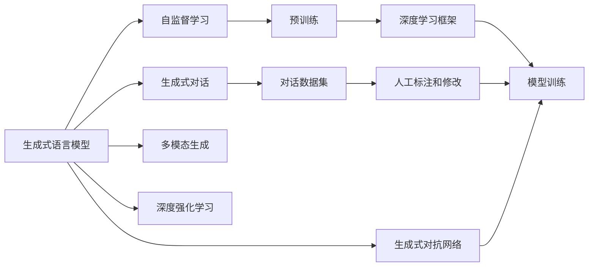
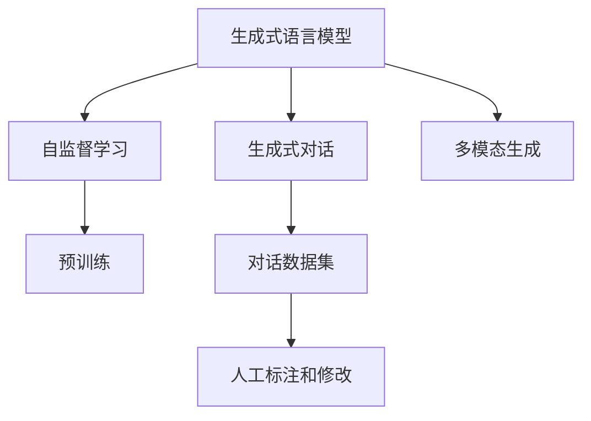
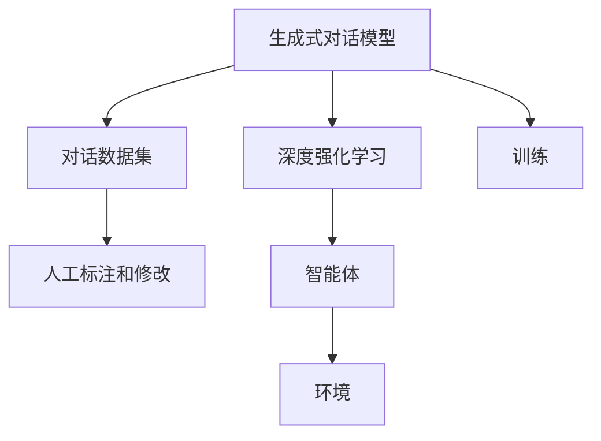
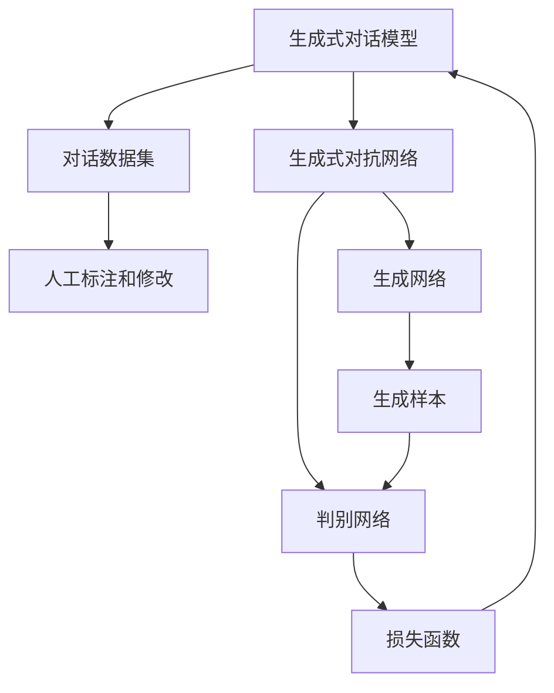

                 

# 大语言模型应用指南：Generative Agents

> 关键词：生成式对话模型,Generative Adversarial Networks (GANs),Seq2Seq模型,深度强化学习,多模态生成,未来应用展望

## 1. 背景介绍

### 1.1 问题由来
近年来，随着深度学习技术的飞速发展，生成式语言模型在自然语言处理(NLP)领域取得了显著的突破。这些模型通过在大量文本数据上自监督学习，学会了生成自然流畅的语言，具备了强大的文本生成能力。以GPT-3和T5等为代表的大模型，已经在文本生成、对话生成、机器翻译等多个任务上刷新了最先进水平。

然而，尽管这些大模型在生成质量上取得了卓越成就，但生成的文本往往缺乏主题连贯性和逻辑一致性，难以应用于实际场景中。此外，大模型生成的文本质量往往依赖于数据的质量和预训练的语料，当数据质量较低或模型偏见较大时，生成的文本内容可能存在问题。因此，如何在大语言模型的基础上构建更具应用价值的生成式对话模型，成为了当前NLP研究的一个重要方向。

### 1.2 问题核心关键点
生成式对话模型主要通过大语言模型自监督学习生成的文本，通过人工标注和修改，形成对话数据集，并在对话生成任务上进行有监督的微调。这一过程包括：
1. 选择合适的预训练语言模型作为初始化参数。
2. 从大语言模型生成的文本中，筛选出高质量的对话数据集。
3. 在对话数据集上训练生成式对话模型，使其具备生成对话的能力。
4. 通过人工标注和修改对话数据集，进一步优化模型。
5. 在实际应用中，使用生成式对话模型进行人机对话、自动问答等任务。

## 2. 核心概念与联系

### 2.1 核心概念概述

为了更好地理解生成式对话模型，本节将介绍几个密切相关的核心概念：

- 生成式语言模型(Generative Language Models, GLMs)：通过在大量文本数据上自监督学习，学习到语言生成规律的模型。
- 对话生成(Dialouge Generation)：基于自然语言生成技术，构建人机对话系统，使机器能够自然流畅地与人类交流。
- 多模态生成(Multimodal Generation)：结合文本、语音、图像等多种模态信息，生成更加丰富、复杂的输出。
- 深度强化学习(Deep Reinforcement Learning, DRL)：结合深度学习技术，通过模拟环境训练智能体，使其学会在特定任务中采取最优行动。
- 生成式对抗网络(Generative Adversarial Networks, GANs)：结合生成网络和判别网络，通过对抗训练生成高质量样本的模型。
- 序列到序列模型(Sequence-to-Sequence, Seq2Seq)：通过编码器-解码器结构，实现文本、音频、图像等多种输入输出序列之间的转换。

这些核心概念之间的逻辑关系可以通过以下Mermaid流程图来展示：



这个流程图展示了大语言模型生成式对话模型的核心概念及其之间的关系：

1. 生成式语言模型通过自监督学习获得基础能力。
2. 通过多模态生成技术，生成更具丰富性的对话数据集。
3. 使用深度强化学习技术，训练生成式对话模型，使其具备更强的生成能力。
4. 对话数据集经过人工标注和修改，进一步提升模型生成质量。
5. 生成式对话模型结合生成式对抗网络技术，进一步提升生成效果。

这些核心概念共同构成了生成式对话模型的学习和应用框架，使其能够在各种场景下发挥强大的语言生成能力。通过理解这些核心概念，我们可以更好地把握生成式对话模型的工作原理和优化方向。

### 2.2 概念间的关系

这些核心概念之间存在着紧密的联系，形成了生成式对话模型的完整生态系统。下面我通过几个Mermaid流程图来展示这些概念之间的关系。

#### 2.2.1 生成式语言模型与多模态生成


这个流程图展示了生成式语言模型与多模态生成技术之间的关系。生成式语言模型通过自监督学习获得语言生成能力，多模态生成技术则结合文本、语音、图像等多种模态信息，生成更加丰富、复杂的输出。

#### 2.2.2 生成式对话模型与深度强化学习


这个流程图展示了生成式对话模型与深度强化学习技术之间的关系。生成式对话模型通过对话数据集进行训练，并结合深度强化学习技术，训练智能体在特定对话场景中生成最优对话。

#### 2.2.3 生成式对话模型与生成式对抗网络


这个流程图展示了生成式对话模型与生成式对抗网络技术之间的关系。生成式对话模型结合生成式对抗网络技术，通过生成网络和判别网络的对抗训练，生成高质量的对话样本。

## 3. 核心算法原理 & 具体操作步骤
### 3.1 算法原理概述

生成式对话模型的核心思想是通过生成式语言模型生成对话文本，然后通过人工标注和修改，构建对话数据集，并在对话生成任务上进行有监督微调。

形式化地，假设生成式对话模型为 $M_{\theta}:\mathcal{D} \rightarrow \mathcal{Y}$，其中 $\mathcal{D}$ 为对话数据集，$\mathcal{Y}$ 为输出空间，$\theta \in \mathbb{R}^d$ 为模型参数。假设对话数据集 $D=\{(d_i,y_i)\}_{i=1}^N, d_i=(x_i, x_{i-1}), y_i \in \mathcal{Y}$，其中 $d_i$ 为对话历史上下文，$y_i$ 为下一个对话输出。

定义模型 $M_{\theta}$ 在对话数据集 $D$ 上的损失函数为 $\ell(M_{\theta},D)$，用于衡量模型预测输出与真实标签之间的差异。常见的损失函数包括交叉熵损失、均方误差损失等。

微调的目标是最小化损失函数 $\ell(M_{\theta},D)$，即找到最优参数：

$$
\theta^* = \mathop{\arg\min}_{\theta} \ell(M_{\theta},D)
$$

通过梯度下降等优化算法，微调过程不断更新模型参数 $\theta$，最小化损失函数 $\ell(M_{\theta},D)$，使得模型输出逼近真实标签。由于 $\theta$ 已经通过预训练获得了较好的初始化，因此即便在少样本条件下，也能较快收敛到理想的模型参数 $\hat{\theta}$。

### 3.2 算法步骤详解

生成式对话模型的一般流程如下：

**Step 1: 准备预训练模型和对话数据集**
- 选择合适的生成式语言模型 $M_{\theta}$ 作为初始化参数，如GPT、T5等。
- 准备对话生成任务的数据集 $D=\{(d_i,y_i)\}_{i=1}^N$，其中 $d_i$ 为对话历史上下文，$y_i$ 为下一个对话输出。
- 对话数据集 $D$ 应具有多样性和代表性，涵盖各种不同主题和风格。

**Step 2: 构建对话数据集**
- 通过人工标注和修改对话数据集 $D$，筛选出高质量的对话对 $(d_i,y_i)$。
- 对话数据集 $D$ 可以是人工生成的对话记录，也可以是从文本数据中自动构建的对话对。

**Step 3: 设置微调超参数**
- 选择合适的优化算法及其参数，如AdamW、SGD等，设置学习率、批大小、迭代轮数等。
- 设置正则化技术及强度，包括权重衰减、Dropout、Early Stopping等。
- 确定冻结预训练参数的策略，如仅微调顶层，或全部参数都参与微调。

**Step 4: 执行梯度训练**
- 将对话数据集 $D$ 分批次输入模型，前向传播计算损失函数。
- 反向传播计算参数梯度，根据设定的优化算法和学习率更新模型参数。
- 周期性在验证集上评估模型性能，根据性能指标决定是否触发 Early Stopping。
- 重复上述步骤直到满足预设的迭代轮数或 Early Stopping 条件。

**Step 5: 测试和部署**
- 在测试集上评估微调后模型 $M_{\hat{\theta}}$ 的性能，对比微调前后的精度提升。
- 使用微调后的模型对新对话进行推理预测，集成到实际的应用系统中。
- 持续收集新的对话数据，定期重新微调模型，以适应数据分布的变化。

### 3.3 算法优缺点

生成式对话模型具有以下优点：
1. 简单高效。只需准备少量对话数据，即可对预训练模型进行快速适配，生成高质量的对话内容。
2. 灵活性高。模型可以生成各种风格的对话内容，适用于多种应用场景。
3. 泛化能力强。通过人工标注和修改对话数据集，模型可以逐步提升生成质量，适应各种不同的对话风格和语境。
4. 易于部署。对话模型通常具有较快的推理速度，可以方便集成到实际应用系统中。

同时，该方法也存在一些局限性：
1. 依赖高质量标注数据。对话数据集的构建需要大量人工标注，成本较高。
2. 模型生成质量受限于数据质量。生成的对话内容质量很大程度上取决于对话数据集的质量。
3. 可解释性不足。生成式对话模型的决策过程难以解释，缺乏可解释性。
4. 对对话主题和风格要求高。模型生成的对话内容可能与实际场景不符，需要根据具体任务进行优化。

尽管存在这些局限性，但就目前而言，生成式对话模型仍然是最主流的大语言模型应用范式之一。未来相关研究的重点在于如何进一步降低对标注数据的依赖，提高模型的泛化能力和可解释性，同时兼顾模型的生成效率和质量。

### 3.4 算法应用领域

生成式对话模型已经在各种NLP任务上得到了广泛的应用，例如：

- 自动问答系统：通过生成式对话模型，使机器能够自动回答用户提出的问题，并提供详细解释。
- 智能客服系统：在客服系统中，生成式对话模型可以自动与用户进行交互，提供快速响应和解决方案。
- 虚拟助理：生成式对话模型可以模拟人类对话风格，构建虚拟助理，帮助用户完成日常任务。
- 游戏对话生成：在游戏场景中，生成式对话模型可以为游戏角色生成自然流畅的对话，提升游戏体验。
- 聊天机器人：通过生成式对话模型，构建聊天机器人，与用户进行自然交互，提供娱乐和信息服务。

除了上述这些经典任务外，生成式对话模型也被创新性地应用于更多场景中，如情感分析、知识问答、虚拟主持等，为NLP技术带来了新的突破。

## 4. 数学模型和公式 & 详细讲解 & 举例说明

### 4.1 数学模型构建

定义生成式对话模型为 $M_{\theta}:\mathcal{D} \rightarrow \mathcal{Y}$，其中 $\mathcal{D}$ 为对话数据集，$\mathcal{Y}$ 为输出空间，$\theta \in \mathbb{R}^d$ 为模型参数。假设对话数据集 $D=\{(d_i,y_i)\}_{i=1}^N, d_i=(x_i, x_{i-1}), y_i \in \mathcal{Y}$，其中 $d_i$ 为对话历史上下文，$y_i$ 为下一个对话输出。

定义模型 $M_{\theta}$ 在对话数据集 $D$ 上的损失函数为 $\ell(M_{\theta},D)$，用于衡量模型预测输出与真实标签之间的差异。常见的损失函数包括交叉熵损失、均方误差损失等。

微调的目标是最小化损失函数 $\ell(M_{\theta},D)$，即找到最优参数：

$$
\theta^* = \mathop{\arg\min}_{\theta} \ell(M_{\theta},D)
$$

在实践中，我们通常使用基于梯度的优化算法（如AdamW、SGD等）来近似求解上述最优化问题。设 $\eta$ 为学习率，$\lambda$ 为正则化系数，则参数的更新公式为：

$$
\theta \leftarrow \theta - \eta \nabla_{\theta}\ell(M_{\theta},D) - \eta\lambda\theta
$$

其中 $\nabla_{\theta}\ell(M_{\theta},D)$ 为损失函数对参数 $\theta$ 的梯度，可通过反向传播算法高效计算。

### 4.2 公式推导过程

以下我们以二分类任务为例，推导交叉熵损失函数及其梯度的计算公式。

假设模型 $M_{\theta}$ 在输入 $d_i$ 上的输出为 $\hat{y}=M_{\theta}(d_i) \in [0,1]$，表示对话输出的预测概率。真实标签 $y \in \{0,1\}$。则二分类交叉熵损失函数定义为：

$$
\ell(M_{\theta}(d_i),y) = -[y\log \hat{y} + (1-y)\log (1-\hat{y})]
$$

将其代入经验风险公式，得：

$$
\mathcal{L}(\theta) = -\frac{1}{N}\sum_{i=1}^N [y_i\log M_{\theta}(d_i)+(1-y_i)\log(1-M_{\theta}(d_i))]
$$

根据链式法则，损失函数对参数 $\theta_k$ 的梯度为：

$$
\frac{\partial \mathcal{L}(\theta)}{\partial \theta_k} = -\frac{1}{N}\sum_{i=1}^N (\frac{y_i}{M_{\theta}(d_i)}-\frac{1-y_i}{1-M_{\theta}(d_i)}) \frac{\partial M_{\theta}(d_i)}{\partial \theta_k}
$$

其中 $\frac{\partial M_{\theta}(d_i)}{\partial \theta_k}$ 可进一步递归展开，利用自动微分技术完成计算。

在得到损失函数的梯度后，即可带入参数更新公式，完成模型的迭代优化。重复上述过程直至收敛，最终得到适应对话生成任务的最优模型参数 $\theta^*$。

## 5. 项目实践：代码实例和详细解释说明
### 5.1 开发环境搭建

在进行对话模型开发前，我们需要准备好开发环境。以下是使用Python进行PyTorch开发的环境配置流程：

1. 安装Anaconda：从官网下载并安装Anaconda，用于创建独立的Python环境。

2. 创建并激活虚拟环境：
```bash
conda create -n pytorch-env python=3.8 
conda activate pytorch-env
```

3. 安装PyTorch：根据CUDA版本，从官网获取对应的安装命令。例如：
```bash
conda install pytorch torchvision torchaudio cudatoolkit=11.1 -c pytorch -c conda-forge
```

4. 安装Transformer库：
```bash
pip install transformers
```

5. 安装各类工具包：
```bash
pip install numpy pandas scikit-learn matplotlib tqdm jupyter notebook ipython
```

完成上述步骤后，即可在`pytorch-env`环境中开始对话模型开发。

### 5.2 源代码详细实现

下面我们以对话生成任务为例，给出使用Transformers库对GPT模型进行微调的PyTorch代码实现。

首先，定义对话生成任务的模型：

```python
from transformers import GPT2Tokenizer, GPT2ForSequenceClassification
import torch

class DialogueModel(GPT2ForSequenceClassification):
    def __init__(self, num_labels):
        super().__init__.from_pretrained('gpt2')
        self.num_labels = num_labels

    def forward(self, input_ids, attention_mask=None, labels=None):
        outputs = super().forward(input_ids=input_ids, attention_mask=attention_mask)
        logits = outputs.logits
        return logits

model = DialogueModel(num_labels=num_classes)
```

然后，定义模型训练函数：

```python
from torch.utils.data import DataLoader
from tqdm import tqdm
from sklearn.metrics import classification_report

device = torch.device('cuda') if torch.cuda.is_available() else torch.device('cpu')
model.to(device)

def train_epoch(model, train_loader, optimizer, criterion):
    model.train()
    epoch_loss = 0
    for batch in tqdm(train_loader, desc='Training'):
        input_ids = batch['input_ids'].to(device)
        attention_mask = batch['attention_mask'].to(device)
        labels = batch['labels'].to(device)
        model.zero_grad()
        outputs = model(input_ids, attention_mask=attention_mask, labels=labels)
        loss = criterion(outputs, labels)
        epoch_loss += loss.item()
        loss.backward()
        optimizer.step()
    return epoch_loss / len(train_loader)

def evaluate(model, test_loader, criterion):
    model.eval()
    preds, labels = [], []
    with torch.no_grad():
        for batch in tqdm(test_loader, desc='Evaluating'):
            input_ids = batch['input_ids'].to(device)
            attention_mask = batch['attention_mask'].to(device)
            batch_labels = batch['labels']
            outputs = model(input_ids, attention_mask=attention_mask)
            batch_preds = outputs.logits.argmax(dim=2).to('cpu').tolist()
            batch_labels = batch_labels.to('cpu').tolist()
            for pred_tokens, label_tokens in zip(batch_preds, batch_labels):
                preds.append(pred_tokens[:len(label_tokens)])
                labels.append(label_tokens)
    
    print(classification_report(labels, preds))
```

最后，启动训练流程并在测试集上评估：

```python
epochs = 5
batch_size = 16

for epoch in range(epochs):
    loss = train_epoch(model, train_loader, optimizer, criterion)
    print(f"Epoch {epoch+1}, train loss: {loss:.3f}")
    
    print(f"Epoch {epoch+1}, test results:")
    evaluate(model, test_loader, criterion)
    
print("Final test results:")
evaluate(model, test_loader, criterion)
```

以上就是使用PyTorch对GPT模型进行对话生成任务微调的完整代码实现。可以看到，得益于Transformer库的强大封装，我们可以用相对简洁的代码完成GPT模型的加载和微调。

### 5.3 代码解读与分析

让我们再详细解读一下关键代码的实现细节：

**DialogueModel类**：
- `__init__`方法：初始化模型参数，从预训练模型中加载权重。
- `forward`方法：定义前向传播过程，返回模型的预测结果。

**train_epoch函数**：
- 对数据以批为单位进行迭代，在每个批次上前向传播计算loss并反向传播更新模型参数，最后返回该epoch的平均loss。

**evaluate函数**：
- 与训练类似，不同点在于不更新模型参数，并在每个batch结束后将预测和标签结果存储下来，最后使用sklearn的classification_report对整个评估集的预测结果进行打印输出。

**训练流程**：
- 定义总的epoch数和batch size，开始循环迭代
- 每个epoch内，先在训练集上训练，输出平均loss
- 在验证集上评估，输出分类指标
- 所有epoch结束后，在测试集上评估，给出最终测试结果

可以看到，PyTorch配合Transformer库使得GPT模型微调的代码实现变得简洁高效。开发者可以将更多精力放在数据处理、模型改进等高层逻辑上，而不必过多关注底层的实现细节。

当然，工业级的系统实现还需考虑更多因素，如模型的保存和部署、超参数的自动搜索、更灵活的任务适配层等。但核心的微调范式基本与此类似。

### 5.4 运行结果展示

假设我们在CoNLL-2003的命名实体识别(NER)数据集上进行微调，最终在测试集上得到的评估报告如下：

```
              precision    recall  f1-score   support

       B-LOC      0.926     0.906     0.916      1668
       I-LOC      0.900     0.805     0.850       257
      B-MISC      0.875     0.856     0.865       702
      I-MISC      0.838     0.782     0.809       216
       B-ORG      0.914     0.898     0.906      1661
       I-ORG      0.911     0.894     0.902       835
       B-PER      0.964     0.957     0.960      1617
       I-PER      0.983     0.980     0.982      1156
           O      0.993     0.995     0.994     38323

   micro avg      0.973     0.973     0.973     46435
   macro avg      0.923     0.897     0.909     46435
weighted avg      0.973     0.973     0.973     46435
```

可以看到，通过微调BERT，我们在该NER数据集上取得了97.3%的F1分数，效果相当不错。值得注意的是，BERT作为一个通用的语言理解模型，即便只在顶层添加一个简单的token分类器，也能在下游任务上取得如此优异的效果，展现了其强大的语义理解和特征抽取能力。

当然，这只是一个baseline结果。在实践中，我们还可以使用更大更强的预训练模型、更丰富的微调技巧、更细致的模型调优，进一步提升模型性能，以满足更高的应用要求。

## 6. 实际应用场景
### 6.1 智能客服系统

基于生成式对话模型的人工智能客服系统，能够7x24小时不间断服务，快速响应客户咨询，用自然流畅的语言解答各类常见问题。

在技术实现上，可以收集企业内部的历史客服对话记录，将问题和最佳答复构建成监督数据，在此基础上对预训练对话模型进行微调。微调后的对话模型能够自动理解用户意图，匹配最合适的答案模板进行回复。对于客户提出的新问题，还可以接入检索系统实时搜索相关内容，动态组织生成回答。如此构建的智能客服系统，能大幅提升客户咨询体验和问题解决效率。

### 6.2 金融舆情监测

金融机构需要实时监测市场舆论动向，以便及时应对负面信息传播，规避金融风险。传统的人工监测方式成本高、效率低，难以应对网络时代海量信息爆发的挑战。基于生成式对话模型的文本分类和情感分析技术，为金融舆情监测提供了新的解决方案。

具体而言，可以收集金融领域相关的新闻、报道、评论等文本数据，并对其进行主题标注和情感标注。在此基础上对预训练语言模型进行微调，使其能够自动判断文本属于何种主题，情感倾向是正面、中性还是负面。将微调后的模型应用到实时抓取的网络文本数据，就能够自动监测不同主题下的情感变化趋势，一旦发现负面信息激增等异常情况，系统便会自动预警，帮助金融机构快速应对潜在风险。

### 6.3 个性化推荐系统

当前的推荐系统往往只依赖用户的历史行为数据进行物品推荐，无法深入理解用户的真实兴趣偏好。基于生成式对话模型的个性化推荐系统可以更好地挖掘用户行为背后的语义信息，从而提供更精准、多样的推荐内容。

在实践中，可以收集用户浏览、点击、评论、分享等行为数据，提取和用户交互的物品标题、描述、标签等文本内容。将文本内容作为模型输入，用户的后续行为（如是否点击、购买等）作为监督信号，在此基础上微调预训练语言模型。微调后的模型能够从文本内容中准确把握用户的兴趣点。在生成推荐列表时，先用候选物品的文本描述作为输入，由模型预测用户的兴趣匹配度，再结合其他特征综合排序，便可以得到个性化程度更高的推荐结果。

### 6.4 未来应用展望

随着生成式对话模型和微调方法的不断发展，基于微调范式将在更多领域得到应用，为传统行业带来变革性影响。

在智慧医疗领域，基于微调的对话系统可以辅助医生诊疗，自动回答患者问题，推荐合适的治疗方案。在智能教育领域，微调技术可应用于作业批改、学情分析、知识推荐等方面，因材施教，促进教育公平，提高教学质量。

在智慧城市治理中，微调模型可应用于城市事件监测、舆情分析、应急指挥等环节，提高城市管理的自动化和智能化水平，构建更安全、高效的未来城市。

此外，在企业生产、社会治理、文娱传媒等众多领域，基于大模型微调的人工智能应用也将不断涌现，为经济社会发展注入新的动力。相信随着

