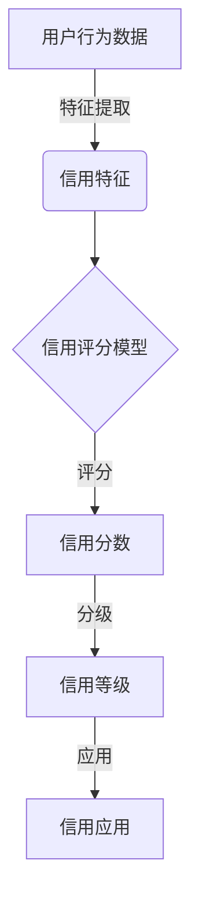

# 大数据下个人用户信用行为的等级评估及应用研究

## 1. 背景介绍

### 1.1 问题的由来

在当今信息时代,随着互联网和大数据技术的快速发展,个人用户在网上留下了大量的行为数据足迹。这些海量的用户行为数据蕴含着丰富的个人信用信息,对于评估用户的信用水平具有重要意义。传统的信用评估方式主要依赖于用户的财务状况、还款记录等有限信息,难以全面反映用户的整体信用状况。因此,如何利用大数据技术从用户的网上行为中挖掘出有价值的信用信息,并对用户的信用行为进行科学的等级评估,成为了一个亟待解决的问题。

### 1.2 研究现状

目前,已有一些学者和企业开始尝试利用大数据技术对用户的网上行为进行分析,以评估其信用水平。例如,一些电子商务网站会根据用户的购物记录、评价情况等数据,对用户的信用度进行打分。社交网络也可以从用户的社交关系、言论表现等方面反映出其信用状况。然而,这些研究大多局限于特定领域,缺乏系统性和全面性。

### 1.3 研究意义

建立一套科学的个人用户信用行为等级评估体系,对于促进信用体系建设、维护社会诚信具有重要意义。从个人层面来看,准确的信用评估有助于用户获得相应的信贷、就业等机会,提高生活质量。从企业角度,可以降低风险,优化资源配置。从社会层面,有利于构建诚信社会,促进经济健康发展。

### 1.4 本文结构

本文将系统地探讨如何利用大数据技术对个人用户的网上行为进行分析,并建立科学的信用等级评估体系。全文共分为八个部分:第一部分介绍研究背景;第二部分阐述核心概念及其联系;第三部分详细解释核心算法原理和具体操作步骤;第四部分构建数学模型并推导公式;第五部分给出项目实践的代码实例及解释;第六部分探讨实际应用场景;第七部分推荐相关工具和资源;最后总结研究成果、未来发展趋势和面临的挑战。

## 2. 核心概念与联系

要对个人用户的信用行为进行科学评估,需要明确以下几个核心概念及其内在联系:

1. **用户行为数据**:指用户在网上留下的各种行为足迹,包括浏览记录、搜索记录、购物记录、社交活动记录等。这些海量的非结构化数据是进行信用评估的基础数据源。

2. **信用特征**:从用户行为数据中提取出反映用户信用状况的特征,如购物频率、消费水平、社交圈子、言论倾向等,这些特征将作为算法的输入。

3. **信用评分模型**:基于机器学习等技术,构建能够对用户的信用特征进行分析并给出信用分数的评分模型,是信用评估的核心。

4. **信用等级**:根据评分模型的输出分数,将用户划分为不同的信用等级,如极高信用、高信用、中等信用、低信用等,为后续的应用决策提供依据。

5. **信用应用**:包括贷款审批、就业甄选、保险定价等,根据用户的信用等级进行相应的决策。

上述概念相互关联、环环相扣,构成了完整的个人用户信用行为等级评估体系,如下流程图所示:

## 3. 核心算法原理与具体操作步骤

### 3.1 算法原理概述

对个人用户的信用行为进行等级评估,核心是构建一个高效、准确的信用评分模型。该模型的输入是用户的信用特征,输出是用户的信用分数。常用的建模方法包括逻辑回归、决策树、神经网络等机器学习算法。

以逻辑回归为例,其基本原理是:通过对训练数据的特征和标签进行拟合,得到每个特征对应的权重系数,将特征与权重进行线性组合,再通过Sigmoid函数将结果映射到(0,1)区间,作为用户违约或信用良好的概率值,最终得到用户的信用分数。

### 3.2 算法步骤详解

逻辑回归算法的具体步骤如下:

1. **数据预处理**:对原始用户行为数据进行清洗、标准化、特征工程等预处理,获得符合模型输入要求的特征数据集。

2. **构建训练集和测试集**:从预处理后的数据中随机抽取一部分作为测试集,其余作为训练集。

3. **模型训练**:使用训练集数据,通过梯度下降等优化算法,求解逻辑回归模型中各特征的权重系数,使得模型在训练集上的损失函数最小。

4. **模型评估**:将训练好的模型应用于测试集,计算评估指标如准确率、召回率等,判断模型的泛化能力。

5. **模型调优**:根据评估结果,通过调整算法超参数、增减特征等方式,优化模型性能。

6. **模型上线**:当模型性能满足要求后,可将其上线应用于实际的用户信用评估任务。

7. **持续优化**:定期更新模型,使其能够适应用户行为的变化,保持评估的准确性。

### 3.3 算法优缺点

逻辑回归算法的优点包括:

- 模型简单,可解释性强,易于理解和部署。
- 训练速度快,对异常数据不太敏感,泛化能力较好。
- 可直接给出样本的概率输出,易于理解和使用。

缺点包括:

- 对于非线性数据的拟合能力较差。
- 需要对特征作归一化处理,否则会受到数据量纲的影响。
- 容易遇到数据分布不均衡、过拟合等问题,需要特殊处理。

### 3.4 算法应用领域

除了用于个人用户信用评估外,逻辑回归算法还广泛应用于以下领域:

- 金融风控:如贷款违约风险预测、信用卡欺诈检测等。
- 医疗健康:如疾病风险预测、患者存活率评估等。
- 网络安全:如垃圾邮件过滤、入侵检测等。
- 营销广告:如用户响应率预测、广告点击率预测等。

## 4. 数学模型和公式详细讲解与举例说明

### 4.1 数学模型构建

逻辑回归模型的数学表达式为:

$$
P(Y=1|X) = \frac{1}{1 + e^{-(\beta_0 + \beta_1X_1 + \beta_2X_2 + \cdots + \beta_nX_n)}}
$$

其中:

- $Y$是二值标签变量,表示用户是否违约(1违约,0未违约)
- $X$是特征向量$(X_1, X_2, \cdots, X_n)$,包含n个特征
- $\beta$是模型参数向量$(\beta_0, \beta_1, \cdots, \beta_n)$,需要通过训练数据来估计

目标是求解能够最小化损失函数的$\beta$参数:

$$
\min_\beta \sum_{i=1}^{m} \left[ -y^{(i)}\log(h_\beta(x^{(i)})) - (1-y^{(i)})\log(1-h_\beta(x^{(i)})) \right]
$$

其中:
- $m$是训练数据的样本数量
- $h_\beta(x)$是模型的假设函数,即$P(Y=1|X)$

通常使用梯度下降法等优化算法来求解$\beta$参数。

### 4.2 公式推导过程

以上述损失函数为例,推导梯度下降的公式:

1) 首先对单个样本的损失函数求偏导:

$$
\begin{aligned}
\frac{\partial}{\partial\beta_j}\left[ -y\log(h_\beta(x)) - (1-y)\log(1-h_\beta(x)) \right]
&= -(y\frac{1}{h_\beta(x)} - (1-y)\frac{1}{1-h_\beta(x)}) \cdot \frac{\partial h_\beta(x)}{\partial\beta_j} \\
&= -(y - h_\beta(x))x_j
\end{aligned}
$$

2) 对所有样本求和,得到总的代价函数梯度:

$$
\begin{aligned}
\frac{\partial}{\partial\beta_j}J(\beta)
&= \sum_{i=1}^{m}-(y^{(i)} - h_\beta(x^{(i)}))x_j^{(i)} \\
&= -\frac{1}{m}\sum_{i=1}^{m}(y^{(i)} - h_\beta(x^{(i)}))x_j^{(i)}
\end{aligned}
$$

3) 根据梯度下降法,参数的更新规则为:

$$
\beta_j := \beta_j - \alpha \frac{\partial}{\partial\beta_j}J(\beta)
$$

其中$\alpha$是学习率。重复迭代直至收敛。

### 4.3 案例分析与讲解

假设我们有如下用户行为数据集:

| 用户ID | 年龄 | 教育程度 | 信用卡数量 | 购物频率 | 社交活跃度 | 是否违约 |
|--------|------|----------|------------|----------|------------|----------|
| 1      | 28   | 本科     | 2          | 3        | 4          | 0        |
| 2      | 35   | 硕士     | 3          | 1        | 2          | 1        |
| ...    | ...  | ...      | ...        | ...      | ...        | ...      |

我们将年龄、教育程度、信用卡数量、购物频率、社交活跃度作为特征$X$,是否违约作为标签$Y$,构建逻辑回归模型:

$$
P(Y=1|X) = \frac{1}{1+e^{-(\beta_0 + \beta_1 \text{年龄} + \beta_2 \text{教育程度} + \beta_3 \text{信用卡数量} + \beta_4 \text{购物频率} + \beta_5 \text{社交活跃度})}}
$$

通过梯度下降法训练模型,得到最优参数:

$$
\beta = (-2.5, 0.08, -0.6, 1.2, -0.3, 0.5)
$$

则对于一个30岁、本科学历、2张信用卡、每月购物5次、社交活跃度3的用户,其违约概率为:

$$
\begin{aligned}
P(Y=1|X) &= \frac{1}{1+e^{-(-2.5 + 0.08 \times 30 - 0.6 \times 1 + 1.2 \times 2 - 0.3 \times 5 + 0.5 \times 3)}} \\
          &= 0.37
\end{aligned}
$$

因此,该用户的信用分数可以定义为$(1-0.37) \times 100 = 63$,属于中等信用水平。

### 4.4 常见问题解答

1. **为什么要使用Sigmoid函数?**

   Sigmoid函数可以将线性回归的输出映射到(0,1)区间,从而将其解释为概率值。同时,Sigmoid函数的导数形式简单,方便求解梯度。

2. **如何处理数据不平衡问题?**

   可以在训练时对正负样本进行过采样或欠采样,或在损失函数中加入惩罚项,使模型更关注少数类样本。

3. **为什么要进行特征缩放?**

   不同特征的数值范围可能差异很大,这会导致梯度下降时某些特征的权重更新幅度过大,影响收敛速度。特征缩放可以将所有特征映射到相似的尺度,提高训练效率。

4. **如何避免过拟合?**

   可以采用正则化技术,在损失函数中加入参数范数的惩罚项,防止参数值过大。另外也可以使用交叉验证、早停等策略。

5. **逻辑回归能否处理非线性问题?**

   逻辑回归本身是线性模型,但可以通过对原始特征进行非线性转换(如多项