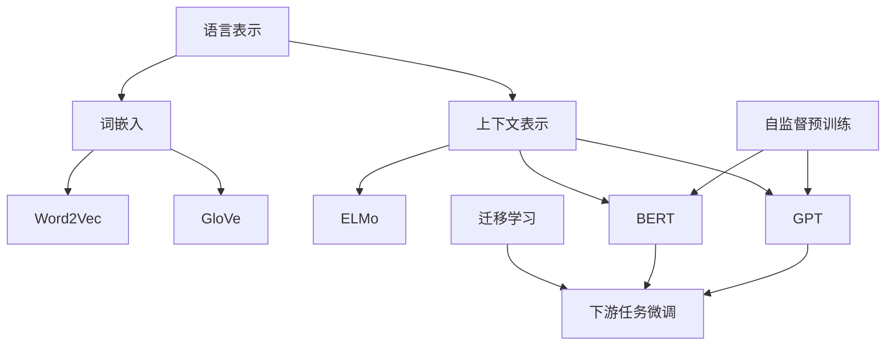

# 大语言模型原理与工程实践：语言表示介绍

作者：禅与计算机程序设计艺术 / Zen and the Art of Computer Programming

## 1. 背景介绍

### 1.1 问题的由来

在自然语言处理(NLP)领域,语言表示一直是一个核心问题。如何有效地将自然语言转换为机器可以理解和处理的形式,是实现各种NLP任务的基础。传统的NLP方法通常采用基于规则的方式或浅层机器学习模型,但这些方法往往需要大量的人工特征工程,且泛化能力有限。

随着深度学习技术的兴起,基于神经网络的语言表示模型逐渐成为主流。这些模型能够自动从大规模语料中学习语义和语法知识,极大地提高了语言表示的质量和泛化能力。尤其是近年来,随着计算能力和数据量的不断增长,大型预训练语言模型(Large Pre-trained Language Models,PLMs)取得了突破性进展,在各种NLP任务上展现出了卓越的性能。

### 1.2 研究现状

目前,主流的大型预训练语言模型主要包括BERT、GPT、XLNet、RoBERTa等。这些模型通过在大规模无标注语料上进行自监督预训练,学习到了丰富的语义和语法知识。然后,可以将这些预训练模型进行微调(fine-tuning),应用到下游的NLP任务中,如文本分类、机器阅读理解、文本生成等。

这些大型语言模型的出现,极大地推动了NLP领域的发展。相比于传统的基于规则或浅层模型,它们展现出了更强的语义理解能力和泛化性能。同时,预训练语言模型的思路也被推广应用到了计算机视觉、多模态等其他领域,产生了广泛的影响。

### 1.3 研究意义

语言是人类交流和思维的基础,对语言的表示和理解是实现人工智能的关键。大型预训练语言模型的出现,标志着机器对自然语言的理解能力有了质的飞跃,为实现真正的人工通用智能(Artificial General Intelligence,AGI)奠定了基础。

此外,语言技术在信息时代也扮演着越来越重要的角色。高质量的语言表示模型可以支撑诸如智能问答、自动写作、机器翻译、语音识别等各种应用,提高人机交互的自然性和效率,释放人类的创造力。因此,研究和掌握大型语言模型的原理和工程实践,对于推动人工智能技术的发展和应用都具有重要意义。

### 1.4 本文结构

本文将全面介绍大型预训练语言模型的原理和工程实践,内容包括:

1. 核心概念与联系
2. 核心算法原理及具体操作步骤
3. 数学模型和公式详细讲解与案例分析
4. 项目实践:代码实例和详细解释
5. 实际应用场景
6. 工具和资源推荐
7. 总结:未来发展趋势与挑战
8. 附录:常见问题与解答

接下来,我们将逐一深入探讨上述各个方面。

## 2. 核心概念与联系

大型预训练语言模型的核心概念主要包括:

1. **语言表示(Language Representation)**:将自然语言转换为机器可以理解和处理的形式,是NLP的基础问题。
2. **词嵌入(Word Embedding)**:将单词映射到连续的向量空间,捕捉单词之间的语义关系。
3. **上下文表示(Contextual Representation)**:根据上下文捕捉单词的多义性,生成动态的词表示。
4. **自监督预训练(Self-supervised Pretraining)**:在大规模无标注语料上进行预训练,学习通用的语言知识。
5. **迁移学习(Transfer Learning)**:将预训练模型进行微调,应用到下游的NLP任务中。

这些概念之间存在紧密的联系。传统的词嵌入方法(如Word2Vec、GloVe)生成的是静态的单词表示,无法捕捉词义的多样性。而上下文表示模型(如ELMo、BERT、GPT)则能够根据上下文动态地生成词的表示,更好地捕捉语义信息。

大型预训练语言模型通过自监督预训练的方式,在大规模语料上学习到丰富的语言知识,形成强大的上下文表示能力。然后,可以利用迁移学习的思路,将这些预训练模型进行微调,快速地应用到下游的NLP任务中,极大地提高了模型的性能和泛化能力。

## 3. 核心算法原理及具体操作步骤

### 3.1 算法原理概述

大型预训练语言模型的核心算法原理主要包括两个部分:自监督预训练(Self-supervised Pretraining)和迁移学习(Transfer Learning)。

**自监督预训练**:
- 目标是在大规模无标注语料上学习通用的语言表示,捕捉语义和语法知识。
- 常见的预训练目标包括:
    - 掩码语言模型(Masked Language Model,MLM):预测被掩码的单词。
    - 下一句预测(Next Sentence Prediction,NSP):判断两个句子是否相邻。
    - 因果语言模型(Causal Language Model,CLM):基于上文预测下一个单词。
- 通过自监督预训练,模型可以学习到丰富的语义和语法知识,形成强大的上下文表示能力。

**迁移学习**:
- 将预训练模型进行微调(Fine-tuning),应用到下游的NLP任务中。
- 在下游任务的数据上进行有监督训练,同时保留预训练模型的大部分参数。
- 利用预训练模型的知识,可以快速收敛并获得良好的性能。

这种"预训练+微调"的范式,充分利用了大规模无标注语料和有标注数据的优势,极大地提高了模型的性能和泛化能力。

### 3.2 算法步骤详解

以BERT(Bidirectional Encoder Representations from Transformers)为例,其预训练和微调的具体步骤如下:

**预训练阶段**:

1. **输入表示**:将输入文本切分为词元(WordPiece)序列,并添加特殊标记[CLS]和[SEP]。
2. **掩码语言模型(MLM)**:随机选择一些词元进行掩码,模型需要预测这些被掩码的词元。
3. **下一句预测(NSP)**:给定两个句子,模型需要判断它们是否相邻。
4. **编码器**:使用Transformer编码器对输入序列进行编码,生成上下文表示。
5. **预训练目标**:MLM损失+NSP损失,使用梯度下降算法进行参数更新。

**微调阶段**:

1. **下游任务输入**:根据具体任务,对输入进行适当的格式化处理。
2. **微调模型**:初始化BERT模型参数,添加任务特定的输出层。
3. **训练**:在下游任务的有标注数据上进行有监督训练,微调BERT模型的参数。
4. **预测**:使用微调后的模型对新的输入进行预测。

通过上述步骤,BERT模型可以在大规模无标注语料上学习到通用的语言知识,然后再将这些知识迁移到下游的NLP任务中,极大地提高了模型的性能。

### 3.3 算法优缺点

**优点**:

1. **强大的语义表示能力**:通过自监督预训练,模型可以学习到丰富的语义和语法知识,形成强大的上下文表示能力。
2. **高效的迁移学习**:利用预训练模型的知识,可以快速收敛并获得良好的性能,降低了下游任务的数据需求。
3. **泛化性能优秀**:预训练模型具有良好的泛化能力,可以应用到各种NLP任务中。

**缺点**:

1. **计算资源需求高**:训练大型语言模型需要消耗大量的计算资源,包括GPU、TPU等加速硬件。
2. **训练数据需求大**:需要大规模的无标注语料进行预训练,数据获取和处理成本高。
3. **黑盒性质**:模型内部的表示形式难以解释,缺乏可解释性。
4. **偏差和安全性问题**:预训练语料中可能存在偏差和不当内容,模型也会学习到这些知识。

### 3.4 算法应用领域

大型预训练语言模型已经在各种NLP任务中取得了卓越的性能,主要应用领域包括:

1. **文本分类**:情感分析、新闻分类、垃圾邮件检测等。
2. **机器阅读理解**:问答系统、事实抽取、知识图谱构建等。
3. **序列标注**:命名实体识别、关系抽取、词性标注等。
4. **文本生成**:机器翻译、文本摘要、自动写作等。
5. **对话系统**:开放域对话、任务导向对话等。
6. **其他领域**:如计算机视觉、多模态等,也逐渐采用预训练的范式。

总的来说,大型语言模型为各种NLP任务提供了强大的语义表示能力,极大地推动了这一领域的发展。

## 4. 数学模型和公式详细讲解与举例说明

### 4.1 数学模型构建

大型预训练语言模型通常采用基于Transformer的编码器-解码器架构,其核心是自注意力(Self-Attention)机制。我们以BERT模型为例,介绍其数学模型的构建过程。

BERT使用了Transformer的编码器部分,其输入表示如下:

$$\mathbf{X} = [\mathbf{x}_1, \mathbf{x}_2, \cdots, \mathbf{x}_n]$$

其中$\mathbf{x}_i$表示第$i$个词元的embedding,包括词元embedding、位置embedding和段落embedding的叠加。

然后,输入$\mathbf{X}$通过$N$层Transformer编码器进行编码,生成上下文表示$\mathbf{H}$:

$$\mathbf{H} = \text{Transformer}(\mathbf{X})$$

每一层Transformer编码器的计算过程如下:

1. **多头自注意力(Multi-Head Self-Attention)**:

$$\begin{aligned}
\text{MultiHead}(Q, K, V) &= \text{Concat}(\text{head}_1, \cdots, \text{head}_h)\mathbf{W^O} \
\text{head}_i &= \text{Attention}(QW_i^Q, KW_i^K, VW_i^V)
\end{aligned}$$

其中$Q$、$K$、$V$分别表示Query、Key和Value,通过线性变换得到。$\text{Attention}(\cdot)$计算为:

$$\text{Attention}(Q, K, V) = \text{softmax}(\frac{QK^T}{\sqrt{d_k}})V$$

2. **前馈神经网络(Feed-Forward Network)**:

$$\text{FFN}(x) = \max(0, xW_1 + b_1)W_2 + b_2$$

3. **残差连接(Residual Connection)**和**层归一化(Layer Normalization)**:

$$\begin{aligned}
\text{output} &= \text{LayerNorm}(x + \text{Sublayer}(x)) \
\text{Sublayer}(x) &= \text{LayerNorm}(x + \text{FFN}(\text{MultiHead}(Q, K, V)))
\end{aligned}$$

通过上述计算,BERT模型可以生成每个词元的上下文表示,捕捉输入序列的语义和语法信息。

### 4.2 公式推导过程

我们以自注意力(Self-Attention)机制为例,推导其数学原理。

自注意力的目标是计算一个序列中每个元素与其他元素的关系,生成其上下文表示。设输入序列为$\mathbf{X} = [\mathbf{x}_1, \mathbf{x}_2, \cdots, \mathbf{x}_n]$,我们希望计算第$i$个元素$\mathbf{x}_i$的上下文表示$\mathbf{z}_i$。