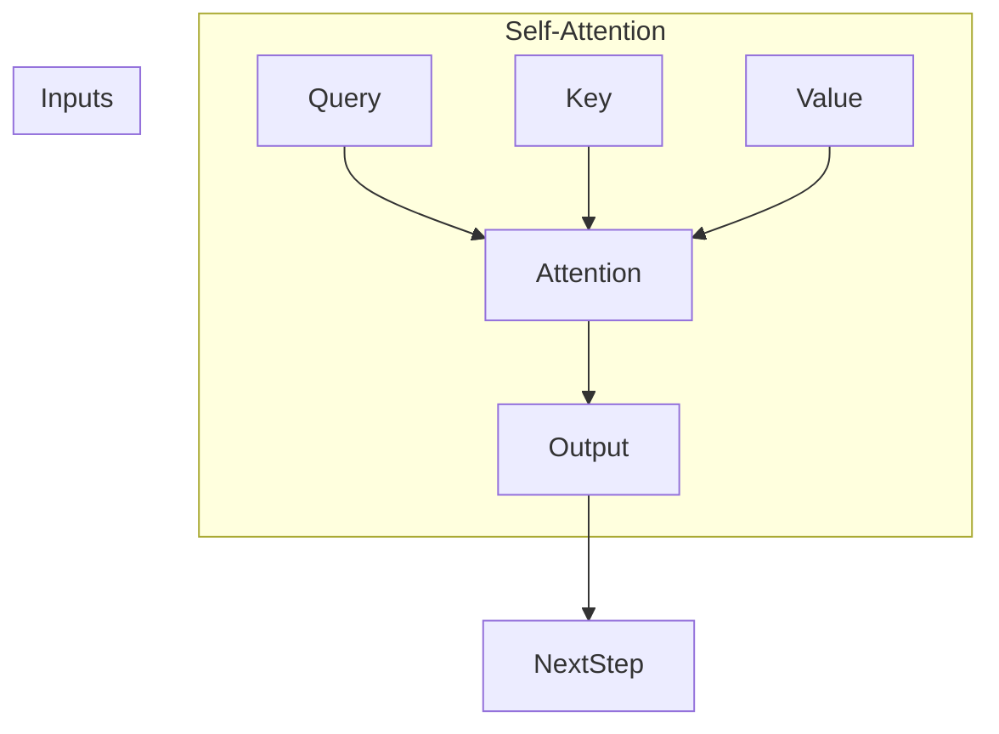
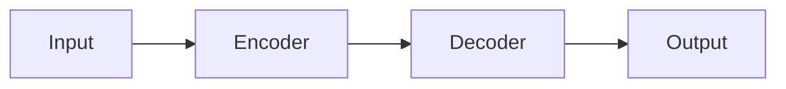
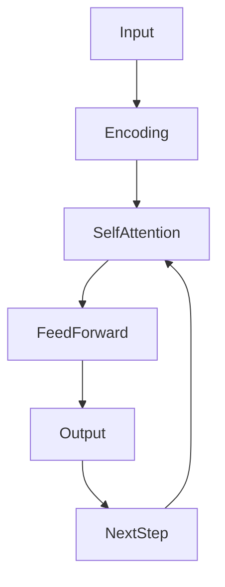

# AIGC从入门到实战：不识庐山真面目：GPT 模型为什么能生成有意义的文本？

## 1. 背景介绍

### 1.1 问题的由来

随着人工智能技术的不断发展,自然语言处理(NLP)领域取得了令人瞩目的进展。其中,生成式预训练转换器(Generative Pre-trained Transformer,GPT)模型因其在文本生成任务中表现出色而备受关注。GPT模型能够生成看似有意义、连贯且相关的文本,这一能力引发了人们的浓厚兴趣和诸多疑问。

### 1.2 研究现状

目前,GPT模型在自动文本生成、机器翻译、问答系统等多个领域都取得了卓越的成绩。然而,GPT模型内部的工作原理并不是一目了然的。虽然研究人员已经对GPT模型的表现进行了大量的实证研究,但对于它为什么能够生成有意义的文本,背后的深层次机理仍然存在一些未解之谜。

### 1.3 研究意义

揭开GPT模型生成有意义文本的奥秘,不仅有助于我们更好地理解和运用这一强大的技术,还可以为未来的自然语言处理模型提供借鉴和启发。深入探究GPT模型的工作原理,有望推动NLP领域的理论发展,并为相关应用的实践提供指导。

### 1.4 本文结构

本文将从以下几个方面深入剖析GPT模型生成有意义文本的内在机制:

1. 核心概念与联系
2. 核心算法原理与具体操作步骤
3. 数学模型和公式详细讲解与案例分析
4. 项目实践:代码实例和详细解释说明
5. 实际应用场景
6. 工具和资源推荐
7. 总结:未来发展趋势与挑战
8. 附录:常见问题与解答

## 2. 核心概念与联系

为了理解GPT模型的工作原理,我们需要先了解一些核心概念及其相互关系。

### 2.1 自注意力机制(Self-Attention Mechanism)

自注意力机制是GPT模型的核心所在,它允许模型在生成每个单词时,充分利用输入序列中其他单词的信息。与传统的序列模型(如RNN)不同,自注意力机制不需要按顺序处理序列,而是能够同时关注整个序列中的每个位置。这种全局关注的能力使得模型能够更好地捕获长距离依赖关系,从而生成更加连贯和有意义的文本。

### 2.2 transformer架构

transformer是一种全新的序列到序列(Seq2Seq)模型架构,它完全基于自注意力机制,不再使用循环神经网络(RNN)或卷积神经网络(CNN)。transformer架构由编码器(encoder)和解码器(decoder)两部分组成,编码器负责处理输入序列,解码器则根据编码器的输出生成目标序列。GPT模型实际上是一种decoder-only的transformer,专注于序列生成任务。

### 2.3 语言模型(Language Model)

语言模型是自然语言处理领域的一个核心概念,它旨在捕捉语言的统计规律,为给定的文本序列估计概率。GPT模型本质上是一种基于transformer架构的大型语言模型,通过在大量文本数据上进行预训练,学习到了语言的内在规律和语义知识。在生成文本时,GPT模型会根据上下文,预测下一个最可能出现的单词或词组,从而生成看似有意义的文本。

### 2.4 预训练与微调(Pre-training and Fine-tuning)

GPT模型采用了预训练与微调的范式。在预训练阶段,模型会在大规模的无监督文本数据上进行训练,学习通用的语言知识。而在微调阶段,模型会在特定任务的数据上进行进一步训练,使其能够更好地适应该任务。这种先通过预训练获取通用知识,再通过微调学习特定任务的方式,极大提高了模型的性能和泛化能力。

### 2.5 上下文理解能力(Context Understanding Capability)

GPT模型之所以能够生成有意义的文本,很大程度上归功于其强大的上下文理解能力。通过自注意力机制,GPT模型能够充分利用输入序列中的上下文信息,捕获单词之间的长距离依赖关系。同时,预训练过程中积累的语言知识也使得模型能够更好地理解和生成与上下文相关的内容。

## 3. 核心算法原理与具体操作步骤

### 3.1 算法原理概述

GPT模型的核心算法原理可以概括为以下几个关键步骤:

1. **输入编码**: 将输入文本序列转换为模型可以理解的向量表示。
2. **自注意力计算**: 通过自注意力机制,捕获输入序列中单词之间的关系。
3. **前馈神经网络**: 将自注意力的输出传递给前馈神经网络进行进一步处理。
4. **输出生成**: 根据前馈神经网络的输出,预测下一个最可能出现的单词或词组。
5. **迭代生成**: 将预测的单词或词组添加到输出序列中,并重复上述步骤,直到生成完整的文本。

### 3.2 算法步骤详解

1. **输入编码**

   GPT模型首先需要将输入文本序列转换为向量表示。这通常是通过词嵌入(Word Embedding)技术实现的。每个单词都会被映射到一个固定长度的向量,这些向量能够捕捉单词之间的语义和语法关系。

2. **自注意力计算**

   自注意力机制是GPT模型的核心所在。它允许模型在生成每个单词时,充分利用输入序列中其他单词的信息。具体来说,自注意力机制会计算出每个单词与其他单词的关系分数(注意力分数),然后根据这些分数对其他单词的表示进行加权求和,得到该单词的上下文表示。

   自注意力计算过程可以用以下公式表示:

   $$
   \begin{aligned}
   \text{Attention}(Q, K, V) &= \text{softmax}\left(\frac{QK^T}{\sqrt{d_k}}\right)V \
   \text{MultiHead}(Q, K, V) &= \text{Concat}(\text{head}_1, \ldots, \text{head}_h)W^O
   \end{aligned}
   $$

   其中,$$Q$$、$$K$$和$$V$$分别代表查询(Query)、键(Key)和值(Value),它们都是通过线性变换从输入序列的词嵌入中得到的。$$d_k$$是缩放因子,用于防止点积过大导致的梯度饱和问题。$$\text{MultiHead}$$表示使用多头注意力,以捕获不同的关系。

3. **前馈神经网络**

   自注意力的输出会被传递给前馈神经网络进行进一步处理。前馈神经网络通常包含两个全连接层,中间使用ReLU激活函数:

   $$
   \text{FFN}(x) = \max(0, xW_1 + b_1)W_2 + b_2
   $$

   前馈神经网络的作用是对自注意力的输出进行非线性变换,提取更高层次的特征表示。

4. **输出生成**

   经过前馈神经网络处理后,模型会根据当前的输出向量,预测下一个最可能出现的单词或词组。这通常是通过一个线性层和softmax函数实现的:

   $$
   P(w_t | w_1, \ldots, w_{t-1}) = \text{softmax}(W_o h_t + b_o)
   $$

   其中,$$h_t$$是当前时间步的输出向量,$$W_o$$和$$b_o$$是线性层的权重和偏置。softmax函数会将线性层的输出转换为一个概率分布,表示每个单词或词组在下一个位置出现的概率。

5. **迭代生成**

   在预测出下一个单词或词组后,GPT模型会将其添加到输出序列中,并重复上述步骤,直到生成完整的文本。这个过程是自回归(auto-regressive)的,即每一步的输出都会被用作下一步的输入。

### 3.3 算法优缺点

**优点**:

- 自注意力机制能够有效捕获长距离依赖关系,生成更加连贯和有意义的文本。
- transformer架构并行化能力强,训练和推理速度快。
- 预训练与微调范式提高了模型的泛化能力和性能。

**缺点**:

- 需要大量的计算资源和训练数据,训练成本高。
- 生成的文本可能存在不合理、偏差或有害的内容。
- 缺乏真正的理解和推理能力,只是基于统计规律生成文本。

### 3.4 算法应用领域

GPT模型及其变体已被广泛应用于多个自然语言处理领域,包括但不限于:

- 文本生成: 新闻报道、小说写作、对话系统等。
- 机器翻译: 将一种语言的文本翻译成另一种语言。
- 问答系统: 根据问题生成相关的答复。
- 文本摘要: 自动生成文本的摘要。
- 代码生成: 根据需求生成相应的计算机程序代码。
- 语音识别: 将语音转录为文本。

## 4. 数学模型和公式详细讲解与举例说明

### 4.1 数学模型构建

为了更好地理解GPT模型的工作原理,我们需要构建一个数学模型来描述它。GPT模型的目标是最大化给定文本序列的条件概率,即:

$$
P(w_1, w_2, \ldots, w_n) = \prod_{t=1}^n P(w_t | w_1, \ldots, w_{t-1})
$$

其中,$$w_1, w_2, \ldots, w_n$$是文本序列中的单词,$$P(w_t | w_1, \ldots, w_{t-1})$$表示在给定前面所有单词的情况下,当前单词$$w_t$$出现的条件概率。

为了计算这个条件概率,GPT模型使用了transformer的decoder部分,它由多个解码器层组成,每个解码器层包含一个自注意力子层和一个前馈神经网络子层。

在自注意力子层中,模型会计算出每个单词与其他单词的注意力分数,然后根据这些分数对其他单词的表示进行加权求和,得到该单词的上下文表示。具体来说,自注意力计算过程可以用以下公式表示:

$$
\begin{aligned}
\text{Attention}(Q, K, V) &= \text{softmax}\left(\frac{QK^T}{\sqrt{d_k}}\right)V \
\text{MultiHead}(Q, K, V) &= \text{Concat}(\text{head}_1, \ldots, \text{head}_h)W^O
\end{aligned}
$$

其中,$$Q$$、$$K$$和$$V$$分别代表查询(Query)、键(Key)和值(Value),它们都是通过线性变换从输入序列的词嵌入中得到的。$$d_k$$是缩放因子,用于防止点积过大导致的梯度饱和问题。$$\text{MultiHead}$$表示使用多头注意力,以捕获不同的关系。

在前馈神经网络子层中,自注意力的输出会被传递给一个包含两个全连接层的前馈神经网络进行进一步处理,公式如下:

$$
\text{FFN}(x) = \max(0, xW_1 + b_1)W_2 + b_2
$$

经过多个解码器层的处理后,模型会根据当前的输出向量,预测下一个最可能出现的单词或词组,这通常是通过一个线性层和softmax函数实现的:

$$
P(w_t | w_1, \ldots, w_{t-1}) = \text{softmax}(W_o h_t + b_o)
$$

其中,$$h_t$$是当前时间步的输出向量,$$W