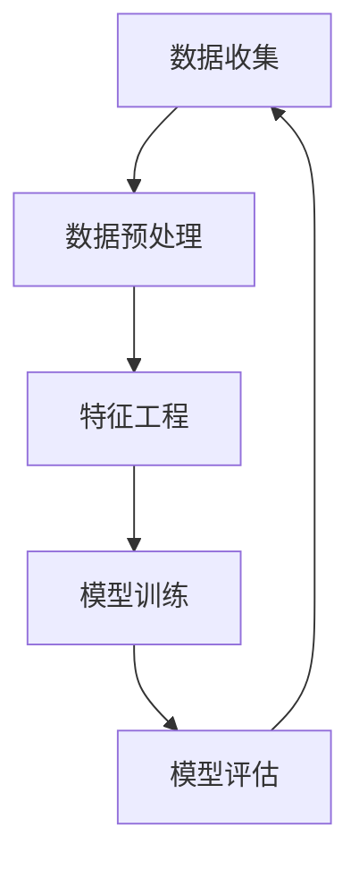
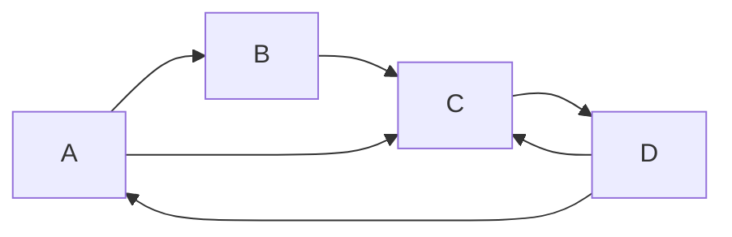

好的,我会严格遵守您提供的约束条件,以"AI人工智能核心算法原理与代码实例讲解：数据收集"为主题,撰写一篇专业的技术博客文章。

# AI人工智能核心算法原理与代码实例讲解：数据收集

## 1. 背景介绍

### 1.1 问题的由来

在人工智能领域,数据是训练模型和算法的燃料。没有高质量的数据,就无法构建出准确高效的人工智能系统。数据收集作为人工智能项目的第一步,对最终模型的性能有着至关重要的影响。然而,获取足够数量、高质量的数据并非易事,需要解决诸多挑战。

### 1.2 研究现状

目前,数据收集主要有以下几种方式:

1. 网络爬虫自动采集公开数据
2. 人工标注和构建数据集
3. 通过API获取数据
4. 从物联网设备、传感器收集数据
5. 利用模拟器生成虚拟数据

每种方法都有其优缺点,需要根据具体应用场景选择合适的数据来源。

### 1.3 研究意义

高质量数据对人工智能系统的性能至关重要。通过研究数据收集的最新技术和方法,可以提高数据质量,降低获取数据的成本,从而推动人工智能技术的发展和应用。

### 1.4 本文结构

本文将首先介绍数据收集的核心概念,然后详细阐述主流数据收集算法的原理和实现步骤。接下来,我们将探讨数据收集过程中的数学模型,并给出公式推导和案例分析。此外,文中还将提供项目实践的代码示例,讲解实际应用场景,推荐相关工具和资源,最后总结数据收集领域的发展趋势和挑战。

## 2. 核心概念与联系

数据收集是人工智能项目的基础环节,与数据预处理、特征工程、模型训练和模型评估等环节密切相关。收集到的原始数据需要经过清洗、标注等预处理步骤,然后提取特征输入模型进行训练。模型评估的结果将反馈到数据收集阶段,指导后续数据的采集策略。因此,数据收集与人工智能项目的其他环节形成了循环流程。



## 3. 核心算法原理与具体操作步骤

### 3.1 算法原理概述

数据收集算法主要分为以下几类:

1. **网络爬虫算法**: 自动从网站上抓取公开数据,包括通用网页爬虫和专用爬虫两种。
2. **主动学习算法**: 通过人工标注和交互式标注,有针对性地收集高质量数据。
3. **数据增强算法**: 基于现有数据,通过变换、合成等方式生成新的数据样本。
4. **数据清洗算法**: 从原始数据中去除噪声、异常值和冗余数据,提高数据质量。

这些算法可以单独使用,也可以组合使用,形成混合数据收集策略。

### 3.2 算法步骤详解

以网络爬虫算法为例,其主要步骤如下:

1. **种子URL获取**: 从入口网页开始,获取初始的URL种子集合。

2. **网页解析**: 对下载的网页进行解析,提取出URL地址和网页正文内容。

3. **URL去重**: 使用集合、布隆过滤器等数据结构,去除重复的URL。

4. **URL规范化**: 将URL转换为规范形式,方便后续处理。

5. **URL排序**: 根据预先定义的策略,对待抓取的URL进行排序和调度。

6. **网页内容存储**: 将抓取到的网页内容存储到数据库或文件系统中。

7. **控制策略**: 设置抓取策略,如并发数、抓取间隔、优先级等,避免对网站造成过多压力。

8. **结束条件检测**: 检测是否满足结束条件,如已抓取的页面数、时间阈值等。

```mermaid
graph TD
    A[种子URL获取] --> B[网页解析]
    B --> C[URL去重]
    C --> D[URL规范化]
    D --> E[URL排序]
    E --> F[网页内容存储]
    F --> G[控制策略]
    G --> H[结束条件检测]
    H -->|No I[继续抓取]
    I --> B
    H -->|Yes J[结束]
```

### 3.3 算法优缺点

网络爬虫算法的优点包括:

- 可以自动化采集大规模公开数据
- 覆盖范围广,数据种类丰富
- 相对成本低廉

缺点包括:

- 存在法律和隐私风险
- 数据质量参差不齐,需要进一步清洗
- 可能受到反爬虫机制的限制

### 3.4 算法应用领域

网络爬虫算法广泛应用于以下领域:

- 搜索引擎
- 电商价格监控
- 新闻资讯采集
- 社交媒体数据挖掘
- 学术论文检索

## 4. 数学模型和公式详细讲解举例说明

### 4.1 数学模型构建

在网络爬虫算法中,我们可以将网页看作是一个有向图$G=(V,E)$,其中$V$表示网页集合,即节点集合;$E$表示超链接集合,即边集合。爬虫的过程就是在这个网页图$G$上进行遍历。

我们定义$P(v_i)$为访问节点$v_i$的优先级,则爬虫算法的目标是最大化如下公式:

$$\max \sum_{v_i \in V} P(v_i)$$

其中,优先级$P(v_i)$可以根据特定的评分函数来计算,例如基于网页的PageRank值、更新频率等因素。

### 4.2 公式推导过程

接下来,我们推导出计算网页重要性的PageRank公式。假设网页$v_j$有$n$个出链接,分别指向$v_{j1},...,v_{jn}$,则:

$$PR(v_j) = (1-d) + d \sum_{v_i \in B_j} \frac{PR(v_i)}{L(v_i)}$$

其中:
- $PR(v_j)$表示网页$v_j$的PageRank值
- $B_j$是链接到$v_j$的网页集合
- $L(v_i)$是网页$v_i$的出链接数量
- $d$是阻尼系数,通常取值0.85

上式的直观解释是:一个网页的PageRank值由两部分组成。第一部分$(1-d)$是所有网页的初始默认值;第二部分是该网页被其他高质量网页链接的贡献之和。

### 4.3 案例分析与讲解

假设有一个小型网页图如下所示,我们来计算每个网页的PageRank值:



初始时,令所有网页的PageRank值都为1,阻尼系数$d=0.85$。则第一轮迭代后:

$$
\begin{aligned}
PR(A) &= (1-0.85) + 0.85 \times \frac{1}{2} = 0.675\
PR(B) &= (1-0.85) + 0.85 \times \frac{1}{2} = 0.675\
PR(C) &= (1-0.85) + 0.85 \times (\frac{1}{2}+\frac{1}{1}+\frac{1}{2}) = 1.025\
PR(D) &= (1-0.85) + 0.85 \times 0 = 0.15
\end{aligned}
$$

经过多轮迭代计算,PageRank值将收敛到稳定值。可以看出,作为网页图中的"枢纽",$C$拥有最高的PageRank值,而$D$只是"蜘蛛网"的边缘节点,PageRank值较低。

### 4.4 常见问题解答

**Q: 如何评估爬虫算法的效率?**

A: 常用的评估指标包括:
- 抓取速率(页面/秒)
- 抓取覆盖率(抓取页面数/总页面数)
- 去重效率(去重时间/总时间)
- 存储效率(存储空间/总页面数)

**Q: 如何避免爬虫被反爬虫机制拦截?**

A: 可以采取以下策略:
- 设置合理的抓取频率,避免给网站带来过大压力
-伪造请求头,模拟真实浏览器行为
- 使用IP地址池,动态切换IP
- 对抓取的URL进行有效去重,避免重复访问

## 5. 项目实践:代码实例和详细解释说明

### 5.1 开发环境搭建

我们使用Python语言和Scrapy框架开发一个简单的新闻网站爬虫。首先需要安装Python和Scrapy:

```bash
# 安装Python
brew install python3

# 安装Scrapy
pip3 install scrapy
```

### 5.2 源代码详细实现

新建一个Scrapy项目:

```bash
scrapy startproject news_crawler
```

在`news_crawler/spiders`目录下新建`news_spider.py`文件,编写爬虫代码:

```python
import scrapy

class NewsSpider(scrapy.Spider):
    name = 'news'
    start_urls = ['https://news.example.com/']

    def parse(self, response):
        for article in response.css('div.article'):
            yield {
                'title': article.css('h2 a::text').get(),
                'link': article.css('h2 a::attr(href)').get(),
                'content': article.css('div.content *::text').getall()
            }

        next_page = response.css('a.next::attr(href)').get()
        if next_page is not None:
            yield response.follow(next_page, self.parse)
```

该爬虫从种子URL开始,解析网页中的新闻标题、链接和正文内容,并自动跟进下一页链接,直到抓取完所有页面。

### 5.3 代码解读与分析

- `scrapy.Spider`是Scrapy中的基础爬虫类,我们定义了一个`NewsSpider`继承自它。
- `name`属性标识爬虫的名称。
- `start_urls`是初始的URL种子集合。
- `parse`方法定义了解析网页的逻辑,使用CSS选择器提取需要的数据。
- `yield`语句返回提取到的数据,Scrapy会自动存储到指定位置。
- 如果存在下一页链接,通过`response.follow`方法自动跟进并继续解析。

### 5.4 运行结果展示

在项目根目录执行以下命令,启动爬虫:

```bash
scrapy crawl news -o news.json
```

爬虫将自动抓取新闻网站的所有文章,并将结果存储到`news.json`文件中。部分输出如下:

```json
[
  {
    "title": "Breaking News: AI Breakthrough Achieved",
    "link": "https://news.example.com/ai-breakthrough",
    "content": [
      "Scientists at XYZ Lab have made a groundbreaking discovery...",
      ...
    ]
  },
  {
    "title": "New Smartphone Unveiled at Tech Event",
    "link": "https://news.example.com/new-smartphone",
    "content": [
      "The highly anticipated smartphone from Acme Inc. was finally unveiled...",
      ...
    ]
  }
]
```

## 6. 实际应用场景

### 6.1 搜索引擎

搜索引擎使用网络爬虫不断抓取互联网上的网页内容,构建庞大的网页索引库。当用户输入查询时,搜索引擎会在索引库中快速检索相关网页,并按照排名算法显示结果。

### 6.2 电商价格监控

电商平台和价格比价网站需要持续监控各种商品在不同渠道的价格变化,以发现优惠商品、分析价格趋势。网络爬虫可以自动采集各电商网站的商品信息,为价格监控提供数据支持。

### 6.3 新闻资讯采集

新闻媒体和资讯平台需要实时采集互联网上的最新新闻和热点事件,以快速更新内容。使用网络爬虫可以自动化地从各大门户网站、新闻网站、社交媒体等渠道收集新闻信息。

### 6.4 未来应用展望

随着物联网、5G等技术的发展,