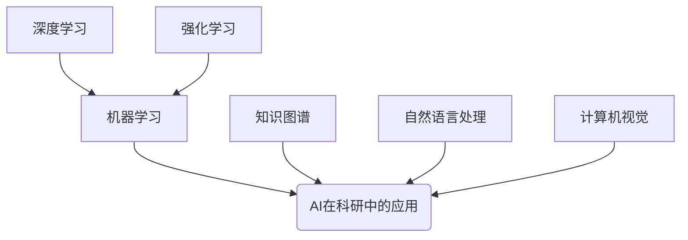
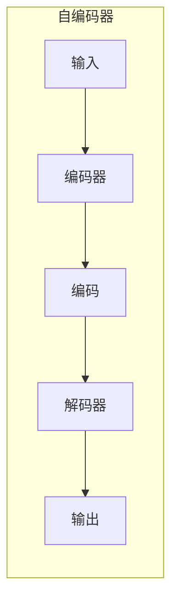

好的,我会尽力撰写一篇高质量的技术博客文章。以下是文章正文:

# AI在科学研究中的突破

## 1. 背景介绍

### 1.1 问题的由来

科学研究是推动人类文明进步的重要动力。从牛顿发现万有引力定律,到爱因斯坦提出相对论,再到现代量子理论的建立,科学家们通过不懈的努力和创新,不断拓展着人类对宇宙规律的认知。然而,传统的科研方式面临着诸多挑战:

1. **大规模数据处理**:当代科学实验产生的数据量巨大,如何高效处理和分析这些海量数据成为瓶颈。
2. **复杂现象建模**:很多自然现象涉及多重因素的耦合作用,构建精确的数学模型极为困难。
3. **新理论发现**:基于现有知识框架,发现新的科学理论和规律仍然是一个艰巨的挑战。

### 1.2 研究现状

为解决上述难题,科学家们一直在探索新的研究方法和工具。近年来,人工智能(AI)技术的飞速发展为科研工作带来了全新的机遇。AI系统具备强大的数据处理、模式识别和自动推理能力,在多个科学领域展现出巨大的应用潜力。

目前,AI已在天文学、生物学、化学、物理学等多个领域取得突破性进展。例如,AI系统能够自动分析天文图像并发现新的天体;能够预测蛋白质的三维结构,加速新药研发;能够模拟复杂的量子行为,探索新的量子材料等。

### 1.3 研究意义

AI技术在科研领域的应用意义重大:

1. **提高研究效率**:AI系统能够自动化处理大量数据和重复性工作,极大提高科研人员的工作效率。
2. **发现新知识**:AI具备自主学习和智能推理的能力,有望发现人类所未知的新理论和规律。
3. **加速科技创新**:AI辅助下的科研将加速新理论、新方法和新技术的产生,推动科技创新。

### 1.4 本文结构

本文将全面介绍AI在科学研究中的应用,包括核心概念、关键算法、数学模型、工程实践等内容。内容结构如下:

```
1. 背景介绍
2. 核心概念与联系
3. 核心算法原理与具体步骤
4. 数学模型和公式详解
5. 项目实践:代码实例
6. 实际应用场景
7. 工具和资源推荐
8. 总结:未来发展趋势与挑战
9. 附录:常见问题解答
```

## 2. 核心概念与联系

在介绍AI辅助科研的具体技术之前,我们先来了解几个核心概念:

1. **机器学习(Machine Learning)**
2. **深度学习(Deep Learning)**
3. **强化学习(Reinforcement Learning)**
4. **知识图谱(Knowledge Graph)**
5. **自然语言处理(Natural Language Processing)**
6. **计算机视觉(Computer Vision)**

这些概念相互关联,共同构成了AI在科研领域应用的理论和技术基础。



我们将在后续章节中详细介绍这些概念及其在科研中的具体应用。

## 3. 核心算法原理与具体操作步骤

### 3.1 算法原理概述

在科研领域,AI算法主要用于以下几个任务:

1. **数据处理**:清洗、降噪、压缩等预处理;特征提取、降维等数据转换。
2. **模式识别**:发现数据中的统计规律、聚类分布等潜在模式。
3. **智能建模**:根据数据自动构建精确的数学模型或物理方程。
4. **知识发现**:基于已有知识,自动推导出新的科学定理或理论。

上述任务涉及多种AI算法,包括监督学习、非监督学习、深度学习、强化学习等。我们将重点介绍其中的关键算法。

### 3.2 算法步骤详解

#### 3.2.1 数据处理算法

**a. 主成分分析(PCA)算法**

PCA是一种常用的数据降维算法,可将高维数据投影到低维空间,用于提取数据的主要特征。算法步骤如下:

1) 计算数据矩阵$X$的协方差矩阵$\Sigma$
2) 对协方差矩阵$\Sigma$进行特征值分解:$\Sigma=U\Lambda U^T$
3) 取出前$k$个最大特征值对应的特征向量$u_1,u_2,...,u_k$
4) 将原始数据$X$投影到这$k$个特征向量所张成的低维空间:$X'=XU_k$

其中,$U_k$是由$u_1,u_2,...,u_k$组成的矩阵。$X'$即为降维后的数据。

**b. 自编码器(AutoEncoder)算法**

自编码器是一种常用的非监督学习神经网络模型,可以自动学习数据的紧致表示,常用于数据压缩和特征提取。模型结构如下:



1) **编码器**将输入数据$X$编码为低维表示$Z$:$Z=f(X)$
2) **解码器**将编码$Z$解码为与输入$X$接近的输出:$X'=g(Z)$
3) 模型训练目标是使输出$X'$尽可能接近输入$X$,从而学习数据$X$的紧致表示$Z$

训练自编码器的常用方法是最小化输入$X$与输出$X'$之间的重构误差,如均方误差:$\min \| X - X' \|_2^2$

#### 3.2.2 模式识别算法

**a. K-Means聚类算法**

K-Means是一种常用的聚类分析算法,可以自动发现数据中的簇结构。算法步骤如下:

1) 随机选取$k$个数据点作为初始聚类中心$\mu_1,\mu_2,...,\mu_k$
2) 对每个数据点$x_i$,计算它与各个聚类中心的距离$d(x_i,\mu_j)$,将$x_i$划分到最近的那一簇
3) 重新计算每一簇的聚类中心,作为该簇所有数据点的均值
4) 重复步骤2)和3),直至聚类中心不再发生变化

通过上述迭代,最终得到$k$个紧密的数据簇。

**b. 谱聚类算法**

谱聚类是一种基于图论的聚类算法,可以很好地发现任意形状的数据簇。算法步骤如下:

1) 构建数据的相似性图$G=(V,E)$,节点$V$为数据点,$E$是边的权重矩阵(相似度)
2) 计算拉普拉斯矩阵$L=D-W$,其中$D$是度矩阵,$W$是相似度矩阵
3) 计算拉普拉斯矩阵$L$的前$k$个最小非零特征向量$u_1,u_2,...,u_k$
4) 将数据点$x_i$映射到由这$k$个特征向量所张成的低维空间:$y_i=(u_1(i),u_2(i),...,u_k(i))$
5) 在低维空间中使用传统聚类算法(如K-Means)对$y_i$进行聚类

通过谱聚类,可以很好地发现数据中的非凸或任意形状的簇。

#### 3.2.3 智能建模算法

**a. 高斯过程回归(GPR)算法**

GPR是一种常用的非参数回归算法,可以自动学习任意复杂的函数映射关系。算法基于高斯过程的先验假设:

已知数据集$D=\{(x_i,y_i)\}_{i=1}^n$,其中$x_i$是输入,$y_i$是观测值。我们假设目标函数$f$服从一个高斯过程先验:

$$f(x) \sim \mathcal{GP}(m(x), k(x,x'))$$

其中$m(x)$是均值函数,通常设为0;$k(x,x')$是高斯核函数,描述了$f(x)$和$f(x')$之间的相关性。

根据高斯过程的性质,在观测数据$D$下,$f$的后验分布也是一个高斯过程:

$$f(x) \,|\, D \sim \mathcal{GP}(m_D(x), k_D(x,x'))$$

其中后验均值$m_D(x)$和协方差$k_D(x,x')$可以通过核矩阵的运算得到。

对于任意新的输入$x^*$,GPR可以计算出目标函数$f(x^*)$的均值和方差,从而给出预测值及其置信区间。

**b. 变分自编码器(VAE)算法**

VAE是一种常用的生成模型,可以从训练数据中学习数据分布的潜在表示,并生成新的数据样本。算法基于变分推断的思想:

1) 首先假设数据$X$由一个连续潜在变量$Z$生成,服从某个条件概率分布$P(X|Z)$
2) 对于潜变量$Z$的真实后验分布$P(Z|X)$,我们使用一个近似分布$Q(Z|X)$对其进行变分推断
3) 模型训练的目标是最小化$Q(Z|X)$与真实后验$P(Z|X)$之间的KL散度:

$$\min \text{KL}(Q(Z|X) \| P(Z|X)) = \mathbb{E}_{Q(Z|X)}[\log Q(Z|X) - \log P(X,Z)] + \text{const}$$

4) 上式右边的第一项是重参数技巧下的蒙特卡罗估计;第二项是边际对数似然,可通过重要性采样估计。
5) 通过随机梯度下降优化该目标函数,可以同时学习潜在变量$Z$的分布$Q(Z|X)$和生成模型$P(X|Z)$

训练好的VAE可以生成新样本,也可以对数据进行降噪、插值等处理。

#### 3.2.4 知识发现算法

**a. 反向算法(Inverse Algorithm)**

反向算法是一种用于自动求解方程或发现定理的技术。算法基于符号计算和自动推理的思想:

1) 给定一个目标方程$F(x)=0$或一个猜想定理$\Phi$
2) 通过一系列初等变换,将目标问题转化为一个已知的标准形式$G(x)=0$或$\Psi$
3) 反推出原问题的解析解或证明

例如,对于一元二次方程$ax^2+bx+c=0$,反向算法可以自动推导出求根公式:

$$x=\frac{-b\pm\sqrt{b^2-4ac}}{2a}$$

反向算法的关键在于构造合适的变换规则集,并设计高效的搜索策略。

**b. 理论机器学习(TML)算法**

TML是一种新兴的算法范式,旨在从数据中自动发现新的数学定理和科学理论。算法基于符号推理和表示学习的思想:

1) 首先构建一个包含已知公理、定义和推理规则的形式理论框架$\mathcal{T}$
2) 利用深度学习等技术,从大量数据中学习一个连续的向量空间表示$\phi$
3) 在表示空间$\phi$中搜索一个新的向量$c$,使得$\phi(c)$满足理论$\mathcal{T}$中的所有公理和规则
4) 将$\phi(c)$解释为新发现的定理或理论

TML算法的关键在于设计合理的表示空间$\phi$和高效的符号推理引擎。

### 3.3 算法优缺点

上述算法都有其优缺点:

- **数据处理算法**:简单高效,但只能提取数据的浅层特征
- **模式识别算法**:能发现数据中的内在模式,但无法给出解释性的模型
- **