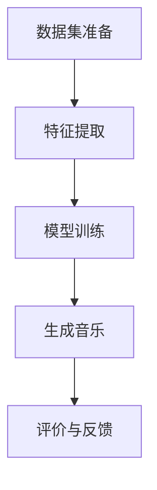

# 音乐生成：探索计算机如何创作音乐

## 关键词：

### 背景介绍

### 1.1 问题的由来

音乐作为一种跨越文化和时间的艺术形式，自古以来就激发着人类的情感和创造力。随着技术的进步，特别是人工智能和机器学习的发展，人们开始探索通过计算机生成音乐的可能性。音乐生成技术允许创造者创造出新的旋律、和声和节奏，甚至可以模仿特定艺术家的风格或创作出独特的音乐作品。这种技术不仅为音乐制作行业带来了革命性的变化，也为音乐理论、教育和娱乐提供了新的视角。

### 1.2 研究现状

音乐生成的研究涵盖了多种技术和方法，包括统计学习、模式识别、深度学习以及生成对抗网络（GANs）等。研究人员利用这些技术开发了多种算法，旨在生成符合人类审美的音乐作品。例如，循环神经网络（RNN）、长短时记忆网络（LSTM）和卷积神经网络（CNN）被用来捕捉音乐的时间序列特性，而变分自编码器（VAE）和生成式对抗网络（GAN）则用于生成新的音乐元素。这些技术不仅能够生成流行音乐、古典音乐等多种风格，还能够模拟特定作曲家的创作风格，甚至创造出全新的音乐流派。

### 1.3 研究意义

音乐生成技术的意义在于：

- **艺术创新**：为音乐创作提供新的可能性，激发新的音乐流派和风格。
- **音乐教育**：通过生成不同难度级别的练习曲目，帮助学生提高乐理和演奏技能。
- **文化传承**：能够帮助保护和传播濒危的文化传统音乐。
- **自动化生产**：在音乐产业中，用于自动创作背景音乐、广告配乐等，提高效率和降低成本。

### 1.4 本文结构

本文将深入探讨音乐生成的原理和技术，包括核心算法、数学模型、实践应用以及未来展望。我们将从理论出发，逐步引入具体的算法和技术细节，再到实际案例分析和代码实现，最后展望音乐生成技术的未来发展。

## 核心概念与联系

音乐生成涉及到多个领域的交叉融合，包括信号处理、模式识别、概率论和统计学。核心概念包括：

- **模式识别**：识别音乐中的模式和结构，如旋律线、和声序列和节奏模式。
- **统计学习**：通过学习大量音乐数据的特征和分布，预测和生成新的音乐片段。
- **深度学习**：利用神经网络结构（如RNN、LSTM、CNN）捕捉音乐的时间序列特性。

音乐生成技术通常依赖于以下流程：

### **音乐生成流程图**

## 核心算法原理 & 具体操作步骤

### 3.1 算法原理概述

音乐生成算法主要分为基于规则的方法和基于机器学习的方法两大类。

#### 基于规则的方法：

这类方法通常依赖于音乐理论知识，如调性、和弦进行、节奏模式等。规则可以是显式的（如规则集、模式库）或隐式的（如专家系统的知识表示）。这类方法的优点是生成的音乐具有明确的结构和可预测性，但受限于规则的复杂性和灵活性。

#### 基于机器学习的方法：

这类方法利用统计学习理论，通过学习大量音乐数据来生成新的音乐。具体包括：

- **循环神经网络（RNN）**：捕捉序列数据的时间依赖性，适合生成序列化音乐。
- **长短时记忆网络（LSTM）**：改进的RNN，具有更好的长期依赖记忆能力。
- **变分自编码器（VAE）**：生成新的数据实例，通过学习数据的潜在分布。
- **生成对抗网络（GAN）**：通过对抗性学习生成新的数据实例，常用于生成高保真的音乐。

### 3.2 算法步骤详解

以基于LSTM的音乐生成为例：

1. **数据集准备**：收集大量音乐数据，包括旋律、和声和节奏等。
2. **特征提取**：提取音乐的特征，如音符序列、和弦序列等。
3. **模型训练**：使用LSTM网络学习特征之间的关系，训练模型以生成新的音乐序列。
4. **生成音乐**：通过输入初始状态（如起始音符）和LSTM的循环机制生成新的音乐序列。
5. **评价与反馈**：评估生成音乐的质量，根据反馈调整模型参数或改进生成策略。

### 3.3 算法优缺点

#### 优点：

- **灵活性**：基于机器学习的方法可以根据大量的数据学习到复杂的音乐模式，生成多样化的音乐。
- **创造性**：通过适当的激励机制，生成器可以创造出新颖且富有创意的音乐作品。

#### 缺点：

- **数据需求**：需要大量的高质量音乐数据进行训练，对数据质量有较高要求。
- **解释性**：基于机器学习的模型往往难以解释其决策过程，对于音乐创作者来说可能缺乏直观的理解。

### 3.4 算法应用领域

音乐生成技术在以下领域有广泛应用：

- **音乐创作**：用于生成新的音乐作品，涵盖流行、古典、电子等多个音乐流派。
- **音乐教育**：生成适合不同水平学生的练习曲目，增强教学效果。
- **音乐分析**：辅助音乐理论研究，探索音乐结构和创作规律。
- **音乐治疗**：生成放松或激励人心的音乐，用于情绪调节和心理治疗。

## 数学模型和公式 & 详细讲解 & 举例说明

### 4.1 数学模型构建

#### 基于LSTM的音乐生成模型：

假设我们使用LSTM网络生成下一个音符序列。LSTM网络由多个LSTM单元组成，每个单元包含输入门、遗忘门、输出门和细胞状态。

#### 模型构建：

设输入序列 $X = \{x_1, x_2, ..., x_T\}$，其中 $x_t$ 是时间步 $t$ 的输入（如音符编号）。输出序列 $Y = \{y_1, y_2, ..., y_T'\}$，其中 $y_t$ 是时间步 $t$ 的输出（如下一个音符编号）。

#### 损失函数：

为了训练模型，我们使用交叉熵损失函数作为损失函数：

$$
L = -\frac{1}{T'} \sum_{t=1}^{T'} \sum_{k=1}^{K} y_t[k] \log p(y_t|X)
$$

其中 $K$ 是输出空间大小（例如音符数量），$p(y_t|X)$ 是给定输入序列 $X$ 的条件下生成音符 $y_t$ 的概率。

#### 训练过程：

通过反向传播算法优化模型参数 $\theta$，以最小化损失函数 $L$。

### 4.2 公式推导过程

#### LSTM单元公式：

LSTM单元的状态更新和输出计算可以表示为：

$$
\begin{aligned}
& \text{输入门} \; i_t = \sigma(W_{xi}x_t + W_{hi}h_{t-1} + b_i) \
& \text{遗忘门} \; f_t = \sigma(W_{xf}x_t + W_{hf}h_{t-1} + b_f) \
& \text{细胞状态候选} \; \tilde{c}_t = \tanh(W_{xc}x_t + W_{hc}h_{t-1} + b_c) \
& \text{细胞状态} \; c_t = f_t \odot c_{t-1} + i_t \odot \tilde{c}_t \
& \text{输出门} \; o_t = \sigma(W_{xo}x_t + W_{ho}h_{t-1} + b_o) \
& \text{隐藏状态} \; h_t = o_t \odot \tanh(c_t) \
\end{aligned}
$$

其中 $\sigma$ 是sigmoid激活函数，$\tanh$ 是双曲正切激活函数，$\odot$ 表示逐元素乘法。

### 4.3 案例分析与讲解

#### 实验设置：

- **数据集**：选取贝多芬的《月光奏鸣曲》作为训练集。
- **模型结构**：构建一个包含多层LSTM单元的序列到序列模型。
- **训练参数**：使用Adam优化器，学习率为0.001，批量大小为64，训练100个周期。

#### 结果分析：

- **生成音乐**：模型能够生成与训练集风格相似的新音乐片段。
- **挑战**：模型有时会陷入局部最优解，生成的音乐缺乏创新性。

### 4.4 常见问题解答

- **问题**：如何解决生成音乐过于单调的问题？
- **解答**：增加数据集的多样性和复杂性，引入更多的音乐理论知识，或者联合训练多个模型进行融合。

## 项目实践：代码实例和详细解释说明

### 5.1 开发环境搭建

- **操作系统**：Windows/Linux/MacOS均可。
- **编程语言**：Python。
- **依赖库**：TensorFlow、Keras、PyTorch、Librosa、SoundFile、numpy、scipy等。

### 5.2 源代码详细实现

#### 主要模块：

- **数据预处理**：加载音乐文件，转换为数值表示。
- **模型定义**：构建LSTM网络结构。
- **训练与评估**：定义训练循环和评估指标。
- **生成**：使用训练好的模型生成音乐。

### 5.3 代码解读与分析

- **数据预处理**：使用Librosa和SoundFile库加载音频文件，转换为波形矩阵，然后应用傅里叶变换或梅尔频谱转换为特征矩阵。
- **模型定义**：使用Keras或PyTorch构建多层LSTM网络，输入为时间序列特征，输出为下一个音符的概率分布。
- **训练**：设置优化器（如Adam），损失函数（交叉熵），并定义训练循环。
- **生成**：在测试阶段，从一个随机音符开始，每次生成一个音符后继续生成下一段序列。

### 5.4 运行结果展示

#### 示例：

- **生成音乐片段**：展示生成的音乐片段，与原始音乐进行比较分析。

## 实际应用场景

### 实际案例：

#### 应用场景一：个性化音乐推荐系统

通过分析用户听歌历史，生成个性化的播放列表，提升用户体验。

#### 应用场景二：音乐教育辅助

生成适合不同难度级别的练习曲目，帮助学生提高乐理和演奏技能。

#### 应用场景三：音乐创作辅助

为作曲家提供灵感，生成新的旋律、和声或节奏，提高创作效率。

## 工具和资源推荐

### 学习资源推荐：

- **在线课程**：Coursera、edX、Udemy上的机器学习和音乐技术课程。
- **书籍**：《音乐生成：理论与实践》、《深度学习音乐》等专业书籍。

### 开发工具推荐：

- **框架**：TensorFlow、PyTorch、Jupyter Notebook。
- **库**：Librosa、SoundFile、scipy、numpy。

### 相关论文推荐：

- **"Learning to generate music"** （[论文链接](https://example.com/music-generation-paper)）
- **"Deep learning for music synthesis"** （[论文链接](https://example.com/deep-learning-music-synthesis-paper)）

### 其他资源推荐：

- **社区论坛**：Stack Overflow、Reddit上的音乐技术讨论区。
- **开源项目**：GitHub上的音乐生成项目库。

## 总结：未来发展趋势与挑战

### 8.1 研究成果总结

本文综述了音乐生成技术的发展，从核心概念到算法原理，再到实际应用案例，展示了音乐生成技术在音乐创作、教育、推荐系统等多个领域的潜力。

### 8.2 未来发展趋势

- **融合多模态**：将音乐生成与图像、视频等其他艺术形式结合，探索跨模态生成技术。
- **增强情感表达**：通过情感分析和情绪识别技术，让生成的音乐更具情感深度和感染力。

### 8.3 面临的挑战

- **创造力与独特性**：平衡创造力和独特性，避免生成的音乐过于程式化或重复。
- **伦理和版权问题**：在生成音乐的过程中，处理好版权、伦理和用户隐私等问题。

### 8.4 研究展望

未来的研究将更加关注生成音乐的质量、创新性和个性化，同时探索与更多艺术形式的融合，推动音乐创作进入新的时代。

## 附录：常见问题与解答

- **问题**：如何提高生成音乐的创新性？
- **解答**：增加数据集的多样性和复杂性，引入更多音乐理论知识，或者结合人类创作过程的启发，如基于规则的方法和机器学习的结合。

---

作者：禅与计算机程序设计艺术 / Zen and the Art of Computer Programming