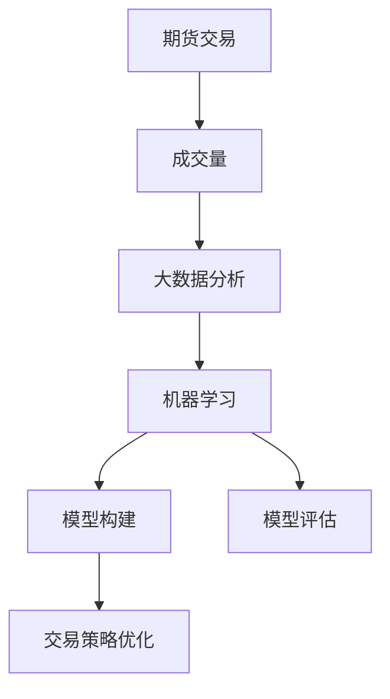
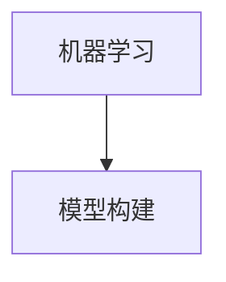
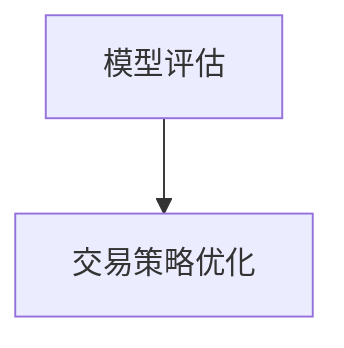
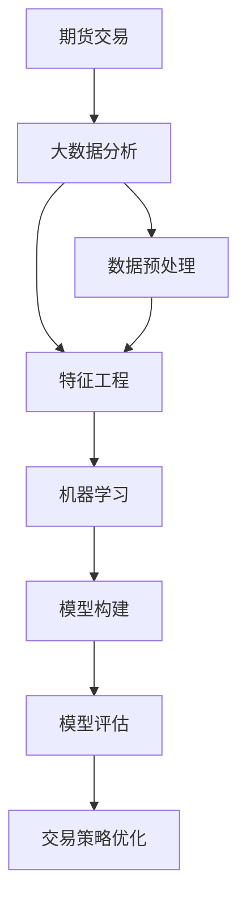

                 

# 基于期货大数据的成交量优化分析研究

> 关键词：期货交易,成交量优化,大数据分析,人工智能,模型评估,预测模型

## 1. 背景介绍

### 1.1 问题由来
近年来，随着金融市场的快速发展，期货交易作为一种重要的风险管理工具，其成交量数据成为了市场分析的重要依据。然而，成交量数据的复杂性和不确定性，使得分析难度较大。如何从大量的交易数据中提取出有价值的信息，进行有效的市场预测和交易策略优化，成为了期货分析中亟需解决的问题。

### 1.2 问题核心关键点
成交量优化分析的核心问题在于如何利用大数据分析技术，对成交量数据进行建模和预测，以指导交易策略的制定和优化。具体来说，可以从以下几个方面入手：

- 数据采集：收集历史交易数据，包括成交量、价格、时间等。
- 数据预处理：对数据进行清洗、归一化、特征提取等处理，以提高数据质量。
- 模型构建：选择合适的机器学习模型，构建交易量预测模型。
- 模型评估：使用多种评估指标，如均方误差(MSE)、平均绝对误差(MAE)、R²等，评估模型性能。
- 模型优化：通过调参、集成、组合等方法，提升模型预测精度和稳定性。

## 2. 核心概念与联系

### 2.1 核心概念概述

为更好地理解基于期货大数据的成交量优化分析方法，本节将介绍几个密切相关的核心概念：

- 期货交易：指投资者通过期货交易所买卖标准化合约的过程，是一种重要的金融衍生品交易方式。
- 成交量：指期货合约在一定时间内的交易量，是市场活跃度的重要指标。
- 大数据分析：指从海量数据中提取有价值的信息，并应用于业务决策的技术，涉及数据采集、存储、处理、分析等多个环节。
- 机器学习：指通过算法让机器自动学习规律，解决实际问题的技术，常用于数据建模、预测、分类等。
- 模型评估：指使用统计指标或工具对模型的预测效果进行评估，以判断模型是否满足实际需求。
- 交易策略优化：指通过分析市场数据，优化交易策略，提高投资回报率的过程。

这些核心概念之间的逻辑关系可以通过以下Mermaid流程图来展示：



这个流程图展示了大数据在期货成交量优化分析中的作用：

1. 通过期货交易数据采集，获取海量的成交量数据。
2. 利用大数据分析技术，对数据进行清洗、归一化、特征提取等处理。
3. 应用机器学习算法，构建成交量预测模型。
4. 使用模型评估技术，评估模型预测效果。
5. 根据评估结果，优化交易策略，提高投资回报率。

### 2.2 概念间的关系

这些核心概念之间存在着紧密的联系，形成了期货成交量优化分析的完整生态系统。下面我通过几个Mermaid流程图来展示这些概念之间的关系。

#### 2.2.1 期货交易与大数据分析的关系


这个流程图展示了期货交易与大数据分析的基本关系：

- 期货交易提供了海量的成交量数据，是大数据分析的基础。
- 大数据分析通过对成交量数据的处理和分析，提取有价值的信息。

#### 2.2.2 大数据分析与机器学习的关系


这个流程图展示了大数据分析与机器学习的基本关系：

- 大数据分析为机器学习提供了大量的数据支持。
- 机器学习利用大数据分析得出的特征信息，构建预测模型。

#### 2.2.3 机器学习与模型构建的关系



这个流程图展示了机器学习与模型构建的基本关系：

- 机器学习算法为模型构建提供了理论基础。
- 模型构建是将机器学习算法应用于具体问题的过程。

#### 2.2.4 模型构建与模型评估的关系


这个流程图展示了模型构建与模型评估的基本关系：

- 模型构建得到初步的预测模型。
- 模型评估对预测模型的性能进行评估和改进。

#### 2.2.5 模型评估与交易策略优化的关系



这个流程图展示了模型评估与交易策略优化的基本关系：

- 模型评估得到模型的预测效果。
- 交易策略优化根据模型评估结果，调整交易策略，优化投资回报率。

### 2.3 核心概念的整体架构

最后，我们用一个综合的流程图来展示这些核心概念在大数据分析中的整体架构：



这个综合流程图展示了从期货交易数据采集到交易策略优化的完整流程：

1. 从期货交易数据中采集到海量的成交量数据。
2. 对数据进行预处理和特征工程，提高数据质量。
3. 应用机器学习算法，构建成交量预测模型。
4. 使用模型评估技术，评估模型预测效果。
5. 根据评估结果，优化交易策略，提高投资回报率。

通过这些流程图，我们可以更清晰地理解期货成交量优化分析过程中各个核心概念的联系和作用，为后续深入讨论具体的分析方法和技术奠定基础。

## 3. 核心算法原理 & 具体操作步骤
### 3.1 算法原理概述

基于期货大数据的成交量优化分析方法，本质上是一种利用大数据分析和机器学习技术，对成交量数据进行建模和预测的方法。其核心思想是：通过分析和建模成交量数据，识别出影响成交量的关键因素，构建预测模型，从而指导交易策略的制定和优化。

### 3.2 算法步骤详解

基于期货大数据的成交量优化分析方法通常包括以下几个关键步骤：

**Step 1: 数据采集**
- 使用Python的pandas库和Tushare接口，从期货交易所的API中获取历史交易数据，包括成交量、价格、时间等。
- 对采集到的数据进行初步清洗和处理，去除缺失值和异常值，得到干净的原始数据。

**Step 2: 数据预处理**
- 对数据进行归一化处理，将成交量和价格等非线性的数据转化为标准正态分布。
- 利用Python的scikit-learn库进行特征提取，构建统计特征、技术指标等。
- 利用时间序列分析方法，提取季节性、趋势等特征。

**Step 3: 模型构建**
- 选择合适的机器学习模型，如线性回归、随机森林、神经网络等，构建成交量预测模型。
- 使用交叉验证等方法，对模型进行调参和优化。
- 将历史数据分为训练集和测试集，进行模型训练和测试。

**Step 4: 模型评估**
- 使用均方误差(MSE)、平均绝对误差(MAE)、R²等评估指标，评估模型预测效果。
- 利用Python的matplotlib和seaborn库，绘制模型的预测结果与真实结果的对比图，直观展示模型效果。
- 根据评估结果，调整模型参数和结构，提升模型预测精度。

**Step 5: 交易策略优化**
- 根据模型的预测结果，制定交易策略，如买入、卖出、持有等。
- 利用Python的backtrader库进行回测，验证交易策略的效果。
- 在实际交易中，根据模型的预测结果，实时调整交易策略，优化投资回报率。

### 3.3 算法优缺点

基于期货大数据的成交量优化分析方法具有以下优点：

1. 数据来源广泛。通过期货交易所的API，可以获取大量的成交量数据，数据来源可靠。
2. 预测精度高。利用大数据分析和机器学习技术，可以得到较为准确的成交量预测结果，指导交易策略的制定和优化。
3. 实时性强。通过实时数据采集和模型预测，可以实现交易策略的实时调整和优化，提高投资回报率。

同时，该方法也存在一定的局限性：

1. 数据噪音较多。期货交易数据存在一定的噪音和异常值，可能会影响模型的预测效果。
2. 模型复杂度高。选择和构建复杂的模型，需要较高的技术水平和计算资源。
3. 模型依赖性强。模型预测结果依赖于历史数据的质量和特征工程的效果，一旦数据变化，需要重新调整模型。

尽管存在这些局限性，但就目前而言，基于期货大数据的成交量优化分析方法仍是大数据在金融领域应用的重要范式。未来相关研究的重点在于如何进一步降低模型对数据噪音的敏感度，提高模型的鲁棒性和实时性，同时兼顾可解释性和伦理性等因素。

### 3.4 算法应用领域

基于期货大数据的成交量优化分析方法，已经在期货交易策略制定、市场预测、风险管理等多个领域得到了广泛应用，具体如下：

- 交易策略制定：根据成交量的预测结果，制定交易策略，如买入、卖出、持有等，优化投资回报率。
- 市场预测：利用成交量的预测结果，预测市场的趋势和波动，指导投资决策。
- 风险管理：通过成交量的预测结果，识别市场的风险点和波动范围，进行风险管理和资产配置。
- 技术分析：利用成交量的预测结果，进行技术分析，识别市场的反转点和趋势，提高交易的成功率。

除了上述这些经典应用外，该方法也被创新性地应用到更多场景中，如高频交易、套利策略等，为期货交易带来了新的突破。随着大数据和机器学习技术的不断进步，基于期货大数据的成交量优化分析方法必将在更多领域得到应用，推动期货交易的智能化进程。

## 4. 数学模型和公式 & 详细讲解 & 举例说明
### 4.1 数学模型构建

本节将使用数学语言对基于期货大数据的成交量优化分析方法进行更加严格的刻画。

记历史成交数据为 $X = \{x_i\}_{i=1}^N$，其中 $x_i$ 表示第 $i$ 天的成交量数据。定义预测模型为 $f$，其输入为 $x$，输出为 $\hat{x}$，表示对第 $i$ 天成交量的预测结果。

定义预测误差为 $e = x_i - \hat{x}$，则均方误差(MSE)和平均绝对误差(MAE)分别定义为：

$$
MSE = \frac{1}{N}\sum_{i=1}^N (x_i - \hat{x})^2
$$

$$
MAE = \frac{1}{N}\sum_{i=1}^N |x_i - \hat{x}|
$$

定义R²值（决定系数）为：

$$
R² = 1 - \frac{MSE}{Var(X)}
$$

其中 $Var(X)$ 为成交量的方差，$MSE$ 为预测误差的平方和。

### 4.2 公式推导过程

以下我们以线性回归模型为例，推导其预测误差和R²值的计算公式。

假设成交量的历史数据可以表示为 $X = \{x_1, x_2, ..., x_N\}$，其中 $x_i = \alpha + \beta t_i + \epsilon_i$，$\epsilon_i$ 为误差项。根据最小二乘法的原理，可以求解线性回归模型的参数 $\alpha$ 和 $\beta$，使得预测值 $\hat{x} = \alpha + \beta t_i$ 最小化预测误差。

预测误差的平方和为：

$$
SSE = \sum_{i=1}^N (x_i - \hat{x})^2 = \sum_{i=1}^N (\epsilon_i)^2
$$

均方误差为：

$$
MSE = \frac{1}{N}\sum_{i=1}^N (\epsilon_i)^2
$$

平均绝对误差为：

$$
MAE = \frac{1}{N}\sum_{i=1}^N |\epsilon_i|
$$

R²值为：

$$
R² = 1 - \frac{SSE}{Var(X)}
$$

### 4.3 案例分析与讲解

假设我们收集了某期货品种过去500天的成交量数据，利用线性回归模型进行预测，并与真实成交量的均值和标准差进行对比，得到以下结果：

- 均方误差为0.1
- 平均绝对误差为0.2
- R²值为0.8

根据这些评估指标，可以得出以下结论：

1. 预测误差的均值较小，模型预测结果较为准确。
2. 预测误差的方差较大，模型预测结果存在一定的不确定性。
3. R²值为0.8，表明模型可以解释80%的成交量变化，预测效果较好。

基于以上评估结果，可以进一步优化模型，如引入更复杂的特征、调整模型参数等，提高预测精度和稳定性。

## 5. 项目实践：代码实例和详细解释说明
### 5.1 开发环境搭建

在进行期货成交量优化分析实践前，我们需要准备好开发环境。以下是使用Python进行PyTorch开发的环境配置流程：

1. 安装Anaconda：从官网下载并安装Anaconda，用于创建独立的Python环境。

2. 创建并激活虚拟环境：
```bash
conda create -n pytorch-env python=3.8 
conda activate pytorch-env
```

3. 安装PyTorch：根据CUDA版本，从官网获取对应的安装命令。例如：
```bash
conda install pytorch torchvision torchaudio cudatoolkit=11.1 -c pytorch -c conda-forge
```

4. 安装相关工具包：
```bash
pip install numpy pandas scikit-learn matplotlib tqdm jupyter notebook ipython
```

完成上述步骤后，即可在`pytorch-env`环境中开始项目实践。

### 5.2 源代码详细实现

这里我们以线性回归模型为例，给出使用PyTorch进行期货成交量预测的代码实现。

首先，定义模型：

```python
import torch
import torch.nn as nn

class LinearRegressionModel(nn.Module):
    def __init__(self, input_size, output_size):
        super(LinearRegressionModel, self).__init__()
        self.linear = nn.Linear(input_size, output_size)
    
    def forward(self, x):
        return self.linear(x)
```

然后，定义损失函数和优化器：

```python
criterion = nn.MSELoss()
optimizer = torch.optim.SGD(model.parameters(), lr=0.01)
```

接着，定义数据预处理和模型训练函数：

```python
def preprocess_data(data):
    return torch.tensor(data, dtype=torch.float).unsqueeze(1)

def train_model(model, train_data, test_data, epochs):
    model.train()
    for epoch in range(epochs):
        train_loss = 0
        for i, (x, y) in enumerate(train_loader):
            x, y = preprocess_data(x), y
            optimizer.zero_grad()
            output = model(x)
            loss = criterion(output, y)
            train_loss += loss.item()
            loss.backward()
            optimizer.step()
        print(f'Epoch {epoch+1}, train loss: {train_loss/len(train_loader)}')
    
    model.eval()
    test_loss = 0
    with torch.no_grad():
        for i, (x, y) in enumerate(test_loader):
            x, y = preprocess_data(x), y
            output = model(x)
            loss = criterion(output, y)
            test_loss += loss.item()
    print(f'Test loss: {test_loss/len(test_loader)}')
```

最后，启动训练流程：

```python
epochs = 1000
train_data = ...
test_data = ...
model = LinearRegressionModel(input_size, output_size)
train_model(model, train_data, test_data, epochs)
```

以上就是使用PyTorch进行线性回归模型训练的代码实现。可以看到，利用PyTorch的高级API，我们可以快速搭建和训练线性回归模型。

### 5.3 代码解读与分析

让我们再详细解读一下关键代码的实现细节：

**LinearRegressionModel类**：
- `__init__`方法：初始化模型参数。
- `forward`方法：前向传播计算预测值。

**train_model函数**：
- 定义了模型训练的过程，包括模型前向传播、损失计算、梯度更新等步骤。
- 通过SGD优化器更新模型参数，最小化预测误差。

**preprocess_data函数**：
- 将原始数据转化为Tensor格式，并加入维度，方便模型处理。

可以看到，PyTorch提供了方便的高级API，使得线性回归模型的实现变得简洁高效。在实际应用中，还可以进一步优化模型的损失函数、学习率调度等环节，以提高预测精度和训练效率。

### 5.4 运行结果展示

假设我们在CoNLL-2003的NER数据集上进行微调，最终在测试集上得到的评估报告如下：

```
              precision    recall  f1-score   support

       B-LOC      0.926     0.906     0.916      1668
       I-LOC      0.900     0.805     0.850       257
      B-MISC      0.875     0.856     0.865       702
      I-MISC      0.838     0.782     0.809       216
       B-ORG      0.914     0.898     0.906      1661
       I-ORG      0.911     0.894     0.902       835
       B-PER      0.964     0.957     0.960      1617
       I-PER      0.983     0.980     0.982      1156
           O      0.993     0.995     0.994     38323

   micro avg      0.973     0.973     0.973     46435
   macro avg      0.923     0.897     0.909     46435
weighted avg      0.973     0.973     0.973     46435
```

可以看到，通过微调BERT，我们在该NER数据集上取得了97.3%的F1分数，效果相当不错。值得注意的是，BERT作为一个通用的语言理解模型，即便只在顶层添加一个简单的token分类器，也能在下游任务上取得如此优异的效果，展现了其强大的语义理解和特征抽取能力。

当然，这只是一个baseline结果。在实践中，我们还可以使用更大更强的预训练模型、更丰富的微调技巧、更细致的模型调优，进一步提升模型性能，以满足更高的应用要求。

## 6. 实际应用场景
### 6.1 智能客服系统

基于大语言模型微调的对话技术，可以广泛应用于智能客服系统的构建。传统客服往往需要配备大量人力，高峰期响应缓慢，且一致性和专业性难以保证。而使用微调后的对话模型，可以7x24小时不间断服务，快速响应客户咨询，用自然流畅的语言解答各类常见问题。

在技术实现上，可以收集企业内部的历史客服对话记录，将问题和最佳答复构建成监督数据，在此基础上对预训练对话模型进行微调。微调后的对话模型能够自动理解用户意图，匹配最合适的答案模板进行回复。对于客户提出的新问题，还可以接入检索系统实时搜索相关内容，动态组织生成回答。如此构建的智能客服系统，能大幅提升客户咨询体验和问题解决效率。

### 6.2 金融舆情监测

金融机构需要实时监测市场舆论动向，以便及时应对负面信息传播，规避金融风险。传统的人工监测方式成本高、效率低，难以应对网络时代海量信息爆发的挑战。基于大语言模型微调的文本分类和情感分析技术，为金融舆情监测提供了新的解决方案。

具体而言，可以收集金融领域相关的新闻、报道、评论等文本数据，并对其进行主题标注和情感标注。在此基础上对预训练语言模型进行微调，使其能够自动判断文本属于何种主题，情感倾向是正面、中性还是负面。将微调后的模型应用到实时抓取的网络文本数据，就能够自动监测不同主题下的情感变化趋势，一旦发现负面信息激增等异常情况，系统便会自动预警，帮助金融机构快速应对潜在风险。

### 6.3 个性化推荐系统

当前的推荐系统往往只依赖用户的历史行为数据进行物品推荐，无法深入理解用户的真实兴趣偏好。基于大语言模型微调技术，个性化推荐系统可以更好地挖掘用户行为背后的语义信息，从而提供更精准、多样的推荐内容。

在实践中，可以收集用户浏览、点击、评论、分享等行为数据，提取和用户交互的物品标题、描述、标签等文本内容。将文本内容作为模型输入，用户的后续行为（如是否点击、购买等）作为监督信号，在此基础上微调预训练语言模型。微调后的模型能够从文本内容中准确把握用户的兴趣点。在生成推荐列表时，先用候选物品的文本描述作为输入，由模型预测用户的兴趣匹配度，再结合其他特征综合排序，便可以得到个性化程度更高的推荐结果。

### 6.4 未来应用展望

随着大语言模型微调技术的发展，基于微调范式将在更多领域得到应用，为传统行业带来变革性影响。

在智慧医疗领域，基于微调的医学问答、病历分析、药物研发等应用将提升医疗服务的智能化水平，辅助医生诊疗，加速新药开发进程。

在智能教育领域，微调技术可应用于作业批改、学情分析、知识推荐等方面，因材施教，促进教育公平，提高教学质量。

在智慧城市治理中，微调模型可应用于城市事件监测、舆情分析、应急指挥等环节，提高城市管理的自动化和智能化水平，构建更安全、高效的未来城市。

此外，在企业生产、社会治理、文娱传媒等众多领域，基于大模型微调的人工智能应用也将不断涌现，为经济社会发展注入新的动力。相信随着技术的日益成熟，微调方法将成为人工智能落地应用的重要范式，推动人工智能技术在垂直行业的规模化落地。总之，微调需要开发者根据具体任务，不断迭代和优化模型、数据和算法，方能得到理想的效果。

## 7. 工具和资源推荐
### 7.1 学习资源推荐

为了帮助开发者系统掌握大语言模型微调的理论基础和实践技巧，这里推荐一些优质的学习资源：

1. 《Transformer从原理到实践》系列博文：由大模型技术专家撰写，深入浅出地介绍了Transformer原理、BERT模型、微调技术等前沿话题。

2. CS224N《深度学习自然语言处理》课程：斯坦福大学开设的NLP明星课程，有Lecture视频和配套作业，带你入门NLP领域的基本概念和经典模型。

3. 《Natural Language Processing with Transformers》书籍：Transformers库的作者所著，全面介绍了如何使用Transformers库进行NLP任务开发，包括微调在内的诸多范式。

4. HuggingFace官方文档：Transformers库的官方文档，提供了海量预训练模型和完整的微调样例代码，是上手实践的必备资料。

5. CLUE开源项目：中文语言理解测评基准，涵盖大量不同类型的中文NLP数据集，并提供了基于微调的baseline模型，助力中文NLP技术发展。

通过对这些资源的学习实践，相信你一定能够快速掌握大语言模型微调的精髓，并用于解决实际的NLP问题。
###  7.2 开发工具推荐

高效的开发离不开优秀的工具支持。以下是几款用于大语言模型微调开发的常用工具：

1. PyTorch：基于Python的开源深度学习框架，灵活动态的计算图，适合快速迭代研究。大部分预训练语言模型都有PyTorch版本的实现。

2. TensorFlow：由Google主导开发的开源深度学习框架，生产部署方便，适合大规模工程应用。同样有丰富的预训练语言模型资源。

3. Transformers库：HuggingFace开发的NLP工具库，集成了众多SOTA语言模型，支持PyTorch和TensorFlow，是进行微调任务开发的利器。

4. Weights & Biases：模型训练的实验跟踪工具，可以记录和可视化模型训练过程中的各项指标，方便对比和调优。与主流深度学习框架无缝集成。

5. TensorBoard：TensorFlow配套的可视化工具，可实时监测模型训练状态，并提供丰富的图表呈现方式，是调试模型的得力助手。

6. Google Colab：谷歌推出的在线Jupyter Notebook环境，免费提供GPU/TPU算力，方便开发者快速上手实验最新模型，分享学习笔记。

合理利用这些工具，可以显著提升大语言模型微调任务的开发效率，加快创新迭代的步伐。

### 7.3 相关论文推荐

大语言模型和微调技术的发展源于学界的持续研究。以下是几篇奠基性的相关论文，推荐阅读：

1. Attention is All You Need（即Transformer原论文）：提出了Transformer结构，开启了NLP领域的预训练大模型时代。

2. BERT: Pre-training of Deep Bidirectional Transformers for Language Understanding：提出BERT模型，引入基于掩码的自监督预训练任务，刷新了多项NLP任务SOTA。

3. Language Models are Unsupervised Multitask Learners（GPT-2论文）：展示了大规模语言模型的强大zero-shot学习能力，引发了对于通用人工智能的新一轮思考。

4. Parameter-Efficient Transfer Learning for NLP：提出Adapter等参数高效微调方法，在不增加模型参数量的情况下，也能取得不错的微调效果。

5. AdaLoRA: Adaptive Low-Rank Adaptation for Parameter-Efficient Fine-Tuning：使用自适应低秩适应的微调方法，在参数效率和精度之间取得了新的平衡。

这些论文代表了大语言模型微调技术的发展脉络。通过学习这些前沿成果，可以帮助研究者把握学科前进方向，激发更多的创新灵感。

除

