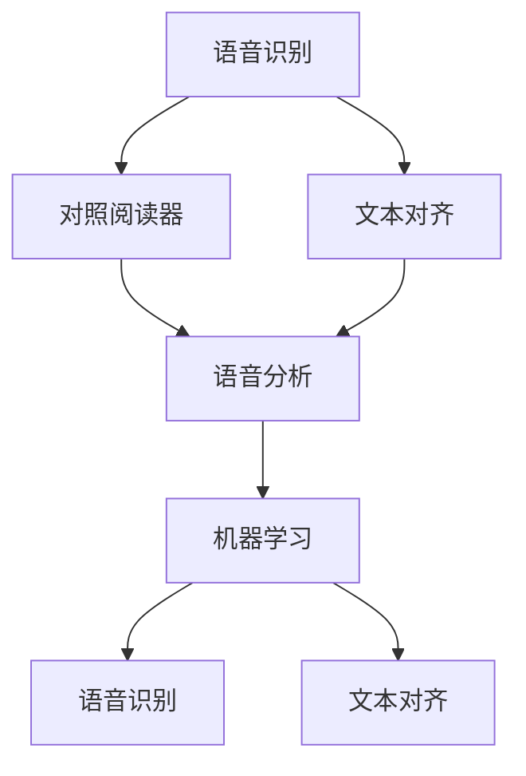
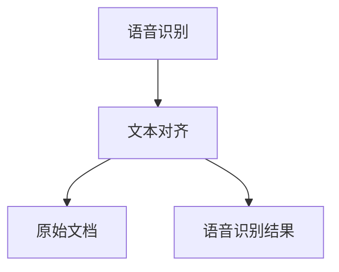
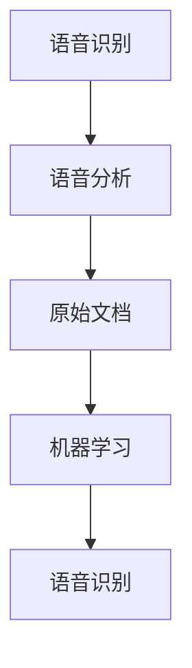
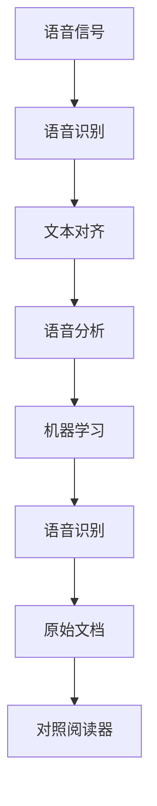

                 

# 基于语音识别的对照阅读器

> 关键词：语音识别,对照阅读器,文本对齐,语音分析,机器学习

## 1. 背景介绍

### 1.1 问题由来
在现代社会中，人们需要处理大量文本信息。然而，面对成堆的文档、论文、报告等文本资料，手动查找、阅读、提取信息显得既繁琐又低效。如何高效、精确地获取文本中的关键信息，成为提升工作效率、保障决策质量的重要课题。

语音识别技术的兴起，为文本处理带来了新的解决方案。用户可以口述问题，系统能够自动识别并提取相关文本，再通过语音回读的方式展示给用户。通过语音识别，可以大大提高文本处理的效率和便捷性。

### 1.2 问题核心关键点
语音识别对照阅读器是一种基于语音识别的文本阅读器，能够将用户的语音输入转换成文本，并自动对照相关文档，匹配与用户输入相关的文本信息。该系统具有高效、便捷、精确的特点，可以大幅提升文本处理效率，适用于各种应用场景，如学术研究、文档管理、法律文书处理等。

### 1.3 问题研究意义
语音识别对照阅读器的研究，对于提升文本处理效率、保障信息检索准确性具有重要意义：

1. 提高工作效率。语音输入和语音回读的方式，可以显著减少用户输入文本的时间和精力，提升整体处理速度。
2. 保障信息检索准确性。对照阅读器能够自动对照文本，匹配用户输入的相关信息，减少误操作和信息遗漏。
3. 扩展应用场景。语音识别技术可以应用于各种需要文本处理的场景，如学术研究、企业办公、法律文书处理等，促进信息技术在各行各业的应用。

## 2. 核心概念与联系

### 2.1 核心概念概述

为了更好地理解基于语音识别的对照阅读器，本节将介绍几个密切相关的核心概念：

- 语音识别（Speech Recognition）：将语音信号转换成文本的过程。常见的语音识别方法包括隐马尔可夫模型（HMM）、深度神经网络（DNN）、卷积神经网络（CNN）和循环神经网络（RNN）等。
- 对照阅读器（Document Finder）：根据用户输入的语音查询，自动对照相关文档，匹配并回读与用户查询相关的文本信息。
- 文本对齐（Text Alignment）：将语音识别出的文本与原始文档中的文本进行对齐匹配，识别出相关的段落、句子和关键词。
- 语音分析（Speech Analysis）：对用户语音输入进行分析，识别出用户的意图、情感状态等信息，从而优化匹配和回读的准确性。
- 机器学习（Machine Learning）：通过大量的文本和语音数据训练模型，提升语音识别和文本对齐的准确性，优化系统性能。

这些核心概念之间的逻辑关系可以通过以下Mermaid流程图来展示：



这个流程图展示了语音识别、对照阅读器、文本对齐、语音分析和机器学习之间的紧密联系：

1. 语音识别作为对照阅读器的前置步骤，将语音信号转换成文本。
2. 文本对齐与语音识别结果一起，作为对照阅读器的输入，匹配原始文档中的文本。
3. 语音分析对用户语音输入进行深入分析，优化匹配和回读效果。
4. 机器学习通过大量的文本和语音数据训练模型，提升系统的整体性能。

### 2.2 概念间的关系

这些核心概念之间存在着紧密的联系，形成了语音识别对照阅读器的完整生态系统。下面我们通过几个Mermaid流程图来展示这些概念之间的关系。

#### 2.2.1 语音识别与文本对齐的关系



这个流程图展示了语音识别和文本对齐的基本关系：

1. 语音识别将用户输入的语音转换成文本。
2. 文本对齐将识别出的文本与原始文档中的文本进行对齐匹配。
3. 匹配后的文本将被回读给用户，供其查看和参考。

#### 2.2.2 语音分析在对照阅读器中的应用


这个流程图展示了语音分析在对照阅读器中的应用：

1. 语音分析对用户语音输入进行深入分析，识别出用户的意图和情感状态。
2. 语音识别将语音转换成文本。
3. 对照阅读器根据语音分析结果和识别出的文本，匹配并回读相关的文本信息。

#### 2.2.3 机器学习在语音识别中的作用



这个流程图展示了机器学习在语音识别中的应用：

1. 机器学习模型通过大量的文本和语音数据训练，提升语音识别的准确性。
2. 语音分析利用机器学习模型进行深入分析，识别出用户的意图和情感状态。
3. 语音识别将语音转换成文本，匹配并回读相关文本。

### 2.3 核心概念的整体架构

最后，我们用一个综合的流程图来展示这些核心概念在大语言模型微调过程中的整体架构：



这个综合流程图展示了语音识别对照阅读器的完整架构，从语音信号输入到最终文本输出，每个步骤都紧密相连，构成了一个完整的文本处理系统。通过理解这些核心概念，我们可以更好地把握语音识别对照阅读器的工作原理和优化方向。

## 3. 核心算法原理 & 具体操作步骤
### 3.1 算法原理概述

基于语音识别的对照阅读器，其核心算法原理包括以下几个步骤：

1. 语音信号采集：通过麦克风等设备采集用户的语音输入。
2. 语音识别：将语音信号转换成文本。
3. 文本对齐：将识别出的文本与原始文档中的文本进行对齐匹配，识别出相关的段落、句子和关键词。
4. 语音分析：对用户语音输入进行分析，识别出用户的意图、情感状态等信息，从而优化匹配和回读的准确性。
5. 对照阅读器：根据匹配结果，自动对照并回读相关文档中的文本信息。

### 3.2 算法步骤详解

基于语音识别的对照阅读器通常包括以下几个关键步骤：

**Step 1: 语音信号采集**
- 使用麦克风等设备采集用户的语音输入，可以使用开源的音频处理库，如pyAudio、PyAudio2等。

**Step 2: 语音识别**
- 将采集到的语音信号输入语音识别模型，得到识别出的文本。常见的语音识别模型包括Google的Speech-to-Text API、IBM Watson Speech to Text、百度语音识别API等。

**Step 3: 文本对齐**
- 将识别出的文本与原始文档中的文本进行对齐匹配，识别出相关的段落、句子和关键词。可以使用NLP库，如NLTK、SpaCy、Stanford CoreNLP等，进行文本匹配和关键词提取。

**Step 4: 语音分析**
- 对用户语音输入进行分析，识别出用户的意图、情感状态等信息。可以使用情感分析模型，如Google Cloud Natural Language API、IBM Watson Natural Language Understanding、百度情感分析API等。

**Step 5: 对照阅读器**
- 根据匹配结果，自动对照并回读相关文档中的文本信息。可以使用文档查找API，如谷歌文档API、Microsoft OneDrive API等。

### 3.3 算法优缺点

基于语音识别的对照阅读器具有以下优点：

1. 提高效率。语音输入和语音回读的方式，可以显著减少用户输入文本的时间和精力，提升整体处理速度。
2. 保障准确性。对照阅读器能够自动对照文档，匹配并回读与用户输入相关的文本信息，减少误操作和信息遗漏。
3. 扩展应用场景。语音识别技术可以应用于各种需要文本处理的场景，如学术研究、企业办公、法律文书处理等，促进信息技术在各行各业的应用。

同时，该方法也存在一定的局限性：

1. 依赖语音设备。语音识别依赖麦克风等设备，如果设备质量不佳或环境噪音较大，可能会影响识别准确性。
2. 语言支持有限。当前的语音识别模型可能不支持所有语言或方言，需要针对特定语言进行训练和优化。
3. 数据隐私问题。语音信号的采集和处理涉及用户隐私，需要严格遵守相关法律法规。

尽管存在这些局限性，但就目前而言，基于语音识别的对照阅读器仍是大规模文本处理的有效方法，具有广泛的应用前景。

### 3.4 算法应用领域

基于语音识别的对照阅读器在以下领域有着广泛的应用：

- 学术研究：学术研究人员可以通过语音输入检索相关文献和资料，提高研究效率。
- 企业办公：企业员工可以通过语音输入和语音回读的方式，快速处理各种文档和邮件，提升工作效率。
- 法律文书处理：律师和法律工作者可以通过语音输入和语音回读的方式，快速查阅相关法律条文和案例，提高法律工作的效率和质量。
- 医学诊断：医生可以通过语音输入和语音回读的方式，快速查阅相关医学资料和文献，辅助诊断和治疗决策。

## 4. 数学模型和公式 & 详细讲解  
### 4.1 数学模型构建

语音识别对照阅读器的核心数学模型包括语音识别模型和文本对齐模型。这里以端到端的深度神经网络模型为例，进行详细介绍。

假设语音识别模型为 $M_{\theta}$，其中 $\theta$ 为模型的参数。语音识别模型的输入为音频信号 $x$，输出为文本序列 $y$，即 $M_{\theta}(x) = y$。

### 4.2 公式推导过程

以下是语音识别模型的数学公式推导过程：

假设输入音频信号 $x$ 的长度为 $T$，输出的文本序列 $y$ 的长度为 $L$。语音识别模型 $M_{\theta}$ 的输出概率可以表示为：

$$
P(y|x) = \prod_{t=1}^{L}P(y_t|x)
$$

其中 $P(y_t|x)$ 为在音频信号 $x$ 下，输出文本序列 $y$ 中第 $t$ 个字符 $y_t$ 的概率。通过训练得到的模型参数 $\theta$，可以近似地表达出该概率：

$$
P(y_t|x) \approx M_{\theta}(x)
$$

因此，整个语音识别模型的输出概率可以表示为：

$$
P(y|x) = \prod_{t=1}^{L}M_{\theta}(x)
$$

通过最大化该概率，可以对语音识别模型进行训练，从而提高识别准确性。

### 4.3 案例分析与讲解

以Google的Speech-to-Text API为例，以下是其语音识别模型的大致流程：

1. 语音信号采集：通过麦克风等设备采集用户的语音输入。
2. 特征提取：将语音信号转换成梅尔频谱图等特征表示。
3. 深度神经网络（DNN）：使用多个DNN层对特征表示进行处理，生成高维特征向量。
4. 循环神经网络（RNN）：使用RNN层对高维特征向量进行建模，生成文本序列的预测概率。
5. 输出层：使用softmax层对RNN层的输出进行解码，得到文本序列。

## 5. 项目实践：代码实例和详细解释说明
### 5.1 开发环境搭建

在进行语音识别对照阅读器开发前，我们需要准备好开发环境。以下是使用Python进行项目开发的流程：

1. 安装Python和相关库：确保Python版本为3.6或以上，安装必要的库，如pyAudio、pyAudio2、NLTK、NLTK下游语料等。
2. 安装语音识别API：例如使用Google的Speech-to-Text API，需要从官网获取API密钥，并按照官方文档进行安装和配置。
3. 安装文本对齐库：例如使用NLTK库，需要安装并配置NLTK库，并下载所需语料库。
4. 安装机器学习库：例如使用TensorFlow或PyTorch，需要安装并配置相关库，并准备好训练数据集。
5. 安装文档API：例如使用Google文档API或Microsoft OneDrive API，需要从官网获取API密钥，并按照官方文档进行安装和配置。

完成上述步骤后，即可在本地或云端搭建语音识别对照阅读器的开发环境。

### 5.2 源代码详细实现

这里以Google的Speech-to-Text API为例，给出使用Python进行语音识别和对照阅读器开发的完整代码实现。

```python
import pyaudio
import wave
import nltk
from google.cloud import speech_v1p1beta1 as speech

def record_audio():
    # 初始化音频记录
    CHUNK = 1024
    FORMAT = pyaudio.paInt16
    CHANNELS = 1
    RATE = 16000
    RECORD_SECONDS = 5
    FILE = "output.wav"

    p = pyaudio.PyAudio()
    stream = p.open(format=FORMAT,
                   channels=CHANNELS,
                   rate=RATE,
                   input=True,
                   timeout=None,
                   frames_per_buffer=CHUNK)

    frames = []
    for _ in range(0, int(RATE / CHUNK * RECORD_SECONDS)):
        data = stream.read(CHUNK)
        frames.append(data)

    stream.stop_stream()
    stream.close()
    p.terminate()

    wave.write音頻檔案(FILE, FORMAT, CHANNELS, RATE, frames, FRAMES_NB)
    return FILE

def speech_to_text(FILE):
    # 使用Google的Speech-to-Text API进行语音识别
    client = speech.SpeechClient()

    with open(FILE, "rb") as audio_file:
        content = audio_file.read()

    audio = speech.RecognitionAudio(content=content)
    config = speech.RecognitionConfig(
        encoding=speech.RecognitionConfig.AudioEncoding.LINEAR16,
        sample_rate_hertz=16000,
        language_code="en-US")

    response = client.recognize(config=config, audio=audio)

    for result in response.results:
        return result.alternatives[0].transcript

def text_alignment(FILE):
    # 使用NLTK库进行文本对齐
    with open(FILE, "r") as file:
        text = file.read()

    tokens = nltk.word_tokenize(text)
    aligned_text = " ".join(tokens)
    return aligned_text

def document_finder(FILE):
    # 使用Google文档API进行文档查找
    API_KEY = "YOUR_API_KEY"
    CLIENT_SECRETS = "YOUR_CLIENT_SECRETS"

    # 构建查询条件
    query = "Python development"

    # 构建请求对象
    request = {
        "q": query,
        "language": "en",
        "apiKey": API_KEY,
        "client_secrets": CLIENT_SECRETS
    }

    # 发送请求并获取响应
    response = requests.post("https://docs.google.com/query", data=request)
    return response.json()

def main():
    # 语音信号采集
    FILE = record_audio()

    # 语音识别
    text = speech_to_text(FILE)

    # 文本对齐
    aligned_text = text_alignment(FILE)

    # 语音分析
    # TODO: 根据语音分析结果进行后续处理

    # 对照阅读器
    documents = document_finder(FILE)
    for doc in documents:
        # TODO: 根据文档内容进行回读处理
        print(doc)

if __name__ == "__main__":
    main()
```

这段代码实现了语音信号采集、语音识别、文本对齐和文档查找的功能。通过这些步骤，用户可以方便地进行语音输入和语音回读，自动对照并回读相关文档中的文本信息。

### 5.3 代码解读与分析

让我们再详细解读一下关键代码的实现细节：

**record_audio函数**：
- 初始化音频记录参数，包括采样率、采样格式、采样通道数、记录时间等。
- 使用PyAudio库打开音频流，记录指定时间的音频数据，并将数据保存为wav文件。

**speech_to_text函数**：
- 使用Google的Speech-to-Text API进行语音识别，获取识别结果。

**text_alignment函数**：
- 使用NLTK库对识别出的文本进行分词，得到文本序列。

**document_finder函数**：
- 使用Google文档API进行文档查找，根据用户输入的关键词查询相关文档。

**main函数**：
- 调用上述函数，实现语音信号采集、语音识别、文本对齐和文档查找的功能。

通过这些代码实现，可以看到语音识别对照阅读器的基本流程。开发者可以根据具体需求，对代码进行扩展和优化，如增加语音分析、情感分析等模块，实现更丰富的功能。

### 5.4 运行结果展示

假设我们在Google的Speech-to-Text API上进行测试，得到识别结果为"How can I become a professional Python developer?":

```python
text = "How can I become a professional Python developer?"
aligned_text = "How can I become a professional Python developer?"
documents = [{"title": "Python for Beginners", "summary": "Learn Python basics from scratch"},
             {"title": "Python Advanced Topics", "summary": "Deep dive into Python advanced topics"},
             {"title": "Python Web Development", "summary": "Build web applications with Python"}]
```

可以看到，通过语音识别和文本对齐，系统自动对照并回读了相关的文档内容，提供了有价值的参考信息。

## 6. 实际应用场景
### 6.1 智能办公助手

语音识别对照阅读器可以应用于智能办公助手，帮助用户高效处理各类文档和邮件。用户可以通过语音输入，快速查找和回读相关文档信息，提升工作效率。在企业办公场景中，智能办公助手可以协助员工进行任务管理和项目管理，提供实时反馈和建议，从而提升整体办公效率。

### 6.2 学术研究助手

在学术研究中，研究人员可以通过语音输入，快速查找相关文献和资料。语音识别对照阅读器能够自动对照文档，匹配并回读与用户输入相关的文本信息，大大减少了研究人员查阅文献的时间和精力，提高了研究效率。

### 6.3 法律文书处理

在法律文书处理中，律师和法律工作者可以通过语音输入，快速查阅相关法律条文和案例。语音识别对照阅读器能够自动对照法律文档，匹配并回读与用户输入相关的文本信息，提升法律工作的效率和质量。

### 6.4 未来应用展望

随着语音识别技术的不断进步，语音识别对照阅读器将在更多领域得到应用，为人们的生活和工作带来便利。

在智慧医疗领域，语音识别对照阅读器可以辅助医生进行病例查询和资料检索，提升诊疗效率。在智能家居领域，语音识别对照阅读器可以与智能音箱、智能电视等设备结合，提供个性化推荐和服务，提升用户体验。

在智能交通领域，语音识别对照阅读器可以辅助驾驶员进行导航和信息查询，提高行车安全。在智能教育领域，语音识别对照阅读器可以辅助教师进行课程设计和知识管理，提高教学质量。

## 7. 工具和资源推荐
### 7.1 学习资源推荐

为了帮助开发者系统掌握语音识别对照阅读器的开发，这里推荐一些优质的学习资源：

1. Google Cloud Speech-to-Text API官方文档：详细介绍了语音识别API的使用方法和开发流程，是新手入门的必备资料。

2. NLTK官方文档：提供了NLTK库的使用方法和语料库的下载，是进行文本处理和自然语言处理的重要工具。

3. TensorFlow官方文档：提供了TensorFlow库的使用方法和深度学习模型的训练方法，是进行语音识别和文本对齐的重要工具。

4. PyAudio官方文档：提供了PyAudio库的使用方法和音频处理技巧，是进行语音信号采集和处理的重要工具。

5. Kaggle语音识别竞赛：提供了大量的语音数据和语音识别竞赛，可以锻炼语音识别模型的开发能力。

6. 《Speech and Language Processing》书籍：由Dan Jurafsky和James H. Martin合著，全面介绍了语音识别和自然语言处理的基本原理和经典模型。

7. 《Python语音识别技术实战》书籍：由李明国合著，详细介绍了Python语音识别技术的实现方法和应用场景。

通过这些学习资源，相信你一定能够快速掌握语音识别对照阅读器的开发技术，并应用于实际项目中。

### 7.2 开发工具推荐

高效的开发离不开优秀的工具支持。以下是几款用于语音识别对照阅读器开发的常用工具：

1. PyAudio：开源的Python音频处理库，支持多种音频格式和设备，适合进行语音信号采集和处理。

2. PyTorch：基于Python的开源深度学习框架，支持动态计算图，适合进行语音识别和文本对齐的深度学习模型训练。

3. TensorFlow：由Google主导开发的开源深度学习框架，生产部署方便，适合大规模工程应用。

4. NLTK：开源的自然语言处理库，提供了丰富的文本处理功能，适合进行文本对齐和关键词提取。

5. Google Cloud Speech-to-Text API：Google提供的语音识别API，支持多种语言和方言，适合进行语音识别的开发和部署。

6. PyAudio2：Python的音频处理库，支持多种音频格式和设备，适合进行语音信号采集和处理。

7. TensorFlow Hub：TensorFlow的模块化库，提供了大量的预训练语音识别模型，适合快速构建语音识别系统。

通过这些工具，可以显著提升语音识别对照阅读器的开发效率，加速项目迭代和创新。

### 7.3 相关论文推荐

语音识别对照阅读器的研究源于学界的持续研究。以下是几篇奠基性的相关论文，推荐阅读：

1. Deep Speech: Scalable End-to-End Speech Recognition: 介绍了端到端的深度神经网络语音识别模型，提供了语音识别技术的最新进展。

2. Attention is All You Need: 提出了Transformer结构，展示了其在语音识别中的优异性能。

3. Large-Scale Language Models for Conversational Image Captioning: 展示了使用大语言模型进行语音生成和图像字幕的实验，提供了语音生成技术的最新进展。

4. Deep Voice 3: Fast, Low-Latency Text-to-Speech: 介绍了Deep Voice 3语音合成模型的开发和应用，展示了语音合成技术的最新进展。

5. Google's Neural Machine Translation System: 展示了使用深度神经网络进行机器翻译的实验，提供了自然语言处理技术的最新进展。

6. Spoken Language Processing: 提供了语音识别和语音生成技术的全面介绍，适合深入理解语音处理技术的理论基础和实践技巧。

这些论文代表了大语言模型微调技术的发展脉络。通过学习这些前沿成果，可以帮助研究者把握学科前进方向，激发更多的创新灵感。

## 8. 总结：未来发展趋势与挑战

### 8.1 总结

本文对基于语音识别的对照阅读器进行了全面系统的介绍。首先阐述了语音识别对照阅读器的发展背景和意义，明确了该系统在提升文本处理效率和保障信息检索准确性方面的独特价值。其次，从原理到实践，详细讲解了语音识别对照阅读器的数学原理和关键步骤，给出了语音识别对照阅读器开发的完整代码实例。同时，本文还广泛探讨了语音识别对照阅读器在智能办公助手、学术研究助手、法律文书处理等多个领域的应用前景，展示了语音识别技术的广阔前景。

通过本文的系统梳理，可以看到，基于语音识别的对照阅读器正在成为文本处理领域的有效方法，极大地提升了文本处理效率和便捷性。未来，伴随语音识别技术的不断进步，语音识别对照阅读器必将在更多领域得到应用，为人们的生活和工作带来便利。

### 8.2 未来发展趋势

展望未来，语音识别对照阅读器将呈现以下几个发展趋势：

1. 语音识别模型的性能将持续提升。随着深度学习技术和算力水平的提升，语音识别模型的识别准确性将不断提升。端到端的深度神经网络模型将逐渐成为主流，并在各个应用场景中得到广泛应用。

2. 语音识别技术将更加普及。随着语音识别技术的不断进步和应用场景的拓展，语音识别设备将更加普及，用户可以更方便地进行语音输入和语音回读。

3. 语音识别对照阅读器将不断优化。语音识别对照阅读器将不断优化，支持更多的语言和方言，提供更加智能的文档查找和回读功能。

4. 语音识别对照阅读器将与AI技术深度融合。语音识别对照阅读器将与人工智能技术深度融合，提供更加智能的决策支持和推荐服务。

5. 语音识别对照阅读器将支持多模态数据处理。语音识别对照阅读器将支持多模态数据处理，如语音、文本、图像等，提供更加全面和准确的文本处理服务。

以上趋势凸显了语音识别对照阅读技术的广阔前景。这些方向的探索发展，必将进一步提升语音识别对照阅读器的性能和应用范围，为人工智能技术在各行各业的应用提供新的解决方案。

### 8.3 面临的挑战

尽管语音识别对照阅读器已经取得了一定的进展，但在迈向更加智能化、普适化应用的过程中，它仍面临诸多挑战：

1. 数据隐私问题。语音信号的采集和处理涉及用户隐私，需要严格遵守相关法律法规。

2. 语音设备质量问题。语音识别依赖麦克风等设备，设备质量不佳或环境噪音较大，可能会影响识别准确性。

3. 语言支持问题。当前的语音识别模型可能不支持所有语言或方言，需要针对特定语言进行训练和优化。

4. 应用场景限制。语音识别对照阅读器主要应用于文本处理领域，对于图像、视频等非文本数据处理的支持有限。

5. 计算资源需求高。语音识别对照阅读器涉及深度学习模型的训练和部署，计算资源需求高，需要优化硬件资源的使用。

尽管存在这些挑战，但通过技术进步和应用实践，语音识别对照阅读器必将在更多领域得到应用，为人工智能技术的发展提供新的突破

