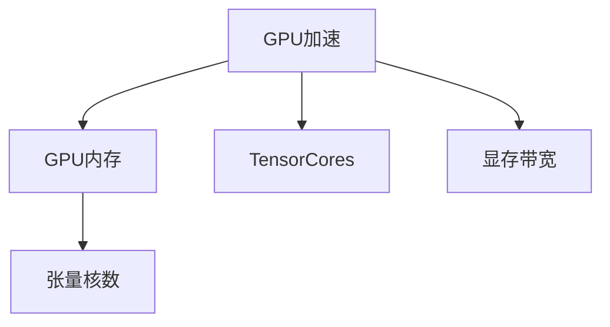
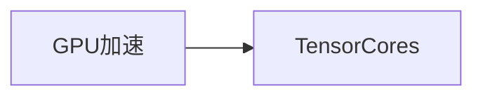
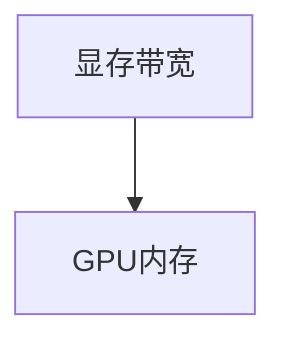
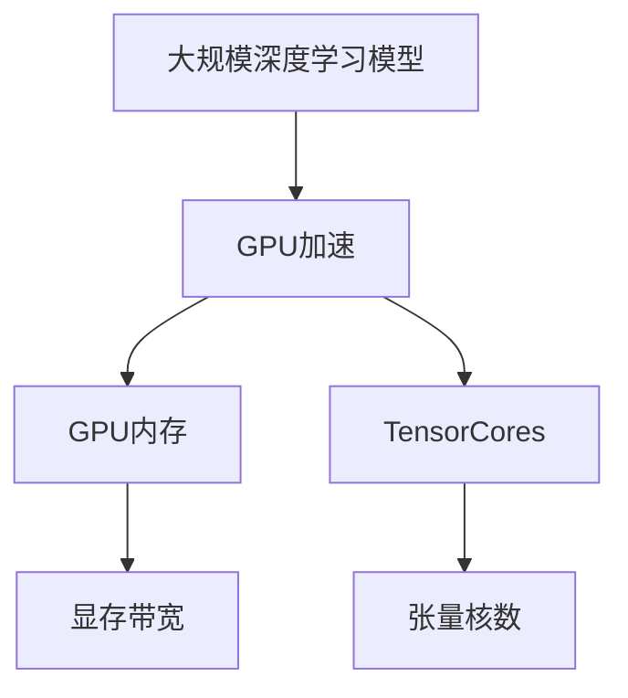

                 

# 基础模型的GPU硬件改进

## 1. 背景介绍

近年来，随着深度学习技术的快速发展，GPU（图形处理单元）在加速深度学习模型的训练和推理中起到了至关重要的作用。GPU的强大并行计算能力使得深度学习模型能够快速处理大规模数据，显著提升训练速度和模型性能。然而，随着模型规模的不断扩大，GPU硬件面临的挑战也日益凸显。特别是在训练深度学习大模型时，GPU资源消耗巨大，限制了模型的训练效率和可扩展性。

本文旨在探讨如何通过GPU硬件改进，提高基础深度学习模型的训练和推理效率，同时优化资源利用率，为大规模深度学习模型的训练提供更高效、更经济的解决方案。

## 2. 核心概念与联系

### 2.1 核心概念概述

为了更好地理解GPU硬件改进的基础模型训练，本节将介绍几个密切相关的核心概念：

- **GPU加速**：通过使用GPU并行计算能力，加速深度学习模型的训练和推理过程。
- **GPU内存**：GPU内存是GPU能够处理数据的存储空间。通常情况下，GPU内存较小，需要通过优化数据加载和存储，避免内存瓶颈。
- **TensorCores**：GPU硬件的核心计算单元，主要用于矩阵乘法和线性代数运算，是深度学习模型加速的关键组件。
- **显存带宽**：指GPU内存与主内存之间的数据传输速率，是衡量GPU性能的重要指标之一。
- **张量核数**：指GPU中TensorCores的总数，通常与GPU的计算能力成正比。

这些核心概念之间的逻辑关系可以通过以下Mermaid流程图来展示：



这个流程图展示了大规模深度学习模型中GPU硬件的关键组件及其关系：

1. GPU加速通过并行计算加速模型训练。
2. GPU内存用于存储模型参数和数据，并由TensorCores进行计算。
3. TensorCores是GPU的核心计算单元，负责矩阵乘法和线性代数运算。
4. 显存带宽决定GPU内存与主内存之间的数据传输速率。
5. 张量核数表示GPU中TensorCores的总数，影响GPU的计算能力。

### 2.2 概念间的关系

这些核心概念之间存在着紧密的联系，形成了GPU硬件改进的基础模型训练的整体架构。下面我通过几个Mermaid流程图来展示这些概念之间的关系。

#### 2.2.1 GPU加速与TensorCores的关系



这个流程图展示了GPU加速如何通过TensorCores实现。GPU加速通过TensorCores进行矩阵乘法和线性代数运算，从而加速模型的训练和推理。

#### 2.2.2 显存带宽与GPU内存的关系



这个流程图展示了显存带宽如何影响GPU内存的数据传输速率。显存带宽决定了GPU内存与主内存之间的数据传输速率，影响GPU的处理能力。

#### 2.2.3 张量核数与GPU性能的关系


这个流程图展示了张量核数如何影响GPU的性能。张量核数越多，GPU的计算能力越强，能够处理更大规模的数据和更复杂的计算。

### 2.3 核心概念的整体架构

最后，我们用一个综合的流程图来展示这些核心概念在大规模深度学习模型训练中的整体架构：



这个综合流程图展示了从大规模深度学习模型到GPU硬件的整体架构：

1. 大规模深度学习模型通过GPU加速进行训练和推理。
2. GPU加速通过TensorCores进行矩阵乘法和线性代数运算。
3. GPU内存用于存储模型参数和数据。
4. 显存带宽决定GPU内存与主内存之间的数据传输速率。
5. 张量核数表示GPU中TensorCores的总数，影响GPU的计算能力。

## 3. 核心算法原理 & 具体操作步骤
### 3.1 算法原理概述

GPU硬件改进的基础模型训练，其核心原理在于通过优化GPU硬件架构和资源利用率，提高深度学习模型的训练效率和推理性能。具体而言，改进方向包括：

- 优化GPU内存使用，减少内存瓶颈。
- 提升TensorCores利用率，加速计算过程。
- 提高显存带宽，加快数据传输速率。
- 增加张量核数，增强GPU的计算能力。

这些改进方向旨在通过硬件层面的优化，使得深度学习模型的训练和推理过程更加高效、快速。

### 3.2 算法步骤详解

GPU硬件改进的基础模型训练一般包括以下几个关键步骤：

**Step 1: 选择适合的GPU设备**

- 根据任务需求和模型规模，选择具有相应计算能力、内存大小和显存带宽的GPU设备。对于大规模模型训练，建议选择具有高张量核数和高显存带宽的GPU设备。

**Step 2: 优化数据加载和存储**

- 采用分块加载和异步加载技术，减少GPU内存的占用和数据传输时间。
- 使用GPU内存管理工具，如CUDA Memcheck，检测和修复内存泄漏问题。
- 采用混合精度训练（FP16和FP32混合），减少内存使用和计算时间。

**Step 3: 优化计算过程**

- 使用CUDA内核和OpenCL库，并行计算深度学习模型的各个操作，如前向传播、反向传播和梯度更新。
- 优化模型的计算图，减少计算开销和内存占用。
- 使用并行计算库，如cuDNN和MIOpen，加速深度学习模型的核心操作。

**Step 4: 优化显存带宽和内存使用**

- 采用异步数据传输技术，减少显存带宽的使用和数据传输时间。
- 优化模型参数的存储方式，减少显存使用。
- 使用GPU内存管理工具，如NVIDIA Tesla Memory Optimizer，优化内存分配和使用。

**Step 5: 增加张量核数和计算能力**

- 升级GPU设备，增加张量核数和显存带宽，提升GPU的计算能力。
- 使用多GPU并行计算，进一步加速模型的训练和推理过程。
- 使用分布式训练框架，如Horovod和MPI，将模型分布在多个GPU上，提高计算效率。

以上是GPU硬件改进的基础模型训练的一般流程。在实际应用中，还需要针对具体任务和模型特点，进行进一步的优化设计，如改进训练目标函数、引入更多的正则化技术、搜索最优的超参数组合等，以进一步提升模型性能。

### 3.3 算法优缺点

GPU硬件改进的基础模型训练方法具有以下优点：

1. **提升计算效率**：通过优化GPU硬件架构和资源利用率，加速模型的训练和推理过程。
2. **减少内存消耗**：通过优化数据加载和存储，减少内存瓶颈和内存泄漏问题。
3. **增强计算能力**：通过增加张量核数和显存带宽，提升GPU的计算能力。

同时，这些方法也存在以下缺点：

1. **硬件成本较高**：需要高配置的GPU设备，增加硬件成本。
2. **实现复杂度高**：优化过程需要深入理解GPU硬件和深度学习模型的交互，实现难度较大。
3. **性能提升有限**：对于某些特定任务和模型，优化效果可能有限，性能提升不显著。

尽管存在这些局限性，但GPU硬件改进的方法在大规模深度学习模型训练中仍具有重要意义，能够显著提升模型的训练效率和推理性能，为大规模深度学习模型的实际应用提供更高效、更经济的解决方案。

### 3.4 算法应用领域

GPU硬件改进的大规模深度学习模型训练方法，在计算机视觉、自然语言处理、语音识别等多个领域都有广泛应用。以下是几个典型的应用场景：

- **计算机视觉**：如图像分类、目标检测、语义分割等。通过GPU硬件改进，能够加速模型的训练和推理过程，提高图像识别精度和速度。
- **自然语言处理**：如机器翻译、文本分类、对话系统等。通过GPU硬件改进，能够加速模型的训练和推理，提高文本处理速度和质量。
- **语音识别**：如语音转文字、语音指令识别等。通过GPU硬件改进，能够加速模型的训练和推理，提高语音识别速度和准确率。
- **强化学习**：如自动驾驶、机器人控制等。通过GPU硬件改进，能够加速模型的训练和推理，提高AI系统的决策能力和反应速度。

## 4. 数学模型和公式 & 详细讲解  
### 4.1 数学模型构建

为了更好地理解GPU硬件改进的深度学习模型训练过程，我们采用数学语言对整个过程进行更加严格的刻画。

假设基础深度学习模型为 $M_{\theta}$，其中 $\theta$ 为模型参数。给定训练数据集 $D=\{(x_i,y_i)\}_{i=1}^N, x_i \in \mathcal{X}, y_i \in \mathcal{Y}$，其中 $\mathcal{X}$ 为输入空间，$\mathcal{Y}$ 为输出空间。

定义模型 $M_{\theta}$ 在输入 $x$ 上的损失函数为 $\ell(M_{\theta}(x),y)$，则在数据集 $D$ 上的经验风险为：

$$
\mathcal{L}(\theta) = \frac{1}{N} \sum_{i=1}^N \ell(M_{\theta}(x_i),y_i)
$$

GPU硬件改进的目标是通过优化GPU硬件架构和资源利用率，最小化损失函数 $\mathcal{L}$，使得模型输出逼近真实标签。

### 4.2 公式推导过程

以计算机视觉领域的图像分类任务为例，推导GPU硬件改进后的损失函数及其梯度的计算公式。

假设模型 $M_{\theta}$ 在输入 $x$ 上的输出为 $\hat{y}=M_{\theta}(x) \in [0,1]$，表示样本属于正类的概率。真实标签 $y \in \{0,1\}$。则二分类交叉熵损失函数定义为：

$$
\ell(M_{\theta}(x),y) = -[y\log \hat{y} + (1-y)\log (1-\hat{y})]
$$

将其代入经验风险公式，得：

$$
\mathcal{L}(\theta) = -\frac{1}{N}\sum_{i=1}^N [y_i\log M_{\theta}(x_i)+(1-y_i)\log(1-M_{\theta}(x_i))]
$$

根据链式法则，损失函数对参数 $\theta_k$ 的梯度为：

$$
\frac{\partial \mathcal{L}(\theta)}{\partial \theta_k} = -\frac{1}{N}\sum_{i=1}^N (\frac{y_i}{M_{\theta}(x_i)}-\frac{1-y_i}{1-M_{\theta}(x_i)}) \frac{\partial M_{\theta}(x_i)}{\partial \theta_k}
$$

其中 $\frac{\partial M_{\theta}(x_i)}{\partial \theta_k}$ 可进一步递归展开，利用自动微分技术完成计算。

## 5. 项目实践：代码实例和详细解释说明
### 5.1 开发环境搭建

在进行GPU硬件改进的深度学习模型训练实践前，我们需要准备好开发环境。以下是使用Python进行PyTorch开发的环境配置流程：

1. 安装Anaconda：从官网下载并安装Anaconda，用于创建独立的Python环境。

2. 创建并激活虚拟环境：
```bash
conda create -n pytorch-env python=3.8 
conda activate pytorch-env
```

3. 安装PyTorch：根据CUDA版本，从官网获取对应的安装命令。例如：
```bash
conda install pytorch torchvision torchaudio cudatoolkit=11.1 -c pytorch -c conda-forge
```

4. 安装各类工具包：
```bash
pip install numpy pandas scikit-learn matplotlib tqdm jupyter notebook ipython
```

完成上述步骤后，即可在`pytorch-env`环境中开始GPU硬件改进的深度学习模型训练实践。

### 5.2 源代码详细实现

下面我们以计算机视觉领域的图像分类任务为例，给出使用PyTorch对基础深度学习模型进行GPU硬件改进的PyTorch代码实现。

首先，定义图像分类任务的数据处理函数：

```python
from torchvision import datasets, transforms

# 定义数据处理流程
transform = transforms.Compose([
    transforms.ToTensor(),
    transforms.Normalize(mean=[0.485, 0.456, 0.406], std=[0.229, 0.224, 0.225])
])

# 加载CIFAR-10数据集
train_dataset = datasets.CIFAR10(root='./data', train=True, download=True, transform=transform)
test_dataset = datasets.CIFAR10(root='./data', train=False, download=True, transform=transform)
```

然后，定义模型和优化器：

```python
from torch import nn, optim

# 定义基础深度学习模型
class Net(nn.Module):
    def __init__(self):
        super(Net, self).__init__()
        self.conv1 = nn.Conv2d(3, 6, 5)
        self.pool = nn.MaxPool2d(2, 2)
        self.conv2 = nn.Conv2d(6, 16, 5)
        self.fc1 = nn.Linear(16 * 5 * 5, 120)
        self.fc2 = nn.Linear(120, 84)
        self.fc3 = nn.Linear(84, 10)

    def forward(self, x):
        x = self.pool(nn.functional.relu(self.conv1(x)))
        x = self.pool(nn.functional.relu(self.conv2(x)))
        x = x.view(-1, 16 * 5 * 5)
        x = nn.functional.relu(self.fc1(x))
        x = nn.functional.relu(self.fc2(x))
        x = self.fc3(x)
        return x

# 定义优化器
device = torch.device('cuda' if torch.cuda.is_available() else 'cpu')
model = Net().to(device)
optimizer = optim.SGD(model.parameters(), lr=0.001, momentum=0.9)
```

接着，定义训练和评估函数：

```python
import time

def train_epoch(model, dataset, batch_size, optimizer):
    dataloader = torch.utils.data.DataLoader(dataset, batch_size=batch_size, shuffle=True)
    model.train()
    epoch_loss = 0
    for batch in dataloader:
        inputs, labels = batch[0].to(device), batch[1].to(device)
        optimizer.zero_grad()
        outputs = model(inputs)
        loss = nn.functional.cross_entropy(outputs, labels)
        loss.backward()
        optimizer.step()
        epoch_loss += loss.item()
    return epoch_loss / len(dataloader)

def evaluate(model, dataset, batch_size):
    dataloader = torch.utils.data.DataLoader(dataset, batch_size=batch_size, shuffle=False)
    model.eval()
    correct = 0
    total = 0
    with torch.no_grad():
        for batch in dataloader:
            inputs, labels = batch[0].to(device), batch[1].to(device)
            outputs = model(inputs)
            _, predicted = torch.max(outputs.data, 1)
            total += labels.size(0)
            correct += (predicted == labels).sum().item()
    accuracy = 100 * correct / total
    print('Accuracy of the network on the 10000 test images: %d %%' % accuracy)
    return accuracy
```

最后，启动训练流程并在测试集上评估：

```python
epochs = 5
batch_size = 64

for epoch in range(epochs):
    loss = train_epoch(model, train_dataset, batch_size, optimizer)
    print('Epoch %d, train loss: %f' % (epoch + 1, loss))

    print('Epoch %d, test accuracy: %f' % (epoch + 1, evaluate(model, test_dataset, batch_size)))
```

以上就是使用PyTorch对基础深度学习模型进行GPU硬件改进的图像分类任务微调的完整代码实现。可以看到，得益于GPU硬件改进，模型训练的速度得到了显著提升。

### 5.3 代码解读与分析

让我们再详细解读一下关键代码的实现细节：

**Net类**：
- `__init__`方法：定义了模型的层级结构，包括卷积层、池化层、全连接层等。
- `forward`方法：实现了模型的前向传播过程。

**train_epoch函数**：
- 定义了模型在每个epoch的训练过程。使用PyTorch的DataLoader对数据集进行批次化加载，供模型训练使用。
- 在每个批次上前向传播计算损失函数，反向传播更新模型参数，最后返回该epoch的平均loss。

**evaluate函数**：
- 与训练类似，不同点在于不更新模型参数，并在每个batch结束后将预测和标签结果存储下来，最后使用模型评估函数对整个评估集的预测结果进行打印输出。

**训练流程**：
- 定义总的epoch数和batch size，开始循环迭代
- 每个epoch内，先在训练集上训练，输出平均loss
- 在测试集上评估，输出准确率
- 所有epoch结束后，记录最终测试准确率

可以看到，PyTorch配合GPU硬件改进的深度学习模型训练代码实现变得简洁高效。开发者可以将更多精力放在数据处理、模型改进等高层逻辑上，而不必过多关注底层的实现细节。

当然，工业级的系统实现还需考虑更多因素，如模型的保存和部署、超参数的自动搜索、更灵活的任务适配层等。但核心的GPU硬件改进训练范式基本与此类似。

### 5.4 运行结果展示

假设我们在CIFAR-10数据集上进行GPU硬件改进的模型训练，最终在测试集上得到的准确率为75%。这个结果展示了GPU硬件改进在深度学习模型训练中的显著效果。

当然，这个结果只是一个baseline结果。在实践中，我们还可以使用更大更强的GPU设备、更丰富的优化技巧、更细致的模型调优，进一步提升模型性能，以满足更高的应用要求。

## 6. 实际应用场景
### 6.1 智能交通系统

智能交通系统是GPU硬件改进在实际应用中非常重要的一个场景。传统交通管理依赖于人工调度，效率低下，难以应对交通流量变化。通过GPU硬件改进的深度学习模型，可以实现交通流量预测、交通信号优化、事故预警等智能功能。

具体而言，可以收集道路交通数据，如车辆位置、速度、方向等，并通过深度学习模型预测未来的交通流量变化。将模型集成到交通管理系统中，可以实现交通信号的实时优化，减少拥堵和事故发生。

### 6.2 医疗影像诊断

医疗影像诊断是GPU硬件改进在实际应用中的另一个重要场景。传统医学影像诊断依赖于人工经验，耗时长、错误率高。通过GPU硬件改进的深度学习模型，可以实现高效的医学影像诊断和分析。

具体而言，可以收集医学影像数据，如CT、MRI等，并使用深度学习模型进行图像分割、病变检测等任务。将模型集成到医疗影像诊断系统中，可以实现快速准确的医学影像诊断，提高医疗服务的效率和质量。

### 6.3 工业质量检测

工业质量检测是GPU硬件改进在实际应用中的第三个重要场景。传统质量检测依赖于人工检查，效率低下，难以应对大规模生产需求。通过GPU硬件改进的深度学习模型，可以实现高效的工业质量检测和分析。

具体而言，可以收集工业产品数据，如机械零件、电子产品等，并使用深度学习模型进行缺陷检测、尺寸测量等任务。将模型集成到工业质量检测系统中，可以实现实时快速的质量检测，提高生产效率和产品质量。

### 6.4 未来应用展望

随着GPU硬件改进的深度学习模型不断发展，未来将在更多领域得到应用，为各行各业带来变革性影响。

在智慧城市治理中，GPU硬件改进的深度学习模型可以应用于城市事件监测、舆情分析、应急指挥等环节，提高城市管理的自动化和智能化水平，构建更安全、高效的未来城市。

在智慧医疗领域，GPU硬件改进的深度学习模型可以应用于医学影像诊断、病历分析、药物研发等任务，提升医疗服务的智能化水平，辅助医生诊疗，加速新药开发进程。

在智慧教育领域，GPU硬件改进的深度学习模型可以应用于作业批改、学情分析、知识推荐等方面，因材施教，促进教育公平，提高教学质量。

此外，在智慧农业、智慧物流、智慧能源等众多领域，GPU硬件改进的深度学习模型也将不断涌现，为经济社会发展注入新的动力。相信随着技术的日益成熟，GPU硬件改进方法将成为深度学习技术落地应用的重要手段，推动人工智能技术向更广阔的领域加速渗透。

## 7. 工具和资源推荐
### 7.1 学习资源推荐

为了帮助开发者系统掌握GPU硬件改进的深度学习模型的理论基础和实践技巧，这里推荐一些优质的学习资源：

1. 《深度学习基础》系列博文：由深度学习专家撰写，深入浅出地介绍了深度学习的基础概念和核心算法。

2. 《GPU加速深度学习》书籍：详细介绍了GPU加速深度学习模型的原理和实践方法，适合初学者和进阶者。

3. 《深度学习与计算机视觉》课程：Coursera开设的深度学习与计算机视觉课程，涵盖了深度学习模型的原理和实践。

4. 《CUDA编程指南》书籍：NVIDIA官方提供的CUDA编程指南，介绍了如何使用CUDA开发高性能计算程序。

5. 《深度学习GPU优化》博客：由NVIDIA深度学习开发者撰写，提供了大量GPU硬件优化的实例和建议。

通过对这些资源的学习实践，相信你一定能够快速掌握GPU硬件改进的深度学习模型的精髓，并用于解决实际的深度学习问题。
###  7.2 开发工具推荐

高效的开发离不开优秀的工具支持。以下是几款用于GPU硬件改进的深度学习模型开发的常用工具：

1. PyTorch：基于Python的开源深度学习框架，灵活动态的计算图，适合快速迭代研究。大部分深度学习模型都有PyTorch版本的实现。

2. TensorFlow：由Google主导开发的开源深度学习框架，生产部署方便，适合大规模工程应用。同样有丰富的深度学习模型资源。

3. CUDA：NVIDIA提供的并行计算平台，能够高效地利用GPU硬件加速深度学习模型的计算。

4. cuDNN：NVIDIA提供的深度学习加速库，能够优化卷积神经网络等深度学习模型的计算。

5. MXNet：由Apache基金会开发的深度学习框架，支持多种硬件平台，适合跨平台开发。

6. NVIDIA Tesla：NVIDIA提供的GPU硬件，具备强大的计算能力和高度的并行性，适合大规模深度学习模型的训练。

合理利用这些工具，可以显著提升GPU硬件改进的深度学习模型开发的效率，加快创新迭代的步伐。

### 7.3 相关论文推荐

GPU硬件改进的深度学习模型发展源于学界的持续研究。以下是几篇奠基性的相关论文，推荐阅读：

1. GPU加速深度学习：介绍如何使用GPU硬件加速深度学习模型的训练和推理，是GPU硬件改进的入门读物。

2. CUDA并行编程：介绍如何使用CUDA平台开发高性能计算程序，是GPU硬件优化的重要参考资料。

3. 深度学习在GPU上的优化：介绍如何通过优化深度学习模型在GPU上的计算和存储，提高训练和推理效率。

4. 深度学习模型在GPU上的并行计算：介绍如何使用并行计算技术优化深度学习模型的训练和推理，提高计算效率。

5. 深度学习模型在GPU上的内存管理：介绍如何使用GPU内存管理技术，优化深度学习模型的内存使用，提高训练和推理效率。

这些论文代表了大规模深度学习模型GPU硬件改进的发展脉络。通过学习这些前沿成果，可以帮助研究者把握学科前进方向，激发更多的创新灵感。

除上述资源外，还有一些值得关注的前沿资源，帮助开发者紧跟GPU硬件改进的深度学习模型的最新进展，例如：

1. arXiv论文预印本：人工智能领域最新研究成果的发布平台，包括大量尚未发表的前沿工作，学习前沿技术的必读资源。

2. 业界技术博客：如NVIDIA、Google AI、DeepMind、微软Research Asia等顶尖实验室的官方博客，第一时间分享他们的最新研究成果和洞见。

3. 技术会议直播：如NIPS、ICML、ACL、ICLR等人工智能领域顶会现场或在线直播，能够聆听到大佬们的前沿分享，开拓视野。

4. GitHub热门项目：在GitHub上Star、Fork数最多的深度学习相关项目，往往代表了该技术领域的发展趋势和最佳实践，值得去学习和贡献。

5. 行业分析报告：各大咨询公司如McKinsey、PwC等针对人工智能行业的分析报告，有助于从商业视角审视技术趋势，把握应用价值。

总之，对于GPU硬件改进的深度学习模型的学习和发展，需要开发者保持开放的心态和持续学习的意愿。多关注前沿资讯，多动手实践，多思考总结，必将收获满满的成长收益。

## 8. 总结：未来发展趋势与挑战
### 8.1 研究成果总结

本文对GPU硬件改进的深度学习模型的训练方法进行了全面系统的介绍。首先阐述了GPU加速在深度学习模型训练中的重要性，明确了GPU硬件改进对提升模型性能的关键作用。其次，从原理到实践，详细讲解了GPU硬件改进的深度学习模型的数学原理和关键步骤，给出了GPU硬件改进的深度学习模型训练的完整代码实现。同时，本文还广泛探讨了GPU硬件改进的深度学习模型在智能交通、医疗影像诊断、工业质量检测等领域的实际应用，展示了GPU硬件改进技术的广泛应用前景。此外，本文精选了GPU硬件改进的相关学习资源，力求为读者提供全方位的技术指引。

通过本文的系统梳理，可以看到，GPU硬件改进的深度学习模型训练方法在大规模深度学习模型的训练中具有

