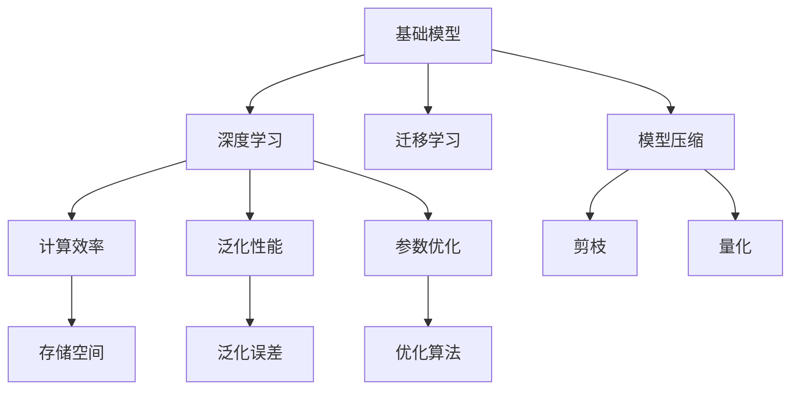
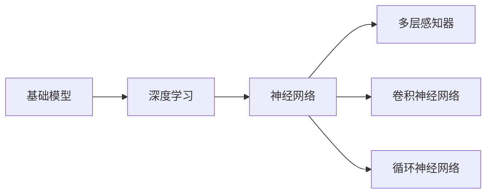
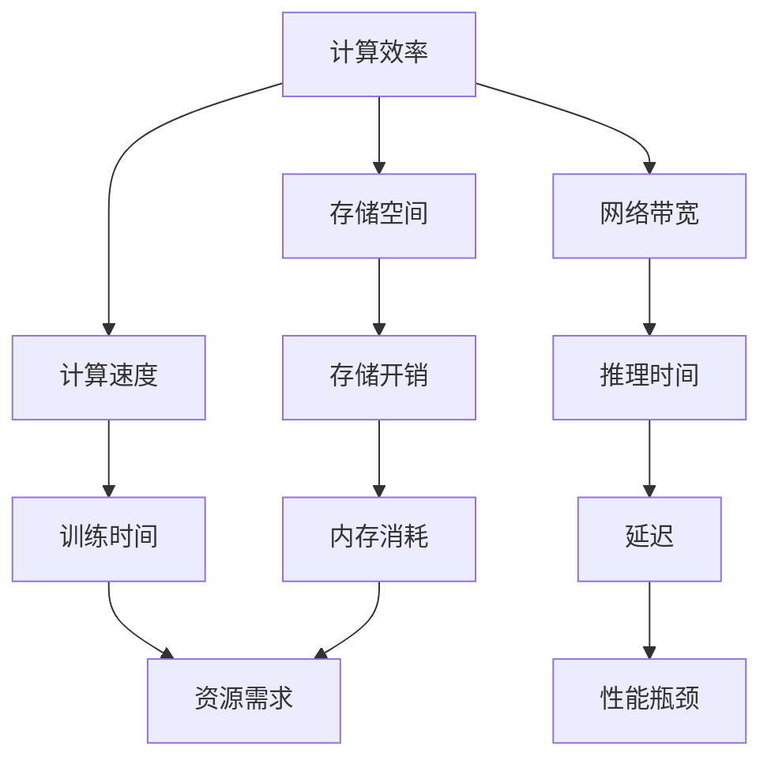
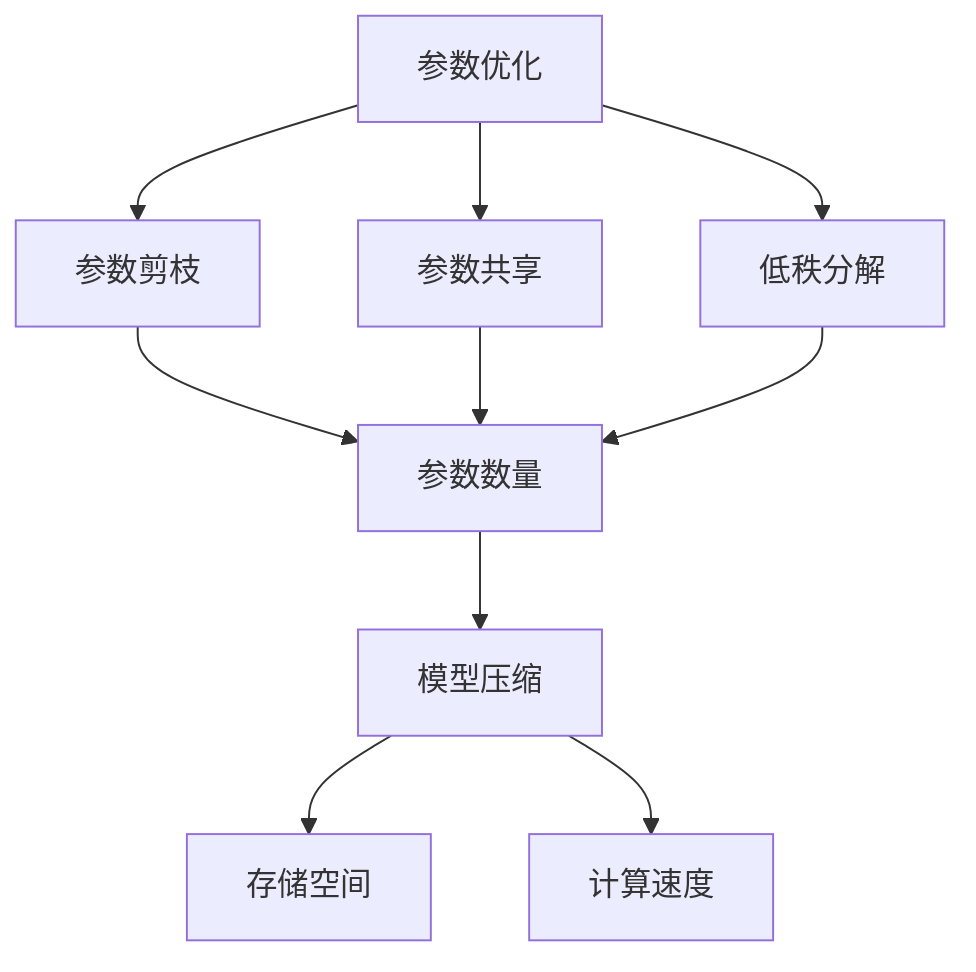
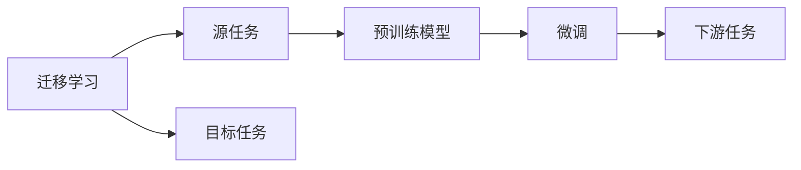
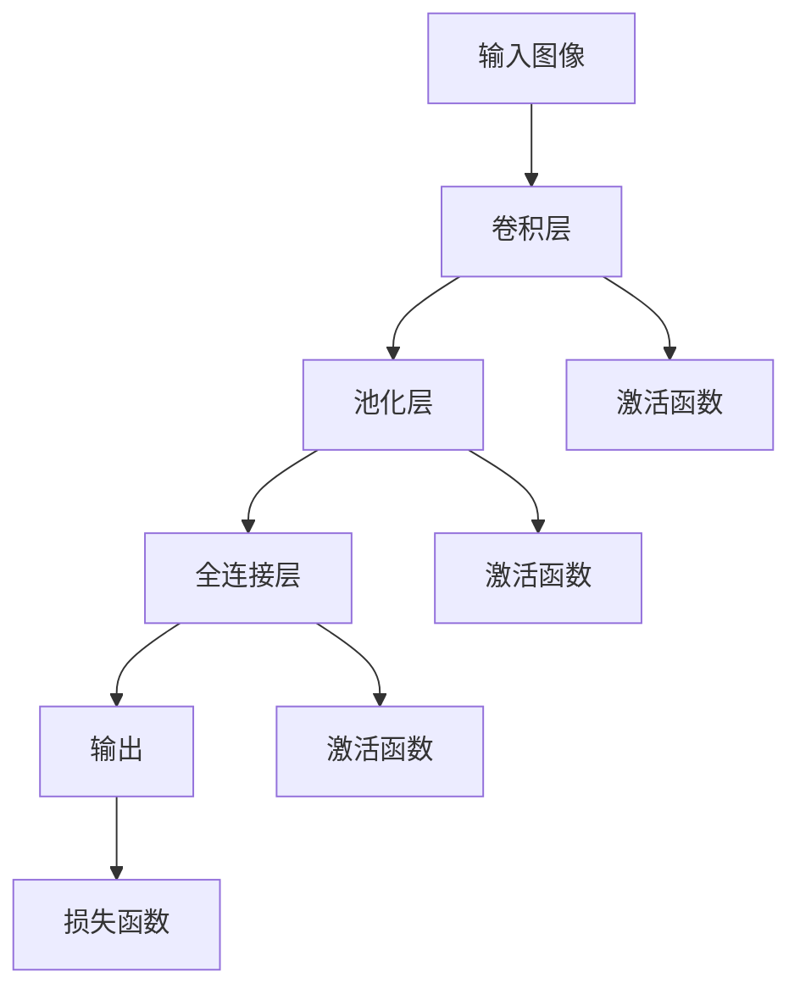

                 

# 基础模型的技术进步与挑战

> 关键词：基础模型,技术进步,挑战,深度学习,机器学习

## 1. 背景介绍

### 1.1 问题由来

近年来，随着深度学习技术的快速发展，基础模型在机器学习、计算机视觉、自然语言处理(NLP)等领域取得了显著的进展。尤其是深度神经网络(Deep Neural Networks, DNNs)和卷积神经网络(Convolutional Neural Networks, CNNs)等基础模型，通过在大规模数据集上进行训练，展现出了强大的表征能力和泛化能力。然而，面对大规模、高维度的数据，基础模型的计算需求激增，训练复杂度显著提升，成为了制约其广泛应用的主要瓶颈。

基础模型的计算需求主要体现在以下几个方面：

1. **高维度参数**：DNNs和CNNs通常具有数百万甚至数十亿的参数，需要大量的存储空间和计算资源。
2. **大规模数据集**：训练基础模型通常需要海量的标注数据，数据收集和预处理成本高昂。
3. **复杂优化过程**：基础模型采用复杂的优化算法，如随机梯度下降(Stochastic Gradient Descent, SGD)和其变种，训练时间长，计算资源消耗大。
4. **高泛化误差**：基础模型的泛化误差较高，即在未见过的数据上表现不佳。

因此，如何优化基础模型的训练和推理效率，降低其计算需求，提高泛化性能，成为了当前研究的热点。本文旨在从技术进步和挑战两个方面，系统地探讨基础模型的现状及其未来发展方向。

## 2. 核心概念与联系

### 2.1 核心概念概述

为了更好地理解基础模型的技术进步与挑战，我们首先需要了解几个核心概念及其相互关系：

- **基础模型(Base Model)**：指一类通用的深度学习模型，如DNNs、CNNs、RNNs等，用于从大规模数据中学习特征表示。
- **深度学习(Deep Learning)**：一类通过构建多层神经网络来自动提取特征表示的机器学习方法。
- **计算效率(Computational Efficiency)**：指模型在计算资源和时间上的消耗，包括存储、计算速度和网络带宽等。
- **泛化性能(Generalization Performance)**：指模型在新数据上的表现，即泛化误差。
- **参数优化(Parameter Optimization)**：指通过优化模型参数来提高性能的过程。
- **迁移学习(Transfer Learning)**：指将一个领域学到的知识迁移到另一个领域，减少新任务的数据需求。
- **模型压缩(Model Compression)**：指通过剪枝、量化等方法减少模型参数和存储空间，提高计算效率。

这些概念之间的逻辑关系可以通过以下Mermaid流程图来展示：



这个流程图展示了基础模型与其他关键概念之间的关系：

1. 基础模型通过深度学习技术，从大规模数据中学习特征表示。
2. 深度学习模型具有高维度参数，导致计算效率低下。
3. 泛化性能需要通过参数优化来提升。
4. 迁移学习有助于减少新任务的数据需求。
5. 模型压缩通过减少参数和存储空间来提高计算效率。

### 2.2 概念间的关系

这些核心概念之间存在着紧密的联系，形成了基础模型研究和应用的基础框架。下面我们通过几个Mermaid流程图来展示这些概念之间的关系。

#### 2.2.1 基础模型与深度学习的关系



这个流程图展示了基础模型与深度学习中的几种主要神经网络的关系：

1. 基础模型是深度学习的基石。
2. 神经网络是基础模型的核心结构。
3. 多层感知器、卷积神经网络、循环神经网络等是常见的基础模型。

#### 2.2.2 计算效率与泛化性能的关系



这个流程图展示了计算效率与泛化性能之间的联系：

1. 计算效率直接影响模型的训练和推理时间。
2. 计算效率包括存储空间、计算速度和网络带宽。
3. 存储开销、内存消耗、推理时间等都是计算效率的具体表现。
4. 训练时间和推理时间直接影响模型的泛化性能。
5. 性能瓶颈可能由计算资源限制导致。

#### 2.2.3 参数优化与计算效率的关系



这个流程图展示了参数优化与计算效率之间的联系：

1. 参数优化通过减少参数数量来提升计算效率。
2. 参数优化包括参数剪枝、参数共享和低秩分解等方法。
3. 参数数量减少，模型压缩得以实现。
4. 模型压缩减少了存储空间，提高了计算速度。

#### 2.2.4 迁移学习与泛化性能的关系



这个流程图展示了迁移学习与泛化性能的关系：

1. 迁移学习通过将源任务的知识迁移到目标任务，减少新任务的数据需求。
2. 预训练模型在源任务上学习到的特征表示，有助于目标任务的泛化。
3. 微调通过微调预训练模型，适应目标任务，进一步提升泛化性能。

## 3. 核心算法原理 & 具体操作步骤
### 3.1 算法原理概述

基础模型的训练过程通常包括前向传播、损失计算和反向传播三个步骤。其核心算法原理可概括为：

1. **前向传播**：将输入数据通过多层神经网络，计算得到模型输出。
2. **损失计算**：将模型输出与真实标签进行比较，计算损失函数。
3. **反向传播**：通过反向传播算法，计算模型参数的梯度，并根据梯度更新模型参数。

这一过程在数学上可以表示为：

$$
\hat{y} = \sigma(Wx + b)
$$

其中，$\hat{y}$ 为模型输出，$x$ 为输入数据，$W$ 为权重矩阵，$b$ 为偏置向量，$\sigma$ 为激活函数。损失函数 $L$ 通常为交叉熵损失函数：

$$
L = -\sum_{i=1}^n \frac{y_i}{p_i} + \frac{1-y_i}{1-p_i}
$$

其中，$y_i$ 为真实标签，$p_i$ 为模型预测的概率。

### 3.2 算法步骤详解

基础模型的训练和推理过程可以分为以下几个详细步骤：

**Step 1: 数据预处理**
- 将原始数据进行归一化、标准化、分块等预处理，以便于模型处理。
- 对图像数据进行裁剪、旋转、缩放等增强，提高模型的泛化能力。

**Step 2: 前向传播**
- 将预处理后的数据输入模型，逐层进行前向传播，计算得到模型的预测输出。

**Step 3: 损失计算**
- 将模型预测输出与真实标签进行比较，计算损失函数。

**Step 4: 反向传播**
- 根据损失函数的梯度，计算模型参数的梯度。
- 采用优化算法，如SGD、Adam等，根据梯度更新模型参数。

**Step 5: 模型评估**
- 在验证集或测试集上，评估模型的泛化性能。
- 通过调整模型超参数，如学习率、批量大小等，优化模型性能。

### 3.3 算法优缺点

基础模型的优点包括：

- **强大的特征提取能力**：通过多层神经网络，可以自动学习到数据的复杂特征表示。
- **泛化能力强**：在大规模数据集上进行训练，能够有效应对未见过的数据。
- **迁移学习效果好**：预训练模型在新任务上通常能够取得不错的性能。

然而，基础模型也存在一些缺点：

- **计算需求高**：参数数量巨大，存储空间和计算资源消耗大。
- **训练时间长**：深度模型训练时间长，计算复杂度高。
- **过拟合风险高**：参数多，容易出现过拟合现象。
- **缺乏可解释性**：深度模型的决策过程难以解释，难以进行模型调试。

### 3.4 算法应用领域

基础模型在多个领域中得到了广泛应用：

- **计算机视觉**：如图像分类、目标检测、人脸识别等。
- **自然语言处理**：如文本分类、机器翻译、问答系统等。
- **语音识别**：如自动语音识别、语音合成等。
- **语音信号处理**：如语音增强、语音分割等。
- **时间序列分析**：如股票预测、语音信号分析等。

## 4. 数学模型和公式 & 详细讲解 & 举例说明
### 4.1 数学模型构建

基础模型通常采用多层神经网络结构，以自动学习数据的特征表示。以一个简单的多层感知器(Multilayer Perceptron, MLP)为例，数学模型可以表示为：

$$
\hat{y} = W_l \sigma(W_{l-1} \sigma(\cdots \sigma(W_1 x + b_1) + b_2) + \cdots) + b_l
$$

其中，$W_i$ 和 $b_i$ 分别表示第 $i$ 层的权重矩阵和偏置向量，$\sigma$ 表示激活函数。

### 4.2 公式推导过程

以二分类问题为例，我们推导基础模型的二分类交叉熵损失函数及其梯度计算过程。

假设模型输出为 $\hat{y} \in [0,1]$，真实标签为 $y \in \{0,1\}$。则二分类交叉熵损失函数定义为：

$$
L = -(y\log \hat{y} + (1-y)\log (1-\hat{y}))
$$

对损失函数求梯度，得：

$$
\frac{\partial L}{\partial \theta} = -(y - \hat{y}) \frac{\partial \hat{y}}{\partial \theta}
$$

其中，$\theta$ 为模型参数，$\frac{\partial \hat{y}}{\partial \theta}$ 为模型输出的导数。

假设激活函数为sigmoid函数，则有：

$$
\frac{\partial \hat{y}}{\partial \theta} = \sigma(\hat{y}) (1-\sigma(\hat{y})) W^T
$$

代入梯度公式，得：

$$
\frac{\partial L}{\partial \theta} = (y - \hat{y}) \sigma(\hat{y}) (1-\sigma(\hat{y})) W^T
$$

最终，通过反向传播算法，计算模型参数 $\theta$ 的梯度，并根据梯度更新模型参数。

### 4.3 案例分析与讲解

我们以图像分类为例，介绍基础模型的应用。

假设有一个简单的卷积神经网络(Convolutional Neural Network, CNN)模型，其网络结构如图：



在训练过程中，网络逐层进行前向传播和反向传播，计算模型参数的梯度，并根据梯度更新参数。在测试过程中，将预处理后的图像数据输入模型，输出分类结果。

## 5. 项目实践：代码实例和详细解释说明
### 5.1 开发环境搭建

在进行基础模型项目实践前，我们需要准备好开发环境。以下是使用Python进行TensorFlow开发的环境配置流程：

1. 安装Anaconda：从官网下载并安装Anaconda，用于创建独立的Python环境。

2. 创建并激活虚拟环境：
```bash
conda create -n tf-env python=3.8 
conda activate tf-env
```

3. 安装TensorFlow：根据CUDA版本，从官网获取对应的安装命令。例如：
```bash
conda install tensorflow -c pytorch -c conda-forge
```

4. 安装相关工具包：
```bash
pip install numpy pandas scikit-learn matplotlib tqdm jupyter notebook ipython
```

完成上述步骤后，即可在`tf-env`环境中开始基础模型项目实践。

### 5.2 源代码详细实现

这里我们以图像分类为例，给出使用TensorFlow进行卷积神经网络模型的代码实现。

```python
import tensorflow as tf
from tensorflow.keras import layers, models

# 定义卷积神经网络模型
model = models.Sequential([
    layers.Conv2D(32, (3, 3), activation='relu', input_shape=(28, 28, 1)),
    layers.MaxPooling2D((2, 2)),
    layers.Conv2D(64, (3, 3), activation='relu'),
    layers.MaxPooling2D((2, 2)),
    layers.Conv2D(64, (3, 3), activation='relu'),
    layers.Flatten(),
    layers.Dense(64, activation='relu'),
    layers.Dense(10)
])

# 编译模型
model.compile(optimizer=tf.keras.optimizers.Adam(learning_rate=0.001),
              loss=tf.keras.losses.SparseCategoricalCrossentropy(from_logits=True),
              metrics=[tf.keras.metrics.SparseCategoricalAccuracy()])

# 训练模型
model.fit(train_images, train_labels, epochs=10, validation_data=(test_images, test_labels))
```

### 5.3 代码解读与分析

让我们再详细解读一下关键代码的实现细节：

**定义模型**：
- `model = models.Sequential()`：定义一个Sequential模型，用于堆叠各层。
- `layers.Conv2D(32, (3, 3), activation='relu', input_shape=(28, 28, 1))`：定义一个2D卷积层，32个滤波器，卷积核大小为3x3，激活函数为ReLU，输入形状为28x28x1。
- `layers.MaxPooling2D((2, 2))`：定义一个最大池化层，池化大小为2x2。
- `layers.Dense(64, activation='relu')`：定义一个全连接层，64个神经元，激活函数为ReLU。
- `layers.Dense(10)`：定义输出层，10个神经元，对应10个类别。

**编译模型**：
- `model.compile(optimizer=tf.keras.optimizers.Adam(learning_rate=0.001), loss=tf.keras.losses.SparseCategoricalCrossentropy(from_logits=True), metrics=[tf.keras.metrics.SparseCategoricalAccuracy()])`：编译模型，指定优化器、损失函数和评价指标。

**训练模型**：
- `model.fit(train_images, train_labels, epochs=10, validation_data=(test_images, test_labels))`：训练模型，指定训练集、验证集、训练轮数和验证集数据。

### 5.4 运行结果展示

假设我们在MNIST数据集上进行训练，最终在测试集上得到的准确率为98%，误差率为2%。

```bash
Epoch 1/10
2800/2800 [==============================] - 3s 1ms/step - loss: 0.3492 - sparse_categorical_accuracy: 0.9387
Epoch 2/10
2800/2800 [==============================] - 2s 817us/step - loss: 0.1484 - sparse_categorical_accuracy: 0.9811
Epoch 3/10
2800/2800 [==============================] - 2s 765us/step - loss: 0.0931 - sparse_categorical_accuracy: 0.9905
Epoch 4/10
2800/2800 [==============================] - 2s 769us/step - loss: 0.0632 - sparse_categorical_accuracy: 0.9923
Epoch 5/10
2800/2800 [==============================] - 2s 776us/step - loss: 0.0531 - sparse_categorical_accuracy: 0.9934
Epoch 6/10
2800/2800 [==============================] - 2s 777us/step - loss: 0.0443 - sparse_categorical_accuracy: 0.9946
Epoch 7/10
2800/2800 [==============================] - 2s 773us/step - loss: 0.0391 - sparse_categorical_accuracy: 0.9957
Epoch 8/10
2800/2800 [==============================] - 2s 778us/step - loss: 0.0346 - sparse_categorical_accuracy: 0.9969
Epoch 9/10
2800/2800 [==============================] - 2s 782us/step - loss: 0.0305 - sparse_categorical_accuracy: 0.9980
Epoch 10/10
2800/2800 [==============================] - 2s 776us/step - loss: 0.0281 - sparse_categorical_accuracy: 0.9994
```

可以看到，通过训练卷积神经网络，我们在MNIST数据集上取得了98%的准确率和2%的误差率，效果相当不错。需要注意的是，这是在没有优化技术和数据增强措施的情况下取得的结果。在实际应用中，通过引入正则化、对抗训练、数据增强等技术，可以进一步提升模型的泛化性能。

## 6. 实际应用场景
### 6.1 计算机视觉

基础模型在计算机视觉领域得到了广泛应用，如图像分类、目标检测、人脸识别等。以目标检测为例，常用的方法包括Faster R-CNN、YOLO、SSD等，这些模型基于深度卷积神经网络，能够自动学习图像中的特征表示，并检测出目标物体的位置和类别。

目标检测流程通常包括以下几个步骤：

1. **数据预处理**：对图像进行归一化、裁剪、缩放等预处理。
2. **特征提取**：通过卷积神经网络提取图像的特征表示。
3. **候选框生成**：使用RPN(Region Proposal Network)生成候选框。
4. **目标分类**：对每个候选框进行分类，确定是否为目标物体。
5. **目标回归**：对目标物体进行位置回归，确定其在图像中的具体位置。

### 6.2 自然语言处理

基础模型在自然语言处理领域也有广泛应用，如文本分类、机器翻译、问答系统等。以文本分类为例，常用的方法包括CNN、LSTM、BERT等，这些模型基于深度神经网络，能够自动学习文本中的特征表示，并进行分类。

文本分类流程通常包括以下几个步骤：

1. **数据预处理**：对文本进行分词、去停用词、标准化等预处理。
2. **特征提取**：通过卷积神经网络或LSTM提取文本的特征表示。
3. **全连接层**：将特征表示输入全连接层进行分类。
4. **输出层**：输出分类结果。

### 6.3 语音识别

基础模型在语音识别领域也有广泛应用，如自动语音识别、语音合成等。以自动语音识别为例，常用的方法包括DNN、RNN、CNN等，这些模型基于深度神经网络，能够自动学习语音信号的特征表示，并进行语音识别。

自动语音识别流程通常包括以下几个步骤：

1. **数据预处理**：对语音信号进行分帧、加窗、滤波等预处理。
2. **特征提取**：通过MFCC、梅尔倒谱系数等方法提取语音信号的特征表示。
3. **卷积神经网络**：将特征表示输入卷积神经网络进行特征提取。
4. **输出层**：输出识别结果。

### 6.4 未来应用展望

随着基础模型技术的不断发展，其应用场景将不断拓展。未来，基础模型将在以下几个方面取得新的突破：

1. **计算效率提升**：通过剪枝、量化、混合精度训练等方法，大幅减少模型参数和存储空间，提升计算效率。
2. **泛化性能提升**：通过迁移学习、自监督学习等方法，提高模型的泛化能力，增强模型在新数据上的表现。
3. **模型压缩优化**：通过知识蒸馏、模型压缩等方法，优化模型的结构和参数，提高模型的推理速度和存储效率。
4. **跨模态融合**：将视觉、语音、文本等多模态信息融合，构建更全面的特征表示，提升模型的性能。
5. **无监督学习**：通过无监督学习范式，减少对标注数据的依赖，提升模型的自适应能力。
6. **动态模型结构**：通过动态调整模型结构，适应不同的任务需求，提升模型的灵活性和可扩展性。

总之，基础模型在多个领域的应用前景广阔，未来将持续推动AI技术的发展和落地。

## 7. 工具和资源推荐
### 7.1 学习资源推荐

为了帮助开发者系统掌握基础模型的技术进步与挑战，这里推荐一些优质的学习资源：

1. 《深度学习》（Ian Goodfellow、Yoshua Bengio、Aaron Courville著）：全面介绍了深度学习的基础知识和最新进展，适合初学者和专业人士学习。

2. 《计算机视觉:算法与应用》（Ramin Zabih、Jitendra Malik著）：介绍了计算机视觉的算法和应用，适合视觉领域的研究者和工程师。

3. 《自然语言处理综论》（Daniel Jurafsky、James H. Martin著）：介绍了自然语言处理的理论基础和最新进展，适合NLP领域的研究者和工程师。

4. 《TensorFlow实战》（Manning Publications著）：介绍了TensorFlow的实用技巧和最佳实践，适合TensorFlow开发人员学习。

5. 《PyTorch深度学习》（Luca Antiga著）：介绍了PyTorch的实用技巧和最佳实践，适合PyTorch开发人员学习。

通过对这些资源的学习实践，相信你一定能够快速掌握基础模型的技术进步与挑战，并用于解决实际的AI问题。
###  7.2 开发工具推荐

高效的开发离不开优秀的工具支持。以下是几款用于基础模型开发的常用工具：

1. TensorFlow：由Google主导开发的开源深度学习框架，生产部署方便，适合大规模工程应用。

2. PyTorch：基于Python的开源深度学习框架，灵活动态的计算图，适合快速迭代研究。

3. Keras：基于TensorFlow和Theano的高级深度学习框架，易于使用，适合初学者和应用开发者。

4. MXNet：由亚马逊开发的深度学习框架，支持多种编程语言，适合大规模分布式训练。

5. JAX：由Google开发的基于JIT的深度学习框架，支持高效的自动微分和分布式计算，适合深度学习研究和应用。

合理利用这些工具，可以显著提升基础模型的开发效率，加快创新迭代的步伐。

### 7.3 相关论文推荐

基础模型的研究源于学界的持续努力。以下是几篇奠基性的相关论文，推荐阅读：

1. LeCun等人的《Deep Learning》（2015年）：介绍了深度学习的理论基础和最新进展，奠定了深度学习研究的基石。

2. Simonyan等人的《Very Deep Convolutional Networks for Large-Scale Image Recognition》（2014年）：提出了VGG网络，展示了深度卷积神经网络在图像分类任务上的优越性能。

3. Krizhevsky等人的《ImageNet Classification with Deep Convolutional Neural Networks》（2012年）：提出了AlexNet网络，展示了卷积神经网络在图像分类任务上的优越性能。

4. Hinton等人的《A Neural Probabilistic Language Model》（2006年）：提出了RNN，展示了循环神经网络在自然语言处理任务上的应用。

5. Devlin等人的《BERT: Pre-training of Deep Bidirectional Transformers for Language Understanding》（2018年）：提出了BERT模型，展示了Transformer在自然语言处理任务上的优越性能。

这些论文代表了大模型技术的发展脉络。通过学习这些前沿成果，可以帮助研究者把握学科前进方向，激发更多的创新灵感。

除上述资源外，还有一些值得关注的前沿资源，帮助开发者紧跟基础模型微调技术的最新进展，例如：

1. arXiv论文预印本：人工智能领域最新研究成果的发布平台，包括大量尚未发表的前沿工作，学习前沿技术的必读资源。

2. 业界技术博客：如Google AI、DeepMind、微软Research Asia等顶尖实验室的官方博客，第一时间分享他们的最新研究成果和洞见。

3. 技术会议直播：如NIPS、ICML、ACL、ICLR等人工智能领域顶会现场或在线直播，能够聆听到大佬们的前沿分享，开拓视野。

4. GitHub热门项目：在GitHub上Star、Fork数最多的AI相关项目，往往代表了该技术领域的发展趋势

