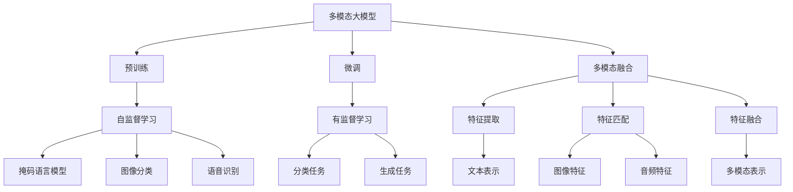
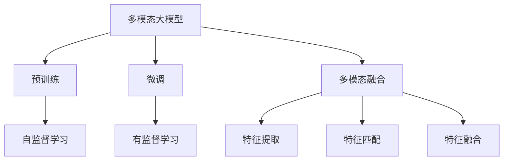
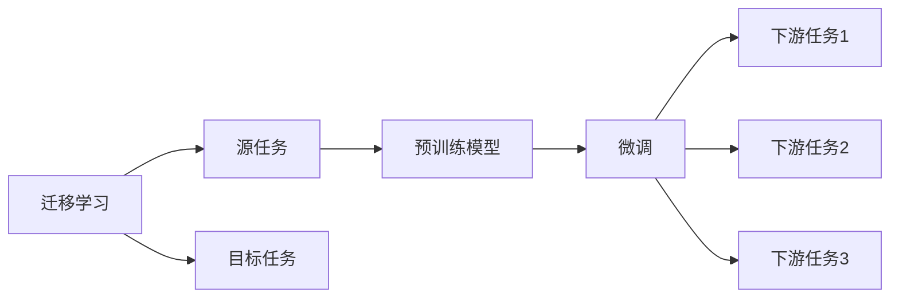
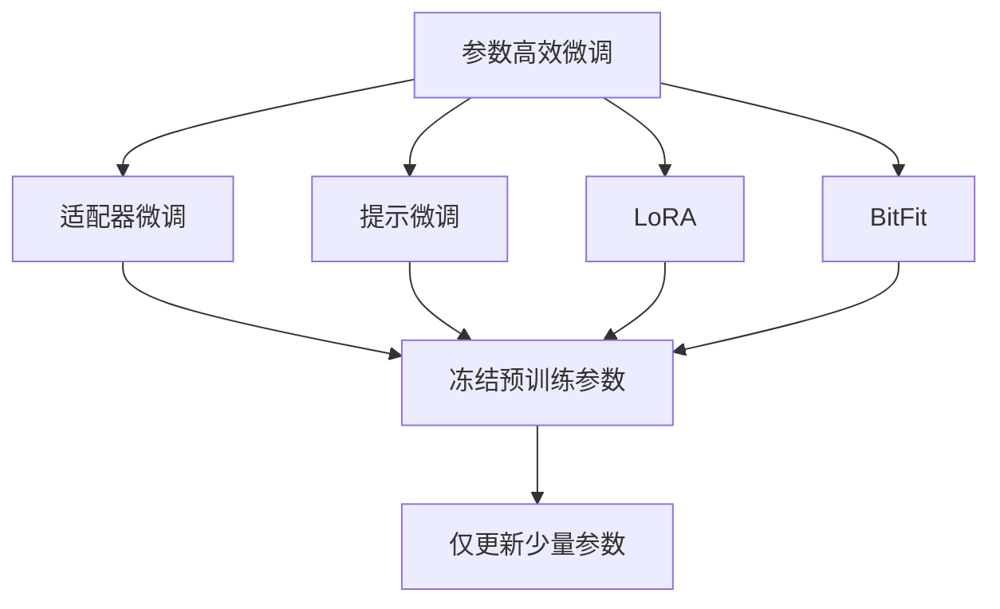
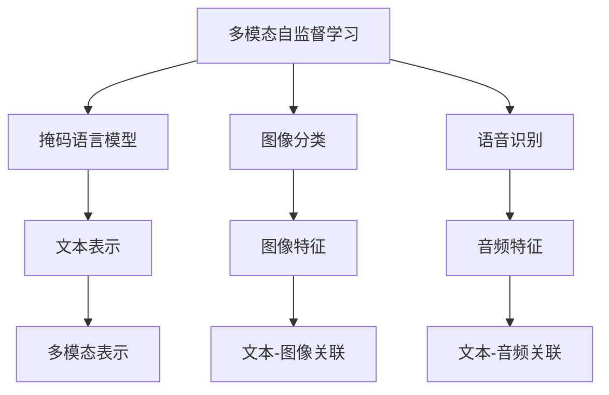
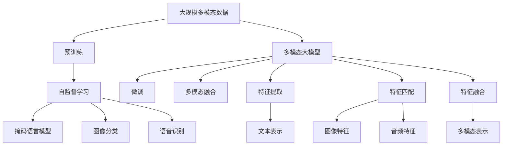

                 

# 多模态大模型：技术原理与实战 优化逻辑介绍

> 关键词：多模态大模型,多模态融合,深度学习,Transformer,BERT,预训练,微调,迁移学习

## 1. 背景介绍

### 1.1 问题由来
随着人工智能技术的不断进步，尤其是深度学习的发展，多模态大模型(Multimodal Large Models)已经成为了人工智能研究的热点。多模态大模型能够处理和理解不同类型的数据，如文本、图像、音频等，从而在诸如自然语言处理(NLP)、计算机视觉(CV)、语音识别(SR)等多个领域取得了显著成果。然而，多模态数据之间存在着巨大的差异，如何在深度学习框架下将这些不同类型的数据进行有效融合，是当前研究的难点之一。

### 1.2 问题核心关键点
多模态大模型的核心是如何在深度学习框架下有效地融合不同类型的数据，从而实现对现实世界的复杂理解和建模。多模态融合的基本方法包括特征提取、特征匹配、特征融合等。目前，常用的多模态大模型架构包括自编码器、卷积神经网络(CNN)、循环神经网络(RNN)、变换器(Transformer)等。其中，基于Transformer的多模态模型因其出色的性能而成为了当前研究的主流。

### 1.3 问题研究意义
研究多模态大模型的融合方法，对于拓展深度学习在多模态领域的适用性，提升模型在复杂多模态任务中的性能，加速多模态技术在各个领域的应用，具有重要意义。

1. 降低应用开发成本。通过多模态大模型，可以显著减少开发多模态应用所需的数据、计算和人力成本投入。
2. 提升模型效果。多模态大模型能够更好地适应多模态数据的特点，在实际应用场景中取得更优表现。
3. 加速开发进度。多模态大模型技术使得开发者可以更快地完成任务适配，缩短开发周期。
4. 带来技术创新。多模态大模型的研究促进了对深度学习框架的深入研究，催生了新的研究方向，如多模态自监督学习、多模态对抗训练等。
5. 赋能产业升级。多模态大模型技术更容易被各行各业所采用，为传统行业数字化转型升级提供新的技术路径。

## 2. 核心概念与联系

### 2.1 核心概念概述

为更好地理解多模态大模型的融合方法，本节将介绍几个密切相关的核心概念：

- 多模态大模型(Multimodal Large Models, MLMs)：能够处理和理解不同类型的数据（如文本、图像、音频等），并且具备强大的语义理解和生成能力的大规模预训练模型。
- 预训练(Pre-training)：指在大规模无标签多模态数据上进行自监督学习任务训练通用多模态模型的过程。常用的预训练任务包括掩码语言模型、图像分类、语音识别等。
- 微调(Fine-tuning)：指在预训练模型的基础上，使用下游任务的少量标注数据，通过有监督学习优化模型在特定任务上的性能。通常只需要调整顶层分类器或解码器，并以较小的学习率更新全部或部分的模型参数。
- 迁移学习(Transfer Learning)：指将一个领域学习到的知识，迁移应用到另一个不同但相关的领域的学习范式。多模态大模型的预训练-微调过程即是一种典型的迁移学习方式。
- 多模态融合(Multimodal Fusion)：指将不同类型的数据（如文本、图像、音频等）通过深度学习模型进行融合，形成多模态表示的技术。
- 多模态自监督学习(Self-Supervised Multimodal Learning)：指在无监督的情况下，利用多模态数据的关联性进行自我学习，提升模型的泛化能力和鲁棒性。

这些核心概念之间的逻辑关系可以通过以下Mermaid流程图来展示：



这个流程图展示了大模态模型的核心概念及其之间的关系：

1. 多模态大模型通过预训练获得基础能力。
2. 微调是对预训练模型进行任务特定的优化，可以分为全参数微调和参数高效微调（PEFT）。
3. 多模态融合是连接预训练模型与下游任务的桥梁，可以通过微调或特征融合实现。
4. 迁移学习是连接预训练模型与下游任务的桥梁，可以通过微调或特征融合实现。
5. 多模态自监督学习是利用多模态数据的关联性进行自我学习，提升模型的泛化能力和鲁棒性。

这些核心概念共同构成了多模态大模型的学习和应用框架，使其能够在各种场景下发挥强大的多模态理解和生成能力。通过理解这些核心概念，我们可以更好地把握多模态大模型的工作原理和优化方向。

### 2.2 概念间的关系

这些核心概念之间存在着紧密的联系，形成了多模态大模型的完整生态系统。下面我通过几个Mermaid流程图来展示这些概念之间的关系。

#### 2.2.1 多模态大模型的学习范式



这个流程图展示了大模态模型的三种主要学习范式：预训练、微调和多模态融合。预训练主要采用自监督学习方法，而微调则是有监督学习的过程。多模态融合可以通过微调或特征提取、特征匹配、特征融合等方法实现。

#### 2.2.2 迁移学习与微调的关系



这个流程图展示了迁移学习的基本原理，以及它与微调的关系。迁移学习涉及源任务和目标任务，预训练模型在源任务上学习，然后通过微调适应各种下游任务（目标任务）。

#### 2.2.3 参数高效微调方法



这个流程图展示了几种常见的参数高效微调方法，包括适配器微调、提示微调、LoRA和BitFit。这些方法的共同特点是冻结大部分预训练参数，只更新少量参数，从而提高微调效率。

#### 2.2.4 多模态自监督学习



这个流程图展示了多模态自监督学习的基本原理，以及它在特征提取、特征匹配和特征融合中的作用。

### 2.3 核心概念的整体架构

最后，我们用一个综合的流程图来展示这些核心概念在大模态模型微调过程中的整体架构：



这个综合流程图展示了从预训练到微调，再到多模态融合的完整过程。多模态大模型首先在大规模多模态数据上进行预训练，然后通过微调（包括全参数微调和参数高效微调）或多模态融合（包括特征提取、特征匹配和特征融合）来适应下游任务。最后，通过多模态自监督学习技术，模型可以不断更新和适应新的多模态数据。 通过这些流程图，我们可以更清晰地理解多模态大模型微调过程中各个核心概念的关系和作用，为后续深入讨论具体的微调方法和技术奠定基础。

## 3. 核心算法原理 & 具体操作步骤
### 3.1 算法原理概述

基于监督学习的多模态大模型微调，本质上是一个有监督的细粒度迁移学习过程。其核心思想是：将预训练的多模态模型视作一个强大的"特征提取器"，通过在下游任务的少量标注数据上进行有监督的微调，使得模型输出能够匹配任务标签，从而获得针对特定任务优化的模型。

形式化地，假设预训练模型为 $M_{\theta}$，其中 $\theta$ 为预训练得到的模型参数。给定下游任务 $T$ 的标注数据集 $D=\{(x_i, y_i)\}_{i=1}^N$，微调的目标是找到新的模型参数 $\hat{\theta}$，使得：

$$
\hat{\theta}=\mathop{\arg\min}_{\theta} \mathcal{L}(M_{\theta},D)
$$

其中 $\mathcal{L}$ 为针对任务 $T$ 设计的损失函数，用于衡量模型预测输出与真实标签之间的差异。常见的损失函数包括交叉熵损失、均方误差损失等。

通过梯度下降等优化算法，微调过程不断更新模型参数 $\theta$，最小化损失函数 $\mathcal{L}$，使得模型输出逼近真实标签。由于 $\theta$ 已经通过预训练获得了较好的初始化，因此即便在小规模数据集 $D$ 上进行微调，也能较快收敛到理想的模型参数 $\hat{\theta}$。

### 3.2 算法步骤详解

基于监督学习的多模态大模型微调一般包括以下几个关键步骤：

**Step 1: 准备预训练模型和数据集**
- 选择合适的预训练多模态模型 $M_{\theta}$ 作为初始化参数，如 BERT、GPT 等。
- 准备下游任务 $T$ 的标注数据集 $D$，划分为训练集、验证集和测试集。一般要求标注数据与预训练数据的分布不要差异过大。

**Step 2: 添加任务适配层**
- 根据任务类型，在预训练模型顶层设计合适的输出层和损失函数。
- 对于分类任务，通常在顶层添加线性分类器和交叉熵损失函数。
- 对于生成任务，通常使用语言模型的解码器输出概率分布，并以负对数似然为损失函数。

**Step 3: 设置微调超参数**
- 选择合适的优化算法及其参数，如 AdamW、SGD 等，设置学习率、批大小、迭代轮数等。
- 设置正则化技术及强度，包括权重衰减、Dropout、Early Stopping等。
- 确定冻结预训练参数的策略，如仅微调顶层，或全部参数都参与微调。

**Step 4: 执行梯度训练**
- 将训练集数据分批次输入模型，前向传播计算损失函数。
- 反向传播计算参数梯度，根据设定的优化算法和学习率更新模型参数。
- 周期性在验证集上评估模型性能，根据性能指标决定是否触发 Early Stopping。
- 重复上述步骤直到满足预设的迭代轮数或 Early Stopping 条件。

**Step 5: 测试和部署**
- 在测试集上评估微调后模型 $M_{\hat{\theta}}$ 的性能，对比微调前后的精度提升。
- 使用微调后的模型对新样本进行推理预测，集成到实际的应用系统中。
- 持续收集新的数据，定期重新微调模型，以适应数据分布的变化。

以上是基于监督学习的多模态大模型微调的一般流程。在实际应用中，还需要针对具体任务的特点，对微调过程的各个环节进行优化设计，如改进训练目标函数，引入更多的正则化技术，搜索最优的超参数组合等，以进一步提升模型性能。

### 3.3 算法优缺点

基于监督学习的多模态大模型微调方法具有以下优点：
1. 简单高效。只需准备少量标注数据，即可对预训练模型进行快速适配，获得较大的性能提升。
2. 通用适用。适用于各种多模态下游任务，包括分类、匹配、生成等，设计简单的任务适配层即可实现微调。
3. 参数高效。利用参数高效微调技术，在固定大部分预训练参数的情况下，仍可取得不错的提升。
4. 效果显著。在学术界和工业界的诸多任务上，基于微调的方法已经刷新了最先进的性能指标。

同时，该方法也存在一定的局限性：
1. 依赖标注数据。微调的效果很大程度上取决于标注数据的质量和数量，获取高质量标注数据的成本较高。
2. 迁移能力有限。当目标任务与预训练数据的分布差异较大时，微调的性能提升有限。
3. 负面效果传递。预训练模型的固有偏见、有害信息等，可能通过微调传递到下游任务，造成负面影响。
4. 可解释性不足。微调模型的决策过程通常缺乏可解释性，难以对其推理逻辑进行分析和调试。

尽管存在这些局限性，但就目前而言，基于监督学习的微调方法仍是多模态大模型应用的主流范式。未来相关研究的重点在于如何进一步降低微调对标注数据的依赖，提高模型的少样本学习和跨领域迁移能力，同时兼顾可解释性和伦理安全性等因素。

### 3.4 算法应用领域

基于多模态大模型的微调方法，已经在多模态数据处理、计算机视觉、语音识别、自然语言处理等多个领域取得了广泛应用，覆盖了几乎所有常见任务，例如：

- 图像分类与识别：如图像物体分类、人脸识别、图像语义分割等。通过微调使模型学习图像特征和语义表示。
- 图像描述生成：如图像字幕生成、图片描述生成等。将图像作为输入，通过微调使模型学习生成对应的文本描述。
- 视觉问答：如图像问答、视频问答等。将问题-图像对作为微调数据，训练模型学习匹配答案。
- 多模态情感分析：如情感视频分析、多模态情感识别等。将视频、文本等作为输入，通过微调使模型学习综合不同模态的情感信息。
- 多模态对话系统：如智能机器人对话、多模态智能客服等。将用户输入的语音、文本等作为输入，通过微调使模型学习多模态对话策略。
- 多模态推荐系统：如视频推荐、多模态商品推荐等。将用户历史行为数据、图片、视频等作为输入，通过微调使模型学习多模态推荐策略。
- 多模态医学图像分析：如医学图像分类、病灶识别等。将医学图像和文本作为输入，通过微调使模型学习医学图像特征和语义表示。

除了上述这些经典任务外，多模态大模型微调还被创新性地应用到更多场景中，如可控多模态生成、常识推理、多模态机器翻译等，为多模态技术带来了全新的突破。随着预训练模型和微调方法的不断进步，相信多模态大模型微调技术将在更广阔的应用领域大放异彩。

## 4. 数学模型和公式 & 详细讲解
### 4.1 数学模型构建

本节将使用数学语言对基于监督学习的多模态大模型微调过程进行更加严格的刻画。

记预训练多模态模型为 $M_{\theta}$，其中 $\theta$ 为预训练得到的模型参数。假设微调任务的训练集为 $D=\{(x_i, y_i)\}_{i=1}^N$，其中 $x_i$ 为多模态数据，$y_i$ 为任务标签。

定义模型 $M_{\theta}$ 在输入 $x_i$ 上的损失函数为 $\ell(M_{\theta}(x_i),y_i)$，则在数据集 $D$ 上的经验风险为：

$$
\mathcal{L}(\theta) = \frac{1}{N} \sum_{i=1}^N \ell(M_{\theta}(x_i),y_i)
$$

微调的优化目标是最小化经验风险，即找到最优参数：

$$
\theta^* = \mathop{\arg\min}_{\theta} \mathcal{L}(\theta)
$$

在实践中，我们通常使用基于梯度的优化算法（如SGD、Adam等）来近似求解上述最优化问题。设 $\eta$ 为学习率，$\lambda$ 为正则化系数，则参数的更新公式为：

$$
\theta \leftarrow \theta - \eta \nabla_{\theta}\mathcal{L}(\theta) - \eta\lambda\theta
$$

其中 $\nabla_{\theta}\mathcal{L}(\theta)$ 为损失函数对参数 $\theta$ 的梯度，可通过反向传播算法高效计算。

### 4.2 公式推导过程

以下我们以图像分类任务为例，推导交叉熵损失函数及其梯度的计算公式。

假设模型 $M_{\theta}$ 在输入图像 $x$ 上的输出为 $\hat{y}=M_{\theta}(x) \in [0,1]$，表示样本属于每个类别的概率。真实标签 $y \in \{1,0\}$。则二分类交叉熵损失函数定义为：

$$
\ell(M_{\theta}(x),y) = -[y\log \hat{y} + (1-y)\log (1-\hat{y})]
$$

将其代入经验风险公式，得：

$$
\mathcal{L}(\theta) = -\frac{1}{N}\sum_{i=1}^N [y_i\log M_{\theta}(x_i)+(1-y_i)\log(1-M_{\theta}(x_i))]
$$

根据链式法则，损失函数对参数 $\theta_k$ 的梯度为：

$$
\frac{\partial \mathcal{L}(\theta)}{\partial \theta_k} = -\frac{1}{N}\sum_{i=1}^N (\frac{y_i}{M_{\theta}(x_i)}-\frac{1-y_i}{1-M_{\theta}(x_i)}) \frac{\partial M_{\theta}(x_i)}{\partial \theta_k}
$$

其中 $\frac{\partial M_{\theta}(x_i)}{\partial \theta_k}$ 可进一步递归展开，利用自动微分技术完成计算。

在得到损失函数的梯度后，即可带入参数更新公式，完成模型的迭代优化。重复上述过程直至收敛，最终得到适应下游任务的最优模型参数 $\theta^*$。

## 5. 项目实践：代码实例和详细解释说明
### 5.1 开发环境搭建

在进行微调实践前，我们需要准备好开发环境。以下是使用Python进行PyTorch开发的环境配置流程：

1. 安装Anaconda：从官网下载并安装Anaconda，用于创建独立的Python环境。

2. 创建并激活虚拟环境：
```bash
conda create -n pytorch-env python=3.8 
conda activate pytorch-env
```

3. 安装PyTorch：根据CUDA版本，从官网获取对应的安装命令。例如：
```bash
conda install pytorch torchvision torchaudio cudatoolkit=11.1 -c pytorch -c conda-forge
```

4. 安装Transformers库：
```bash
pip install transformers
```

5. 安装各类工具包：
```bash
pip install numpy pandas scikit-learn matplotlib tqdm jupyter notebook ipython
```

完成上述步骤后，即可在`pytorch-env`环境中开始微调实践。

### 5.2 源代码详细实现

这里我们以图像分类任务为例，给出使用Transformers库对BERT模型进行微调的PyTorch代码实现。

首先，定义图像分类任务的数据处理函数：

```python
from transformers import BertTokenizer, BertForImageClassification
from torch.utils.data import Dataset
import torch

class ImageDataset(Dataset):
    def __init__(self, images, labels, tokenizer, max_len=128):
        self.images = images
        self.labels = labels
        self.tokenizer = tokenizer
        self.max_len = max_len
        
    def __len__(self):
        return len(self.images)
    
    def __getitem__(self, item):
        image = self.images[item]
        label = self.labels[item]
        
        # 对图像进行分词编码
        encoding = self.tokenizer(image, return_tensors='pt', max_length=self.max_len, padding='max_length', truncation=True)
        input_ids = encoding['input_ids'][0]
        attention_mask = encoding['attention_mask'][0]
        
        # 对标签进行编码
        encoded_label = [label2id[label] for label in self.labels] 
        encoded_label.extend([label2id['O']] * (self.max_len - len(encoded_label)))
        labels = torch.tensor(encoded_label, dtype=torch.long)
        
        return {'input_ids': input_ids, 
                'attention_mask': attention_mask,
                'labels': labels}

# 标签与id的映射
label2id = {'O': 0, 'C0': 1, 'C1': 2, 'C2': 3, 'C3': 4, 'C4': 5, 'C5': 6, 'C6': 7, 'C7': 8, 'C8': 9, 'C9': 10}
id2label = {v: k for k, v in label2id.items()}
```

然后，定义模型和优化器：

```python
from transformers import BertForImageClassification, AdamW

model = BertForImageClassification.from_pretrained('bert-base-cased', num_labels=len(label2id))

optimizer = AdamW(model.parameters(), lr=2e-5)
```

接着，定义训练和评估函数：

```python
from torch.utils.data import DataLoader
from tqdm import tqdm
from sklearn.metrics import classification_report

device = torch.device('cuda') if torch.cuda.is_available() else torch.device('cpu')
model.to(device)

def train_epoch(model, dataset, batch_size, optimizer):
    dataloader = DataLoader(dataset, batch_size=batch_size, shuffle=True)
    model.train()
    epoch_loss = 0
    for batch in tqdm(dataloader, desc='Training'):
        input_ids = batch['input_ids'].to(device)
        attention_mask = batch['attention_mask'].to(device)
        labels = batch['labels'].to(device)
        model.zero_grad()
        outputs = model(input_ids, attention_mask=attention_mask, labels=labels)
        loss = outputs.loss
        epoch_loss += loss.item()
        loss.backward()
        optimizer.step()
    return epoch_loss / len(dataloader)

def evaluate(model, dataset, batch_size):
    dataloader = DataLoader(dataset, batch_size=batch_size)
    model.eval()
    preds, labels = [], []
    with torch.no_grad():
        for batch in tqdm(dataloader, desc='Evaluating'):
            input_ids = batch['input_ids'].to(device)
            attention_mask = batch['attention_mask'].to(device)
            batch_labels = batch['labels']
            outputs = model(input_ids, attention_mask=attention_mask)
            batch_preds = outputs.logits.argmax(dim=2).to('cpu').tolist()
            batch_labels = batch_labels.to('cpu').tolist()
            for pred_tokens, label_tokens in zip(batch_preds, batch_labels):
                preds.append(pred_tokens[:len(label_tokens)])
                labels.append(label_tokens)
                
    print(classification_report(labels, preds))
```

最后，启动训练流程并在测试集上评估：

```python
epochs = 5
batch_size = 16

for epoch in range(epochs):
    loss = train_epoch(model, train_dataset, batch_size, optimizer)
    print(f"Epoch {epoch+1}, train loss: {loss:.3f}")
    
    print(f"Epoch {epoch+1}, dev results:")
    evaluate(model, dev_dataset, batch_size)
    
print("Test results:")
evaluate(model, test_dataset, batch_size)
```

以上就是使用PyTorch对BERT进行图像分类任务微调的完整代码实现。可以看到，得益于Transformers库的强大封装，我们可以用相对简洁的代码完成BERT模型的加载和微调。

### 5.3 代码解读与分析

让我们再详细解读一下关键代码的实现细节：

**ImageDataset类**：
- `__init__`方法：初始化图像、标签、分词器等关键组件。
- `__len__`方法：返回数据集的样本数量。
-

