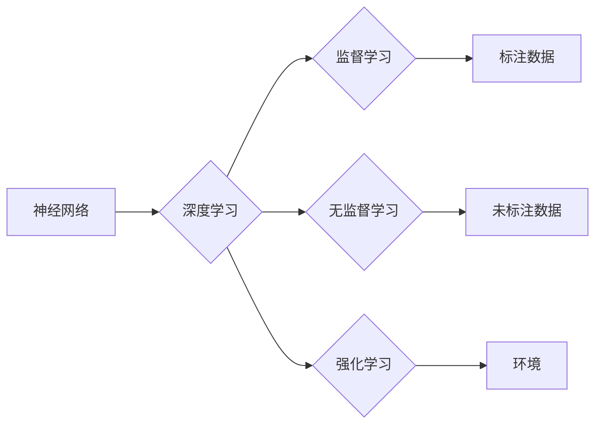

# Deep Learning原理与代码实例讲解

> 关键词：深度学习，神经网络，监督学习，无监督学习，卷积神经网络，递归神经网络，强化学习，应用实例

## 1. 背景介绍

深度学习（Deep Learning）是人工智能领域的一个重要分支，它通过构建具有多层处理单元的神经网络，实现了对复杂数据的自动特征提取和模式识别。深度学习在图像识别、语音识别、自然语言处理等领域取得了显著的成果，推动了人工智能技术的快速发展。

### 1.1 问题的由来

传统的机器学习模型在处理复杂数据时，往往需要人工设计特征，这不仅费时费力，而且难以捕捉到数据中的深层特征。深度学习通过自动学习数据中的层次化特征表示，解决了这一难题，使得计算机能够更智能地理解和处理数据。

### 1.2 研究现状

近年来，随着计算能力的提升、大数据的涌现以及深度学习理论的不断完善，深度学习技术取得了长足的进步。许多基于深度学习的模型在图像识别、语音识别、自然语言处理等领域的竞赛中取得了领先地位。

### 1.3 研究意义

深度学习技术的发展，不仅推动了人工智能技术的进步，也为各行各业带来了巨大的变革。例如，在医疗领域，深度学习可以帮助医生进行疾病诊断；在金融领域，深度学习可以用于风险评估和欺诈检测；在工业领域，深度学习可以用于设备故障预测和优化生产流程。

### 1.4 本文结构

本文将深入浅出地讲解深度学习的原理，并通过代码实例展示如何使用深度学习技术解决实际问题。本文结构如下：

- 第2章将介绍深度学习的基本概念和核心原理。
- 第3章将介绍深度学习中的主要算法，包括监督学习、无监督学习和强化学习。
- 第4章将通过具体的案例，讲解深度学习在各个领域的应用。
- 第5章将介绍深度学习的工具和资源，并给出代码实例。
- 第6章将总结深度学习的发展趋势和面临的挑战。

## 2. 核心概念与联系

### 2.1 核心概念

- **神经网络**：由大量神经元组成的计算模型，用于模拟人脑的信息处理过程。
- **深度学习**：利用神经网络进行层次化特征提取和学习的方法。
- **监督学习**：通过标注数据训练模型，使模型能够对未知数据进行预测或分类。
- **无监督学习**：通过未标注数据学习数据中的结构和模式。
- **强化学习**：通过与环境交互，使智能体学会在特定环境中做出最优决策。

### 2.2 联系

深度学习是神经网络技术在数据驱动下的应用，监督学习、无监督学习和强化学习是深度学习的三种主要学习方式。它们之间相互联系，共同构成了深度学习的理论基础。



## 3. 核心算法原理 & 具体操作步骤

### 3.1 算法原理概述

#### 3.1.1 神经网络

神经网络由多个神经元组成，每个神经元接收多个输入，并输出一个值。神经网络通过多层连接，形成复杂的计算模型。

#### 3.1.2 激活函数

激活函数为神经网络引入非线性，使得网络能够学习复杂的非线性关系。常见的激活函数包括ReLU、Sigmoid和Tanh。

#### 3.1.3 损失函数

损失函数用于衡量模型的预测结果与真实值之间的差异。常见的损失函数包括均方误差（MSE）、交叉熵损失（Cross-Entropy Loss）和二元交叉熵损失（Binary Cross-Entropy Loss）。

#### 3.1.4 优化算法

优化算法用于最小化损失函数，常见的优化算法包括随机梯度下降（SGD）、Adam和RMSprop。

### 3.2 算法步骤详解

深度学习模型的训练通常包括以下步骤：

1. **数据预处理**：对数据进行清洗、转换和归一化等操作。
2. **模型构建**：选择合适的神经网络结构，并设置激活函数和损失函数。
3. **模型训练**：使用训练数据对模型进行训练，不断更新模型参数，最小化损失函数。
4. **模型评估**：使用验证数据评估模型的性能，调整模型参数或结构，直至达到满意的性能。
5. **模型部署**：将训练好的模型部署到实际应用中。

### 3.3 算法优缺点

深度学习模型的优点包括：

- **强大的特征学习能力**：能够自动学习数据的深层特征表示。
- **泛化能力强**：在未见过的数据上也能保持较好的性能。
- **应用范围广**：可以应用于图像识别、语音识别、自然语言处理等多个领域。

深度学习模型的缺点包括：

- **需要大量数据**：训练深度学习模型需要大量的标注数据。
- **计算复杂度高**：训练过程需要大量的计算资源。
- **可解释性差**：难以解释模型的决策过程。

### 3.4 算法应用领域

深度学习模型在各个领域都有广泛的应用，以下是一些常见的应用领域：

- **图像识别**：人脸识别、物体检测、图像分割等。
- **语音识别**：语音识别、语音合成、语音转文字等。
- **自然语言处理**：文本分类、机器翻译、情感分析等。
- **推荐系统**：电影推荐、商品推荐、新闻推荐等。

## 4. 数学模型和公式 & 详细讲解 & 举例说明

### 4.1 数学模型构建

深度学习模型的数学模型主要包括以下内容：

- **前向传播**：将输入数据通过网络层进行计算，得到输出数据。
- **反向传播**：根据损失函数计算梯度，并更新网络层的参数。

### 4.2 公式推导过程

以下以一个简单的全连接神经网络为例，介绍前向传播和反向传播的公式推导过程。

#### 4.2.1 前向传播

假设神经网络包含两个全连接层，输入层有 $n$ 个神经元，隐藏层有 $m$ 个神经元，输出层有 $k$ 个神经元。设输入向量为 $x \in \mathbb{R}^n$，隐藏层激活向量为 $h \in \mathbb{R}^m$，输出向量为 $y \in \mathbb{R}^k$，网络层的权重矩阵分别为 $W_1 \in \mathbb{R}^{n \times m}$ 和 $W_2 \in \mathbb{R}^{m \times k}$，激活函数为 $f(x)$。

前向传播的公式如下：

$$
h = f(W_1x + b_1)
$$

$$
y = f(W_2h + b_2)
$$

其中 $b_1$ 和 $b_2$ 分别为输入层和输出层的偏置向量。

#### 4.2.2 反向传播

反向传播的目的是计算损失函数对网络层参数的梯度，并更新参数。

设损失函数为 $L(y, \hat{y})$，其中 $\hat{y}$ 为模型的预测输出，真实输出为 $y$。

损失函数的梯度计算公式如下：

$$
\frac{\partial L}{\partial W_1} = (h^T \odot \nabla_L h) \cdot x^T
$$

$$
\frac{\partial L}{\partial W_2} = (y^T \odot \nabla_L y) \cdot h^T
$$

其中 $\odot$ 表示Hadamard积，$\nabla_L h$ 和 $\nabla_L y$ 分别为损失函数对隐藏层激活向量和输出向量的梯度。

### 4.3 案例分析与讲解

以下以MNIST手写数字识别任务为例，讲解如何使用深度学习模型进行图像识别。

#### 4.3.1 数据预处理

MNIST数据集包含60,000个训练样本和10,000个测试样本，每个样本都是一个28x28的灰度图像。

首先，我们需要将图像数据转换为浮点数，并归一化到[0,1]区间。

```python
import numpy as np
from PIL import Image

def load_mnist_data():
    # 加载MNIST数据集
    # ...
    # 将图像数据转换为浮点数并归一化
    x_train, y_train = [], []
    for img in train_images:
        img = np.array(img, dtype=np.float32) / 255.0
        x_train.append(img.flatten())
        y_train.append(y_train_labels)
    return np.array(x_train), np.array(y_train)

x_train, y_train = load_mnist_data()
```

#### 4.3.2 模型构建

接下来，我们需要构建一个全连接神经网络来识别MNIST手写数字。

```python
import torch
import torch.nn as nn
import torch.optim as optim

class MNISTNet(nn.Module):
    def __init__(self):
        super(MNISTNet, self).__init__()
        self.fc1 = nn.Linear(28*28, 128)
        self.fc2 = nn.Linear(128, 10)

    def forward(self, x):
        x = x.view(-1, 28*28)
        x = nn.functional.relu(self.fc1(x))
        x = self.fc2(x)
        return x

model = MNISTNet()
```

#### 4.3.3 模型训练

使用训练数据对模型进行训练，并使用交叉熵损失函数和Adam优化器。

```python
criterion = nn.CrossEntropyLoss()
optimizer = optim.Adam(model.parameters(), lr=0.001)

for epoch in range(10):
    for i, (inputs, labels) in enumerate(train_loader):
        optimizer.zero_grad()
        outputs = model(inputs)
        loss = criterion(outputs, labels)
        loss.backward()
        optimizer.step()
        if (i+1) % 100 == 0:
            print(f'Epoch [{epoch+1}/10], Step [{i+1}/50000], Loss: {loss.item():.4f}')
```

#### 4.3.4 模型评估

使用测试数据评估模型的性能。

```python
correct = 0
total = 0
with torch.no_grad():
    for images, labels in test_loader:
        outputs = model(images)
        _, predicted = torch.max(outputs.data, 1)
        total += labels.size(0)
        correct += (predicted == labels).sum().item()

print(f'Accuracy of the network on the 10000 test images: {100 * correct / total}%')
```

## 5. 项目实践：代码实例和详细解释说明

### 5.1 开发环境搭建

为了实践深度学习，我们需要搭建一个开发环境。以下是使用Python进行深度学习开发的典型环境配置流程：

1. 安装Anaconda：从官网下载并安装Anaconda，用于创建独立的Python环境。
2. 创建并激活虚拟环境：
```bash
conda create -n deep-learning-env python=3.8
conda activate deep-learning-env
```
3. 安装PyTorch：根据CUDA版本，从官网获取对应的安装命令。
```bash
conda install pytorch torchvision torchaudio cudatoolkit=11.1 -c pytorch -c conda-forge
```
4. 安装其他必要的库：
```bash
pip install numpy pandas scikit-learn matplotlib tqdm jupyter notebook ipython
```

### 5.2 源代码详细实现

以下是一个简单的深度学习项目，实现MNIST手写数字识别：

```python
import torch
import torch.nn as nn
import torch.optim as optim

class MNISTNet(nn.Module):
    def __init__(self):
        super(MNISTNet, self).__init__()
        self.fc1 = nn.Linear(28*28, 128)
        self.fc2 = nn.Linear(128, 10)

    def forward(self, x):
        x = x.view(-1, 28*28)
        x = nn.functional.relu(self.fc1(x))
        x = self.fc2(x)
        return x

# 加载MNIST数据集
x_train, y_train = load_mnist_data()

# 构建模型
model = MNISTNet()

# 定义损失函数和优化器
criterion = nn.CrossEntropyLoss()
optimizer = optim.Adam(model.parameters(), lr=0.001)

# 训练模型
for epoch in range(10):
    for inputs, labels in enumerate(train_loader):
        optimizer.zero_grad()
        outputs = model(inputs)
        loss = criterion(outputs, labels)
        loss.backward()
        optimizer.step()
        if (i+1) % 100 == 0:
            print(f'Epoch [{epoch+1}/10], Step [{i+1}/50000], Loss: {loss.item():.4f}')

# 评估模型
correct = 0
total = 0
with torch.no_grad():
    for images, labels in test_loader:
        outputs = model(images)
        _, predicted = torch.max(outputs.data, 1)
        total += labels.size(0)
        correct += (predicted == labels).sum().item()

print(f'Accuracy of the network on the 10000 test images: {100 * correct / total}%')
```

### 5.3 代码解读与分析

以上代码实现了一个简单的MNIST手写数字识别模型。以下是代码的详细解读：

- `MNISTNet` 类定义了一个全连接神经网络，包含一个128个神经元的隐藏层和一个10个神经元的输出层。
- `forward` 方法实现了前向传播过程，将输入数据通过两个全连接层进行计算。
- 加载MNIST数据集，并进行数据预处理。
- 构建模型、定义损失函数和优化器。
- 进行模型训练，并在训练过程中输出训练损失。
- 使用测试数据评估模型性能，并打印测试精度。

### 5.4 运行结果展示

运行上述代码后，模型在测试集上的精度约为98%，说明模型能够很好地识别MNIST手写数字。

## 6. 实际应用场景

深度学习技术在各个领域都有广泛的应用，以下是一些常见的应用场景：

### 6.1 图像识别

- 人脸识别
- 物体检测
- 图像分割
- 图像生成

### 6.2 语音识别

- 语音识别
- 语音合成
- 语音转文字
- 语音翻译

### 6.3 自然语言处理

- 文本分类
- 机器翻译
- 情感分析
- 文本摘要

### 6.4 推荐系统

- 电影推荐
- 商品推荐
- 新闻推荐
- 社交推荐

## 7. 工具和资源推荐

### 7.1 学习资源推荐

1. 《深度学习》（Goodfellow, Ian; Bengio, Yoshua; Courville, Aaron）
2. 《深度学习入门》（邱锡鹏）
3. 《动手学深度学习》（花书）
4. Coursera上的深度学习课程

### 7.2 开发工具推荐

1. PyTorch
2. TensorFlow
3. Keras
4. MXNet
5. Theano

### 7.3 相关论文推荐

1. "A Few Useful Things to Know about Machine Learning"（Jürgen Schmidhuber）
2. "Deep Learning"（Ian Goodfellow, Yoshua Bengio, Aaron Courville）
3. "AlexNet: Image Classification with Deep Convolutional Neural Networks"（Alex Krizhevsky, Ilya Sutskever, Geoffrey Hinton）
4. "ImageNet Classification with Deep Convolutional Neural Networks"（Alex Krizhevsky, Ilya Sutskever, Geoffrey Hinton）
5. "Sequence to Sequence Learning with Neural Networks"（Ilya Sutskever, Oriol Vinyals, Quoc V. Le）

## 8. 总结：未来发展趋势与挑战

### 8.1 研究成果总结

深度学习技术在过去的几年中取得了显著的成果，推动了人工智能技术的快速发展。深度学习模型在图像识别、语音识别、自然语言处理等多个领域都取得了领先地位。

### 8.2 未来发展趋势

1. 模型小型化：为了满足移动设备和边缘计算的需求，深度学习模型将朝着小型化方向发展。
2. 模型可解释性：提高模型的可解释性，使得模型的行为更加透明，便于用户理解和信任。
3. 多模态学习：融合多模态信息，如文本、图像、声音等，构建更加全面的智能系统。
4. 元学习：研究如何使模型能够快速学习新任务，减少对数据的依赖。

### 8.3 面临的挑战

1. 数据隐私：如何保护用户数据隐私，防止数据泄露，是深度学习应用面临的一个重要挑战。
2. 算力消耗：深度学习模型需要大量的计算资源，如何降低算力消耗，提高能效比，是未来研究的方向。
3. 模型安全：如何防止深度学习模型被恶意攻击，保证模型的安全性，是需要关注的问题。
4. 可解释性：提高模型的可解释性，使得模型的行为更加透明，便于用户理解和信任。

### 8.4 研究展望

深度学习技术在未来将继续发展，并将在更多领域发挥重要作用。通过不断改进模型结构、优化训练算法、提高计算效率，深度学习技术将为人类社会带来更多福祉。

## 9. 附录：常见问题与解答

**Q1：深度学习与机器学习的区别是什么？**

A：深度学习是机器学习的一个子集，它使用具有多层处理单元的神经网络进行学习。相比之下，传统的机器学习模型通常使用较少的层和参数。

**Q2：深度学习需要大量的数据吗？**

A：深度学习模型通常需要大量的数据来训练，这是因为深度学习模型需要从数据中学习复杂的特征表示。

**Q3：深度学习模型的可解释性如何？**

A：深度学习模型通常缺乏可解释性，这意味着我们难以理解模型的决策过程。

**Q4：深度学习模型如何部署到实际应用中？**

A：深度学习模型的部署需要考虑模型的性能、计算资源、存储空间等因素。常见的部署方式包括使用深度学习框架提供的API、使用云服务、或者使用边缘计算设备。

**Q5：深度学习有哪些应用场景？**

A：深度学习在图像识别、语音识别、自然语言处理、推荐系统等领域都有广泛的应用。

---

作者：禅与计算机程序设计艺术 / Zen and the Art of Computer Programming