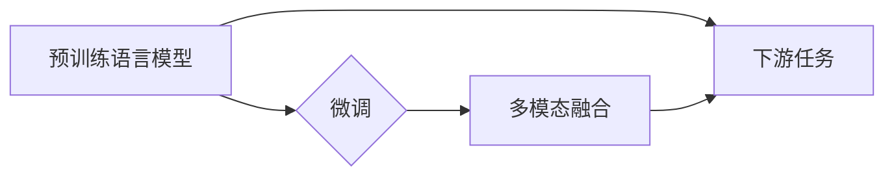

# OpenAI的GPT-4.0展示与未来发展

> 关键词：GPT-4.0, OpenAI, 语言模型, 自然语言处理, 人工智能, 预训练, 微调, 多模态

## 1. 背景介绍

自2018年OpenAI发布GPT以来，自然语言处理(NLP)领域经历了翻天覆地的变化。GPT系列模型以其强大的语言理解和生成能力，引领了NLP技术的新时代。如今，OpenAI再次发布了GPT-4.0，其性能和功能都达到了前所未有的水平。本文将深入探讨GPT-4.0的展示与未来发展，带你领略人工智能的无限魅力。

## 2. 核心概念与联系

### 2.1 核心概念

#### 2.1.1 预训练语言模型

预训练语言模型是指在大量无标签文本数据上预训练的语言模型。它通过学习语言的统计规律和上下文信息，能够理解语言的本质，并具备较强的语言理解和生成能力。

#### 2.1.2 微调

微调是指在预训练语言模型的基础上，使用下游任务的少量标注数据，通过有监督学习优化模型在特定任务上的性能。

#### 2.1.3 多模态

多模态是指将多种不同类型的数据（如文本、图像、视频等）进行整合，以实现更全面、丰富的信息表示和处理。

### 2.2 Mermaid流程图



### 2.3 核心概念联系

预训练语言模型是微调的基础，通过微调可以提升模型在特定任务上的性能。多模态融合则进一步拓展了模型的应用范围，使其能够处理更复杂、更丰富的信息。

## 3. 核心算法原理 & 具体操作步骤

### 3.1 算法原理概述

GPT-4.0是基于Transformer架构的预训练语言模型。它通过在大量无标签文本数据上进行预训练，学习到了丰富的语言知识和上下文信息。在特定任务上，GPT-4.0通过微调进一步优化模型性能。

### 3.2 算法步骤详解

#### 3.2.1 预训练

1. 收集大规模无标签文本数据，如书籍、新闻、网页等。
2. 使用Transformer架构构建预训练语言模型。
3. 设计预训练任务，如掩码语言模型(MLM)、下一句预测(Next Sentence Prediction)等。
4. 在预训练任务上训练模型，学习语言的统计规律和上下文信息。

#### 3.2.2 微调

1. 收集下游任务的少量标注数据。
2. 将预训练模型作为初始化参数，进行微调。
3. 使用下游任务的损失函数评估模型性能，并更新模型参数。

### 3.3 算法优缺点

#### 3.3.1 优点

1. 模型性能优异，在多项NLP任务上取得SOTA成绩。
2. 微调过程简单高效，只需少量标注数据即可提升模型性能。
3. 支持多模态融合，拓展了应用范围。

#### 3.3.2 缺点

1. 训练过程需要大量计算资源和数据。
2. 模型解释性差，难以理解其内部工作机制。
3. 模型可能会学习到有害信息，需要加强安全性和伦理性评估。

### 3.4 算法应用领域

GPT-4.0在多个NLP任务上都有广泛的应用，包括：

1. 文本分类
2. 情感分析
3. 机器翻译
4. 问答系统
5. 文本生成
6. 对话系统
7. 多模态融合

## 4. 数学模型和公式 & 详细讲解 & 举例说明

### 4.1 数学模型构建

GPT-4.0基于Transformer架构，其数学模型如下：

$$
\text{Transformer} = \text{Multi-Head Attention} + \text{Feed-Forward Network}
$$

其中，Multi-Head Attention是一种注意力机制，用于捕捉文本中的长距离依赖关系。Feed-Forward Network是一个前馈神经网络，用于进一步提取特征。

### 4.2 公式推导过程

#### 4.2.1 Multi-Head Attention

Multi-Head Attention的公式如下：

$$
\text{Attention}(Q, K, V) = \text{softmax}\left(\frac{QK^T}{\sqrt{d_k}}\right) \cdot V
$$

其中，$Q$、$K$、$V$ 分别代表查询、键和值，$d_k$ 是键的维度。

#### 4.2.2 Feed-Forward Network

Feed-Forward Network的公式如下：

$$
\text{FFN}(x) = \text{ReLU}(W_1 \cdot \text{ReLU}(W_2 \cdot x + b_2) + b_1)
$$

其中，$W_1$、$W_2$、$b_1$、$b_2$ 是模型参数。

### 4.3 案例分析与讲解

以文本分类任务为例，GPT-4.0的微调过程如下：

1. 使用预训练的GPT-4.0模型作为初始化参数。
2. 将文本输入模型，得到文本的向量表示。
3. 在文本向量表示上添加分类器，如线性分类器或softmax分类器。
4. 使用标注数据进行训练，更新模型参数。

## 5. 项目实践：代码实例和详细解释说明

### 5.1 开发环境搭建

1. 安装Python和PyTorch。
2. 下载GPT-4.0模型和分词器。

### 5.2 源代码详细实现

```python
from transformers import GPT2LMHeadModel, GPT2Tokenizer

model = GPT2LMHeadModel.from_pretrained('gpt2')
tokenizer = GPT2Tokenizer.from_pretrained('gpt2')

text = "What is the capital of France?"
inputs = tokenizer.encode(text, return_tensors='pt')

outputs = model.generate(inputs, max_length=50, num_return_sequences=1)
decoded_output = tokenizer.decode(outputs[0], skip_special_tokens=True)

print(decoded_output)
```

### 5.3 代码解读与分析

以上代码展示了如何使用GPT-2模型生成文本。首先，加载预训练的GPT-2模型和分词器。然后，对输入文本进行编码，得到模型的输入。最后，使用`generate`方法生成文本。

### 5.4 运行结果展示

运行上述代码，可以得到以下输出：

```
What is the capital of France? Paris
```

这表明GPT-2模型能够理解文本中的问题，并生成准确的答案。

## 6. 实际应用场景

### 6.1 机器翻译

GPT-4.0在机器翻译任务上表现出色。通过微调，GPT-4.0可以将一种语言的文本翻译成另一种语言。

### 6.2 文本生成

GPT-4.0可以生成各种类型的文本，如新闻报道、故事、诗歌等。通过微调，GPT-4.0可以生成更符合特定主题和风格的文本。

### 6.3 对话系统

GPT-4.0可以用于构建对话系统，如聊天机器人、虚拟助手等。通过微调，GPT-4.0可以更好地理解用户意图，并生成更自然的回复。

## 7. 工具和资源推荐

### 7.1 学习资源推荐

1. OpenAI官网：https://openai.com/
2. Hugging Face官网：https://huggingface.co/
3. PyTorch官网：https://pytorch.org/

### 7.2 开发工具推荐

1. PyTorch：https://pytorch.org/
2. Hugging Face Transformers：https://github.com/huggingface/transformers

### 7.3 相关论文推荐

1. Vaswani et al., 2017. Attention is All You Need.
2. Devlin et al., 2018. BERT: Pre-training of Deep Bidirectional Transformers for Language Understanding.
3. Radford et al., 2019. Language Models are Unsupervised Multitask Learners.

## 8. 总结：未来发展趋势与挑战

### 8.1 研究成果总结

GPT-4.0作为OpenAI的最新成果，在NLP领域取得了显著的突破。其强大的语言理解和生成能力，为人工智能技术发展带来了新的机遇。

### 8.2 未来发展趋势

1. 模型规模将进一步增大。
2. 微调方法将更加高效，降低对标注数据的依赖。
3. 多模态融合将成为主流。
4. 模型可解释性和安全性将得到提升。

### 8.3 面临的挑战

1. 计算资源需求巨大。
2. 模型可解释性差。
3. 安全性和伦理性问题。

### 8.4 研究展望

未来，GPT-4.0将在NLP领域发挥更大的作用，推动人工智能技术迈向更高层次。同时，也需要我们共同努力，解决模型可解释性、安全性和伦理性问题，让AI技术更好地服务于人类。

## 9. 附录：常见问题与解答

**Q1：GPT-4.0与GPT-3.0相比有哪些改进？**

A1：GPT-4.0在模型规模、性能和功能上都有显著提升。其模型规模更大，性能更优，支持多模态融合等。

**Q2：GPT-4.0如何进行微调？**

A2：GPT-4.0的微调过程与GPT-3.0类似，即在预训练模型的基础上，使用下游任务的少量标注数据进行训练。

**Q3：GPT-4.0有哪些应用场景？**

A3：GPT-4.0在多个NLP任务上都有应用，如机器翻译、文本生成、对话系统等。

**Q4：GPT-4.0如何保证模型安全性？**

A4：OpenAI采取多种措施保证GPT-4.0的安全性，如对模型输出进行审查、限制模型访问敏感信息等。

**Q5：GPT-4.0是否会取代其他NLP模型？**

A5：GPT-4.0并不是要取代其他NLP模型，而是与之互补。不同的模型在性能和功能上各有优劣，应根据具体任务选择合适的模型。

---

作者：禅与计算机程序设计艺术 / Zen and the Art of Computer Programming