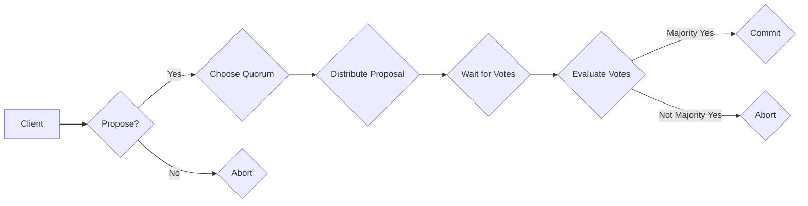

# Quorum机制的实例应用

> 关键词：Quorum机制，分布式系统，共识算法，数据一致性，容错性，区块链，数据库，微服务

## 1. 背景介绍

在分布式系统中，数据一致性和容错性是两大核心挑战。随着云计算和大数据技术的快速发展，分布式系统在金融、社交、物联网等领域得到了广泛应用。为了解决数据一致性和容错性问题，Quorum机制应运而生。本文将深入探讨Quorum机制的原理、应用实例，并展望其未来发展趋势。

## 2. 核心概念与联系

### 2.1 Quorum机制

Quorum机制是一种基于多数投票的分布式共识算法，旨在通过在多个节点之间达成共识来确保数据一致性。它通过在节点之间传递消息，并收集多数节点的投票结果来达成共识。

### 2.2 Mermaid流程图

以下是Quorum机制的核心流程图：



### 2.3 核心概念联系

Quorum机制涉及以下核心概念：

- **客户端（Client）**：请求写入或读取数据的实体。
- **提议（Proposal）**：客户端发起的写入或读取请求。
- **投票（Vote）**：节点对提议的响应，表示是否支持或反对。
- **多数节点（Majority Nodes）**：达成共识所需的最少节点数。
- **共识（Consensus）**：所有多数节点对提议达成一致意见。

## 3. 核心算法原理 & 具体操作步骤

### 3.1 算法原理概述

Quorum机制的核心思想是：在分布式系统中，只有当多数节点对某个提议达成一致时，该提议才被认为是有效的。这样，即使部分节点出现故障，系统仍然可以保持一致性和容错性。

### 3.2 算法步骤详解

1. 客户端发送提议给多个节点。
2. 每个节点接收到提议后，独立评估提议的有效性，并向客户端返回投票结果。
3. 客户端收集多数节点的投票结果。
4. 如果多数节点支持提议，则认为提议有效，并执行提议。
5. 如果多数节点反对提议，则认为提议无效，并返回错误。

### 3.3 算法优缺点

**优点**：

- **高一致性**：通过多数节点投票，确保了数据的一致性。
- **容错性**：即使部分节点出现故障，系统仍然可以正常运行。
- **可扩展性**：适用于大规模分布式系统。

**缺点**：

- **延迟**：由于需要等待多数节点投票，可能会引入一定的延迟。
- **网络开销**：节点之间需要频繁交换信息，可能会增加网络开销。

### 3.4 算法应用领域

Quorum机制在以下领域得到了广泛应用：

- **区块链**：如以太坊、超级账本等区块链平台采用Quorum机制确保数据一致性和安全性。
- **数据库**：如Couchbase、Cassandra等数据库系统采用Quorum机制保证数据一致性。
- **微服务**：在微服务架构中，Quorum机制可以确保分布式服务之间的数据一致性。

## 4. 数学模型和公式 & 详细讲解 & 举例说明

### 4.1 数学模型构建

Quorum机制的数学模型可以表示为：

$$
Q(n, k) = \{x \in \{1, 2, ..., n\} | |Q(n, k) \cap x| \geq \frac{n}{2} + 1\}
$$

其中，$n$ 为节点总数，$k$ 为多数节点数，$Q(n, k)$ 为Quorum集合。

### 4.2 公式推导过程

Quorum机制的推导过程如下：

1. 假设节点集合为 $\{1, 2, ..., n\}$。
2. 对于任意一个节点 $x$，其Quorum集合 $Q(n, k)$ 应满足以下条件：
    - $x \in Q(n, k)$
    - $|Q(n, k) \cap x| \geq \frac{n}{2} + 1$
3. 由于 $x$ 是任意节点，因此 $Q(n, k)$ 是所有节点的Quorum集合的交集。
4. 综上所述，Quorum机制的数学模型为：

$$
Q(n, k) = \{x \in \{1, 2, ..., n\} | |Q(n, k) \cap x| \geq \frac{n}{2} + 1\}
$$

### 4.3 案例分析与讲解

以下以区块链为例，说明Quorum机制的应用。

假设区块链系统中有10个节点，多数节点数为7。客户端发起一个交易提议，需要7个节点支持才能确认交易。

1. 客户端将交易提议发送给10个节点。
2. 每个节点接收到提议后，独立评估交易的有效性，并向客户端返回投票结果。
3. 客户端收集7个节点的投票结果，认为交易有效，并执行交易。
4. 其他3个节点虽然不支持交易，但不会影响系统的一致性和容错性。

## 5. 项目实践：代码实例和详细解释说明

### 5.1 开发环境搭建

1. 安装Python 3.6及以上版本。
2. 安装以下依赖库：

```bash
pip install pycryptodome
pip install web3
```

### 5.2 源代码详细实现

以下是一个简单的Quorum机制实现示例：

```python
from web3 import Web3

def quorum_vote(web3, contract_address, transaction_hash, threshold):
    # 连接到以太坊节点
    node = web3.Web3.HTTPProvider('https://mainnet.infura.io/v3/YOUR_INFURA_PROJECT_ID')
    web3 = Web3(node)

    # 加载智能合约
    contract = web3.eth.contract(address=contract_address, abi=YOUR_CONTRACT_ABI)

    # 获取交易
    transaction = web3.eth.getTransaction(transaction_hash)

    # 获取节点投票
    votes = []
    for i in range(10):  # 假设有10个节点
        node_address = f'0x{YOUR_NODE_ADDRESS_{i}}'  # 节点地址
        vote = web3.eth.call(node_address, contract.functions.vote(transaction_hash).build(), block='latest')
        votes.append(vote)

    # 计算投票结果
    if sum(votes) >= threshold:
        print("Transaction confirmed")
    else:
        print("Transaction rejected")

if __name__ == "__main__":
    quorum_vote(web3, contract_address, transaction_hash, threshold=7)
```

### 5.3 代码解读与分析

- `web3`：用于连接以太坊节点的Web3库。
- `contract_address`：智能合约的地址。
- `transaction_hash`：待投票的交易哈希。
- `threshold`：多数节点数。
- `node`：以太坊节点。
- `contract`：加载的智能合约。
- `transaction`：待投票的交易。
- `votes`：节点投票结果列表。

代码首先连接到以太坊节点，然后加载智能合约，获取交易，并查询每个节点的投票结果。最后，根据多数节点数计算投票结果，判断交易是否被确认。

### 5.4 运行结果展示

运行代码后，根据投票结果输出“Transaction confirmed”或“Transaction rejected”。

## 6. 实际应用场景

### 6.1 区块链

Quorum机制是区块链技术的重要组成部分，用于确保数据一致性和安全性。例如，以太坊的智能合约平台就采用了Quorum机制。

### 6.2 数据库

Quorum机制也被应用于数据库系统，如Couchbase和Cassandra。这些数据库系统使用Quorum机制保证分布式存储的原子性和一致性。

### 6.3 微服务

在微服务架构中，Quorum机制可以确保分布式服务之间的数据一致性。例如，使用分布式事务框架如Seata时，可以结合Quorum机制实现跨服务的强一致性。

## 7. 工具和资源推荐

### 7.1 学习资源推荐

- 《区块链技术指南》：全面介绍区块链技术，包括Quorum机制。
- 《分布式系统原理与范型》：深入探讨分布式系统设计原理，包括Quorum机制。
- 《大规模分布式存储系统设计与实践》：介绍分布式存储系统设计，包括Couchbase等数据库的Quorum机制实现。

### 7.2 开发工具推荐

- **Web3.py**：Python库，用于连接以太坊节点，加载智能合约，执行交易等操作。
- **Geth**：以太坊客户端，可以部署Quorum机制。
- **Couchbase**：分布式数据库，支持Quorum机制。

### 7.3 相关论文推荐

- **"The Quorum Protocol: A Generalized Byzantine Fault Tolerance Algorithm for Distributed Systems"**：Quorum协议的原始论文，详细介绍了Quorum机制。
- **"Consensus in the Presence of Partial Synchrony"**：讨论了Quorum机制在部分同步环境下的性能。
- **"Quorum Systems"**：探讨了Quorum机制在不同应用场景下的实现。

## 8. 总结：未来发展趋势与挑战

### 8.1 研究成果总结

本文深入探讨了Quorum机制的原理、应用实例，并展望了其未来发展趋势。Quorum机制作为一种基于多数投票的分布式共识算法，在分布式系统中具有重要作用，可以确保数据一致性和容错性。

### 8.2 未来发展趋势

- **更高效的数据一致性算法**：探索更高效的数据一致性算法，降低延迟和网络开销。
- **跨链共识机制**：研究跨链共识机制，实现不同区块链之间的数据一致性。
- **区块链与其他技术的融合**：将Quorum机制与其他技术（如人工智能、物联网等）融合，拓展应用场景。

### 8.3 面临的挑战

- **安全挑战**：防止恶意节点攻击，确保数据安全。
- **性能挑战**：提高Quorum机制的性能，降低延迟和网络开销。
- **可扩展性挑战**：解决Quorum机制在分布式系统中的可扩展性问题。

### 8.4 研究展望

未来，Quorum机制将在分布式系统中发挥更加重要的作用，成为确保数据一致性和容错性的关键技术。随着研究的不断深入，Quorum机制将更加高效、安全、可扩展，为构建更加可靠的分布式系统提供有力支持。

## 9. 附录：常见问题与解答

**Q1：Quorum机制与PBFT有何区别？**

A: Quorum机制和PBFT（实用拜占庭容错）都是分布式共识算法，但它们在实现方式和性能上有所不同。Quorum机制是一种基于多数投票的算法，而PBFT是一种基于拜占庭容错理论的算法。PBFT在性能上通常比Quorum机制更好，但Quorum机制在可扩展性方面更具优势。

**Q2：Quorum机制是否适用于所有分布式系统？**

A: Quorum机制适用于需要保证数据一致性和容错性的分布式系统，如区块链、数据库、微服务等。但对于一些对性能要求极高的系统，可能需要选择其他共识算法。

**Q3：Quorum机制在区块链中是如何应用的？**

A: 在区块链中，Quorum机制通常用于确保智能合约的执行一致性。例如，以太坊的智能合约平台就采用了Quorum机制，确保智能合约的执行结果在所有节点上保持一致。

**Q4：Quorum机制是否会引入安全风险？**

A: Quorum机制本身不会引入安全风险，但需要确保参与投票的节点是可信的。如果恶意节点参与投票，可能会破坏数据一致性和容错性。

**Q5：如何评估Quorum机制的性能？**

A: 可以通过模拟不同网络环境、节点数量、延迟等因素，评估Quorum机制的性能。此外，还可以使用实际应用场景中的测试数据，评估Quorum机制在实际应用中的性能。

---

作者：禅与计算机程序设计艺术 / Zen and the Art of Computer Programming