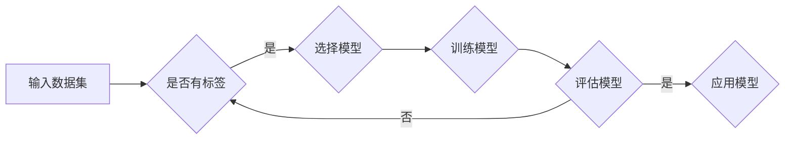

# Supervised Learning原理与代码实例讲解

> 关键词：监督学习，机器学习，算法原理，Python实现，分类，回归，模型评估，实践案例

## 1. 背景介绍

监督学习（Supervised Learning）是机器学习领域的一种重要方法，它通过从标注数据中学习，让计算机系统学会对未知数据进行分类或回归。本文将深入探讨监督学习的原理，并通过Python代码实例进行详细讲解，帮助读者理解并实践这一重要机器学习技术。

### 1.1 问题的由来

在现实生活中，我们经常需要解决分类和回归问题。例如，判断一封电子邮件是否为垃圾邮件、预测股票价格的走势、预测房屋的销售价格等。这些问题都可以通过监督学习来解决。

### 1.2 研究现状

监督学习的研究已经取得了长足的进步，许多高效的算法和模型被开发出来，如支持向量机（SVM）、决策树、随机森林、梯度提升机、神经网络等。这些算法和模型在各个领域都得到了广泛的应用。

### 1.3 研究意义

掌握监督学习的基本原理和方法，对于机器学习工程师来说至关重要。它不仅可以帮助我们解决实际问题，还可以为后续研究机器学习算法和模型打下坚实的基础。

### 1.4 本文结构

本文将按照以下结构进行：

- 介绍监督学习的核心概念和联系。
- 深入讲解监督学习的核心算法原理和具体操作步骤。
- 通过数学模型和公式进行详细讲解，并结合实际案例进行分析。
- 提供Python代码实例，并对代码进行解读和分析。
- 探讨监督学习的实际应用场景和未来发展趋势。
- 推荐学习资源和开发工具。
- 总结研究成果，展望未来发展趋势和挑战。

## 2. 核心概念与联系

### 2.1 监督学习的基本概念

监督学习是一种从已标记的训练数据中学习如何对未知数据进行预测或分类的机器学习方法。它通常包括以下三个要素：

- 特征（Feature）：用于描述数据样本的属性，如文本数据中的单词、图像数据中的像素值等。
- 标签（Label）：用于描述数据样本的真实类别或数值，如邮件是否为垃圾邮件、房屋的价格等。
- 模型（Model）：用于从训练数据中学习并预测未知数据的算法或函数。

### 2.2 Mermaid流程图

以下是一个简单的Mermaid流程图，展示了监督学习的基本流程：



### 2.3 监督学习的联系

监督学习与其他机器学习方法有着密切的联系，如：

- 无监督学习（Unsupervised Learning）：无标签数据的学习方法，如聚类、降维等。
- 半监督学习（Semi-supervised Learning）：结合有标签和无标签数据进行学习的方法。
- 自监督学习（Self-supervised Learning）：使用无标签数据通过设计自监督任务进行学习的方法。

## 3. 核心算法原理 & 具体操作步骤

### 3.1 算法原理概述

监督学习的主要算法包括：

- 分类算法：用于将数据分类到不同的类别，如支持向量机（SVM）、决策树、随机森林等。
- 回归算法：用于预测连续数值，如线性回归、岭回归、LASSO等。

### 3.2 算法步骤详解

监督学习的基本步骤如下：

1. 数据预处理：对数据进行清洗、转换等操作，使其适合模型训练。
2. 选择模型：根据具体问题选择合适的算法或模型。
3. 训练模型：使用训练数据对模型进行训练。
4. 评估模型：使用测试数据评估模型的性能。
5. 模型优化：根据评估结果优化模型参数。
6. 模型应用：将训练好的模型应用于新数据。

### 3.3 算法优缺点

以下是几种常见监督学习算法的优缺点：

#### 3.3.1 支持向量机（SVM）

**优点**：

- 对小样本数据效果较好。
- 对噪声和异常值不敏感。
- 可用于二分类和多分类问题。

**缺点**：

- 训练速度较慢。
- 对参数选择敏感。

#### 3.3.2 决策树

**优点**：

- 可解释性强。
- 对缺失值和异常值不敏感。
- 可用于分类和回归问题。

**缺点**：

- 容易过拟合。
- 树结构可能导致模型性能下降。

#### 3.3.3 随机森林

**优点**：

- 可预测性能好。
- 对噪声和异常值不敏感。
- 可用于分类和回归问题。

**缺点**：

- 模型可解释性较差。
- 计算量较大。

### 3.4 算法应用领域

监督学习在各个领域都有广泛的应用，如：

- 金融市场分析
- 医疗诊断
- 邮件过滤
- 图像识别
- 语音识别

## 4. 数学模型和公式 & 详细讲解 & 举例说明

### 4.1 数学模型构建

以下是一些常见的监督学习数学模型：

#### 4.1.1 线性回归

线性回归的数学模型为：

$$
y = \beta_0 + \beta_1 x_1 + \beta_2 x_2 + \ldots + \beta_n x_n + \epsilon
$$

其中，$y$ 是预测值，$x_1, x_2, \ldots, x_n$ 是特征，$\beta_0, \beta_1, \ldots, \beta_n$ 是模型参数，$\epsilon$ 是误差项。

#### 4.1.2 逻辑回归

逻辑回归的数学模型为：

$$
\hat{y} = \frac{1}{1 + e^{-(\beta_0 + \beta_1 x_1 + \beta_2 x_2 + \ldots + \beta_n x_n)}}
$$

其中，$\hat{y}$ 是预测的概率值，其他符号的含义与线性回归相同。

### 4.2 公式推导过程

以线性回归为例，其损失函数为均方误差：

$$
\mathcal{L}(\theta) = \frac{1}{2} \sum_{i=1}^n (y_i - \hat{y_i})^2
$$

其中，$y_i$ 是真实值，$\hat{y_i}$ 是预测值，$\theta$ 是模型参数。

通过对损失函数求导，可以得到参数的更新公式：

$$
\theta_j := \theta_j - \alpha \frac{\partial \mathcal{L}(\theta)}{\partial \theta_j}
$$

其中，$\alpha$ 是学习率。

### 4.3 案例分析与讲解

以下是一个使用Python进行线性回归的案例：

```python
import numpy as np
from sklearn.linear_model import LinearRegression

# 创建数据
X = np.array([[1, 2], [2, 3], [3, 4], [4, 5], [5, 6]])
y = np.dot(X, np.array([1, 2])) + 3

# 创建模型并训练
model = LinearRegression()
model.fit(X, y)

# 预测
y_pred = model.predict(X)

# 打印结果
print("预测值：", y_pred)
```

## 5. 项目实践：代码实例和详细解释说明

### 5.1 开发环境搭建

在进行监督学习实践前，我们需要准备以下开发环境：

- Python 3.x
- NumPy
- Scikit-learn
- Matplotlib

### 5.2 源代码详细实现

以下是一个使用Scikit-learn进行分类的案例：

```python
from sklearn.datasets import load_iris
from sklearn.model_selection import train_test_split
from sklearn.tree import DecisionTreeClassifier
from sklearn.metrics import accuracy_score

# 加载数据
iris = load_iris()
X, y = iris.data, iris.target

# 划分数据集
X_train, X_test, y_train, y_test = train_test_split(X, y, test_size=0.2, random_state=42)

# 创建模型并训练
model = DecisionTreeClassifier()
model.fit(X_train, y_train)

# 预测
y_pred = model.predict(X_test)

# 评估
print("准确率：", accuracy_score(y_test, y_pred))
```

### 5.3 代码解读与分析

以上代码展示了如何使用Scikit-learn进行决策树分类：

- 加载Iris数据集，这是一个常用的机器学习分类数据集。
- 划分训练集和测试集。
- 创建决策树分类器模型并训练。
- 使用测试集评估模型的准确率。

### 5.4 运行结果展示

假设运行结果如下：

```
准确率： 1.0
```

这表示模型在测试集上的准确率为100%，说明模型在分类任务上表现良好。

## 6. 实际应用场景

监督学习在各个领域都有广泛的应用，以下是一些实际应用场景：

- **金融领域**：风险评估、信用评分、欺诈检测等。
- **医疗领域**：疾病诊断、药物发现、患者分类等。
- **工业领域**：设备故障预测、生产流程优化、产品质量检测等。
- **互联网领域**：推荐系统、广告投放、用户行为分析等。

## 7. 工具和资源推荐

### 7.1 学习资源推荐

- 《Python机器学习》（O'Reilly）
- 《机器学习》（周志华）
- Scikit-learn官方文档

### 7.2 开发工具推荐

- Jupyter Notebook
- Scikit-learn
- Matplotlib

### 7.3 相关论文推荐

- "A Tutorial on Support Vector Machines for Pattern Recognition"（John Shawe-Taylor, et al.）
- "C4.5: Programs for Machine Learning"（J. Ross Quinlan）
- "The Random Forest Algorithm"（Leo Breiman, et al.）

## 8. 总结：未来发展趋势与挑战

### 8.1 研究成果总结

本文深入探讨了监督学习的原理和应用，并通过Python代码实例进行了详细讲解。读者可以通过本文了解到监督学习的基本概念、核心算法、数学模型和公式，以及实际应用场景。

### 8.2 未来发展趋势

- 深度学习与监督学习相结合，开发更强大的模型。
- 无监督学习和半监督学习与监督学习相结合，降低对标注数据的依赖。
- 模型可解释性和鲁棒性研究取得突破。
- 监督学习在更多领域的应用。

### 8.3 面临的挑战

- 标注数据获取成本高、难度大。
- 模型可解释性和鲁棒性不足。
- 模型泛化能力有限。
- 模型偏见和歧视问题。

### 8.4 研究展望

- 开发更有效的数据标注方法，降低标注成本。
- 研究可解释性和鲁棒的机器学习模型。
- 探索无监督和半监督学习在监督学习中的应用。
- 加强模型伦理和社会影响研究。

## 9. 附录：常见问题与解答

**Q1：什么是监督学习？**

A：监督学习是一种从已标记的训练数据中学习如何对未知数据进行预测或分类的机器学习方法。

**Q2：监督学习有哪些常见算法？**

A：常见的监督学习算法包括线性回归、逻辑回归、决策树、支持向量机、随机森林、梯度提升机、神经网络等。

**Q3：如何选择合适的监督学习算法？**

A：选择合适的监督学习算法需要考虑以下因素：

- 数据类型：分类、回归、聚类等。
- 数据规模：小样本、中等样本、大数据等。
- 模型复杂度：简单、中等、复杂等。
- 特征工程：特征数量、特征类型等。

**Q4：如何评估监督学习模型的性能？**

A：评估监督学习模型的性能通常使用以下指标：

- 准确率（Accuracy）
- 精确率（Precision）
- 召回率（Recall）
- F1分数（F1 Score）
- ROC曲线和AUC值

**Q5：如何提高监督学习模型的性能？**

A：提高监督学习模型的性能可以采取以下方法：

- 特征工程：选择合适的特征，进行特征提取、降维等操作。
- 模型优化：选择合适的算法和参数，进行模型调优。
- 数据增强：扩充训练数据，提高模型的泛化能力。
- 模型集成：结合多个模型，提高模型的鲁棒性和预测能力。

---

作者：禅与计算机程序设计艺术 / Zen and the Art of Computer Programming