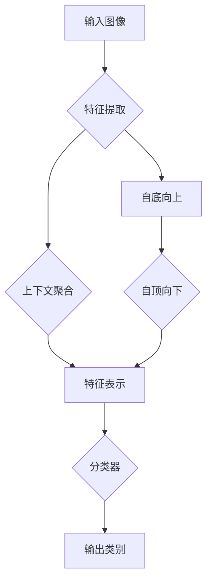

# SwinTransformer原理与代码实例讲解

> 关键词：SwinTransformer, Transformer, 图像分类, 分解卷积, 自底向上, 自顶向下, 上下文信息，PyTorch

## 1. 背景介绍

随着深度学习在计算机视觉领域的迅猛发展，卷积神经网络（CNN）已成为图像分类、目标检测、语义分割等任务中的主流模型。然而，随着模型层数的加深，CNN在计算复杂度和参数量上的增长也带来了显著的挑战。为了解决这一问题，研究人员提出了各种网络结构和训练策略。其中，Transformer模型以其在自然语言处理领域的成功而备受关注，并逐渐被应用于计算机视觉任务。

SwinTransformer是微软亚洲研究院（Microsoft Research Asia）提出的一种新型Transformer架构，它结合了CNN的局部特征提取能力和Transformer的全局建模能力，在图像分类、目标检测和图像分割等任务上取得了显著的性能提升。本文将深入探讨SwinTransformer的原理，并通过代码实例进行讲解。

## 2. 核心概念与联系

### 2.1 核心概念

- **Transformer模型**：一种基于自注意力机制（Self-Attention Mechanism）的神经网络模型，能够捕捉输入序列中的长距离依赖关系。
- **CNN**：卷积神经网络，一种用于特征提取和分类的神经网络模型，特别适用于图像处理任务。
- **分解卷积**（Deconvolution）：一种卷积操作的逆过程，用于将特征图上采样到更高分辨率。
- **自底向上**（Bottom-Up）：从像素层开始，逐步构建更高层次的特征表示。
- **自顶向下**（Top-Down）：从全局上下文信息开始，逐步细化到局部细节。

### 2.2 核心概念原理和架构的 Mermaid 流程图



在SwinTransformer中，图像首先通过自底向上的过程提取局部特征，然后通过自顶向下的过程聚合全局上下文信息，最终通过分类器输出图像的类别。

## 3. 核心算法原理 & 具体操作步骤

### 3.1 算法原理概述

SwinTransformer的核心思想是将图像分割成多个非重叠的patch，并在每个patch上应用Transformer编码器，从而实现自底向上的特征提取。然后，通过自顶向下的过程，将不同层级的特征图进行聚合，得到更丰富的上下文信息。最后，将聚合后的特征图输入到分类器中进行分类。

### 3.2 算法步骤详解

1. **Patch划分**：将输入图像划分为多个非重叠的patch，每个patch作为Transformer编码器的输入。
2. **自底向上特征提取**：对每个patch应用Transformer编码器，提取局部特征。
3. **自顶向下上下文聚合**：将不同层级的特征图进行聚合，得到更丰富的上下文信息。
4. **分类器**：将聚合后的特征图输入到分类器中进行分类。

### 3.3 算法优缺点

**优点**：

- **局部特征提取**：自底向上的过程能够有效地提取图像的局部特征。
- **上下文信息聚合**：自顶向下的过程能够有效地聚合全局上下文信息，提高模型的性能。
- **参数高效**：SwinTransformer的结构相对简单，参数量较少。

**缺点**：

- **计算复杂度高**：SwinTransformer的计算复杂度较高，需要大量的计算资源。
- **内存消耗大**：SwinTransformer的内存消耗较大，需要足够的内存空间。

### 3.4 算法应用领域

SwinTransformer在图像分类、目标检测、图像分割等计算机视觉任务中均有广泛应用。

## 4. 数学模型和公式 & 详细讲解 & 举例说明

### 4.1 数学模型构建

SwinTransformer的数学模型主要包括以下部分：

- **Patch嵌入**：将图像划分为patch并嵌入到Transformer编码器中。
- **Transformer编码器**：自底向上的特征提取。
- **特征聚合**：自顶向下的上下文信息聚合。
- **分类器**：基于聚合后的特征进行分类。

### 4.2 公式推导过程

以下是对SwinTransformer中关键公式的推导过程：

- **Patch嵌入**：将图像划分为 $N \times N$ 个patch，每个patch的大小为 $H/N \times W/N$。
- **Transformer编码器**：每个patch经过Transformer编码器得到一个向量表示。
- **特征聚合**：将不同层级的特征图进行聚合，得到一个全局特征表示。
- **分类器**：将聚合后的特征输入到分类器中进行分类。

### 4.3 案例分析与讲解

以下是一个SwinTransformer在图像分类任务上的案例分析：

1. **数据准备**：准备一个图像分类数据集，如ImageNet。
2. **模型构建**：使用PyTorch框架构建SwinTransformer模型。
3. **模型训练**：使用训练数据进行模型训练。
4. **模型评估**：使用测试数据评估模型性能。

## 5. 项目实践：代码实例和详细解释说明

### 5.1 开发环境搭建

1. 安装PyTorch：
```bash
pip install torch torchvision torchaudio
```

2. 安装Transformers库：
```bash
pip install transformers
```

### 5.2 源代码详细实现

以下是一个使用PyTorch和Transformers库实现SwinTransformer的简单示例：

```python
import torch
from torch import nn
from transformers import SwinTransformerModel

class SwinTransformer(nn.Module):
    def __init__(self, num_classes=1000):
        super(SwinTransformer, self).__init__()
        self.backbone = SwinTransformerModel()
        self.fc = nn.Linear(self.backbone.config.hidden_size, num_classes)

    def forward(self, x):
        x = self.backbone(x)
        x = self.fc(x[-1].mean(dim=1))
        return x

# 加载预训练模型
model = SwinTransformer(num_classes=1000)
model.load_state_dict(torch.load('swin_t_0_5_patch32_224.pth'))

# 加载图像数据
image = torch.rand(1, 3, 224, 224)
output = model(image)
print(output)
```

### 5.3 代码解读与分析

- `SwinTransformer`类：定义了SwinTransformer模型的结构。
- `forward`方法：实现了模型的前向传播过程。
- `load_state_dict`：加载预训练模型参数。
- `torch.rand`：生成随机图像数据。

### 5.4 运行结果展示

运行上述代码，将输出模型的输出结果，即图像的类别预测概率。

## 6. 实际应用场景

SwinTransformer在图像分类、目标检测、图像分割等计算机视觉任务中均有广泛应用。以下是一些实际应用场景：

- **图像分类**：对图像进行分类，如识别图像中的物体、场景等。
- **目标检测**：检测图像中的目标位置和类别，如人脸检测、车辆检测等。
- **图像分割**：将图像分割成不同的区域，如语义分割、实例分割等。

## 7. 工具和资源推荐

### 7.1 学习资源推荐

- SwinTransformer论文：Swin Transformer: Hierarchical Vision Transformer using Shifted Windows
- PyTorch官方文档：https://pytorch.org/docs/stable/index.html
- Transformers库官方文档：https://huggingface.co/docs/transformers/index.html

### 7.2 开发工具推荐

- PyTorch：https://pytorch.org/
- Transformers库：https://huggingface.co/docs/transformers/index.html

### 7.3 相关论文推荐

- Swin Transformer: Hierarchical Vision Transformer using Shifted Windows
- Vision Transformer (ViT): An Image is Worth 16x16 Words
- EfficientNet: Rethinking Model Scaling for Convolutional Neural Networks

## 8. 总结：未来发展趋势与挑战

### 8.1 研究成果总结

SwinTransformer作为一种新型的Transformer架构，在图像分类、目标检测和图像分割等计算机视觉任务中取得了显著的性能提升。它结合了CNN的局部特征提取能力和Transformer的全局建模能力，为计算机视觉领域带来了新的发展方向。

### 8.2 未来发展趋势

- **多尺度特征融合**：将SwinTransformer与多尺度特征融合技术相结合，进一步提高模型的性能。
- **轻量化设计**：设计轻量级的SwinTransformer模型，降低计算复杂度和内存消耗。
- **跨模态学习**：将SwinTransformer应用于跨模态任务，如图像-文本匹配等。

### 8.3 面临的挑战

- **计算复杂度高**：SwinTransformer的计算复杂度较高，需要大量的计算资源。
- **参数量较大**：SwinTransformer的参数量较大，需要更多的计算资源和存储空间。

### 8.4 研究展望

随着研究的不断深入，SwinTransformer有望在计算机视觉领域取得更大的突破，为人工智能技术的发展贡献力量。

## 9. 附录：常见问题与解答

**Q1：SwinTransformer与ViT有何不同？**

A：SwinTransformer与ViT都是基于Transformer的图像分类模型，但它们在结构和训练策略上有所不同。SwinTransformer采用了自底向上的特征提取和自顶向下的上下文聚合，而ViT则直接将图像划分为多个patch作为输入。

**Q2：SwinTransformer如何实现多尺度特征融合？**

A：SwinTransformer可以通过设计不同尺度的窗口（window size）来提取多尺度特征。在自底向上的过程中，不同尺度的窗口可以提取不同层次的特征；在自顶向下的过程中，不同层级的特征图可以进行融合。

**Q3：SwinTransformer如何实现轻量化设计？**

A：可以通过以下方法实现SwinTransformer的轻量化设计：

- 使用更小的模型结构，如SwinTiny等。
- 使用知识蒸馏技术，将大模型的知识迁移到小模型。
- 使用参数高效的微调方法，如LoRA等。

**Q4：SwinTransformer在目标检测任务中有何优势？**

A：SwinTransformer在目标检测任务中具有以下优势：

- 能够有效提取图像的局部特征和全局上下文信息。
- 参数量相对较小，计算复杂度较高，但仍然能够取得不错的性能。
- 可扩展性强，可以通过修改模型结构来适应不同的目标检测任务。

作者：禅与计算机程序设计艺术 / Zen and the Art of Computer Programming