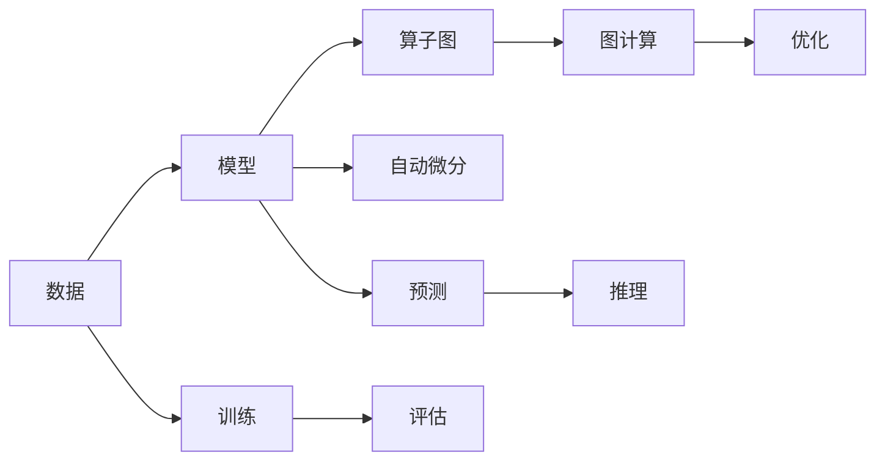

# TensorFlow 原理与代码实战案例讲解

> 关键词：TensorFlow, 深度学习, 机器学习, 神经网络, 自动微分, 算子图, 图计算, 实战案例

## 1. 背景介绍

TensorFlow 是由 Google Brain 团队开发的开源机器学习框架，自 2015 年开源以来，已成为深度学习领域的首选平台。它提供了灵活的编程接口，支持各种神经网络结构的构建和训练，并具备强大的分布式计算能力。本文将深入讲解 TensorFlow 的原理，并结合实战案例，帮助读者全面掌握 TensorFlow 的使用方法。

### 1.1 问题的由来

随着大数据和计算能力的提升，机器学习在各个领域得到了广泛应用。然而，机器学习算法的实现往往需要复杂的数学和编程技巧，这对于非专业人士来说是一个挑战。TensorFlow 的出现，极大地简化了机器学习算法的实现过程，使得深度学习技术更加普及。

### 1.2 研究现状

TensorFlow 具有以下特点：

- 支持多种深度学习模型，包括卷积神经网络（CNN）、循环神经网络（RNN）、Transformer 等。
- 提供自动微分机制，简化了复杂的数学计算。
- 支持分布式计算，适用于大规模数据集和模型训练。
- 具有丰富的生态系统，包括预训练模型、工具和库。

### 1.3 研究意义

TensorFlow 的出现对于机器学习和深度学习领域具有重要意义：

- 降低机器学习算法实现的门槛，使得更多开发者能够参与到人工智能的研究和开发中。
- 促进深度学习技术的普及和应用，推动人工智能技术的发展。
- 提高机器学习模型的开发效率，降低开发成本。

## 2. 核心概念与联系

以下是 TensorFlow 的一些核心概念及其相互关系：



**概念解释**：

- **数据**：机器学习模型的基础，包括输入数据和标签。
- **模型**：由神经网络等结构组成的计算图，用于表示学习过程。
- **算子图**：由一系列算子组成的图，用于表示模型中的计算步骤。
- **自动微分**：自动计算梯度，简化了复杂的数学计算。
- **图计算**：通过计算图进行高效计算。
- **优化**：通过调整模型参数，优化模型性能。
- **训练**：使用数据训练模型。
- **评估**：评估模型性能。
- **预测**：使用训练好的模型进行预测。
- **推理**：将预测结果应用到实际场景中。

## 3. 核心算法原理 & 具体操作步骤

### 3.1 算法原理概述

TensorFlow 的核心原理是图计算和自动微分。图计算将计算过程表示为计算图，自动微分则自动计算梯度，简化了复杂的数学计算。

### 3.2 算法步骤详解

TensorFlow 的基本步骤如下：

1. **定义计算图**：使用 TensorFlow 的编程接口定义计算图，包括输入、算子、输出等。
2. **创建会话**：创建一个会话，用于执行计算图中的操作。
3. **初始化变量**：初始化模型参数和变量。
4. **执行训练**：使用训练数据训练模型。
5. **评估模型**：评估模型性能。
6. **保存和加载模型**：保存和加载模型参数。

### 3.3 算法优缺点

**优点**：

- 灵活的编程接口，支持多种深度学习模型。
- 支持分布式计算，适用于大规模数据集和模型训练。
- 丰富的生态系统，包括预训练模型、工具和库。

**缺点**：

- 学习曲线较陡峭，需要一定的编程基础。
- 相比其他框架，TensorFlow 的性能可能略逊一筹。

### 3.4 算法应用领域

TensorFlow 在以下领域得到了广泛应用：

- 语音识别
- 图像识别
- 自然语言处理
- 推荐系统
- 医疗诊断

## 4. 数学模型和公式 & 详细讲解 & 举例说明

### 4.1 数学模型构建

以下是一个简单的神经网络模型，用于二分类任务：

$$
h_{\theta}(x) = \sigma(\theta^T x)
$$

其中，$\sigma$ 是 sigmoid 函数，$\theta$ 是模型参数，$x$ 是输入数据。

### 4.2 公式推导过程

以下是损失函数的推导过程：

$$
L(\theta) = -\frac{1}{m} \sum_{i=1}^{m} [y^{(i)} \log(h_{\theta}(x^{(i)})) + (1 - y^{(i)}) \log(1 - h_{\theta}(x^{(i)}))]
$$

其中，$m$ 是样本数量，$y^{(i)}$ 是第 $i$ 个样本的真实标签，$h_{\theta}(x^{(i)})$ 是第 $i$ 个样本的预测标签。

### 4.3 案例分析与讲解

以下是一个使用 TensorFlow 实现的简单神经网络模型的代码示例：

```python
import tensorflow as tf

# 定义模型
model = tf.keras.Sequential([
    tf.keras.layers.Dense(10, activation='relu', input_shape=(input_size,)),
    tf.keras.layers.Dense(1, activation='sigmoid')
])

# 编译模型
model.compile(optimizer='adam', loss='binary_crossentropy', metrics=['accuracy'])

# 训练模型
model.fit(x_train, y_train, epochs=10)

# 评估模型
model.evaluate(x_test, y_test)
```

## 5. 项目实践：代码实例和详细解释说明

### 5.1 开发环境搭建

以下是使用 TensorFlow 进行开发所需的步骤：

1. 安装 TensorFlow 库：`pip install tensorflow`
2. 安装依赖库：`pip install numpy pandas scikit-learn matplotlib`
3. 选择合适的开发环境：Jupyter Notebook、PyCharm 等

### 5.2 源代码详细实现

以下是一个使用 TensorFlow 实现图像识别的代码示例：

```python
import tensorflow as tf
from tensorflow.keras.models import Sequential
from tensorflow.keras.layers import Conv2D, MaxPooling2D, Flatten, Dense, Dropout
from tensorflow.keras.preprocessing.image import ImageDataGenerator

# 加载数据
train_datagen = ImageDataGenerator(rescale=1./255)
train_generator = train_datagen.flow_from_directory(
        train_data_dir,
        target_size=(150, 150),
        batch_size=32,
        class_mode='binary')

validation_datagen = ImageDataGenerator(rescale=1./255)
validation_generator = validation_datagen.flow_from_directory(
        validation_data_dir,
        target_size=(150, 150),
        batch_size=32,
        class_mode='binary')

# 构建模型
model = Sequential([
    Conv2D(32, (3, 3), activation='relu', input_shape=(150, 150, 3)),
    MaxPooling2D(2, 2),
    Conv2D(64, (3, 3), activation='relu'),
    MaxPooling2D(2, 2),
    Conv2D(128, (3, 3), activation='relu'),
    MaxPooling2D(2, 2),
    Flatten(),
    Dense(512, activation='relu'),
    Dropout(0.5),
    Dense(1, activation='sigmoid')
])

# 编译模型
model.compile(optimizer='adam', loss='binary_crossentropy', metrics=['accuracy'])

# 训练模型
model.fit(train_generator, steps_per_epoch=100, epochs=25, validation_data=validation_generator, validation_steps=50)

# 评估模型
test_loss, test_acc = model.evaluate(validation_generator, steps=50)
```

### 5.3 代码解读与分析

以上代码使用 TensorFlow 的 Keras 子库构建了一个简单的卷积神经网络模型，用于图像识别任务。首先，使用 `ImageDataGenerator` 加载数据并进行预处理。然后，构建模型结构，包括卷积层、池化层、全连接层和 Dropout 层。最后，编译模型、训练模型并评估模型性能。

### 5.4 运行结果展示

运行以上代码，将在训练过程中打印出训练集和验证集的 loss 和 accuracy。训练完成后，会在验证集上评估模型性能。

## 6. 实际应用场景

TensorFlow 在以下领域得到了广泛应用：

- **图像识别**：例如，使用 TensorFlow 构建图像分类器，用于识别图像中的物体。
- **自然语言处理**：例如，使用 TensorFlow 构建文本分类器，用于情感分析或主题分类。
- **语音识别**：例如，使用 TensorFlow 构建语音识别系统，将语音信号转换为文本。
- **推荐系统**：例如，使用 TensorFlow 构建推荐系统，为用户推荐商品或内容。
- **医疗诊断**：例如，使用 TensorFlow 构建医疗诊断系统，辅助医生进行疾病诊断。

## 7. 工具和资源推荐

### 7.1 学习资源推荐

- TensorFlow 官方文档：https://www.tensorflow.org/
- TensorFlow 教程：https://www.tensorflow.org/tutorials
- TensorFlow 论坛：https://forums.tensorflow.org/

### 7.2 开发工具推荐

- Jupyter Notebook：https://jupyter.org/
- PyCharm：https://www.jetbrains.com/pycham/
- Google Colab：https://colab.research.google.com/

### 7.3 相关论文推荐

- "TensorFlow: Large-Scale Machine Learning on Heterogeneous Systems" by Martın Abadi et al.
- "Deep Learning with TensorFlow" by Ian Goodfellow, Yoshua Bengio, Aaron Courville

## 8. 总结：未来发展趋势与挑战

### 8.1 研究成果总结

TensorFlow 作为一款优秀的机器学习框架，在深度学习领域取得了显著的成果。它不仅为研究者提供了强大的工具，也为开发者降低了机器学习算法实现的门槛。

### 8.2 未来发展趋势

- TensorFlow 将继续优化性能，提高计算效率。
- TensorFlow 将支持更多新的机器学习算法和模型。
- TensorFlow 将与其他人工智能框架进行整合，构建更加完善的生态系统。

### 8.3 面临的挑战

- TensorFlow 的学习曲线较陡峭，需要一定的编程基础。
- TensorFlow 的性能在某些情况下可能不如其他框架。
- TensorFlow 的生态系统需要进一步完善。

### 8.4 研究展望

TensorFlow 将在未来的机器学习和深度学习领域发挥更加重要的作用，推动人工智能技术的发展。

## 9. 附录：常见问题与解答

**Q1：TensorFlow 和其他机器学习框架有什么区别？**

A1：TensorFlow 是一款开源的机器学习框架，具有以下特点：

- 支持多种深度学习模型。
- 提供自动微分机制。
- 支持分布式计算。
- 具有丰富的生态系统。

其他机器学习框架如 PyTorch、Keras 等也具有类似的功能，但 TensorFlow 在某些方面具有独特的优势。

**Q2：如何选择合适的 TensorFlow 模型？**

A2：选择合适的 TensorFlow 模型需要考虑以下因素：

- 任务类型：例如，图像识别、自然语言处理等。
- 数据集规模：例如，大规模数据集需要使用更复杂的模型。
- 计算资源：例如，GPU、CPU 等。

**Q3：如何优化 TensorFlow 模型性能？**

A3：以下是一些优化 TensorFlow 模型性能的方法：

- 选择合适的优化器。
- 使用适当的批量大小。
- 使用正则化技术。
- 使用数据增强技术。

**Q4：TensorFlow 的分布式计算如何实现？**

A4：TensorFlow 提供了分布式计算的功能，可以将计算任务分发到多个设备上进行执行。具体实现方式包括：

- 分布式训练：将模型参数和数据分发到多个设备上进行训练。
- 分布式推理：将推理任务分发到多个设备上进行执行。

**Q5：TensorFlow 的模型如何部署到生产环境？**

A5：将 TensorFlow 模型部署到生产环境需要以下步骤：

- 保存和加载模型：使用 TensorFlow 的 `save` 和 `load` 方法保存和加载模型。
- 部署模型：使用 TensorFlow Serving、TensorFlow Lite 或其他部署工具将模型部署到生产环境。

作者：禅与计算机程序设计艺术 / Zen and the Art of Computer Programming