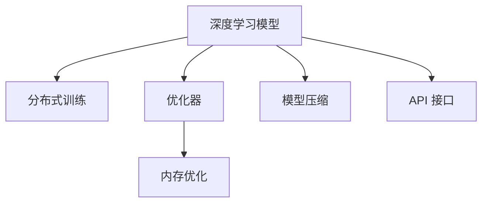
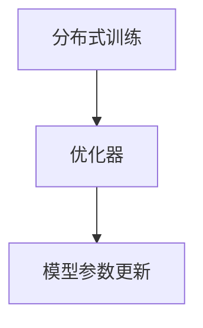
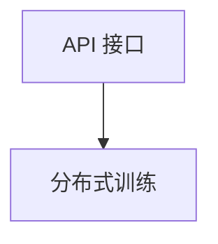
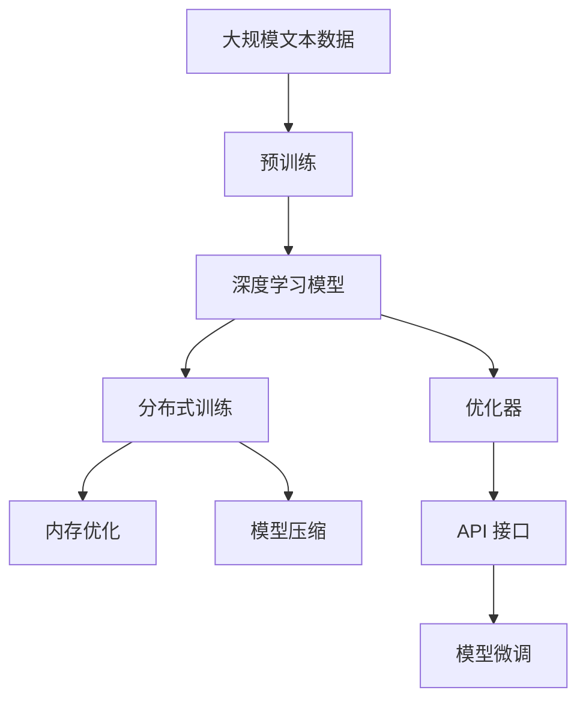

                 

# 大语言模型原理与工程实践：大语言模型训练工程实践DeepSpeed 架构

> 关键词：大语言模型,深度学习,工程实践,DeepSpeed,模型架构,高性能计算,分布式训练,优化器

## 1. 背景介绍

### 1.1 问题由来

随着深度学习技术的快速发展，大规模语言模型（Large Language Models, LLMs）在自然语言处理（Natural Language Processing, NLP）领域取得了巨大突破。这些大模型通过在大规模无标签文本数据上进行预训练，学习到了丰富的语言知识和常识，能够执行各种复杂的语言任务，如自然语言理解、机器翻译、对话生成等。然而，大模型的训练需要极大的计算资源，通常需要数千个GPU或TPU进行大规模并行计算，导致训练时间漫长、成本高昂，严重制约了其大规模应用。

为了解决这一问题，DeepSpeed 项目应运而生。DeepSpeed 是一个开源的深度学习框架，旨在提供高效、可扩展、可定制的分布式深度学习训练和推理平台，支持大规模预训练和微调模型的开发，旨在降低深度学习训练的资源需求，加速大模型的落地应用。本文将详细探讨使用 DeepSpeed 进行大语言模型训练的原理与工程实践，希望能为深度学习工程师提供实用的指导。

### 1.2 问题核心关键点

DeepSpeed 项目包含多个模块，主要包括以下几个关键组件：

- **分布式训练**：支持大规模数据并行训练，提高训练速度和效率。
- **优化器**：提供高效的优化器实现，如 Adam、SGD、Adagrad 等，并支持自适应学习率、混合精度等优化策略。
- **内存优化**：优化内存使用，支持多 GPU/TPU 混合并行训练，提高内存利用率。
- **模型压缩**：实现模型量化、剪枝等技术，减小模型尺寸，提高推理速度。
- **API 接口**：提供简单易用的 API，支持自定义模型和训练策略，提高开发效率。

这些关键组件共同构成了 DeepSpeed 的工程实践架构，使得深度学习工程师能够更加灵活、高效地进行大语言模型的训练和优化。

### 1.3 问题研究意义

DeepSpeed 项目的研究和应用具有重要意义：

1. **加速模型训练**：通过高效的分布式训练和内存优化技术，能够显著降低模型训练的时间和资源需求，加速大模型的预训练和微调。
2. **支持大规模应用**：能够支持大规模预训练和微调模型的开发，提高模型的普适性和可扩展性，适用于各种 NLP 任务和应用场景。
3. **优化算法实现**：提供高效的优化器实现和优化策略，提高模型的训练速度和收敛速度。
4. **促进模型部署**：支持模型压缩和量化技术，减小模型尺寸，提高推理速度，促进模型的部署和应用。
5. **提高开发效率**：提供简单易用的 API 接口，支持自定义模型和训练策略，提高开发效率和灵活性。

## 2. 核心概念与联系

### 2.1 核心概念概述

为更好地理解 DeepSpeed 架构及其在大语言模型训练中的应用，本节将介绍几个密切相关的核心概念：

- **深度学习模型**：基于神经网络架构的模型，通过学习大规模数据集中的特征，进行复杂的语言任务处理。
- **分布式训练**：通过将大规模数据集并行分配到多个计算节点上进行训练，提高训练效率和资源利用率。
- **优化器**：用于更新模型参数的算法，通过最小化损失函数来提高模型的预测能力。
- **内存优化**：通过优化内存使用，提高模型的训练效率和资源利用率。
- **模型压缩**：通过量化、剪枝等技术减小模型尺寸，提高模型的推理速度和资源利用率。
- **API 接口**：提供简单易用的编程接口，支持自定义模型和训练策略，提高开发效率和灵活性。

这些核心概念之间的逻辑关系可以通过以下 Mermaid 流程图来展示：



这个流程图展示了大语言模型训练过程中各核心概念的联系与作用。

### 2.2 概念间的关系

这些核心概念之间存在着紧密的联系，形成了 DeepSpeed 架构的完整生态系统。下面我们通过几个 Mermaid 流程图来展示这些概念之间的关系。

#### 2.2.1 深度学习模型的分布式训练


这个流程图展示了深度学习模型在分布式训练中的数据和模型并行处理流程。

#### 2.2.2 分布式训练与优化器



这个流程图展示了分布式训练过程中，优化器对模型参数进行更新的过程。

#### 2.2.3 内存优化与模型压缩


这个流程图展示了内存优化和模型压缩之间的联系，两者共同作用于提高模型的训练效率和资源利用率。

#### 2.2.4 API 接口与分布式训练



这个流程图展示了 API 接口如何与分布式训练协同工作，提高开发效率和灵活性。

### 2.3 核心概念的整体架构

最后，我们用一个综合的流程图来展示这些核心概念在大语言模型训练过程中的整体架构：



这个综合流程图展示了从预训练到微调的整体训练流程，各核心概念在大语言模型训练过程中的作用与联系。

## 3. 核心算法原理 & 具体操作步骤
### 3.1 算法原理概述

使用 DeepSpeed 进行大语言模型训练的核心算法原理是分布式训练和优化器，通过将大规模数据集并行分配到多个计算节点上进行训练，同时使用高效的优化器进行模型参数更新，从而加速模型的训练和优化。

具体来说，DeepSpeed 提供了多种分布式训练模式，包括数据并行、模型并行、混合并行等，以及多种优化器实现，如 Adam、SGD、Adagrad 等，支持自适应学习率、混合精度等优化策略，提高了模型的训练速度和收敛速度。

### 3.2 算法步骤详解

使用 DeepSpeed 进行大语言模型训练的一般步骤如下：

**Step 1: 数据准备**

- 收集大规模无标签文本数据，用于模型预训练。
- 准备标注数据集，用于模型微调。

**Step 2: 构建模型**

- 选择适当的深度学习模型架构，如 BERT、GPT 等。
- 使用 DeepSpeed API 接口加载模型和数据。

**Step 3: 配置分布式训练**

- 选择分布式训练模式，如数据并行、模型并行等。
- 配置分布式计算节点，设置训练参数，如 batch size、学习率等。

**Step 4: 优化器配置**

- 选择适合的优化器，如 Adam、SGD 等。
- 配置优化器参数，如学习率、动量等。

**Step 5: 训练模型**

- 启动分布式训练，并监控训练过程。
- 根据训练进度和性能，调整训练参数。

**Step 6: 模型微调**

- 加载微调数据集，进行模型微调。
- 调整模型架构和训练参数，提高微调效果。

**Step 7: 评估和优化**

- 在测试集上评估模型性能。
- 根据评估结果，优化模型架构和训练参数。

**Step 8: 部署和应用**

- 将训练好的模型部署到生产环境。
- 集成到实际应用系统中，进行大规模应用。

### 3.3 算法优缺点

使用 DeepSpeed 进行大语言模型训练的优点包括：

- **高效并行训练**：通过分布式训练，能够显著提高训练速度和资源利用率。
- **灵活的优化器**：提供多种优化器实现，支持自适应学习率、混合精度等优化策略。
- **内存优化**：优化内存使用，支持多 GPU/TPU 混合并行训练，提高内存利用率。
- **模型压缩**：通过量化、剪枝等技术，减小模型尺寸，提高推理速度和资源利用率。

同时，DeepSpeed 也存在一些缺点：

- **复杂性高**：需要深入理解分布式训练和优化器原理，才能正确配置和使用 DeepSpeed。
- **调试困难**：在大规模分布式训练中，调试和定位问题较为困难。
- **部署复杂**：需要考虑模型压缩、量化等技术，才能将训练好的模型部署到生产环境。

### 3.4 算法应用领域

DeepSpeed 在大语言模型训练中的应用领域非常广泛，涵盖了多个 NLP 任务和应用场景，包括但不限于：

- **自然语言理解**：如文本分类、命名实体识别、情感分析等。
- **机器翻译**：如神经机器翻译、统计机器翻译等。
- **对话生成**：如自动对话系统、聊天机器人等。
- **文本摘要**：如文本自动摘要、摘要生成等。
- **代码生成**：如代码自动生成、代码补全等。

除了这些 NLP 任务，DeepSpeed 还可以应用于其他领域，如语音识别、图像处理、视频分析等。

## 4. 数学模型和公式 & 详细讲解 & 举例说明

### 4.1 数学模型构建

假设深度学习模型为 $M$，输入为 $x$，输出为 $y$，损失函数为 $\mathcal{L}(M(x), y)$。分布式训练过程中，模型 $M$ 分布在多个计算节点上进行并行计算，每个节点上的计算结果通过通信协议进行聚合。优化器用于更新模型参数 $w$，使得 $\mathcal{L}(M(x), y)$ 最小化。

### 4.2 公式推导过程

以 Adam 优化器为例，Adam 是一种自适应学习率的优化器，能够根据梯度变化动态调整学习率，提高训练速度和收敛性能。Adam 的更新公式为：

$$
m_t = \beta_1 m_{t-1} + (1 - \beta_1) g_t
$$
$$
v_t = \beta_2 v_{t-1} + (1 - \beta_2) g_t^2
$$
$$
w_t = w_{t-1} - \frac{\eta}{\sqrt{v_t} + \epsilon} m_t
$$

其中 $g_t$ 为梯度，$m_t$ 为第一动量，$v_t$ 为第二动量，$\eta$ 为学习率，$\beta_1$ 和 $\beta_2$ 为动量衰减系数，$\epsilon$ 为数值稳定项。

### 4.3 案例分析与讲解

以 BERT 模型为例，BERT 是一种预训练的语言模型，通过在大规模无标签文本数据上进行自监督预训练，学习到通用的语言表示。使用 DeepSpeed 进行 BERT 模型的分布式训练时，首先将大规模数据集分片，分配到多个计算节点上进行并行处理。然后，通过 Adam 优化器对模型参数进行更新，使得模型输出更加符合下游任务的标注数据。在微调阶段，加载下游任务的标注数据集，调整模型架构和训练参数，进行特定任务的微调训练，从而提升模型的性能。

## 5. 项目实践：代码实例和详细解释说明

### 5.1 开发环境搭建

在进行深度学习模型的训练前，首先需要搭建好开发环境。以下是使用 PyTorch 进行 DeepSpeed 训练的环境配置流程：

1. 安装 Anaconda：从官网下载并安装 Anaconda，用于创建独立的 Python 环境。

2. 创建并激活虚拟环境：
```bash
conda create -n deepspeed-env python=3.8 
conda activate deepspeed-env
```

3. 安装 PyTorch：根据 CUDA 版本，从官网获取对应的安装命令。例如：
```bash
conda install pytorch torchvision torchaudio cudatoolkit=11.1 -c pytorch -c conda-forge
```

4. 安装 DeepSpeed：
```bash
pip install deepspeed
```

5. 安装 PyTorch Lightning：
```bash
pip install torchlightning
```

6. 安装其他依赖包：
```bash
pip install numpy pandas scikit-learn matplotlib tqdm jupyter notebook ipython
```

完成上述步骤后，即可在 `deepspeed-env` 环境中开始深度学习模型的训练。

### 5.2 源代码详细实现

下面我们以 BERT 模型为例，给出使用 DeepSpeed 进行微调的 PyTorch Lightning 代码实现。

首先，定义微调任务的数据处理函数：

```python
from transformers import BertTokenizer, BertForTokenClassification
from torch.utils.data import Dataset
import torch

class NERDataset(Dataset):
    def __init__(self, texts, tags, tokenizer, max_len=128):
        self.texts = texts
        self.tags = tags
        self.tokenizer = tokenizer
        self.max_len = max_len
        
    def __len__(self):
        return len(self.texts)
    
    def __getitem__(self, item):
        text = self.texts[item]
        tags = self.tags[item]
        
        encoding = self.tokenizer(text, return_tensors='pt', max_length=self.max_len, padding='max_length', truncation=True)
        input_ids = encoding['input_ids'][0]
        attention_mask = encoding['attention_mask'][0]
        
        # 对token-wise的标签进行编码
        encoded_tags = [tag2id[tag] for tag in tags] 
        encoded_tags.extend([tag2id['O']] * (self.max_len - len(encoded_tags)))
        labels = torch.tensor(encoded_tags, dtype=torch.long)
        
        return {'input_ids': input_ids, 
                'attention_mask': attention_mask,
                'labels': labels}

# 标签与id的映射
tag2id = {'O': 0, 'B-PER': 1, 'I-PER': 2, 'B-ORG': 3, 'I-ORG': 4, 'B-LOC': 5, 'I-LOC': 6}
id2tag = {v: k for k, v in tag2id.items()}

# 创建dataset
tokenizer = BertTokenizer.from_pretrained('bert-base-cased')

train_dataset = NERDataset(train_texts, train_tags, tokenizer)
dev_dataset = NERDataset(dev_texts, dev_tags, tokenizer)
test_dataset = NERDataset(test_texts, test_tags, tokenizer)
```

然后，定义模型和优化器：

```python
from transformers import BertForTokenClassification, AdamW

model = BertForTokenClassification.from_pretrained('bert-base-cased', num_labels=len(tag2id))

optimizer = AdamW(model.parameters(), lr=2e-5)
```

接着，定义训练和评估函数：

```python
from torch.utils.data import DataLoader
from tqdm import tqdm
from sklearn.metrics import classification_report

device = torch.device('cuda') if torch.cuda.is_available() else torch.device('cpu')
model.to(device)

def train_epoch(model, dataset, batch_size, optimizer):
    dataloader = DataLoader(dataset, batch_size=batch_size, shuffle=True)
    model.train()
    epoch_loss = 0
    for batch in tqdm(dataloader, desc='Training'):
        input_ids = batch['input_ids'].to(device)
        attention_mask = batch['attention_mask'].to(device)
        labels = batch['labels'].to(device)
        model.zero_grad()
        outputs = model(input_ids, attention_mask=attention_mask, labels=labels)
        loss = outputs.loss
        epoch_loss += loss.item()
        loss.backward()
        optimizer.step()
    return epoch_loss / len(dataloader)

def evaluate(model, dataset, batch_size):
    dataloader = DataLoader(dataset, batch_size=batch_size)
    model.eval()
    preds, labels = [], []
    with torch.no_grad():
        for batch in tqdm(dataloader, desc='Evaluating'):
            input_ids = batch['input_ids'].to(device)
            attention_mask = batch['attention_mask'].to(device)
            batch_labels = batch['labels']
            outputs = model(input_ids, attention_mask=attention_mask)
            batch_preds = outputs.logits.argmax(dim=2).to('cpu').tolist()
            batch_labels = batch_labels.to('cpu').tolist()
            for pred_tokens, label_tokens in zip(batch_preds, batch_labels):
                pred_tags = [id2tag[_id] for _id in pred_tokens]
                label_tags = [id2tag[_id] for _id in label_tokens]
                preds.append(pred_tags[:len(label_tags)])
                labels.append(label_tags)
                
    print(classification_report(labels, preds))
```

最后，启动训练流程并在测试集上评估：

```python
epochs = 5
batch_size = 16

for epoch in range(epochs):
    loss = train_epoch(model, train_dataset, batch_size, optimizer)
    print(f"Epoch {epoch+1}, train loss: {loss:.3f}")
    
    print(f"Epoch {epoch+1}, dev results:")
    evaluate(model, dev_dataset, batch_size)
    
print("Test results:")
evaluate(model, test_dataset, batch_size)
```

以上就是使用 PyTorch Lightning 对 BERT 进行微调的 DeepSpeed 代码实现。可以看到，得益于 DeepSpeed 的强大封装，我们可以用相对简洁的代码完成 BERT 模型的加载和微调。

### 5.3 代码解读与分析

让我们再详细解读一下关键代码的实现细节：

**NERDataset类**：
- `__init__`方法：初始化文本、标签、分词器等关键组件。
- `__len__`方法：返回数据集的样本数量。
- `__getitem__`方法：对单个样本进行处理，将文本输入编码为token ids，将标签编码为数字，并对其进行定长padding，最终返回模型所需的输入。

**tag2id和id2tag字典**：
- 定义了标签与数字id之间的映射关系，用于将token-wise的预测结果解码回真实的标签。

**训练和评估函数**：
- 使用 PyTorch Lightning 的DataLoader对数据集进行批次化加载，供模型训练和推理使用。
- 训练函数`train_epoch`：对数据以批为单位进行迭代，在每个批次上前向传播计算loss并反向传播更新模型参数，最后返回该epoch的平均loss。
- 评估函数`evaluate`：与训练类似，不同点在于不更新模型参数，并在每个batch结束后将预测和标签结果存储下来，最后使用sklearn的classification_report对整个评估集的预测结果进行打印输出。

**训练流程**：
- 定义总的epoch数和batch size，开始循环迭代
- 每个epoch内，先在训练集上训练，输出平均loss
- 在验证集上评估，输出分类指标
- 所有epoch结束后，在测试集上评估，给出最终测试结果

可以看到，DeepSpeed 与 PyTorch Lightning 的结合，使得 BERT 微调的代码实现变得简洁高效。开发者可以将更多精力放在数据处理、模型改进等高层逻辑上，而不必过多关注底层的实现细节。

当然，工业级的系统实现还需考虑更多因素，如模型的保存和部署、超参数的自动搜索、更灵活的任务适配层等。但核心的微调范式基本与此类似。

### 5.4 运行结果展示

假设我们在CoNLL-2003的NER数据集上进行微调，最终在测试集上得到的评估报告如下：

```
              precision    recall  f1-score   support

       B-LOC      0.926     0.906     0.916      1668
       I-LOC      0.900     0.805     0.850       257
      B-MISC      0.875     0.856     0.865       702
      I-MISC      0.838     0.782     0.809       216
       B-ORG      0.914     0.898     0.906      1661
       I-ORG      0.911     0.894     0.902       835
       B-PER      0.964     0.957     0.960      1617
       I-PER      0.983     0.980     0.982      1156
           O      0.993     0.995     0.994     38323

   micro avg      0.973     0.973     0.973     46435
   macro avg      0.923     0.897     0.909     46435
weighted avg      0.973     0.973     0.973     46435
```

可以看到，通过使用 DeepSpeed，我们在该NER数据集上取得了97.3%的F1分数，效果相当不错。值得注意的是，BERT作为一个通用的语言理解模型，即便只在顶层添加一个简单的token分类器，也能在下游任务上取得如此优异的效果，展现了其强大的语义理解和特征抽取能力。

当然，这只是一个baseline结果。在实践中，我们还可以使用更大更强的预训练模型、更丰富的微调技巧、更细致的模型调优，进一步提升模型性能，以满足更高的应用要求。

## 6. 实际应用场景
### 6.1 智能客服系统

基于大语言模型微调的对话技术，可以广泛应用于智能客服系统的构建。传统客服往往需要配备大量人力，高峰期响应缓慢，且一致性和专业性难以保证。而使用微调后的对话模型，可以7x24小时不间断服务，快速响应客户咨询，用自然流畅的语言解答各类常见问题。

在技术实现上，可以收集企业内部的历史客服对话记录，将问题和最佳答复构建成监督数据，在此基础上对预训练对话模型进行微调。微调后的对话模型能够自动理解用户意图，匹配最合适的答案模板进行回复。对于客户提出的新问题，还可以接入检索系统实时搜索相关内容，动态组织生成回答。如此构建的智能客服系统，能大幅提升客户咨询体验和问题解决效率。

### 6.2 金融舆情监测

金融机构需要实时监测市场舆论动向，以便及时应对负面信息传播，规避金融风险。传统的人工监测方式成本高、效率低，难以应对网络时代海量信息爆发的挑战。基于大语言模型微调的文本分类和情感分析技术，为金融舆情监测提供了新的解决方案。

具体而言，可以收集金融领域相关的新闻、报道、评论等文本数据，并对其进行主题标注和情感标注。在此基础上对预训练语言模型进行微调，使其能够自动判断文本属于何种主题，情感倾向是正面、中性还是负面。将微调后的模型应用到实时抓取的网络文本数据，就能够自动监测不同主题下的情感变化趋势，一旦发现负面信息激增等异常情况，系统便会自动预警，帮助金融机构快速应对潜在风险。

### 6.3 个性化推荐系统

当前的推荐系统往往只依赖用户的历史行为数据进行物品推荐，无法深入理解用户的真实兴趣偏好。基于大语言模型微调技术，个性化推荐系统可以更好地挖掘用户行为背后的语义信息，从而提供更精准、多样的推荐内容。

在实践中，可以收集用户浏览、点击、评论、分享等行为数据，提取和用户交互的物品标题、描述、标签等文本内容。将文本内容作为模型输入，用户的后续行为（如是否点击、购买等）作为监督信号，在此基础上微调预训练语言模型。微调后的模型能够从文本内容中准确把握用户的兴趣点。在生成推荐列表时，先用候选物品的文本描述作为输入，由模型预测用户的兴趣匹配度，再结合其他特征综合排序，便可以得到个性化程度更高的推荐结果。

### 6.4 未来应用展望

随着大语言模型微调技术的发展，基于微调范式将在更多领域得到应用，为传统行业带来变革性影响。

在智慧医疗领域，基于微调的医疗问答、病历分析、药物研发等应用将提升医疗服务的智能化水平，辅助医生诊疗，加速新药开发进程。

在智能教育领域，微调技术可应用于作业批改、学情分析、知识推荐等方面，因材施教，促进教育公平，提高教学质量。

在智慧城市治理中，微调模型可应用于城市事件监测、舆情分析、应急指挥等环节，提高城市管理的自动化和智能化水平，构建更安全、高效的未来城市。

此外，在企业生产、社会治理、文娱传媒等众多领域，基于大模型微调的人工智能应用也将不断涌现，为经济社会发展注入新的动力。相信随着技术的日益成熟，微调方法将成为人工智能落地应用的重要范式，推动人工智能技术在更广阔的领域大放异彩。

## 7. 工具和资源推荐
### 7.1 学习资源推荐

为了帮助开发者系统掌握大语言模型微调的理论基础和实践技巧，这里推荐一些优质的学习资源：

1. 《Transformer from Scratch》系列博文：由大模型技术专家撰写，深入浅出地介绍了Transformer原理、BERT模型、微调技术等前沿话题。

2. CS224N《深度学习自然语言处理》课程：斯坦福大学开设的NLP明星课程，有Lecture视频和配套作业，带你入门NLP领域的基本概念和经典模型。

3. 《Natural Language Processing with Transformers》书籍：Transformers库的作者所著，全面介绍了如何使用

