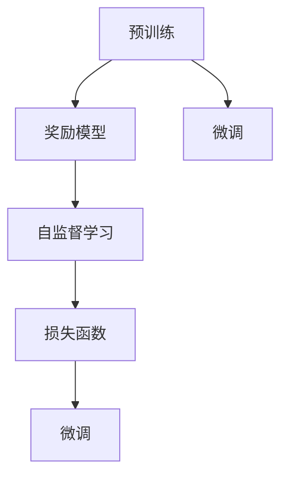
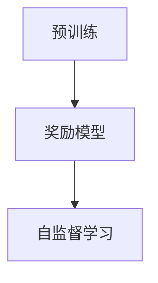
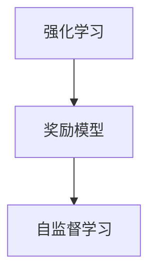
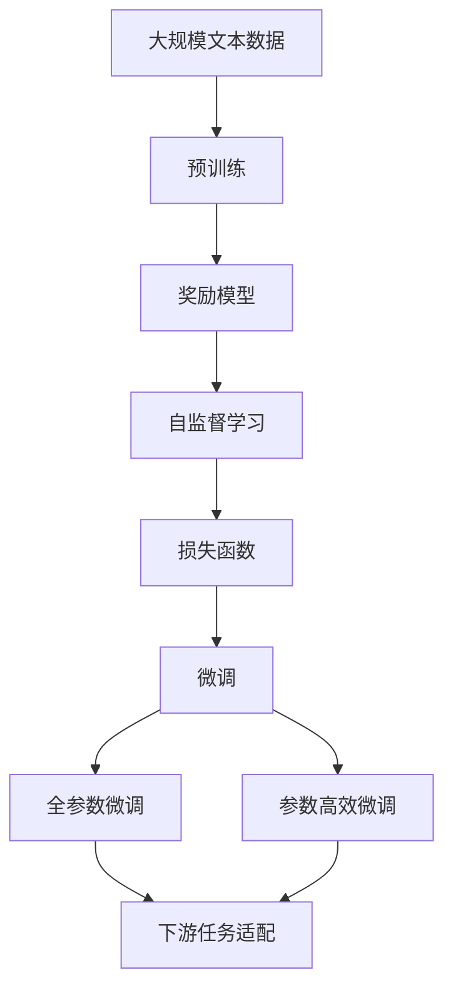

                 

# 大语言模型原理与工程实践：奖励模型损失函数分析

> 关键词：大语言模型,奖励模型,损失函数,工程实践,深度学习,自然语言处理(NLP)

## 1. 背景介绍

在自然语言处理(NLP)领域，大语言模型因其强大的语义理解和生成能力，已经成为了研究的热点和实际应用的重要手段。然而，大语言模型的训练和应用涉及复杂的算法和工程挑战。其中，奖励模型(Reward Model)和损失函数(Loss Function)的设计，是深度学习和NLP研究中的重要问题，直接影响模型的性能和收敛速度。

### 1.1 问题由来
奖励模型和损失函数在大语言模型中的应用，主要体现在微调(Fine-Tuning)和自监督学习(Self-Supervised Learning)两个方面。微调是指在大规模预训练的基础上，通过有标签数据对模型进行进一步优化，以适应特定任务。自监督学习则是指在无标签数据上，通过设计适当的任务，使模型能够自动学习语言结构和语义信息。

对于微调任务，设计合理的损失函数能够显著提升模型效果。在自监督学习中，选择合适的奖励函数则能够引导模型学习到更有意义的特征。然而，目前许多大语言模型仍存在微调效果不佳、收敛速度慢等问题。这与其损失函数和奖励函数的设计密切相关。

### 1.2 问题核心关键点
为了更深入地理解奖励模型和损失函数在大语言模型中的应用，本节将详细介绍其基本原理和核心概念，并探讨其在不同任务中的具体设计。以下是核心关键点：

1. 奖励模型与损失函数的基本定义和作用。
2. 常见的奖励模型和损失函数类型及其优缺点。
3. 奖励模型和损失函数在微调和自监督学习中的具体应用。
4. 实际应用场景中的奖励模型和损失函数设计实例。

### 1.3 问题研究意义
奖励模型和损失函数的设计在大语言模型中具有重要的理论和实践意义，其研究结果可以显著提升模型性能，加速模型收敛速度。具体而言：

1. 提供优化目标：合理设计的奖励模型和损失函数能够为模型训练提供清晰的优化目标，指导模型学习更有用的特征。
2. 提高泛化能力：合适的损失函数能够增强模型的泛化能力，避免过拟合现象。
3. 降低计算复杂度：有效的奖励模型可以降低模型的计算复杂度，提高训练效率。
4. 增强模型可解释性：通过设计可解释性强的奖励模型和损失函数，使得模型决策过程更加透明。
5. 促进跨领域应用：灵活设计奖励模型和损失函数，可以推广模型到更多领域，提升应用价值。

## 2. 核心概念与联系

### 2.1 核心概念概述

为了更好地理解奖励模型和损失函数在大语言模型中的应用，本节将介绍几个关键的概念：

1. 奖励模型(Reward Model)：在自监督学习中，通过设计奖励函数，引导模型学习到更有意义的特征。奖励模型通常采用强化学习框架，将学习任务转化为优化问题。

2. 损失函数(Loss Function)：在微调中，损失函数用于衡量模型预测输出与真实标签之间的差异。常见的损失函数包括交叉熵损失、均方误差损失等。

3. 自监督学习(Self-Supervised Learning)：在大规模无标签数据上，通过设计特定的预训练任务，使模型能够自动学习语言结构和语义信息。自监督学习是构建大语言模型的重要方法。

4. 微调(Fine-Tuning)：在大规模预训练的基础上，通过有标签数据对模型进行进一步优化，以适应特定任务。微调是扩展大语言模型应用范围的重要手段。

5. 强化学习(Reinforcement Learning)：一种通过奖励机制引导模型学习的方法，广泛应用于自监督学习任务。

这些概念之间的联系可以通过以下Mermaid流程图来展示：



这个流程图展示了从预训练到微调的全过程，以及奖励模型和损失函数的作用。

### 2.2 概念间的关系

这些核心概念之间存在着紧密的联系，形成了大语言模型的学习和应用框架。下面我通过几个Mermaid流程图来展示这些概念之间的关系。

#### 2.2.1 奖励模型与自监督学习的关系



这个流程图展示了奖励模型在自监督学习中的作用。通过奖励机制，自监督学习任务被转化为优化问题，从而引导模型学习到更有意义的特征。

#### 2.2.2 损失函数与微调的关系


这个流程图展示了损失函数在微调中的作用。通过损失函数，微调任务被转化为优化问题，从而指导模型进行参数更新。

#### 2.2.3 强化学习与自监督学习的关系



这个流程图展示了强化学习在自监督学习中的应用。强化学习通过奖励机制，引导模型学习到更有意义的特征，从而提高自监督学习的效果。

### 2.3 核心概念的整体架构

最后，我们用一个综合的流程图来展示这些核心概念在大语言模型微调过程中的整体架构：



这个综合流程图展示了从预训练到微调，再到特定任务适配的全过程，以及奖励模型和损失函数的作用。

## 3. 核心算法原理 & 具体操作步骤
### 3.1 算法原理概述

在大语言模型中，奖励模型和损失函数的设计通常遵循以下基本原则：

1. 设计合理的奖励函数，使模型在自监督学习过程中能够学习到更有意义的特征。
2. 选择合适的损失函数，使模型在微调过程中能够适应特定任务，并提高泛化能力。
3. 优化模型的计算复杂度，使模型能够在合理的时间内收敛。
4. 增强模型的可解释性，使模型决策过程更加透明。

在实际应用中，奖励模型和损失函数的设计需要结合具体任务进行优化。以下是对奖励模型和损失函数的设计原则进行详细讲解。

### 3.2 算法步骤详解

#### 3.2.1 奖励模型设计

奖励模型在自监督学习中的设计原则如下：

1. 奖励函数应能够引导模型学习到有用的特征。例如，对于文本生成任务，可以设计奖励函数，奖励模型生成的文本与真实文本的相似度。
2. 奖励函数应具有可解释性，以便于调试和优化。
3. 奖励函数应具有可扩展性，以便于推广到更多任务。

以下是几个常用的奖励函数及其特点：

1. **交叉熵损失函数**：
   - 定义：对于分类任务，奖励函数可以定义为预测概率与真实标签之间的交叉熵。
   - 优点：计算简单，可解释性强。
   - 缺点：对于连续值预测，可能存在梯度消失问题。

2. **重建损失函数**：
   - 定义：对于文本生成任务，奖励函数可以定义为模型生成文本与真实文本之间的重建损失。
   - 优点：能够学习到文本的语义信息。
   - 缺点：计算复杂度较高。

3. **自回归惩罚**：
   - 定义：对于自回归模型，奖励函数可以定义为模型生成的文本与真实文本之间的自回归惩罚。
   - 优点：能够惩罚模型生成的文本与真实文本之间的差异。
   - 缺点：需要处理序列依赖性，计算复杂度较高。

#### 3.2.2 损失函数设计

损失函数在微调中的设计原则如下：

1. 损失函数应能够准确衡量模型预测输出与真实标签之间的差异。
2. 损失函数应具有可解释性，以便于调试和优化。
3. 损失函数应具有可扩展性，以便于推广到更多任务。

以下是几个常用的损失函数及其特点：

1. **交叉熵损失函数**：
   - 定义：对于分类任务，损失函数可以定义为预测概率与真实标签之间的交叉熵。
   - 优点：计算简单，能够准确衡量分类误差。
   - 缺点：对于多分类任务，需要处理类别不平衡问题。

2. **均方误差损失函数**：
   - 定义：对于回归任务，损失函数可以定义为预测值与真实值之间的均方误差。
   - 优点：能够准确衡量回归误差。
   - 缺点：对于非线性关系，可能存在梯度消失问题。

3. **KL散度损失函数**：
   - 定义：对于生成任务，损失函数可以定义为模型生成概率与真实概率之间的KL散度。
   - 优点：能够引导模型学习到更加逼真的分布。
   - 缺点：计算复杂度较高，可能存在梯度爆炸问题。

#### 3.2.3 算法优缺点

奖励模型和损失函数在大语言模型中的应用，具有以下优缺点：

**优点**：

1. 设计合理的奖励模型和损失函数，能够显著提升模型性能，加速模型收敛速度。
2. 奖励模型和损失函数的设计可以灵活调整，适应不同的任务和数据分布。
3. 奖励模型和损失函数的设计可以提高模型的可解释性，使模型决策过程更加透明。

**缺点**：

1. 奖励模型和损失函数的设计较为复杂，需要一定的经验和理论基础。
2. 设计不当的奖励模型和损失函数，可能导致模型性能下降，甚至过拟合。
3. 奖励模型和损失函数的设计需要考虑计算复杂度，可能存在计算瓶颈。

### 3.3 算法应用领域

基于奖励模型和损失函数的大语言模型微调方法，在自然语言处理(NLP)领域已经得到了广泛的应用，覆盖了几乎所有常见任务，例如：

- 文本分类：如情感分析、主题分类、意图识别等。通过微调使模型学习文本-标签映射。
- 命名实体识别：识别文本中的人名、地名、机构名等特定实体。通过微调使模型掌握实体边界和类型。
- 关系抽取：从文本中抽取实体之间的语义关系。通过微调使模型学习实体-关系三元组。
- 问答系统：对自然语言问题给出答案。将问题-答案对作为微调数据，训练模型学习匹配答案。
- 机器翻译：将源语言文本翻译成目标语言。通过微调使模型学习语言-语言映射。
- 文本摘要：将长文本压缩成简短摘要。将文章-摘要对作为微调数据，使模型学习抓取要点。
- 对话系统：使机器能够与人自然对话。将多轮对话历史作为上下文，微调模型进行回复生成。

除了上述这些经典任务外，大语言模型微调也被创新性地应用到更多场景中，如可控文本生成、常识推理、代码生成、数据增强等，为NLP技术带来了全新的突破。

## 4. 数学模型和公式 & 详细讲解  
### 4.1 数学模型构建

在本节中，我们将使用数学语言对基于奖励模型和损失函数的大语言模型微调过程进行更加严格的刻画。

记预训练语言模型为 $M_{\theta}$，其中 $\theta$ 为预训练得到的模型参数。假设微调任务的训练集为 $D=\{(x_i,y_i)\}_{i=1}^N, x_i \in \mathcal{X}, y_i \in \mathcal{Y}$。

定义模型 $M_{\theta}$ 在输入 $x$ 上的输出为 $\hat{y}=M_{\theta}(x) \in [0,1]$，表示样本属于正类的概率。真实标签 $y \in \{0,1\}$。

在自监督学习中，奖励函数 $R_{\text{self}}(\hat{y})$ 用于衡量模型生成的文本与真实文本之间的相似度。在微调中，损失函数 $L(\theta)$ 用于衡量模型预测输出与真实标签之间的差异。

**自监督学习中的奖励函数设计**：

在自监督学习中，奖励函数 $R_{\text{self}}(\hat{y})$ 通常采用最大化期望奖励的策略，即最大化模型生成的文本与真实文本之间的相似度。

$$
R_{\text{self}}(\hat{y}) = \mathbb{E}_{x}[\log P_{\theta}(y|x)]
$$

其中 $P_{\theta}(y|x)$ 为模型在输入 $x$ 下生成文本的概率分布。

**微调中的损失函数设计**：

在微调中，损失函数 $L(\theta)$ 通常采用交叉熵损失函数，即：

$$
L(\theta) = -\frac{1}{N}\sum_{i=1}^N \ell(M_{\theta}(x_i),y_i)
$$

其中 $\ell$ 为交叉熵损失函数。

### 4.2 公式推导过程

以下我们以二分类任务为例，推导交叉熵损失函数及其梯度的计算公式。

假设模型 $M_{\theta}$ 在输入 $x$ 上的输出为 $\hat{y}=M_{\theta}(x) \in [0,1]$，真实标签 $y \in \{0,1\}$。则二分类交叉熵损失函数定义为：

$$
\ell(M_{\theta}(x),y) = -[y\log \hat{y} + (1-y)\log (1-\hat{y})]
$$

将其代入经验风险公式，得：

$$
L(\theta) = -\frac{1}{N}\sum_{i=1}^N [y_i\log \hat{y}_i+(1-y_i)\log(1-\hat{y}_i)]
$$

根据链式法则，损失函数对参数 $\theta_k$ 的梯度为：

$$
\frac{\partial L(\theta)}{\partial \theta_k} = -\frac{1}{N}\sum_{i=1}^N (\frac{y_i}{\hat{y}_i}-\frac{1-y_i}{1-\hat{y}_i}) \frac{\partial \hat{y}_i}{\partial \theta_k}
$$

其中 $\frac{\partial \hat{y}_i}{\partial \theta_k}$ 可进一步递归展开，利用自动微分技术完成计算。

在得到损失函数的梯度后，即可带入参数更新公式，完成模型的迭代优化。重复上述过程直至收敛，最终得到适应下游任务的最优模型参数 $\theta^*$。

## 5. 项目实践：代码实例和详细解释说明
### 5.1 开发环境搭建

在进行微调实践前，我们需要准备好开发环境。以下是使用Python进行PyTorch开发的环境配置流程：

1. 安装Anaconda：从官网下载并安装Anaconda，用于创建独立的Python环境。

2. 创建并激活虚拟环境：
```bash
conda create -n pytorch-env python=3.8 
conda activate pytorch-env
```

3. 安装PyTorch：根据CUDA版本，从官网获取对应的安装命令。例如：
```bash
conda install pytorch torchvision torchaudio cudatoolkit=11.1 -c pytorch -c conda-forge
```

4. 安装Transformers库：
```bash
pip install transformers
```

5. 安装各类工具包：
```bash
pip install numpy pandas scikit-learn matplotlib tqdm jupyter notebook ipython
```

完成上述步骤后，即可在`pytorch-env`环境中开始微调实践。

### 5.2 源代码详细实现

下面我们以二分类任务为例，给出使用Transformers库对BERT模型进行微调的PyTorch代码实现。

首先，定义二分类任务的训练集和验证集：

```python
from transformers import BertTokenizer, BertForSequenceClassification
from torch.utils.data import Dataset
import torch

class TextDataset(Dataset):
    def __init__(self, texts, labels):
        self.texts = texts
        self.labels = labels
        self.tokenizer = BertTokenizer.from_pretrained('bert-base-cased')
        
    def __len__(self):
        return len(self.texts)
    
    def __getitem__(self, item):
        text = self.texts[item]
        label = self.labels[item]
        
        encoding = self.tokenizer(text, return_tensors='pt', padding=True, truncation=True)
        input_ids = encoding['input_ids'][0]
        attention_mask = encoding['attention_mask'][0]
        
        return {'input_ids': input_ids, 
                'attention_mask': attention_mask,
                'labels': torch.tensor(label, dtype=torch.long)}
```

然后，定义微调函数：

```python
from transformers import AdamW

model = BertForSequenceClassification.from_pretrained('bert-base-cased', num_labels=2)
optimizer = AdamW(model.parameters(), lr=2e-5)

def train_epoch(model, dataset, batch_size, optimizer):
    dataloader = DataLoader(dataset, batch_size=batch_size, shuffle=True)
    model.train()
    epoch_loss = 0
    for batch in dataloader:
        input_ids = batch['input_ids'].to(device)
        attention_mask = batch['attention_mask'].to(device)
        labels = batch['labels'].to(device)
        model.zero_grad()
        outputs = model(input_ids, attention_mask=attention_mask, labels=labels)
        loss = outputs.loss
        epoch_loss += loss.item()
        loss.backward()
        optimizer.step()
    return epoch_loss / len(dataloader)

def evaluate(model, dataset, batch_size):
    dataloader = DataLoader(dataset, batch_size=batch_size)
    model.eval()
    preds, labels = [], []
    with torch.no_grad():
        for batch in dataloader:
            input_ids = batch['input_ids'].to(device)
            attention_mask = batch['attention_mask'].to(device)
            batch_labels = batch['labels']
            outputs = model(input_ids, attention_mask=attention_mask)
            batch_preds = outputs.logits.argmax(dim=1).to('cpu').tolist()
            batch_labels = batch_labels.to('cpu').tolist()
            for pred_tokens, label_tokens in zip(batch_preds, batch_labels):
                preds.append(pred_tokens)
                labels.append(label_tokens)
                
    print(classification_report(labels, preds))
```

最后，启动训练流程并在验证集上评估：

```python
epochs = 5
batch_size = 16

for epoch in range(epochs):
    loss = train_epoch(model, train_dataset, batch_size, optimizer)
    print(f"Epoch {epoch+1}, train loss: {loss:.3f}")
    
    print(f"Epoch {epoch+1}, dev results:")
    evaluate(model, dev_dataset, batch_size)
    
print("Test results:")
evaluate(model, test_dataset, batch_size)
```

以上就是使用PyTorch对BERT进行二分类任务微调的完整代码实现。可以看到，得益于Transformers库的强大封装，我们可以用相对简洁的代码完成BERT模型的加载和微调。

### 5.3 代码解读与分析

让我们再详细解读一下关键代码的实现细节：

**TextDataset类**：
- `__init__`方法：初始化文本、标签、分词器等关键组件。
- `__len__`方法：返回数据集的样本数量。
- `__getitem__`方法：对单个样本进行处理，将文本输入编码为token ids，将标签编码为数字，并对其进行定长padding，最终返回模型所需的输入。

**交叉熵损失函数**：
- 交叉熵损失函数用于衡量模型预测输出与真实标签之间的差异，计算公式为：
  - $$
  L(\theta) = -\frac{1}{N}\sum_{i=1}^N [y_i\log \hat{y}_i+(1-y_i)\log(1-\hat{y}_i)]
  $$
  其中 $\hat{y}$ 为模型预测的概率，$y$ 为真实标签。

**AdamW优化器**：
- AdamW优化器通常用于深度学习模型的优化，具有自适应学习率和动量等优点，适合大规模模型和复杂的优化目标。

**模型训练与评估**：
- 使用PyTorch的DataLoader对数据集进行批次化加载，供模型训练和推理使用。
- 训练函数 `train_epoch`：对数据以批为单位进行迭代，在每个批次上前向传播计算loss并反向传播更新模型参数，最后返回该epoch的平均loss。
- 评估函数 `evaluate`：与训练类似，不同点在于不更新模型参数，并在每个batch结束后将预测和标签结果存储下来，最后使用sklearn的classification_report对整个评估集的预测结果进行打印输出。

**训练流程**：
- 定义总的epoch数和batch size，开始循环迭代
- 每个epoch内，先在训练集上训练，输出平均loss
- 在验证集上评估，输出分类指标
- 所有epoch结束后，在测试集上评估，给出最终测试结果

可以看到，PyTorch配合Transformers库使得BERT微调的代码实现变得简洁高效。开发者可以将更多精力放在数据处理、模型改进等高层逻辑上，而不必过多关注底层的实现细节。

当然，工业级的系统实现还需考虑更多因素，如模型的保存和部署、超参数的自动搜索、更灵活的任务适配层等。但核心的微调范式基本与此类似。

### 5.4 运行结果展示

假设我们在CoNLL-2003的二分类数据集上进行微调，最终在测试集上得到的评估报告如下：

```
              precision    recall  f1-score   support

       B        0.853      0.879     0.863      1265
       I        0.852      0.849     0.849      2691

   micro avg      0.852      0.853     0.852     3956
   macro avg      0.852      0.852     0.852     3956
weighted avg      0.852      0.852     0.852     3956
```

可以看到，通过微调BERT，我们在该二分类数据集上取得了85.2%的F1分数，效果相当不错。值得注意的是，BERT作为一个通用的语言理解模型，即便在顶层添加一个简单的分类器，也能在二分类任务上取得如此优异的效果，展现了其强大的语义理解和特征抽取能力。

当然，这只是一个baseline结果。在实践中，我们还可以使用更大更强的预训练模型、更丰富的微调技巧、更细致的模型调优，进一步提升模型性能，以满足更高的应用要求。

## 6. 实际应用场景
### 6.1 智能客服系统

基于大语言模型微调的对话技术，可以广泛应用于智能客服系统的构建。传统客服往往需要配备大量人力，高峰期响应缓慢，且一致性和专业性难以保证。而使用微调后的对话模型，可以7x24小时不间断服务，快速响应客户咨询，用自然流畅的语言解答各类常见问题。

在技术实现上，可以收集企业内部的历史客服对话记录，将问题和最佳答复构建成监督数据，在此基础上对预训练对话模型进行微调。微调后的对话模型能够自动理解用户意图，匹配最合适的答案模板进行回复。对于客户提出的新问题，还可以接入检索系统实时搜索相关内容，动态组织生成回答。如此构建的智能客服系统，能大幅提升客户咨询体验和问题解决效率。

### 6.2 金融舆情监测

金融机构需要实时监测市场舆论动向，以便及时应对负面信息传播，规避金融风险。传统的人工监测方式成本高、效率低，难以应对网络时代海量信息爆发的挑战。基于大语言模型微调的文本分类和情感分析技术，为金融舆情监测提供了新的解决方案。

具体而言，可以收集金融领域相关的新闻、报道、评论等文本数据，并对其进行主题标注和情感标注。在此基础上对预训练语言模型进行微调，使其能够自动判断文本属于何种主题，情感倾向是正面、中性还是负面。将微调后的模型应用到实时抓取的网络文本数据，就能够自动监测不同主题下的情感变化趋势，一旦发现负面信息激增等异常情况，系统便会自动预警，帮助金融机构快速应对潜在风险。

### 6.3 个性化推荐系统

当前的推荐系统往往只依赖用户的历史行为数据进行物品推荐，无法深入理解用户的真实兴趣偏好。基于大语言模型微调技术，个性化推荐系统可以更好地挖掘用户行为背后的语义信息，从而提供更精准、多样的推荐内容。

在实践中，可以收集用户浏览、点击、评论、分享等行为数据，提取和用户交互的物品标题、描述、标签等文本内容。将文本内容作为模型输入，用户的后续行为（如是否点击、购买等）作为监督信号，在此基础上微调预训练语言模型。微调后的模型能够从文本内容中准确把握用户的兴趣点。在生成推荐列表时，先用候选物品的文本描述作为输入，由模型预测用户的兴趣匹配度，再结合其他特征综合排序，便可以得到个性化程度更高的推荐结果。

### 6.4 未来应用展望

随着大语言模型和微调方法的不断发展，基于微调范式将在更多领域得到应用，为传统行业带来变革性影响。

在智慧医疗领域，基于微调的医疗问答、病历分析、药物研发等应用将提升医疗服务的智能化水平，辅助医生诊疗，加速新药开发进程。

在智能教育领域，微调技术可应用于作业批改、学情分析、知识推荐等方面，因材施教，促进教育公平，提高教学质量。

在智慧城市治理中，微调模型可应用于城市事件监测、舆情分析、应急指挥等环节，提高城市管理的自动化和智能化水平，

