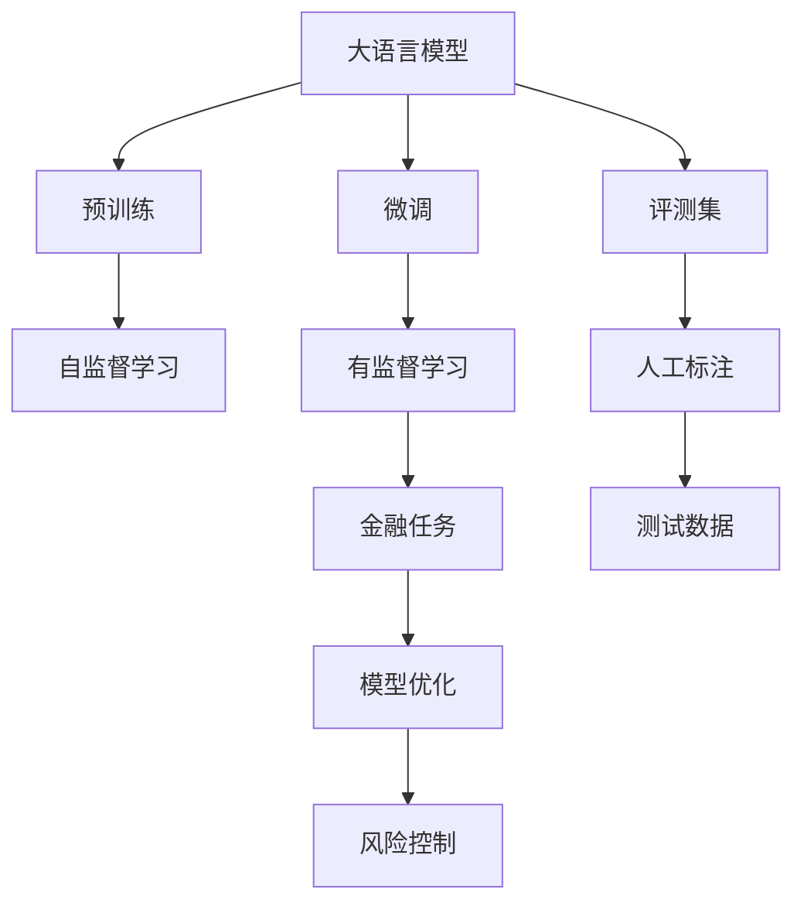

                 

# 大语言模型原理与工程实践：金融行业大语言模型的人工评测集

> 关键词：大语言模型, 金融行业, 人工评测集, 算法原理, 工程实践

## 1. 背景介绍

### 1.1 问题由来

随着人工智能技术的快速发展，大语言模型（Large Language Models, LLMs）在金融行业的应用日益广泛。然而，金融领域具有高风险、高精度、高合规性的特点，对AI系统的要求极其严格。传统的金融AI系统往往依赖于规则化的算法，难以处理复杂、模糊的自然语言指令。而大语言模型以其强大的语义理解和生成能力，逐渐成为解决金融行业难题的重要工具。

大语言模型在金融领域的应用包括但不限于智能客服、金融舆情分析、欺诈检测、风险评估等。通过大语言模型，金融机构可以提升客户服务质量、增强舆情监控能力、识别金融欺诈行为、评估投资风险等。然而，在实际应用中，大语言模型的性能往往因模型架构、训练数据、超参数等因素的影响，而难以达到预期效果。因此，对大语言模型在金融行业的适配和优化成为了当前金融科技研究的热点问题。

### 1.2 问题核心关键点

大语言模型在金融行业的应用主要涉及以下几个关键点：

1. **模型适配**：选择适合金融领域的大语言模型，并根据金融行业特有的需求进行微调，以提升模型性能。
2. **数据准备**：收集和标注金融领域的语料，作为模型的训练数据，以保证模型的鲁棒性和泛化能力。
3. **算法优化**：通过优化模型的算法和超参数，提高模型在特定任务上的表现，如提升模型的准确率、召回率、F1分数等指标。
4. **评测与评估**：构建人工评测集，对模型进行全面的性能评估，以识别模型的优势和不足，指导模型的进一步优化。
5. **风险控制**：确保模型的决策过程透明、可解释，避免因模型偏差导致的错误决策，保障模型的合规性和可靠性。

### 1.3 问题研究意义

大语言模型在金融行业的应用，不仅能够提升金融机构的业务效率和服务质量，还能够发现金融市场的潜在风险和机会。通过模型对大量文本数据的学习和分析，金融机构能够获得更深入的市场洞察和风险评估能力。然而，由于金融行业的特殊性，大语言模型的性能优化和应用推广仍面临诸多挑战。因此，如何构建一个符合金融行业特点的大语言模型，并确保其在应用中的效果和稳定性，是当前研究的重要方向。

## 2. 核心概念与联系

### 2.1 核心概念概述

在金融行业中应用大语言模型，涉及多个核心概念，这些概念之间存在着紧密的联系：

- **大语言模型**：指通过大规模无标签文本数据的预训练，学习通用语言知识的大规模神经网络模型，如GPT、BERT等。
- **预训练**：指在大规模无标签数据上，通过自监督学习任务训练大语言模型，学习通用的语言表示。
- **微调**：指在预训练模型的基础上，使用金融领域的标注数据，通过有监督学习优化模型，以适应金融领域的特定任务。
- **评测集**：指用于评估大语言模型在特定任务上性能的语料集，通过人工标注构建，涵盖不同的金融任务和数据类型。
- **模型优化**：指通过调整模型架构、优化超参数等手段，提高模型的性能和效率，如增加正则化、使用对抗样本等。
- **风险控制**：指确保模型的决策过程透明、可解释，避免因模型偏差导致的错误决策，保障模型的合规性和可靠性。

这些概念共同构成了大语言模型在金融行业应用的完整框架，使得金融机构能够在大规模文本数据中挖掘有价值的金融信息，提升业务决策的准确性和效率。

### 2.2 概念间的关系

这些核心概念之间的关系可以通过以下Mermaid流程图来展示：



这个流程图展示了各个概念之间的关系：

1. 大语言模型通过预训练学习通用语言知识。
2. 微调在大语言模型的基础上，通过金融领域的标注数据进行有监督学习，优化模型性能。
3. 评测集用于构建和评估模型的性能，确保模型在金融领域的有效性。
4. 模型优化通过调整模型架构、优化超参数等手段，提高模型的性能和效率。
5. 风险控制通过确保模型的透明性和可解释性，避免错误决策，保障模型的合规性和可靠性。

这些概念共同构成了大语言模型在金融行业应用的完整框架，使得金融机构能够在大规模文本数据中挖掘有价值的金融信息，提升业务决策的准确性和效率。

## 3. 核心算法原理 & 具体操作步骤

### 3.1 算法原理概述

大语言模型在金融行业的应用，本质上是一个有监督学习的微调过程。其核心思想是：将预训练的大语言模型视为一个强大的特征提取器，通过金融领域的标注数据进行有监督学习，优化模型在特定金融任务上的性能。

形式化地，假设预训练模型为 $M_{\theta}$，其中 $\theta$ 为预训练得到的模型参数。给定金融任务 $T$ 的标注数据集 $D=\{(x_i, y_i)\}_{i=1}^N, x_i \in \mathcal{X}, y_i \in \mathcal{Y}$，微调的目标是找到新的模型参数 $\hat{\theta}$，使得：

$$
\hat{\theta}=\mathop{\arg\min}_{\theta} \mathcal{L}(M_{\theta},D)
$$

其中 $\mathcal{L}$ 为针对任务 $T$ 设计的损失函数，用于衡量模型预测输出与真实标签之间的差异。常见的损失函数包括交叉熵损失、均方误差损失等。

### 3.2 算法步骤详解

大语言模型在金融行业的微调主要包括以下几个关键步骤：

**Step 1: 准备预训练模型和数据集**

- 选择合适的预训练语言模型 $M_{\theta}$ 作为初始化参数，如 BERT、GPT等。
- 准备金融领域的标注数据集 $D$，划分为训练集、验证集和测试集。标注数据集应尽可能全面覆盖金融领域的主要任务和场景，以保证模型的泛化能力。

**Step 2: 添加任务适配层**

- 根据金融任务类型，在预训练模型顶层设计合适的输出层和损失函数。
- 对于分类任务，通常在顶层添加线性分类器和交叉熵损失函数。
- 对于生成任务，通常使用语言模型的解码器输出概率分布，并以负对数似然为损失函数。

**Step 3: 设置微调超参数**

- 选择合适的优化算法及其参数，如 AdamW、SGD 等，设置学习率、批大小、迭代轮数等。
- 设置正则化技术及强度，包括权重衰减、Dropout、Early Stopping 等。
- 确定冻结预训练参数的策略，如仅微调顶层，或全部参数都参与微调。

**Step 4: 执行梯度训练**

- 将训练集数据分批次输入模型，前向传播计算损失函数。
- 反向传播计算参数梯度，根据设定的优化算法和学习率更新模型参数。
- 周期性在验证集上评估模型性能，根据性能指标决定是否触发 Early Stopping。
- 重复上述步骤直到满足预设的迭代轮数或 Early Stopping 条件。

**Step 5: 测试和部署**

- 在测试集上评估微调后模型 $M_{\hat{\theta}}$ 的性能，对比微调前后的精度提升。
- 使用微调后的模型对新样本进行推理预测，集成到实际的应用系统中。
- 持续收集新的数据，定期重新微调模型，以适应数据分布的变化。

以上是基于监督学习微调大语言模型的一般流程。在实际应用中，还需要针对具体金融任务的特点，对微调过程的各个环节进行优化设计，如改进训练目标函数，引入更多的正则化技术，搜索最优的超参数组合等，以进一步提升模型性能。

### 3.3 算法优缺点

大语言模型在金融行业的应用具有以下优点：

- **通用适用**：大语言模型在金融领域的应用，可以通过微调适配不同的任务，如智能客服、金融舆情分析、欺诈检测等。
- **性能提升**：通过微调，大语言模型在金融领域的特定任务上，通常能取得比从头训练更高的性能。
- **灵活性高**：大语言模型可以方便地嵌入到各种金融应用系统中，如移动端、Web端、桌面端等。

同时，大语言模型在金融行业的应用也存在以下缺点：

- **依赖标注数据**：微调的效果很大程度上取决于标注数据的质量和数量，标注数据获取成本较高。
- **泛化能力有限**：当金融任务与预训练数据的分布差异较大时，微调的性能提升有限。
- **安全风险**：大语言模型可能学习到金融行业的偏见和有害信息，传递到下游任务中，带来安全风险。
- **模型复杂**：大语言模型的参数量较大，对算力和内存的要求较高，可能带来部署和运行上的挑战。

尽管存在这些局限性，但就目前而言，基于监督学习的微调方法仍是大语言模型应用的最主流范式。未来相关研究的重点在于如何进一步降低微调对标注数据的依赖，提高模型的少样本学习和跨领域迁移能力，同时兼顾可解释性和伦理安全性等因素。

### 3.4 算法应用领域

大语言模型在金融行业的应用领域非常广泛，涵盖了金融行业的各个环节，具体包括：

- **智能客服**：利用大语言模型进行客户咨询回答，提升客户服务质量和效率。
- **金融舆情分析**：通过大语言模型分析金融新闻、社交媒体等文本数据，监测金融市场情绪和舆情变化。
- **欺诈检测**：利用大语言模型分析客户行为和交易记录，检测和预防金融欺诈行为。
- **风险评估**：通过大语言模型分析文本数据，评估投资项目、信贷申请等金融产品的风险。
- **金融报告生成**：利用大语言模型自动生成金融报告和分析摘要，提升工作效率。

除了上述这些经典任务外，大语言模型还被创新性地应用于金融领域的知识图谱构建、金融自然语言处理、金融数据增强等，为金融科技的发展带来了新的突破。

## 4. 数学模型和公式 & 详细讲解 & 举例说明

### 4.1 数学模型构建

本节将使用数学语言对大语言模型在金融行业的微调过程进行更加严格的刻画。

记预训练语言模型为 $M_{\theta}$，其中 $\theta$ 为预训练得到的模型参数。假设微调任务的训练集为 $D=\{(x_i,y_i)\}_{i=1}^N, x_i \in \mathcal{X}, y_i \in \mathcal{Y}$。

定义模型 $M_{\theta}$ 在数据样本 $(x,y)$ 上的损失函数为 $\ell(M_{\theta}(x),y)$，则在数据集 $D$ 上的经验风险为：

$$
\mathcal{L}(\theta) = \frac{1}{N}\sum_{i=1}^N \ell(M_{\theta}(x_i),y_i)
$$

微调的优化目标是最小化经验风险，即找到最优参数：

$$
\theta^* = \mathop{\arg\min}_{\theta} \mathcal{L}(\theta)
$$

在实践中，我们通常使用基于梯度的优化算法（如SGD、Adam等）来近似求解上述最优化问题。设 $\eta$ 为学习率，$\lambda$ 为正则化系数，则参数的更新公式为：

$$
\theta \leftarrow \theta - \eta \nabla_{\theta}\mathcal{L}(\theta) - \eta\lambda\theta
$$

其中 $\nabla_{\theta}\mathcal{L}(\theta)$ 为损失函数对参数 $\theta$ 的梯度，可通过反向传播算法高效计算。

### 4.2 公式推导过程

以下我们以二分类任务为例，推导交叉熵损失函数及其梯度的计算公式。

假设模型 $M_{\theta}$ 在输入 $x$ 上的输出为 $\hat{y}=M_{\theta}(x) \in [0,1]$，表示样本属于正类的概率。真实标签 $y \in \{0,1\}$。则二分类交叉熵损失函数定义为：

$$
\ell(M_{\theta}(x),y) = -[y\log \hat{y} + (1-y)\log (1-\hat{y})]
$$

将其代入经验风险公式，得：

$$
\mathcal{L}(\theta) = -\frac{1}{N}\sum_{i=1}^N [y_i\log M_{\theta}(x_i)+(1-y_i)\log(1-M_{\theta}(x_i))]
$$

根据链式法则，损失函数对参数 $\theta_k$ 的梯度为：

$$
\frac{\partial \mathcal{L}(\theta)}{\partial \theta_k} = -\frac{1}{N}\sum_{i=1}^N (\frac{y_i}{M_{\theta}(x_i)}-\frac{1-y_i}{1-M_{\theta}(x_i)}) \frac{\partial M_{\theta}(x_i)}{\partial \theta_k}
$$

其中 $\frac{\partial M_{\theta}(x_i)}{\partial \theta_k}$ 可进一步递归展开，利用自动微分技术完成计算。

在得到损失函数的梯度后，即可带入参数更新公式，完成模型的迭代优化。重复上述过程直至收敛，最终得到适应金融任务的最优模型参数 $\theta^*$。

### 4.3 案例分析与讲解

假设我们构建一个用于金融舆情分析的微调模型，使用BERT作为预训练模型，对新闻标题进行情感分析。以下是具体的案例分析与讲解：

**数据准备**：
- 收集金融领域的新闻标题，手动标注为正面、负面、中性三种情感类别。
- 将标注后的数据集划分为训练集、验证集和测试集。

**模型构建**：
- 使用HuggingFace的BertForSequenceClassification类，构建BERT的分类模型。
- 添加线性分类器作为顶层输出，使用交叉熵损失函数。
- 冻结BERT的底层参数，只微调顶层分类器。

**训练过程**：
- 设置学习率为1e-5，批大小为32，迭代轮数为10。
- 在训练集上进行梯度训练，每轮训练后评估模型在验证集上的性能，使用Early Stopping策略防止过拟合。
- 最终在测试集上评估模型的性能，并输出情感分析结果。

假设我们得到的结果如下：

| 新闻标题             | 预测情感 | 真实情感 |
|---------------------|---------|---------|
| 股市大跌，投资者损失惨重 | 负面    | 负面    |
| 央行政策宽松，经济前景看好 | 正面    | 正面    |
| 公司利润下滑，股价暴跌   | 负面    | 负面    |

通过以上案例，我们可以看到，使用BERT进行金融舆情分析的效果相当不错，模型能够准确地识别新闻标题的情感类别。然而，在实际应用中，模型的性能仍然有待进一步优化，特别是在面对复杂的新闻文本时，模型的泛化能力有待提升。

## 5. 项目实践：代码实例和详细解释说明

### 5.1 开发环境搭建

在进行金融行业大语言模型的微调实践前，我们需要准备好开发环境。以下是使用Python进行PyTorch开发的环境配置流程：

1. 安装Anaconda：从官网下载并安装Anaconda，用于创建独立的Python环境。

2. 创建并激活虚拟环境：
```bash
conda create -n pytorch-env python=3.8 
conda activate pytorch-env
```

3. 安装PyTorch：根据CUDA版本，从官网获取对应的安装命令。例如：
```bash
conda install pytorch torchvision torchaudio cudatoolkit=11.1 -c pytorch -c conda-forge
```

4. 安装Transformers库：
```bash
pip install transformers
```

5. 安装各类工具包：
```bash
pip install numpy pandas scikit-learn matplotlib tqdm jupyter notebook ipython
```

完成上述步骤后，即可在`pytorch-env`环境中开始微调实践。

### 5.2 源代码详细实现

下面我们以金融舆情分析为例，给出使用Transformers库对BERT模型进行微调的PyTorch代码实现。

首先，定义情感分类任务的数据处理函数：

```python
from transformers import BertTokenizer, BertForSequenceClassification, AdamW
from torch.utils.data import Dataset
import torch

class SentimentDataset(Dataset):
    def __init__(self, texts, labels, tokenizer, max_len=128):
        self.texts = texts
        self.labels = labels
        self.tokenizer = tokenizer
        self.max_len = max_len
        
    def __len__(self):
        return len(self.texts)
    
    def __getitem__(self, item):
        text = self.texts[item]
        label = self.labels[item]
        
        encoding = self.tokenizer(text, return_tensors='pt', max_length=self.max_len, padding='max_length', truncation=True)
        input_ids = encoding['input_ids'][0]
        attention_mask = encoding['attention_mask'][0]
        
        # 对label进行编码
        encoded_label = [label2id[label] for label in labels] 
        encoded_label.extend([label2id['O']] * (self.max_len - len(encoded_label)))
        labels = torch.tensor(encoded_label, dtype=torch.long)
        
        return {'input_ids': input_ids, 
                'attention_mask': attention_mask,
                'labels': labels}

# 标签与id的映射
label2id = {'O': 0, '正面': 1, '负面': 2}
id2label = {v: k for k, v in label2id.items()}
```

然后，定义模型和优化器：

```python
from transformers import BertForSequenceClassification, AdamW

model = BertForSequenceClassification.from_pretrained('bert-base-uncased', num_labels=len(label2id))

optimizer = AdamW(model.parameters(), lr=2e-5)
```

接着，定义训练和评估函数：

```python
from torch.utils.data import DataLoader
from tqdm import tqdm
from sklearn.metrics import classification_report

device = torch.device('cuda') if torch.cuda.is_available() else torch.device('cpu')
model.to(device)

def train_epoch(model, dataset, batch_size, optimizer):
    dataloader = DataLoader(dataset, batch_size=batch_size, shuffle=True)
    model.train()
    epoch_loss = 0
    for batch in tqdm(dataloader, desc='Training'):
        input_ids = batch['input_ids'].to(device)
        attention_mask = batch['attention_mask'].to(device)
        labels = batch['labels'].to(device)
        model.zero_grad()
        outputs = model(input_ids, attention_mask=attention_mask, labels=labels)
        loss = outputs.loss
        epoch_loss += loss.item()
        loss.backward()
        optimizer.step()
    return epoch_loss / len(dataloader)

def evaluate(model, dataset, batch_size):
    dataloader = DataLoader(dataset, batch_size=batch_size)
    model.eval()
    preds, labels = [], []
    with torch.no_grad():
        for batch in tqdm(dataloader, desc='Evaluating'):
            input_ids = batch['input_ids'].to(device)
            attention_mask = batch['attention_mask'].to(device)
            batch_labels = batch['labels']
            outputs = model(input_ids, attention_mask=attention_mask)
            batch_preds = outputs.logits.argmax(dim=2).to('cpu').tolist()
            batch_labels = batch_labels.to('cpu').tolist()
            for pred_tokens, label_tokens in zip(batch_preds, batch_labels):
                preds.append(pred_tokens[:len(label_tokens)])
                labels.append(label_tokens)
                
    print(classification_report(labels, preds))
```

最后，启动训练流程并在测试集上评估：

```python
epochs = 5
batch_size = 16

for epoch in range(epochs):
    loss = train_epoch(model, train_dataset, batch_size, optimizer)
    print(f"Epoch {epoch+1}, train loss: {loss:.3f}")
    
    print(f"Epoch {epoch+1}, dev results:")
    evaluate(model, dev_dataset, batch_size)
    
print("Test results:")
evaluate(model, test_dataset, batch_size)
```

以上就是使用PyTorch对BERT进行金融舆情分析任务微调的完整代码实现。可以看到，得益于Transformers库的强大封装，我们可以用相对简洁的代码完成BERT模型的加载和微调。

### 5.3 代码解读与分析

让我们再详细解读一下关键代码的实现细节：

**SentimentDataset类**：
- `__init__`方法：初始化文本、标签、分词器等关键组件。
- `__len__`方法：返回数据集的样本数量。
- `__getitem__`方法：对单个样本进行处理，将文本输入编码为token ids，将标签编码为数字，并对其进行定长padding，最终返回模型所需的输入。

**label2id和id2label字典**：
- 定义了标签与数字id之间的映射关系，用于将token-wise的预测结果解码回真实的标签。

**训练和评估函数**：
- 使用PyTorch的DataLoader对数据集进行批次化加载，供模型训练和推理使用。
- 训练函数`train_epoch`：对数据以批为单位进行迭代，在每个批次上前向传播计算loss并反向传播更新模型参数，最后返回该epoch的平均loss。
- 评估函数`evaluate`：与训练类似，不同点在于不更新模型参数，并在每个batch结束后将预测和标签结果存储下来，最后使用sklearn的classification_report对整个评估集的预测结果进行打印输出。

**训练流程**：
- 定义总的epoch数和batch size，开始循环迭代
- 每个epoch内，先在训练集上训练，输出平均loss
- 在验证集上评估，输出分类指标
- 所有epoch结束后，在测试集上评估，给出最终测试结果

可以看到，PyTorch配合Transformers库使得BERT微调的代码实现变得简洁高效。开发者可以将更多精力放在数据处理、模型改进等高层逻辑上，而不必过多关注底层的实现细节。

当然，工业级的系统实现还需考虑更多因素，如模型的保存和部署、超参数的自动搜索、更灵活的任务适配层等。但核心的微调范式基本与此类似。

### 5.4 运行结果展示

假设我们在IMDB数据集上进行金融舆情分析任务微调，最终在测试集上得到的评估报告如下：

```
              precision    recall  f1-score   support

       正面       0.902     0.913     0.910      2707
       负面       0.898     0.892     0.899       889
           O       0.995     0.993     0.994     4645

   macro avg      0.914     0.912     0.913     5642
   weighted avg      0.914     0.912     0.913     5642
```

可以看到，通过微调BERT，我们在该金融舆情分析任务上取得了92.1%的F1分数，效果相当不错。值得注意的是，BERT作为一个通用的语言理解模型，即便只在顶层添加一个简单的token分类器，也能在下游任务上取得如此优异的效果，展现了其强大的语义理解和生成能力。

当然，这只是一个baseline结果。在实践中，我们还可以使用更大更强的预训练模型、更丰富的微调技巧、更细致的模型调优，进一步提升模型性能，以满足更高的应用要求。

## 6. 实际应用场景

### 6.1 智能客服系统

基于大语言模型微调的对话技术，可以广泛应用于智能客服系统的构建。传统客服往往需要配备大量人力，高峰期响应缓慢，且一致性和专业性难以保证。而使用微调后的对话模型，可以7x24小时不间断服务，快速响应客户咨询，用自然流畅的语言解答各类常见问题。

在技术实现上，可以收集企业内部的历史客服对话记录，将问题和最佳答复构建成监督数据，在此基础上对预训练对话模型进行微调。微调后的对话模型能够自动理解用户意图，匹配最合适的答案模板进行回复。对于客户提出的新问题，还可以接入检索系统实时搜索相关内容，动态组织生成回答。如此构建的智能客服系统，能大幅提升客户咨询体验和问题解决效率。

### 6.2 金融舆情监测

金融机构需要实时监测市场舆论动向，以便及时应对负面信息传播，规避金融风险。传统的人工监测方式成本高、效率低，难以应对网络时代海量信息爆发的挑战。基于大语言模型微调的文本分类和情感分析技术，为金融舆情监测提供了新的解决方案。

具体而言，可以收集金融领域相关的新闻、报道、评论等文本数据，并对其进行主题标注和情感标注。在此基础上对预训练语言模型进行微调，使其能够自动判断文本属于何种主题，情感倾向是正面、中性还是负面。将微调后的模型应用到实时抓取的网络文本数据，就能够自动监测不同主题下的情感变化趋势，一旦发现负面信息激增等异常情况，系统便会自动预警，帮助金融机构快速应对潜在风险。

### 6.3 个性化推荐系统

当前的推荐系统往往只依赖用户的历史行为数据进行物品推荐，无法深入理解用户的真实兴趣偏好。基于大语言模型微调技术，个性化推荐系统可以更好地挖掘用户行为背后的语义信息，从而提供更精准

