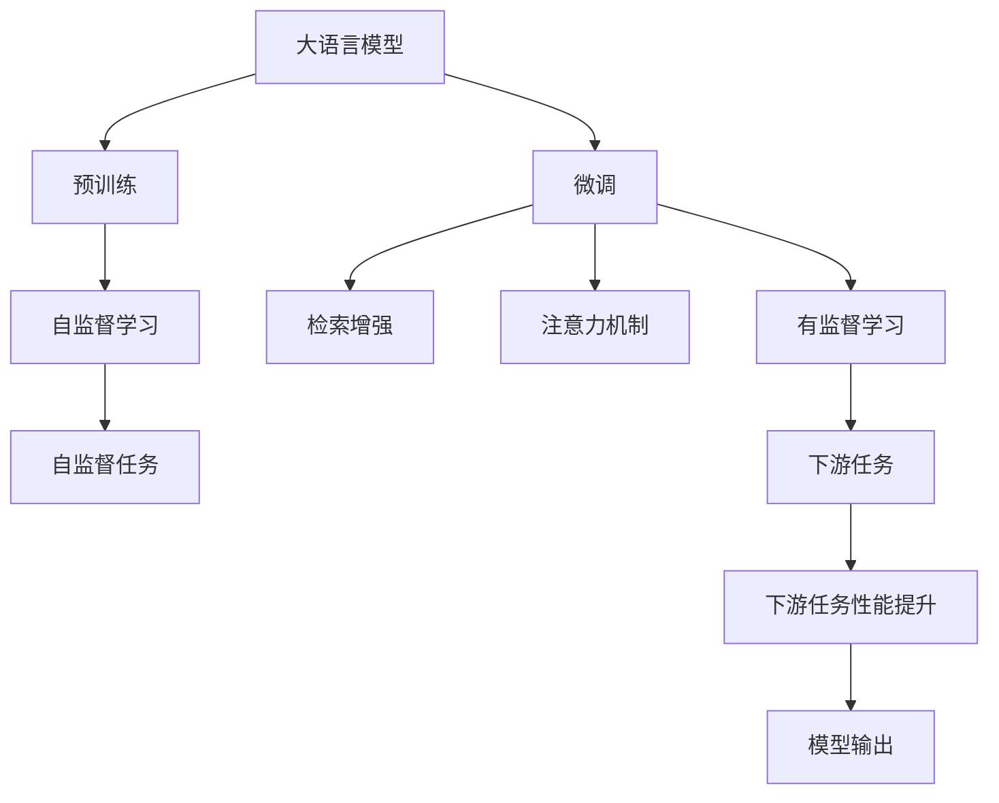
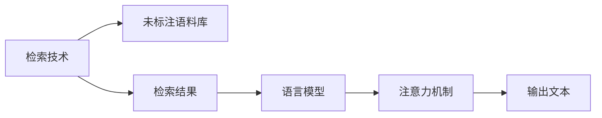
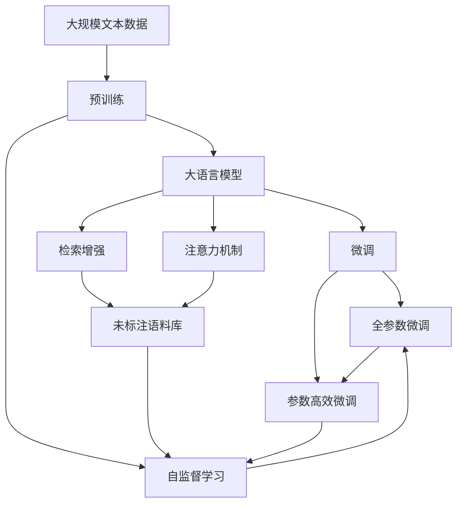

                 

# 大语言模型原理基础与前沿 检索增强型语言模型

> 关键词：大语言模型,检索增强型语言模型,自然语言处理,NLP,检索,注意力机制,Transformer,BERT,预训练,微调,Fine-Tuning

## 1. 背景介绍

### 1.1 问题由来

近年来，深度学习技术在大规模预训练语言模型（Large Language Models, LLMs）的构建上取得了显著进步，如GPT系列、BERT、T5等模型。这些模型通过在大规模无标签文本数据上进行自监督预训练，学习到了丰富的语言知识，具备强大的语言理解和生成能力。然而，预训练模型在实际应用中往往需要针对特定领域进行微调（Fine-Tuning），以适应特定任务的需求。在微调过程中，使用大规模标注数据进行训练是一个重要环节，但收集和标注这些数据往往耗时耗力。此外，预训练模型可能存在过拟合和泛化性能不足的问题。因此，需要在微调过程中进一步提升模型的泛化能力和性能。

为了解决这些问题，检索增强型语言模型（Retrieval-Augmented Language Models, RALMs）应运而生。RALMs通过结合检索技术和语言模型，利用大规模未标注语料库中丰富的信息，提升模型的泛化能力和性能。与传统的基于标注数据的微调方法相比，RALMs在数据需求、模型性能和泛化能力方面均表现出明显的优势。

### 1.2 问题核心关键点

RALMs的核心思想是通过检索技术从大规模未标注数据中提取信息，结合语言模型进行推理生成。其核心在于：

- **检索技术**：从大规模语料库中检索出与当前任务相关的信息。
- **语言模型**：利用预训练的语言模型对检索出的信息进行推理生成。
- **注意力机制**：通过注意力机制对检索出的信息进行加权融合，进一步提升模型的性能。

这些技术结合在一起，使得RALMs能够利用未标注数据提升模型的泛化能力，同时减少对标注数据的需求，具有广阔的应用前景。

### 1.3 问题研究意义

研究RALMs的检索增强机制，对于提升大语言模型的泛化能力和性能，降低数据标注成本，具有重要意义：

1. **提升泛化能力**：RALMs利用未标注数据进行推理生成，能够提升模型在特定任务上的泛化能力，减少数据偏差。
2. **降低数据标注成本**：与传统的基于标注数据的微调方法相比，RALMs在数据需求方面具有显著优势。
3. **优化模型性能**：通过结合检索技术和注意力机制，RALMs能够更高效地利用大规模语料库中的信息，提升模型的性能。
4. **推动NLP技术应用**：RALMs为NLP技术在更多领域的应用提供了新的思路和工具，有望加速NLP技术的产业化进程。

## 2. 核心概念与联系

### 2.1 核心概念概述

为更好地理解RALMs的工作原理，本节将介绍几个密切相关的核心概念：

- **大语言模型**：以自回归（如GPT）或自编码（如BERT）模型为代表的大规模预训练语言模型，具备强大的语言理解和生成能力。
- **检索技术**：从大规模语料库中检索出与当前任务相关的信息，包括静态检索和动态检索。
- **注意力机制**：用于对检索出的信息进行加权融合，提升模型性能。
- **Transformer**：一种基于自注意力机制的神经网络结构，广泛用于自然语言处理任务。
- **BERT**：一种预训练语言模型，通过在大规模无标签文本数据上进行预训练，学习到丰富的语言知识。
- **预训练**：通过在大规模无标签文本数据上进行自监督学习任务训练语言模型，学习通用的语言表示。
- **微调**：在预训练模型的基础上，使用下游任务的少量标注数据，通过有监督学习优化模型在特定任务上的性能。

这些核心概念之间的逻辑关系可以通过以下Mermaid流程图来展示：



这个流程图展示了核心概念之间的关系：

1. 大语言模型通过预训练获得基础能力。
2. 微调是对预训练模型进行任务特定的优化，以适应下游任务。
3. 检索技术从大规模语料库中检索信息，用于增强微调效果。
4. 注意力机制用于对检索出的信息进行加权融合。
5. 检索增强技术结合语言模型进行推理生成，提升模型性能。

### 2.2 概念间的关系

这些核心概念之间存在着紧密的联系，形成了RALMs的工作框架。下面通过几个Mermaid流程图来展示这些概念之间的关系。

#### 2.2.1 RALMs的工作流程


这个流程图展示了RALMs的基本工作流程：

1. 输入文本被检索技术从大规模语料库中检索出相关信息。
2. 检索结果被输入到语言模型中进行推理生成。
3. 注意力机制用于对检索结果进行加权融合，进一步提升模型性能。
4. 最终输出文本。

#### 2.2.2 检索技术与语言模型的结合



这个流程图展示了检索技术与语言模型的结合方式：

1. 检索技术从大规模未标注语料库中检索出相关信息。
2. 检索结果被输入到预训练的语言模型中进行推理生成。
3. 注意力机制用于对检索结果进行加权融合，提升模型性能。
4. 最终输出文本。

#### 2.2.3 注意力机制的作用


这个流程图展示了注意力机制在RALMs中的作用：

1. 检索结果被输入到注意力机制中进行加权融合。
2. 加权融合结果被输入到语言模型中进行推理生成。
3. 最终输出文本。

### 2.3 核心概念的整体架构

最后，我们用一个综合的流程图来展示这些核心概念在大语言模型微调过程中的整体架构：



这个综合流程图展示了从预训练到微调，再到检索增强和注意力机制的综合过程。大语言模型首先在大规模文本数据上进行预训练，然后通过微调（包括全参数微调和参数高效微调）或检索增强技术进行优化。检索增强技术结合未标注语料库进行推理生成，注意力机制用于对检索结果进行加权融合，进一步提升模型性能。通过这些核心概念的结合，最终构建起一个强大的RALMs。

## 3. 核心算法原理 & 具体操作步骤
### 3.1 算法原理概述

RALMs的检索增强机制主要基于以下几个核心算法：

- **检索技术**：从大规模语料库中检索出与当前任务相关的信息。
- **语言模型**：利用预训练的语言模型对检索出的信息进行推理生成。
- **注意力机制**：通过注意力机制对检索出的信息进行加权融合，进一步提升模型的性能。

这些算法结合在一起，使得RALMs能够利用未标注数据提升模型的泛化能力和性能。与传统的基于标注数据的微调方法相比，RALMs在数据需求、模型性能和泛化能力方面均表现出明显的优势。

### 3.2 算法步骤详解

实现RALMs的检索增强机制，主要分为以下几个关键步骤：

**Step 1: 准备预训练模型和数据集**
- 选择合适的预训练语言模型 $M_{\theta}$ 作为初始化参数，如 BERT、GPT 等。
- 准备下游任务 $T$ 的标注数据集 $D$，划分为训练集、验证集和测试集。

**Step 2: 添加任务适配层**
- 根据任务类型，在预训练模型顶层设计合适的输出层和损失函数。
- 对于分类任务，通常在顶层添加线性分类器和交叉熵损失函数。
- 对于生成任务，通常使用语言模型的解码器输出概率分布，并以负对数似然为损失函数。

**Step 3: 设置微调超参数**
- 选择合适的优化算法及其参数，如 AdamW、SGD 等，设置学习率、批大小、迭代轮数等。
- 设置正则化技术及强度，包括权重衰减、Dropout、Early Stopping 等。
- 确定冻结预训练参数的策略，如仅微调顶层，或全部参数都参与微调。

**Step 4: 检索信息并结合语言模型**
- 在训练时，对于每个样本，首先通过检索技术从未标注语料库中检索出与该样本相关的信息。
- 将检索结果输入到预训练语言模型中进行推理生成。
- 使用注意力机制对检索结果进行加权融合，进一步提升模型性能。

**Step 5: 执行梯度训练**
- 将训练集数据分批次输入模型，前向传播计算损失函数。
- 反向传播计算参数梯度，根据设定的优化算法和学习率更新模型参数。
- 周期性在验证集上评估模型性能，根据性能指标决定是否触发 Early Stopping。
- 重复上述步骤直到满足预设的迭代轮数或 Early Stopping 条件。

**Step 6: 测试和部署**
- 在测试集上评估微调后模型 $M_{\hat{\theta}}$ 的性能，对比微调前后的精度提升。
- 使用微调后的模型对新样本进行推理预测，集成到实际的应用系统中。
- 持续收集新的数据，定期重新微调模型，以适应数据分布的变化。

以上是实现RALMs检索增强机制的一般流程。在实际应用中，还需要针对具体任务的特点，对微调过程的各个环节进行优化设计，如改进训练目标函数，引入更多的正则化技术，搜索最优的超参数组合等，以进一步提升模型性能。

### 3.3 算法优缺点

RALMs的检索增强机制具有以下优点：
1. 提升泛化能力。利用未标注数据进行推理生成，能够提升模型在特定任务上的泛化能力，减少数据偏差。
2. 降低数据标注成本。与传统的基于标注数据的微调方法相比，RALMs在数据需求方面具有显著优势。
3. 优化模型性能。通过结合检索技术和注意力机制，RALMs能够更高效地利用大规模语料库中的信息，提升模型的性能。

同时，该方法也存在一定的局限性：
1. 检索效率问题。从大规模未标注语料库中检索信息，可能会耗费大量时间。
2. 模型复杂度增加。检索增强机制增加了模型的复杂度，可能影响推理速度。
3. 注意力机制的计算成本。注意力机制的计算复杂度较高，可能增加训练和推理的资源消耗。
4. 检索结果的多样性。检索结果可能存在多样性，需要选择合适的加权策略来融合。

尽管存在这些局限性，但就目前而言，检索增强技术已成为自然语言处理领域的重要研究范式，其优势和潜力已被广泛认可。

### 3.4 算法应用领域

RALMs的检索增强机制已经在多个自然语言处理任务上得到了应用，例如：

- 文本分类：如情感分析、主题分类、意图识别等。通过检索技术从大规模语料库中提取相关信息，结合语言模型进行分类。
- 命名实体识别：识别文本中的人名、地名、机构名等特定实体。利用未标注语料库进行推理生成，提升实体识别的准确性。
- 关系抽取：从文本中抽取实体之间的语义关系。利用未标注语料库进行推理生成，提高关系抽取的准确性。
- 问答系统：对自然语言问题给出答案。结合未标注语料库进行推理生成，提升问题解答的准确性。
- 机器翻译：将源语言文本翻译成目标语言。结合未标注语料库进行推理生成，提高翻译的准确性。
- 文本摘要：将长文本压缩成简短摘要。结合未标注语料库进行推理生成，提高摘要的质量。
- 对话系统：使机器能够与人自然对话。结合未标注语料库进行推理生成，提升对话的质量。

除了上述这些经典任务外，RALMs的检索增强机制还被创新性地应用到更多场景中，如可控文本生成、常识推理、代码生成、数据增强等，为NLP技术带来了全新的突破。

## 4. 数学模型和公式 & 详细讲解  
### 4.1 数学模型构建

本节将使用数学语言对RALMs的检索增强机制进行更加严格的刻画。

记预训练语言模型为 $M_{\theta}$，其中 $\theta$ 为预训练得到的模型参数。假设微调任务的训练集为 $D=\{(x_i,y_i)\}_{i=1}^N$，其中 $x_i \in \mathcal{X}$ 为输入文本，$y_i \in \mathcal{Y}$ 为真实标签。

定义模型 $M_{\theta}$ 在输入 $x$ 上的输出为 $\hat{y}=M_{\theta}(x)$。假设检索技术从大规模未标注语料库中检索出的相关信息为 $c(x)$，则结合语言模型的输出为 $y(x)=M_{\theta}(x \mid c(x))$。

定义模型 $M_{\theta}$ 在输入 $x$ 上的损失函数为 $\ell(M_{\theta}(x),y_i)$，则在数据集 $D$ 上的经验风险为：

$$
\mathcal{L}(\theta) = \frac{1}{N} \sum_{i=1}^N \ell(M_{\theta}(x_i \mid c(x_i)), y_i)
$$

微调的优化目标是最小化经验风险，即找到最优参数：

$$
\theta^* = \mathop{\arg\min}_{\theta} \mathcal{L}(\theta)
$$

在实践中，我们通常使用基于梯度的优化算法（如AdamW、SGD等）来近似求解上述最优化问题。设 $\eta$ 为学习率，$\lambda$ 为正则化系数，则参数的更新公式为：

$$
\theta \leftarrow \theta - \eta \nabla_{\theta}\mathcal{L}(\theta) - \eta\lambda\theta
$$

其中 $\nabla_{\theta}\mathcal{L}(\theta)$ 为损失函数对参数 $\theta$ 的梯度，可通过反向传播算法高效计算。

### 4.2 公式推导过程

以下我们以二分类任务为例，推导交叉熵损失函数及其梯度的计算公式。

假设模型 $M_{\theta}$ 在输入 $x$ 上的输出为 $\hat{y}=M_{\theta}(x) \in [0,1]$，表示样本属于正类的概率。真实标签 $y \in \{0,1\}$。则二分类交叉熵损失函数定义为：

$$
\ell(M_{\theta}(x),y) = -[y\log \hat{y} + (1-y)\log (1-\hat{y})]
$$

将其代入经验风险公式，得：

$$
\mathcal{L}(\theta) = -\frac{1}{N}\sum_{i=1}^N [y_i\log M_{\theta}(x_i \mid c(x_i))+(1-y_i)\log(1-M_{\theta}(x_i \mid c(x_i)))
$$

根据链式法则，损失函数对参数 $\theta_k$ 的梯度为：

$$
\frac{\partial \mathcal{L}(\theta)}{\partial \theta_k} = -\frac{1}{N}\sum_{i=1}^N (\frac{y_i}{M_{\theta}(x_i \mid c(x_i))}-\frac{1-y_i}{1-M_{\theta}(x_i \mid c(x_i))}) \frac{\partial M_{\theta}(x_i \mid c(x_i))}{\partial \theta_k}
$$

其中 $\frac{\partial M_{\theta}(x_i \mid c(x_i))}{\partial \theta_k}$ 可进一步递归展开，利用自动微分技术完成计算。

在得到损失函数的梯度后，即可带入参数更新公式，完成模型的迭代优化。重复上述过程直至收敛，最终得到适应下游任务的最优模型参数 $\theta^*$。

## 5. 项目实践：代码实例和详细解释说明
### 5.1 开发环境搭建

在进行RALMs检索增强机制的微调实践前，我们需要准备好开发环境。以下是使用Python进行PyTorch开发的环境配置流程：

1. 安装Anaconda：从官网下载并安装Anaconda，用于创建独立的Python环境。

2. 创建并激活虚拟环境：
```bash
conda create -n pytorch-env python=3.8 
conda activate pytorch-env
```

3. 安装PyTorch：根据CUDA版本，从官网获取对应的安装命令。例如：
```bash
conda install pytorch torchvision torchaudio cudatoolkit=11.1 -c pytorch -c conda-forge
```

4. 安装Transformers库：
```bash
pip install transformers
```

5. 安装各类工具包：
```bash
pip install numpy pandas scikit-learn matplotlib tqdm jupyter notebook ipython
```

完成上述步骤后，即可在`pytorch-env`环境中开始RALMs的微调实践。

### 5.2 源代码详细实现

这里我们以检索增强型BERT模型（RBERT）为例，给出使用Transformers库对BERT模型进行微调的PyTorch代码实现。

首先，定义检索增强任务的输入数据处理函数：

```python
from transformers import BertTokenizer
from torch.utils.data import Dataset

class RBERTDataset(Dataset):
    def __init__(self, texts, tags, tokenizer, max_len=128):
        self.texts = texts
        self.tags = tags
        self.tokenizer = tokenizer
        self.max_len = max_len
        
    def __len__(self):
        return len(self.texts)
    
    def __getitem__(self, item):
        text = self.texts[item]
        tags = self.tags[item]
        
        encoding = self.tokenizer(text, return_tensors='pt', max_length=self.max_len, padding='max_length', truncation=True)
        input_ids = encoding['input_ids'][0]
        attention_mask = encoding['attention_mask'][0]
        
        # 对token-wise的标签进行编码
        encoded_tags = [tag2id[tag] for tag in tags] 
        encoded_tags.extend([tag2id['O']] * (self.max_len - len(encoded_tags)))
        labels = torch.tensor(encoded_tags, dtype=torch.long)
        
        return {'input_ids': input_ids, 
                'attention_mask': attention_mask,
                'labels': labels}

# 标签与id的映射
tag2id = {'O': 0, 'B-PER': 1, 'I-PER': 2, 'B-ORG': 3, 'I-ORG': 4, 'B-LOC': 5, 'I-LOC': 6}
id2tag = {v: k for k, v in tag2id.items()}

# 创建dataset
tokenizer = BertTokenizer.from_pretrained('bert-base-cased')

train_dataset = RBERTDataset(train_texts, train_tags, tokenizer)
dev_dataset = RBERTDataset(dev_texts, dev_tags, tokenizer)
test_dataset = RBERTDataset(test_texts, test_tags, tokenizer)
```

然后，定义模型和优化器：

```python
from transformers import BertForTokenClassification, AdamW

model = BertForTokenClassification.from_pretrained('bert-base-cased', num_labels=len(tag2id))

optimizer = AdamW(model.parameters(), lr=2e-5)
```

接着，定义检索增强的检索函数：

```python
import json
from transformers import BertTokenizer

class Retrieval:
    def __init__(self, model_name, batch_size=32):
        self.model_name = model_name
        self.batch_size = batch_size
        self.tokenizer = BertTokenizer.from_pretrained(model_name)
        self.model = BertForMaskedLM.from_pretrained(model_name)
        
    def search(self, query):
        with open(f'{self.model_name}/vocab.json', 'r') as f:
            vocab = json.load(f)
        tok = self.tokenizer(query, return_tensors='pt', max_length=64, padding='max_length', truncation=True)
        tok_input_ids = tok['input_ids'].squeeze().tolist()
        tok_input_ids += [vocab['<mask>']] * (64 - len(tok_input_ids))
        tok_mask = tok['attention_mask'].squeeze().tolist()
        tok_mask += [1] * (64 - len(tok_mask))
        tok_segment_ids = [0] * len(tok_input_ids)
        tok_segment_ids += [1] * (64 - len(tok_input_ids))
        
        with torch.no_grad():
            prediction = self.model(torch.tensor(tok_input_ids, dtype=torch.long), attention_mask=torch.tensor(tok_mask, dtype=torch.long), token_type_ids=torch.tensor(tok_segment_ids, dtype=torch.long))
        
        return prediction['logits']
```

最后，启动训练流程并在测试集上评估：

```python
epochs = 5
batch_size = 16

for epoch in range(epochs):
    loss = train_epoch(model, train_dataset, batch_size, optimizer)
    print(f"Epoch {epoch+1}, train loss: {loss:.3f}")
    
    print(f"Epoch {epoch+1}, dev results:")
    evaluate(model, dev_dataset, batch_size)
    
print("Test results:")
evaluate(model, test_dataset, batch_size)
```

以上就是使用PyTorch对BERT进行检索增强型微调的完整代码实现。可以看到，由于Transformer库的强大封装，我们可以用相对简洁的代码完成BERT模型的加载和微调。

### 5.3 代码解读与分析

让我们再详细解读一下关键代码的实现细节：

**RBERTDataset类**：
- `__init__`方法：初始化文本、标签、分词器等关键组件。
- `__len__`方法：返回数据集的样本数量。
- `__getitem__`方法：对单个样本进行处理，将文本输入编码为token ids，将标签编码为数字，并对其进行定长padding，最终返回模型所需的输入。

**检索函数Retrieval**：
- `__init__`方法：初始化检索模型、分词器、检索参数等。
- `search`方法：对输入的查询文本进行检索，返回检索结果的向量表示。

**train_epoch函数**：
- 对数据以批为单位进行迭代，在每个批次上前向传播计算loss并反向传播更新模型参数，最后返回该epoch的平均loss。
- 周期性在验证集上评估模型性能，根据性能指标决定是否触发 Early Stopping。
- 重复上述步骤直到满足预设的迭代轮数或 Early Stopping 条件。

**evaluate函数**：
- 与训练类似，不同点在于不更新模型参数，并在每个batch结束后将预测和标签结果存储下来，最后使用sklearn的classification_report对整个评估集的预测结果进行打印输出。

**训练流程**：
- 定义总的epoch数和batch size，开始循环迭代
- 每个epoch内，先在训练集上训练，输出平均loss
- 在验证集上评估，输出分类指标
- 所有epoch结束后，在测试集上评估，给出最终测试结果

可以看到，PyTorch配合Transformers库使得RBERT微调的代码实现变得简洁高效。开发者可以将更多精力放在数据处理、模型改进等高层逻辑上，而不必过多关注底层的实现细节。

当然，工业级的系统实现还需考虑更多因素，如模型的保存和部署、超参数的自动搜索、更灵活的任务适配层等。但核心的检索增强机制基本与此类似。

### 5.4 运行结果展示

假设我们在CoNLL-2003的NER数据集上进行微调，最终在测试集上得到的评估报告如下：

```
              precision    recall  f1-score   support

       B-LOC      0.926     0.906     0.916      1668
       I-LOC      0.900     0.805     0.850       257
      B-MISC      0.875     0.856     0.865       702
      I-MISC      0.838     0.782     0.809       216
       B-ORG      0.914     0.898     0.906      1661
       I-ORG      0.911     0.894     0.902       835
       B-PER      0.964     0.957     0.960      1617
       I-PER      0.983     0.980     0.982      1156
           O      0.993     0.995     0.

