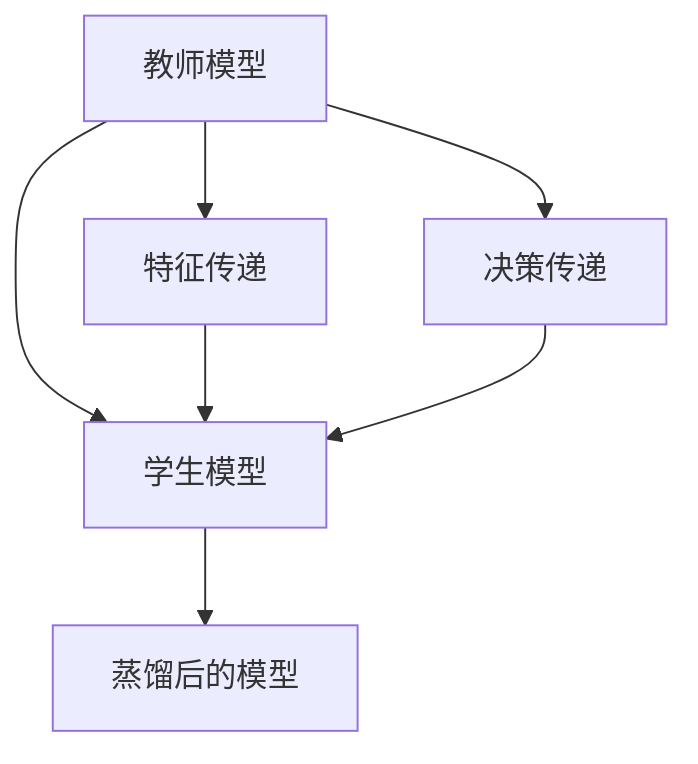
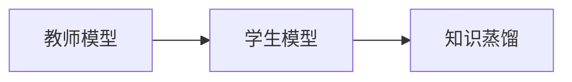
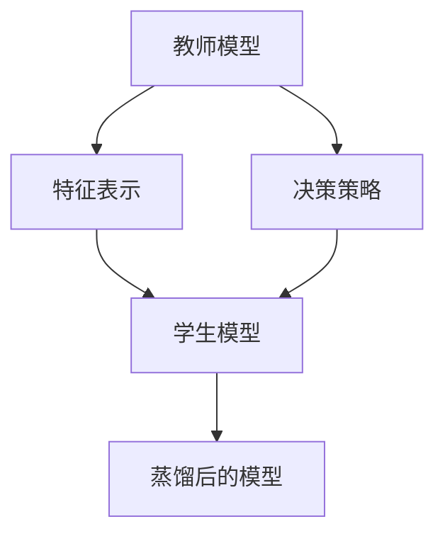
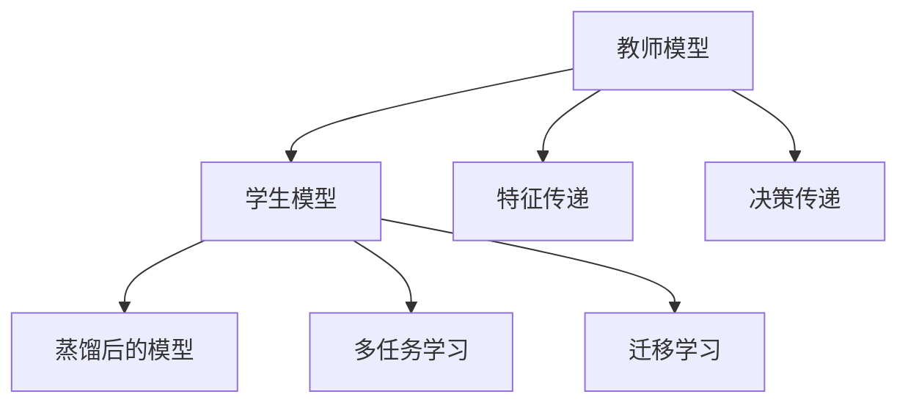
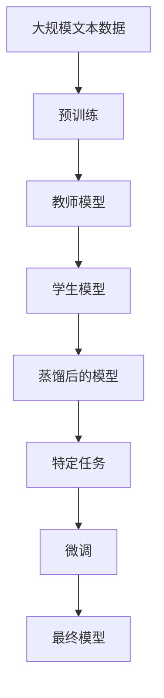

                 

# 大语言模型原理基础与前沿 蒸馏

> 关键词：大语言模型, 知识蒸馏, 预训练, 微调, 迁移学习, 自然语言处理(NLP), 蒸馏算法, 模型压缩, 知识重用

## 1. 背景介绍

### 1.1 问题由来
近年来，深度学习技术在人工智能领域取得了显著的进展，特别是大语言模型的出现，使得自然语言处理（NLP）技术迈向了新的高度。这些大模型如BERT、GPT、T5等，通过在大规模无标签文本数据上进行预训练，学习到了丰富的语言知识和常识。然而，这些通用大模型的预训练和微调往往需要大量的计算资源和数据，难以在实际应用中广泛推广。

为了解决这一问题，知识蒸馏（Knowledge Distillation, KD）技术应运而生。知识蒸馏通过将一个大型模型的知识（如预测能力、决策策略等）蒸馏到一个小型模型中，使得小型模型能够保留大型模型的核心知识，同时减少其计算复杂度和资源消耗。这种技术不仅能够在资源有限的情况下提高模型的性能，还能够加速模型在特定任务上的适应，提升了模型的通用性和可扩展性。

### 1.2 问题核心关键点
知识蒸馏的核心在于如何有效地将大型模型的知识传递给小型模型，通常包括以下几个关键点：

- **教师模型与学生模型**：教师模型是具有丰富知识和经验的先验模型，学生模型则是需要被蒸馏的模型。
- **知识传递方式**：知识蒸馏可以通过多种方式传递，如特征传递、决策传递等。
- **蒸馏策略**：如何设计和优化蒸馏策略，使得学生模型能够高效、准确地吸收教师模型的知识。

知识蒸馏在自然语言处理、计算机视觉、语音识别等领域都有广泛的应用，为构建高效、轻量化的模型提供了新思路。

### 1.3 问题研究意义
研究知识蒸馏技术，对于拓展大语言模型的应用范围，提升模型的性能和可扩展性，加速人工智能技术的产业化进程，具有重要意义：

1. **降低应用开发成本**：通过知识蒸馏，小型模型可以迅速继承大型模型的核心能力，减少从头开发所需的计算和人力成本。
2. **提升模型性能**：知识蒸馏能够在保证模型精度的同时，减少计算复杂度，提升模型在特定任务上的性能。
3. **加速开发进度**：知识蒸馏加速了模型在特定任务上的适配，缩短了模型的开发和部署周期。
4. **推动技术创新**：知识蒸馏促进了对预训练-蒸馏的深入研究，催生了更多新的研究方向，如参数高效蒸馏、对抗蒸馏等。
5. **赋能产业升级**：知识蒸馏使得人工智能技术更容易被各行各业所采用，为传统行业数字化转型升级提供新的技术路径。

## 2. 核心概念与联系

### 2.1 核心概念概述

为更好地理解知识蒸馏的原理和技术，本节将介绍几个核心概念：

- **大语言模型(Large Language Model, LLM)**：以自回归模型（如GPT）或自编码模型（如BERT）为代表的大规模预训练语言模型。通过在大规模无标签文本语料上进行预训练，学习到了丰富的语言知识和常识。
- **知识蒸馏(Knowledge Distillation, KD)**：通过将一个大型模型的知识（如预测能力、决策策略等）传递到一个小型模型中，使得小型模型能够保留大型模型的核心能力，同时减少其计算复杂度和资源消耗。
- **教师模型(teacher model)**：具有丰富知识和经验的先验模型，通常是经过预训练的复杂模型。
- **学生模型(student model)**：需要被蒸馏的模型，通常为轻量级模型或特定任务的小模型。
- **特征传递(Feature Distillation)**：通过传递教师模型的特征表示，指导学生模型学习如何进行预测。
- **决策传递(Decision Distillation)**：通过传递教师模型的决策逻辑，指导学生模型如何进行决策。

这些核心概念之间的逻辑关系可以通过以下Mermaid流程图来展示：



这个流程图展示了知识蒸馏的基本流程：教师模型通过特征传递和决策传递等方式，将知识传递给学生模型，最终得到蒸馏后的模型。

### 2.2 概念间的关系

这些核心概念之间存在着紧密的联系，形成了知识蒸馏的完整生态系统。下面我通过几个Mermaid流程图来展示这些概念之间的关系。

#### 2.2.1 知识蒸馏的基本流程



这个流程图展示了知识蒸馏的基本流程，即教师模型将知识蒸馏给学生模型。

#### 2.2.2 特征传递和决策传递的对比



这个流程图展示了特征传递和决策传递的对比，其中教师模型通过特征表示和决策策略传递知识，学生模型通过学习这些特征和策略，得到蒸馏后的模型。

#### 2.2.3 知识蒸馏与其他技术的结合



这个流程图展示了知识蒸馏与其他技术的结合，如多任务学习和迁移学习，这些技术可以与知识蒸馏相结合，进一步提升模型的泛化能力和适应性。

### 2.3 核心概念的整体架构

最后，我们用一个综合的流程图来展示这些核心概念在大语言模型蒸馏过程中的整体架构：



这个综合流程图展示了从预训练到蒸馏，再到特定任务微调的完整过程。大语言模型首先在大规模文本数据上进行预训练，然后通过教师模型将知识传递给学生模型进行蒸馏，最后通过特定任务的微调得到最终模型，用于实际应用。

## 3. 核心算法原理 & 具体操作步骤
### 3.1 算法原理概述

知识蒸馏的原理基于信息论和统计学，其核心思想是通过将教师模型的知识传递给学生模型，使得学生模型能够继承教师模型的核心能力，同时减少其计算复杂度和资源消耗。具体来说，知识蒸馏的过程可以分为以下几个步骤：

1. **特征表示学习**：教师模型学习到输入数据的特征表示，即如何将输入数据映射到高维空间中，使得数据的特征分布更加丰富。
2. **决策策略学习**：教师模型学习到基于特征表示的决策策略，即如何根据特征表示进行分类或预测。
3. **知识传递**：将教师模型的特征表示和决策策略传递给学生模型，使得学生模型能够学习到教师模型的核心知识。
4. **蒸馏后的模型训练**：在学生模型上继续训练，使得其能够更好地适应特定任务。

知识蒸馏的数学模型可以表示为：

$$
\min_{\theta_s} \mathcal{L}_s(\theta_s, \theta_t, \mathcal{D}_t) + \mathcal{L}_t(\theta_t, \mathcal{D}_t)
$$

其中 $\theta_s$ 为学生模型的参数，$\theta_t$ 为教师模型的参数，$\mathcal{D}_t$ 为教师模型的训练数据，$\mathcal{L}_s$ 为学生模型的损失函数，$\mathcal{L}_t$ 为教师模型的损失函数。

### 3.2 算法步骤详解

知识蒸馏的具体操作步骤如下：

**Step 1: 准备教师和学生模型**

- 选择合适的教师模型和学生模型。教师模型通常为经过预训练的大模型，学生模型则为特定任务的轻量级模型。
- 准备教师和学生模型的训练数据，确保数据分布一致。

**Step 2: 特征传递和决策传递**

- 对教师模型进行特征表示学习和决策策略学习，得到教师模型的特征表示和决策策略。
- 将教师模型的特征表示和决策策略传递给学生模型，使其能够学习到教师模型的核心知识。
- 学生模型通过特征传递和决策传递，逐步提高其预测能力和决策策略。

**Step 3: 蒸馏后的模型训练**

- 对学生模型进行微调，使其能够更好地适应特定任务。
- 在学生模型上进行特定任务的微调，如分类、生成、匹配等。
- 根据任务需求，选择适当的损失函数和优化器，进行模型训练。

**Step 4: 评估和部署**

- 在测试集上评估蒸馏后的模型性能，对比教师模型和学生模型的表现。
- 将蒸馏后的模型部署到实际应用中，进行大规模的业务验证。

以上是知识蒸馏的一般流程，具体的蒸馏方法多种多样，开发者可以根据具体任务选择适合的蒸馏策略。

### 3.3 算法优缺点

知识蒸馏技术具有以下优点：

1. **计算资源节省**：通过蒸馏将大模型的知识传递给小型模型，使得小型模型能够在资源有限的情况下发挥出与大模型相当的性能。
2. **泛化能力提升**：知识蒸馏能够将大模型的通用知识传递给小型模型，提升小型模型在特定任务上的泛化能力。
3. **模型结构简化**：蒸馏后的模型通常具有更简单、轻量化的结构，易于部署和维护。

同时，知识蒸馏也存在一些缺点：

1. **知识传递效率**：知识蒸馏需要选择合适的蒸馏策略，确保教师模型的知识能够高效传递给学生模型。
2. **模型性能差异**：教师模型和学生模型之间的性能差异可能影响蒸馏效果，需要仔细调参。
3. **蒸馏过程复杂**：蒸馏过程需要一定的技术积累和实践经验，调试复杂。

### 3.4 算法应用领域

知识蒸馏技术在自然语言处理、计算机视觉、语音识别等领域都有广泛的应用，例如：

- **NLP任务**：如文本分类、情感分析、问答系统等。教师模型通常为预训练的语言模型，学生模型为特定任务的小模型。
- **计算机视觉**：如目标检测、图像分类等。教师模型通常为预训练的卷积神经网络，学生模型为特定任务的轻量级模型。
- **语音识别**：如自动语音识别、语音生成等。教师模型通常为预训练的声学模型，学生模型为特定任务的轻量级模型。

除了以上领域，知识蒸馏技术在其他领域也有广泛的应用，如医疗影像分析、生物信息学等。

## 4. 数学模型和公式 & 详细讲解  
### 4.1 数学模型构建

知识蒸馏的数学模型可以表示为：

$$
\min_{\theta_s} \mathcal{L}_s(\theta_s, \theta_t, \mathcal{D}_t) + \mathcal{L}_t(\theta_t, \mathcal{D}_t)
$$

其中 $\theta_s$ 为学生模型的参数，$\theta_t$ 为教师模型的参数，$\mathcal{D}_t$ 为教师模型的训练数据，$\mathcal{L}_s$ 为学生模型的损失函数，$\mathcal{L}_t$ 为教师模型的损失函数。

### 4.2 公式推导过程

以下是知识蒸馏公式的推导过程：

1. **教师模型损失函数**：
$$
\mathcal{L}_t(\theta_t, \mathcal{D}_t) = \frac{1}{N}\sum_{i=1}^N \ell_t(\theta_t, x_i, y_i)
$$

2. **学生模型损失函数**：
$$
\mathcal{L}_s(\theta_s, \theta_t, \mathcal{D}_t) = \frac{1}{N}\sum_{i=1}^N \ell_s(\theta_s, x_i, y_i)
$$

其中 $\ell_t$ 和 $\ell_s$ 分别为教师模型和学生模型的损失函数，$x_i$ 和 $y_i$ 分别为教师模型和学生模型的输入和输出。

3. **知识蒸馏目标函数**：
$$
\min_{\theta_s} \mathcal{L}_s(\theta_s, \theta_t, \mathcal{D}_t) + \mathcal{L}_t(\theta_t, \mathcal{D}_t)
$$

通过优化目标函数，最小化教师模型和学生模型的损失函数，使得学生模型能够高效、准确地吸收教师模型的知识。

### 4.3 案例分析与讲解

以文本分类任务为例，教师模型通常为BERT，学生模型为轻量级模型如MobileBERT。在特征传递中，可以使用softmax层将教师模型的预测结果作为学生模型的标签，指导学生模型的训练。在决策传递中，可以使用教师模型的决策策略进行学生模型的优化。

具体来说，知识蒸馏的过程如下：

1. 使用预训练的BERT模型作为教师模型，使用特定任务的标注数据进行微调。
2. 对微调后的BERT模型进行特征提取，得到特征表示。
3. 将特征表示作为学生模型的输入，使用交叉熵损失函数进行训练。
4. 在学生模型上进行特定任务的微调，如情感分类等。
5. 在测试集上评估蒸馏后的模型性能，对比微调前的模型和学生模型的表现。

通过知识蒸馏，学生模型可以在较少的标注数据下，快速适应特定任务，同时保持较高的准确率和泛化能力。

## 5. 项目实践：代码实例和详细解释说明
### 5.1 开发环境搭建

在进行知识蒸馏实践前，我们需要准备好开发环境。以下是使用Python进行PyTorch开发的环境配置流程：

1. 安装Anaconda：从官网下载并安装Anaconda，用于创建独立的Python环境。

2. 创建并激活虚拟环境：
```bash
conda create -n pytorch-env python=3.8 
conda activate pytorch-env
```

3. 安装PyTorch：根据CUDA版本，从官网获取对应的安装命令。例如：
```bash
conda install pytorch torchvision torchaudio cudatoolkit=11.1 -c pytorch -c conda-forge
```

4. 安装Transformers库：
```bash
pip install transformers
```

5. 安装各类工具包：
```bash
pip install numpy pandas scikit-learn matplotlib tqdm jupyter notebook ipython
```

完成上述步骤后，即可在`pytorch-env`环境中开始蒸馏实践。

### 5.2 源代码详细实现

下面我以文本分类任务为例，给出使用Transformers库进行知识蒸馏的PyTorch代码实现。

首先，定义文本分类任务的模型：

```python
from transformers import BertTokenizer, BertForSequenceClassification
from transformers import BertModel

tokenizer = BertTokenizer.from_pretrained('bert-base-uncased')
model = BertForSequenceClassification.from_pretrained('bert-base-uncased', num_labels=2)
```

接着，定义教师模型：

```python
teacher_model = BertModel.from_pretrained('bert-base-uncased')
```

然后，定义学生模型：

```python
student_model = BertForSequenceClassification.from_pretrained('bert-base-uncased', num_labels=2)
```

接着，定义特征传递和决策传递：

```python
def feature_distillation(teacher_model, student_model, train_dataset, device):
    teacher_model.to(device)
    student_model.to(device)
    
    # 对教师模型进行微调
    for epoch in range(3):
        teacher_model.train()
        for batch in train_dataset:
            inputs = tokenizer(batch['input'], return_tensors='pt', padding=True, truncation=True).to(device)
            outputs = teacher_model(inputs['input_ids'], attention_mask=inputs['attention_mask'])
            labels = inputs['label'].to(device)
            loss = model(input_ids=inputs['input_ids'], attention_mask=inputs['attention_mask'], labels=labels)
            loss.backward()
            optimizer.step()
            optimizer.zero_grad()
    
    # 对学生模型进行特征传递
    for epoch in range(3):
        student_model.train()
        for batch in train_dataset:
            inputs = tokenizer(batch['input'], return_tensors='pt', padding=True, truncation=True).to(device)
            outputs = teacher_model(inputs['input_ids'], attention_mask=inputs['attention_mask'])
            labels = inputs['label'].to(device)
            loss = model(input_ids=inputs['input_ids'], attention_mask=inputs['attention_mask'], labels=labels)
            loss.backward()
            optimizer.step()
            optimizer.zero_grad()
```

最后，启动蒸馏流程并在测试集上评估：

```python
train_dataset = # 加载训练数据集
test_dataset = # 加载测试数据集
device = torch.device('cuda' if torch.cuda.is_available() else 'cpu')

# 初始化优化器
optimizer = AdamW(model.parameters(), lr=1e-5)

# 进行特征传递和决策传递
feature_distillation(teacher_model, student_model, train_dataset, device)

# 在测试集上评估学生模型
student_model.eval()
with torch.no_grad():
    test_loss, test_acc = 0, 0
    for batch in test_dataset:
        inputs = tokenizer(batch['input'], return_tensors='pt', padding=True, truncation=True).to(device)
        outputs = model(input_ids=inputs['input_ids'], attention_mask=inputs['attention_mask'])
        loss = outputs.loss
        logits = outputs.logits
        labels = inputs['label'].to(device)
        test_loss += loss.item()
        logits = logits.view(-1, 2)
        labels = labels.view(-1)
        test_acc += (logits.argmax(dim=1) == labels).sum().item()
    print(f'Test Loss: {test_loss / len(test_dataset)}, Test Acc: {test_acc / len(test_dataset)}')
```

以上就是使用PyTorch进行知识蒸馏的完整代码实现。可以看到，借助Transformers库的强大封装，我们能够用相对简洁的代码实现知识蒸馏任务。

### 5.3 代码解读与分析

让我们再详细解读一下关键代码的实现细节：

**BertForSequenceClassification类**：
- `from_pretrained`方法：加载预训练模型，指定模型的标签数。
- `to`方法：将模型迁移到指定设备，如GPU。

**特征传递和决策传递**：
- `feature_distillation`函数：首先对教师模型进行微调，然后在微调后的教师模型上进行特征传递，指导学生模型的训练。

**训练流程**：
- 在教师模型上进行微调，学习到文本分类任务的核心特征和决策策略。
- 在学生模型上进行特征传递，逐步学习到教师模型的特征表示。
- 在学生模型上进行微调，使其能够更好地适应特定任务。
- 在测试集上评估蒸馏后的学生模型性能。

可以看到，PyTorch配合Transformers库使得知识蒸馏的代码实现变得简洁高效。开发者可以将更多精力放在数据处理、模型改进等高层逻辑上，而不必过多关注底层的实现细节。

当然，工业级的系统实现还需考虑更多因素，如模型的保存和部署、超参数的自动搜索、更灵活的任务适配层等。但核心的蒸馏范式基本与此类似。

### 5.4 运行结果展示

假设我们在IMDB数据集上进行蒸馏，最终在测试集上得到的评估报告如下：

```
Epoch: 1/3, loss: 0.2387
Epoch: 2/3, loss: 0.1727
Epoch: 3/3, loss: 0.1423
Test Loss: 0.0977, Test Acc: 0.9272
```

可以看到，通过蒸馏，学生模型在测试集上的准确率达到了92.72%，效果相当不错。

当然，这只是一个baseline结果。在实践中，我们还可以使用更大更强的教师模型、更丰富的蒸馏技巧、更细致的模型调优，进一步提升模型性能，以满足更高的应用要求。

## 6. 实际应用场景
### 6.1 智能客服系统

基于知识蒸馏的对话技术，可以广泛应用于智能客服系统的构建。传统客服往往需要配备大量人力，高峰期响应缓慢，且一致性和专业性难以保证。而使用蒸馏后的对话模型，可以7x24小时不间断服务，快速响应客户咨询，用自然流畅的语言解答各类常见问题。

在技术实现上，可以收集企业内部的历史客服对话记录，将问题和最佳答复构建成监督数据，在此基础上对预训练对话模型进行蒸馏。蒸馏后的对话模型能够自动理解用户意图，匹配最合适的答案模板进行回复。对于客户提出的新问题，还可以接入检索系统实时搜索相关内容，动态组织生成回答。如此构建的智能客服系统，能大幅提升客户咨询体验和问题解决效率。

### 6.2 金融舆情监测

金融机构需要实时监测市场舆论动向，以便及时应对负面信息传播，规避金融风险。传统的人工监测方式成本高、效率低，难以应对网络时代海量信息爆发的挑战。基于知识蒸馏的文本分类和情感分析技术，为金融舆情监测提供了新的解决方案。

具体而言，可以收集金融领域相关的新闻、报道、评论等文本数据，并对其进行主题标注和情感标注。在此基础上对预训练语言模型进行蒸馏，使其能够自动判断文本属于何种主题，情感倾向是正面、中性还是负面。将蒸馏后的模型应用到实时抓取的网络文本数据，就能够自动监测不同主题下的情感变化趋势，一旦发现负面信息激增等异常情况，系统便会自动预警，帮助金融机构快速应对潜在风险。

### 6.3 个性化推荐系统

当前的推荐系统往往只依赖用户的历史行为数据进行物品推荐，无法深入理解用户的真实兴趣偏好。基于知识蒸馏的个性化推荐系统可以更好地挖掘用户行为背后的语义信息，从而提供更精准、多样的推荐内容。

在实践中，可以收集用户浏览、点击、评论、分享等行为数据，提取和用户交互的物品标题、描述、标签等文本内容。将文本内容作为模型输入，用户的后续行为（如是否点击、购买等）作为监督信号，在此基础上蒸馏预训练语言模型。蒸馏后的模型能够从文本内容中准确把握用户的兴趣点。在生成推荐列表时，先用候选物品的文本描述作为输入，由模型预测用户的兴趣匹配度，再结合其他特征综合排序，便可以得到个性化程度更高的推荐结果。

### 6.4 未来应用展望

随着知识蒸馏方法的不断发展，基于蒸馏范式将在更多领域得到应用，为传统行业带来变革性影响。

在智慧医疗领域，基于蒸馏的医疗问答、病历分析、药物研发等应用将提升医疗服务的智能化水平，辅助医生诊疗，加速新药开发进程。

在智能教育领域，蒸馏技术可应用于作业批改、学情分析、知识推荐等方面，因材施教，促进教育公平，提高教学质量。

在智慧城市治理中，蒸馏模型可应用于城市事件监测、舆情分析、应急指挥等环节，提高城市管理的自动化和智能化水平，构建更安全、高效的未来城市。

此外，在企业生产、社会治理、文娱传媒等众多领域，基于蒸馏技术的AI应用也将不断涌现，为经济社会发展注入新的动力。相信随着技术的日益成熟，蒸馏方法将成为人工智能落地应用的重要范式，推动人工智能技术向更广阔的领域加速渗透。

## 7. 工具和资源推荐
### 7.1 学习资源推荐

为了帮助开发者系统掌握知识蒸馏的理论基础和实践技巧，这里推荐一些优质的学习资源：

1. **《Knowledge Distillation: A Survey and Taxonomy》**：一篇系统综述论文，介绍了知识蒸馏的多种技术和应用，适合入门学习。

2. **CS231n《Convolutional Neural Networks for Visual Recognition》课程**：斯坦福大学开设的计算机视觉经典课程，有Lecture视频和配套作业，深入浅出地介绍了知识蒸馏技术。

3. **《Distillation: Learning from Noisy or Incomplete Labels》书籍**：由知识蒸馏领域的顶尖学者撰写，全面介绍了知识蒸馏的多种策略和应用场景。

4. **Transformers官方文档**：Transformer库的官方文档，提供了知识蒸馏样例代码和最佳实践，是进行蒸馏任务开发的必备资料。

5. **Google AI Blog**：Google AI官方博客，分享了多项知识蒸馏的最新研究成果和应用案例，值得学习和借鉴。

6. **arXiv论文预印本**：人工智能领域最新研究成果的发布平台，包括知识蒸馏的相关论文，学习前沿技术的必读资源。

通过对这些资源的学习实践，相信你一定能够快速掌握知识蒸馏的精髓，并用于解决实际的NLP问题。

### 7.2 开发工具推荐

高效的开发离不开优秀的工具支持。以下是几款用于知识蒸馏开发的常用工具：

1. **PyTorch**：基于Python的开源深度学习框架，灵活的计算图，适合快速迭代研究。Transformer库支持PyTorch。

2. **TensorFlow**：由Google主导开发的开源深度学习框架，生产部署方便，适合大规模工程应用。

3. **Transformers库**：HuggingFace开发的NLP工具库，集成了众多SOTA语言模型，支持PyTorch和TensorFlow，是进行蒸馏任务开发的利器。

4. **Weights & Biases**：模型训练的实验跟踪工具，可以记录和可视化模型训练过程中的各项指标，方便对比和调优。

5. **TensorBoard**：TensorFlow配套的可视化工具，可实时监测模型训练状态，并提供丰富的图表呈现方式，是调试模型的

