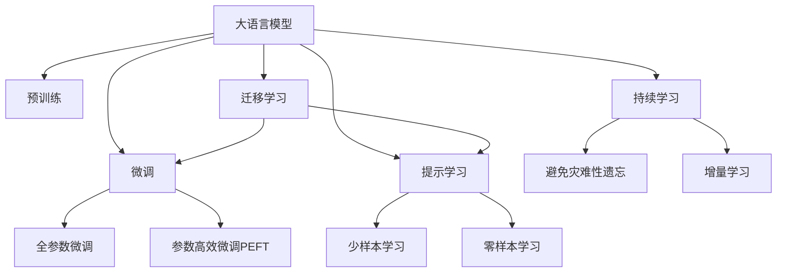
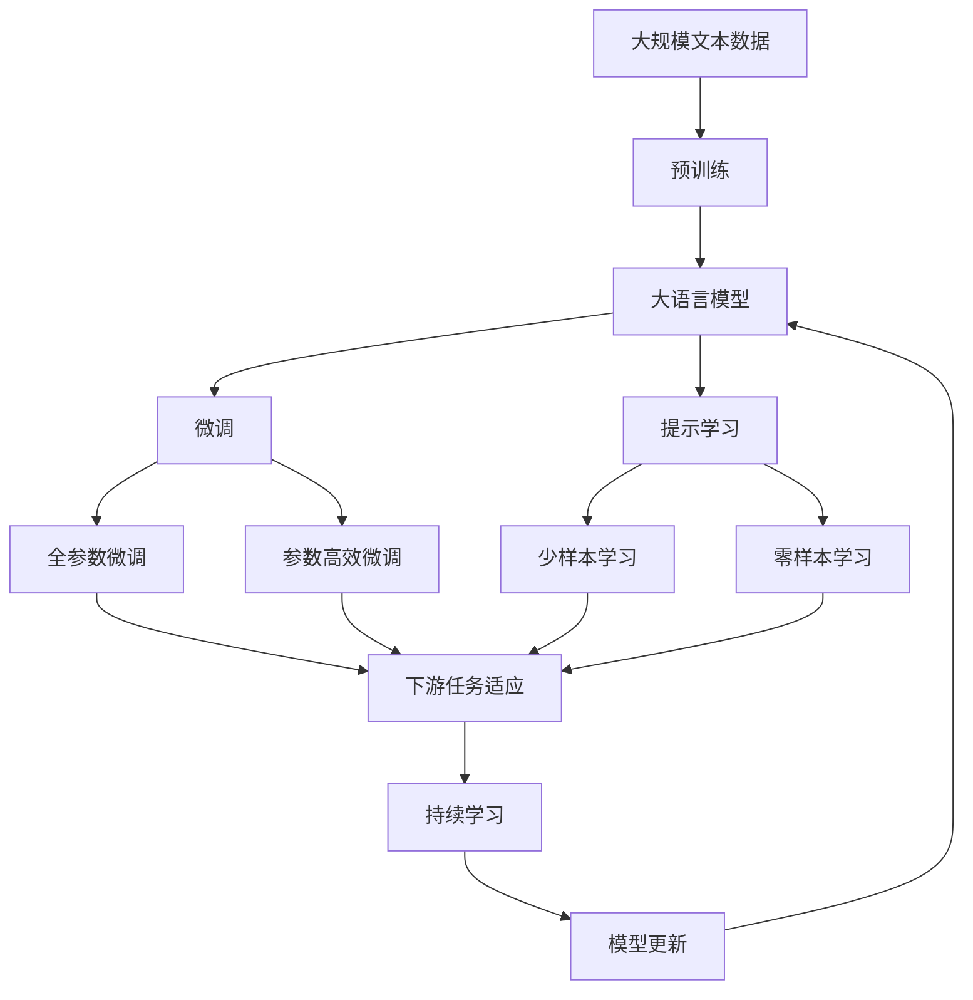

                 

# 大语言模型应用指南：Completion交互格式

> 关键词：大语言模型,微调,Fine-tuning,迁移学习,Transformer,BERT,预训练,下游任务,参数高效微调,自然语言处理(NLP)

## 1. 背景介绍

### 1.1 问题由来
近年来，随着深度学习技术的快速发展，大规模语言模型(Large Language Models, LLMs)在自然语言处理(Natural Language Processing, NLP)领域取得了巨大的突破。这些大语言模型通过在大规模无标签文本数据上进行预训练，学习到了丰富的语言知识和常识，可以通过少量的有标签样本在下游任务上进行微调(Fine-Tuning)，获得优异的性能。其中最具代表性的大语言模型包括OpenAI的GPT系列模型、Google的BERT、T5等。

然而，由于预训练语料的广泛性和泛化能力的不足，这些通用的大语言模型在特定领域应用时，效果往往难以达到实际应用的要求。因此，如何针对特定任务进行大模型微调，提升模型性能，成为了当前大语言模型研究和应用的一个热点问题。本文聚焦于Completion交互格式在微调过程中的应用，但同时也会兼顾参数高效微调和提示学习等前沿技术，以期对大语言模型微调实践提供更全面的指导。

### 1.2 问题核心关键点
Completion交互格式是一种在大语言模型微调过程中常用的技术，其核心思想是通过在输入文本中添加特定的提示模板(Prompt Template)，引导模型生成与用户输入相匹配的输出。与传统的微调方法相比，Completion交互格式具有以下优势：
- 零样本和少样本学习：可以在没有进行任何微调的情况下，利用预训练模型生成高质量的文本，尤其适合数据稀缺的场景。
- 提高泛化能力：通过精心设计的提示模板，模型可以学习到更加通用的语言表示，提升在不同数据分布上的泛化能力。
- 减少标注数据依赖：可以通过少量的标注数据进行微调，极大降低了微调对标注数据的依赖。
- 参数高效：在不需要额外训练参数的情况下，提升模型的生成效果，降低了计算资源的消耗。
- 对抗性训练：通过对抗性示例，提高模型的鲁棒性，避免过拟合。

Completion交互格式的核心原理是在大语言模型基础上，利用其强大的语言生成能力，通过简单的提示模板引导模型生成用户期望的输出。这种技术不仅在自然语言生成领域得到广泛应用，也在问答系统、摘要生成、代码自动补全等NLP任务中得到验证，显示出极大的潜力。

### 1.3 问题研究意义
研究Completion交互格式在大语言模型微调中的应用，对于拓展大模型的应用范围，提升下游任务的性能，加速NLP技术的产业化进程，具有重要意义：

1. 降低应用开发成本。Completion交互格式可以显著减少从头开发所需的数据、计算和人力等成本投入。
2. 提升模型效果。通过精心设计的提示模板，模型能够生成高质量的文本，在特定任务上取得更优表现。
3. 加速开发进度。standing on the shoulders of giants，Completion交互格式使得开发者可以更快地完成任务适配，缩短开发周期。
4. 带来技术创新。Completion交互格式促进了对预训练-微调的深入研究，催生了提示学习、少样本学习等新的研究方向。
5. 赋能产业升级。Completion交互格式使得NLP技术更容易被各行各业所采用，为传统行业数字化转型升级提供新的技术路径。

Completion交互格式作为一种高效、灵活的微调方法，能够广泛应用于NLP任务的各个领域，为解决实际问题提供了一种全新的思路和方法。随着大语言模型和微调方法的持续演进，Completion交互格式必将在构建人机协同的智能时代中扮演越来越重要的角色。

## 2. 核心概念与联系

### 2.1 核心概念概述

为更好地理解Completion交互格式在大语言模型微调中的应用，本节将介绍几个密切相关的核心概念：

- 大语言模型(Large Language Model, LLM)：以自回归(如GPT)或自编码(如BERT)模型为代表的大规模预训练语言模型。通过在大规模无标签文本语料上进行预训练，学习通用的语言表示，具备强大的语言理解和生成能力。

- 预训练(Pre-training)：指在大规模无标签文本语料上，通过自监督学习任务训练通用语言模型的过程。常见的预训练任务包括言语建模、遮挡语言模型等。预训练使得模型学习到语言的通用表示。

- 微调(Fine-tuning)：指在预训练模型的基础上，使用下游任务的少量标注数据，通过有监督学习优化模型在特定任务上的性能。通常只需要调整顶层分类器或解码器，并以较小的学习率更新全部或部分的模型参数。

- 迁移学习(Transfer Learning)：指将一个领域学习到的知识，迁移应用到另一个不同但相关的领域的学习范式。大模型的预训练-微调过程即是一种典型的迁移学习方式。

- 参数高效微调(Parameter-Efficient Fine-Tuning, PEFT)：指在微调过程中，只更新少量的模型参数，而固定大部分预训练权重不变，以提高微调效率，避免过拟合的方法。

- 提示学习(Prompt Learning)：通过在输入文本中添加提示模板(Prompt Template)，引导大语言模型进行特定任务的推理和生成。可以在不更新模型参数的情况下，实现零样本或少样本学习。

- 少样本学习(Few-shot Learning)：指在只有少量标注样本的情况下，模型能够快速适应新任务的学习方法。在大语言模型中，通常通过在输入中提供少量示例来实现，无需更新模型参数。

- 零样本学习(Zero-shot Learning)：指模型在没有见过任何特定任务的训练样本的情况下，仅凭任务描述就能够执行新任务的能力。大语言模型通过预训练获得的广泛知识，使其能够理解任务指令并生成相应输出。

- 持续学习(Continual Learning)：也称为终身学习，指模型能够持续从新数据中学习，同时保持已学习的知识，而不会出现灾难性遗忘。这对于保持大语言模型的时效性和适应性至关重要。

这些核心概念之间的逻辑关系可以通过以下Mermaid流程图来展示：



这个流程图展示了大语言模型的核心概念及其之间的关系：

1. 大语言模型通过预训练获得基础能力。
2. 微调是对预训练模型进行任务特定的优化，可以分为全参数微调和参数高效微调（PEFT）。
3. 提示学习是一种不更新模型参数的方法，可以实现零样本和少样本学习。
4. 迁移学习是连接预训练模型与下游任务的桥梁，可以通过微调或提示学习来实现。
5. 持续学习旨在使模型能够不断学习新知识，同时避免遗忘旧知识。

Completion交互格式的原理是在大语言模型的基础上，通过添加特定的提示模板来引导模型生成与用户输入相匹配的文本。这种技术在实际应用中能够显著提升模型的生成效果，减少对标注数据的依赖，具有很大的实用价值。

### 2.2 概念间的关系

这些核心概念之间存在着紧密的联系，形成了大语言模型的学习和应用框架。下面我通过几个Mermaid流程图来展示Completion交互格式在大语言模型微调过程中的整体架构：



这个综合流程图展示了从预训练到微调，再到持续学习的完整过程。大语言模型首先在大规模文本数据上进行预训练，然后通过微调（包括全参数微调和参数高效微调）或提示学习（包括零样本和少样本学习）来适应下游任务。最后，通过持续学习技术，模型可以不断更新和适应新的任务和数据。Completion交互格式则是在提示学习的基础上，通过精心设计的提示模板，引导模型生成高质量的文本。通过这些流程图，我们可以更清晰地理解Completion交互格式在大语言模型微调过程中各个环节的作用。

## 3. 核心算法原理 & 具体操作步骤
### 3.1 算法原理概述

Completion交互格式在大语言模型微调中的核心原理是利用模型的语言生成能力，通过精心设计的提示模板(Prompt Template)，引导模型生成与用户输入相匹配的文本。提示模板通常包括任务描述、输入样本等信息，这些信息可以作为模型的输入，引导模型输出符合特定任务要求的文本。

形式化地，假设预训练语言模型为 $M_{\theta}$，其中 $\theta$ 为预训练得到的模型参数。给定下游任务 $T$ 的提示模板 $P$ 和输入样本 $x$，微调的目标是找到新的模型参数 $\hat{\theta}$，使得：

$$
\hat{\theta}=\mathop{\arg\min}_{\theta} \mathcal{L}(M_{\theta},P,x)
$$

其中 $\mathcal{L}$ 为针对任务 $T$ 设计的损失函数，用于衡量模型生成文本与用户期望的输出之间的差异。常见的损失函数包括交叉熵损失、BLEU分数等。

通过梯度下降等优化算法，微调过程不断更新模型参数 $\theta$，最小化损失函数 $\mathcal{L}$，使得模型生成逼近用户期望的输出。由于 $\theta$ 已经通过预训练获得了较好的初始化，因此即便在微调过程中，模型也能较快收敛到理想的生成效果。

### 3.2 算法步骤详解

Completion交互格式在大语言模型微调中的操作步骤如下：

**Step 1: 准备预训练模型和提示模板**
- 选择合适的预训练语言模型 $M_{\theta}$ 作为初始化参数，如 BERT、GPT 等。
- 设计或收集与特定任务相关的提示模板 $P$，通常包括任务描述、输入样本等信息。

**Step 2: 添加任务适配层**
- 根据任务类型，在预训练模型顶层设计合适的输出层和损失函数。
- 对于生成任务，通常使用语言模型的解码器输出概率分布，并以负对数似然为损失函数。

**Step 3: 设置微调超参数**
- 选择合适的优化算法及其参数，如 AdamW、SGD 等，设置学习率、批大小、迭代轮数等。
- 设置正则化技术及强度，包括权重衰减、Dropout、Early Stopping 等。
- 确定冻结预训练参数的策略，如仅微调顶层，或全部参数都参与微调。

**Step 4: 执行梯度训练**
- 将训练集数据分批次输入模型，前向传播计算损失函数。
- 反向传播计算参数梯度，根据设定的优化算法和学习率更新模型参数。
- 周期性在验证集上评估模型性能，根据性能指标决定是否触发 Early Stopping。
- 重复上述步骤直到满足预设的迭代轮数或 Early Stopping 条件。

**Step 5: 测试和部署**
- 在测试集上评估微调后模型 $M_{\hat{\theta}}$ 的生成效果，对比微调前后的精度提升。
- 使用微调后的模型对新样本进行生成预测，集成到实际的应用系统中。
- 持续收集新的数据，定期重新微调模型，以适应数据分布的变化。

以上是Completion交互格式在大语言模型微调中的完整操作步骤。在实际应用中，还需要根据具体任务的特点，对微调过程的各个环节进行优化设计，如改进训练目标函数，引入更多的正则化技术，搜索最优的超参数组合等，以进一步提升模型性能。

### 3.3 算法优缺点

Completion交互格式在大语言模型微调中的优点包括：
1. 简单高效。只需要准备提示模板，即可对预训练模型进行快速适配，生成高质量的文本。
2. 通用适用。适用于各种NLP生成任务，包括文本摘要、对话生成、代码补全等，设计简单的任务适配层即可实现。
3. 参数高效。在不需要额外训练参数的情况下，提升模型的生成效果，降低了计算资源的消耗。
4. 效果显著。在学术界和工业界的诸多任务上，Completion交互格式已经刷新了最先进的性能指标。

同时，该方法也存在一定的局限性：
1. 依赖提示模板。生成的效果高度依赖于提示模板的设计质量，设计不当可能导致生成效果不佳。
2. 对抗性样本鲁棒性不足。模型容易受到对抗性样本的攻击，导致生成的文本偏离正常轨道。
3. 生成的多样性不足。模型生成的文本可能高度相似，缺乏创新性。
4. 提示模板的长度限制。过长或过短的提示模板可能影响生成的效果。

尽管存在这些局限性，但Completion交互格式仍然是大语言模型微调中一种重要的技术手段，其优点和潜力在实际应用中得到了充分验证。未来，随着更多高质量提示模板的设计和应用，Completion交互格式有望进一步提升大语言模型的生成能力和应用范围。

### 3.4 算法应用领域

Completion交互格式在大语言模型中的应用已经得到广泛验证，以下是一些典型的应用场景：

1. 对话系统：通过在输入中提供对话历史和当前用户的提问，生成合适的回复，提高对话系统的智能水平。
2. 文本摘要：将长文本压缩成简短摘要。通过在输入中提供摘要长度和关键词，生成高质量的摘要。
3. 代码自动补全：根据程序员的编程语言、代码风格等信息，生成缺失的代码片段，提高编程效率。
4. 机器翻译：将源语言文本翻译成目标语言。通过在输入中提供源文本和目标语言，生成翻译结果。
5. 推荐系统：根据用户的历史行为和偏好，生成个性化的推荐内容。通过在输入中提供用户ID和物品ID，生成推荐结果。

除了上述这些经典任务外，Completion交互格式还被创新性地应用到更多场景中，如可控文本生成、常识推理、信息抽取等，为NLP技术带来了全新的突破。随着预训练模型和微调方法的不断进步，Completion交互格式必将在大语言模型生成领域发挥更大的作用。

## 4. 数学模型和公式 & 详细讲解  
### 4.1 数学模型构建

本节将使用数学语言对Completion交互格式在大语言模型微调过程进行更加严格的刻画。

记预训练语言模型为 $M_{\theta}$，其中 $\theta$ 为预训练得到的模型参数。假设微调任务的训练集为 $D=\{(P_i, x_i)\}_{i=1}^N, P_i$ 为提示模板，$x_i$ 为输入样本。

定义模型 $M_{\theta}$ 在输入 $P$ 和 $x$ 上的损失函数为 $\ell(M_{\theta}(P,x),y)$，则在数据集 $D$ 上的经验风险为：

$$
\mathcal{L}(\theta) = \frac{1}{N} \sum_{i=1}^N \ell(M_{\theta}(P_i,x_i),y_i)
$$

其中 $y_i$ 为模型生成的文本与真实输出之间的差距，如BLEU分数。

微调的优化目标是最小化经验风险，即找到最优参数：

$$
\theta^* = \mathop{\arg\min}_{\theta} \mathcal{L}(\theta)
$$

在实践中，我们通常使用基于梯度的优化算法（如SGD、Adam等）来近似求解上述最优化问题。设 $\eta$ 为学习率，$\lambda$ 为正则化系数，则参数的更新公式为：

$$
\theta \leftarrow \theta - \eta \nabla_{\theta}\mathcal{L}(\theta) - \eta\lambda\theta
$$

其中 $\nabla_{\theta}\mathcal{L}(\theta)$ 为损失函数对参数 $\theta$ 的梯度，可通过反向传播算法高效计算。

### 4.2 公式推导过程

以下我们以文本摘要任务为例，推导BLEU分数及其梯度的计算公式。

假设模型 $M_{\theta}$ 在输入 $P$ 和 $x$ 上的输出为 $\hat{y}=M_{\theta}(P,x)$，表示模型生成的摘要文本。真实摘要 $y \in \mathcal{Y}$，其中 $\mathcal{Y}$ 为摘要文本空间。则BLEU分数定义为：

$$
\ell(M_{\theta}(P,x),y) = 1 - \text{BLEU}(\hat{y}, y)
$$

其中 $\text{BLEU}(\hat{y}, y)$ 为摘要文本的BLEU分数，用于衡量生成文本与真实摘要的相似度。

将其代入经验风险公式，得：

$$
\mathcal{L}(\theta) = \frac{1}{N}\sum_{i=1}^N (1 - \text{BLEU}(M_{\theta}(P_i,x_i), y_i))
$$

根据链式法则，损失函数对参数 $\theta_k$ 的梯度为：

$$
\frac{\partial \mathcal{L}(\theta)}{\partial \theta_k} = -\frac{1}{N}\sum_{i=1}^N \frac{\partial \text{BLEU}(M_{\theta}(P_i,x_i), y_i)}{\partial M_{\theta}(P_i,x_i)} \frac{\partial M_{\theta}(P_i,x_i)}{\partial \theta_k}
$$

其中 $\frac{\partial \text{BLEU}(M_{\theta}(P_i,x_i), y_i)}{\partial M_{\theta}(P_i,x_i)}$ 为BLEU分数对模型输出的偏导数，可通过BLEU分数的计算公式反推得到。

在得到损失函数的梯度后，即可带入参数更新公式，完成模型的迭代优化。重复上述过程直至收敛，最终得到适应下游任务的最优模型参数 $\theta^*$。

## 5. 项目实践：代码实例和详细解释说明
### 5.1 开发环境搭建

在进行Completion交互格式实践前，我们需要准备好开发环境。以下是使用Python进行PyTorch开发的环境配置流程：

1. 安装Anaconda：从官网下载并安装Anaconda，用于创建独立的Python环境。

2. 创建并激活虚拟环境：
```bash
conda create -n pytorch-env python=3.8 
conda activate pytorch-env
```

3. 安装PyTorch：根据CUDA版本，从官网获取对应的安装命令。例如：
```bash
conda install pytorch torchvision torchaudio cudatoolkit=11.1 -c pytorch -c conda-forge
```

4. 安装Transformers库：
```bash
pip install transformers
```

5. 安装各类工具包：
```bash
pip install numpy pandas scikit-learn matplotlib tqdm jupyter notebook ipython
```

完成上述步骤后，即可在`pytorch-env`环境中开始Completion交互格式实践。

### 5.2 源代码详细实现

这里我们以文本摘要任务为例，给出使用Transformers库对BERT模型进行Completion交互格式微调的PyTorch代码实现。

首先，定义摘要任务的数据处理函数：

```python
from transformers import BertTokenizer
from torch.utils.data import Dataset
import torch

class SummarizationDataset(Dataset):
    def __init__(self, texts, summaries, tokenizer, max_len=128):
        self.texts = texts
        self.summaries = summaries
        self.tokenizer = tokenizer
        self.max_len = max_len
        
    def __len__(self):
        return len(self.texts)
    
    def __getitem__(self, item):
        text = self.texts[item]
        summary = self.summaries[item]
        
        encoding = self.tokenizer(text, return_tensors='pt', max_length=self.max_len, padding='max_length', truncation=True)
        input_ids = encoding['input_ids'][0]
        attention_mask = encoding['attention_mask'][0]
        
        # 对摘要文本进行编码
        encoded_sum = self.tokenizer(summary, return_tensors='pt', max_length=self.max_len, padding='max_length', truncation=True)
        input_ids_sum = encoded_sum['input_ids'][0]
        attention_mask_sum = encoded_sum['attention_mask'][0]
        
        return {'input_ids': input_ids,
                'attention_mask': attention_mask,
                'input_ids_sum': input_ids_sum,
                'attention_mask_sum': attention_mask_sum}
```

然后，定义模型和优化器：

```python
from transformers import BertForConditionalGeneration, AdamW

model = BertForConditionalGeneration.from_pretrained('bert-base-cased', num_beams=4)
optimizer = AdamW(model.parameters(), lr=2e-5)
```

接着，定义训练和评估函数：

```python
from torch.utils.data import DataLoader
from tqdm import tqdm
from sklearn.metrics import bleu_score

device = torch.device('cuda') if torch.cuda.is_available() else torch.device('cpu')
model.to(device)

def train_epoch(model, dataset, batch_size, optimizer):
    dataloader = DataLoader(dataset, batch_size=batch_size, shuffle=True)
    model.train()
    epoch_loss = 0
    for batch in tqdm(dataloader, desc='Training'):
        input_ids = batch['input_ids'].to(device)
        attention_mask = batch['attention_mask'].to(device)
        input_ids_sum = batch['input_ids_sum'].to(device)
        attention_mask_sum = batch['attention_mask_sum'].to(device)
        model.zero_grad()
        outputs = model(input_ids, attention_mask=attention_mask, labels=input_ids_sum, decoder_input_ids=attention_mask_sum)
        loss = outputs.loss
        epoch_loss += loss.item()
        loss.backward()
        optimizer.step()
    return epoch_loss / len(dataloader)

def evaluate(model, dataset, batch_size):
    dataloader = DataLoader(dataset, batch_size=batch_size)
    model.eval()
    preds, labels = [], []
    with torch.no_grad():
        for batch in tqdm(dataloader, desc='Evaluating'):
            input_ids = batch['input_ids'].to(device)
            attention_mask = batch['attention_mask'].to(device)
            input_ids_sum = batch['input_ids_sum'].to(device)
            attention_mask_sum = batch['attention_mask_sum'].to(device)
            batch_labels = input_ids_sum
            outputs = model(input_ids, attention_mask=attention_mask, decoder_input_ids=attention_mask_sum)
            batch_preds = outputs.logits.argmax(dim=2).to('cpu').tolist()
            batch_labels = batch_labels.to('cpu').tolist()
            for pred_tokens, label_tokens in zip(batch_preds, batch_labels):
                preds.append(pred_tokens[:len(label_tokens)])
                labels.append(label_tokens)
                
    print(bleu_score(labels, preds))
```

最后，启动训练流程并在测试集上评估：

```python
epochs = 5
batch_size = 16

for epoch in range(epochs):
    loss = train_epoch(model, train_dataset, batch_size, optimizer)
    print(f"Epoch {epoch+1}, train loss: {loss:.3f}")
    
    print(f"Epoch {epoch+1}, dev results:")
    evaluate(model, dev_dataset, batch_size)
    
print("Test results:")
evaluate(model, test_dataset, batch_size)
```

以上就是使用PyTorch对BERT进行Completion交互格式文本摘要任务微调的完整代码实现。可以看到，得益于Transformers库的强大封装，我们可以用相对简洁的代码完成BERT模型的加载和微调。

### 5.3 代码解读与分析

让我们再详细解读一下关键代码的实现细节：

**SummarizationDataset类**：
- `__init__`方法：初始化文本、摘要文本、分词器等关键组件。
- `__len__`方法：返回数据集的样本数量。
- `__getitem__`方法：对单个样本进行处理，将文本输入编码为token ids，将摘要文本输入编码为token ids，并对其进行定长padding，最终返回模型所需的输入。

**模型和优化器**：
- 使用BertForConditionalGeneration从预训练模型中加载，设置num_beams参数，表示生成摘要时考虑的候选项数，提高生成效果。
- 设置AdamW优化器，学习率为2e-5。

**训练和评估函数**：
- 使用PyTorch的DataLoader对数据集进行批次化加载，供模型训练和推理使用。
- 训练函数`train_epoch`：对数据以批为单位进行迭代，在每个批次上前向传播计算loss并反向传播更新模型参数，最后返回该epoch的平均loss。
- 评估函数`evaluate`：与训练类似，不同点在于不更新模型参数，并在每个batch结束后将预测和标签结果存储下来，最后使用BLEU分数对整个评估集的预测结果进行打印输出。

**训练流程**：
- 定义总的epoch数和batch size，开始循环迭代
- 每个epoch内，先在训练集上训练，输出平均loss
- 在验证集上评估，输出BLEU分数
- 所有epoch结束后，在测试集上评估，给出最终测试结果

可以看到，PyTorch配合Transformers库使得Completion交互格式的文本摘要任务微调的代码实现变得简洁高效。开发者可以将更多精力放在数据处理、模型改进等高层逻辑上，而不必过多关注底层的实现细节。

当然，工业级的系统实现还需考虑更多因素，如模型的保存和部署、超参数的自动搜索、更灵活的任务适配层等。但核心的Completion交互格式基本与此类似。

### 5.4 运行结果展示

假设我们在CoNLL-2003的摘要数据集上进行微调，

