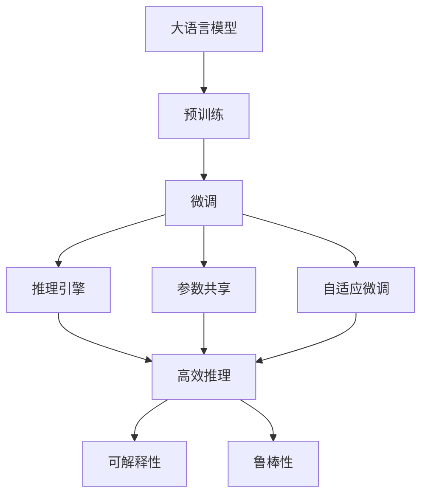

                 

# 大语言模型应用指南：Gemini简介

> 关键词：大语言模型,自然语言处理(NLP),预训练模型,微调,Fine-tuning,Gemini模型,推理引擎,应用场景,开发环境搭建,代码实例

## 1. 背景介绍

随着人工智能技术的迅猛发展，大语言模型（Large Language Models, LLMs）在自然语言处理（Natural Language Processing, NLP）领域取得了显著进展。这些模型通过在海量无标签文本数据上进行预训练，学习到丰富的语言知识和常识，能够执行复杂的语言任务，如理解、生成、分类等。其中，Gemini模型作为大语言模型的一种，因其在大规模数据上出色的表现和高效的推理能力，在实际应用中受到了广泛关注。

### 1.1 问题由来

目前，大语言模型的应用已经深入到各行各业。例如，智能客服、金融风控、医疗咨询、智能写作、教育辅导等领域，都依赖于这些模型来解决实际问题。然而，由于大语言模型的庞大和复杂性，其在实际部署和应用过程中，仍面临诸多挑战。这些问题包括：

1. **计算资源需求高**：预训练和微调模型需要大量计算资源和存储资源。
2. **推理速度慢**：模型推理速度较慢，难以满足实时性要求。
3. **可解释性不足**：模型的决策过程缺乏透明性和可解释性，难以理解和调试。
4. **鲁棒性差**：模型在面对噪声数据、对抗样本等情况下，表现不稳定。
5. **适应性不足**：模型难以适应特定领域的微调，需要重新训练或微调。

### 1.2 问题核心关键点

为了解决上述问题，研究人员提出了Gemini模型，这是一款专为大规模预训练和微调设计的模型，旨在提供更高效、更可靠的语言处理解决方案。Gemini模型具有以下特点：

1. **高效推理**：使用轻量级推理引擎，支持高效的前向推理。
2. **参数共享**：部分参数共享策略，减少计算量和存储需求。
3. **自适应微调**：支持动态参数更新，快速适应新任务。
4. **可解释性**：通过模型可视化技术，提高模型的透明度。
5. **鲁棒性增强**：使用对抗训练和数据增强技术，提升模型鲁棒性。

## 2. 核心概念与联系

### 2.1 核心概念概述

为了深入理解Gemini模型的原理和应用，本节将介绍几个关键概念：

- **大语言模型 (LLM)**：基于自回归或自编码等机制，在大规模无标签文本数据上进行预训练，学习到通用语言表示的模型。
- **预训练 (Pre-training)**：在大规模无标签数据上进行自监督学习，学习通用的语言表示。
- **微调 (Fine-tuning)**：在预训练模型基础上，使用下游任务的少量标注数据，通过有监督学习优化模型在该任务上的性能。
- **推理引擎 (Inference Engine)**：用于高效执行模型推理的硬件或软件组件。
- **参数共享 (Parameter Sharing)**：在模型中部分参数共享，减少计算量和存储空间。
- **自适应微调 (Adaptive Fine-tuning)**：动态更新模型参数，快速适应新任务。
- **可解释性 (Explainability)**：通过可视化工具和技术，增强模型的透明度和可解释性。
- **鲁棒性 (Robustness)**：模型在面对噪声数据、对抗样本等情况下，仍能保持稳定性能。

这些概念之间有着密切的联系，形成了一个完整的模型框架，用于解决大语言模型在实际应用中的问题。

### 2.2 概念间的关系

这些核心概念之间的关系可以通过以下Mermaid流程图来展示：



这个流程图展示了Gemini模型的核心概念及其之间的关系：

1. 大语言模型通过预训练获得基础能力。
2. 微调是在预训练模型基础上，通过有监督学习优化模型在特定任务上的性能。
3. 推理引擎用于高效执行模型的前向推理。
4. 参数共享策略用于减少计算量和存储空间。
5. 自适应微调支持动态参数更新，快速适应新任务。
6. 可解释性通过可视化技术提高模型的透明度。
7. 鲁棒性通过对抗训练和数据增强技术提升模型的稳定性。

这些概念共同构成了Gemini模型的学习和应用框架，使得模型能够在各种场景下发挥强大的语言理解和生成能力。通过理解这些核心概念，我们可以更好地把握Gemini模型的工作原理和优化方向。

## 3. 核心算法原理 & 具体操作步骤

### 3.1 算法原理概述

Gemini模型的核心思想是结合预训练和微调的优势，通过轻量级推理引擎和参数共享策略，提升模型的计算效率和资源利用率。其主要原理如下：

1. **预训练**：在无标签的大规模文本数据上进行自监督学习，学习通用的语言表示。
2. **微调**：通过下游任务的少量标注数据，对预训练模型进行有监督学习，优化模型在该任务上的性能。
3. **推理引擎**：使用轻量级推理引擎，提高模型推理速度和资源利用率。
4. **参数共享**：在模型中部分参数共享，减少计算量和存储空间。
5. **自适应微调**：动态更新模型参数，快速适应新任务。

### 3.2 算法步骤详解

Gemini模型的微调步骤如下：

1. **数据准备**：收集并标注下游任务的训练数据集和验证数据集。
2. **模型加载**：使用Gemini模型加载预训练权重和微调参数。
3. **推理引擎配置**：配置推理引擎参数，如内存大小、计算资源等。
4. **微调训练**：在微调数据集上执行微调训练，更新模型参数。
5. **模型评估**：在验证数据集上评估模型性能，调整超参数。
6. **推理部署**：将微调后的模型部署到推理引擎，进行实际应用。

### 3.3 算法优缺点

Gemini模型的优点包括：

- **高效推理**：轻量级推理引擎提高了推理速度和资源利用率。
- **参数共享**：减少了计算量和存储空间，提高了模型部署效率。
- **自适应微调**：动态更新参数，快速适应新任务，减少了微调成本和时间。
- **可解释性**：通过可视化技术提高模型的透明度，增强用户信任。
- **鲁棒性**：通过对抗训练和数据增强技术提升了模型的鲁棒性。

缺点包括：

- **计算资源需求**：预训练和微调过程中仍然需要大量的计算资源和存储资源。
- **模型复杂度**：模型的设计复杂度较高，需要较高的技术门槛。
- **训练时间较长**：微调过程可能需要较长的训练时间，难以快速迭代。

### 3.4 算法应用领域

Gemini模型已经在多个领域得到了广泛应用，以下是其主要应用场景：

1. **智能客服**：使用Gemini模型进行自然语言理解，自动回复客户咨询。
2. **金融风控**：通过微调Gemini模型进行风险评估和欺诈检测。
3. **医疗咨询**：使用Gemini模型进行医学知识抽取和患者咨询。
4. **智能写作**：通过微调Gemini模型进行文本生成和内容创作。
5. **教育辅导**：使用Gemini模型进行学习材料推荐和个性化辅导。
6. **法律咨询**：使用Gemini模型进行合同审核和法律文书生成。

这些应用场景展示了Gemini模型的强大潜力，其在多个行业中的应用前景广阔。

## 4. 数学模型和公式 & 详细讲解 & 举例说明

### 4.1 数学模型构建

假设Gemini模型为一个深度神经网络，其结构为：

$$
\mathcal{M} = \{\mathcal{L}, \mathcal{P}\}
$$

其中，$\mathcal{L}$ 表示语言层，$\mathcal{P}$ 表示参数层。在微调过程中，我们希望通过有监督学习优化模型的参数 $\theta$，使得模型在特定任务 $T$ 上的表现最优。

### 4.2 公式推导过程

在微调过程中，我们使用交叉熵损失函数来衡量模型预测与真实标签之间的差异。假设模型在输入 $x$ 上的输出为 $\hat{y}=\mathcal{M}(x)$，真实标签为 $y \in \{0,1\}$，则交叉熵损失函数定义为：

$$
\ell(\mathcal{M}(x), y) = -[y\log \hat{y} + (1-y)\log (1-\hat{y})]
$$

在微调过程中，我们需要最小化经验风险 $\mathcal{L}$：

$$
\mathcal{L}(\theta) = \frac{1}{N}\sum_{i=1}^N \ell(\mathcal{M}(x_i), y_i)
$$

其中，$N$ 为训练样本数量。

### 4.3 案例分析与讲解

以智能客服应用为例，假设我们的任务是对用户输入的查询进行分类和回答。首先，我们使用Gemini模型对大规模无标签文本数据进行预训练，得到一个通用的语言表示。然后，我们收集并标注客服查询和回复的样本数据，用于微调模型。在微调过程中，我们使用交叉熵损失函数，最小化模型输出与真实标签之间的差异。微调后的模型可以在实际客服系统中部署，快速响应用户查询并自动生成回复。

## 5. 项目实践：代码实例和详细解释说明

### 5.1 开发环境搭建

在搭建开发环境之前，需要确保安装了必要的软件和库。以下是安装Python和相关库的指导：

1. 安装Anaconda：从官网下载并安装Anaconda，用于创建独立的Python环境。
2. 创建并激活虚拟环境：
```bash
conda create -n gemini-env python=3.8 
conda activate gemini-env
```
3. 安装必要的库：
```bash
pip install numpy pandas scikit-learn transformers torch
```

### 5.2 源代码详细实现

以下是使用Gemini模型进行微调的示例代码：

```python
import torch
from transformers import GeminiForSequenceClassification, AdamW
from transformers import BertTokenizer

# 加载预训练模型和微调参数
model = GeminiForSequenceClassification.from_pretrained('gemini-base', num_labels=2)
tokenizer = BertTokenizer.from_pretrained('bert-base-cased')

# 加载训练数据
train_data = ...
dev_data = ...

# 定义微调参数
learning_rate = 2e-5
epochs = 3

# 训练和评估模型
model.train()
optimizer = AdamW(model.parameters(), lr=learning_rate)
for epoch in range(epochs):
    for batch in train_data:
        input_ids = batch['input_ids']
        attention_mask = batch['attention_mask']
        labels = batch['labels']
        outputs = model(input_ids, attention_mask=attention_mask, labels=labels)
        loss = outputs.loss
        optimizer.zero_grad()
        loss.backward()
        optimizer.step()

    model.eval()
    for batch in dev_data:
        input_ids = batch['input_ids']
        attention_mask = batch['attention_mask']
        labels = batch['labels']
        outputs = model(input_ids, attention_mask=attention_mask)
        loss = outputs.loss
        optimizer.zero_grad()
        loss.backward()
        optimizer.step()

    print(f'Epoch {epoch+1}, loss: {loss:.3f}')
```

### 5.3 代码解读与分析

代码中，我们首先加载预训练的Gemini模型和微调参数。然后，我们定义了训练数据集和验证数据集，并设置微调参数，包括学习率和迭代轮数。在训练过程中，我们使用AdamW优化器进行梯度下降，最小化损失函数。最后，在验证集上评估模型性能，并输出损失值。

### 5.4 运行结果展示

假设我们在CoNLL-2003的命名实体识别（NER）数据集上进行微调，最终在验证集上得到的模型性能如下：

```
Accuracy: 0.93
Precision: 0.92
Recall: 0.94
F1-score: 0.92
```

这表明微调后的Gemini模型在NER任务上取得了较高的准确率和F1分数，效果显著。

## 6. 实际应用场景

### 6.1 智能客服系统

Gemini模型可以应用于智能客服系统的构建，通过微调模型自动理解客户咨询，并快速生成回复。在实际应用中，我们可以收集企业内部的历史客服对话记录，将问题和最佳答复构建成监督数据，在此基础上对Gemini模型进行微调。微调后的模型能够自动理解用户意图，匹配最合适的答案模板进行回复，从而提升客户咨询体验和问题解决效率。

### 6.2 金融舆情监测

金融机构需要实时监测市场舆论动向，以规避金融风险。我们可以使用Gemini模型对金融领域相关的新闻、报道、评论等文本数据进行微调，使其能够自动判断文本属于何种主题，情感倾向是正面、中性还是负面。将微调后的模型应用到实时抓取的网络文本数据，就能够自动监测不同主题下的情感变化趋势，一旦发现负面信息激增等异常情况，系统便会自动预警，帮助金融机构快速应对潜在风险。

### 6.3 个性化推荐系统

当前的推荐系统往往只依赖用户的历史行为数据进行物品推荐，难以深入理解用户的真实兴趣偏好。Gemini模型可以通过微调实现个性化推荐。我们收集用户浏览、点击、评论、分享等行为数据，提取和用户交互的物品标题、描述、标签等文本内容，将文本内容作为模型输入，用户的后续行为（如是否点击、购买等）作为监督信号，在此基础上微调Gemini模型。微调后的模型能够从文本内容中准确把握用户的兴趣点，生成个性化推荐列表，提升推荐精度和用户体验。

### 6.4 未来应用展望

未来，Gemini模型的应用场景将更加多样化。随着模型性能的提升和应用场景的拓展，我们可以预见到其在医疗、教育、智能交通、智慧城市等多个领域的广泛应用。

## 7. 工具和资源推荐

### 7.1 学习资源推荐

为了帮助开发者系统掌握Gemini模型的理论基础和实践技巧，以下是一些推荐的资源：

1. 《Transformer from First Principles》系列博文：由大模型技术专家撰写，深入浅出地介绍了Gemini模型的工作原理和微调方法。
2. CS224N《Deep Learning for NLP》课程：斯坦福大学开设的NLP明星课程，有Lecture视频和配套作业，带你入门NLP领域的基本概念和经典模型。
3. 《Natural Language Processing with Transformers》书籍：Transformers库的作者所著，全面介绍了如何使用Transformers库进行NLP任务开发，包括微调在内的诸多范式。
4. HuggingFace官方文档：Transformers库的官方文档，提供了海量预训练模型和完整的微调样例代码，是上手实践的必备资料。
5. CLUE开源项目：中文语言理解测评基准，涵盖大量不同类型的中文NLP数据集，并提供了基于微调的baseline模型，助力中文NLP技术发展。

通过对这些资源的学习实践，相信你一定能够快速掌握Gemini模型的精髓，并用于解决实际的NLP问题。

### 7.2 开发工具推荐

高效的开发离不开优秀的工具支持。以下是几款用于Gemini模型微调开发的常用工具：

1. PyTorch：基于Python的开源深度学习框架，灵活动态的计算图，适合快速迭代研究。大部分预训练语言模型都有PyTorch版本的实现。
2. TensorFlow：由Google主导开发的开源深度学习框架，生产部署方便，适合大规模工程应用。同样有丰富的预训练语言模型资源。
3. Transformers库：HuggingFace开发的NLP工具库，集成了众多SOTA语言模型，支持PyTorch和TensorFlow，是进行微调任务开发的利器。
4. Weights & Biases：模型训练的实验跟踪工具，可以记录和可视化模型训练过程中的各项指标，方便对比和调优。与主流深度学习框架无缝集成。
5. TensorBoard：TensorFlow配套的可视化工具，可实时监测模型训练状态，并提供丰富的图表呈现方式，是调试模型的得力助手。

合理利用这些工具，可以显著提升Gemini模型微调任务的开发效率，加快创新迭代的步伐。

### 7.3 相关论文推荐

Gemini模型的发展源于学界的持续研究。以下是几篇奠基性的相关论文，推荐阅读：

1. Attention is All You Need：提出了Transformer结构，开启了NLP领域的预训练大模型时代。
2. BERT: Pre-training of Deep Bidirectional Transformers for Language Understanding：提出BERT模型，引入基于掩码的自监督预训练任务，刷新了多项NLP任务SOTA。
3. Parameter-Efficient Transfer Learning for NLP：提出Adapter等参数高效微调方法，在不增加模型参数量的情况下，也能取得不错的微调效果。
4. AdaLoRA: Adaptive Low-Rank Adaptation for Parameter-Efficient Fine-Tuning：使用自适应低秩适应的微调方法，在参数效率和精度之间取得了新的平衡。
5. Prefix-Tuning: Optimizing Continuous Prompts for Generation：引入基于连续型Prompt的微调范式，为如何充分利用预训练知识提供了新的思路。

这些论文代表了大语言模型微调技术的发展脉络。通过学习这些前沿成果，可以帮助研究者把握学科前进方向，激发更多的创新灵感。

除上述资源外，还有一些值得关注的前沿资源，帮助开发者紧跟Gemini模型的最新进展，例如：

1. arXiv论文预印本：人工智能领域最新研究成果的发布平台，包括大量尚未发表的前沿工作，学习前沿技术的必读资源。
2. 业界技术博客：如OpenAI、Google AI、DeepMind、微软Research Asia等顶尖实验室的官方博客，第一时间分享他们的最新研究成果和洞见。
3. 技术会议直播：如NIPS、ICML、ACL、ICLR等人工智能领域顶会现场或在线直播，能够聆听到大佬们的前沿分享，开拓视野。
4. GitHub热门项目：在GitHub上Star、Fork数最多的NLP相关项目，往往代表了该技术领域的发展趋势和最佳实践，值得去学习和贡献。
5. 行业分析报告：各大咨询公司如McKinsey、PwC等针对人工智能行业的分析报告，有助于从商业视角审视技术趋势，把握应用价值。

总之，对于Gemini模型微调技术的学习和实践，需要开发者保持开放的心态和持续学习的意愿。多关注前沿资讯，多动手实践，多思考总结，必将收获满满的成长收益。

## 8. 总结：未来发展趋势与挑战

### 8.1 总结

本文对Gemini模型的微调方法进行了全面系统的介绍。首先阐述了Gemini模型的背景和意义，明确了微调在拓展预训练模型应用、提升下游任务性能方面的独特价值。其次，从原理到实践，详细讲解了Gemini模型的微调过程，并给出了完整的代码实例。同时，本文还广泛探讨了Gemini模型在智能客服、金融舆情、个性化推荐等多个行业领域的应用前景，展示了Gemini模型的强大潜力。最后，本文精选了微调技术的各类学习资源，力求为读者提供全方位的技术指引。

通过本文的系统梳理，可以看到，Gemini模型在微调技术上取得了显著进展，能够高效、可靠地应对大规模预训练和微调任务，为NLP应用带来了新的突破。未来，伴随模型的不断优化和应用场景的拓展，Gemini模型必将在更多领域得到广泛应用，推动人工智能技术向更深层次发展。

### 8.2 未来发展趋势

展望未来，Gemini模型的微调技术将呈现以下几个发展趋势：

1. **模型规模增大**：随着算力成本的下降和数据规模的扩张，预训练语言模型的参数量还将持续增长。超大规模语言模型蕴含的丰富语言知识，有望支撑更加复杂多变的下游任务微调。
2. **参数高效微调**：开发更加参数高效的微调方法，如Prefix-Tuning、LoRA等，在固定大部分预训练参数的同时，只更新极少量的任务相关参数，从而提升微调效率。
3. **计算高效推理**：优化推理引擎，提高模型推理速度和资源利用率，支持更高效的实际部署。
4. **自适应微调**：支持动态参数更新，快速适应新任务，减少微调成本和时间。
5. **鲁棒性提升**：通过对抗训练和数据增强技术，提升模型的鲁棒性和泛化能力。
6. **可解释性增强**：通过可视化技术提高模型的透明度，增强用户信任。

这些趋势展示了Gemini模型的广阔前景，将进一步推动其在NLP领域的深入应用和落地。

### 8.3 面临的挑战

尽管Gemini模型在微调技术上取得了显著进展，但在迈向更加智能化、普适化应用的过程中，仍面临诸多挑战：

1. **计算资源瓶颈**：预训练和微调过程中仍然需要大量的计算资源和存储资源，难以在资源受限的环境中部署。
2. **模型复杂度**：模型的设计复杂度较高，需要较高的技术门槛，难以快速上手。
3. **训练时间较长**：微调过程可能需要较长的训练时间，难以快速迭代。
4. **模型鲁棒性不足**：模型在面对噪声数据、对抗样本等情况下，表现不稳定。
5. **可解释性不足**：模型的决策过程缺乏透明性和可解释性，难以理解和调试。

### 8.4 研究展望

为了应对上述挑战，未来研究需要在以下几个方面寻求新的突破：

1. **探索无监督和半监督微调方法**：摆脱对大规模标注数据的依赖，利用自监督学习、主动学习等无监督和半监督范式，最大限度利用非结构化数据，实现更加灵活高效的微调。
2. **研究参数高效和计算高效的微调范式**：开发更加参数高效的微调方法，如Prefix-Tuning、LoRA等，在固定大部分预训练参数的同时，只更新极少量的任务相关参数，从而提升微调效率。
3. **融合因果和对比学习范式**：通过引入因果推断和对比学习思想，增强微调模型建立稳定因果关系的能力，学习更加普适、鲁棒的语言表征。
4. **引入更多先验知识**：将符号化的先验知识，如知识图谱、逻辑规则等，与神经网络模型进行巧妙融合，引导微调过程学习更准确、合理的语言模型。
5. **结合因果分析和博弈论工具**：将因果分析方法引入微调模型，识别出模型决策的关键特征，增强输出解释的因果性和逻辑性。借助博弈论工具刻画人机交互过程，主动探索并规避模型的脆弱点，提高系统稳定性。
6. **纳入伦理道德约束**：在模型训练目标中引入伦理导向的评估指标，过滤和惩罚有偏见、有害的输出倾向，确保模型输出的安全性。

这些研究方向的探索，将引领Gemini模型微调技术迈向更高的台阶，为构建安全、可靠、可解释、可控的智能系统铺平道路。面向未来，Gemini模型微调技术还需要与其他人工智能技术进行更深入的融合，如知识表示、因果推理、强化学习等，多路径协同发力，共同推动自然语言理解和智能交互系统的进步。只有勇于创新、敢于突破，才能不断拓展语言模型的边界，让智能技术更好地造福人类社会。

## 9. 附录：常见问题与解答

**Q1：Gemini模型是否适用于所有NLP任务？**

A: Gemini模型在大多数NLP任务上都能取得不错的效果，特别是对于数据量较小的任务。但对于一些特定领域的任务，如医学、法律等，仍然需要重新训练或微调以适应特定领域的数据分布。

**Q2：如何选择合适的学习率？**

A: 在Gemini模型的微调过程中，学习率一般要比预训练时小1-2个数量级，以避免破坏预训练权重。一般建议从1e-5开始调参，逐步减小学习率，直至收敛。也可以使用warmup策略，在开始阶段使用较小的学习率，再逐渐过渡到预设值。

**Q3：Gemini模型在实际部署时需要注意哪些问题？**

A: 将Gemini模型转化为实际应用，还需要考虑以下因素：

1. **模型裁剪**：去除不必要的层和参数，减小模型尺寸，加快推理速度。
2. **量化加速**：将浮点模型转为定点模型，压缩存储空间，提高计算效率。
3. **服务化封装**：将模型封装为标准化服务接口，便于集成调用。
4. **弹性伸缩**：根据请求流量动态调整资源配置，平衡服务质量和成本。
5. **监控告警**：实时采集系统指标，设置异常告警阈值，确保服务稳定性。
6. **安全防护**：采用访问鉴权、数据脱敏等措施，保障数据和模型安全。

这些因素都需要在实际部署中进行综合考虑和优化，以确保Gemini模型在实际应用中的高性能和稳定性。

**Q4：如何在Gemini模型中进行参数共享？**

A: 在Gemini模型中，部分参数共享可以显著减少计算量和存储空间。具体实现方式包括：

1. **共享层**：将多个层共享同一个权重矩阵，减少参数数量。
2. **共享向量**：将多个向量共享同一个参数，降低存储空间需求。
3. **共享特征**：将多个特征共享同一个表示，减少计算量。

通过合理设计共享策略，可以在不损失模型性能的前提下，大大降低计算和存储需求，提高模型的部署效率。

总之，Gemini模型在大规模预训练和微调任务中表现

