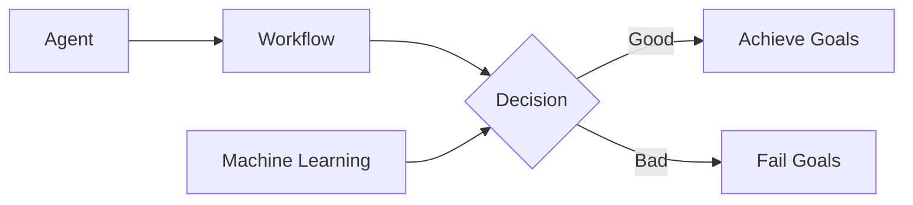

# AI人工智能代理工作流AI Agent WorkFlow：利用机器学习提升代理决策质量

关键词：人工智能、机器学习、代理工作流、决策优化、自动化流程

## 1. 背景介绍
### 1.1 问题的由来
在当今快速发展的商业环境中,企业面临着日益激烈的竞争压力。为了在市场中保持领先地位,企业需要不断优化业务流程,提高运营效率。人工智能(AI)技术的兴起为解决这一问题提供了新的思路。通过将AI技术应用于代理工作流,可以显著提升代理的决策质量,从而推动企业实现业务自动化和智能化。

### 1.2 研究现状
目前,国内外学术界和工业界已经开始探索将AI技术应用于代理工作流的研究。一些学者提出了基于机器学习的代理决策优化框架,通过对历史数据进行训练,构建智能决策模型,辅助代理进行决策[1]。此外,一些企业也开始尝试将AI技术应用于客户服务、销售等业务场景,通过智能代理提升业务效率和客户满意度[2]。

### 1.3 研究意义
将AI技术引入代理工作流,对于提升企业竞争力具有重要意义:
1. 提高决策效率:智能代理可以快速处理海量业务数据,及时做出决策,大幅提升决策效率。
2. 优化资源配置:通过对业务数据的分析,智能代理可以合理调配人力、物力等资源,实现精细化管理。
3. 改善客户体验:智能代理可以7x24小时为客户提供个性化、高质量的服务,提升客户满意度和忠诚度。
4. 降低运营成本:用AI技术替代人工,可以显著降低人力成本,提高投资回报率。

### 1.4 本文结构
本文将重点探讨如何利用机器学习技术优化代理工作流中的决策流程。第2部分介绍了相关的核心概念;第3部分重点阐述了决策优化的核心算法原理;第4部分给出了算法中涉及的数学模型和公式;第5部分通过一个案例介绍了算法的代码实现;第6部分分析了该方法的实际应用场景;第7部分推荐了一些有用的工具和资源;第8部分对全文进行了总结,并对未来的发展趋势和挑战进行了展望;第9部分列出了一些常见问题及解答。

## 2. 核心概念与联系
在探讨如何利用机器学习优化代理工作流之前,首先需要明确几个核心概念:
- 代理(Agent):能够感知环境并做出自主行为的实体,本文主要指企业中承担特定业务职能的工作人员。
- 工作流(Workflow):由一系列任务活动组成的业务流程,代理通过执行工作流来完成特定业务。
- 决策(Decision):代理在执行工作流的过程中需要做出的选择和判断,决策的质量直接影响业务目标的达成。
- 机器学习(Machine Learning):一种通过数据训练智能模型的技术,可用于优化决策流程。

下图展示了代理工作流中各核心概念之间的关系:



从图中可以看出,代理通过执行工作流来完成业务,其中做出的一系列决策决定了最终能否达成业务目标。引入机器学习技术,通过数据驱动的方式优化关键决策点,可以显著提升决策质量,进而推动整个工作流高效完成。

## 3. 核心算法原理 & 具体操作步骤
### 3.1 算法原理概述
本文采用的核心算法是基于强化学习的马尔科夫决策过程(Markov Decision Process,MDP)[3]。其基本思想是:将代理工作流抽象为一个MDP,通过学习最优决策策略,使得代理的长期累积回报最大化。MDP由四个要素组成:
- 状态(State):代理所处的环境状态,可用特征向量表示。
- 行动(Action):代理在某状态下可以采取的动作。
- 转移概率(Transition Probability):在某状态下采取某动作后,环境转移到下一状态的概率。
- 回报(Reward):代理采取某动作后,环境给予的即时反馈。

MDP的目标是学习一个最优策略函数$\pi^*$,使得从任意初始状态出发,代理采取该策略做决策,其长期累积回报最大化:

$$\pi^* = \arg\max_{\pi} \mathbb{E}\left[\sum_{t=0}^{\infty} \gamma^t r_t | \pi \right]$$

其中,$\gamma \in [0,1]$为折扣因子,$r_t$为t时刻获得的即时回报。

### 3.2 算法步骤详解
基于MDP的代理决策优化算法主要分为以下几个步骤:
1. 定义状态和行动空间:根据业务场景,选取合适的特征定义状态向量,并明确代理在每个状态下可以采取的行动集合。
2. 采集数据:收集代理执行工作流的历史数据,包括每个决策时的状态、采取的行动以及获得的即时回报等。
3. 构建MDP模型:利用采集到的数据,通过最大似然估计等统计学习方法,估计MDP中的转移概率和回报函数。
4. 求解最优策略:使用值迭代、策略迭代等动态规划算法,求解MDP的最优策略$\pi^*$。
5. 应用最优策略:将学习到的最优策略应用于实际的代理工作流中,用于指导代理做出最优决策。

### 3.3 算法优缺点
MDP算法的主要优点包括:
- 数学理论完备,有严格的收敛性证明。
- 可解释性强,学习到的策略具有明确的物理意义。
- 通用性好,可应用于多种类型的序贯决策问题。

但同时该算法也存在一些局限性:
- 状态和行动空间过大时,计算复杂度高。
- 离线学习,难以适应动态变化的环境。
- 需要大量高质量的训练数据。

### 3.4 算法应用领域
MDP算法在许多领域得到了成功应用,例如:
- 客服中心:通过对客服工作流建模,优化客服代表在面对不同客户时的决策,提升服务质量。
- 供应链管理:通过对订单履行流程建模,优化库存分配、物流配送等决策,降低运营成本。
- 金融投资:通过对投资组合管理流程建模,优化资产配置、风险控制等决策,提高投资收益。

## 4. 数学模型和公式 & 详细讲解 & 举例说明
### 4.1 数学模型构建
为了使用MDP算法优化代理工作流,首先需要将问题表示为MDP的数学形式。假设代理工作流有N个状态,每个状态下有M个可选行动。我们可以定义:

- 状态空间 $\mathcal{S} = \{s_1, s_2, \dots, s_N\}$
- 行动空间 $\mathcal{A} = \{a_1, a_2, \dots, a_M\}$
- 转移概率 $\mathcal{P}_{ss'}^a = P(s'|s,a)$,表示在状态s下采取行动a后转移到状态s'的概率
- 回报函数 $\mathcal{R}_s^a = \mathbb{E}[r|s,a]$,表示在状态s下采取行动a的期望即时回报

策略$\pi$定义为在每个状态下采取何种行动的条件概率分布,即:

$$\pi(a|s) = P(A_t=a|S_t=s)$$

我们的目标是寻找最优策略$\pi^*$,使得长期累积回报最大化:

$$\pi^* = \arg\max_{\pi} V^{\pi}(s), \forall s \in \mathcal{S}$$

其中,值函数$V^{\pi}(s)$表示从状态s开始,遵循策略$\pi$可获得的累积回报:

$$V^{\pi}(s) = \mathbb{E}^\pi\left[\sum_{t=0}^{\infty} \gamma^t r_t | S_0=s \right]$$

### 4.2 公式推导过程
为了求解最优策略,需要引入Q函数的概念。Q函数定义为在状态s下采取行动a,之后遵循策略$\pi$可获得的累积回报:

$$Q^\pi(s,a) = \mathbb{E}^\pi\left[\sum_{t=0}^{\infty} \gamma^t r_t | S_0=s, A_0=a \right]$$

Q函数与值函数满足如下关系:

$$V^\pi(s) = \sum_{a \in \mathcal{A}} \pi(a|s) Q^\pi(s,a)$$

$$Q^\pi(s,a) = \mathcal{R}_s^a + \gamma \sum_{s' \in \mathcal{S}} \mathcal{P}_{ss'}^a V^\pi(s')$$

根据Bellman最优性原理,最优值函数$V^*$满足:

$$V^*(s) = \max_{a \in \mathcal{A}} Q^*(s,a)$$

$$Q^*(s,a) = \mathcal{R}_s^a + \gamma \sum_{s' \in \mathcal{S}} \mathcal{P}_{ss'}^a V^*(s')$$

因此,最优策略$\pi^*$可表示为:

$$\pi^*(a|s) = \begin{cases}
1 & \text{if } a = \arg\max_{a' \in \mathcal{A}} Q^*(s,a') \
0 & \text{otherwise}
\end{cases}$$

### 4.3 案例分析与讲解
下面我们通过一个简单的客服工作流案例来说明MDP算法的应用。

假设某客服中心收到用户投诉后,客服代表需要经过以下几个状态:
- s1:了解用户诉求
- s2:记录问题详情
- s3:向用户解释公司政策
- s4:提供解决方案
- s5:确认问题解决
- s6:结束服务

在每个状态下,客服代表可以选择以下行动:
- a1:仔细倾听
- a2:简单记录
- a3:详细记录
- a4:照本宣科
- a5:灵活解释
- a6:提供退款
- a7:提供折扣
- a8:继续跟进
- a9:结束服务

我们可以采集大量历史数据,估计出转移概率矩阵P和回报函数R,然后使用值迭代算法求解最优策略:

$$
\begin{aligned}
V_{k+1}(s) & = \max_{a \in \mathcal{A}} \left\{ \mathcal{R}_s^a + \gamma \sum_{s' \in \mathcal{S}} \mathcal{P}_{ss'}^a V_k(s') \right\} \
& = \max_{a \in \mathcal{A}} Q_{k+1}(s,a)
\end{aligned}
$$

迭代直至值函数收敛,即可得到最优策略。应用该策略指导客服代表做出最优决策,可以显著提升客户满意度和问题解决效率。

### 4.4 常见问题解答
1. 什么是马尔科夫性?
马尔科夫性是指下一状态只取决于当前状态和当前采取的行动,与之前的历史状态无关。MDP正是建立在马尔科夫性假设之上的。
2. 值迭代算法的时间复杂度是多少?
值迭代算法的时间复杂度为$O(|\mathcal{S}|^2|\mathcal{A}|)$,其中$|\mathcal{S}|$和$|\mathcal{A}|$分别表示状态数和行动数。
3. 如何设置折扣因子$\gamma$的取值?
$\gamma$取值一般在0.9-0.99之间。$\gamma$越大,则算法越重视长期回报;$\gamma$越小,则算法越重视短期回报。需要根据具体问题设置合适的$\gamma$值。

## 5. 项目实践：代码实例和详细解释说明
### 5.1 开发环境搭建
本项目使用Python 3.7进行开发,需要安装以下依赖库:
- NumPy:数值计算库
- Pandas:数据处理库
- Matplotlib:数据可视化库

可以使用pip命令进行安装:

```bash
pip install numpy pandas matplotlib
```

### 5.2 源代码