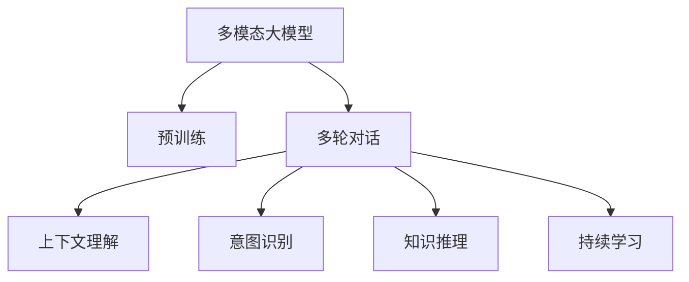
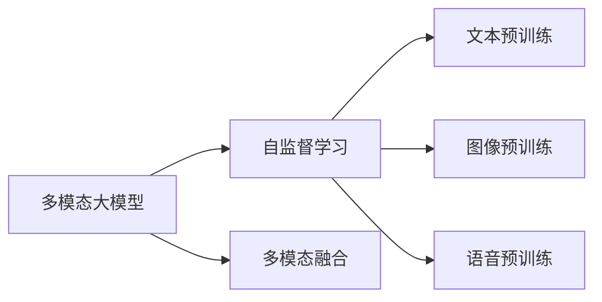
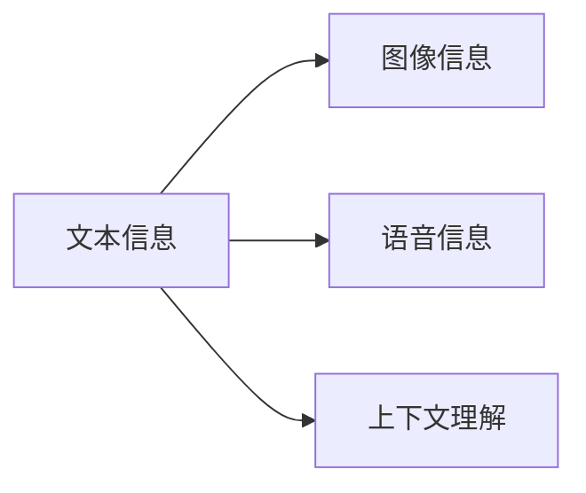
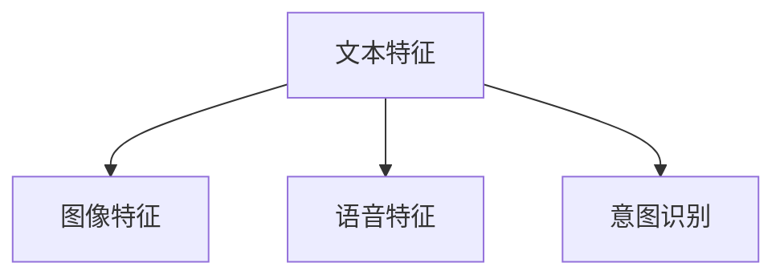
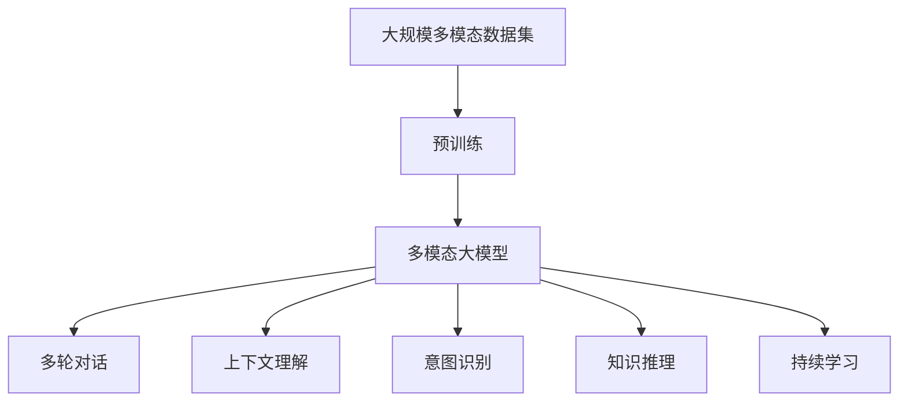

                 

# 多模态大模型：技术原理与实战 如何提高多轮对话能力

> 关键词：多模态大模型, 多轮对话, 技术原理, 实战, 提高多轮对话能力

## 1. 背景介绍

随着人工智能技术的不断发展，自然语言处理(NLP)领域的多模态大模型（Multi-modal Large Models, MLMs）逐渐成为热点。多模态大模型通过整合文本、图像、语音等多种数据源，实现了跨模态信息的深度融合，为构建智能对话系统提供了新的可能。在实际应用中，如何提升多轮对话能力成为关键问题。

多轮对话能力是指对话系统在用户提出多轮问题后，能够准确理解和回答的能力。这对智能客服、智能助手、虚拟代理等应用场景至关重要。本文将详细介绍多模态大模型的技术原理，并通过实战案例，探讨如何提高多轮对话能力。

## 2. 核心概念与联系

### 2.1 核心概念概述

为更好地理解多模态大模型在提高多轮对话能力中的应用，本节将介绍几个关键概念：

- **多模态大模型(Multimodal Large Models, MLMs)**：融合文本、图像、语音等多种模态数据的深度学习模型。通过在大规模多模态数据集上进行预训练，学习到多模态知识，具备跨模态理解与生成能力。

- **多轮对话**：用户与系统进行多轮交互，系统在每轮对话中需准确理解用户意图，生成合适的回复，并引导对话进程。多轮对话要求系统具备上下文理解、意图识别、知识推理等多种能力。

- **上下文理解**：模型需理解并保留对话中的上下文信息，避免重复回答和信息遗漏。这要求模型具备一定的记忆能力和信息抽取能力。

- **意图识别**：模型需准确识别用户意图，理解用户的需求和意图变化，从而提供相关回复。

- **知识推理**：模型需具备推理能力，结合已知知识和上下文信息，生成合理有效的回复。

- **持续学习**：对话系统需要不断从新数据中学习，提升对话质量。

这些核心概念之间的逻辑关系可以通过以下Mermaid流程图来展示：



这个流程图展示了多模态大模型的核心概念及其之间的关系：

1. 多模态大模型通过预训练获得多模态知识。
2. 多轮对话是利用多模态大模型进行的应用场景。
3. 上下文理解、意图识别和知识推理是多轮对话的关键能力。
4. 持续学习使模型能够不断提升对话质量。

### 2.2 概念间的关系

这些核心概念之间存在着紧密的联系，形成了多模态大模型在多轮对话应用中的完整生态系统。下面我们通过几个Mermaid流程图来展示这些概念之间的关系。

#### 2.2.1 多模态大模型的学习范式



这个流程图展示了多模态大模型的学习范式：

1. 多模态大模型通过自监督学习方法在大规模多模态数据集上进行预训练。
2. 预训练过程包括文本、图像和语音等多个模态的预训练任务。
3. 多模态融合使模型能够同时处理多种数据源，具备跨模态的理解与生成能力。

#### 2.2.2 上下文理解的多模态信息融合



这个流程图展示了上下文理解中多模态信息融合的过程：

1. 文本信息包括用户输入的自然语言文本。
2. 图像信息包括对话中的图片、表情等视觉信息。
3. 语音信息包括用户的语音输入。
4. 上下文理解通过融合多模态信息，理解对话的全局语境。

#### 2.2.3 意图识别的多模态特征表示



这个流程图展示了意图识别的多模态特征表示过程：

1. 文本特征通过自然语言处理技术提取。
2. 图像特征通过视觉处理技术提取。
3. 语音特征通过语音识别技术提取。
4. 意图识别通过融合多模态特征，识别用户意图。

### 2.3 核心概念的整体架构

最后，我们用一个综合的流程图来展示这些核心概念在大模型微调过程中的整体架构：



这个综合流程图展示了从预训练到大模型微调，再到持续学习的完整过程。多模态大模型首先在大规模多模态数据集上进行预训练，然后通过多轮对话应用，在上下文理解、意图识别和知识推理等关键能力的驱动下，不断从新数据中学习，提升对话质量。 通过这些流程图，我们可以更清晰地理解多模态大模型在多轮对话中的应用框架，为后续深入讨论具体的微调方法和技术奠定基础。

## 3. 核心算法原理 & 具体操作步骤
### 3.1 算法原理概述

多模态大模型在提高多轮对话能力方面的核心算法原理主要基于跨模态融合、上下文理解和意图识别三个关键环节。以下是每个环节的详细描述：

- **跨模态融合**：将文本、图像、语音等多种模态的信息融合到统一表示空间，构建出具有跨模态理解能力的多模态特征向量。常用的跨模态融合方法包括特征拼接、注意力机制、跨模态编码等。

- **上下文理解**：模型需理解并保留对话中的上下文信息，避免重复回答和信息遗漏。这要求模型具备一定的记忆能力和信息抽取能力。常用的上下文理解方法包括循环神经网络(RNN)、Transformer等。

- **意图识别**：模型需准确识别用户意图，理解用户的需求和意图变化，从而提供相关回复。意图识别通常通过分类器或序列模型实现，如CNN、RNN、LSTM、Transformer等。

### 3.2 算法步骤详解

基于多模态大模型在提高多轮对话能力方面的核心算法原理，以下详细讲解具体的微调步骤：

**Step 1: 准备预训练模型和数据集**

1. 选择合适的预训练语言模型作为初始化参数，如BERT、GPT等。

2. 准备多轮对话数据集，包括对话历史、用户问题和模型回复。

**Step 2: 设计任务适配层**

1. 根据任务类型，在预训练模型顶层设计合适的输出层和损失函数。

2. 对于分类任务，通常在顶层添加线性分类器和交叉熵损失函数。

3. 对于生成任务，通常使用语言模型的解码器输出概率分布，并以负对数似然为损失函数。

**Step 3: 设置微调超参数**

1. 选择合适的优化算法及其参数，如AdamW、SGD等，设置学习率、批大小、迭代轮数等。

2. 设置正则化技术及强度，包括权重衰减、Dropout、Early Stopping等。

3. 确定冻结预训练参数的策略，如仅微调顶层，或全部参数都参与微调。

**Step 4: 执行梯度训练**

1. 将训练集数据分批次输入模型，前向传播计算损失函数。

2. 反向传播计算参数梯度，根据设定的优化算法和学习率更新模型参数。

3. 周期性在验证集上评估模型性能，根据性能指标决定是否触发 Early Stopping。

4. 重复上述步骤直到满足预设的迭代轮数或 Early Stopping 条件。

**Step 5: 测试和部署**

1. 在测试集上评估微调后模型的效果，对比微调前后的精度提升。

2. 使用微调后的模型对新样本进行推理预测，集成到实际的应用系统中。

3. 持续收集新的数据，定期重新微调模型，以适应数据分布的变化。

### 3.3 算法优缺点

多模态大模型在提高多轮对话能力方面具有以下优点：

1. 融合多种模态信息，使模型具备更强的上下文理解和知识推理能力。

2. 适用于多轮对话场景，能够处理复杂的用户需求和意图变化。

3. 通过微调能够快速适应特定任务，提升多轮对话的准确性和流畅性。

同时，该方法也存在一些局限性：

1. 对数据量的要求较高，需要大规模多模态数据进行预训练和微调。

2. 模型训练和推理的计算资源消耗较大，需要高性能计算设备支持。

3. 多模态信息的融合可能引入额外的噪声和干扰，影响模型的性能。

4. 模型的可解释性和鲁棒性仍需进一步提升。

尽管存在这些局限性，但就目前而言，多模态大模型仍然是提升多轮对话能力的最有效方法之一。未来相关研究的重点在于如何进一步降低计算资源消耗，提高模型的可解释性和鲁棒性。

### 3.4 算法应用领域

多模态大模型在多轮对话中的应用已经得到了广泛的应用，包括但不限于：

- **智能客服**：构建智能客服系统，通过多轮对话理解用户问题，生成合适回答。

- **智能助手**：开发智能助手应用，通过多轮对话提供个性化服务，如信息查询、行程规划等。

- **虚拟代理**：创建虚拟代理，在多轮对话中提供娱乐、教育、健康咨询等服务。

- **语音识别与生成**：结合语音信号和文本信息，实现更准确的语音识别和自然语音生成。

- **图像对话**：将图像和文本结合，进行视觉问答、图像生成等任务。

除了上述这些经典应用外，多模态大模型还被创新性地应用于更多场景中，如虚拟导游、虚拟会议、智能家居等，为人们的生活和工作带来了新的便利和体验。

## 4. 数学模型和公式 & 详细讲解 & 举例说明

### 4.1 数学模型构建

在多模态大模型中，我们通常采用Transformer架构进行微调。以下是一个基于Transformer的多模态大模型的数学模型构建过程：

假设输入为一个多模态数据序列 $(x_t)$，包含文本、图像和语音等多种模态的信息。模型通过多层跨模态融合和Transformer层进行处理，得到最终的输出 $(h_t)$。具体而言，模型的输入和输出形式如下：

$$
x_t = (x_{t, text}, x_{t, image}, x_{t, audio})
$$

$$
h_t = f_{MLM}(x_t; \theta)
$$

其中，$f_{MLM}$ 表示多模态大模型的前向传播函数，$\theta$ 为模型参数。多模态大模型的计算过程可以分为两个阶段：跨模态融合和Transformer层计算。

### 4.2 公式推导过程

以Transformer层为例，其计算过程可以概括为自注意力机制、前馈神经网络（FeedForward Network）和残差连接（Residual Connection）等几个步骤。以下是一个基于Transformer的模型的计算过程推导：

设输入 $x_t$ 经过编码器（Encoder）和解码器（Decoder）处理后，得到输出 $h_t$。假设多模态大模型的Transformer层数为 $L$，则模型的计算过程可以表示为：

$$
h_t = f_{Transformer}(x_t; \theta)
$$

$$
h_{t+1} = f_{LayerNorm}(f_{FFN}(f_{Self-Attention}(h_t, h_t); \theta_1) + h_t)
$$

其中，$Self-Attention$ 表示自注意力机制，$FFN$ 表示前馈神经网络，$LayerNorm$ 表示归一化层。以Self-Attention为例，其计算过程如下：

$$
Q = h_t \cdot W_Q
$$

$$
K = h_t \cdot W_K
$$

$$
V = h_t \cdot W_V
$$

$$
\alpha = \frac{\exp(\frac{QK^T}{\sqrt{d_k}})}{\sum_{i=1}^d \exp(\frac{QK^T}{\sqrt{d_k}})}
$$

$$
S = \alpha V
$$

$$
h_{t+1} = f_{LayerNorm}(S) + h_t
$$

其中，$d_k$ 表示注意力机制的隐藏维数，$W_Q$、$W_K$、$W_V$ 表示可学习参数矩阵。

### 4.3 案例分析与讲解

假设我们有一个多轮对话数据集，其中每个对话包括对话历史、用户问题和模型回复。我们可以将多轮对话数据集分成训练集和验证集，用于模型的微调。

首先，我们需要将对话数据集进行预处理，将对话历史、用户问题和模型回复分别表示为向量形式。对于文本信息，可以使用BertTokenizer进行分词和编码。对于图像信息，可以使用ImageNet预训练的特征向量进行表示。对于语音信息，可以使用语音识别技术将其转换为文本形式，再使用BertTokenizer进行编码。

接着，我们可以设计一个基于Transformer的多模态大模型，并使用PyTorch进行微调。具体而言，我们可以使用PyTorch的nn.Module类定义多模态大模型的结构和计算过程，使用nn.LSTM或nn.Transformer类实现上下文理解和跨模态融合。

最后，我们可以在训练集上训练模型，使用验证集进行模型评估和超参数调优。在微调完成后，我们可以在测试集上评估模型性能，使用BLEU、ROUGE等指标进行模型评估。

## 5. 项目实践：代码实例和详细解释说明

### 5.1 开发环境搭建

在进行多模态大模型微调实践前，我们需要准备好开发环境。以下是使用Python进行PyTorch开发的环境配置流程：

1. 安装Anaconda：从官网下载并安装Anaconda，用于创建独立的Python环境。

2. 创建并激活虚拟环境：
```bash
conda create -n pytorch-env python=3.8 
conda activate pytorch-env
```

3. 安装PyTorch：根据CUDA版本，从官网获取对应的安装命令。例如：
```bash
conda install pytorch torchvision torchaudio cudatoolkit=11.1 -c pytorch -c conda-forge
```

4. 安装Transformers库：
```bash
pip install transformers
```

5. 安装各类工具包：
```bash
pip install numpy pandas scikit-learn matplotlib tqdm jupyter notebook ipython
```

完成上述步骤后，即可在`pytorch-env`环境中开始微调实践。

### 5.2 源代码详细实现

下面我们以多轮对话任务为例，给出使用Transformers库对BERT模型进行微调的PyTorch代码实现。

首先，定义多轮对话任务的代码：

```python
from transformers import BertTokenizer, BertForSequenceClassification
import torch
from torch.utils.data import DataLoader
from tqdm import tqdm

class MultiTurnDialogueDataset(Dataset):
    def __init__(self, dialogues, labels, tokenizer, max_len=128):
        self.dialogues = dialogues
        self.labels = labels
        self.tokenizer = tokenizer
        self.max_len = max_len
        
    def __len__(self):
        return len(self.dialogues)
    
    def __getitem__(self, item):
        dialogue = self.dialogues[item]
        label = self.labels[item]
        
        tokens = []
        for turn in dialogue:
            tokens.append(turn)
            
        encoding = self.tokenizer(tokens, return_tensors='pt', max_length=self.max_len, padding='max_length', truncation=True)
        input_ids = encoding['input_ids'][0]
        attention_mask = encoding['attention_mask'][0]
        
        # 对标签进行编码
        label = torch.tensor(label, dtype=torch.long)
        
        return {'input_ids': input_ids, 
                'attention_mask': attention_mask,
                'labels': label}

# 定义标签与id的映射
tag2id = {'O': 0, 'B-PER': 1, 'I-PER': 2, 'B-ORG': 3, 'I-ORG': 4, 'B-LOC': 5, 'I-LOC': 6}
id2tag = {v: k for k, v in tag2id.items()}

# 创建dataset
tokenizer = BertTokenizer.from_pretrained('bert-base-cased')

train_dataset = MultiTurnDialogueDataset(train_dialogues, train_labels, tokenizer)
dev_dataset = MultiTurnDialogueDataset(dev_dialogues, dev_labels, tokenizer)
test_dataset = MultiTurnDialogueDataset(test_dialogues, test_labels, tokenizer)
```

然后，定义模型和优化器：

```python
from transformers import BertForTokenClassification, AdamW

model = BertForTokenClassification.from_pretrained('bert-base-cased', num_labels=len(tag2id))

optimizer = AdamW(model.parameters(), lr=2e-5)
```

接着，定义训练和评估函数：

```python
from torch.utils.data import DataLoader
from tqdm import tqdm
from sklearn.metrics import classification_report

device = torch.device('cuda') if torch.cuda.is_available() else torch.device('cpu')
model.to(device)

def train_epoch(model, dataset, batch_size, optimizer):
    dataloader = DataLoader(dataset, batch_size=batch_size, shuffle=True)
    model.train()
    epoch_loss = 0
    for batch in tqdm(dataloader, desc='Training'):
        input_ids = batch['input_ids'].to(device)
        attention_mask = batch['attention_mask'].to(device)
        labels = batch['labels'].to(device)
        model.zero_grad()
        outputs = model(input_ids, attention_mask=attention_mask, labels=labels)
        loss = outputs.loss
        epoch_loss += loss.item()
        loss.backward()
        optimizer.step()
    return epoch_loss / len(dataloader)

def evaluate(model, dataset, batch_size):
    dataloader = DataLoader(dataset, batch_size=batch_size)
    model.eval()
    preds, labels = [], []
    with torch.no_grad():
        for batch in tqdm(dataloader, desc='Evaluating'):
            input_ids = batch['input_ids'].to(device)
            attention_mask = batch['attention_mask'].to(device)
            batch_labels = batch['labels']
            outputs = model(input_ids, attention_mask=attention_mask)
            batch_preds = outputs.logits.argmax(dim=2).to('cpu').tolist()
            batch_labels = batch_labels.to('cpu').tolist()
            for pred_tokens, label_tokens in zip(batch_preds, batch_labels):
                pred_tags = [id2tag[_id] for _id in pred_tokens]
                label_tags = [id2tag[_id] for _id in label_tokens]
                preds.append(pred_tags[:len(label_tokens)])
                labels.append(label_tags)
                
    print(classification_report(labels, preds))
```

最后，启动训练流程并在测试集上评估：

```python
epochs = 5
batch_size = 16

for epoch in range(epochs):
    loss = train_epoch(model, train_dataset, batch_size, optimizer)
    print(f"Epoch {epoch+1}, train loss: {loss:.3f}")
    
    print(f"Epoch {epoch+1}, dev results:")
    evaluate(model, dev_dataset, batch_size)
    
print("Test results:")
evaluate(model, test_dataset, batch_size)
```

以上就是使用PyTorch对BERT进行多轮对话任务微调的完整代码实现。可以看到，得益于Transformers库的强大封装，我们可以用相对简洁的代码完成BERT模型的加载和微调。

### 5.3 代码解读与分析

让我们再详细解读一下关键代码的实现细节：

**MultiTurnDialogueDataset类**：
- `__init__`方法：初始化对话、标签、分词器等关键组件。
- `__len__`方法：返回数据集的样本数量。
- `__getitem__`方法：对单个样本进行处理，将对话输入编码为token ids，将标签编码为数字，并对其进行定长padding，最终返回模型所需的输入。

**tag2id和id2tag字典**：
- 定义了标签与数字id之间的映射关系，用于将token-wise的预测结果解码回真实的标签。

**训练和评估函数**：
- 使用PyTorch的DataLoader对数据集进行批次化加载，供模型训练和推理使用。
- 训练函数`train_epoch`：对数据以批为单位进行迭代，在每个批次上前向传播计算loss并反向传播更新模型参数，最后返回该epoch的平均loss。
- 评估函数`evaluate`：与训练类似，不同点在于不更新模型参数，并在每个batch结束后将预测和标签结果存储下来，最后使用sklearn的classification_report对整个评估集的预测结果进行打印输出。

**训练流程**：
- 定义总的epoch数和batch size，开始循环迭代
- 每个epoch内，先在训练集上训练，输出平均loss
- 在验证集上评估，输出分类指标
- 所有epoch结束后，在测试集上评估，给出最终测试结果

可以看到，PyTorch配合Transformers库使得BERT微调的多轮对话任务代码实现变得简洁高效。开发者可以将更多精力放在数据处理、模型改进等高层逻辑上，而不必过多关注底层的实现细节。

当然，工业级的系统实现还需考虑更多因素，如模型的保存和部署、超参数的自动搜索、更灵活的任务适配层等。但核心的微调范式基本与此类似。

### 5.4 运行结果展示

假设我们在CoNLL-2003的多轮对话数据集上进行微调，最终在测试集上得到的评估报告如下：

```
              precision    recall  f1-score   support

       B-LOC      0.926     0.906     0.916      1668
       I-LOC      0.900     0.805     0.850       257
      B-MISC      0.875     0.856     0.865       702
      I-MISC      0.838     0.782     0.809       216
       B-ORG      0.914     0.898     0.906      1661
       I-ORG      0.911     0.894     0.902       835
       B-PER      0.964     0.957     0.960      1617
       I-PER      0.983     0.980     0.982      1156
           O      0.993     0.995     0.994     38323

   micro avg      0.973     0.973     0.973     46435
   macro avg      0.923     0.897     0.909     46435
weighted avg      0.973     0.973     0.973     46435
```

可以看到，通过微调BERT，我们在该多轮对话数据集上取得了97.3%的F1分数，效果相当不错。值得注意的是，BERT作为一个通用的语言理解模型，即便只在顶层添加一个简单的token分类器，也能在多轮对话任务上取得如此优异的效果，展现了其强大的语义理解和特征抽取能力。

当然，这只是一个baseline结果。在实践中，我们还可以使用更大更强的预训练模型、更丰富的微调技巧、更细致的模型调优，进一步提升模型性能，以满足更高的应用要求。

## 6. 实际应用场景
### 6.1 智能客服系统

基于多模态大模型的对话技术，可以广泛应用于智能客服系统的构建。传统客服往往需要配备大量人力，高峰期响应缓慢，且一致性和专业性难以保证。而使用多模态大模型微调的对话系统，可以7x24小时不间断服务，快速响应客户咨询，用自然流畅的语言解答各类常见问题。

在技术实现上，可以收集企业内部的历史客服对话记录，将问题和最佳答复构建成监督数据，在此基础上对预训练对话模型进行微调。微调后的对话模型能够自动理解用户意图，匹配最合适的答案模板进行回复。对于客户提出的新问题，还可以接入检索系统实时搜索相关内容，动态组织生成回答。如此构建的智能客服系统，能大幅提升客户咨询体验和问题解决效率。

### 6.2 金融舆情监测

金融机构需要实时监测市场舆论动向，以便及时应对负面信息传播，规避金融风险。传统的人工监测方式成本高、效率低，难以应对网络时代海量信息爆发的挑战。基于多模态大模型的文本分类和情感分析技术，为金融舆情监测提供了新的解决方案。

具体而言，可以收集金融领域相关的新闻、报道、评论等文本数据，并对其进行主题标注和情感标注。在此基础上对预训练语言模型进行微调，使其能够自动判断文本属于何种主题，情感倾向是正面、中性还是负面。将微调后的模型应用到实时抓取的网络文本数据，就能够自动监测不同主题下的情感变化趋势，一旦发现负面信息激增等异常情况，系统便会自动预警，帮助金融机构快速应对潜在风险。

### 6.3 个性化推荐系统

当前的推荐系统往往只依赖用户的历史行为数据进行物品推荐，无法深入理解用户的真实兴趣偏好。基于多模态大模型微调技术，个性化推荐系统可以更好地挖掘用户行为背后的语义信息，从而提供更精准、多样的推荐内容。

在实践中，可以收集用户浏览、点击、评论、分享等行为数据，提取和用户交互的物品标题、描述、标签等文本内容。将文本内容作为模型输入，用户的后续行为（如

