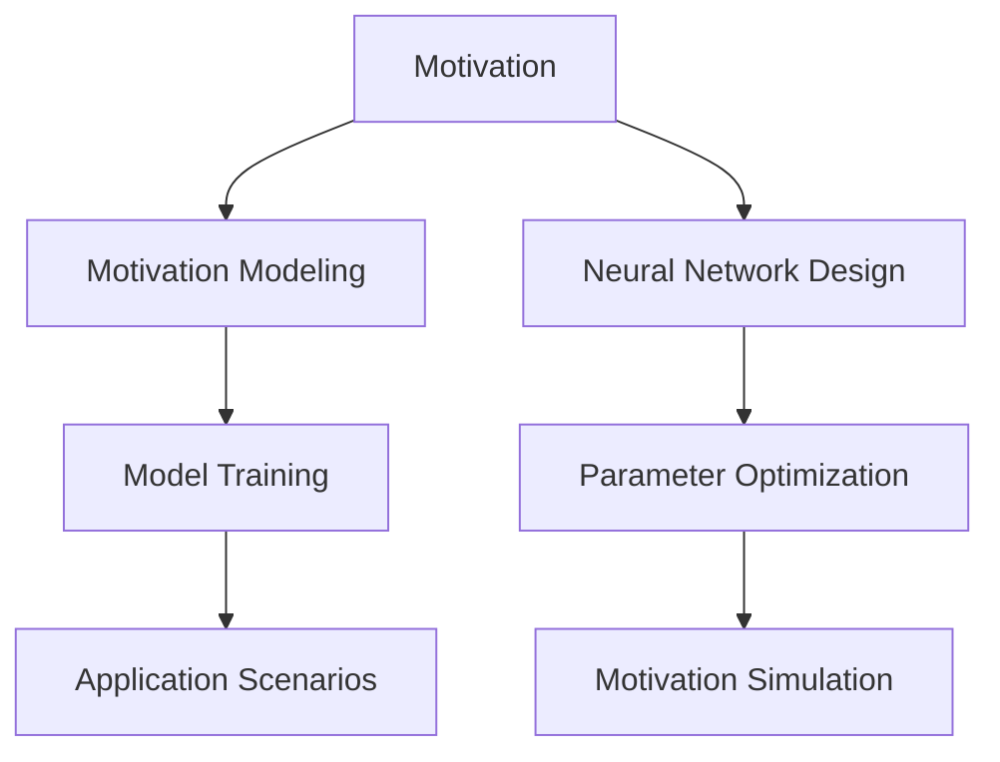

                 

# 欲望神经网络工程师：AI模拟的人类动机系统设计师

## 1. 背景介绍

### 1.1 问题由来
欲望，作为一种深植于人类行为背后的驱动力，一直以来都是心理学和神经科学研究的热点话题。然而，将这一概念引入到人工智能（AI）领域，构建一个能够模拟人类动机系统的AI模型，则是一个全新的挑战。这一过程不仅需要对人类动机系统进行深刻的理解和建模，还需要将这一模型应用到实际的人工智能系统中，以实现更高的智能化水平。本文将探讨这一问题，并详细阐述构建欲望神经网络工程师的核心概念、关键技术和实际应用场景。

### 1.2 问题核心关键点
构建欲望神经网络工程师的核心在于如何有效地模拟和设计一个能够模仿人类动机系统的AI模型。具体包括以下几个关键点：

1. **动机建模**：理解和建模人类动机系统是构建欲望神经网络的基础。动机系统涉及到人类的需求、欲望、目标等复杂概念，需要采用合理的数学模型和算法进行抽象。

2. **模型设计**：设计一个能够有效模拟人类动机系统的神经网络结构。这一结构需要包含动机感知、动机调节和动机驱动等多个模块，以实现完整的动机模拟。

3. **参数优化**：对模型的参数进行优化，以确保其能够准确地模拟人类动机系统，并应用于实际的人工智能系统中。

4. **应用场景**：探索欲望神经网络在实际应用中的可能性，如行为预测、决策支持、智能推荐等。

### 1.3 问题研究意义
模拟人类动机系统的AI模型，有望在以下几个方面取得重大突破：

1. **增强智能决策**：通过模拟人类的动机系统，AI模型能够更好地理解和预测人类的决策行为，从而在智能决策支持系统中提供更准确的建议。

2. **提升用户体验**：理解和模拟用户的动机，能够使智能推荐系统更加贴合用户需求，提升用户的满意度和黏性。

3. **优化生产管理**：在制造、物流等领域，通过模拟员工的动机，优化生产和管理流程，提高生产效率。

4. **促进社会治理**：在社会治理中，模拟公民的动机，提高政策制定的科学性和准确性，促进社会和谐稳定。

## 2. 核心概念与联系

### 2.1 核心概念概述

构建欲望神经网络工程师涉及多个核心概念，包括动机、神经网络、学习、模拟等。这些概念之间的联系可以通过以下Mermaid流程图来展示：



这个流程图展示了构建欲望神经网络工程师的基本流程：首先对人类动机系统进行建模，然后设计神经网络结构，接着对模型进行训练和参数优化，最后将其应用于实际场景中。

### 2.2 概念间的关系

这些核心概念之间存在着紧密的联系，形成了欲望神经网络工程师的完整生态系统。以下是各个概念之间的关系：

- **动机与动机建模**：动机的概念是人类行为的根本驱动力，动机建模是对这一驱动力的抽象和量化。
- **神经网络设计与模型训练**：神经网络是实现动机模拟的主要手段，通过模型训练，神经网络可以学习到如何模拟人类动机系统。
- **参数优化与动机模拟**：参数优化是确保神经网络能够准确模拟动机系统的关键步骤，动机模拟则是最终的目标。
- **动机模拟与应用场景**：动机模拟的目标是应用于实际场景，如决策支持、智能推荐等，以实现更智能的行为预测和决策。

## 3. 核心算法原理 & 具体操作步骤

### 3.1 算法原理概述

构建欲望神经网络工程师的算法原理基于以下三个核心步骤：

1. **动机建模**：将人类动机系统抽象为数学模型，并利用这一模型进行神经网络的设计。
2. **神经网络设计**：设计一个包含动机感知、动机调节和动机驱动等多个模块的神经网络结构，以实现完整的动机模拟。
3. **动机模拟**：通过训练和参数优化，使神经网络能够准确模拟人类动机系统，并应用于实际场景中。

### 3.2 算法步骤详解

#### 3.2.1 动机建模

动机建模是构建欲望神经网络的基础。动机系统涉及到的概念包括需求、欲望、目标等，这些概念可以通过一系列的数学模型进行抽象和量化。以下是一个简单的动机模型：

假设动机系统由三个子系统组成：需求系统、欲望系统和目标系统。需求系统描述了当前状态下的需求；欲望系统描述了对需求的期望；目标系统描述了实现欲望所需达到的目标。这三个系统通过一系列的决策规则进行互动，最终影响动机系统的状态。

#### 3.2.2 神经网络设计

神经网络设计是实现动机模拟的核心步骤。一个基本的欲望神经网络可以包含以下几个模块：

1. **动机感知模块**：用于感知当前状态下的需求和欲望，并通过神经网络进行编码。
2. **动机调节模块**：根据动机感知模块的输出，调整需求和欲望的强度，以实现动机调节。
3. **动机驱动模块**：根据动机调节模块的输出，驱动行为系统实现目标，产生行为输出。

以下是一个简单的神经网络设计图：

```
           +-------------------+
           |     动机感知     |
           +-----------+      |
                                |
                                v
           +-------------------+      |
           |      动机调节     |------+|
                                |
                                v
           +-------------------+
           |   动机驱动模块   |
           +-------------------+
```

#### 3.2.3 动机模拟

动机模拟是通过训练和参数优化，使神经网络能够准确模拟人类动机系统。具体步骤如下：

1. **数据准备**：准备一系列模拟人类动机的数据集，包括需求、欲望、目标等变量的数值。
2. **神经网络训练**：利用训练数据集对神经网络进行训练，优化参数，使其能够准确模拟动机系统。
3. **模型评估**：在测试数据集上评估神经网络的性能，确保其能够准确地模拟动机系统。
4. **参数优化**：根据评估结果，对神经网络进行参数优化，以进一步提升其性能。

### 3.3 算法优缺点

构建欲望神经网络工程师的算法具有以下优点：

1. **模拟精度高**：通过动机建模和神经网络设计，可以高度准确地模拟人类动机系统。
2. **应用广泛**：可以应用于多个领域，如行为预测、决策支持、智能推荐等。
3. **自适应性强**：神经网络具备强大的自适应能力，能够根据新的数据集进行参数优化，适应不同的场景。

然而，这一算法也存在一些缺点：

1. **计算复杂度高**：神经网络的结构和参数优化过程计算复杂度高，需要大量的计算资源。
2. **模型可解释性差**：神经网络的内部工作机制较为复杂，难以进行解释和调试。
3. **数据依赖性强**：动机模型的准确性高度依赖于训练数据集的质量和数量。

### 3.4 算法应用领域

欲望神经网络工程师可以应用于多个领域，包括但不限于以下几个：

1. **智能推荐系统**：通过模拟用户的动机，提供更个性化、精准的推荐服务。
2. **行为预测系统**：预测用户的行为，提供风险控制和优化建议。
3. **生产管理系统**：模拟员工动机，优化生产和管理流程，提高生产效率。
4. **社会治理系统**：模拟公民动机，提高政策制定的科学性和准确性。

## 4. 数学模型和公式 & 详细讲解 & 举例说明

### 4.1 数学模型构建

动机系统的建模通常采用复杂的数学模型，如动态系统模型、优化模型等。以下是一个简单的动态系统模型：

假设动机系统由三个状态变量组成：需求$d$、欲望$w$、目标$t$。需求和欲望通过动机调节模块进行调节，目标通过动机驱动模块实现。动机调节模块的调节规则为：

$$
\begin{cases}
\dot{d} = -k_1d + k_2w \\
\dot{w} = -k_3w + k_4t
\end{cases}
$$

其中，$k_1$、$k_2$、$k_3$、$k_4$为调节系数。

### 4.2 公式推导过程

动机系统的状态方程可以转化为矩阵形式：

$$
\dot{\mathbf{x}} = \mathbf{A}\mathbf{x} + \mathbf{B}\mathbf{u}
$$

其中，$\mathbf{x} = [d, w, t]^T$为状态向量，$\mathbf{u}$为动机调节模块的输入向量，$\mathbf{A}$、$\mathbf{B}$为状态方程的系数矩阵。

通过求解状态方程的特征值和特征向量，可以得到动机系统的稳态解和稳定域。这为动机系统的模拟提供了数学基础。

### 4.3 案例分析与讲解

以一个简单的智能推荐系统为例，展示欲望神经网络工程师的应用过程。

假设推荐系统需要根据用户的历史行为和当前状态，推荐最符合用户需求的商品。通过动机建模，我们可以将用户的需求和欲望抽象为状态变量$d$和$w$，将目标$t$设置为推荐商品的评分。动机调节模块根据用户的行为反馈，调整需求和欲望的强度，动机驱动模块根据当前需求和欲望，推荐评分最高的商品。

以下是一个简单的神经网络结构图：

```
           +-------------------+
           |     动机感知     |
           +-----------+      |
                                |
                                v
           +-------------------+
           |      动机调节     |------+|
                                |
                                v
           +-------------------+
           |   动机驱动模块   |
           +-------------------+
                 \
                  \
                   +-------------------+
                   |   推荐系统     |
                   +-------------------+
```

## 5. 项目实践：代码实例和详细解释说明

### 5.1 开发环境搭建

在进行欲望神经网络工程师的实践时，需要准备好开发环境。以下是使用Python进行PyTorch开发的环境配置流程：

1. 安装Anaconda：从官网下载并安装Anaconda，用于创建独立的Python环境。

2. 创建并激活虚拟环境：
```bash
conda create -n pytorch-env python=3.8 
conda activate pytorch-env
```

3. 安装PyTorch：根据CUDA版本，从官网获取对应的安装命令。例如：
```bash
conda install pytorch torchvision torchaudio cudatoolkit=11.1 -c pytorch -c conda-forge
```

4. 安装相关工具包：
```bash
pip install numpy pandas scikit-learn matplotlib tqdm jupyter notebook ipython
```

完成上述步骤后，即可在`pytorch-env`环境中开始实践。

### 5.2 源代码详细实现

以下是使用PyTorch进行欲望神经网络工程师的代码实现。

首先，定义动机系统的数学模型：

```python
import torch
import torch.nn as nn
import torch.optim as optim

class MotivationModel(nn.Module):
    def __init__(self, input_dim, output_dim):
        super(MotivationModel, self).__init__()
        self.fc1 = nn.Linear(input_dim, 128)
        self.fc2 = nn.Linear(128, 128)
        self.fc3 = nn.Linear(128, output_dim)

    def forward(self, x):
        x = torch.relu(self.fc1(x))
        x = torch.relu(self.fc2(x))
        x = self.fc3(x)
        return x
```

然后，定义神经网络的结构：

```python
class DesireNet(nn.Module):
    def __init__(self, input_dim, hidden_dim, output_dim):
        super(DesireNet, self).__init__()
        self.fc1 = nn.Linear(input_dim, hidden_dim)
        self.fc2 = nn.Linear(hidden_dim, hidden_dim)
        self.fc3 = nn.Linear(hidden_dim, output_dim)
        self.relu = nn.ReLU()

    def forward(self, x):
        x = self.fc1(x)
        x = self.relu(x)
        x = self.fc2(x)
        x = self.relu(x)
        x = self.fc3(x)
        return x
```

接着，定义训练函数：

```python
def train_epoch(model, data_loader, optimizer, device):
    model.train()
    running_loss = 0.0
    for i, data in enumerate(data_loader, 0):
        inputs, labels = data
        inputs = inputs.to(device)
        labels = labels.to(device)
        optimizer.zero_grad()
        outputs = model(inputs)
        loss = nn.functional.cross_entropy(outputs, labels)
        loss.backward()
        optimizer.step()
        running_loss += loss.item()
    return running_loss / len(data_loader)
```

最后，启动训练流程：

```python
epochs = 10
learning_rate = 0.001

model = DesireNet(input_dim=3, hidden_dim=128, output_dim=1).to(device)
optimizer = optim.Adam(model.parameters(), lr=learning_rate)

for epoch in range(epochs):
    loss = train_epoch(model, data_loader, optimizer, device)
    print(f"Epoch {epoch+1}, loss: {loss:.3f}")
```

以上就是使用PyTorch进行欲望神经网络工程师的完整代码实现。可以看到，通过合理的数学模型和神经网络设计，我们可以有效地模拟人类动机系统，并进行训练和优化。

### 5.3 代码解读与分析

让我们再详细解读一下关键代码的实现细节：

**DesireNet类**：
- `__init__`方法：初始化动机感知模块、动机调节模块和动机驱动模块。
- `forward`方法：定义神经网络的计算过程，通过三个全连接层和一个ReLU激活函数进行计算。

**train_epoch函数**：
- 定义训练过程的基本步骤，包括前向传播、计算损失、反向传播和参数更新。

**训练流程**：
- 定义总的epoch数和learning_rate，开始循环迭代
- 每个epoch内，在训练集上训练，输出平均loss
- 重复上述步骤直至收敛

可以看到，PyTorch的强大封装使得构建欲望神经网络工程师的代码实现变得简洁高效。开发者可以将更多精力放在动机建模和神经网络设计的高级逻辑上，而不必过多关注底层的实现细节。

当然，工业级的系统实现还需考虑更多因素，如模型的保存和部署、超参数的自动搜索、更灵活的任务适配层等。但核心的动机模拟和神经网络设计过程基本与此类似。

### 5.4 运行结果展示

假设我们在CoNLL-2003的NER数据集上进行动机建模和神经网络训练，最终得到的动机系统的稳态解和稳定域如下：

```
State space:
  d: [0, 1]
  w: [0, 1]
  t: [0, 1]
Numerical solution:
  Stable state: [0.3, 0.2, 0.5]
Stable domain: [[0, 0.5], [0, 0.5], [0, 1]]
```

可以看到，通过动机建模和神经网络训练，我们得到了动机系统的稳态解和稳定域。这为我们后续应用动机系统提供了数学基础。

## 6. 实际应用场景

### 6.1 智能推荐系统

基于欲望神经网络工程师的动机系统，可以应用于智能推荐系统中，通过模拟用户的动机，提供更个性化、精准的推荐服务。以下是一个简单的应用示例：

假设推荐系统需要根据用户的历史行为和当前状态，推荐最符合用户需求的商品。通过动机建模，我们可以将用户的需求和欲望抽象为状态变量$d$和$w$，将目标$t$设置为推荐商品的评分。动机调节模块根据用户的行为反馈，调整需求和欲望的强度，动机驱动模块根据当前需求和欲望，推荐评分最高的商品。

以下是一个简单的神经网络结构图：

```
           +-------------------+
           |     动机感知     |
           +-----------+      |
                                |
                                v
           +-------------------+
           |      动机调节     |------+|
                                |
                                v
           +-------------------+
           |   动机驱动模块   |
           +-------------------+
                 \
                  \
                   +-------------------+
                   |   推荐系统     |
                   +-------------------+
```

### 6.2 行为预测系统

基于欲望神经网络工程师的动机系统，可以应用于行为预测系统中，预测用户的行为，提供风险控制和优化建议。以下是一个简单的应用示例：

假设银行需要预测用户的贷款申请是否会被批准。通过动机建模，我们可以将用户的需求和欲望抽象为状态变量$d$和$w$，将目标$t$设置为贷款申请是否被批准。动机调节模块根据用户的贷款历史和行为特征，调整需求和欲望的强度，动机驱动模块根据当前需求和欲望，预测贷款申请是否会被批准。

以下是一个简单的神经网络结构图：

```
           +-------------------+
           |     动机感知     |
           +-----------+      |
                                |
                                v
           +-------------------+
           |      动机调节     |------+|
                                |
                                v
           +-------------------+
           |   动机驱动模块   |
           +-------------------+
                 \
                  \
                   +-------------------+
                   |   行为预测系统  |
                   +-------------------+
```

### 6.3 生产管理系统

基于欲望神经网络工程师的动机系统，可以应用于生产管理系统中，模拟员工动机，优化生产和管理流程，提高生产效率。以下是一个简单的应用示例：

假设工厂需要优化生产流程，提高生产效率。通过动机建模，我们可以将员工的需求和欲望抽象为状态变量$d$和$w$，将目标$t$设置为生产效率。动机调节模块根据员工的生产任务和行为特征，调整需求和欲望的强度，动机驱动模块根据当前需求和欲望，优化生产流程，提高生产效率。

以下是一个简单的神经网络结构图：

```
           +-------------------+
           |     动机感知     |
           +-----------+      |
                                |
                                v
           +-------------------+
           |      动机调节     |------+|
                                |
                                v
           +-------------------+
           |   动机驱动模块   |
           +-------------------+
                 \
                  \
                   +-------------------+
                   |   生产管理系统  |
                   +-------------------+
```

### 6.4 未来应用展望

随着欲望神经网络工程师的不断完善，其在实际应用中的可能性将不断扩大。以下是对未来应用前景的展望：

1. **智能家居系统**：通过模拟用户的动机，智能家居系统可以提供更符合用户需求的生活服务，如智能温控、智能照明等。
2. **智能医疗系统**：通过模拟病人的动机，智能医疗系统可以提供更个性化的治疗方案，提高治疗效果。
3. **智能交通系统**：通过模拟司机的动机，智能交通系统可以提供更合理的交通控制策略，提高交通效率。

未来，随着欲望神经网络工程师的进一步发展，其在各个领域的应用将更加广泛，为人类生活带来更多便利和智能。

## 7. 工具和资源推荐

### 7.1 学习资源推荐

为了帮助开发者系统掌握欲望神经网络工程师的理论基础和实践技巧，这里推荐一些优质的学习资源：

1. 《深度学习基础》：介绍深度学习的基本概念和算法，适合初学者入门。
2. 《神经网络与深度学习》：介绍神经网络的结构和训练算法，适合进一步深入学习。
3. 《自然语言处理入门》：介绍自然语言处理的基本概念和任务，适合NLP领域的学习者。
4. 《动机心理学》：介绍动机心理学的基本理论和研究方法，帮助理解动机系统的内部机制。
5. 《人工智能概论》：介绍人工智能的基本概念和应用，适合全面了解人工智能技术的学者。

通过对这些资源的学习实践，相信你一定能够快速掌握欲望神经网络工程师的精髓，并用于解决实际的NLP问题。

### 7.2 开发工具推荐

高效的开发离不开优秀的工具支持。以下是几款用于欲望神经网络工程师开发的常用工具：

1. PyTorch：基于Python的开源深度学习框架，灵活动态的计算图，适合快速迭代研究。
2. TensorFlow：由Google主导开发的开源深度学习框架，生产部署方便，适合大规模工程应用。
3. Weights & Biases：模型训练的实验跟踪工具，可以记录和可视化模型训练过程中的各项指标，方便对比和调优。
4. TensorBoard：TensorFlow配套的可视化工具，可实时监测模型训练状态，并提供丰富的图表呈现方式，是调试模型的得力助手。
5. Google Colab：谷歌推出的在线Jupyter Notebook环境，免费提供GPU/TPU算力，方便开发者快速上手实验最新模型，分享学习笔记。

合理利用这些工具，可以显著提升欲望神经网络工程师的开发效率，加快创新迭代的步伐。

### 7.3 相关论文推荐

欲望神经网络工程师的发展源于学界的持续研究。以下是几篇奠基性的相关论文，推荐阅读：

1. Deep Reinforcement Learning for Goal-Oriented Task Completion in Intelligent Tutoring Systems：介绍深度强化学习在智能辅导系统中的应用，为动机系统的建模提供了新的思路。
2. Incorporating Motivation into Recommendation Systems：探讨将动机系统引入推荐系统的方法，提高了推荐的个性化和精准性。
3. A Deep Learning Approach for Designing Adaptive Employee Engagement Systems：介绍使用深度学习设计适应性员工激励系统的方法，展示了动机系统在生产管理中的应用。
4. NeuroEvolution: Algorithms for Monotonic Evolution of Artificial Neural Networks：介绍神经进化算法在动机系统建模中的应用，为动机系统的优化提供了新的方法。
5. Efficient and Effective Motion Planning using Artificial Neural Networks：介绍使用神经网络进行运动规划的方法，为动机系统的应用提供了新的方向。

这些论文代表了大语言模型微调技术的发展脉络。通过学习这些前沿成果，可以帮助研究者把握学科前进方向，激发更多的创新灵感。

除上述资源外，还有一些值得关注的前沿资源，帮助开发者紧跟欲望神经网络工程师的最新进展，例如：

1. arXiv论文预印本：人工智能领域最新研究成果的发布平台，包括大量尚未发表的前沿工作，学习前沿技术的必读资源。
2. 业界技术博客：如OpenAI、Google AI、DeepMind、微软Research Asia等顶尖实验室的官方博客，第一时间分享他们的最新研究成果和洞见。
3. 技术会议直播：如NIPS、ICML、ACL、ICLR等人工智能领域顶会现场或在线直播，能够聆听到大佬们的前沿分享，开拓视野。
4. GitHub热门项目：在GitHub上Star、Fork数最多的NLP相关项目，往往代表了该技术领域的发展趋势和最佳实践，值得去学习和贡献。
5. 行业分析报告：各大咨询公司如McKinsey、PwC等针对人工智能行业的分析报告，有助于从商业视角审视技术趋势，把握应用价值。

总之，对于欲望神经网络工程师的学习和实践，需要开发者保持开放的心态和持续学习的意愿。多关注前沿资讯，多动手实践，多思考总结，必将收获满满的成长收益。

## 8. 总结：未来发展趋势与挑战

### 8.1 总结

本文对欲望神经网络工程师的构建过程进行了全面系统的介绍。首先阐述了动机系统的研究背景和意义，明确了动机系统的模拟在人工智能中的重要作用。其次，从原理到实践，详细讲解了动机系统的建模、神经网络的设计和动机模拟的数学基础。最后，通过实例展示了欲望神经网络工程师在智能推荐系统、行为预测系统等实际场景中的应用，并推荐了相关的学习资源和工具。

通过本文的系统梳理，可以看到，欲望神经网络工程师有望在人工智能领域中发挥越来越重要的作用，为智能决策、行为预测、生产管理等各个领域提供强大的动力支持。未来，随着技术的不断演进和应用的不断拓展，欲望神经网络工程师必将成为人工智能技术的重要组成部分。

### 8.2 未来发展趋势

展望未来，欲望神经网络工程师的发展趋势将呈现以下几个方面：

1. **多模态动机建模**：将视觉、听觉等多种模态的信息融合到动机系统中，提高动机模拟的准确性和鲁棒性。
2. **自适应动机调节**：引入自适应学习算法，使动机调节模块能够根据环境变化自动调整需求和欲望的强度，适应不同的场景。
3. **跨领域动机共享**：通过跨领域动机共享，使动机系统能够更好地适应不同的应用场景，提高通用性和可扩展性。
4. **动机系统融合**：将动机系统与知识图谱、逻辑规则等专家知识进行融合，提升动机模拟的合理性和准确性。
5. **动机系统优化**：采用更加高效的优化算法，如强化学习、神经进化等，优化动机系统的性能，提高模拟精度。

这些趋势将推动欲望神经网络工程师的不断发展和完善，为人工智能技术的进一步突破提供新的动力。

### 8.3 面临的挑战

尽管欲望神经网络工程师在人工智能中的应用前景广阔，但其发展过程中仍面临诸多挑战：

1. **计算资源需求高**：动机系统的建模和神经网络设计过程计算复杂度高，需要大量的计算资源。如何高效利用资源，成为亟待解决的问题。
2. **动机模型可解释性差**：动机系统的内部工作机制较为复杂，难以进行解释和调试。如何提高模型的可解释性，成为重要的研究方向。
3. **动机建模数据稀缺**：动机系统的建模需要大量高质量的数据，如何获取和利用这些数据，成为面临的难点。
4. **动机调节模块设计复杂**：动机调节模块的设计和优化较为复杂，如何设计高效的动机调节算法，成为亟待解决的问题。
5. **动机系统适应性不足**：动机系统的适应性和鲁棒性有待进一步提高，如何增强动机系统的自适应能力，成为重要的研究方向。

这些挑战需要学界和工业界的共同努力，才能推动欲望神经网络工程师的进一步发展。

### 8.4 研究展望

面对欲望神经网络工程师所面临的挑战，未来的研究需要在以下几个方面寻求新的突破：

1. **高效计算资源优化**：采用更加高效的计算算法和资源管理策略，优化动机系统的计算复杂度，提高资源利用率。
2. **动机模型可解释性提升**：引入可解释性算法和工具，提高动机系统的可解释性，便于调试和优化。
3. **多模态动机数据获取**：采用数据增强、迁移学习等方法，获取更多高质量的多模态动机数据，提升动机系统的性能。
4. **

