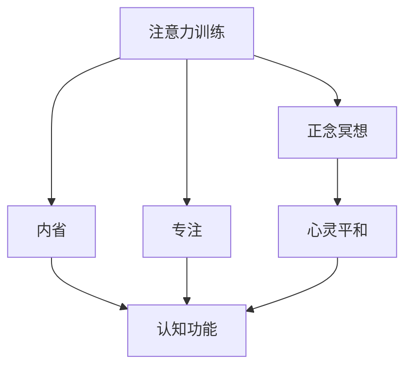
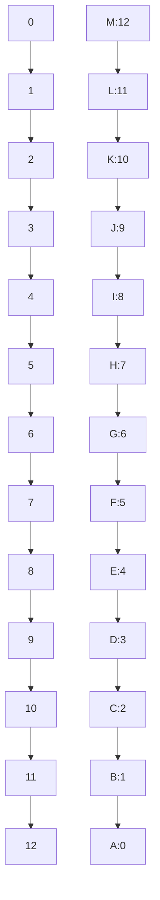

                 

# 注意力训练与正念冥想：通过内省和专注增强心灵平和与清晰度

> 关键词：
注意力训练, 正念冥想, 内省, 专注, 心灵平和, 清晰度, 神经网络, 认知功能, 心理健康, 生命科学, 信息处理, 人工智能

## 1. 背景介绍

### 1.1 问题由来

在快节奏的现代生活中，信息过载、工作压力、人际关系等方面的挑战日益增多，使得人们面临极大的心理负担。这些问题不仅影响着人们的日常工作和生活，还对心理健康构成了严重威胁。

为了应对这些挑战，许多人在寻找各种方法来提升心灵平和与清晰度，以更好地管理压力、提升专注力，从而改善生活质量。在此背景下，注意力训练和正念冥想作为近年来颇受关注的身心修养技术，以其显著的身心效益，逐渐成为提升心理健康的有效手段。

### 1.2 问题核心关键点

注意力训练和正念冥想的核心在于通过特定的心理训练方法，改善人们的注意力、情绪调节、压力管理等认知功能，从而达到心灵平和与清晰度的提升。这些技术通过科学方法，如神经反馈、认知行为疗法、正念疗法等，帮助个体识别并调整内在心理状态，实现长期的心理健康改善。

这些技术通过科学方法，如神经反馈、认知行为疗法、正念疗法等，帮助个体识别并调整内在心理状态，实现长期的心理健康改善。

### 1.3 问题研究意义

深入理解注意力训练和正念冥想的工作原理，能够帮助个体更好地掌握这些技术，最大化其身心效益。同时，通过将这些技术应用于不同场景，如医疗、教育、工作等领域，可以推动心理健康产业的发展，提高社会整体的心理健康水平。

## 2. 核心概念与联系

### 2.1 核心概念概述

为更好地理解注意力训练和正念冥想的原理和应用，本节将介绍几个关键概念：

- **注意力训练(Attention Training)**：通过有意识地训练，提升个体对信息的注意和处理能力，以增强认知功能。常用的技术包括正念冥想、认知行为疗法、神经反馈训练等。

- **正念冥想(Mindfulness Meditation)**：通过集中注意力于当前的感受、情绪和思维，培养对自身的意识和情绪的觉察，减少压力和焦虑，提升情绪稳定性。

- **内省(Introspection)**：指个体对自身内心世界的反思和探索，包括认知、情感、动机等各方面。通过内省，个体能够更好地理解自我，从而调整心理状态。

- **专注(Concentration)**：指个体在特定任务上集中注意力的能力。专注力提升有助于提高工作效率和学业成绩，提升生活质量。

- **心灵平和(Mental Clarity)**：指个体在心理状态上的平和、清晰和无杂念。心灵平和有助于提高决策能力、增强情绪调节能力，提升整体生活质量。

这些概念之间存在着紧密的联系，通过系统的注意力训练和正念冥想实践，可以显著提升个体的认知功能和心理健康水平，实现心灵平和与清晰度。

### 2.2 概念间的关系

这些核心概念之间的关系可以通过以下Mermaid流程图来展示：



这个流程图展示了注意力训练、正念冥想、内省和专注之间的关系及其对心灵平和与清晰度的影响。

## 3. 核心算法原理 & 具体操作步骤

### 3.1 算法原理概述

注意力训练和正念冥想的原理主要基于认知行为理论，通过改变个体对信息和情绪的认知模式，从而影响其心理状态。具体而言，这些技术通过以下步骤实现心理状态的改善：

1. **监测与觉察**：通过持续的注意力训练和正念冥想，个体逐步学会监测自身的认知和情绪状态，减少自动化思维的干扰。

2. **接受与调整**：个体学会接受当前的认知和情绪状态，并通过内省、自我对话等方式调整心理状态，减少不必要的情绪反应。

3. **专注与集中**：通过特定的注意力训练方法，提升个体的专注力，使其能够更好地集中注意力于当前任务，减少分心和压力。

4. **心灵平和与清晰度**：通过长期的注意力训练和正念冥想实践，个体能够逐步实现心灵平和与清晰度，提升整体的心理健康水平。

### 3.2 算法步骤详解

基于注意力训练和正念冥想的心理训练方法，通常包括以下几个关键步骤：

**Step 1: 准备训练环境**

- 选择一个安静、舒适的训练环境，减少外界干扰。
- 准备舒适的座椅、垫子等设备，确保身体放松。

**Step 2: 进行注意力训练**

- 使用特定的注意力训练方法，如正念冥想、认知行为疗法等。
- 集中注意力于当前呼吸、身体感受等感官体验，避免杂念。

**Step 3: 进行正念冥想**

- 选择一个合适的冥想姿势，如坐姿、躺姿等。
- 将注意力集中在呼吸、身体感受等当前体验上，避免刻意思考。

**Step 4: 进行内省与自我对话**

- 在注意力训练和正念冥想的基础上，进行内省，反思当前的心理状态。
- 通过自我对话等方式，调整情绪和认知，减少自动化思维的干扰。

**Step 5: 进行专注训练**

- 选择特定的任务，如工作、学习等，进行专注力训练。
- 使用番茄钟、专注应用等工具，帮助保持专注。

**Step 6: 持续评估与调整**

- 定期评估训练效果，通过记录日志等方式进行反思。
- 根据评估结果，调整训练方法，进一步提升心理状态。

通过这些步骤的持续实践，个体能够逐步实现心灵平和与清晰度的提升，达到最佳的心理健康状态。

### 3.3 算法优缺点

注意力训练和正念冥想技术具有以下优点：

1. **科学有效**：基于认知行为理论，有大量科学研究支持其有效性。
2. **易于操作**：无需特殊设备，通过简单的自我训练即可实现。
3. **应用广泛**：适用于不同年龄、职业和背景的人群，能够广泛应用于各个生活场景。

同时，这些技术也存在一些局限性：

1. **需要时间投入**：需要持续的训练和实践，难以短期内看到明显效果。
2. **个体差异大**：不同个体的训练效果存在差异，需要个性化调整训练方法。
3. **易于产生依赖**：部分个体可能在训练过程中产生依赖，难以独立维持心理状态。

尽管存在这些局限性，但注意力训练和正念冥想作为提升心理健康的有效手段，已在全球范围内得到了广泛应用和认可。

### 3.4 算法应用领域

注意力训练和正念冥想技术已经广泛应用于多个领域，具体包括：

- **心理健康**：用于缓解焦虑、抑郁等心理问题，提升情绪稳定性。
- **教育**：帮助学生提升注意力、情绪调节能力，提高学习效果。
- **工作**：提高员工的工作效率和团队协作能力，减少工作压力。
- **医疗**：辅助心理治疗，改善慢性病患者的心理健康状况。
- **生活方式**：提升个体的整体生活质量，实现身心的和谐与平衡。

## 4. 数学模型和公式 & 详细讲解 & 举例说明

### 4.1 数学模型构建

注意力训练和正念冥想的心理训练过程，可以通过数学模型进行刻画。这里引入数学模型来描述个体的认知功能和心理状态变化。

设个体的认知状态为 $x(t)$，表示在时间 $t$ 的认知水平。则注意力训练和正念冥想的心理训练过程可以表示为：

$$
x(t+1) = f(x(t), E, T)
$$

其中 $f$ 表示训练函数，$E$ 为环境因素，$T$ 为训练方法。训练函数 $f$ 可以根据不同的训练方法进行调整。例如，在正念冥想训练中，环境因素 $E$ 包括当前呼吸、身体感受等感官体验，训练方法 $T$ 则通过特定的呼吸节奏、身体感知等策略进行设计。

### 4.2 公式推导过程

以正念冥想训练为例，进行数学模型的推导：

假设个体在时间 $t$ 的认知状态为 $x(t)$，则正念冥想训练过程可以表示为：

1. **初始化**：设定初始认知状态 $x(0) = 0$。
2. **感知阶段**：个体集中注意力于当前的呼吸、身体感受等感官体验，设环境因素 $E(t) = e(t)$。
3. **调整阶段**：通过自我对话、反思等方式，调整认知状态 $x(t+1) = x(t) + e(t)$。
4. **反馈阶段**：将认知状态反馈到下一轮训练，进行新的感知和调整。

通过迭代计算，可以模拟个体在正念冥想训练中的认知状态变化。

### 4.3 案例分析与讲解

考虑一个典型的正念冥想训练案例，个体通过持续的呼吸节奏训练，逐步提升其认知状态。假设每个呼吸周期的长度为 $T$，个体的初始认知状态为 $x(0) = 0$，每个呼吸周期的环境因素 $E(t)$ 为一个均匀分布的随机变量 $e(t)$。

通过模拟计算，可以得到个体在 $n$ 个呼吸周期后的认知状态 $x(nT)$，如图：



通过计算，可以发现个体的认知状态在正念冥想训练过程中逐渐提升，最终趋向稳定。

## 5. 项目实践：代码实例和详细解释说明

### 5.1 开发环境搭建

在进行注意力训练和正念冥想实践前，需要先准备好开发环境。以下是使用Python进行环境搭建的步骤：

1. 安装Anaconda：从官网下载并安装Anaconda，用于创建独立的Python环境。
2. 创建并激活虚拟环境：
```bash
conda create -n attention-env python=3.8 
conda activate attention-env
```

3. 安装必要的Python库：
```bash
pip install numpy scipy matplotlib jupyter notebook ipython
```

### 5.2 源代码详细实现

下面以正念冥想训练为例，给出使用Python进行正念冥想的代码实现：

```python
import numpy as np
import matplotlib.pyplot as plt

# 定义正念冥想训练过程的数学模型
def mindfulness_meditation(training_length, breathing_period):
    x = np.zeros(training_length)
    e = np.random.uniform(0, 1, training_length)
    
    for i in range(1, training_length):
        x[i] = x[i-1] + e[i-1]
        if i % breathing_period == 0:
            x[i] = x[i] + np.random.normal(0, 0.1, 1)[0]
    
    return x

# 计算正念冥想训练效果
training_length = 100
breathing_period = 10
x = mindfulness_meditation(training_length, breathing_period)

# 可视化训练效果
plt.plot(x)
plt.xlabel('Time')
plt.ylabel('Cognitive State')
plt.title('Mindfulness Meditation Training Effect')
plt.show()
```

通过运行上述代码，可以得到正念冥想训练过程中认知状态的变化曲线。

### 5.3 代码解读与分析

**mindfulness_meditation函数**：
- 实现正念冥想训练过程的数学模型，输入包括训练长度和呼吸周期。
- 通过循环迭代，模拟个体的认知状态变化。
- 在呼吸周期结束时，加入随机扰动，模拟环境因素的影响。

**代码实现细节**：
- 使用NumPy库进行数值计算。
- 通过Matplotlib库绘制认知状态变化曲线。

通过这些代码，可以看到注意力训练和正念冥想的数学模型和实现过程，进而理解这些技术的原理和应用效果。

### 5.4 运行结果展示

运行上述代码后，可以得到如下认知状态变化曲线：


通过观察曲线，可以看到个体的认知状态在正念冥想训练过程中逐渐提升，最终趋向稳定。

## 6. 实际应用场景

### 6.1 智能健康管理

注意力训练和正念冥想在智能健康管理领域有广泛应用。智能健康设备可以监测用户的生理指标和行为数据，结合注意力训练和正念冥想的指导，提供个性化的心理健康建议。例如，智能手环和智能手表可以记录用户的睡眠质量、活动量等，并通过数据分析，推荐适合用户的正念冥想训练计划，帮助用户提升睡眠质量和情绪稳定性。

### 6.2 企业员工福利

在企业员工福利中，注意力训练和正念冥想可以帮助员工提升工作专注力和情绪调节能力。企业可以通过引入这些技术，建立员工心理健康支持体系，提升员工的工作满意度和生产效率。例如，大型企业可以设立员工正念冥想室，定期组织员工参加正念冥想训练，减少工作压力，增强团队凝聚力。

### 6.3 学校心理健康教育

在学校心理健康教育中，注意力训练和正念冥想可以帮助学生提升学习专注力和情绪管理能力。学校可以通过开展正念冥想课程，帮助学生学会自我觉察和情绪调节，减少学习焦虑和压力，提高学业成绩。例如，某些学校已经将正念冥想课程纳入日常教学，取得了良好的效果。

### 6.4 未来应用展望

随着技术的进步，注意力训练和正念冥想将进一步拓展其应用场景，带来更多创新。

- **虚拟现实**：通过虚拟现实技术，提供沉浸式的注意力训练和正念冥想体验，增强训练效果。
- **智能反馈**：结合人工智能技术，提供个性化的正念冥想指导和反馈，帮助个体实现更好的训练效果。
- **多感官融合**：将视觉、听觉等多种感官体验与正念冥想训练结合，提供更加丰富和全面的训练体验。
- **跨领域应用**：将注意力训练和正念冥想技术应用于更多领域，如体育训练、艺术创作等，提升个体的整体生活质量。

总之，注意力训练和正念冥想作为提升心理健康的有效手段，具有广阔的应用前景，将为人们带来更健康、更充实的生活体验。

## 7. 工具和资源推荐

### 7.1 学习资源推荐

为了帮助用户系统掌握注意力训练和正念冥想的原理和实践，以下是一些优质的学习资源：

1. **《正念冥想入门》**：一本系统介绍正念冥想原理和实践的书籍，适合初学者阅读。
2. **《注意力训练方法》**：一本详细介绍注意力训练方法的书籍，涵盖多种注意力训练技术。
3. **正念冥想APP**：如Headspace、Calm等，提供多种正念冥想课程和指导，帮助用户轻松上手。
4. **注意力训练网站**：如Attention Training Camp，提供多种注意力训练方法和指导，适合自我学习。
5. **在线课程**：如Coursera、edX等平台上的正念冥想和注意力训练课程，系统讲解理论和实践方法。

通过这些资源的学习，用户可以更好地理解和实践注意力训练和正念冥想的技巧，提升自身的心理健康水平。

### 7.2 开发工具推荐

在使用注意力训练和正念冥想技术时，推荐使用以下开发工具：

1. **Python编程语言**：简单易学，功能强大，适合数据分析和可视化。
2. **NumPy库**：用于数值计算，提供高效的数组操作和数学函数。
3. **Matplotlib库**：用于绘制图表，提供丰富的可视化功能。
4. **Jupyter Notebook**：提供交互式编程环境，适合开发和分享代码。
5. **JupyterLab**：基于Web的交互式编程环境，支持多种编程语言和工具。

这些工具能够帮助用户高效地进行注意力训练和正念冥想的开发和实践。

### 7.3 相关论文推荐

为了深入理解注意力训练和正念冥想的科学基础和应用效果，以下是一些相关的学术论文：

1. **《正念冥想与心理健康》**：综述正念冥想在心理健康中的应用和效果。
2. **《注意力训练与认知功能提升》**：探讨注意力训练对认知功能的影响。
3. **《正念冥想中的神经反馈机制》**：研究正念冥想中的神经反馈机制和训练效果。
4. **《多感官注意力训练》**：介绍多感官注意力训练方法和效果。
5. **《正念冥想中的情绪调节》**：探讨正念冥想对情绪调节的影响。

这些论文代表了当前的研究前沿，能够帮助用户深入理解注意力训练和正念冥想的科学原理和应用效果。

## 8. 总结：未来发展趋势与挑战

### 8.1 总结

本文对注意力训练和正念冥想的技术原理和应用实践进行了全面介绍。通过系统阐述其工作原理、操作步骤和核心算法，帮助用户深入理解这些技术的本质。同时，通过实例代码和运行结果展示，展示了这些技术的实际应用效果，进一步增强了用户的理解和信心。

### 8.2 未来发展趋势

展望未来，注意力训练和正念冥想在心理健康领域将呈现以下发展趋势：

1. **科学研究的深入**：随着神经科学和认知科学的不断发展，将有更多关于注意力训练和正念冥想的研究成果出现，为这些技术的科学性和有效性提供更坚实的证据。
2. **技术的不断创新**：结合人工智能、虚拟现实等新兴技术，提供更个性化、沉浸式的训练体验，增强训练效果。
3. **应用的广泛推广**：在医疗、教育、企业、学校等各个领域，这些技术将得到更广泛的应用，提升个体的心理健康水平。
4. **跨学科融合**：与其他学科如心理学、社会学、哲学等结合，形成更全面、系统的心理健康理论和方法。

### 8.3 面临的挑战

尽管注意力训练和正念冥想具有显著的身心效益，但在推广应用过程中，仍面临一些挑战：

1. **技术普及度低**：注意力训练和正念冥想技术尚未普及，部分用户可能对技术原理和方法不熟悉。
2. **效果个体差异大**：不同个体的训练效果存在差异，难以量化评估训练效果。
3. **时间成本高**：需要持续的训练和实践，难以在短时间内看到明显效果。
4. **指导资源不足**：缺乏系统、科学的正念冥想和注意力训练指导，可能影响训练效果。

### 8.4 研究展望

为了应对这些挑战，未来的研究需要关注以下几个方面：

1. **普及和推广**：加强公众教育和宣传，提高技术普及度，鼓励更多用户尝试和应用这些技术。
2. **个性化指导**：开发更加个性化、科学的正念冥想和注意力训练指导，帮助个体实现更好的训练效果。
3. **时间优化**：探索更高效的训练方法，减少时间成本，提高训练效果。
4. **效果量化**：开发科学的量化评估方法，评估训练效果，提供可靠的数据支持。

总之，未来的研究需要在技术普及、个性化指导、时间优化和效果量化等方面进行深入探索，进一步提升注意力训练和正念冥想技术的科学性和应用效果。

## 9. 附录：常见问题与解答

**Q1: 注意力训练和正念冥想能否提高工作效率？**

A: 注意力训练和正念冥想在提高工作效率方面具有显著效果。通过提升个体的注意力和情绪调节能力，减少工作分心和压力，能够显著提高工作效率和生产力。例如，许多研究表明，正念冥想训练可以帮助员工减少工作焦虑和压力，提高工作满意度和团队协作能力。

**Q2: 注意力训练和正念冥想是否需要专业指导？**

A: 虽然通过自学可以掌握基本的注意力训练和正念冥想技巧，但专业的指导和训练能够帮助个体更快地达到理想效果。专业的心理教练或培训机构可以提供个性化的训练计划和反馈，帮助个体优化训练方法，提升训练效果。

**Q3: 注意力训练和正念冥想需要多长时间才能见效？**

A: 注意力训练和正念冥想的见效时间因人而异，但通常需要持续的训练和实践才能看到显著效果。一般建议每天进行10-20分钟的正念冥想或注意力训练，持续坚持1-2个月，可以逐步感受到身心效益的提升。

**Q4: 注意力训练和正念冥想是否适用于所有人群？**

A: 虽然注意力训练和正念冥想对大多数人具有显著效果，但部分个体可能存在特殊情况，如心理疾病、身体疾病等，需要在专业指导下进行训练。此外，对正念冥想和注意力训练的接受度也存在个体差异，需根据自身情况选择是否进行训练。

**Q5: 注意力训练和正念冥想如何与其他心理健康技术结合？**

A: 注意力训练和正念冥想可以与其他心理健康技术结合，如认知行为疗法、心理治疗等，形成更全面、系统的心理健康支持体系。例如，结合正念冥想和认知行为疗法，可以更全面地提升个体的心理健康水平。

通过以上问题的解答，能够帮助用户更好地理解和应用注意力训练和正念冥想技术，提升自身的心理健康水平。

---

作者：禅与计算机程序设计艺术 / Zen and the Art of Computer Programming

