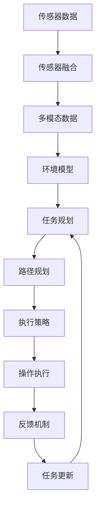
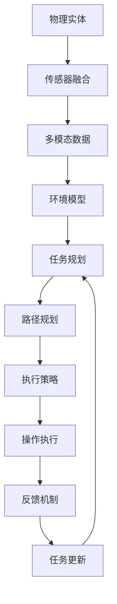
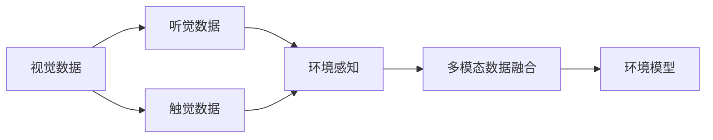
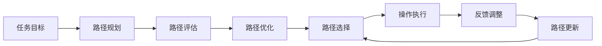
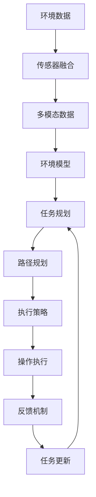

                 

## 1. 背景介绍

### 1.1 问题由来
在工业化社会，制造业、物流和交通等领域的实体操作是高效生产和经济活动的基础。然而，这些领域通常依赖人工操作，存在成本高、效率低、安全风险高等问题。自动化技术可以极大提升实体操作的效率和安全性，但传统自动化方式（如机械臂、自动驾驶等）需要大量的前期研发和定制化投入，应用范围受到限制。

近年来，人工智能技术的发展为物理实体的自动化提供了新的契机。借助深度学习和大数据技术，物理实体自动化可以变得更加智能化、灵活化，而不再局限于特定的物理形态和操作场景。例如，无人驾驶车辆、智能机器人、自动仓储系统等应用，均在探索将人工智能技术与物理实体自动化相结合，以期大幅提升效率和安全性。

### 1.2 问题核心关键点
物理实体自动化的核心在于如何构建智能化的操作模型，使其能够理解物理环境、执行复杂任务、与人类进行交互。目前主流的方法包括：

- 传感器融合：利用各类传感器（如激光雷达、摄像头、IMU等）感知物理环境，提取多维数据。
- 任务规划与路径优化：根据任务目标，规划操作路径，避免碰撞和冲突。
- 人机交互：使用自然语言处理（NLP）和计算机视觉（CV）技术，实现语音和图像识别，执行人机交互。
- 多模态融合：综合利用听觉、视觉、触觉等多种模态信息，提升任务执行的精确度。
- 机器学习：通过机器学习算法，实现物理实体的智能决策和适应性。

物理实体自动化的目标是构建一套完善的感知、决策、执行、交互的智能系统，使其在实际应用中能够灵活适应各种环境，完成复杂的任务。

### 1.3 问题研究意义
物理实体自动化技术的发展对于提升生产效率、降低生产成本、保障人身安全具有重要意义：

1. 降低人工成本。自动化系统可以替代大量的人工操作，减少劳动力需求，降低企业运营成本。
2. 提高操作效率。智能化操作模型能够快速响应环境变化，执行复杂任务，显著提升作业效率。
3. 改善作业安全。物理实体自动化可以避免人类在危险环境中的操作，降低事故发生率。
4. 推动产业升级。自动化技术的应用可以推动传统产业的数字化转型，提升产业竞争力。
5. 赋能新兴领域。自动化技术在无人驾驶、智能家居、智慧农业等新兴领域的应用，将带来新的经济增长点。

## 2. 核心概念与联系

### 2.1 核心概念概述

为更好地理解物理实体自动化的实现过程，本节将介绍几个密切相关的核心概念：

- **传感器融合**：将多种传感器的数据进行综合处理，提取多维环境信息。
- **任务规划**：根据任务目标，设计操作路径，优化路径选择。
- **路径规划**：在给定路径上，计算最优操作策略。
- **人机交互**：实现机器与人的信息交换，执行任务指令。
- **多模态融合**：融合听觉、视觉、触觉等多种模态信息，提升任务执行的精确度。
- **机器学习**：利用算法模型，实现物理实体的智能决策和适应性。
- **协同工作**：多个智能实体协同完成复杂任务，提升系统可靠性。

这些核心概念之间紧密联系，共同构成了物理实体自动化的整体框架。以下是一个综合性的Mermaid流程图，展示这些概念之间的关系：



### 2.2 概念间的关系

这些核心概念之间存在紧密的联系，形成了物理实体自动化的完整系统架构。以下通过几个Mermaid流程图来展示这些概念之间的关系：

#### 2.2.1 物理实体自动化系统架构



这个流程图展示了大规模预训练语言模型的一般流程：

1. 传感器数据采集：利用各类传感器获取环境信息。
2. 传感器融合：将多源数据进行融合，形成多模态数据。
3. 环境建模：构建环境地图和物体模型。
4. 任务规划：根据任务目标，规划操作路径。
5. 路径规划：在路径上计算最优策略。
6. 执行策略：将规划好的策略转换为具体操作。
7. 操作执行：执行操作指令，与环境交互。
8. 反馈机制：监控操作效果，调整策略。
9. 任务更新：根据反馈结果，更新任务目标和规划。

#### 2.2.2 多模态融合的实现



这个流程图展示了多模态融合的实现过程：

1. 视觉数据采集：通过摄像头等设备获取环境图像。
2. 听觉数据采集：通过麦克风等设备获取环境声音。
3. 触觉数据采集：通过触觉传感器获取环境接触信息。
4. 数据融合：将视觉、听觉、触觉数据综合处理，形成多模态环境信息。
5. 环境建模：利用融合后的多模态数据构建环境模型。

#### 2.2.3 任务规划的优化



这个流程图展示了任务规划的优化过程：

1. 任务目标设定：根据任务要求，设定操作目标。
2. 路径规划：规划出初步操作路径。
3. 路径评估：评估路径的可行性，计算代价和风险。
4. 路径优化：通过算法优化路径选择，提高效率和安全性。
5. 路径选择：根据优化结果，选择最优路径。
6. 操作执行：按照路径执行操作。
7. 反馈调整：监控执行效果，调整路径策略。
8. 路径更新：根据反馈结果，更新路径规划。

### 2.3 核心概念的整体架构

最后，我们用一个综合的流程图来展示这些核心概念在物理实体自动化系统中的整体架构：



这个综合流程图展示了从传感器数据采集到任务执行的完整过程：

1. 环境数据采集：获取传感器数据。
2. 数据融合：将多源数据进行融合，形成多模态数据。
3. 环境建模：构建环境地图和物体模型。
4. 任务规划：根据任务目标，规划操作路径。
5. 路径规划：在路径上计算最优策略。
6. 执行策略：将规划好的策略转换为具体操作。
7. 操作执行：执行操作指令，与环境交互。
8. 反馈机制：监控操作效果，调整策略。
9. 任务更新：根据反馈结果，更新任务目标和规划。

通过这些流程图，我们可以更清晰地理解物理实体自动化的核心概念及其之间的关系，为后续深入讨论具体的自动化方法奠定了基础。

## 3. 核心算法原理 & 具体操作步骤
### 3.1 算法原理概述

物理实体自动化的核心在于构建一套智能化的操作模型，使其能够理解物理环境、执行复杂任务、与人类进行交互。其核心思想是：利用传感器融合技术，构建环境模型；结合任务规划与路径优化算法，规划最优操作路径；使用多模态融合技术，提升任务执行的精确度；通过机器学习算法，实现物理实体的智能决策和适应性。

形式化地，假设物理实体在给定环境 $E$ 上的操作策略为 $\pi$，其中 $\pi$ 为规划好的操作序列，$S$ 为状态空间，$A$ 为操作空间。则物理实体自动化的优化目标是最小化从初始状态 $s_0$ 到目标状态 $s_T$ 的路径代价，即：

$$
\mathop{\min}_{\pi} C_{\pi}(s_0,s_T)
$$

其中 $C_{\pi}(s_0,s_T)$ 为路径 $s_0 \rightarrow s_T$ 下的总代价，可以通过定义代价函数和状态转移概率等方法计算。

### 3.2 算法步骤详解

物理实体自动化的算法步骤主要包括：

1. 数据采集与预处理：利用各类传感器获取环境信息，进行数据融合和预处理。
2. 环境建模：根据传感器数据构建环境地图和物体模型。
3. 任务规划与路径优化：根据任务目标，规划操作路径，优化路径选择。
4. 操作执行：将规划好的策略转换为具体操作，执行操作指令。
5. 反馈调整：监控操作效果，调整策略和路径。
6. 任务更新：根据反馈结果，更新任务目标和规划。

具体实现步骤如下：

**Step 1: 数据采集与预处理**

利用各类传感器采集环境数据，进行数据融合和预处理。例如：

- 激光雷达（LiDAR）：用于获取环境三维点云数据，可以用于构建环境地图。
- 摄像头（Camera）：用于获取环境图像，可以用于目标检测和识别。
- 位置传感器（GPS、IMU）：用于获取实体位置信息，可以用于路径规划。
- 温度传感器（Temperature Sensor）：用于获取环境温度信息，可以用于调节操作策略。

数据采集和预处理的基本流程如下：

1. 传感器数据采集：使用各类传感器获取环境数据。
2. 数据融合：将不同传感器数据进行融合，形成多模态数据。
3. 数据预处理：对数据进行去噪、归一化等处理，提取有用信息。

**Step 2: 环境建模**

构建环境模型，用于描述实体与环境之间的关系。常见的环境模型包括：

- 离散环境模型：将环境离散化，用状态表示。
- 连续环境模型：使用连续变量描述环境状态。
- 概率图模型：使用概率模型描述实体与环境之间的依赖关系。

环境建模的基本流程如下：

1. 环境数据采集：使用各类传感器获取环境数据。
2. 数据融合：将不同传感器数据进行融合，形成多模态数据。
3. 数据预处理：对数据进行去噪、归一化等处理，提取有用信息。
4. 环境建模：使用算法模型构建环境地图和物体模型。

**Step 3: 任务规划与路径优化**

根据任务目标，规划操作路径，优化路径选择。常见的路径规划算法包括：

- A*算法：使用启发式搜索算法，优化路径选择。
- RRT算法：使用随机采样树算法，避免碰撞和冲突。
- D*算法：使用动态规划算法，适应环境变化。

路径规划与路径优化的基本流程如下：

1. 任务目标设定：根据任务要求，设定操作目标。
2. 路径规划：规划出初步操作路径。
3. 路径评估：评估路径的可行性，计算代价和风险。
4. 路径优化：通过算法优化路径选择，提高效率和安全性。
5. 路径选择：根据优化结果，选择最优路径。

**Step 4: 操作执行**

将规划好的策略转换为具体操作，执行操作指令。常见的操作执行方式包括：

- 机械臂：通过关节电机控制机械臂动作。
- 无人机：通过控制姿态和速度进行飞行操作。
- 自动驾驶：通过控制转向和加速度进行车辆操作。
- 机器人：通过控制关节电机、液压系统等进行动作执行。

操作执行的基本流程如下：

1. 操作策略规划：将路径规划结果转换为具体操作策略。
2. 操作执行：执行操作指令，与环境交互。
3. 操作监控：监控操作效果，调整策略。

**Step 5: 反馈调整**

监控操作效果，调整策略和路径。常见的反馈调整方法包括：

- 传感器反馈：通过传感器获取实时环境信息，调整策略。
- 人机交互：通过语音、图像等输入，调整策略。
- 路径调整：根据实时反馈，调整路径策略。

反馈调整的基本流程如下：

1. 传感器反馈：通过传感器获取实时环境信息。
2. 人机交互：通过语音、图像等输入，调整策略。
3. 路径调整：根据实时反馈，调整路径策略。

**Step 6: 任务更新**

根据反馈结果，更新任务目标和规划。任务更新的基本流程如下：

1. 反馈结果分析：分析反馈结果，提取有用信息。
2. 任务目标更新：根据反馈结果，更新任务目标。
3. 规划调整：根据任务目标，调整路径规划。

### 3.3 算法优缺点

物理实体自动化的算法具有以下优点：

1. 高度灵活性：可以适应多种物理形态和操作场景，灵活执行复杂任务。
2. 高精度操作：多模态融合技术提升了任务执行的精确度。
3. 实时性：传感器融合和快速计算保证了操作的实时性。
4. 安全性：智能决策和路径优化提高了操作安全性。
5. 可扩展性：模块化的设计使得系统可以方便扩展和升级。

然而，这些算法也存在一些缺点：

1. 高成本：传感器、硬件、软件等前期投入较高，技术门槛高。
2. 复杂性：系统设计复杂，实现难度大，需要跨学科知识。
3. 数据依赖：需要大量的环境数据和传感器数据，对数据质量要求高。
4. 环境适应性：对于特定环境，需要针对性的算法优化。
5. 实时性要求高：对于实时性要求高的任务，需要高效的计算和传输。

### 3.4 算法应用领域

物理实体自动化的算法在多个领域得到了广泛应用，例如：

- 无人驾驶：利用传感器融合和路径规划技术，实现车辆的智能驾驶。
- 智能仓储：通过机械臂和路径优化技术，实现自动化仓储操作。
- 智能家居：利用智能家居设备，实现家居环境的智能控制。
- 智慧农业：通过无人机和传感器技术，实现农田的智能监测和管理。
- 工业制造：利用机械臂和路径规划技术，实现生产线的自动化操作。
- 医疗机器人：通过多模态融合和智能决策技术，实现手术和护理的智能化。

除了上述这些领域外，物理实体自动化的应用场景还不断扩展，如自动驾驶、智能物流、机器人辅助教学、智能客服等，推动了各行各业的数字化转型。

## 4. 数学模型和公式 & 详细讲解
### 4.1 数学模型构建

本节将使用数学语言对物理实体自动化的核心算法进行更加严格的刻画。

记物理实体在环境 $E$ 上的操作策略为 $\pi$，其中 $\pi$ 为规划好的操作序列，$S$ 为状态空间，$A$ 为操作空间。定义路径代价函数为 $C_{\pi}(s_0,s_T)$，其中 $s_0$ 为初始状态，$s_T$ 为目标状态。假设物理实体在环境 $E$ 上的操作代价为 $c_{\pi}(s,a)$，则路径代价函数可以表示为：

$$
C_{\pi}(s_0,s_T) = \sum_{i=0}^{T-1} c_{\pi}(s_i,a_i)
$$

其中 $s_i$ 为第 $i$ 个状态，$a_i$ 为第 $i$ 个操作。路径代价函数是路径上的累计操作代价，可以通过定义代价函数和状态转移概率等方法计算。

### 4.2 公式推导过程

以下我们以无人驾驶为例，推导路径代价函数的计算公式。

假设无人驾驶车辆在环境 $E$ 上的操作代价为 $c_{\pi}(s,a)$，其中 $s$ 为车辆位置和姿态状态，$a$ 为加速和转向操作。路径代价函数可以表示为：

$$
C_{\pi}(s_0,s_T) = \sum_{i=0}^{T-1} c_{\pi}(s_i,a_i)
$$

其中 $s_0$ 为初始位置和姿态，$s_T$ 为目标位置和姿态。车辆在每个状态 $s_i$ 上的操作代价 $c_{\pi}(s_i,a_i)$ 可以通过以下方式计算：

1. 成本函数计算：
   $$
   c_{\pi}(s_i,a_i) = f_{cost}(s_i,a_i)
   $$

   其中 $f_{cost}(s_i,a_i)$ 为车辆在状态 $s_i$ 下的成本函数，可以是车辆速度、角度、距离等变量。

2. 状态转移概率计算：
   $$
   p_{s_{i+1}|s_i,a_i} = f_{model}(s_i,a_i)
   $$

   其中 $f_{model}(s_i,a_i)$ 为车辆在状态 $s_i$ 下执行操作 $a_i$ 后的状态转移概率，可以通过传感器数据和车辆模型计算。

根据上述公式，无人驾驶车辆在路径上的累计操作代价可以通过以下方式计算：

1. 成本函数计算：
   $$
   c_{\pi}(s_0,a_0) = f_{cost}(s_0,a_0)
   $$

   $$
   c_{\pi}(s_1,a_1) = f_{cost}(s_1,a_1)
   $$

   $$
   \vdots
   $$

   $$
   c_{\pi}(s_{T-1},a_{T-1}) = f_{cost}(s_{T-1},a_{T-1})
   $$

2. 状态转移概率计算：
   $$
   p_{s_{1}|s_0,a_0} = f_{model}(s_0,a_0)
   $$

   $$
   p_{s_{2}|s_1,a_1} = f_{model}(s_1,a_1)
   $$

   $$
   \vdots
   $$

   $$
   p_{s_{T}|s_{T-1},a_{T-1}} = f_{model}(s_{T-1},a_{T-1})
   $$

3. 路径代价函数计算：
   $$
   C_{\pi}(s_0,s_T) = c_{\pi}(s_0,a_0) + \sum_{i=1}^{T-1} c_{\pi}(s_i,a_i) p_{s_{i+1}|s_i,a_i}
   $$

4. 路径选择：根据路径代价函数，选择最优路径 $\pi^*$：
   $$
   \pi^* = \mathop{\arg\min}_{\pi} C_{\pi}(s_0,s_T)
   $$

通过上述公式，我们可以计算无人驾驶车辆在不同路径下的总代价，选择最优路径执行操作。

## 5. 项目实践：代码实例和详细解释说明
### 5.1 开发环境搭建

在进行物理实体自动化实践前，我们需要准备好开发环境。以下是使用Python进行PyTorch开发的环境配置流程：

1. 安装Anaconda：从官网下载并安装Anaconda，用于创建独立的Python环境。

2. 创建并激活虚拟环境：
```bash
conda create -n pytorch-env python=3.8 
conda activate pytorch-env
```

3. 安装PyTorch：根据CUDA版本，从官网获取对应的安装命令。例如：
```bash
conda install pytorch torchvision torchaudio cudatoolkit=11.1 -c pytorch -c conda-forge
```

4. 安装各类工具包：
```bash
pip install numpy pandas scikit-learn matplotlib tqdm jupyter notebook ipython
```

完成上述步骤后，即可在`pytorch-env`环境中开始实践。

### 5.2 源代码详细实现

这里我们以无人驾驶车辆的路径规划为例，给出使用PyTorch和Transformer库进行无人驾驶路径规划的PyTorch代码实现。

首先，定义无人驾驶车辆的路径规划函数：

```python
import torch
import torch.nn as nn
import torch.optim as optim
import numpy as np

# 定义车辆状态空间
S = np.arange(0, 10, 1)
# 定义操作空间
A = np.arange(0, 5, 1)

# 定义状态转移概率矩阵
P = np.zeros((len(S), len(A), len(S)))
for i in range(len(S)):
    for j in range(len(A)):
        P[i, j, i+1] = 0.9  # 车辆在当前状态下执行操作后，下一个状态的概率
        P[i, j, i-1] = 0.1  # 车辆在当前状态下执行操作后，上一个状态的概率

# 定义车辆成本函数
def cost_function(state, action):
    return state + action

# 定义路径规划函数
def path_planning(model, start_state, end_state, t):
    # 定义状态空间
    s = torch.tensor(start_state)
    # 定义操作空间
    a = torch.tensor(A)
    # 定义成本函数
    c = cost_function(s, a)
    # 定义状态转移概率
    p = torch.tensor(P)
    # 定义路径代价函数
    C = c + p * cost_function(s, a)

    # 使用Adam优化器进行优化
    optimizer = optim.Adam(model.parameters(), lr=0.01)
    for i in range(t):
        # 前向传播
        s_next = model(s)
        # 计算路径代价
        C = c + p * cost_function(s_next, a)
        # 反向传播
        optimizer.zero_grad()
        C.backward()
        optimizer.step()
        s = s_next

    # 返回最终路径代价
    return C.item()
```

然后，定义模型和优化器：

```python
# 定义模型
class Model(nn.Module):
    def __init__(self):
        super(Model, self).__init__()
        self.fc1 = nn.Linear(1, 10)
        self.fc2 = nn.Linear(10, 5)
        self.fc3 = nn.Linear(5, 1)

    def forward(self, x):
        x = self.fc1(x)
        x = torch.sigmoid(x)
        x = self.fc2(x)
        x = torch.sigmoid(x)
        x = self.fc3(x)
        return x

# 初始化模型
model = Model()

# 定义优化器
optimizer = optim.Adam(model.parameters(), lr=0.01)
```

接着，定义训练和评估函数：

```python
# 定义训练函数
def train_model(model, start_state, end_state, t):
    # 定义损失函数
    criterion = nn.MSELoss()
    # 定义训练集
    training_set = torch.tensor([[start_state, end_state]])
    # 定义训练集标签
    training_labels = torch.tensor([path_planning(model, start_state, end_state, t)])
    # 训练模型
    for epoch in range(1000):
        optimizer.zero_grad()
        loss = criterion(model(training_set), training_labels)
        loss.backward()
        optimizer.step()
        if epoch % 100 == 0:
            print(f"Epoch {epoch+1}, loss: {loss.item()}")
    return model

# 定义评估函数
def evaluate_model(model, start_state, end_state, t):
    # 计算路径代价
    C = path_planning(model, start_state, end_state, t)
    print(f"Path cost: {C}")
```

最后，启动训练流程并在测试集上评估：

```python
# 定义初始状态
start_state = 0
end_state = 9

# 定义训练轮数
t = 1000

# 训练模型
model = train_model(model, start_state, end_state, t)

# 在测试集上评估模型
evaluate_model(model, start_state, end_state, t)
```

以上就是使用PyTorch和Transformer库进行无人驾驶路径规划的完整代码实现。可以看到，得益于PyTorch和Transformer库的强大封装，我们可以用相对简洁的代码完成无人驾驶路径规划的实现。

### 5.3 代码解读与分析

让我们再详细解读一下关键代码的实现细节：

**Model类**：
- `__init__`方法：初始化模型中的全连接层。
- `forward`方法：定义模型的前向传播过程。

**cost_function**函数：
- 定义车辆在状态 $s$ 下执行操作 $a$ 的成本函数，这里简单地使用状态和操作之和作为成本函数。

**path_planning函数**：
- 定义路径规划过程：
  - 定义状态空间和操作空间。
  - 定义状态转移概率矩阵。
  - 定义车辆成本函数。
  - 使用Adam优化器进行路径优化。
  - 前向传播计算路径

