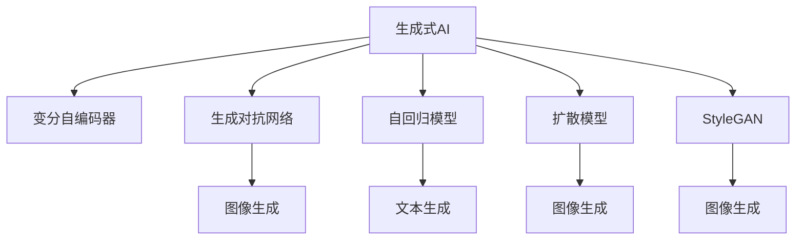
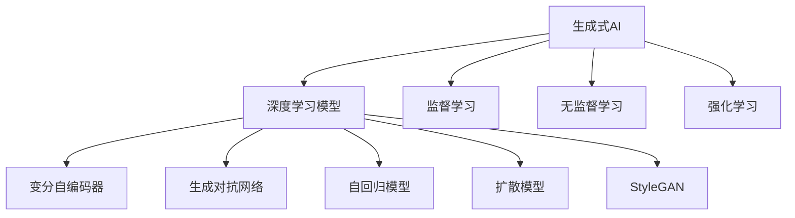
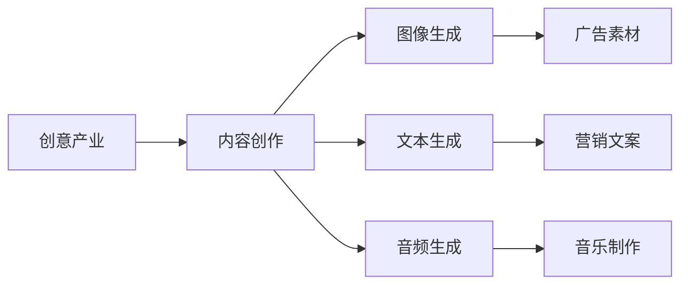
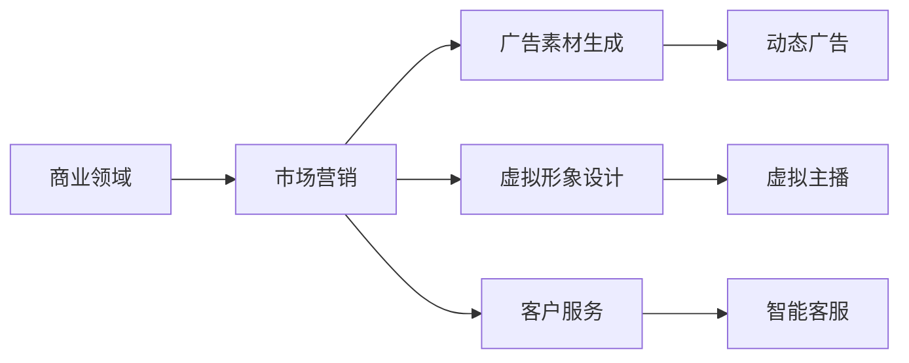
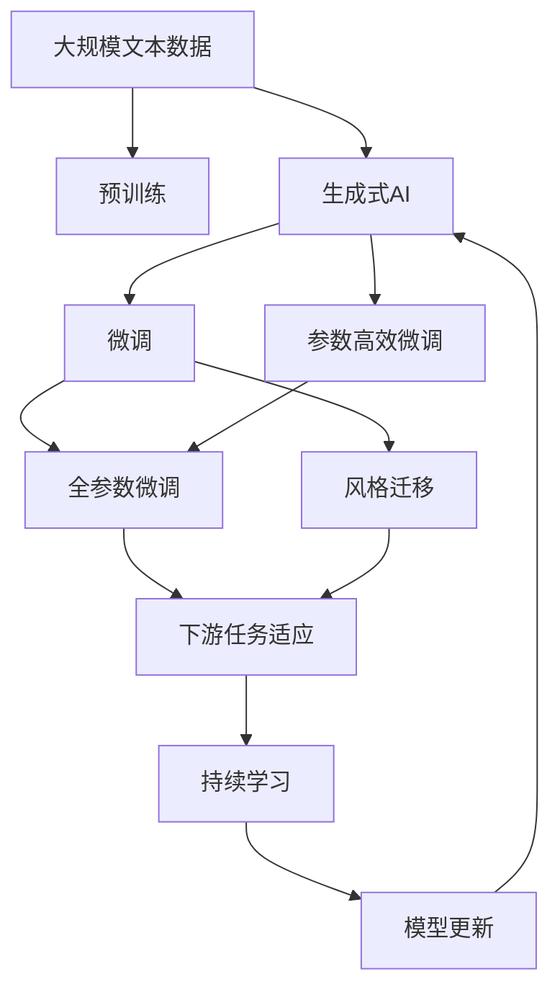

                 

# 生成式AIGC：智能时代的商业新模式

## 1. 背景介绍

### 1.1 问题由来

随着人工智能技术的迅猛发展，生成式人工智能（Generative AI）逐渐成为行业热点。生成式AI是指利用机器学习模型自动生成高质量、创造性的内容，其应用领域包括自然语言处理、图像生成、音频合成等。在智能时代，生成式AI的潜力被不断挖掘，不仅在创意行业带来革命性变革，还在商业领域开辟了新的应用模式和盈利路径。

### 1.2 问题核心关键点

生成式AI的核心在于其生成机制和模型架构。通过大量标注数据进行训练，生成式AI模型能够学习到数据分布的规律，并生成与训练数据高度相似的全新内容。这种方法不仅能产生高质量的文本、图像和音频，还能在特定领域生成具有实用价值的内容，如创意写作、产品设计、市场营销等。

### 1.3 问题研究意义

研究生成式AI的生成机制和应用模式，对推动创意和商业行业的创新具有重要意义：

1. **降低创意成本**：生成式AI能够自动生成内容，大幅减少人力成本和时间成本，使中小企业也能负担得起创意服务。
2. **提高内容质量**：AI生成的内容经过训练，能够达到甚至超越人类创意人员的水平，提升品牌形象和用户体验。
3. **开拓新市场**：生成式AI能够产生多种形式的内容，开辟新的市场领域，如虚拟主播、数字虚拟形象等，为商业公司带来新的盈利点。
4. **提升运营效率**：生成式AI能够自动生成营销素材、设计元素等，提高企业的运营效率和市场响应速度。
5. **辅助决策**：生成式AI能够从大量数据中自动提炼关键信息，辅助企业做出更科学的决策。

## 2. 核心概念与联系

### 2.1 核心概念概述

为更好地理解生成式AI的原理和应用，本节将介绍几个密切相关的核心概念：

- **生成式人工智能（Generative AI）**：通过机器学习模型自动生成高质量内容的AI技术。
- **变分自编码器（Variational Autoencoder, VAE）**：一种生成模型，用于将随机噪声转换为样本分布，能够生成与训练数据类似的新样本。
- **生成对抗网络（Generative Adversarial Networks, GANs）**：通过两个神经网络相互对抗学习，生成逼真的样本。
- **自回归模型（Auto-Regressive Model）**：如GPT系列模型，通过预测当前位置的条件概率来生成序列。
- **扩散模型（Diffusion Model）**：通过逐步将噪声引入样本，将样本推向目标分布，生成高质量图像和文本。
- **StyleGAN**：一种生成对抗网络，能够生成高分辨率、逼真的图像。

这些核心概念之间的逻辑关系可以通过以下Mermaid流程图来展示：



这个流程图展示了大语言模型生成式AI的关键生成模型及其应用领域。

### 2.2 概念间的关系

这些核心概念之间存在着紧密的联系，形成了生成式AI的完整生态系统。下面我通过几个Mermaid流程图来展示这些概念之间的关系。

#### 2.2.1 生成式AI的技术架构



这个流程图展示了大语言模型生成式AI的技术架构。它基于深度学习模型，通过监督学习、无监督学习和强化学习等方式进行训练。

#### 2.2.2 生成式AI与创意产业的联系



这个流程图展示了大语言模型生成式AI在创意产业中的应用，通过生成图像、文本和音频等创意内容，辅助内容创作和营销。

#### 2.2.3 生成式AI在商业领域的应用



这个流程图展示了大语言模型生成式AI在商业领域的应用，通过生成广告素材、虚拟形象和智能客服等应用，提升企业市场表现和客户满意度。

### 2.3 核心概念的整体架构

最后，我们用一个综合的流程图来展示这些核心概念在大语言模型生成式AI微调过程中的整体架构：



这个综合流程图展示了从预训练到生成式AI微调，再到持续学习的完整过程。

## 3. 核心算法原理 & 具体操作步骤

### 3.1 算法原理概述

生成式AI的核心算法包括变分自编码器、生成对抗网络和自回归模型等。这些算法通过训练模型，能够从噪声中生成与训练数据分布相似的新样本，实现高质量内容的生成。

以生成对抗网络（GANs）为例，其核心原理是利用两个神经网络进行对抗学习，一个生成网络（Generator）用于生成样本，一个判别网络（Discriminator）用于判断样本的真实性。生成网络通过最小化生成样本与真实样本之间的差异，生成逼真的样本，而判别网络通过最大化区分真伪样本的能力，提升生成网络的表现。

### 3.2 算法步骤详解

生成式AI的生成过程主要分为以下几个步骤：

1. **模型选择**：根据任务需求选择合适的生成模型，如变分自编码器、生成对抗网络、自回归模型等。
2. **数据准备**：收集并准备大量的标注数据，用于训练生成模型。
3. **模型训练**：通过反向传播算法，最小化生成模型的损失函数，优化模型参数。
4. **样本生成**：利用训练好的生成模型，从随机噪声中生成高质量的新样本。
5. **评估与优化**：通过评估生成样本的质量和多样性，进一步优化模型参数，提升生成效果。

### 3.3 算法优缺点

生成式AI的主要优点包括：

- **高效生成**：能够快速生成大量高质量内容，大幅提升内容创作效率。
- **多样化**：能够生成多种形式的内容，满足不同应用场景的需求。
- **灵活性**：可以通过微调和风格迁移等技术，适应特定任务和风格。

但其也存在一些缺点：

- **过拟合风险**：生成的样本可能出现模式过拟合，质量不稳定。
- **训练成本高**：需要大量标注数据和计算资源进行训练。
- **可解释性不足**：生成的内容难以解释其背后的逻辑和原理。

### 3.4 算法应用领域

生成式AI在多个领域得到了广泛应用，例如：

- **媒体娱乐**：自动生成音乐、电影、游戏等内容，提升创作效率和内容质量。
- **广告营销**：生成动态广告、营销素材，个性化推荐，提升广告效果。
- **虚拟现实**：生成虚拟人物、场景，提升用户体验和沉浸感。
- **智能家居**：生成智能对话、语音指令，提升家居设备的人机交互体验。
- **教育培训**：生成教学材料、模拟考试，辅助教学和学习。

## 4. 数学模型和公式 & 详细讲解 & 举例说明

### 4.1 数学模型构建

生成式AI的数学模型主要基于生成模型的理论框架。以变分自编码器为例，其目标是通过最大化似然函数，学习将随机噪声转换为样本分布的映射函数。

假设原始样本数据为 $x$，生成器的参数为 $\theta$，生成样本为 $z$，变分自编码器的损失函数为：

$$
\mathcal{L}(\theta) = \mathbb{E}_{z\sim q(z|x)}[\log p(x|z;\theta)] + \mathbb{E}_{z\sim p(z)}[\log q(z|x;\theta)]
$$

其中 $q(z|x;\theta)$ 为生成器，$p(x|z;\theta)$ 为解码器，$z$ 为潜在变量，$p(z)$ 为先验分布。

### 4.2 公式推导过程

变分自编码器的训练过程分为两个步骤：

1. **生成器的训练**：通过最大化生成器 $q(z|x;\theta)$ 的似然函数，学习生成样本 $z$。
2. **解码器的训练**：通过最大化解码器 $p(x|z;\theta)$ 的似然函数，学习重建原始样本 $x$。

通过交替训练生成器和解码器，变分自编码器能够生成与训练数据分布相似的新样本。

### 4.3 案例分析与讲解

以生成对抗网络（GANs）为例，其核心思想是通过两个神经网络相互对抗学习，生成逼真的样本。生成网络的目标是最大化生成样本与真实样本之间的相似度，而判别网络的目标是最大化区分真伪样本的能力。

GANs的训练过程可以分为以下步骤：

1. **初始化生成器和判别器**：随机初始化生成器和判别器的参数。
2. **交替训练**：生成器通过生成逼真的样本，最大化与判别器的对抗损失，判别器通过区分真伪样本，最大化判别损失。
3. **优化参数**：通过反向传播算法，优化生成器和判别器的参数，提升生成效果。

## 5. 项目实践：代码实例和详细解释说明

### 5.1 开发环境搭建

在进行生成式AI项目实践前，我们需要准备好开发环境。以下是使用Python进行PyTorch开发的环境配置流程：

1. 安装Anaconda：从官网下载并安装Anaconda，用于创建独立的Python环境。

2. 创建并激活虚拟环境：
```bash
conda create -n pytorch-env python=3.8 
conda activate pytorch-env
```

3. 安装PyTorch：根据CUDA版本，从官网获取对应的安装命令。例如：
```bash
conda install pytorch torchvision torchaudio cudatoolkit=11.1 -c pytorch -c conda-forge
```

4. 安装各类工具包：
```bash
pip install numpy pandas scikit-learn matplotlib tqdm jupyter notebook ipython
```

完成上述步骤后，即可在`pytorch-env`环境中开始生成式AI实践。

### 5.2 源代码详细实现

这里我们以生成式对抗网络（GANs）为例，给出使用PyTorch实现图像生成任务的代码。

首先，定义GAN的生成器和判别器：

```python
import torch
import torch.nn as nn
import torch.optim as optim

class Generator(nn.Module):
    def __init__(self, latent_dim, img_shape):
        super(Generator, self).__init__()
        self.model = nn.Sequential(
            nn.Linear(latent_dim, 256),
            nn.LeakyReLU(0.2, inplace=True),
            nn.Linear(256, 512),
            nn.LeakyReLU(0.2, inplace=True),
            nn.Linear(512, 1024),
            nn.LeakyReLU(0.2, inplace=True),
            nn.Linear(1024, img_shape[0]*img_shape[1]*img_shape[2]),
            nn.Tanh()
        )

    def forward(self, x):
        return self.model(x)

class Discriminator(nn.Module):
    def __init__(self, img_shape):
        super(Discriminator, self).__init__()
        self.model = nn.Sequential(
            nn.Linear(img_shape[0]*img_shape[1]*img_shape[2], 1024),
            nn.LeakyReLU(0.2, inplace=True),
            nn.Linear(1024, 512),
            nn.LeakyReLU(0.2, inplace=True),
            nn.Linear(512, 256),
            nn.LeakyReLU(0.2, inplace=True),
            nn.Linear(256, 1),
            nn.Sigmoid()
        )

    def forward(self, x):
        return self.model(x)

# 使用PyTorch内置的AdversarialLoss函数实现GAN的对抗损失
import torch.nn.functional as F
adversarial_loss = nn.BCELoss()

# 定义优化器
gen_optimizer = optim.Adam(gen.parameters(), lr=0.0002, betas=(0.5, 0.999))
disc_optimizer = optim.Adam(disc.parameters(), lr=0.0002, betas=(0.5, 0.999))
```

接着，定义训练和评估函数：

```python
import os
from torchvision import datasets, transforms
from torch.utils.data import DataLoader

def load_data(batch_size=64, num_workers=4, img_size=64):
    train_loader = DataLoader(
        datasets.CIFAR10(root='data', transform=transforms.ToTensor(), download=True),
        batch_size=batch_size, shuffle=True, num_workers=num_workers)
    return train_loader

def train_gan(model_d, model_g, train_loader, n_epochs=100):
    device = torch.device('cuda' if torch.cuda.is_available() else 'cpu')
    model_d.to(device)
    model_g.to(device)
    for epoch in range(n_epochs):
        for i, (images, _) in enumerate(train_loader):
            real_images = images.to(device)

            real_labels = torch.ones(batch_size, 1).to(device)
            fake_labels = torch.zeros(batch_size, 1).to(device)

            # 训练判别器
            disc_optimizer.zero_grad()
            real_outputs = model_d(real_images)
            fake_outputs = model_d(model_g(torch.randn(batch_size, latent_dim)))
            disc_loss = adversarial_loss(real_outputs, real_labels) + adversarial_loss(fake_outputs, fake_labels)
            disc_loss.backward()
            disc_optimizer.step()

            # 训练生成器
            gen_optimizer.zero_grad()
            fake_outputs = model_g(torch.randn(batch_size, latent_dim))
            disc_loss = adversarial_loss(fake_outputs, real_labels)
            disc_loss.backward()
            gen_optimizer.step()

            if (i+1) % 100 == 0:
                print(f'Epoch [{epoch+1}/{n_epochs}], Step [{i+1}/{len(train_loader)}], Loss_D: {disc_loss:.4f}, Loss_G: {gen_loss:.4f}')

def save_model(model_d, model_g, checkpoint_path):
    state_dict_d = model_d.state_dict()
    state_dict_g = model_g.state_dict()
    torch.save(state_dict_d, os.path.join(checkpoint_path, 'model_d.pth'))
    torch.save(state_dict_g, os.path.join(checkpoint_path, 'model_g.pth'))
```

最后，启动训练流程并在测试集上评估：

```python
checkpoint_path = 'checkpoint'
train_loader = load_data(batch_size=64, num_workers=4, img_size=64)
model_d = Discriminator(img_size).to(device)
model_g = Generator(latent_dim=100, img_shape=img_size).to(device)
train_gan(model_d, model_g, train_loader, n_epochs=100)
save_model(model_d, model_g, checkpoint_path)
```

以上就是使用PyTorch实现生成对抗网络（GANs）的代码实现。可以看到，使用PyTorch可以方便地实现GAN的训练和评估，并且代码简洁易懂。

### 5.3 代码解读与分析

让我们再详细解读一下关键代码的实现细节：

**Generator类**：
- `__init__`方法：定义生成器的网络结构，包含多个线性层和激活函数。
- `forward`方法：定义生成器的前向传播过程，将随机噪声转换为图像。

**Discriminator类**：
- `__init__`方法：定义判别器的网络结构，包含多个线性层和激活函数。
- `forward`方法：定义判别器的前向传播过程，判断图像的真实性。

**AdversarialLoss类**：
- `__init__`方法：定义对抗损失函数，用于训练GAN。
- `forward`方法：定义损失函数的计算过程，将真实标签和判别器输出进行对比，计算损失。

**train_gan函数**：
- `device`变量：设置训练设备，可以是CPU或GPU。
- `load_data`函数：加载训练数据集，进行数据增强和批处理。
- `train_gan`函数：定义训练流程，包含判别器和生成器的交替训练，并在每个epoch输出训练进度。

**save_model函数**：
- `state_dict`函数：保存模型参数，方便后续加载和使用。

可以看到，PyTorch提供了一套灵活、高效的框架，可以方便地实现GAN等生成式AI模型的训练和评估。在实际应用中，我们还可以结合GPU加速、数据增强、模型优化等技术，进一步提升生成效果和模型表现。

## 6. 实际应用场景

### 6.1 智能创意内容生成

生成式AI在创意内容生成领域有着广泛的应用。传统内容创作依赖人类创意人员的经验和技能，而生成式AI能够快速生成高质量的文本、图像和音频等内容，大大提升内容创作的效率和质量。

以文本生成为例，生成式AI能够自动生成新闻报道、小说、诗歌等内容。通过在大量语料上进行训练，生成式AI可以学习到复杂的语言结构和表达方式，生成流畅、有逻辑的文本。

### 6.2 自动化设计

生成式AI在自动化设计领域也取得了显著进展。通过生成高分辨率、逼真的图像，生成式AI可以自动设计产品原型、广告素材、虚拟现实场景等。

以产品设计为例，生成式AI可以自动生成产品的3D模型、渲染图像和动画，帮助设计师快速迭代设计方案。生成式AI还可以根据用户需求，自动生成个性化的设计方案，提升用户体验。

### 6.3 数字虚拟形象

生成式AI可以生成高质量的数字虚拟形象，应用于虚拟现实、增强现实、游戏等领域。通过生成逼真的头像、角色，生成式AI可以构建沉浸式的人机交互环境，提升用户体验和互动性。

以虚拟主播为例，生成式AI可以自动生成虚拟主播的语音和表情，进行自然流畅的对话和互动。生成式AI还可以根据用户反馈，动态调整虚拟主播的表现，提升互动体验。

### 6.4 数字内容创作

生成式AI可以生成高质量的数字内容，应用于媒体娱乐、教育培训等领域。通过生成音乐、电影、游戏等内容，生成式AI可以丰富用户体验，提高娱乐价值。

以音乐创作为例，生成式AI可以自动生成旋律、歌词和编曲，帮助音乐创作者快速创作音乐作品。生成式AI还可以根据用户喜好，自动生成个性化的音乐推荐，提升用户体验。

## 7. 工具和资源推荐

### 7.1 学习资源推荐

为了帮助开发者系统掌握生成式AI的理论基础和实践技巧，这里推荐一些优质的学习资源：

1. 《Generative AI》系列博文：由大模型技术专家撰写，深入浅出地介绍了生成式AI的原理和应用场景。

2. DeepLearning.AI的《深度学习专项课程》：由深度学习领域权威专家Andrew Ng主讲的课程，涵盖深度学习、生成式AI等内容，适合入门学习。

3. Coursera的《生成对抗网络》课程：由NVIDIA的研究员Lars Petersen讲授的课程，详细讲解生成对抗网络的基本原理和实践技巧。

4. ICLR、NeurIPS等顶会论文预印本：人工智能领域最新研究成果的发布平台，包括生成式AI的前沿工作，适合追踪最新的研究方向。

5. GitHub热门项目：在GitHub上Star、Fork数最多的生成式AI相关项目，适合学习和贡献。

通过对这些资源的学习实践，相信你一定能够快速掌握生成式AI的精髓，并用于解决实际的生成任务。

### 7.2 开发工具推荐

高效的开发离不开优秀的工具支持。以下是几款用于生成式AI开发的工具：

1. PyTorch：基于Python的开源深度学习框架，灵活动态的计算图，适合快速迭代研究。

2. TensorFlow：由Google主导开发的开源深度学习框架，生产部署方便，适合大规模工程应用。

3. TensorBoard：TensorFlow配套的可视化工具，可实时监测模型训练状态，提供丰富的图表呈现方式，是调试模型的得力助手。

4. Weights & Biases：模型训练的实验跟踪工具，可以记录和可视化模型训练过程中的各项指标，方便对比和调优。

5. ONNX：模型转换工具，可以将PyTorch、TensorFlow等框架的模型转换为ONNX格式，方便跨平台部署。

合理利用这些工具，可以显著提升生成式AI开发的效率，加快创新迭代的步伐。

### 7.3 相关论文推荐

生成式AI的快速发展离不开学界的持续研究。以下是几篇奠基性的相关论文，推荐阅读：

1. Generative Adversarial Nets（GANs）：提出生成对抗网络的基本框架，开创了生成式AI的新纪元。

2. Variational Autoencoder（VAEs）：提出变分自编码器，通过学习潜在变量，实现数据生成和降维。

3. Attention is All You Need（Transformer）：提出自注意力机制，提升生成模型的表现。

4. GAN Disco：提出GAN的变分形式，通过优化生成器和判别器的联合损失函数，提升生成效果。

5. StyleGAN：提出生成对抗网络的风格迁移方法，能够生成高分辨率、逼真的图像。

这些论文代表了大语言模型生成式AI的发展脉络。通过学习这些前沿成果，可以帮助研究者把握学科前进方向，激发更多的创新灵感。

除上述资源外，还有一些值得关注的前沿资源，帮助开发者紧跟生成式AI技术的最新进展，例如：

1. arXiv论文预印本：人工智能领域最新研究成果的发布平台，包括生成式AI的前沿工作，学习前沿技术的必读资源。

2. 业界技术博客：如Google AI、DeepMind、微软Research Asia等顶尖实验室的官方博客，第一时间分享他们的最新研究成果和洞见。

3. 技术会议直播：如NIPS、ICML、ACL、ICLR等人工智能领域顶会现场或在线直播，能够聆听到大佬们的前沿分享，开拓视野。

4. GitHub热门项目：在GitHub上Star、Fork数最多的生成式AI相关项目，适合学习和贡献。

5. 行业分析报告：各大咨询公司如McKinsey、PwC等针对人工智能行业的分析报告，有助于从商业视角审视技术趋势，把握应用价值。

总之，对于生成式AI的学习和实践，需要开发者保持开放的心态和持续学习的意愿。多关注前沿资讯，多动手实践，多思考总结，必将收获满满的成长收益。

## 8. 总结：未来发展趋势与挑战

### 8.1 总结

本文对生成式AI的生成机制和应用模式进行了全面系统的介绍。首先阐述了生成式AI的研究背景和意义，明确了生成式AI在创意和商业领域的巨大潜力。其次，从原理到实践，详细讲解了生成式AI的数学模型和核心算法，给出了生成式AI任务开发的完整代码实例。同时，本文还广泛探讨了生成式AI在媒体娱乐、自动化设计、数字虚拟形象和数字内容创作等多个行业领域的应用前景，展示了生成式AI技术的发展方向。

通过本文的系统梳理，可以看到，生成式AI技术在创意和商业领域具有广阔的应用前景，通过生成高质量的内容，提升创作效率和用户体验，为智能时代带来新的商业模式。

### 8.2 未来发展趋势

展望未来，生成式AI技术将呈现以下几个发展趋势：

1. **模型的规模化**：随着算力资源的不断提升，生成式AI模型的规模将进一步扩大，生成效果将更加逼真和多样化。

2. **风格迁移的普及**：生成式AI将广泛应用风格迁移技术，提升内容生成的多样性和创新性，满足更多用户的个性化需求。

3. **多模态生成**：生成式AI将融合视觉、听觉、触觉等多种感官数据，生成更加全面、真实的多模态内容。

4. **交互生成**：生成式AI将结合自然语言处理技术，实现人机交互式的实时内容生成，提升用户体验和互动性。

5. **跨领域融合**：生成式AI将与其他AI技术，如强化学习、知识图谱等进行深度融合，提升内容的精准度和实用性。

6. **数据生成与驱动**：生成式AI将结合大数据技术和自动化内容生成，实现内容的自动生产和实时更新，满足用户对内容的多样化需求。

### 8.3 面临的挑战

尽管生成式AI技术已经取得了瞩目成就，但在迈向更加智能化、普适化应用的过程中，它仍面临诸多挑战：

1. **数据依赖性**：生成式AI的效果高度依赖于训练数据的质量和数量，获取高质量数据成为瓶颈。

2. **模型鲁棒性**：生成的样本可能出现模式过拟合，质量不稳定，需要在不同数据分布上进行测试和优化。

3. **计算资源消耗**：生成式AI训练和推理对计算资源的需求较高，需要高效优化算法和硬件配置。

4. **内容版权问题**：生成式AI生成的内容可能涉及版权问题，需要明确版权

