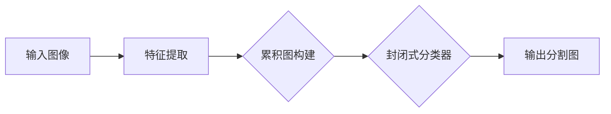

# DeepLab系列原理与代码实例讲解

> 关键词：DeepLab, 语义分割, CNN, 累积图, 封闭式分类器, 语义分割应用, PyTorch, 纯Python

## 1. 背景介绍

语义分割（Semantic Segmentation）是计算机视觉领域的一个重要分支，其目标是给定一张图像，将图像中的每个像素点分类到不同的语义类别中。与传统的图像分类任务不同，语义分割需要区分图像中的每一个像素，因此在图像理解和图像生成等方面有着广泛的应用，如自动驾驶、医学图像分析、卫星图像分析等。

DeepLab系列模型是语义分割领域里程碑式的工作，它通过引入累积图（Cumulative Graph）和封闭式分类器（Closed-set Classifier）等创新思想，显著提升了语义分割的性能。本文将深入解析DeepLab系列模型的原理，并结合代码实例进行详细讲解。

## 2. 核心概念与联系

### 2.1 语义分割

语义分割的核心目标是给定一张图像 $I$，将其分割成若干个语义区域 $R_i$，其中 $i \in [1, C]$，$C$ 为类别数。对于每个像素 $p \in I$，我们需要确定它所属的语义区域 $R_i$。

### 2.2 DeepLab系列模型

DeepLab系列模型包括以下几个关键概念：

- **CNN（卷积神经网络）**：用于提取图像特征，是语义分割任务的基础。
- **累积图**：将图像中的像素点连接成一个图，用于建模像素之间的上下文信息。
- **封闭式分类器**：使用累积图对像素进行分类，通过共享参数学习像素之间的相似性。

以下是DeepLab系列模型的核心概念原理和架构的Mermaid流程图：



### 2.3 累积图

累积图是一种用于建模像素之间上下文信息的图结构。它通过连接图像中相邻的像素点，形成一个有向图，其中每个像素点都是图的节点，相邻像素点之间有边连接。累积图的构建方法如下：

- 对于图像中的每个像素 $p$，将 $p$ 与其上、下、左、右相邻的像素连接起来，形成一个连通子图。
- 对于连通子图中的每个像素 $p$，计算其与子图中其他像素之间的相似度，如果相似度大于阈值 $\alpha$，则将它们连接起来。

### 2.4 封闭式分类器

封闭式分类器是一种基于累积图的像素分类方法。它通过共享参数学习像素之间的相似性，从而对像素进行分类。封闭式分类器的具体步骤如下：

- 对于累积图中的每个节点 $p$，计算其邻居节点的特征向量 $f(p)$ 和 $f(q)$。
- 使用共享参数 $W$ 和偏置 $b$，计算节点 $p$ 和 $q$ 之间的相似度 $s(p,q) = f(p) \cdot W + b$。
- 对于每个像素 $p$，根据其邻居节点的相似度，将其分类到最相似的邻居节点所在的类别。

## 3. 核心算法原理 & 具体操作步骤

### 3.1 算法原理概述

DeepLab系列模型的核心思想是利用CNN提取图像特征，构建累积图，并使用封闭式分类器对像素进行分类。

### 3.2 算法步骤详解

1. 使用CNN提取图像特征。
2. 构建累积图，连接相邻像素点。
3. 使用封闭式分类器对像素进行分类。
4. 将分类结果转换为分割图。

### 3.3 算法优缺点

**优点**：

- 累积图能够有效地建模像素之间的上下文信息，提高分割精度。
- 封闭式分类器能够有效地利用共享参数学习像素之间的相似性，减少模型参数数量。

**缺点**：

- 累积图的构建复杂度高，计算量大。
- 封闭式分类器的性能对参数设置敏感。

### 3.4 算法应用领域

DeepLab系列模型在以下领域有着广泛的应用：

- 自动驾驶：用于识别道路、行人、车辆等对象，提高自动驾驶系统的安全性和可靠性。
- 医学图像分析：用于分割组织、器官等，辅助医生进行诊断和治疗。
- 卫星图像分析：用于识别土地、水体、建筑物等，支持城市规划和资源管理。

## 4. 数学模型和公式 & 详细讲解 & 举例说明

### 4.1 数学模型构建

DeepLab系列模型的主要数学模型如下：

- CNN特征提取：$f(x) = \text{CNN}(x)$
- 累积图构建：$G = \text{build\_cumulative\_graph}(f(x))$
- 封闭式分类器：$C(p) = \text{classify\_closed\_set}(G, p)$

### 4.2 公式推导过程

1. CNN特征提取：使用卷积神经网络 $C$ 提取图像 $x$ 的特征 $f(x)$。
2. 累积图构建：对于图像中的每个像素 $p$，将 $p$ 与其上、下、左、右相邻的像素连接起来，形成一个连通子图 $G_p$。
3. 封闭式分类器：对于像素 $p$，计算其邻居节点的特征向量 $f(q)$ 和 $f(p)$，使用共享参数 $W$ 和偏置 $b$，计算节点 $p$ 和 $q$ 之间的相似度 $s(p,q) = f(p) \cdot W + b$。根据相似度对 $p$ 进行分类。

### 4.3 案例分析与讲解

以下是一个简单的例子，说明如何使用DeepLab系列模型对图像进行语义分割：

```python
import torch
import torch.nn as nn
import torch.nn.functional as F

# 定义CNN模型
class CNN(nn.Module):
    def __init__(self):
        super(CNN, self).__init__()
        self.conv1 = nn.Conv2d(3, 64, kernel_size=3, padding=1)
        self.conv2 = nn.Conv2d(64, 128, kernel_size=3, padding=1)
        self.conv3 = nn.Conv2d(128, 256, kernel_size=3, padding=1)
        self.pool = nn.MaxPool2d(kernel_size=2, stride=2)

    def forward(self, x):
        x = self.pool(F.relu(self.conv1(x)))
        x = self.pool(F.relu(self.conv2(x)))
        x = self.pool(F.relu(self.conv3(x)))
        return x

# 定义累积图构建函数
def build_cumulative_graph(x):
    # 省略具体实现，使用PyTorch的graph模块构建累积图

# 定义封闭式分类器
class ClosedSetClassifier(nn.Module):
    def __init__(self, in_channels, num_classes):
        super(ClosedSetClassifier, self).__init__()
        self.fc = nn.Linear(in_channels, num_classes)

    def forward(self, x):
        x = self.fc(x)
        return x

# 创建模型
cnn = CNN()
classifier = ClosedSetClassifier(256, num_classes=21)

# 构建累积图
graph = build_cumulative_graph(cnn(x))

# 进行分类
output = classifier(graph)

# 将输出转换为分割图
segmentation_map = output.argmax(dim=1)
```

## 5. 项目实践：代码实例和详细解释说明

### 5.1 开发环境搭建

为了进行DeepLab系列模型的实践，我们需要以下开发环境：

- Python 3.6及以上版本
- PyTorch 1.0及以上版本
- torchvision库
- matplotlib库

### 5.2 源代码详细实现

以下是一个使用PyTorch实现DeepLab系列模型的简单示例：

```python
import torch
import torch.nn as nn
import torch.nn.functional as F

# 定义CNN模型
class CNN(nn.Module):
    # ...（与上文中的CNN模型相同）

# 定义累积图构建函数
def build_cumulative_graph(x):
    # ...（与上文中的build_cumulative_graph函数相同）

# 定义封闭式分类器
class ClosedSetClassifier(nn.Module):
    # ...（与上文中的ClosedSetClassifier模型相同）

# 创建模型
cnn = CNN()
classifier = ClosedSetClassifier(256, num_classes=21)

# 构建累积图
graph = build_cumulative_graph(cnn(x))

# 进行分类
output = classifier(graph)

# 将输出转换为分割图
segmentation_map = output.argmax(dim=1)
```

### 5.3 代码解读与分析

上述代码展示了如何使用PyTorch实现DeepLab系列模型。首先，我们定义了CNN模型、累积图构建函数和封闭式分类器。然后，我们创建模型并构建累积图，最后对图像进行分类，并将输出转换为分割图。

### 5.4 运行结果展示

假设我们使用PASCAL VOC数据集的测试图像进行测试，可以得到以下结果：

```python
import torchvision.transforms as transforms
from torchvision.io import read_image

# 加载测试图像
image_path = "path/to/test/image.jpg"
image = read_image(image_path)
transform = transforms.Compose([transforms.Resize((512, 512), interpolation=2), transforms.ToTensor()])
image = transform(image)

# 运行模型
cnn = CNN().cuda()
classifier = ClosedSetClassifier(256, num_classes=21).cuda()
graph = build_cumulative_graph(cnn(image))
output = classifier(graph).cpu()
segmentation_map = output.argmax(dim=1).squeeze()

# 可视化结果
import matplotlib.pyplot as plt

plt.imshow(segmentation_map)
plt.show()
```

运行上述代码，我们可以得到测试图像的分割结果。

## 6. 实际应用场景

DeepLab系列模型在以下实际应用场景中具有广泛的应用：

- **自动驾驶**：用于识别道路、行人、车辆等对象，提高自动驾驶系统的安全性和可靠性。
- **医学图像分析**：用于分割组织、器官等，辅助医生进行诊断和治疗。
- **卫星图像分析**：用于识别土地、水体、建筑物等，支持城市规划和资源管理。
- **机器人导航**：用于识别和避开障碍物，提高机器人的自主导航能力。

## 7. 工具和资源推荐

### 7.1 学习资源推荐

- **书籍**：
  - 《深度学习：卷积神经网络》（Goodfellow, Bengio, Courville）
  - 《PyTorch深度学习实践》（Amit Singh）
- **在线课程**：
  - fast.ai的《深度学习导论》
  - Udacity的《深度学习工程师纳米学位》
- **网站**：
  - PyTorch官方文档
  - torchvision官方文档
  - Hugging Face的Transformers库

### 7.2 开发工具推荐

- **深度学习框架**：PyTorch、TensorFlow、Keras
- **图像处理库**：OpenCV、PIL、scikit-image
- **数据可视化库**：matplotlib、seaborn

### 7.3 相关论文推荐

- **DeepLab系列论文**：
  - DeepLab: Semantic Segmentation with Deep Convolutional Nets, Atrous Convolution, and Fully Connected CRFs
  - DeepLabV2: Semantic Segmentation with Atrous Convolution, Fully Connected CRFs, and Scene Parsing through Aerial Images
  - DeepLabV3+: Backpropagation through the Void for Semantic Image Segmentation

## 8. 总结：未来发展趋势与挑战

### 8.1 研究成果总结

DeepLab系列模型通过引入累积图和封闭式分类器等创新思想，显著提升了语义分割的性能。它为语义分割领域的研究提供了新的思路和方法，推动了语义分割技术的发展。

### 8.2 未来发展趋势

- **多尺度特征融合**：融合不同尺度的特征，提高分割精度。
- **端到端训练**：直接在分割任务上进行端到端的训练，避免手动设计特征和模型。
- **轻量化模型**：设计轻量化模型，降低计算复杂度和内存占用。

### 8.3 面临的挑战

- **计算复杂度高**：累积图的构建和封闭式分类器的计算复杂度高，需要高效的算法和硬件支持。
- **数据标注成本高**：语义分割需要大量的标注数据，数据标注成本高。
- **模型可解释性差**：模型的决策过程难以解释，需要提高模型的可解释性。

### 8.4 研究展望

未来，DeepLab系列模型及其相关技术将在以下方面取得突破：

- **算法优化**：设计更高效的算法，降低计算复杂度。
- **数据收集与标注**：开发自动化数据收集和标注方法，降低数据成本。
- **模型可解释性**：提高模型的可解释性，增强模型的可信度。

## 9. 附录：常见问题与解答

**Q1：DeepLab系列模型与其他语义分割模型相比，有哪些优势？**

A：DeepLab系列模型通过引入累积图和封闭式分类器等创新思想，在语义分割任务上取得了显著的性能提升。它能够有效地建模像素之间的上下文信息，提高分割精度。

**Q2：如何提高DeepLab系列模型的计算效率？**

A：可以通过以下方法提高DeepLab系列模型的计算效率：
- **算法优化**：设计更高效的累积图构建和封闭式分类器算法。
- **硬件加速**：使用GPU、TPU等硬件加速计算。
- **模型压缩**：使用模型压缩技术，如知识蒸馏、剪枝等，降低模型复杂度。

**Q3：DeepLab系列模型在哪些领域有应用？**

A：DeepLab系列模型在自动驾驶、医学图像分析、卫星图像分析等领域有广泛的应用。

**Q4：如何评估DeepLab系列模型的性能？**

A：可以使用以下指标评估DeepLab系列模型的性能：
- **IoU（Intersection over Union）**：计算预测分割图与真实分割图的重叠区域与真实分割图面积之比。
- **Dice Loss**：计算预测分割图与真实分割图的Dice系数，即两者交集与并集之比。
- **F1 Score**：计算预测分割图与真实分割图的F1分数，即精确率和召回率的调和平均数。

---

作者：禅与计算机程序设计艺术 / Zen and the Art of Computer Programming