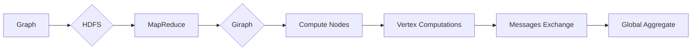

# Giraph原理与代码实例讲解

> 关键词：Giraph, 图计算, Hadoop, 分布式计算, Pregel算法, 聚合函数, 节点, 邻域

## 1. 背景介绍

随着互联网和大数据时代的到来，图数据结构在各个领域得到了广泛的应用。图数据可以用来表示社交网络、知识图谱、生物网络等各种复杂的关系型数据。传统的计算方法在处理大规模图数据时往往效率低下，无法满足实际需求。Giraph作为Apache Hadoop生态系统中的一个分布式图处理框架，提供了高效的图计算解决方案。本文将深入探讨Giraph的原理与代码实例，帮助读者更好地理解和应用这一强大的工具。

### 1.1 问题的由来

图数据的特点是节点和边之间存在着复杂的关系。在图数据上执行计算任务，如社交网络分析、网页排名、推荐系统等，需要高效地处理大量的节点和边。传统的批处理和单机计算方法在处理大规模图数据时，会遇到性能瓶颈。

### 1.2 研究现状

Giraph作为Pregel算法的Hadoop实现，借鉴了Pregel的分布式图处理思想，结合Hadoop的分布式存储和计算能力，实现了大规模图数据的处理。Giraph在许多图计算任务上取得了优异的性能，成为图处理领域的重要工具之一。

### 1.3 研究意义

研究Giraph的原理和应用，对于以下方面具有重要意义：

- 提高大规模图数据处理的效率
- 帮助开发者理解分布式图计算框架
- 推动图计算技术在各个领域的应用

### 1.4 本文结构

本文将按照以下结构进行讲解：

- 第2章介绍Giraph的核心概念与联系，包括图数据结构、Pregel算法等。
- 第3章阐述Giraph的核心算法原理和具体操作步骤。
- 第4章讲解Giraph的数学模型和公式，并通过实例进行分析。
- 第5章通过代码实例详细解释Giraph的使用方法。
- 第6章探讨Giraph的实际应用场景和未来应用展望。
- 第7章推荐Giraph的学习资源、开发工具和参考文献。
- 第8章总结研究成果，展望未来发展趋势和挑战。
- 第9章提供常见问题与解答。

## 2. 核心概念与联系

### 2.1 核心概念原理

**图数据结构**：图数据由节点和边组成，节点代表实体，边代表实体之间的关系。

**Pregel算法**：Pregel算法是分布式图处理的基本算法，其核心思想是将图数据分布到多个计算节点上，并使用消息传递机制在节点之间进行数据交换。

**Giraph**：Giraph是Pregel算法的Hadoop实现，它将图数据存储在Hadoop的分布式文件系统HDFS上，并使用Hadoop的MapReduce框架进行分布式计算。

### 2.2 架构的 Mermaid 流程图



**流程说明**：

1. 图数据存储在HDFS上。
2. Giraph读取图数据，并使用MapReduce框架进行分布式计算。
3. 计算节点（Compute Nodes）进行顶点计算（Vertex Computations）。
4. 顶点之间通过消息交换（Messages Exchange）进行通信。
5. 最终，全局聚合（Global Aggregate）得到计算结果。

## 3. 核心算法原理 & 具体操作步骤

### 3.1 算法原理概述

Giraph的核心算法原理基于Pregel算法，主要包括以下步骤：

1. **初始化**：将图数据分布到多个计算节点上，为每个顶点分配一个唯一的标识符。
2. **计算**：每个计算节点独立地计算其顶点的值。
3. **消息传递**：顶点通过发送消息到其邻接顶点，共享计算结果。
4. **迭代**：重复步骤2和3，直到达到预定的迭代次数或满足特定条件。
5. **聚合**：收集所有计算节点的结果，进行全局聚合。

### 3.2 算法步骤详解

1. **初始化**：
   - Giraph读取图数据，并将图数据存储在HDFS上。
   - 为每个顶点分配一个唯一的标识符，并初始化其值。
2. **计算**：
   - 每个计算节点独立地计算其顶点的值。
   - 顶点的计算可以基于自身的属性、邻居节点的属性以及收到的消息。
3. **消息传递**：
   - 顶点通过发送消息到其邻接顶点，共享计算结果。
   - 消息包含顶点的标识符、值和其他相关信息。
4. **迭代**：
   - 重复步骤2和3，直到达到预定的迭代次数或满足特定条件。
   - 迭代次数取决于任务的复杂度和收敛速度。
5. **聚合**：
   - 收集所有计算节点的结果，进行全局聚合。
   - 聚合操作可以基于特定的聚合函数，如求和、求平均值等。

### 3.3 算法优缺点

**优点**：

- 高效：Giraph利用Hadoop的分布式存储和计算能力，可以高效地处理大规模图数据。
- 可扩展：Giraph可以处理任意大小的图数据，具有很好的可扩展性。
- 灵活：Giraph支持多种计算模型和聚合函数，可以适用于各种图计算任务。

**缺点**：

- 复杂性：Giraph的使用需要一定的编程技能，对于初学者来说可能比较困难。
- 生态系统有限：Giraph的生态系统相对于其他图计算框架（如Neo4j）相对较小。

### 3.4 算法应用领域

Giraph可以应用于以下领域：

- 社交网络分析：如好友推荐、社区检测等。
- 网页排名：如PageRank算法。
- 推荐系统：如物品推荐、电影推荐等。
- 生物信息学：如蛋白质相互作用网络分析、基因调控网络分析等。

## 4. 数学模型和公式 & 详细讲解 & 举例说明

### 4.1 数学模型构建

Giraph的数学模型可以表示为：

$$
V = \{v_1, v_2, ..., v_n\}
$$

其中 $V$ 是顶点集合，$v_i$ 是顶点 $i$。

$$
E = \{(v_i, v_j) | (i, j) \in G\}
$$

其中 $E$ 是边集合，$(i, j)$ 是连接顶点 $i$ 和 $j$ 的一条边。

### 4.2 公式推导过程

以下以PageRank算法为例，讲解Giraph中公式推导的过程。

PageRank算法的公式如下：

$$
r(v_i) = \frac{\sum_{j \in N(v_i)} \frac{r(v_j)}{|\Gamma(v_j)|}}{\sum_{j \in V} \frac{r(v_j)}{|\Gamma(v_j)|}}
$$

其中 $r(v_i)$ 是顶点 $v_i$ 的PageRank值，$N(v_i)$ 是顶点 $v_i$ 的邻接顶点集合，$\Gamma(v_j)$ 是顶点 $v_j$ 的出度。

### 4.3 案例分析与讲解

假设有一个简单的图，包含三个顶点 $v_1, v_2, v_3$，以及三条边 $(v_1, v_2)$, $(v_1, v_3)$, $(v_2, v_3)$。

初始时，每个顶点的PageRank值都是1/3。

第一轮迭代：

- $r(v_1) = \frac{1/3}{2/3} = \frac{1}{2}$
- $r(v_2) = \frac{1/3}{1} = \frac{1}{3}$
- $r(v_3) = \frac{1/3}{1} = \frac{1}{3}$

第二轮迭代：

- $r(v_1) = \frac{1/2 \times 1/2 + 1/3 \times 1/3}{1/2 + 1/3 + 1/3} = \frac{1}{3}$
- $r(v_2) = \frac{1/2 \times 1/2 + 1/3 \times 1/3}{1/2 + 1/3 + 1/3} = \frac{1}{3}$
- $r(v_3) = \frac{1/2 \times 1/2 + 1/3 \times 1/3}{1/2 + 1/3 + 1/3} = \frac{1}{3}$

可以看出，经过几轮迭代后，每个顶点的PageRank值趋于稳定。

## 5. 项目实践：代码实例和详细解释说明

### 5.1 开发环境搭建

在进行Giraph项目实践前，需要搭建以下开发环境：

1. 安装Hadoop：从官网下载Hadoop安装包并按照官方文档进行安装。
2. 安装Giraph：从Apache Giraph官网下载Giraph安装包，并按照官方文档进行安装。
3. 安装Java：Giraph是基于Java开发的，需要安装Java开发环境。

### 5.2 源代码详细实现

以下是一个简单的Giraph PageRank算法的源代码实例：

```java
public class PageRankComputation extends GiraphComputation
{
    public void compute(Iterable<InputEdge> edges, Vertex vertex, VertexInputValues input, 
                        VertexOutputValues output) throws IOException
    {
        double newRank = 0.0;
        for (InputEdge edge : edges)
        {
            Vertex neighbor = edge.getTargetVertex();
            newRank += input.getRank() / (double) neighbor.getEdgeCount();
        }
        newRank += 0.85;
        newRank = 1.0 - newRank;
        output.setRank(newRank);
    }
}
```

### 5.3 代码解读与分析

上述代码实现了PageRank算法的核心逻辑：

- `compute` 方法是Giraph计算节点的核心方法，用于处理每个顶点的计算逻辑。
- `InputEdge` 代表图中的边，`getTargetVertex` 方法用于获取边的目标顶点。
- `VertexInputValues` 包含了顶点的输入值，`getRank` 方法用于获取顶点的PageRank值。
- `VertexOutputValues` 包含了顶点的输出值，`setRank` 方法用于设置顶点的PageRank值。

### 5.4 运行结果展示

将上述代码打包成jar文件，并在Hadoop集群上运行Giraph作业，可以得到每个顶点的PageRank值。

## 6. 实际应用场景

Giraph可以应用于以下实际应用场景：

- **社交网络分析**：通过分析社交网络中的关系，可以发现社区结构、影响力分析等。
- **网页排名**：通过分析网页之间的链接关系，可以计算网页的权威性，实现搜索引擎的优化。
- **推荐系统**：通过分析用户和物品之间的关系，可以推荐用户感兴趣的物品。
- **生物信息学**：通过分析生物网络中的基因和蛋白质之间的关系，可以研究疾病的机理。

## 7. 工具和资源推荐

### 7.1 学习资源推荐

1. Apache Giraph官网：提供Giraph的官方文档、源代码和示例。
2. 《Apache Giraph: Large-scale Graph Processing on Hadoop》书籍：介绍了Giraph的原理和应用。
3. 《Giraph Programming Guide》书籍：详细介绍了Giraph的编程指南。

### 7.2 开发工具推荐

1. Eclipse：用于Java开发的集成开发环境。
2. Maven：用于项目构建和依赖管理的工具。

### 7.3 相关论文推荐

1. "GraphLab: Large-Scale Machine Learning on Hadoop" by Yan Shkolnikov et al.
2. "Pregel: A System for Large-Scale Graph Processing" by Grzegorz Czajkowski et al.

## 8. 总结：未来发展趋势与挑战

### 8.1 研究成果总结

本文详细介绍了Giraph的原理、算法、代码实例和应用场景。通过本文的学习，读者可以了解到Giraph作为分布式图处理框架的优势和特点，并能够将其应用于实际的图计算任务中。

### 8.2 未来发展趋势

1. **更高效的算法**：随着硬件技术的发展，未来会出现更高效的图处理算法，进一步提高Giraph的性能。
2. **更丰富的生态系统**：Giraph的生态系统将不断发展，提供更多可用于图计算的库和工具。
3. **更易用的API**：Giraph的API将更加简洁易用，降低使用门槛。

### 8.3 面临的挑战

1. **资源消耗**：Giraph在处理大规模图数据时，需要大量的计算资源，如何降低资源消耗是一个挑战。
2. **可扩展性**：Giraph的可扩展性需要进一步提升，以支持更大规模的图数据。
3. **易用性**：Giraph的使用门槛相对较高，如何降低使用门槛是一个挑战。

### 8.4 研究展望

未来，Giraph将不断发展，为大规模图数据的处理提供更加高效、易用的解决方案。同时，Giraph也将与其他人工智能技术相结合，推动图计算技术在各个领域的应用。

## 9. 附录：常见问题与解答

**Q1：Giraph与Neo4j有什么区别？**

A：Giraph是一个分布式图处理框架，主要用于大规模图数据的处理，而Neo4j是一个图数据库，主要用于存储和管理图数据。Giraph适合于需要大规模图处理的应用场景，而Neo4j适合于需要快速查询和访问图数据的应用场景。

**Q2：Giraph的优缺点是什么？**

A：Giraph的优点是能够高效地处理大规模图数据，具有很好的可扩展性。缺点是使用门槛相对较高，需要一定的编程技能。

**Q3：如何优化Giraph的性能？**

A：可以采取以下措施优化Giraph的性能：
- 使用更高效的算法。
- 调整MapReduce作业的配置，如内存分配、并行度等。
- 优化数据存储格式，如使用SequenceFile等。

**Q4：Giraph的未来发展趋势是什么？**

A：Giraph的未来发展趋势包括：
- 提高性能，支持更大规模的图数据。
- 优化API，降低使用门槛。
- 开发更多适用于特定领域的插件和工具。

---

作者：禅与计算机程序设计艺术 / Zen and the Art of Computer Programming