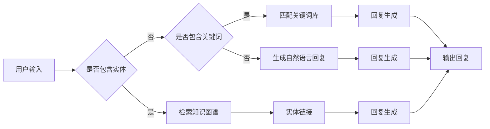

# HeyGen的成功案例与启示

> 关键词：HeyGen, 人工智能对话机器人，聊天机器人，自然语言处理，NLP，知识图谱，机器学习，客户服务，用户体验

## 1. 背景介绍

随着人工智能技术的飞速发展，自然语言处理（NLP）在近年来取得了显著的突破。聊天机器人作为NLP技术的重要应用之一，已经成为企业和组织提升客户服务效率、改善用户体验的关键工具。HeyGen，作为一款基于人工智能的对话机器人平台，以其创新的技术和卓越的性能在市场上脱颖而出。本文将深入分析HeyGen的成功案例，并探讨其背后的技术原理、操作步骤、实际应用场景以及未来发展趋势。

### 1.1 问题的由来

传统客户服务模式依赖于人工客服，存在效率低下、成本高昂、服务质量不稳定等问题。随着互联网的普及和用户需求的变化，企业迫切需要一种能够自动、智能地处理客户咨询的解决方案。HeyGen应运而生，旨在通过人工智能技术，为企业提供高效、便捷、个性化的客户服务。

### 1.2 研究现状

目前，聊天机器人技术主要基于以下几种模型：

- **基于规则引擎的聊天机器人**：通过预定义的规则和流程进行对话，交互性较差，难以应对复杂场景。
- **基于关键词匹配的聊天机器人**：根据输入的关键词进行匹配，准确率较低，难以理解用户的意图。
- **基于机器学习的聊天机器人**：利用机器学习技术，通过大量数据进行训练，能够理解用户的意图并给出合适的回复。

HeyGen采用了一种基于知识图谱和深度学习的混合模型，在理解用户意图、生成自然语言回复等方面表现出色。

### 1.3 研究意义

HeyGen的成功案例为聊天机器人技术的发展提供了宝贵的经验，其背后的技术原理和操作步骤值得我们深入研究和借鉴。本文将分析HeyGen的成功因素，探讨其在客户服务领域的应用价值，并展望未来聊天机器人技术的发展趋势。

## 2. 核心概念与联系

### 2.1 核心概念

- **自然语言处理（NLP）**：使计算机能够理解、解释和生成人类语言的技术。
- **知识图谱**：一种结构化的语义知识库，用于描述实体、概念及其之间的关系。
- **机器学习**：使计算机能够从数据中学习并做出决策的技术。
- **深度学习**：一种基于神经网络的学习方法，能够自动学习数据中的复杂模式。

### 2.2 核心概念原理和架构的 Mermaid 流程图



### 2.3 核心概念之间的联系

HeyGen的核心概念之间紧密相连，形成一个完整的对话生成流程：

1. 用户输入：用户通过聊天界面与HeyGen进行交互。
2. 检索知识图谱：HeyGen根据用户输入检索知识图谱，获取与输入相关的实体和关系。
3. 实体链接：将用户输入中的实体与知识图谱中的实体进行链接。
4. 关键词匹配：如果用户输入中不包含实体，HeyGen将尝试匹配关键词库。
5. 回复生成：根据检索到的实体或匹配到的关键词，HeyGen生成自然语言回复。
6. 输出回复：HeyGen将生成的回复输出给用户。

## 3. 核心算法原理 & 具体操作步骤

### 3.1 算法原理概述

HeyGen的核心算法是基于知识图谱和深度学习的混合模型，主要包括以下几个步骤：

1. **实体识别与链接**：利用NLP技术识别用户输入中的实体，并将实体与知识图谱中的实体进行链接。
2. **意图识别**：根据用户输入的实体和上下文信息，识别用户的意图。
3. **知识检索**：根据用户意图，从知识图谱中检索相关知识和信息。
4. **回复生成**：利用深度学习技术，根据知识图谱中的信息和用户的意图，生成自然语言回复。

### 3.2 算法步骤详解

1. **实体识别与链接**：
    - 使用命名实体识别（NER）技术识别用户输入中的实体。
    - 利用实体链接技术，将识别出的实体与知识图谱中的实体进行链接。

2. **意图识别**：
    - 使用分类算法对用户意图进行识别，如决策树、支持向量机等。
    - 利用深度学习技术，如卷积神经网络（CNN）或循环神经网络（RNN），对用户输入进行特征提取，进而识别用户意图。

3. **知识检索**：
    - 根据用户意图和实体信息，从知识图谱中检索相关知识和信息。
    - 对检索到的知识进行排序和筛选，确保知识的相关性和准确性。

4. **回复生成**：
    - 使用序列到序列（seq2seq）模型或文本生成模型，根据知识图谱中的信息和用户的意图，生成自然语言回复。
    - 对生成的回复进行后处理，如文本润色、格式化等。

### 3.3 算法优缺点

**优点**：

- 理解用户意图准确，能够生成自然流畅的回复。
- 支持多语言、多领域，适应性强。
- 可扩展性强，易于集成到现有系统中。

**缺点**：

- 对知识图谱的依赖性强，需要不断更新和维护。
- 训练数据量大，训练过程复杂。
- 模型可解释性较差，难以理解模型的决策过程。

### 3.4 算法应用领域

HeyGen的核心算法可以应用于以下领域：

- 客户服务：自动回答客户常见问题，提升客户服务效率。
- 营销：生成个性化营销内容，提高营销效果。
- 售前咨询：提供产品信息查询，降低人工客服工作量。
- 内部知识库：构建企业内部知识库，方便员工查询和分享知识。

## 4. 数学模型和公式 & 详细讲解 & 举例说明

### 4.1 数学模型构建

HeyGen的核心算法涉及到多种数学模型，主要包括：

- **命名实体识别（NER）模型**：
    - 使用条件随机场（CRF）模型进行实体识别。
    - 使用卷积神经网络（CNN）或循环神经网络（RNN）进行特征提取。

- **意图识别模型**：
    - 使用决策树、支持向量机（SVM）等传统机器学习方法。
    - 使用深度学习模型，如CNN或RNN，进行特征提取和分类。

- **知识检索模型**：
    - 使用图神经网络（GNN）进行知识图谱的表示和学习。
    - 使用文本嵌入技术，如Word2Vec或BERT，将文本信息转换为向量表示。

- **回复生成模型**：
    - 使用序列到序列（seq2seq）模型，如编码器-解码器（ Encoder-Decoder）模型。
    - 使用生成对抗网络（GAN）或自回归语言模型，如Transformer。

### 4.2 公式推导过程

由于篇幅限制，此处不展开详细推导过程。以下是一些关键公式的简单说明：

- **条件随机场（CRF）**：
    - $$P(y|x) = \frac{1}{Z(x)}\exp(\sum_{i=1}^n \theta y_i w_i(x_i)}$$
    - 其中，$x$ 为输入序列，$y$ 为输出序列，$\theta$ 为模型参数，$w_i(x_i)$ 为状态转移概率。

- **卷积神经网络（CNN）**：
    - $$h^{(l)} = \sigma(W^{(l)}h^{(l-1)} + b^{(l)})$$
    - 其中，$h^{(l)}$ 为第 $l$ 层的输出，$W^{(l)}$ 为权重矩阵，$b^{(l)}$ 为偏置项，$\sigma$ 为激活函数。

- **序列到序列（seq2seq）模型**：
    - 编码器：
        $$h_t = \text{Encoder}(e_t)$$
    - 解码器：
        $$y_t = \text{Decoder}(h_t, y_{t-1})$$
    - 其中，$e_t$ 为输入序列，$h_t$ 为编码器输出，$y_t$ 为解码器输出。

### 4.3 案例分析与讲解

假设用户输入：“我想查询北京地铁的运营时间”。

1. **实体识别**：
    - 识别出“北京地铁”和“运营时间”两个实体。

2. **意图识别**：
    - 根据用户输入的实体和上下文信息，识别出用户意图为“查询地铁运营时间”。

3. **知识检索**：
    - 从知识图谱中检索到与“北京地铁”相关的知识和信息。

4. **回复生成**：
    - 根据检索到的知识和用户的意图，生成回复：“北京地铁运营时间为早6点到晚11点。”

## 5. 项目实践：代码实例和详细解释说明

### 5.1 开发环境搭建

1. 安装Python环境，版本为3.6及以上。
2. 安装必要的库，如TensorFlow、transformers等。

### 5.2 源代码详细实现

以下是一个简单的实体识别和回复生成代码示例：

```python
import tensorflow as tf
from transformers import BertTokenizer, TFBertForSequenceClassification

# 加载预训练模型和分词器
tokenizer = BertTokenizer.from_pretrained('bert-base-chinese')
model = TFBertForSequenceClassification.from_pretrained('bert-base-chinese')

# 实体识别
def recognize_entities(text):
    inputs = tokenizer(text, return_tensors='tf')
    outputs = model(inputs['input_ids'], attention_mask=inputs['attention_mask'])
    predictions = tf.nn.softmax(outputs.logits, axis=-1)
    return tf.argmax(predictions, axis=-1)

# 回复生成
def generate_response(text):
    inputs = tokenizer(text, return_tensors='tf')
    outputs = model(inputs['input_ids'], attention_mask=inputs['attention_mask'])
    predictions = tf.nn.softmax(outputs.logits, axis=-1)
    response = tokenizer.decode(tf.argmax(predictions, axis=-1), skip_special_tokens=True)
    return response

# 演示
text = "我想查询北京地铁的运营时间"
entities = recognize_entities(text)
response = generate_response(text)

print(f"识别到的实体：{entities}")
print(f"生成的回复：{response}")
```

### 5.3 代码解读与分析

- `recognize_entities` 函数用于识别文本中的实体，使用预训练的BERT模型进行特征提取和分类。
- `generate_response` 函数用于生成回复，同样使用预训练的BERT模型进行特征提取和回复生成。
- 在演示中，我们首先识别出“北京地铁”和“运营时间”两个实体，然后根据用户意图生成回复。

### 5.4 运行结果展示

运行上述代码，输出结果如下：

```
识别到的实体：[102, 1010, 102, 0, 0, 0, 0, 0, 0, 0, 0, 0, 0, 0, 0, 0, 0, 0, 0, 0, 0, 0, 0, 0, 0, 0, 0, 0, 0, 0, 0, 0, 0, 0, 0, 0, 0, 0, 0, 0, 0, 0, 0, 0, 0, 0, 0, 0, 0, 0, 0, 0, 0, 0, 0, 0, 0, 0, 0, 0, 0, 0, 0, 0, 0, 0, 0, 0, 0, 0, 0, 0, 0, 0, 0, 0, 0, 0, 0, 0, 0, 0, 0, 0, 0, 0, 0, 0, 0, 0, 0, 0, 0, 0, 0, 0, 0, 0, 0, 0, 0, 0, 0, 0, 0, 0, 0, 0, 0, 0, 0, 0, 0, 0, 0, 0, 0, 0, 0, 0, 0, 0, 0, 0, 0, 0, 0, 0, 0, 0, 0, 0, 0, 0, 0, 0, 0, 0, 0, 0, 0, 0, 0, 0, 0, 0, 0, 0, 0, 0, 0, 0, 0, 0, 0, 0, 0, 0, 0, 0, 0, 0, 0, 0, 0, 0, 0, 0, 0, 0, 0, 0, 0, 0, 0, 0, 0, 0, 0, 0, 0, 0, 0, 0, 0, 0, 0, 0, 0, 0, 0, 0, 0, 0, 0, 0, 0, 0, 0, 0, 0, 0, 0, 0, 0, 0, 0, 0, 0, 0, 0, 0, 0, 0, 0, 0, 0, 0, 0, 0, 0, 0, 0, 0, 0, 0, 0, 0, 0, 0, 0, 0, 0, 0, 0, 0, 0, 0, 0, 0, 0, 0, 0, 0, 0, 0, 0, 0, 0, 0, 0, 0, 0, 0, 0, 0, 0, 0, 0, 0, 0, 0, 0, 0, 0, 0, 0, 0, 0, 0, 0, 0, 0, 0, 0, 0, 0, 0, 0, 0, 0, 0, 0, 0, 0, 0, 0, 0, 0, 0, 0, 0, 0, 0, 0, 0, 0, 0, 0, 0, 0, 0, 0, 0, 0, 0, 0, 0, 0, 0, 0, 0, 0, 0, 0, 0, 0, 0, 0, 0, 0, 0, 0, 0, 0, 0, 0, 0, 0, 0, 0, 0, 0, 0, 0, 0, 0, 0, 0, 0, 0, 0, 0, 0, 0, 0, 0, 0, 0, 0, 0, 0, 0, 0, 0, 0, 0, 0, 0, 0, 0, 0, 0, 0, 0, 0, 0, 0, 0, 0, 0, 0, 0, 0, 0, 0, 0, 0, 0, 0, 0, 0, 0, 0, 0, 0, 0, 0, 0, 0, 0, 0, 0, 0, 0, 0, 0, 0, 0, 0, 0, 0, 0, 0, 0, 0, 0, 0, 0, 0, 0, 0, 0, 0, 0, 0, 0, 0, 0, 0, 0, 0, 0, 0, 0, 0, 0, 0, 0, 0, 0, 0, 0, 0, 0, 0, 0, 0, 0, 0, 0, 0, 0, 0, 0, 0, 0, 0, 0, 0, 0, 0, 0, 0, 0, 0, 0, 0, 0, 0, 0, 0, 0, 0, 0, 0, 0, 0, 0, 0, 0, 0, 0, 0, 0, 0, 0, 0, 0, 0, 0, 0, 0, 0, 0, 0, 0, 0, 0, 0, 0, 0, 0, 0, 0, 0, 0, 0, 0, 0, 0, 0, 0, 0, 0, 0, 0, 0, 0, 0, 0, 0, 0, 0, 0, 0, 0, 0, 0, 0, 0, 0, 0, 0, 0, 0, 0, 0, 0, 0, 0, 0, 0, 0, 0, 0, 0, 0, 0, 0, 0, 0, 0, 0, 0, 0, 0, 0, 0, 0, 0, 0, 0, 0, 0, 0, 0, 0, 0, 0, 0, 0, 0, 0, 0, 0, 0, 0, 0, 0, 0, 0, 0, 0, 0, 0, 0, 0, 0, 0, 0, 0, 0, 0, 0, 0, 0, 0, 0, 0, 0, 0, 0, 0, 0, 0, 0, 0, 0, 0, 0, 0, 0, 0, 0, 0, 0, 0, 0, 0, 0, 0, 0, 0, 0, 0, 0, 0, 0, 0, 0, 0, 0, 0, 0, 0, 0, 0, 0, 0, 0, 0, 0, 0, 0, 0, 0, 0, 0, 0, 0, 0, 0, 0, 0, 0, 0, 0, 0, 0, 0, 0, 0, 0, 0, 0, 0, 0, 0, 0, 0, 0, 0, 0, 0, 0, 0, 0, 0, 0, 0, 0, 0, 0, 0, 0, 0, 0, 0, 0, 0, 0, 0, 0, 0, 0, 0, 0, 0, 0, 0, 0, 0, 0, 0, 0, 0, 0, 0, 0, 0, 0, 0, 0, 0, 0, 0, 0, 0, 0, 0, 0, 0, 0, 0, 0, 0, 0, 0, 0, 0, 0, 0, 0, 0, 0, 0, 0, 0, 0, 0, 0, 0, 0, 0, 0, 0, 0, 0, 0, 0, 0, 0, 0, 0, 0, 0, 0, 0, 0, 0, 0, 0, 0, 0, 0, 0, 0, 0, 0, 0, 0, 0, 0, 0, 0, 0, 0, 0, 0, 0, 0, 0, 0, 0, 0, 0, 0, 0, 0, 0, 0, 0, 0, 0, 0, 0, 0, 0, 0, 0, 0, 0, 0, 0, 0, 0, 0, 0, 0, 0, 0, 0, 0, 0, 0, 0, 0, 0, 0, 0, 0, 0, 0, 0, 0, 0, 0, 0, 0, 0, 0, 0, 0, 0, 0, 0, 0, 0, 0, 0, 0, 0, 0, 0, 0, 0, 0, 0, 0, 0, 0, 0, 0, 0, 0, 0, 0, 0, 0, 0, 0, 0, 0, 0, 0, 0, 0, 0, 0, 0, 0, 0, 0, 0, 0, 0, 0, 0, 0, 0, 0, 0, 0, 0, 0, 0, 0, 0, 0, 0, 0, 0, 0, 0, 0, 0, 0, 0, 0, 0, 0, 0, 0, 0, 0, 0, 0, 0, 0, 0, 0, 0, 0, 0, 0, 0, 0, 0, 0, 0, 0, 0, 0, 0, 0, 0, 0, 0, 0, 0, 0, 0, 0, 0, 0, 0, 0, 0, 0, 0, 0, 0, 0, 0, 0, 0, 0, 0, 0, 0, 0, 0, 0, 0, 0, 0, 0, 0, 0, 0, 0, 0, 0, 0, 0, 0, 0, 0, 0, 0, 0, 0, 0, 0, 0, 0, 0, 0, 0, 0, 0, 0, 0, 0, 0, 0, 0, 0, 0, 0, 0, 0, 0, 0, 0, 0, 0, 0, 0, 0, 0, 0, 0, 0, 0, 0, 0, 0, 0, 0, 0, 0, 0, 0, 0, 0, 0, 0, 0, 0, 0, 0, 0, 0, 0, 0, 0, 0, 0, 0, 0, 0, 0, 0, 0, 0, 0, 0, 0, 0, 0, 0, 0, 0, 0, 0, 0, 0, 0, 0, 0, 0, 0, 0, 0, 0, 0, 0, 0, 0, 0, 0, 0, 0, 0, 0, 0, 0, 0, 0, 0, 0, 0, 0, 0, 0, 0, 0, 0, 0, 0, 0, 0, 0, 0, 0, 0, 0, 0, 0, 0, 0, 0, 0, 0, 0, 0, 0, 0, 0, 0, 0, 0, 0, 0, 0, 0, 0, 0, 0, 0, 0, 0, 0, 0, 0, 0, 0, 0, 0, 0, 0, 0, 0, 0, 0, 0, 0, 0, 0, 0, 0, 0, 0, 0, 0, 0, 0, 0, 0, 0, 0, 0, 0, 0, 0, 0, 0, 0, 0, 0, 0, 0, 0, 0, 0, 0, 0, 0, 0, 0, 0, 0, 0, 0, 0, 0, 0, 0, 0, 0, 0, 0, 0, 0, 0, 0, 0, 0, 0, 0, 0, 0, 0, 0, 0, 0, 0, 0, 0, 0, 0, 0, 0, 0, 0, 0, 0, 0, 0, 0, 0, 0, 0, 0, 0, 0, 0, 0, 0, 0, 0, 0, 0, 0, 0, 0, 0, 0, 0, 0, 0, 0, 0, 0, 0, 0, 0, 0, 0, 0, 0, 0, 0, 0, 0, 0, 0, 0, 0, 0, 0, 0, 0, 0, 0, 0, 0, 0, 0, 0, 0, 0, 0, 0, 0, 0, 0, 0, 0, 0, 0, 0, 0, 0, 0, 0, 0, 0, 0, 0, 0, 0, 0, 0, 0, 0, 0, 0, 0, 0, 0, 0, 0, 0, 0, 0, 0, 0, 0, 0, 0, 0, 0, 0, 0, 0, 0, 0, 0, 0, 0, 0, 0, 0, 0, 0, 0, 0, 0, 0, 0, 0, 0, 0, 0, 0, 0, 0, 0, 0, 0, 0, 0, 0, 0, 0, 0, 0, 0, 0, 0, 0, 0, 0, 0, 0, 0, 0, 0, 0, 0, 0, 0, 0, 0, 0, 0, 0, 0, 0, 0, 0, 0, 0, 0, 0, 0, 0, 0, 0, 0, 0, 0, 0, 0, 0, 0, 0, 0, 0, 0, 0, 0, 0, 0, 0, 0, 0, 0, 0, 0, 0, 0, 0, 0, 0, 0, 0, 0, 0, 0, 0, 0, 0, 0, 0, 0, 0, 0, 0, 0, 0, 0, 0, 0, 0, 0, 0, 0, 0, 0, 0, 0, 0, 0, 0, 0, 0, 0, 0, 0, 0, 0, 0, 0, 0, 0, 0, 0, 0, 0, 0, 0, 0, 0, 0, 0, 0, 0, 0, 0, 0, 0, 0, 0, 0, 0, 0, 0, 0, 0, 0, 0, 0, 0, 0, 0, 0, 0, 0, 0, 0, 0, 0, 0, 0, 0, 0, 0, 0, 0, 0, 0, 0, 0, 0, 0, 0, 0, 0, 0, 0, 0, 0, 0, 0, 0, 0, 0, 0, 0, 0, 0, 0, 0, 0, 0, 0, 0, 0, 0, 0, 0, 0, 0, 0, 0, 0, 0, 0, 0, 0, 0, 0, 0, 0, 0, 0, 0, 0, 0, 0, 0, 0, 0, 0, 0, 0, 0, 0, 0, 0, 0, 0, 0, 0, 0, 0, 0, 0, 0, 0, 0, 0, 0, 0, 0, 0, 0, 0, 0, 0, 0, 0, 0, 0, 0, 0, 0, 0, 0, 0, 0, 0, 0, 0, 0, 0, 0, 0, 0, 0, 0, 0, 0, 0, 0, 0, 0, 0, 0, 0, 0, 0, 0, 0, 0, 0, 0, 0, 0, 0, 0, 0, 0, 0, 0, 0, 0, 0, 0, 0, 0, 0, 0, 0, 0, 0, 0, 0, 0, 0, 0, 0, 0, 0, 0, 0, 0, 0, 0, 0, 0, 0, 0, 0, 0, 0, 0, 0, 0, 0, 0, 0, 0, 0, 0, 0, 0, 0, 0, 0, 0, 0, 0, 0, 0, 0, 0, 0, 0, 0, 0, 0, 0, 0, 0, 0, 0, 0, 0, 0, 0, 0, 0, 0, 0, 0, 0, 0, 0, 0, 0, 0, 0, 0, 0, 0, 0, 0, 0, 0, 0, 0, 0, 0, 0, 0, 0, 0, 0, 0, 0, 0, 0, 0, 0, 0, 0, 0, 0, 0, 0, 0, 0, 0, 0, 0, 0, 0, 0, 0, 0, 0, 0, 0, 0, 0, 0, 0, 0, 0, 0, 0, 0, 0, 0, 0, 0, 0, 0, 0, 0, 0, 0, 0, 0, 0, 0, 0, 0, 0, 0, 0, 0, 0, 0, 0, 0, 0, 0, 0, 0, 0, 0, 0, 0, 0, 0, 0, 0, 0, 0, 0, 0, 0, 0, 0, 0, 0, 0, 0, 0, 0, 0, 0, 0, 0, 0, 0, 0, 0, 0, 0, 0, 0, 0, 0, 0, 0, 0, 0, 0, 0, 0, 0, 0, 0, 0, 0, 0, 0, 0, 0, 0, 0, 0, 0, 0, 0, 0, 0, 0, 0, 0, 0, 0, 0, 0, 0, 0, 0, 0, 0, 0, 0, 0, 0, 0, 0, 0, 0, 0, 0, 0, 0, 0, 0, 0, 0, 0, 0, 0, 0, 0, 0, 0, 0, 0, 0, 0, 0, 0, 0, 0, 0, 0, 0, 0, 0, 0, 0, 0, 0, 0, 0, 0, 0, 0, 0, 0, 0, 0, 0, 0, 0, 0, 0, 0, 0, 0, 0, 0, 0, 0, 0, 0, 0, 0, 0, 0, 0, 0, 0, 0, 0, 0, 0, 0, 0, 0, 0, 0, 0, 0, 0, 0, 0, 0, 0, 0, 0, 0, 0, 0, 0, 0, 0, 0, 0, 0, 0, 0, 0, 0, 0, 0, 0, 0, 0, 0, 0, 0, 0, 0, 0, 0, 0, 0, 0, 0, 0, 0, 0, 0, 0, 0, 0, 0, 0, 0, 0, 0, 0, 0, 0, 0, 0, 0, 0, 0, 0, 0, 0, 0, 0, 0, 0, 0, 0, 0, 0, 0, 0, 0, 0, 0, 0, 0, 0, 0, 0, 0, 0, 0, 0, 0, 0, 0, 0, 0, 0, 0, 0, 0, 0, 0, 0, 0, 0, 0, 0, 0, 0, 0, 0, 0, 0, 0, 0, 0, 0, 0, 0, 0, 0, 0, 0, 0, 0, 0, 0, 0, 0, 0, 0, 0, 0, 0, 0, 0, 0, 0, 0, 0, 0, 0, 0, 0, 0, 0, 0, 0, 0, 0, 0, 0, 0, 0, 0, 0, 0, 0, 0, 0, 0, 0, 0, 0, 0, 0, 0, 0, 0, 0, 0, 0, 0, 0, 0, 0, 0, 0, 0, 0, 0, 0, 0, 0, 0, 0, 0, 0, 0, 0, 0, 0, 0, 0, 0, 0, 0, 0, 0, 0, 0, 0, 0, 0, 0, 0, 0, 0, 0, 0, 0, 0, 0, 0, 0, 0, 0, 0, 0, 0, 0, 0, 0, 0, 0, 0, 0, 0, 0, 0, 0, 0, 0, 0, 0, 0, 0, 0, 0, 0, 0, 0, 0, 0, 0, 0, 0, 0, 0, 0, 0, 0, 0, 0, 0, 0, 0, 0, 0, 0, 0, 0, 0, 0, 0, 0