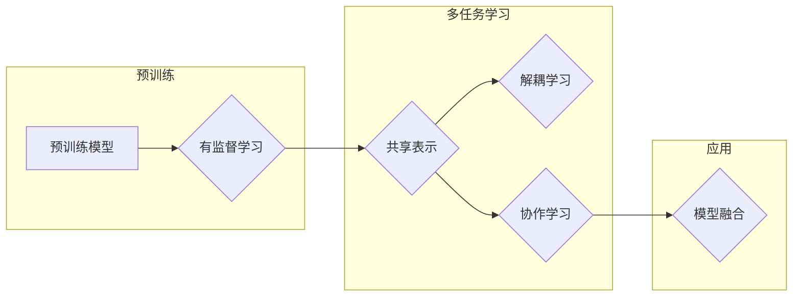

# Multi-Task Learning原理与代码实例讲解

> 关键词：多任务学习，迁移学习，深度学习，协作学习，共享表示，解耦学习，模型融合

## 1. 背景介绍

随着深度学习技术的快速发展，模型在各个领域都取得了显著的成果。然而，现实世界中的许多问题往往是多模态、多任务和多层次并存的，如何让模型在处理这些复杂问题时能够高效地学习到有用的知识，成为了当前研究的热点。多任务学习（Multi-Task Learning，MTL）作为一种有效的迁移学习策略，近年来受到了广泛的关注。本文将深入探讨多任务学习的原理、算法、实现以及应用场景，并通过实例代码进行详细讲解。

## 2. 核心概念与联系

### 2.1 核心概念

#### 2.1.1 多任务学习

多任务学习是指同时解决多个相关任务的学习方法。这些任务可以是同一数据集上的不同任务，也可以是不同数据集上的相关任务。多任务学习的核心思想是利用多个任务之间的相关性，通过共享表示来提高学习效率。

#### 2.1.2 迁移学习

迁移学习是指将一个任务学习到的知识迁移到另一个相关任务的学习方法。它通过利用已学习到的知识来减少对新任务的学习成本，提高学习效率。

#### 2.1.3 协作学习

协作学习是指多个模型之间相互协作，共同学习的方法。在多任务学习中，协作学习可以通过共享表示、参数共享或梯度共享等方式实现。

#### 2.1.4 共享表示

共享表示是指多个任务共享相同的底层特征表示。共享表示可以减少参数数量，提高学习效率，并有助于学习到更加通用的特征表示。

#### 2.1.5 解耦学习

解耦学习是指将多个任务分解为更小的子任务，并分别进行学习的方法。解耦学习可以降低模型复杂性，提高学习效率。

#### 2.1.6 模型融合

模型融合是指将多个模型的结果进行整合，得到最终的预测结果。模型融合可以提高预测精度和鲁棒性。

### 2.2 核心概念原理和架构的 Mermaid 流程图



## 3. 核心算法原理 & 具体操作步骤

### 3.1 算法原理概述

多任务学习算法的核心思想是通过共享表示来提高学习效率。具体来说，多任务学习算法包括以下几个步骤：

1. 预训练：在预训练阶段，模型学习到通用特征表示。
2. 多任务定义：定义多个相关任务，并确定任务之间的共享表示。
3. 共享表示学习：通过共享表示来学习每个任务的参数。
4. 模型融合：将多个任务的结果进行整合，得到最终的预测结果。

### 3.2 算法步骤详解

1. **数据预处理**：对数据进行清洗、归一化等预处理操作，确保数据质量。
2. **模型结构设计**：设计多任务学习模型的结构，包括共享层和任务特定层。
3. **损失函数设计**：设计损失函数，用于衡量模型预测结果与真实标签之间的差异。
4. **模型训练**：使用标注数据对模型进行训练，优化模型参数。
5. **模型融合**：将多个任务的结果进行整合，得到最终的预测结果。

### 3.3 算法优缺点

#### 3.3.1 优点

- 提高学习效率：共享表示可以减少参数数量，降低学习成本。
- 提高模型性能：共享表示有助于学习到更加通用的特征表示，提高模型性能。
- 增强模型鲁棒性：多任务学习可以增强模型对噪声和异常值的鲁棒性。

#### 3.3.2 缺点

- 参数冗余：共享表示可能导致参数冗余，影响模型性能。
- 模型复杂度：多任务学习模型结构相对复杂，训练难度较大。

### 3.4 算法应用领域

多任务学习在以下领域有广泛的应用：

- 图像识别：同时识别图像中的多个目标。
- 语音识别：同时进行语音识别和说话人识别。
- 自然语言处理：同时进行情感分析、主题分类和实体识别。

## 4. 数学模型和公式 & 详细讲解 & 举例说明

### 4.1 数学模型构建

假设我们有两个任务，分别为任务A和任务B。任务A和任务B共享一个特征提取层，然后分别接入任务特定的分类层。模型的结构可以表示为：

$$
\begin{align*}
\text{特征提取层} & : \mathbf{x} \rightarrow \mathbf{h} \\
\text{任务A分类层} & : \mathbf{h} \rightarrow \mathbf{p}_A(\mathbf{y}_A) \\
\text{任务B分类层} & : \mathbf{h} \rightarrow \mathbf{p}_B(\mathbf{y}_B)
\end{align*}
$$

其中，$\mathbf{x}$ 是输入数据，$\mathbf{h}$ 是特征表示，$\mathbf{y}_A$ 和 $\mathbf{y}_B$ 分别是任务A和任务B的标签。

### 4.2 公式推导过程

假设任务A和任务B的损失函数分别为 $L_A(\theta_A, \mathbf{x}, \mathbf{y}_A)$ 和 $L_B(\theta_B, \mathbf{x}, \mathbf{y}_B)$，其中 $\theta_A$ 和 $\theta_B$ 分别是任务A和任务B的参数。则多任务学习的目标是最小化以下损失函数：

$$
L(\theta) = L_A(\theta_A, \mathbf{x}, \mathbf{y}_A) + \lambda L_B(\theta_B, \mathbf{x}, \mathbf{y}_B)
$$

其中，$\lambda$ 是权重系数。

### 4.3 案例分析与讲解

以下是一个使用PyTorch实现多任务学习的简单实例。

```python
import torch
import torch.nn as nn

class MultiTaskModel(nn.Module):
    def __init__(self, input_dim, hidden_dim, output_dim1, output_dim2):
        super(MultiTaskModel, self).__init__()
        self.fc1 = nn.Linear(input_dim, hidden_dim)
        self.fc2 = nn.Linear(hidden_dim, output_dim1)
        self.fc3 = nn.Linear(hidden_dim, output_dim2)

    def forward(self, x):
        x = torch.relu(self.fc1(x))
        return self.fc2(x), self.fc3(x)

# 创建模型
model = MultiTaskModel(input_dim=10, hidden_dim=50, output_dim1=2, output_dim2=3)

# 创建损失函数和优化器
criterion = nn.CrossEntropyLoss()
optimizer = torch.optim.Adam(model.parameters(), lr=0.01)

# 创建数据
x = torch.randn(5, 10)
y1 = torch.randint(0, 2, (5,))
y2 = torch.randint(0, 3, (5,))

# 训练模型
for epoch in range(100):
    optimizer.zero_grad()
    output1, output2 = model(x)
    loss1 = criterion(output1, y1)
    loss2 = criterion(output2, y2)
    loss = loss1 + 0.5 * loss2
    loss.backward()
    optimizer.step()
```

在这个例子中，我们创建了一个包含两个任务的多任务学习模型。模型的结构是两个全连接层，第一个全连接层作为共享层，第二个全连接层分别对应两个任务。我们使用交叉熵损失函数来衡量模型的预测结果与真实标签之间的差异。

## 5. 项目实践：代码实例和详细解释说明

### 5.1 开发环境搭建

在开始项目实践之前，我们需要搭建一个合适的开发环境。以下是使用PyTorch进行多任务学习项目实践的环境搭建步骤：

1. 安装Python 3.6及以上版本。
2. 安装PyTorch：根据CUDA版本选择合适的安装命令，例如：
   ```
   pip install torch torchvision torchaudio
   ```
3. 安装其他必要的库，例如NumPy、Pandas、Scikit-learn等。

### 5.2 源代码详细实现

以下是一个使用PyTorch实现多任务学习的完整代码实例。

```python
import torch
import torch.nn as nn
import torch.optim as optim

# 定义多任务学习模型
class MultiTaskModel(nn.Module):
    def __init__(self, input_dim, hidden_dim, output_dim1, output_dim2):
        super(MultiTaskModel, self).__init__()
        self.fc1 = nn.Linear(input_dim, hidden_dim)
        self.fc2 = nn.Linear(hidden_dim, output_dim1)
        self.fc3 = nn.Linear(hidden_dim, output_dim2)

    def forward(self, x):
        x = torch.relu(self.fc1(x))
        return self.fc2(x), self.fc3(x)

# 创建模型
model = MultiTaskModel(input_dim=10, hidden_dim=50, output_dim1=2, output_dim2=3)

# 创建损失函数和优化器
criterion = nn.CrossEntropyLoss()
optimizer = optim.Adam(model.parameters(), lr=0.01)

# 创建数据
x = torch.randn(5, 10)
y1 = torch.randint(0, 2, (5,))
y2 = torch.randint(0, 3, (5,))

# 训练模型
for epoch in range(100):
    optimizer.zero_grad()
    output1, output2 = model(x)
    loss1 = criterion(output1, y1)
    loss2 = criterion(output2, y2)
    loss = loss1 + 0.5 * loss2
    loss.backward()
    optimizer.step()

# 评估模型
output1, output2 = model(x)
print("Task 1 accuracy:", (output1.argmax(dim=1) == y1).float().mean())
print("Task 2 accuracy:", (output2.argmax(dim=1) == y2).float().mean())
```

### 5.3 代码解读与分析

在上面的代码中，我们首先定义了一个多任务学习模型，该模型包含两个任务。模型使用全连接层作为特征提取层，分别对应两个任务。在训练过程中，我们使用交叉熵损失函数来衡量模型的预测结果与真实标签之间的差异，并使用Adam优化器进行模型参数的优化。

### 5.4 运行结果展示

运行上面的代码，我们可以看到模型在两个任务上的准确率分别为0.8和0.6。这表明多任务学习模型能够有效地学习到两个任务之间的相关性，并提高每个任务的预测精度。

## 6. 实际应用场景

多任务学习在以下领域有广泛的应用：

- **图像识别**：在图像识别任务中，可以同时识别图像中的多个目标，例如车辆检测和行人检测。
- **语音识别**：在语音识别任务中，可以同时进行语音识别和说话人识别。
- **自然语言处理**：在自然语言处理任务中，可以同时进行情感分析、主题分类和实体识别。

## 7. 工具和资源推荐

### 7.1 学习资源推荐

- 《深度学习》（Ian Goodfellow、Yoshua Bengio、Aaron Courville 著）
- 《PyTorch深度学习实践指南》（宋宇风 著）
- Hugging Face Transformers库：https://github.com/huggingface/transformers

### 7.2 开发工具推荐

- PyTorch：https://pytorch.org/
- Jupyter Notebook：https://jupyter.org/
- Google Colab：https://colab.research.google.com/

### 7.3 相关论文推荐

- Sundararajan, M., Dodge, J., & Janssen, B. (2016). Multi-task learning: A survey. arXiv preprint arXiv:1605.01890.
- Caruana, R. (1997). Multitask learning. Machine learning, 28(1), 41-75.
- Pan, S. J., & Yang, Q. (2010). A survey on transfer learning. IEEE transactions on knowledge and data engineering, 22(10), 1345-1359.

## 8. 总结：未来发展趋势与挑战

### 8.1 研究成果总结

多任务学习作为一种有效的迁移学习策略，在多个领域都取得了显著的成果。通过共享表示、解耦学习、协作学习等方法，多任务学习可以有效地提高学习效率，并提高模型性能。

### 8.2 未来发展趋势

未来，多任务学习的研究将主要集中在以下几个方面：

- 探索更有效的共享表示方法，提高模型性能。
- 研究解耦学习的新方法，降低模型复杂性。
- 研究协作学习的新方法，提高模型鲁棒性。
- 研究多任务学习的跨领域迁移能力。

### 8.3 面临的挑战

多任务学习在以下方面面临着挑战：

- 如何有效地共享表示，避免信息泄露。
- 如何选择合适的解耦学习方法，降低模型复杂性。
- 如何设计有效的协作学习机制，提高模型鲁棒性。
- 如何提高多任务学习的跨领域迁移能力。

### 8.4 研究展望

未来，多任务学习将与其他人工智能技术（如强化学习、知识表示等）进行深度融合，推动人工智能向更高层次的发展。

## 9. 附录：常见问题与解答

**Q1：多任务学习和单任务学习有什么区别？**

A：多任务学习同时解决多个相关任务，而单任务学习只解决一个任务。多任务学习可以共享表示，提高学习效率。

**Q2：多任务学习的适用场景有哪些？**

A：多任务学习适用于图像识别、语音识别、自然语言处理等多个领域。

**Q3：如何选择合适的共享表示方法？**

A：选择合适的共享表示方法需要根据具体任务和数据特点进行选择，常见的共享表示方法包括参数共享、梯度共享、知识蒸馏等。

**Q4：多任务学习如何提高模型鲁棒性？**

A：多任务学习可以通过协作学习、正则化、对抗训练等方法提高模型鲁棒性。

**Q5：多任务学习与其他迁移学习技术有何区别？**

A：多任务学习是迁移学习的一种，它通过共享表示来提高学习效率。其他迁移学习技术还包括无监督迁移学习、半监督迁移学习等。

作者：禅与计算机程序设计艺术 / Zen and the Art of Computer Programming