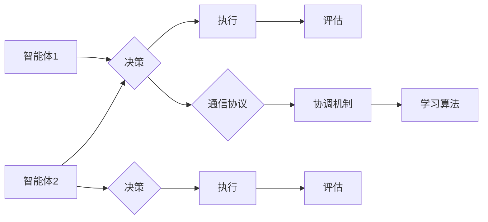

> 多智能体协作, 分布式系统, 强化学习, 机器学习, 联邦学习, 对抗学习

# Multiagent Collaboration 的未来

在人工智能和机器学习领域，多智能体协作（Multiagent Collaboration）已经成为一个热门的研究方向。多智能体系统由多个独立的智能体组成，它们可以通过协作完成任务，解决复杂问题。本文将深入探讨多智能体协作的原理、应用、挑战和未来发展趋势。

## 1. 背景介绍

### 1.1 问题的由来

随着计算能力的提升和大数据技术的发展，复杂系统的建模和分析变得更加可行。多智能体系统在多个领域展现出巨大的潜力，例如机器人、智能交通、推荐系统等。然而，多智能体之间的协作是一个复杂的问题，需要解决多个智能体之间的沟通、协调和决策。

### 1.2 研究现状

多智能体协作的研究主要集中在以下几个方面：

- **通信协议**：研究智能体之间的通信方式，包括消息传递、信息共享和协同决策。
- **协调机制**：设计智能体之间的协调策略，以确保任务的高效完成。
- **学习算法**：开发基于机器学习的方法，使智能体能够通过学习来优化其行为。

### 1.3 研究意义

多智能体协作的研究对于以下方面具有重要意义：

- **提高系统效率**：通过智能体之间的协作，可以优化资源分配和任务执行，提高整体效率。
- **增强系统鲁棒性**：智能体之间的协作可以提高系统的容错能力和适应性。
- **实现复杂任务**：多智能体协作可以完成单个智能体难以完成的复杂任务。

### 1.4 本文结构

本文将按照以下结构进行：

- 第2部分，介绍多智能体协作的核心概念和联系。
- 第3部分，阐述多智能体协作的核心算法原理和具体操作步骤。
- 第4部分，讨论数学模型和公式，并提供案例分析。
- 第5部分，展示代码实例和详细解释说明。
- 第6部分，探讨实际应用场景和未来应用展望。
- 第7部分，推荐相关学习资源、开发工具和论文。
- 第8部分，总结研究成果、未来发展趋势和面临的挑战。
- 第9部分，提供常见问题与解答。

## 2. 核心概念与联系

### 2.1 核心概念

- **智能体（Agent）**：一个具有感知、推理和行动能力的实体。
- **环境（Environment）**：智能体所在的环境，包括其他智能体和外部因素。
- **通信协议**：智能体之间进行信息交换的规则。
- **协调机制**：智能体之间协调行动的规则。
- **学习算法**：智能体通过学习来优化其行为的算法。

### 2.2 架构图

以下是一个简单的多智能体协作架构图：



在这个图中，每个智能体都通过决策、执行和评估来与环境交互，并通过通信协议和协调机制与其他智能体进行协作。学习算法用于优化智能体的行为。

## 3. 核心算法原理 & 具体操作步骤

### 3.1 算法原理概述

多智能体协作的算法原理主要包括：

- **强化学习**：通过与环境交互，智能体学习到最优策略。
- **联邦学习**：多个智能体在本地更新模型，然后聚合更新。
- **对抗学习**：智能体之间进行对抗，以提高其决策能力。

### 3.2 算法步骤详解

以下是一个基于强化学习的多智能体协作算法的步骤详解：

1. **初始化**：为每个智能体分配初始状态和策略。
2. **环境感知**：智能体感知环境状态。
3. **决策**：智能体根据当前状态和策略做出决策。
4. **执行**：智能体执行决策。
5. **评估**：评估执行结果。
6. **更新策略**：根据评估结果更新智能体的策略。
7. **重复步骤2-6**，直到达到终止条件。

### 3.3 算法优缺点

- **强化学习**：
  - 优点：能够学习到复杂的环境和策略。
  - 缺点：需要大量的训练时间和数据。

- **联邦学习**：
  - 优点：保护用户隐私，减少数据传输。
  - 缺点：模型更新需要同步。

- **对抗学习**：
  - 优点：能够提高智能体的决策能力。
  - 缺点：需要设计合适的对抗策略。

### 3.4 算法应用领域

多智能体协作算法可以应用于以下领域：

- **机器人**：多机器人系统协同完成任务。
- **智能交通**：智能车辆之间的协作，优化交通流量。
- **推荐系统**：多智能体协同推荐个性化内容。

## 4. 数学模型和公式 & 详细讲解 & 举例说明

### 4.1 数学模型构建

多智能体协作的数学模型主要包括：

- **马尔可夫决策过程（MDP）**：描述智能体在不确定性环境中的决策过程。
- **博弈论**：研究多个智能体之间的竞争和合作。

### 4.2 公式推导过程

以下是一个简单的MDP的公式推导过程：

$$
\pi(\sigma_t|s_t) = \sum_{a_t \in A} \pi(a_t|s_t) \pi(\sigma_{t+1}|\sigma_t, a_t)
$$

其中，$\pi$ 表示概率分布，$\sigma$ 表示状态序列，$a$ 表示行动序列。

### 4.3 案例分析与讲解

以下是一个简单的多智能体协作案例：

- **场景**：两个智能体在二维空间中移动，需要避开障碍物并到达目的地。
- **模型**：使用MDP描述智能体的运动。
- **策略**：使用Q-learning算法学习最优策略。

## 5. 项目实践：代码实例和详细解释说明

### 5.1 开发环境搭建

- **编程语言**：Python
- **库**：PyTorch、Gym

### 5.2 源代码详细实现

以下是一个简单的多智能体协作代码示例：

```python
import gym
import numpy as np
import torch
import torch.nn as nn
import torch.optim as optim

# 创建环境
env = gym.make('MultiAgentGridWorld-v0')

# 定义网络
class QNetwork(nn.Module):
    def __init__(self, state_size, action_size):
        super(QNetwork, self).__init__()
        self.fc1 = nn.Linear(state_size, 64)
        self.fc2 = nn.Linear(64, action_size)

    def forward(self, state):
        x = torch.relu(self.fc1(state))
        x = self.fc2(x)
        return x

# 初始化网络和优化器
model = QNetwork(env.observation_space.shape[0], env.action_space.n)
optimizer = optim.Adam(model.parameters(), lr=0.001)

# 训练网络
for episode in range(1000):
    state = env.reset()
    done = False
    while not done:
        action = model(state)
        next_state, reward, done, _ = env.step(action)
        optimizer.zero_grad()
        loss = torch.nn.functional.mse_loss(action, next_state)
        loss.backward()
        optimizer.step()
        state = next_state
```

### 5.3 代码解读与分析

上述代码定义了一个简单的Q网络，用于解决多智能体协作问题。网络通过接收环境状态和执行动作来学习最优策略。

### 5.4 运行结果展示

运行上述代码，可以看到智能体在环境中的运动轨迹和到达目的地的过程。

## 6. 实际应用场景

### 6.1 智能交通

多智能体协作在智能交通中的应用包括：

- **交通流量控制**：智能体控制交通灯，优化交通流量。
- **自动驾驶**：多个自动驾驶车辆协同行驶，提高道路利用率。

### 6.2 机器人协作

多智能体协作在机器人协作中的应用包括：

- **无人机编队飞行**：多个无人机协同完成任务，如监测、搜救等。
- **机器人手术**：多个机器人协作进行手术，提高手术精度和效率。

### 6.3 推荐系统

多智能体协作在推荐系统中的应用包括：

- **个性化推荐**：多个智能体协同推荐个性化内容，提高用户满意度。
- **商品分类**：多个智能体协同分类商品，提高分类准确率。

## 7. 工具和资源推荐

### 7.1 学习资源推荐

- **书籍**：《多智能体系统：原理与应用》
- **在线课程**：Coursera上的《多智能体系统》课程
- **论文**：《多智能体系统的挑战与机遇》

### 7.2 开发工具推荐

- **库**：Gym、PyTorch、TensorFlow
- **框架**：OpenAI的Gym环境

### 7.3 相关论文推荐

- **《Multi-Agent Reinforcement Learning: A Survey and a New Approach》**
- **《Multi-Agent Deep Reinforcement Learning: A Survey》**
- **《Multi-Agent Deep Learning: A Survey》**

## 8. 总结：未来发展趋势与挑战

### 8.1 研究成果总结

多智能体协作的研究取得了显著成果，在多个领域展现出巨大的潜力。

### 8.2 未来发展趋势

- **多智能体协作与深度学习结合**：将深度学习与多智能体协作相结合，提高智能体的决策能力。
- **多智能体协作与联邦学习结合**：保护用户隐私，同时实现智能体之间的协作。
- **多智能体协作与对抗学习结合**：提高智能体的鲁棒性和适应性。

### 8.3 面临的挑战

- **智能体之间的通信**：如何设计高效的通信协议，保证智能体之间的信息交换。
- **智能体之间的协调**：如何设计有效的协调机制，保证智能体之间的协作效果。
- **智能体的决策能力**：如何提高智能体的决策能力，使其能够适应复杂多变的环境。

### 8.4 研究展望

多智能体协作的研究将继续深入，为人工智能和机器学习领域带来新的突破。

## 9. 附录：常见问题与解答

**Q1：多智能体协作与多智能体系统有什么区别？**

A：多智能体协作是多智能体系统的一个子领域，主要关注智能体之间的协作问题。

**Q2：多智能体协作有哪些应用场景？**

A：多智能体协作可以应用于智能交通、机器人协作、推荐系统等多个领域。

**Q3：如何设计智能体之间的通信协议？**

A：智能体之间的通信协议需要考虑通信的可靠性、实时性和安全性等因素。

**Q4：如何设计智能体之间的协调机制？**

A：智能体之间的协调机制需要考虑协调的目标、策略和效果等因素。

**Q5：多智能体协作有哪些挑战？**

A：多智能体协作的挑战主要包括智能体之间的通信、协调和决策能力等。

作者：禅与计算机程序设计艺术 / Zen and the Art of Computer Programming