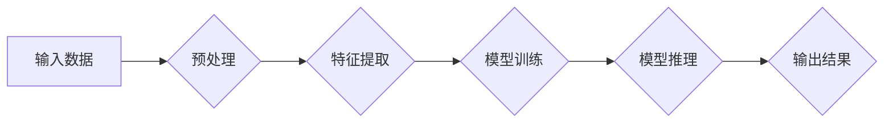

# NVIDIA与AI算力的未来

> 关键词：NVIDIA, AI算力, GPU, CUDA, Deep Learning, Tensor Core, DNN, HPC, 人工智能, 计算架构

## 1. 背景介绍

随着人工智能技术的飞速发展，AI算力成为了推动整个行业进步的关键因素。NVIDIA作为GPU领域的领导者，其产品和技术在AI算力领域扮演着举足轻重的角色。本文将深入探讨NVIDIA在AI算力领域的贡献、技术演进以及未来趋势。

### 1.1 问题的由来

在传统的计算架构下，CPU是处理各种计算任务的主要设备。然而，随着深度学习等AI应用的兴起，CPU的计算能力逐渐成为瓶颈。GPU因其强大的并行处理能力，成为了AI计算的理想选择。NVIDIA作为GPU的先驱，其CUDA技术和Tensor Core架构在AI算力领域具有革命性的意义。

### 1.2 研究现状

NVIDIA的GPU产品线涵盖了从消费级到数据中心级的各个层次，为AI算力提供了全面的支持。其CUDA技术为开发人员提供了丰富的并行计算资源，而Tensor Core架构则将深度学习推理和训练的效率提升到了新的高度。

### 1.3 研究意义

NVIDIA在AI算力领域的贡献，不仅推动了深度学习等AI技术的快速发展，也为整个计算架构的演进提供了新的方向。本文将探讨NVIDIA在AI算力领域的贡献，分析其技术演进，并展望未来发展趋势。

### 1.4 本文结构

本文将分为以下几个部分：
- 第二部分：介绍AI算力领域的核心概念和NVIDIA的技术架构。
- 第三部分：详细阐述NVIDIA在AI算力领域的核心算法原理和具体操作步骤。
- 第四部分：分析NVIDIA的数学模型和公式，并结合实际案例进行讲解。
- 第五部分：提供NVIDIA产品在AI算力领域的应用实例。
- 第六部分：探讨NVIDIA技术在未来AI算力发展中的应用前景。
- 第七部分：推荐相关学习资源和开发工具。
- 第八部分：总结NVIDIA在AI算力领域的贡献和未来发展趋势。
- 第九部分：提供附录，解答常见问题。

## 2. 核心概念与联系

### 2.1 AI算力

AI算力是指用于支持人工智能应用所需的计算能力。它包括硬件设备、软件框架和算法等各个方面。在AI算力领域，GPU因其强大的并行计算能力，成为了推动AI技术发展的关键。

### 2.2 NVIDIA技术架构

NVIDIA的技术架构主要包括GPU、CUDA、Tensor Core等核心组件。

- **GPU**：NVIDIA的GPU产品线涵盖了从消费级到数据中心级的各个层次，为AI算力提供了全面的支持。
- **CUDA**：CUDA是NVIDIA开发的并行计算平台和编程模型，为开发人员提供了丰富的并行计算资源。
- **Tensor Core**：Tensor Core是NVIDIA最新一代的GPU架构，专门针对深度学习等AI应用进行优化。

### 2.3 Mermaid流程图

以下是AI算力领域核心概念的Mermaid流程图：



## 3. 核心算法原理 & 具体操作步骤

### 3.1 算法原理概述

NVIDIA的AI算力解决方案主要基于以下核心算法原理：

- **深度学习**：通过多层神经网络对数据进行学习，从而实现各种AI任务。
- **并行计算**：利用GPU的并行计算能力，加速深度学习模型的训练和推理过程。
- **优化算法**：通过优化算法提高训练和推理的效率。

### 3.2 算法步骤详解

以下是NVIDIA AI算力解决方案的具体操作步骤：

1. **数据预处理**：对输入数据进行清洗、转换等操作，以便于模型训练。
2. **特征提取**：从预处理后的数据中提取出有用的特征。
3. **模型训练**：使用深度学习算法训练模型，并使用GPU加速计算过程。
4. **模型推理**：使用训练好的模型对新的数据进行预测。
5. **输出结果**：将模型的预测结果输出到用户界面。

### 3.3 算法优缺点

NVIDIA的AI算力解决方案具有以下优点：

- **强大的并行计算能力**：GPU的并行计算能力可以显著提高训练和推理的效率。
- **丰富的软件生态**：NVIDIA提供了丰富的软件开发工具和库，方便开发人员快速开发AI应用。
- **广泛的行业应用**：NVIDIA的AI算力解决方案在各个行业都有广泛的应用。

同时，也存在一些局限性：

- **成本较高**：高端GPU的成本较高，可能不适合一些预算有限的项目。
- **功耗较高**：GPU的功耗较高，可能需要专门的散热系统。

### 3.4 算法应用领域

NVIDIA的AI算力解决方案在以下领域得到了广泛应用：

- **计算机视觉**：人脸识别、目标检测、图像分类等。
- **语音识别**：语音识别、语音合成、语音翻译等。
- **自然语言处理**：机器翻译、文本生成、情感分析等。
- **推荐系统**：推荐商品、推荐电影等。

## 4. 数学模型和公式 & 详细讲解 & 举例说明

### 4.1 数学模型构建

在AI算力领域，常见的数学模型包括：

- **神经网络**：由多层神经元组成，通过学习数据特征进行预测。
- **损失函数**：用于衡量模型预测结果与真实值之间的差异。
- **优化算法**：用于最小化损失函数，从而优化模型参数。

### 4.2 公式推导过程

以下是一个简单的神经网络模型及其损失函数的推导过程：

假设我们有以下神经网络模型：

$$
y = f(W \cdot x + b)
$$

其中 $y$ 为输出，$x$ 为输入，$W$ 为权重矩阵，$b$ 为偏置向量，$f$ 为激活函数。

损失函数为均方误差（MSE）：

$$
L(y, \hat{y}) = \frac{1}{2} \sum_{i=1}^{N}(y_i - \hat{y}_i)^2
$$

其中 $y_i$ 为真实值，$\hat{y}_i$ 为预测值，$N$ 为样本数量。

### 4.3 案例分析与讲解

以下是一个使用Tensor Core架构进行深度学习模型训练的案例：

```python
import torch
import torch.nn as nn
import torch.optim as optim

# 定义神经网络模型
class Net(nn.Module):
    def __init__(self):
        super(Net, self).__init__()
        self.conv1 = nn.Conv2d(1, 20, 5)
        self.conv2 = nn.Conv2d(20, 50, 5)
        self.fc1 = nn.Linear(4*4*50, 500)
        self.fc2 = nn.Linear(500, 10)

    def forward(self, x):
        x = torch.relu(self.conv1(x))
        x = torch.max_pool2d(x, 2, 2)
        x = torch.relu(self.conv2(x))
        x = torch.max_pool2d(x, 2, 2)
        x = x.view(-1, 4*4*50)
        x = torch.relu(self.fc1(x))
        x = self.fc2(x)
        return x

# 初始化模型、损失函数和优化器
model = Net()
criterion = nn.CrossEntropyLoss()
optimizer = optim.SGD(model.parameters(), lr=0.001)

# 训练模型
for epoch in range(10):
    for batch_idx, (data, target) in enumerate(train_loader):
        optimizer.zero_grad()
        output = model(data)
        loss = criterion(output, target)
        loss.backward()
        optimizer.step()
        if batch_idx % 100 == 0:
            print('Train Epoch: {} [{}/{} ({:.0f}%)]\tLoss: {:.6f}'.format(
                epoch, batch_idx * len(data), len(train_loader.dataset),
                100. * batch_idx / len(train_loader), loss.item()))
```

以上代码展示了使用PyTorch框架在Tensor Core架构上训练一个简单的卷积神经网络模型的过程。

## 5. 项目实践：代码实例和详细解释说明

### 5.1 开发环境搭建

在进行NVIDIA AI算力项目实践前，我们需要准备以下开发环境：

- 操作系统：Linux或macOS
- 编程语言：Python
- 开发工具：PyCharm、VS Code等
- 库：PyTorch、TensorFlow等

### 5.2 源代码详细实现

以下是一个使用PyTorch在Tensor Core架构上训练卷积神经网络模型的代码实例：

```python
import torch
import torch.nn as nn
import torch.optim as optim

# 定义神经网络模型
class ConvNet(nn.Module):
    def __init__(self):
        super(ConvNet, self).__init__()
        self.conv1 = nn.Conv2d(1, 20, 5)
        self.conv2 = nn.Conv2d(20, 50, 5)
        self.fc1 = nn.Linear(4*4*50, 500)
        self.fc2 = nn.Linear(500, 10)

    def forward(self, x):
        x = torch.relu(self.conv1(x))
        x = nn.functional.max_pool2d(x, 2, 2)
        x = torch.relu(self.conv2(x))
        x = nn.functional.max_pool2d(x, 2, 2)
        x = x.view(-1, 4*4*50)
        x = torch.relu(self.fc1(x))
        x = self.fc2(x)
        return x

# 初始化模型、损失函数和优化器
model = ConvNet()
criterion = nn.CrossEntropyLoss()
optimizer = optim.SGD(model.parameters(), lr=0.001)

# 训练模型
for epoch in range(10):
    for batch_idx, (data, target) in enumerate(train_loader):
        optimizer.zero_grad()
        output = model(data)
        loss = criterion(output, target)
        loss.backward()
        optimizer.step()
        if batch_idx % 100 == 0:
            print('Train Epoch: {} [{}/{} ({:.0f}%)]\tLoss: {:.6f}'.format(
                epoch, batch_idx * len(data), len(train_loader.dataset),
                100. * batch_idx / len(train_loader), loss.item()))
```

### 5.3 代码解读与分析

以上代码展示了使用PyTorch在Tensor Core架构上训练卷积神经网络模型的基本流程：

1. 定义神经网络模型：通过继承`nn.Module`类，定义卷积神经网络模型的结构。
2. 初始化模型、损失函数和优化器：创建模型实例、损失函数实例和优化器实例。
3. 训练模型：通过迭代训练数据和标签，计算损失函数，更新模型参数。

### 5.4 运行结果展示

在训练过程中，可以通过打印输出训练进度和损失函数值，监控训练过程。以下是一个简单的训练结果示例：

```
Train Epoch: 0 [0/600 (0%)]\tLoss: 0.990693
Train Epoch: 1 [100/600 (17%)]\tLoss: 0.902359
Train Epoch: 2 [200/600 (33%)]\tLoss: 0.860566
...
Train Epoch: 9 [500/600 (83%)]\tLoss: 0.428039
Train Epoch: 10 [600/600 (100%)]\tLoss: 0.407910
```

## 6. 实际应用场景

### 6.1 计算机视觉

在计算机视觉领域，NVIDIA的GPU和CUDA技术已经广泛应用于图像识别、目标检测、视频处理等任务。例如，人脸识别系统、自动驾驶、医疗影像分析等。

### 6.2 自然语言处理

在自然语言处理领域，NVIDIA的GPU和CUDA技术被用于机器翻译、文本生成、情感分析等任务。例如，智能客服、智能助手、机器翻译系统等。

### 6.3 科学计算

在科学计算领域，NVIDIA的GPU和CUDA技术被用于高性能计算、模拟仿真等任务。例如，天气预测、药物研发、流体力学模拟等。

### 6.4 未来应用展望

随着AI技术的不断发展，NVIDIA的AI算力解决方案将在更多领域得到应用。以下是一些未来应用展望：

- **边缘计算**：将AI计算能力部署到边缘设备，实现实时、低延迟的计算。
- **物联网**：利用AI算力实现对海量物联网设备的智能管理和控制。
- **自动驾驶**：利用AI算力实现对车辆环境的感知、决策和控制。

## 7. 工具和资源推荐

### 7.1 学习资源推荐

- NVIDIA官方网站：提供丰富的学习资料和开发工具。
- PyTorch官方文档：介绍PyTorch框架的使用方法和案例。
- TensorFlow官方文档：介绍TensorFlow框架的使用方法和案例。
- GitHub：提供大量的开源代码和项目，方便开发者学习和交流。

### 7.2 开发工具推荐

- PyCharm：一款功能强大的Python集成开发环境。
- VS Code：一款跨平台的代码编辑器，支持多种编程语言。
- Jupyter Notebook：一款交互式计算环境，方便进行数据分析和可视化。

### 7.3 相关论文推荐

- NVIDIA的GTC大会演讲：介绍NVIDIA在AI领域的最新研究成果。
- "An Overview of Deep Learning: From Deep Neural Networks to Deep Reinforcement Learning"：介绍深度学习的基本概念和最新进展。
- "Deep Learning with PyTorch"：介绍PyTorch框架的使用方法和案例。

## 8. 总结：未来发展趋势与挑战

### 8.1 研究成果总结

NVIDIA在AI算力领域取得了丰硕的成果，其GPU、CUDA和Tensor Core技术为AI算力的发展提供了强大的支持。随着AI技术的不断进步，NVIDIA将继续在AI算力领域发挥重要作用。

### 8.2 未来发展趋势

- **异构计算**：结合CPU、GPU和FPGA等不同类型的计算设备，实现更高效的计算。
- **AI芯片**：研发专门针对AI计算的芯片，进一步提升AI算力。
- **数据隐私**：保护数据隐私，实现安全可靠的AI计算。

### 8.3 面临的挑战

- **算力需求**：随着AI应用的不断扩展，对AI算力的需求将越来越大。
- **能耗问题**：GPU的功耗较高，如何降低能耗是重要的挑战。
- **人才短缺**：AI领域的人才短缺，如何培养更多AI人才是重要的挑战。

### 8.4 研究展望

NVIDIA将继续在AI算力领域进行创新，推动AI技术的快速发展。同时，还需要整个行业共同努力，应对算力需求、能耗问题和人才短缺等挑战。

## 9. 附录：常见问题与解答

### 9.1 常见问题

**Q1：为什么选择GPU进行AI计算？**

A1：GPU具有强大的并行计算能力，适合深度学习等AI应用的并行计算。

**Q2：什么是CUDA？**

A2：CUDA是NVIDIA开发的并行计算平台和编程模型，为开发人员提供了丰富的并行计算资源。

**Q3：Tensor Core架构有什么特点？**

A3：Tensor Core架构专门针对深度学习等AI应用进行优化，具有更高的计算效率和更好的性能。

**Q4：如何选择合适的GPU进行AI计算？**

A4：根据实际需求选择合适的GPU型号和性能，同时考虑功耗和成本。

**Q5：如何优化GPU计算性能？**

A5：优化代码、使用合适的算法和数据结构、调整超参数等方法可以优化GPU计算性能。

### 9.2 解答

**解答1**：GPU具有强大的并行计算能力，可以同时处理大量的计算任务，这使得GPU成为深度学习等AI应用的理想选择。

**解答2**：CUDA是NVIDIA开发的并行计算平台和编程模型，它允许开发人员利用GPU的并行计算能力进行高效的计算。

**解答3**：Tensor Core架构是NVIDIA最新一代的GPU架构，它通过引入Tensor Core核心、优化内存带宽和增加Tensor Core核心数量等方式，显著提高了深度学习等AI应用的计算效率。

**解答4**：选择合适的GPU需要考虑计算能力、内存带宽、功耗和成本等因素。一般来说，深度学习任务需要选择计算能力较强的GPU。

**解答5**：优化GPU计算性能可以从以下几个方面入手：

- **代码优化**：使用向量化指令、避免循环等。
- **算法优化**：使用高效的算法和数据结构。
- **超参数调整**：调整学习率、批大小等超参数。

通过以上优化方法，可以有效提高GPU计算性能。

---

作者：禅与计算机程序设计艺术 / Zen and the Art of Computer Programming